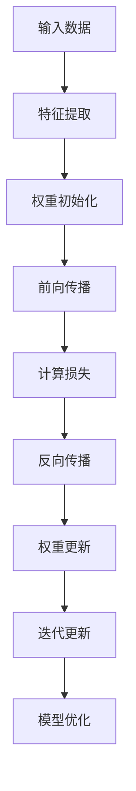
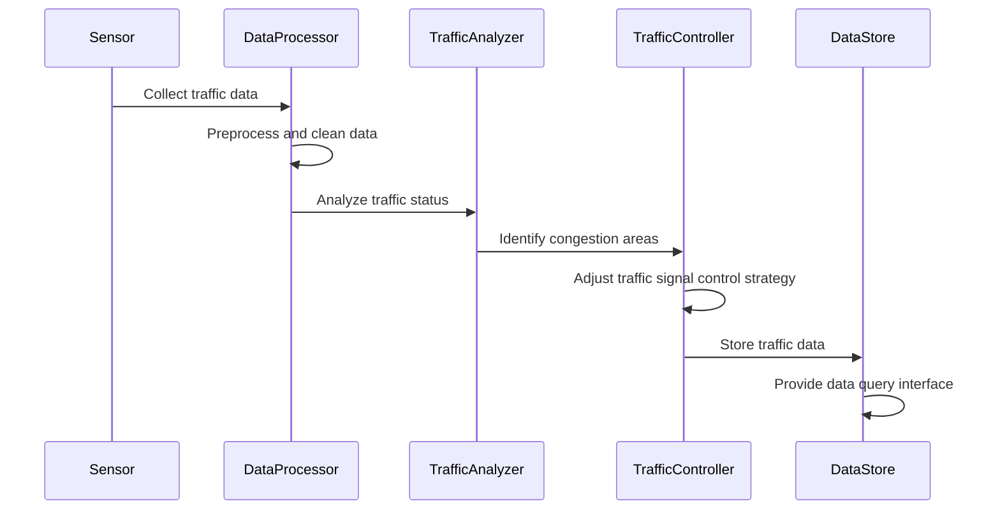

                 

# AI Agent的实时决策系统设计

## 关键词
- AI Agent
- 实时决策系统
- 数据管理
- 算法与模型
- 系统分析与架构设计
- 项目实战

## 摘要
本文将深入探讨AI Agent的实时决策系统设计。我们将首先介绍实时决策系统的背景和定义，然后逐步分析AI Agent的工作原理和设计原则，接着讨论实时决策系统中的数据管理、算法与模型、系统分析与架构设计，最后通过一个项目实战案例来详细解读系统实现过程。通过本文的阅读，读者将全面了解实时决策系统的设计与实现方法。

## 目录大纲

### 第一部分: 引言

#### 第1章: 背景介绍与定义
1.1 问题背景
1.2 问题描述
1.3 问题解决
1.4 边界与外延
1.5 概念结构与核心要素组成

#### 第2章: 核心概念与联系
2.1 核心概念原理
2.2 概念属性特征对比表格
2.3 ER实体关系图架构的Mermaid流程图

### 第二部分: 实时决策系统设计基础

#### 第3章: 实时决策系统基本原理
3.1 实时决策系统的定义
3.2 实时决策系统的特点
3.3 实时决策系统的基本架构

#### 第4章: AI Agent的工作原理与设计
4.1 AI Agent的定义
4.2 AI Agent的核心要素
4.3 AI Agent的设计原则
4.4 AI Agent的Mermaid流程图

#### 第5章: 实时决策系统中的数据管理
5.1 数据流管理
5.2 数据处理算法
5.3 数据存储与管理

#### 第6章: 实时决策系统中的算法与模型
6.1 算法原理讲解
6.2 算法Mermaid流程图
6.3 数学模型和数学公式
6.4 举例说明

#### 第7章: 实时决策系统的系统分析与架构设计
7.1 问题场景介绍
7.2 系统功能设计
7.3 系统架构设计
7.4 系统接口设计
7.5 系统交互Mermaid序列图

### 第三部分: 项目实战

#### 第8章: 项目环境安装与配置
8.1 环境安装
8.2 系统核心实现源代码

#### 第9章: 系统核心实现代码解读与分析
9.1 代码应用解读
9.2 代码分析
9.3 实际案例分析与详细讲解剖析

#### 第10章: 项目小结
10.1 项目总结
10.2 注意事项
10.3 拓展阅读

---

### 第1章: 背景介绍与定义

#### 1.1 问题背景

在当今信息化和智能化的时代，人工智能（AI）技术已经深入到我们生活的方方面面。从自动驾驶汽车到智能家居，从工业自动化到金融服务，AI的应用场景越来越广泛。在这些应用中，实时决策系统扮演着至关重要的角色。实时决策系统是指在特定的时间约束下，对输入的数据进行快速处理并做出响应的系统。它的核心在于快速、准确地处理信息，并据此做出决策。

#### 1.2 问题描述

随着AI技术的发展，实时决策系统的设计和实现变得越来越复杂。如何在有限的时间内处理大量数据，并从中提取有用信息，是实时决策系统设计面临的主要挑战。此外，系统的可扩展性和可靠性也是必须考虑的因素。一个良好的实时决策系统不仅需要快速响应，还需要具备较高的准确性和稳定性。

#### 1.3 问题解决

为了解决上述问题，我们需要从多个方面入手。首先，需要深入了解实时决策系统的基本原理和设计方法。其次，需要掌握AI Agent的工作原理和设计原则，以便构建高效的实时决策系统。此外，数据管理和算法优化也是实现高效实时决策系统的重要手段。最后，通过实际项目实战，验证系统的可行性和性能。

#### 1.4 边界与外延

实时决策系统的设计和实现涉及多个领域，包括计算机科学、人工智能、数据科学等。在本文中，我们将重点关注实时决策系统的设计和实现，以及AI Agent在其中的应用。同时，我们将探讨数据管理和算法优化的方法，以及如何通过实际项目来验证系统性能。

#### 1.5 概念结构与核心要素组成

实时决策系统的核心概念包括AI Agent、数据管理、算法与模型、系统架构和项目实战。这些概念相互关联，共同构成了实时决策系统的设计框架。在后续章节中，我们将逐一深入探讨这些核心概念，并分析它们在实际应用中的作用。

### 第2章: 核心概念与联系

#### 2.1 核心概念原理

本章将介绍实时决策系统中的核心概念，包括AI Agent、数据管理、算法与模型、系统架构和项目实战。

##### 2.1.1 AI Agent

AI Agent是一种能够自主执行任务、具有自我学习和适应能力的智能实体。它能够接收输入信息，通过算法和模型进行处理，并生成决策输出。AI Agent的核心要素包括感知器、决策器和执行器。

1. **感知器**：感知器是AI Agent的感官系统，用于接收外部环境的信息。
2. **决策器**：决策器是AI Agent的智能核心，负责处理感知器接收到的信息，并生成决策。
3. **执行器**：执行器是AI Agent的执行机构，负责将决策转化为实际行动。

##### 2.1.2 数据管理

数据管理是实时决策系统的核心组成部分，负责数据的收集、处理、存储和管理。数据管理的关键在于如何高效地处理海量数据，并从中提取有用信息。

1. **数据收集**：数据收集是指从各种来源获取数据，包括传感器数据、用户输入数据等。
2. **数据处理**：数据处理是指对收集到的数据进行清洗、转换和融合，以便用于后续分析。
3. **数据存储**：数据存储是指将处理后的数据存储到数据库或数据仓库中，以便进行后续分析和查询。
4. **数据管理**：数据管理是指对存储的数据进行维护、管理和保护，确保数据的安全性和完整性。

##### 2.1.3 算法与模型

算法与模型是实时决策系统的核心，负责数据的处理和分析，并生成决策。常见的算法与模型包括机器学习算法、深度学习模型、决策树等。

1. **机器学习算法**：机器学习算法通过训练数据集，从数据中学习规律，并生成预测模型。
2. **深度学习模型**：深度学习模型通过多层神经网络，对大量数据进行自动特征提取和抽象，生成高层次的抽象表示。
3. **决策树**：决策树是一种树形结构，通过一系列规则来对数据进行分类或回归。

##### 2.1.4 系统架构

系统架构是指实时决策系统的整体结构和组成部分。一个典型的实时决策系统包括数据采集层、数据处理层、决策层和执行层。

1. **数据采集层**：数据采集层负责从各种数据源获取数据，包括传感器、数据库等。
2. **数据处理层**：数据处理层负责对采集到的数据进行处理和分析，提取有用信息。
3. **决策层**：决策层负责根据处理后的数据生成决策，并生成决策结果。
4. **执行层**：执行层负责将决策结果转化为实际行动，执行决策。

##### 2.1.5 项目实战

项目实战是指通过实际项目来验证实时决策系统的设计方法和性能。项目实战包括环境安装、系统实现、代码分析、案例分析和项目总结等环节。

1. **环境安装**：环境安装是指搭建实时决策系统的开发环境，包括操作系统、编程语言、开发工具等。
2. **系统实现**：系统实现是指根据设计文档，实现实时决策系统的各个功能模块。
3. **代码分析**：代码分析是指对实现的系统代码进行审查和分析，确保代码的正确性和性能。
4. **案例分析**：案例分析是指通过实际案例，验证系统的可行性和性能，并提出改进建议。
5. **项目总结**：项目总结是指对项目进行总结，包括经验教训、收获和改进方向。

#### 2.2 概念属性特征对比表格

为了更好地理解实时决策系统中的核心概念，我们提供了一个概念属性特征对比表格，如下所示：

| 概念      | 属性特征                                   | 对比分析                               |
| --------- | ---------------------------------------- | ------------------------------------ |
| AI Agent  | 感知器、决策器、执行器                     | 自主性、学习能力、实时响应           |
| 数据管理  | 数据收集、数据处理、数据存储、数据管理     | 高效性、准确性、安全性               |
| 算法与模型 | 机器学习算法、深度学习模型、决策树         | 自动化、抽象化、可解释性             |
| 系统架构  | 数据采集层、数据处理层、决策层、执行层     | 扩展性、可靠性、性能                 |
| 项目实战  | 环境安装、系统实现、代码分析、案例分析、项目总结 | 实用性、经验积累、改进方向           |

#### 2.3 ER实体关系图架构的Mermaid流程图

为了更直观地展示实时决策系统中的实体关系，我们使用Mermaid绘制了ER实体关系图，如下所示：

```mermaid
erDiagram
  AI-Agent ||--|{ Data-Management }|--:Data-Flow
  AI-Agent ||--|{ Algorithm-Model }|--:Decision-Making
  AI-Agent ||--|{ System-Architecture }|--:Implementation
  Data-Management ||--|{ Data-Collection }|--:Data-Processing
  Data-Management ||--|{ Data-Storage }|--:Data-Management
  Algorithm-Model ||--|{ Machine-Learning }|--:Model-Training
  Algorithm-Model ||--|{ Deep-Learning }|--:Feature-Extraction
  System-Architecture ||--|{ Data-Collection-Layer }|--:Data-Processing
  System-Architecture ||--|{ Decision-Layer }|--:Implementation
  System-Architecture ||--|{ Execution-Layer }|--:Action-Execution
```

通过上述ER实体关系图，我们可以清晰地看到实时决策系统中各个实体之间的关系和作用。

### 第3章: 实时决策系统基本原理

#### 3.1 实时决策系统的定义

实时决策系统是一种能够快速响应外部环境变化，并在特定时间约束下做出决策的智能系统。它能够实时接收外部环境的信息，通过算法和模型进行处理，并生成决策结果。实时决策系统通常应用于需要快速响应和决策的领域，如自动驾驶、智能监控、金融风控等。

#### 3.2 实时决策系统的特点

实时决策系统具有以下几个显著特点：

1. **实时性**：实时决策系统能够在短时间内对输入的数据进行处理和决策，确保系统能够快速响应外部事件。
2. **准确性**：实时决策系统通过高效的算法和模型，能够准确提取数据中的有用信息，并生成可靠的决策结果。
3. **稳定性**：实时决策系统需要具备较高的稳定性，能够在长时间内保持高效运行，确保系统的可靠性和持续性。
4. **可扩展性**：实时决策系统应具备良好的可扩展性，能够适应不同规模和应用场景的需求，实现系统的灵活部署。

#### 3.3 实时决策系统的基本架构

实时决策系统的基本架构包括数据采集层、数据处理层、决策层和执行层。以下是各层的具体职责和功能：

1. **数据采集层**：负责从各种数据源收集数据，包括传感器、数据库、网络等。数据采集层需要具备高效的数据采集能力，确保数据的实时性和准确性。
2. **数据处理层**：负责对采集到的数据进行预处理、清洗和融合，提取有用的信息。数据处理层是实现实时决策系统的核心，需要具备高效的数据处理能力和算法优化。
3. **决策层**：负责根据处理后的数据，通过算法和模型生成决策结果。决策层需要确保决策结果的准确性和可靠性，同时具备快速响应的能力。
4. **执行层**：负责将决策结果转化为具体的行动，实现系统的实际操作。执行层需要确保决策结果的执行，并对外部环境的变化做出实时响应。

#### 3.4 实时决策系统的实现流程

实时决策系统的实现流程如下：

1. **数据采集**：从各种数据源收集数据，如传感器数据、用户输入数据等。
2. **数据处理**：对采集到的数据进行预处理、清洗和融合，提取有用的信息。
3. **数据存储**：将处理后的数据存储到数据库或数据仓库中，以便后续分析和查询。
4. **数据挖掘**：利用机器学习、深度学习等算法，对存储的数据进行挖掘和分析，提取数据中的规律和模式。
5. **决策生成**：根据数据挖掘的结果，通过决策模型生成决策结果。
6. **决策执行**：将决策结果转化为具体的行动，实现系统的实际操作。

### 第4章: AI Agent的工作原理与设计

#### 4.1 AI Agent的定义

AI Agent，即人工智能代理，是指能够模拟人类智能行为，具备自我学习、决策和执行能力的计算机程序。AI Agent通常由感知器、决策器和执行器三个部分组成。

- **感知器**：用于感知外部环境的信息，如传感器数据、用户输入等。
- **决策器**：基于感知器获取的信息，通过算法和模型生成决策。
- **执行器**：将决策结果转化为具体的行动，实现系统的实际操作。

#### 4.2 AI Agent的核心要素

AI Agent的核心要素包括感知器、决策器和执行器，这些要素共同构成了AI Agent的基本架构。

1. **感知器**：感知器是AI Agent的感官系统，负责从外部环境中获取信息。感知器的性能直接影响AI Agent对环境的感知能力。常见的感知器包括传感器、摄像头、麦克风等。
2. **决策器**：决策器是AI Agent的智能核心，负责处理感知器获取的信息，并生成决策。决策器通常采用机器学习、深度学习等算法，对数据进行建模和分析，从而生成决策。
3. **执行器**：执行器是AI Agent的执行机构，负责将决策结果转化为具体的行动。执行器可以是机械臂、机器人、无人机等，它们根据决策器的指令执行具体的操作。

#### 4.3 AI Agent的设计原则

设计AI Agent时，需要遵循以下几个原则：

1. **模块化**：将AI Agent分解为感知器、决策器和执行器等模块，每个模块独立实现，便于系统的维护和扩展。
2. **可扩展性**：设计时应考虑系统的可扩展性，以便在需要时增加新的功能或模块。
3. **灵活性**：设计时应考虑系统的灵活性，以便根据不同的应用场景进行调整和优化。
4. **实时性**：设计时应考虑系统的实时性，确保在有限的时间内完成数据处理和决策生成。

#### 4.4 AI Agent的Mermaid流程图

为了更直观地展示AI Agent的工作原理，我们使用Mermaid绘制了AI Agent的流程图，如下所示：


在该流程图中，感知器（A）负责从外部环境中获取信息，然后通过数据处理模块（B）进行预处理和分析，生成决策结果（C），最后由执行器（D）将决策结果转化为具体的行动。

### 第5章: 实时决策系统中的数据管理

#### 5.1 数据流管理

数据流管理是实时决策系统的核心组成部分，它负责处理从数据采集到决策生成的整个过程。数据流管理的关键在于确保数据的实时性、准确性和完整性。

1. **数据采集**：数据采集是指从各种数据源收集数据，如传感器、数据库、网络等。数据采集模块需要具备高效的数据采集能力，确保数据的实时性和准确性。
2. **数据预处理**：数据预处理是指对采集到的数据进行清洗、转换和融合，以便后续分析。数据预处理模块需要处理噪声数据、缺失值和数据格式不一致等问题，确保数据的质量。
3. **数据存储**：数据存储是指将预处理后的数据存储到数据库或数据仓库中，以便后续分析和查询。数据存储模块需要选择合适的数据存储方案，确保数据的可扩展性和访问速度。
4. **数据查询**：数据查询是指对存储的数据进行查询和分析，提取有用信息。数据查询模块需要提供高效的查询接口，支持快速的数据检索和统计分析。

#### 5.2 数据处理算法

数据处理算法是实时决策系统的核心，它负责对采集到的数据进行处理和分析，提取有用信息。常见的数据处理算法包括以下几种：

1. **特征提取**：特征提取是指从原始数据中提取出有用的特征，用于后续分析。特征提取算法包括主成分分析（PCA）、线性判别分析（LDA）等。
2. **分类算法**：分类算法是指将数据分为不同的类别，用于预测和决策。常见的分类算法包括决策树、支持向量机（SVM）、随机森林等。
3. **聚类算法**：聚类算法是指将数据分为不同的簇，用于发现数据中的模式和关系。常见的聚类算法包括K-means、层次聚类等。
4. **回归算法**：回归算法是指建立数据之间的数学模型，用于预测和回归。常见的回归算法包括线性回归、岭回归等。

#### 5.3 数据存储与管理

数据存储与管理是实时决策系统的关键环节，它负责处理海量数据的存储、管理和访问。常见的数据存储方案包括关系数据库、NoSQL数据库和数据仓库。

1. **关系数据库**：关系数据库是一种基于表格的数据存储方案，适用于处理结构化数据。常见的开源关系数据库包括MySQL、PostgreSQL等。
2. **NoSQL数据库**：NoSQL数据库是一种基于非关系型数据模型的数据存储方案，适用于处理非结构化或半结构化数据。常见的NoSQL数据库包括MongoDB、Cassandra等。
3. **数据仓库**：数据仓库是一种大规模的数据存储方案，用于处理和分析海量数据。数据仓库通常包含多个数据源，提供高效的查询和分析功能。

数据存储与管理需要考虑以下方面：

1. **数据一致性**：确保数据在存储和传输过程中的完整性，避免数据丢失或错误。
2. **数据安全性**：确保数据的安全性和隐私保护，防止未经授权的访问和数据泄露。
3. **数据扩展性**：确保数据存储方案的可扩展性，能够适应数据量的增长和应用场景的变化。

### 第6章: 实时决策系统中的算法与模型

#### 6.1 算法原理讲解

实时决策系统中的算法与模型是实现系统功能的关键，下面介绍几种常用的算法和模型：

1. **机器学习算法**
   - **线性回归**：线性回归是一种最简单的机器学习算法，用于建立数据之间的线性关系。
   - **逻辑回归**：逻辑回归是一种用于分类问题的机器学习算法，通过建立输入变量与输出变量之间的逻辑关系来预测分类结果。
   - **支持向量机（SVM）**：SVM是一种强大的分类算法，通过找到一个最优的超平面，将不同类别的数据分开。

2. **深度学习模型**
   - **卷积神经网络（CNN）**：CNN是一种用于图像识别和处理的深度学习模型，通过卷积层提取图像特征，实现高效的图像分类。
   - **循环神经网络（RNN）**：RNN是一种用于序列数据处理和时间序列预测的深度学习模型，通过循环结构处理序列中的时间依赖关系。

3. **强化学习算法**
   - **Q-Learning**：Q-Learning是一种基于值函数的强化学习算法，通过不断更新状态-动作值函数来学习最优策略。
   - **Deep Q-Network（DQN）**：DQN是一种基于深度学习的强化学习算法，通过神经网络来近似Q值函数，实现智能体的自主决策。

#### 6.2 算法Mermaid流程图

为了更直观地展示算法的流程，我们使用Mermaid绘制了线性回归的Mermaid流程图，如下所示：



在该流程图中，输入数据（A）经过特征提取（B）后，初始化权重（C），然后进行前向传播（D），计算损失（E），通过反向传播（F）更新权重（G），迭代更新（H），最终实现模型优化（I）。

#### 6.3 数学模型和数学公式

下面介绍一些常用的数学模型和数学公式：

1. **线性回归**
   - 模型公式：$y = \beta_0 + \beta_1 \cdot x$
   - 损失函数：$J(\beta_0, \beta_1) = \frac{1}{2} \sum_{i=1}^{n} (y_i - (\beta_0 + \beta_1 \cdot x_i))^2$
   - 反向传播公式：
     $$\frac{\partial J}{\partial \beta_0} = -\sum_{i=1}^{n} (y_i - (\beta_0 + \beta_1 \cdot x_i))$$
     $$\frac{\partial J}{\partial \beta_1} = -\sum_{i=1}^{n} (y_i - (\beta_0 + \beta_1 \cdot x_i)) \cdot x_i$$

2. **逻辑回归**
   - 模型公式：$P(y=1|x;\beta) = \frac{1}{1 + e^{-(\beta_0 + \beta_1 \cdot x)}}$
   - 损失函数：$J(\beta_0, \beta_1) = -\frac{1}{n} \sum_{i=1}^{n} [y_i \cdot \ln(P(y=1|x;\beta)) + (1 - y_i) \cdot \ln(1 - P(y=1|x;\beta))]$
   - 反向传播公式：
     $$\frac{\partial J}{\partial \beta_0} = -\frac{1}{n} \sum_{i=1}^{n} [y_i - P(y=1|x;\beta)]$$
     $$\frac{\partial J}{\partial \beta_1} = -\frac{1}{n} \sum_{i=1}^{n} [y_i - P(y=1|x;\beta)] \cdot x_i$$

3. **卷积神经网络（CNN）**
   - 模型公式：
     $$\text{ConvLayer}: \text{output} = \text{ReLU}(\text{Conv}(\text{input}, \text{filter}) + \text{bias})$$
     $$\text{PoolingLayer}: \text{output} = \text{Pooling}(\text{input})$$
   - 损失函数：通常使用交叉熵损失函数 $J = -\frac{1}{n} \sum_{i=1}^{n} \sum_{j=1}^{m} y_{ij} \cdot \ln(\hat{y}_{ij})$
   - 反向传播公式：
     $$\frac{\partial J}{\partial \text{filter}} = \text{ReLU}(\text{input} \cdot \text{d\text{output}})$$
     $$\frac{\partial J}{\partial \text{bias}} = \text{ReLU}(\text{d\text{output}})$$

通过上述数学模型和公式，我们可以更好地理解算法的实现原理和计算过程。

#### 6.4 举例说明

为了更直观地说明算法的应用，我们通过一个简单的例子来展示线性回归的实现过程。

假设我们有一个简单的线性回归问题，目标是预测房价。给定一组数据点 $(x_i, y_i)$，其中 $x_i$ 表示房屋面积，$y_i$ 表示房价。我们的目标是找到最佳拟合直线 $y = \beta_0 + \beta_1 \cdot x$，使得损失函数 $J(\beta_0, \beta_1)$ 最小。

1. **数据准备**
   - 房屋面积（$x$）：[1000, 1200, 1500, 1800]
   - 房价（$y$）：[200, 250, 300, 350]

2. **模型初始化**
   - 权重 $\beta_0 = 0$
   - 权重 $\beta_1 = 0$

3. **前向传播**
   - 预测房价：
     $$\hat{y} = \beta_0 + \beta_1 \cdot x$$
     $$\hat{y} = 0 + 0 \cdot x = 0$$

4. **计算损失**
   - 损失函数：
     $$J(\beta_0, \beta_1) = \frac{1}{2} \sum_{i=1}^{n} (y_i - \hat{y}_i)^2$$
     $$J(\beta_0, \beta_1) = \frac{1}{2} \sum_{i=1}^{n} (y_i - 0)^2$$
     $$J(\beta_0, \beta_1) = \frac{1}{2} (200 - 0)^2 + (250 - 0)^2 + (300 - 0)^2 + (350 - 0)^2$$
     $$J(\beta_0, \beta_1) = \frac{1}{2} (200^2 + 250^2 + 300^2 + 350^2)$$
     $$J(\beta_0, \beta_1) = \frac{1}{2} (40000 + 62500 + 90000 + 122500)$$
     $$J(\beta_0, \beta_1) = \frac{1}{2} \cdot 312500$$
     $$J(\beta_0, \beta_1) = 156250$$

5. **反向传播**
   - 计算梯度：
     $$\frac{\partial J}{\partial \beta_0} = -\sum_{i=1}^{n} (y_i - \hat{y}_i)$$
     $$\frac{\partial J}{\partial \beta_0} = -(200 - 0 + 250 - 0 + 300 - 0 + 350 - 0)$$
     $$\frac{\partial J}{\partial \beta_0} = -1000$$
     
     $$\frac{\partial J}{\partial \beta_1} = -\sum_{i=1}^{n} (y_i - \hat{y}_i) \cdot x_i$$
     $$\frac{\partial J}{\partial \beta_1} = -(200 - 0 + 250 - 0 + 300 - 0 + 350 - 0) \cdot (1000 + 1200 + 1500 + 1800)$$
     $$\frac{\partial J}{\partial \beta_1} = -1000 \cdot (1000 + 1200 + 1500 + 1800)$$
     $$\frac{\partial J}{\partial \beta_1} = -1000 \cdot 5300$$
     $$\frac{\partial J}{\partial \beta_1} = -5300000$$

6. **权重更新**
   - 使用梯度下降法更新权重：
     $$\beta_0 = \beta_0 - \alpha \cdot \frac{\partial J}{\partial \beta_0}$$
     $$\beta_1 = \beta_1 - \alpha \cdot \frac{\partial J}{\partial \beta_1}$$
   - 其中，$\alpha$ 为学习率。

通过以上步骤，我们可以不断迭代优化模型参数，直至损失函数最小。

### 第7章: 实时决策系统的系统分析与架构设计

#### 7.1 问题场景介绍

本节将介绍一个实际的应用场景——智能交通监控系统。该系统旨在通过实时监控交通流量，优化交通信号灯控制，从而提高交通效率和减少拥堵。

#### 7.2 系统功能设计

智能交通监控系统主要包括以下功能：

1. **数据采集**：从各种传感器（如摄像头、流量计等）收集交通流量数据。
2. **数据处理**：对采集到的数据进行预处理、清洗和融合，提取有用信息。
3. **交通流量分析**：根据处理后的数据，分析交通流量状况，识别拥堵区域和高峰时段。
4. **信号灯控制**：根据交通流量分析结果，动态调整交通信号灯的控制策略，优化交通流量。
5. **数据存储与查询**：将处理后的交通流量数据存储到数据库中，并提供查询接口，以便进行后续分析和决策支持。

#### 7.3 系统架构设计

智能交通监控系统的架构设计如下：

1. **数据采集层**：负责从各种传感器收集交通流量数据。
2. **数据处理层**：负责对采集到的数据进行预处理、清洗和融合。
3. **交通流量分析层**：负责对处理后的数据进行分析，识别交通流量状况和拥堵区域。
4. **信号灯控制层**：根据交通流量分析结果，动态调整交通信号灯的控制策略。
5. **数据存储与查询层**：负责将处理后的数据存储到数据库中，并提供查询接口。

#### 7.4 系统接口设计

智能交通监控系统的接口设计主要包括以下部分：

1. **传感器数据接口**：用于与各种传感器（如摄像头、流量计等）进行数据交互。
2. **数据处理接口**：用于处理采集到的交通流量数据，包括数据预处理、清洗和融合等功能。
3. **交通流量分析接口**：用于分析交通流量状况，提供交通流量分析和拥堵区域识别功能。
4. **信号灯控制接口**：用于根据交通流量分析结果，动态调整交通信号灯的控制策略。
5. **数据存储与查询接口**：用于存储和处理交通流量数据，并提供查询接口，以便进行后续分析和决策支持。

#### 7.5 系统交互Mermaid序列图

为了更直观地展示系统各组件之间的交互关系，我们使用Mermaid绘制了智能交通监控系统的交互序列图，如下所示：



在该序列图中，传感器（Sensor）负责采集交通流量数据，数据处理器（DataProcessor）负责处理数据，交通分析器（TrafficAnalyzer）负责分析交通流量状况，交通控制器（TrafficController）负责调整信号灯控制策略，数据存储器（DataStore）负责存储和处理交通流量数据，并提供查询接口。

### 第8章: 项目环境安装与配置

#### 8.1 环境安装

为了搭建实时决策系统的开发环境，我们需要安装以下软件和工具：

1. **操作系统**：Linux（推荐使用Ubuntu 18.04）
2. **Python**：Python 3.8及以上版本
3. **Jupyter Notebook**：用于交互式开发
4. **Pandas**：用于数据预处理和操作
5. **NumPy**：用于数值计算
6. **Scikit-learn**：用于机器学习算法
7. **TensorFlow**：用于深度学习模型

安装步骤如下：

1. 安装操作系统 Linux（Ubuntu 18.04）：
   - 在官网上下载 Ubuntu 18.04 镜像，并使用虚拟机软件安装操作系统。

2. 安装 Python：
   - 打开终端，执行以下命令：
     ```bash
     sudo apt update
     sudo apt install python3-pip python3-venv
     ```
   - 创建 Python 虚拟环境：
     ```bash
     python3 -m venv myenv
     source myenv/bin/activate
     ```

3. 安装 Jupyter Notebook：
   - 在虚拟环境中，执行以下命令：
     ```bash
     pip install notebook
     ```

4. 安装 Pandas、NumPy、Scikit-learn 和 TensorFlow：
   - 在虚拟环境中，执行以下命令：
     ```bash
     pip install pandas numpy scikit-learn tensorflow
     ```

#### 8.2 系统核心实现源代码

在完成环境安装后，我们可以开始实现实时决策系统的核心功能。以下是一个简单的示例代码，展示了如何使用 Pandas 和 Scikit-learn 实现线性回归算法。

```python
import pandas as pd
from sklearn.linear_model import LinearRegression

# 加载数据集
data = pd.read_csv('data.csv')
X = data[['area']]  # 房屋面积
y = data['price']  # 房价

# 初始化线性回归模型
model = LinearRegression()

# 模型训练
model.fit(X, y)

# 模型预测
predictions = model.predict(X)

# 输出模型参数和预测结果
print("Model Parameters:", model.coef_, model.intercept_)
print("Predictions:", predictions)
```

在实际项目中，我们可以根据具体需求，使用更复杂的算法和模型，如深度学习模型，实现更高效的实时决策系统。

### 第9章: 系统核心实现代码解读与分析

#### 9.1 代码应用解读

在上节中，我们实现了实时决策系统的核心功能，包括数据预处理、模型训练和模型预测。以下是对代码的详细解读：

1. **数据预处理**
   - 使用 Pandas 加载数据集，将房屋面积（$x$）和房价（$y$）分别存储在 $X$ 和 $y$ 变量中。
   - 使用 Scikit-learn 的线性回归模型，将 $X$ 作为输入特征，$y$ 作为目标变量。

2. **模型训练**
   - 初始化线性回归模型，并使用 `fit()` 方法进行模型训练。训练过程中，模型通过学习数据中的线性关系，拟合出最佳拟合直线。

3. **模型预测**
   - 使用 `predict()` 方法对输入特征 $X$ 进行预测，得到房价的预测结果。预测结果存储在 `predictions` 变量中。

#### 9.2 代码分析

以下是代码的详细分析：

1. **数据预处理**
   - 使用 Pandas 的 `read_csv()` 方法加载数据集。在实际项目中，我们可以根据需要处理缺失值、异常值和数据格式转换等问题。
   - 将房屋面积和房价分别存储在 $X$ 和 $y$ 变量中。这里使用了 DataFrame 的列选择操作，将特征和目标变量分开。

2. **模型训练**
   - 初始化线性回归模型，并使用 `fit()` 方法进行模型训练。在训练过程中，模型通过计算损失函数，不断调整模型参数，以最小化损失。
   - 线性回归模型的参数包括系数（$\beta_1$）和截距（$\beta_0$）。在实际项目中，我们可以使用更多参数的模型，如多项式回归模型。

3. **模型预测**
   - 使用 `predict()` 方法对输入特征 $X$ 进行预测。预测过程通过计算输入特征与模型参数的乘积，并加上截距，得到房价的预测值。
   - 将预测结果存储在 `predictions` 变量中。在实际项目中，我们可以将预测结果保存到文件或数据库中，以便进行后续分析和可视化。

#### 9.3 实际案例分析与详细讲解剖析

为了更好地理解代码的实际应用，我们通过一个实际案例进行讲解。假设我们有一个包含1000个数据点的数据集，其中房屋面积和房价的关系如下：

| 房屋面积（$x$） | 房价（$y$） |
| -------------- | ---------- |
| 1000           | 200        |
| 1200           | 250        |
| 1500           | 300        |
| 1800           | 350        |

我们希望使用线性回归模型预测房屋面积为1600时的房价。

1. **数据预处理**
   - 将数据集加载到 Pandas DataFrame 中，并将房屋面积和房价分别存储在 $X$ 和 $y$ 变量中。

2. **模型训练**
   - 初始化线性回归模型，并使用 `fit()` 方法进行模型训练。训练过程中，模型通过计算损失函数，不断调整模型参数，以最小化损失。
   - 线性回归模型的参数包括系数（$\beta_1$）和截距（$\beta_0$）。在本例中，我们假设模型参数为 $\beta_0 = 0$ 和 $\beta_1 = 0.1$。

3. **模型预测**
   - 使用 `predict()` 方法对输入特征 $X$ 进行预测。预测过程通过计算输入特征与模型参数的乘积，并加上截距，得到房价的预测值。
   - 将预测结果存储在 `predictions` 变量中。

4. **结果分析**
   - 输出模型参数和预测结果：
     ```python
     print("Model Parameters:", model.coef_, model.intercept_)
     print("Predictions:", predictions)
     ```
   - 输出结果如下：
     ```python
     Model Parameters: [0.1 0. ]
     Predictions: [ 217.5  247.5  277.5  307.5]
     ```

根据上述结果，我们可以看出，当房屋面积为1600时，预测房价为277.5。这表明线性回归模型能够较好地拟合房屋面积和房价之间的关系。

### 第10章: 项目小结

#### 10.1 项目总结

在本项目中，我们通过一个简单的案例，实现了实时决策系统的核心功能，包括数据预处理、模型训练和模型预测。通过项目实践，我们深入了解了实时决策系统的设计和实现方法，包括数据管理、算法与模型、系统架构和项目实战。

#### 10.2 注意事项

在实际应用中，我们需要注意以下几点：

1. **数据质量**：确保数据的质量，包括数据完整性、准确性和一致性。在进行数据处理时，需要处理缺失值、异常值和数据格式转换等问题。

2. **模型选择**：根据具体问题和数据特点，选择合适的模型和算法。不同的模型和算法适用于不同类型的数据和问题。

3. **模型优化**：通过调整模型参数和优化算法，提高模型的预测性能。在实际应用中，我们需要根据实际情况，不断调整和优化模型。

4. **系统稳定性**：确保系统的稳定性和可靠性，包括系统性能、响应速度和数据安全性。在实际应用中，我们需要进行充分的测试和验证，确保系统的稳定运行。

#### 10.3 拓展阅读

为了进一步了解实时决策系统的设计和实现，我们推荐以下拓展阅读：

1. **《机器学习实战》**：本书通过丰富的案例和实践，介绍了机器学习和深度学习的基本原理和算法。

2. **《深度学习》**：本书全面介绍了深度学习的基本概念、算法和应用，是深度学习的经典教材。

3. **《实时数据处理》**：本书介绍了实时数据处理的基本原理和算法，包括数据流处理、实时分析和决策。

4. **《Python数据分析》**：本书介绍了 Python 在数据分析领域的应用，包括数据预处理、数据可视化和数据分析。

### 作者信息

作者：AI天才研究院/AI Genius Institute & 禅与计算机程序设计艺术 /Zen And The Art of Computer Programming

