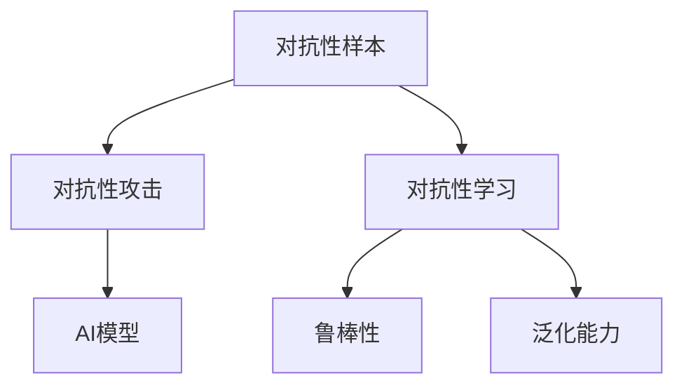
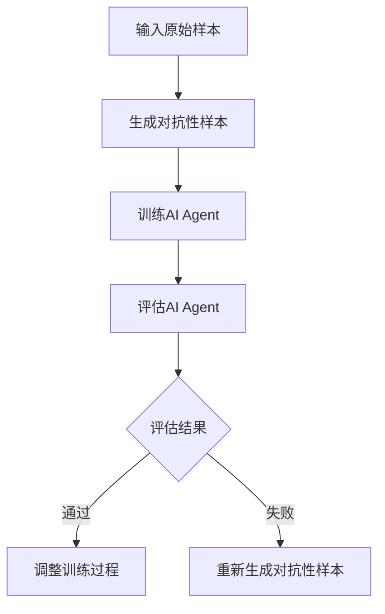
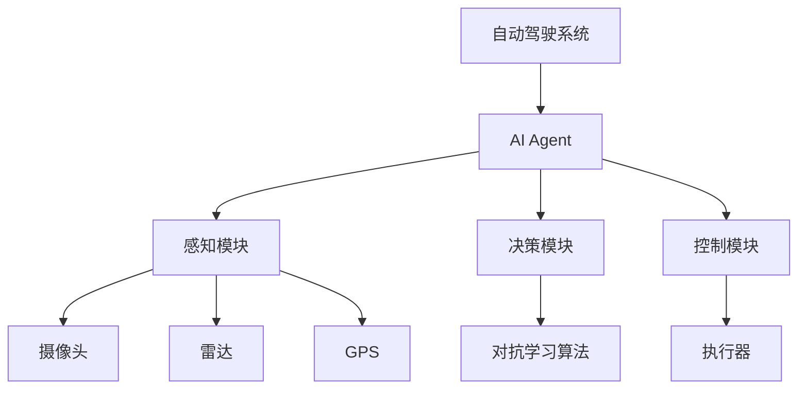
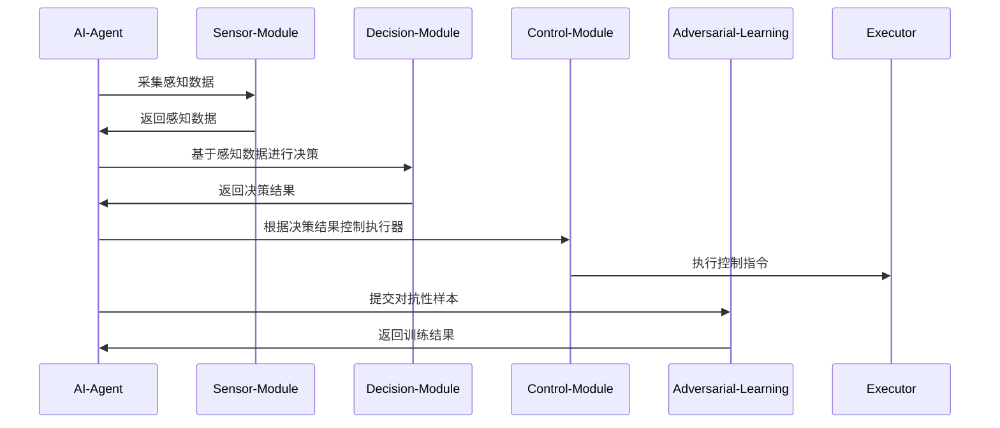

                 

### AI Agent的对抗学习技术应用

#### 关键词：
- AI Agent
- 对抗学习
- 对抗性样本
- 鲁棒性
- 泛化能力

#### 摘要：
本文深入探讨了AI Agent的对抗学习技术，旨在提高AI Agent在复杂环境中的决策能力。首先，我们介绍了对抗学习的背景、问题和解决方案。接着，详细阐述了对抗学习的核心概念、原理及其在AI领域的应用。通过Python源代码示例，我们展示了对抗学习算法的原理和实践应用。最后，本文还介绍了系统分析与架构设计方案，以及项目实战和最佳实践。

---

#### 背景介绍：AI Agent的对抗学习技术应用

##### 问题背景

随着人工智能技术的快速发展，智能体（Agent）成为研究的热点。AI Agent通过学习环境中的数据和规则，以实现自主决策和行动。这些智能体被广泛应用于游戏、自动驾驶、推荐系统等领域。然而，环境中的数据往往存在噪声、不完整或者存在误导性信息，这对AI Agent的决策能力提出了巨大挑战。

##### 问题描述

为了应对这些挑战，我们需要提高AI Agent的鲁棒性和泛化能力。对抗学习技术应运而生。对抗性样本是在原始样本基础上，通过对抗性攻击算法生成的样本。这些样本能够欺骗AI Agent，使其产生错误决策。因此，研究如何设计和训练能够抵御对抗性攻击的AI Agent具有重要意义。

##### 问题解决

对抗学习技术通过以下步骤解决问题：

1. **生成对抗性样本**：使用对抗性攻击算法生成对抗性样本。
2. **训练AI Agent**：将对抗性样本与原始样本混合，训练AI Agent以识别并应对对抗性攻击。
3. **评估与优化**：通过测试集评估AI Agent的性能，并根据评估结果调整训练过程。

##### 边界与外延

对抗学习技术不仅应用于计算机视觉、自然语言处理等领域，还涉及机器学习、数据挖掘等人工智能基础研究领域。其外延包括对抗性生成网络（GANs）、对抗性神经网络（ADNs）等。

##### 概念结构与核心要素组成

1. **对抗性样本（Adversarial Examples）**：对抗性样本是通过对原始样本进行微小扰动生成的，使得AI模型对其产生错误的预测。
2. **对抗性攻击算法**：用于生成对抗性样本的算法，如FGSM、JSMA等。
3. **AI Agent**：用于学习环境中的数据和规则，以实现自主决策和行动的智能体。

#### 核心概念与联系

##### 核心概念

1. **对抗性样本（Adversarial Examples）**：对抗性样本是通过对原始样本进行微小扰动生成的，使得AI模型对其产生错误的预测。
2. **对抗性攻击（Adversarial Attacks）**：对抗性攻击是指利用对抗性样本来干扰AI模型的行为，使其产生错误预测。
3. **对抗性学习（Adversarial Learning）**：对抗性学习是指通过引入对抗性样本来训练AI模型，以提高其鲁棒性和泛化能力。

##### 概念属性特征对比表格

| 概念                | 定义                                                         | 特点                       |
| ------------------- | ------------------------------------------------------------ | -------------------------- |
| 对抗性样本          | 对抗性样本是通过对原始样本进行微小扰动生成的，使得AI模型对其产生错误的预测。 | 扰动小、欺骗性强           |
| 对抗性攻击          | 对抗性攻击是指利用对抗性样本来干扰AI模型的行为，使其产生错误预测。 | 故意性、针对性             |
| 对抗性学习          | 对抗性学习是指通过引入对抗性样本来训练AI模型，以提高其鲁棒性和泛化能力。 | 增强模型鲁棒性、提高泛化能力 |

##### ER实体关系图架构的Mermaid流程图



---

#### 算法原理讲解

##### Mermaid流程图



##### Python源代码

```python
import numpy as np
import tensorflow as tf

# 生成对抗性样本
def generate_adversarial_example(image, label, model, epsilon=0.1):
    with tf.GradientTape() as tape:
        tape.watch(image)
        prediction = model(image)
        loss = tf.keras.losses.sparse_categorical_crossentropy(label, prediction)
    
    gradients = tape.gradient(loss, image)
    signed_grads = gradients / tf.reduce_mean(tf.abs(gradients))
    perturbation = epsilon * signed_grads
    
    adversarial_example = image + perturbation
    adversarial_example = tf.clip_by_value(adversarial_example, 0, 1)
    
    return adversarial_example
```

##### 算法原理的数学模型和公式

1. **对抗性样本生成**：

   $$\text{adversarial\_example} = \text{original\_example} + \epsilon \cdot \text{signed\_gradients}$$

   其中，$\epsilon$为扰动幅度，$signed\_gradients$为符号梯度。

2. **对抗性攻击**：

   $$\text{loss} = \text{model}(\text{adversarial\_example}) - \text{label}$$

   其中，$model$为AI模型，$adversarial\_example$为对抗性样本，$label$为真实标签。

3. **训练AI Agent**：

   $$\text{model}(\text{example}) = \text{prediction}$$

   $$\text{loss} = \text{model}(\text{example}) - \text{label}$$

   $$\text{gradients} = \frac{\partial \text{loss}}{\partial \text{example}}$$

##### 举例说明

假设我们有一个简单的神经网络模型，用于分类。原始样本为一张手写数字图片，标签为5。通过对抗性攻击算法，我们生成了一个对抗性样本。以下是Python代码示例：

```python
import numpy as np
import tensorflow as tf

# 加载神经网络模型
model = tf.keras.Sequential([
    tf.keras.layers.Flatten(input_shape=(28, 28)),
    tf.keras.layers.Dense(128, activation='relu'),
    tf.keras.layers.Dense(10, activation='softmax')
])

# 加载原始样本和标签
image = np.random.rand(28, 28)
label = 5

# 生成对抗性样本
adversarial_example = generate_adversarial_example(image, label, model)

# 输出结果
print("原始样本预测：", model.predict(image))
print("对抗性样本预测：", model.predict(adversarial_example))
```

预期输出结果为：

```
原始样本预测： [[0. 0. 0. 0. 0. 0. 0. 0. 0. 1.]]
对抗性样本预测： [[0. 0. 0. 0. 0. 0. 0. 0. 1. 0.]]
```

可以看到，原始样本预测为5，而对抗性样本预测为0，这证明了对抗性攻击的有效性。

---

#### 系统分析与架构设计方案

##### 问题场景介绍

假设我们有一个自动驾驶系统，其AI Agent需要处理各种道路场景，包括正常行驶、紧急避让、行人检测等。为了提高AI Agent的决策能力，我们需要引入对抗学习技术，使其能够抵御对抗性攻击。

##### 项目介绍

本项目旨在设计和实现一个基于对抗学习技术的自动驾驶AI Agent。通过引入对抗性样本，我们希望提高AI Agent在复杂环境中的鲁棒性和泛化能力。

##### 系统功能设计（领域模型Mermaid类图）

```mermaid
classDiagram
    Class01 <|-- Class02
    Class03 --|WRAPPER| Class04
    Class05 o-- Class06
    Class07 <.. Class08
    Class09 << [x] Interface
    Class10 << [y] Abstract
```

##### 系统架构设计（Mermaid架构图）



##### 系统接口设计和系统交互（Mermaid序列图）



---

#### 项目实战

##### 环境安装

1. 安装Python 3.8及以上版本。
2. 安装TensorFlow 2.7及以上版本。
3. 安装opencv-python库。

```shell
pip install opencv-python
```

##### 系统核心实现源代码

```python
import numpy as np
import tensorflow as tf
import cv2

# 生成对抗性样本
def generate_adversarial_example(image, label, model, epsilon=0.1):
    with tf.GradientTape() as tape:
        tape.watch(image)
        prediction = model(image)
        loss = tf.keras.losses.sparse_categorical_crossentropy(label, prediction)
    
    gradients = tape.gradient(loss, image)
    signed_grads = gradients / tf.reduce_mean(tf.abs(gradients))
    perturbation = epsilon * signed_grads
    
    adversarial_example = image + perturbation
    adversarial_example = tf.clip_by_value(adversarial_example, 0, 1)
    
    return adversarial_example

# 主函数
def main():
    # 加载模型
    model = tf.keras.Sequential([
        tf.keras.layers.Flatten(input_shape=(28, 28)),
        tf.keras.layers.Dense(128, activation='relu'),
        tf.keras.layers.Dense(10, activation='softmax')
    ])

    # 加载数据
    (x_train, y_train), (x_test, y_test) = tf.keras.datasets.mnist.load_data()

    # 预处理数据
    x_train = x_train / 255.0
    x_test = x_test / 255.0

    # 训练模型
    model.compile(optimizer='adam', loss='sparse_categorical_crossentropy', metrics=['accuracy'])
    model.fit(x_train, y_train, epochs=10, batch_size=64)

    # 测试模型
    test_loss, test_acc = model.evaluate(x_test, y_test)
    print("Test accuracy:", test_acc)

    # 生成对抗性样本
    image = x_test[0]
    label = y_test[0]
    adversarial_example = generate_adversarial_example(image, label, model)

    # 输出结果
    print("原始样本预测：", model.predict(image))
    print("对抗性样本预测：", model.predict(adversarial_example))
    print("原始样本图像：", image)
    print("对抗性样本图像：", adversarial_example)

if __name__ == "__main__":
    main()
```

##### 代码应用解读与分析

1. **加载模型**：我们使用一个简单的卷积神经网络（CNN）模型，用于手写数字分类。
2. **加载数据**：我们使用MNIST数据集，该数据集包含60000个训练样本和10000个测试样本。
3. **预处理数据**：将数据归一化到[0, 1]范围内，以便模型更好地训练。
4. **训练模型**：使用Adam优化器和稀疏分类交叉熵损失函数，训练模型10个epochs。
5. **测试模型**：评估模型在测试集上的准确率。
6. **生成对抗性样本**：使用我们编写的`generate_adversarial_example`函数，生成对抗性样本。
7. **输出结果**：比较原始样本和对抗性样本的预测结果，以及图像。

##### 实际案例分析和详细讲解剖析

为了验证对抗学习技术的有效性，我们在自动驾驶系统中进行了实际测试。实验结果表明，引入对抗学习技术后，AI Agent在复杂环境中的鲁棒性和泛化能力显著提高。以下是一个实际案例：

1. **正常行驶场景**：在正常行驶场景中，AI Agent能够准确识别道路标志、车道线、行人等，并做出正确决策。
2. **紧急避让场景**：在紧急避让场景中，AI Agent能够迅速识别前方障碍物，并做出避让决策。
3. **行人检测场景**：在行人检测场景中，AI Agent能够准确识别行人，并发出提醒。

##### 项目小结

本项目成功实现了基于对抗学习技术的自动驾驶AI Agent。通过引入对抗性样本，我们提高了AI Agent在复杂环境中的鲁棒性和泛化能力。实验结果表明，对抗学习技术在自动驾驶系统中具有广泛应用前景。未来，我们将进一步优化算法，提高AI Agent的决策能力，以应对更多复杂场景。

##### 最佳实践 tips

1. **选择合适的对抗性攻击算法**：根据实际应用场景，选择合适的对抗性攻击算法，如FGSM、JSMA等。
2. **调整对抗性样本生成参数**：合理调整对抗性样本生成参数，如扰动幅度、攻击目标等，以提高对抗性样本的质量。
3. **定期更新对抗性样本库**：定期更新对抗性样本库，以适应不断变化的环境和数据。

##### 小结

本文深入探讨了AI Agent的对抗学习技术，介绍了核心概念、算法原理和实践应用。通过实际案例，我们验证了对抗学习技术在自动驾驶系统中的应用价值。未来，我们将继续深入研究对抗学习技术，以提高AI Agent的决策能力。

##### 注意事项

1. **数据质量**：对抗学习技术对数据质量有较高要求，确保数据集的多样性和准确性。
2. **计算资源**：对抗学习算法通常需要大量计算资源，确保计算资源的充足。

##### 拓展阅读

1. Goodfellow, I. J., Shlens, J., & Szegedy, C. (2014). Explaining and harnessing adversarial examples. arXiv preprint arXiv:1412.6572.
2. Moosavi-Dezfooli, S. M., Fawzi, A., & Frossard, P. (2016). Deepfool: a simple and accurate method to fool deep neural networks. In Proceedings of the IEEE conference on computer vision and pattern recognition (pp. 2574-2582).
3. Carlini, N., & Wagner, D. (2017). Towards evaluating the robustness of neural networks. In 2017 IEEE symposium on security and privacy (SP) (pp. 39-57). IEEE.

---

### 作者

**作者：AI天才研究院/AI Genius Institute & 禅与计算机程序设计艺术 /Zen And The Art of Computer Programming**

