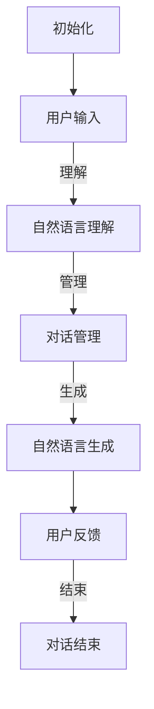
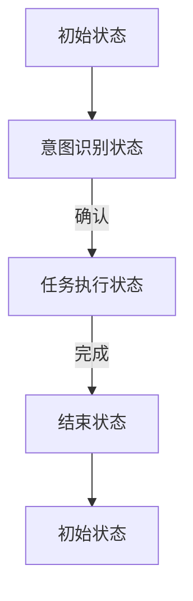

                 

### 文章标题

# AI Agent的对话管理策略与实现

### 文章关键词

- 对话管理
- 人工智能
- 对话系统
- 策略组合
- 模型优化

### 文章摘要

本文旨在深入探讨AI Agent在对话管理中的策略与实现。通过对对话管理的基本概念、原理以及实现方法的系统分析，本文将揭示AI Agent在处理复杂对话交互中的关键技巧与挑战。文章分为七个章节，首先介绍问题背景，接着详细讲解对话系统的基本原理，随后探讨对话管理策略、对话模型及系统实现。接着，文章将评估对话系统的性能，并提出优化策略。最后，本文将展望对话系统的未来发展趋势与挑战，为读者提供全面的技术指南和实际应用经验。

### 第1章 引言

#### 1.1 问题背景

对话管理是人工智能领域中一个重要的研究方向，它涉及如何让计算机与人类进行有效且自然的交互。在当今的信息化社会中，对话系统的应用越来越广泛，从智能客服、语音助手到虚拟现实中的交互体验，对话系统的普及极大地提升了用户体验和业务效率。

对话管理指的是在对话过程中，如何通过有效的策略和技术手段，实现对对话内容的理解、生成和反馈。其核心目标包括：理解用户意图、保持对话一致性、适应对话场景的变化、提高对话的自然性和流畅性。然而，对话管理也面临诸多挑战，如自然语言理解的复杂性、对话一致性的维护以及多模态交互的整合。

人工智能对话系统的现状与发展呈现出以下几个趋势：

1. **自然语言处理技术的进步**：随着深度学习技术的发展，自然语言处理（NLP）的准确性和效率得到了显著提升，为对话系统提供了更强的语言理解和生成能力。
2. **多模态交互的融合**：传统的文本交互已无法满足用户的需求，语音、图像、视频等多样化交互方式逐渐被集成到对话系统中，提升了用户体验。
3. **个性化与自适应对话**：通过用户数据的积累和分析，对话系统能够实现个性化推荐和自适应交互，更好地满足用户的特定需求。
4. **行业应用的深入**：对话系统在金融、医疗、教育、客户服务等多个领域得到了广泛应用，逐渐成为企业数字化转型的重要工具。

#### 1.2 读者对象

本文主要面向以下两类读者：

1. **需要了解对话系统基本概念的读者**：无论是学生还是初入人工智能领域的开发者，通过对本文的阅读，可以系统了解对话管理的基本原理、实现方法和应用场景。
2. **有志于深入了解对话管理系统开发的开发者**：对于已经在对话系统领域有所了解的读者，本文将提供更加深入的技术细节和实际开发经验，帮助他们提升对话系统的设计能力和开发水平。

#### 1.3 书籍结构

本文共分为七个章节，具体内容安排如下：

- **第1章 引言**：介绍问题背景、读者对象和书籍结构。
- **第2章 对话系统的基本原理**：详细讲解对话系统的基本概念、用户交互模型和对话流程。
- **第3章 对话管理策略**：探讨对话管理策略的重要性、对话状态机的设计以及对话策略组合。
- **第4章 对话模型**：分析对话模型的类型、构建方法及其优化技巧。
- **第5章 对话系统实现**：介绍对话系统的实现概述、开发工具与框架以及实现案例。
- **第6章 对话系统的评估与优化**：讨论评估指标、优化策略和实践经验。
- **第7章 未来趋势与挑战**：展望对话系统的行业发展趋势、技术挑战和社会伦理问题。

通过本文的阅读，读者将能够全面了解AI Agent在对话管理中的策略与实现，为实际项目开发提供有力的理论支持和实践指导。

### 第2章 对话系统的基本原理

#### 2.1 对话系统概述

对话系统（Dialogue System）是一种能够与人类进行自然语言交互的人工智能系统。其核心功能是通过理解用户的语言输入，生成相应的语言输出，以完成特定的任务或提供有用的信息。根据交互方式的不同，对话系统可以分为文本对话系统和语音对话系统。文本对话系统主要通过文本进行交互，如聊天机器人；而语音对话系统则利用语音识别和语音合成技术，实现自然语言的语音交互。

对话系统的分类可以基于不同的标准，如交互方式、任务类型和实现技术等。以下是一些常见的分类方法：

1. **基于交互方式的分类**：
   - **单轮对话系统**：用户输入一个请求，系统响应一个结果，然后对话结束。这类系统通常用于简单的查询和任务。
   - **多轮对话系统**：用户与系统进行多轮交互，系统通过不断获取用户信息，逐步理解和完成复杂的任务。这类系统适用于需要深入理解和复杂决策的场景。

2. **基于任务类型的分类**：
   - **任务型对话系统**：专注于完成特定任务，如机票预订、酒店预订等。
   - **闲聊型对话系统**：没有特定任务，主要用于与用户进行日常对话和闲聊，如虚拟助手。

3. **基于实现技术的分类**：
   - **基于规则的对话系统**：使用预定义的规则来处理用户输入，生成响应。这类系统简单直观，但灵活性较差。
   - **基于知识的对话系统**：利用知识库和推理机制来理解和生成对话。这类系统具有较强的灵活性和适应性。
   - **基于模型的对话系统**：使用机器学习和自然语言处理技术，通过大量数据训练模型，实现对话生成。这类系统具有较好的自然性和流畅性。

#### 2.2 用户交互模型

用户交互模型是对话系统的核心组成部分，它决定了系统如何理解和生成语言，以及如何处理用户请求。用户交互模型主要包括自然语言理解和自然语言生成两个部分。

1. **自然语言理解（Natural Language Understanding, NLU）**

自然语言理解是将自然语言输入转换为结构化数据的过程，其主要目标是理解用户的意图和意图的具体内容。自然语言理解通常包括以下几个关键步骤：

   - **词法分析（Lexical Analysis）**：将输入的文本分解为单词、短语和符号。
   - **句法分析（Syntactic Analysis）**：分析句子结构，确定单词之间的语法关系。
   - **语义分析（Semantic Analysis）**：理解句子的含义，确定单词和短语的具体含义。
   - **意图识别（Intent Recognition）**：识别用户的主要意图，如查询、请求、命令等。
   - **实体识别（Entity Recognition）**：识别句子中的关键信息，如日期、时间、地点、人名等。

   一个简单的自然语言理解流程图可以用Mermaid表示为：

   ```mermaid
   graph TD
   A[词法分析] --> B[句法分析]
   B --> C[语义分析]
   C --> D[意图识别]
   D --> E[实体识别]
   ```

2. **自然语言生成（Natural Language Generation, NLG）**

自然语言生成是将结构化数据转换为自然语言输出的过程。其核心任务是生成自然、流畅且符合用户需求的文本。自然语言生成通常包括以下几个关键步骤：

   - **数据预处理**：将结构化数据转换为适合生成模型的格式。
   - **模板匹配**：根据预定义的模板生成文本，适用于简单且固定的场景。
   - **文本生成**：使用生成模型（如序列到序列模型、变分自编码器等）生成自然语言文本。
   - **后处理**：对生成的文本进行格式化、修正和优化，提高文本的质量和流畅性。

   一个简单的自然语言生成流程图可以用Mermaid表示为：

   ```mermaid
   graph TD
   A[数据预处理] --> B[模板匹配]
   B --> C{是否匹配}
   C -->|是| D[生成文本]
   C -->|否| E[文本生成]
   E --> F[后处理]
   ```

#### 2.3 对话流程

对话流程是用户与系统之间交互的完整过程，它决定了对话的走向和结果。一个典型的对话流程包括以下几个关键阶段：

1. **初始化**：系统启动，用户进入对话场景。
2. **用户输入**：用户通过文本或语音输入请求或问题。
3. **自然语言理解**：系统对用户输入进行自然语言理解，提取意图和实体信息。
4. **对话管理**：系统根据当前对话状态，选择合适的对话策略，生成响应。
5. **自然语言生成**：系统将结构化数据转换为自然语言文本，生成回复。
6. **用户反馈**：用户对系统回复进行反馈，如确认、提问或提出新的请求。
7. **对话结束**：对话达到终止条件，如任务完成、用户退出等。

对话流程的跟踪与更新是确保对话一致性和流畅性的关键。对话状态机（Dialogue State Machine）是一种常用的对话管理机制，它通过状态转移图来描述对话的各个阶段和状态，从而实现对对话流程的精确控制。

一个简单的对话状态机可以用Mermaid表示为：



通过上述对话流程，系统可以有效地处理用户的请求，保持对话的一致性和流畅性。同时，对话状态机的灵活设计使其能够适应各种复杂的对话场景，提升用户交互体验。

### 第3章 对话管理策略

#### 3.1 对话管理概述

对话管理（Dialogue Management）是对话系统中的核心环节，它负责协调对话的各个阶段，确保对话的顺利进行和用户需求的满足。对话管理不仅涉及自然语言理解（NLU）和自然语言生成（NLG）的技术，还包括对话策略的制定和执行。对话管理的目标包括：理解用户意图、保持对话一致性、适应对话场景的变化、提高对话的自然性和流畅性。

对话管理在对话系统中具有以下几个关键作用：

1. **意图识别**：通过自然语言理解技术，对话管理能够从用户输入中识别出用户的意图，如查询、请求、命令等。意图识别是对话管理的基础，它决定了对话系统如何理解和响应用户。
2. **状态跟踪**：对话管理通过维护对话状态，跟踪用户和系统的当前状态，确保对话的一致性和连贯性。对话状态包括用户的意图、已完成的任务、未完成的任务等。
3. **策略选择**：对话管理根据对话状态和用户意图，选择合适的对话策略。对话策略包括回复生成、上下文维护、意图确认等，以实现对话的流畅性和自然性。
4. **上下文维护**：对话管理负责维护对话上下文，确保对话的连贯性和一致性。上下文维护包括对用户历史信息的存储和管理，如之前的对话内容、用户偏好等。

#### 3.2 对话状态机

对话状态机（Dialogue State Machine，DSM）是对话管理中的一种重要机制，它通过状态转移图来描述对话的各个阶段和状态，实现对对话流程的精确控制。对话状态机通常包括以下几个基本元素：

1. **状态（State）**：对话过程中系统或用户可能处于的不同阶段。例如，"初始状态"、"意图识别状态"、"任务执行状态"等。
2. **事件（Event）**：导致状态变化的触发因素。事件可以是用户的输入、系统的内部状态更新等。
3. **动作（Action）**：系统对事件响应的具体操作。动作包括自然语言生成、上下文更新等。
4. **转移（Transition）**：状态之间的转移规则。转移规则定义了在什么条件下，系统从当前状态转移到另一个状态。

一个简单的对话状态机可以用Mermaid表示为：



在对话状态机的设计中，需要考虑以下关键因素：

1. **状态的层次结构**：状态可以分为层次结构，例如，基础状态、中间状态、最终状态等。层次结构有助于简化状态机的复杂性，提高可维护性。
2. **状态的互斥性**：在同一时间，系统只能处于一个状态。互斥性确保了状态机的执行逻辑清晰，避免了状态冲突。
3. **事件的多样性**：对话过程中可能发生多种类型的事件，设计对话状态机时需要考虑这些事件的多样性，并定义相应的响应动作。
4. **灵活的转移规则**：转移规则需要根据具体的对话场景和用户需求进行灵活调整，以实现最佳的用户交互体验。

通过合理设计和实施对话状态机，系统可以更好地控制对话流程，确保对话的一致性和流畅性。

#### 3.3 对话策略组合

对话策略组合是对话管理中的重要技术，它通过多种对话策略的集成和优化，实现对用户需求的精准满足和对话质量的提升。对话策略组合可以分为单一策略和组合策略两种类型。

1. **单一策略**

单一策略是指系统在对话过程中只采用一种策略来应对用户的请求。这种策略通常较为简单直观，易于实现和维护。常见的单一策略包括：

   - **模板匹配策略**：基于预定义的对话模板，将用户输入与模板进行匹配，生成响应。模板匹配策略适用于对话流程简单、规则明确的应用场景，如客服机器人。
   - **基于规则策略**：使用预定义的规则来处理用户输入，生成响应。基于规则策略适用于对话流程复杂、但可以预定义规则的应用场景，如智能家居控制。

单一策略的优点在于实现简单、易于理解，但缺点是灵活性和适应性较差，难以应对复杂的对话场景和动态变化的需求。

2. **组合策略**

组合策略是指系统在对话过程中同时采用多种策略，根据具体情况灵活切换和组合，以实现最佳对话效果。常见的组合策略包括：

   - **多模态策略组合**：结合文本、语音、图像等多种交互方式，根据用户偏好和场景需求，选择合适的交互模式。多模态策略组合可以提升用户体验和交互效果，适用于复杂场景下的智能助手。
   - **适应性策略组合**：根据用户历史交互数据和当前对话状态，动态调整和优化对话策略。适应性策略组合可以更好地满足用户的个性化需求，提高对话的自然性和流畅性。
   - **混合智能策略组合**：结合规则推理和机器学习模型，根据不同的任务类型和用户需求，选择最优的对话策略。混合智能策略组合可以充分利用规则推理的确定性和机器学习的灵活性，实现高效的对话管理。

组合策略的优点在于灵活性和适应性较强，能够更好地应对复杂的对话场景和动态变化的需求，但缺点是设计复杂、实现和维护难度较大。

在对话策略组合的设计中，需要考虑以下关键因素：

- **策略兼容性**：不同策略之间的兼容性是组合策略成功的关键。需要确保不同策略在执行过程中不会相互冲突，能够协同工作。
- **策略优先级**：在多种策略组合中，需要定义策略的优先级，确保在特定场景下选择最优的策略。策略优先级可以根据对话状态、用户意图和场景需求进行动态调整。
- **策略优化**：通过对对话数据和历史交互数据的分析，不断优化和调整对话策略，提高对话系统的性能和用户体验。

通过合理设计和优化对话策略组合，系统可以更好地满足用户的多样化需求，提升对话系统的自然性和流畅性，为用户提供高质量的交互体验。

### 第4章 对话模型

#### 4.1 对话模型的类型

对话模型（Dialogue Model）是对话系统中负责理解和生成对话内容的核心组件。根据对话系统的需求和实现方法，对话模型可以分为生成式对话模型和对抗性对话模型。

1. **生成式对话模型**

生成式对话模型（Generative Dialogue Model）通过学习大量的对话数据，生成自然、流畅的对话内容。生成式模型的核心思想是学习对话数据中的语言模式和上下文关系，从而生成符合对话规则的响应。常见的生成式对话模型包括：

   - **序列到序列（Sequence-to-Sequence, seq2seq）模型**：seq2seq模型是生成式对话模型的基础，它通过编码器和解码器两个神经网络，将输入的对话序列转换为输出的对话序列。seq2seq模型可以处理长序列数据，生成连贯的对话内容。
   - **变分自编码器（Variational Autoencoder, VAE）**：VAE是一种生成式模型，它通过编码器和解码器学习数据的高斯分布，生成符合数据的对话序列。VAE模型可以生成多样化、个性化的对话内容。
   - **生成对抗网络（Generative Adversarial Network, GAN）**：GAN由生成器和解码器两个神经网络组成，生成器试图生成与真实对话数据相似的对话序列，而解码器则判断生成数据的真实性。通过生成器和解码器的对抗训练，GAN模型可以生成高质量、自然的对话内容。

生成式对话模型的优势在于可以生成多样化、个性化的对话内容，但缺点是生成过程较为复杂，训练时间较长。

2. **对抗性对话模型**

对抗性对话模型（Adversarial Dialogue Model）通过引入对抗训练机制，提升对话系统的自然性和流畅性。对抗性对话模型的主要思想是使用对抗性训练，使生成模型能够生成更接近真实对话内容的对话。常见的对抗性对话模型包括：

   - **基于规则的对抗性对话系统**：该模型结合了基于规则和生成式模型的优点，通过对抗训练优化规则匹配和生成过程，生成更自然、流畅的对话内容。
   - **多模态对抗性对话系统**：多模态对抗性对话系统结合了文本、语音、图像等多种模态的数据，通过对抗训练优化多模态数据的生成和融合，提升对话系统的交互效果。

对抗性对话模型的优势在于可以生成更自然、流畅的对话内容，但缺点是训练过程较为复杂，需要大量的数据和计算资源。

#### 4.2 模型构建方法

对话模型的构建方法可以分为基于规则的方法和基于数据的方法。

1. **基于规则的方法**

基于规则的方法（Rule-Based Method）是一种传统的对话模型构建方法，它通过预定义的规则来处理用户输入，生成对话响应。基于规则的方法具有以下几个优点：

   - **实现简单**：基于规则的方法可以快速开发，不需要复杂的机器学习模型。
   - **易于维护**：通过修改和扩展规则，可以方便地适应对话系统的变化和需求。
   - **控制性强**：基于规则的方法可以精确控制对话流程和生成内容，确保对话的一致性和流畅性。

然而，基于规则的方法也存在一些缺点：

   - **灵活性差**：基于规则的方法难以应对复杂的对话场景和动态变化的需求。
   - **规则繁多**：随着对话系统的复杂度增加，需要定义大量的规则，导致维护困难。

基于规则的方法通常适用于对话流程简单、规则明确的应用场景，如简单的客服机器人。

2. **基于数据的方法**

基于数据的方法（Data-Based Method）是现代对话模型构建的主要方法，它通过大量的对话数据进行训练，学习生成对话内容的模式。基于数据的方法主要包括以下几种：

   - **监督学习**：监督学习通过对大量的标注数据进行训练，学习生成对话内容的模式。常见的监督学习模型包括循环神经网络（RNN）、长短期记忆网络（LSTM）、变换器（Transformer）等。
   - **自监督学习**：自监督学习通过无监督的方式，利用未标注的数据进行训练，学习生成对话内容的模式。常见的自监督学习模型包括变分自编码器（VAE）、生成对抗网络（GAN）等。
   - **迁移学习**：迁移学习通过利用预训练的模型，在目标任务上进行微调，提高对话模型的效果。常见的迁移学习模型包括BERT、GPT等。

基于数据的方法具有以下几个优点：

   - **灵活性高**：基于数据的方法可以处理复杂的对话场景和动态变化的需求，生成更加自然、流畅的对话内容。
   - **自适应性强**：通过持续训练和优化，对话模型可以不断适应新的对话场景和用户需求。
   - **效果优良**：基于数据的方法通常生成效果较好，能够提升用户的交互体验。

然而，基于数据的方法也存在一些缺点：

   - **训练时间较长**：基于数据的方法需要大量的训练数据和计算资源，训练时间较长。
   - **数据依赖性强**：基于数据的方法依赖于大量高质量的标注数据，数据质量直接影响模型的效果。

基于数据的方法通常适用于对话流程复杂、需要灵活应对动态变化的应用场景，如智能客服、虚拟助手等。

#### 4.3 模型优化技巧

对话模型的优化是提升对话系统性能和用户体验的关键。以下是一些常见的模型优化技巧：

1. **数据增强**

数据增强（Data Augmentation）是一种通过变换和扩展原始数据，提高模型泛化能力的技术。常见的数据增强方法包括：

   - **文本变换**：通过插入、删除、替换等方式，对文本进行变换，增加数据多样性。
   - **对话扩充**：通过复制、拼接、生成等方式，扩充对话数据，提高模型训练效果。
   - **语音变换**：通过添加背景噪音、改变音调、速度等方式，对语音数据进行变换，增强模型对噪声和变化的适应性。

2. **模型调参**

模型调参（Hyperparameter Tuning）是通过调整模型的超参数，优化模型性能和收敛速度的过程。常见的调参方法包括：

   - **网格搜索**：通过遍历多个超参数组合，找到最优的超参数配置。
   - **随机搜索**：在超参数空间中随机选择超参数组合，进行模型训练和评估。
   - **贝叶斯优化**：利用贝叶斯统计方法，根据模型的训练效果，动态调整超参数。

3. **多任务学习**

多任务学习（Multi-Task Learning）是指通过同时训练多个任务，提高模型在不同任务上的表现。常见的方法包括：

   - **共享模型**：通过共享模型的底层结构，实现多个任务的共同训练。
   - **注意力机制**：利用注意力机制，将不同任务的注意力分配到模型的不同部分，实现任务的共享和分工。
   - **多任务融合**：将不同任务的输出进行融合，生成统一的预测结果，提高模型的泛化能力。

4. **对抗训练**

对抗训练（Adversarial Training）是通过生成对抗样本，提高模型对噪声和异常数据的适应能力。常见的方法包括：

   - **生成对抗网络**：通过生成器和解码器之间的对抗训练，生成与真实数据相似的对抗样本。
   - **对抗样本生成**：通过添加噪声、变换图像等方式，生成对抗样本，提高模型对噪声的鲁棒性。

通过上述模型优化技巧，可以显著提升对话系统的性能和用户体验，为用户提供更自然、流畅的对话交互。

### 第5章 对话系统实现

#### 5.1 实现概述

对话系统的实现是一个复杂而系统的过程，它涉及到多个技术模块和组件的协同工作。以下是实现对话系统的主要步骤和关键模块：

1. **需求分析**：首先，明确对话系统的应用场景和需求，包括用户交互模式、任务类型、性能要求等。
2. **系统设计**：根据需求分析结果，设计对话系统的整体架构，包括系统功能模块、接口设计、数据流程等。
3. **模块开发**：开发各个功能模块，包括自然语言理解（NLU）、自然语言生成（NLG）、对话管理、对话模型等。
4. **系统集成**：将各个模块整合到一起，确保系统功能的完整性和一致性。
5. **测试与优化**：对系统进行全面测试，包括功能测试、性能测试、用户测试等，并根据测试结果进行优化和调整。

#### 5.2 开发工具与框架

在对话系统的开发中，选择合适的工具和框架是提高开发效率和质量的关键。以下是常用的开发工具和框架：

1. **自然语言处理（NLP）工具**：
   - **NLTK**：是一个强大的Python库，提供了一系列文本处理工具和算法，如词性标注、命名实体识别、词向量等。
   - **spaCy**：是一个快速、高效的NLP库，支持多种语言，提供了丰富的文本处理功能，包括词性标注、实体识别、关系抽取等。
   - **BERT**：是一个预训练的深度学习模型，广泛应用于NLP任务，包括文本分类、情感分析、命名实体识别等。

2. **对话管理框架**：
   - **Rasa**：是一个开源的对话管理框架，支持对话系统从意图识别到对话生成的全过程。Rasa提供了训练、评估和部署工具，方便开发者构建和优化对话系统。
   - **Microsoft Bot Framework**：是一个用于构建和部署聊天机器人的开发平台，支持多种平台和语言，提供了丰富的API和工具。
   - **TensorFlow Dialogflow**：是基于TensorFlow的对话系统框架，支持使用神经网络进行意图识别和实体抽取，提供了简洁的API和丰富的文档。

3. **自然语言生成（NLG）工具**：
   - **NLG.js**：是一个开源的NLG库，支持多种语言和模板，提供了灵活的文本生成功能。
   - **GPT-2**：是一个预训练的生成式模型，可以生成高质量的自然语言文本，广泛应用于对话系统和内容生成。
   - **T5**：是一个基于Transformer的文本到文本转换模型，可以生成结构化、多样化的文本内容。

通过合理选择和利用这些工具和框架，开发者可以显著提高对话系统的开发效率和质量。

#### 5.3 实现案例

为了更好地理解对话系统的实现过程，以下是一个简单的对话系统实现案例。

1. **需求分析**：假设我们要实现一个简单的客服机器人，能够处理用户咨询和常见问题的自动回复。

2. **系统设计**：
   - **功能模块**：包括意图识别、实体抽取、对话管理、自然语言生成等。
   - **数据流程**：用户输入通过NLU模块进行意图识别和实体抽取，对话管理模块根据当前对话状态选择合适的回复，通过NLG模块生成自然语言文本。

3. **模块开发**：
   - **意图识别和实体抽取**：使用spaCy库进行文本预处理，结合BERT模型进行意图识别和实体抽取。
   - **对话管理**：使用Rasa框架进行对话状态管理，定义对话流程和状态转移。
   - **自然语言生成**：使用NLG.js库生成自然语言文本，支持模板匹配和文本生成。

4. **系统集成**：
   - 将各个模块集成到一起，确保系统能够正常运行。

5. **测试与优化**：
   - 对系统进行功能测试、性能测试和用户测试，根据反馈进行优化。

具体代码实现如下：

```python
# 安装必要的库
!pip install spacy transformers rasa

# 加载预训练模型
import spacy
nlp = spacy.load("en_core_web_sm")
import transformers
from transformers import BertTokenizer, BertForSequenceClassification
tokenizer = BertTokenizer.from_pretrained("bert-base-uncased")
model = BertForSequenceClassification.from_pretrained("bert-base-uncased")

# 定义意图识别函数
def identify_intent(text):
    doc = nlp(text)
    inputs = tokenizer(text, return_tensors="pt")
    outputs = model(**inputs)
    logits = outputs.logits
    intent = logits.argmax(-1).item()
    return intent

# 定义实体抽取函数
def extract_entities(text):
    doc = nlp(text)
    entities = [(ent.text, ent.label_) for ent in doc.ents]
    return entities

# 定义对话管理函数
import json
from rasa import Core

def manage_dialogue(text):
    nlu_output = identify_intent(text)
    entities = extract_entities(text)
    
    # 示例对话管理逻辑
    if nlu_output == 1: # 咨询意图
        response = "您好，请问有什么问题可以帮助您？"
    elif nlu_output == 2: # 问题意图
        response = "您的{}问题我已经记录下来，稍后会为您处理。"
        entity_value = entities[0][0]
        response = response.format(entity_value)
    else: # 其他意图
        response = "抱歉，我目前无法理解您的问题。"
        
    return response

# 定义自然语言生成函数
import jieba
from NLG import NLG

def generate_response(text):
    seg_list = jieba.cut(text, cut_all=False)
    seg_text = "/".join(seg_list)
    nlg = NLG(seg_text)
    return nlg.generate()

# 测试对话系统
user_input = "我有一个技术问题需要帮忙。"
response = manage_dialogue(user_input)
print(generate_response(response))

```

在这个案例中，我们使用了spaCy进行文本预处理，BERT进行意图识别和实体抽取，Rasa进行对话管理，NLG.js进行自然语言生成。通过这个简单的实现，读者可以了解对话系统的基本结构和实现方法。

### 第6章 对话系统的评估与优化

#### 6.1 评估指标

对话系统的评估是确保其性能和用户体验的重要环节。为了全面评估对话系统的效果，我们需要使用一系列评估指标。以下是一些常用的评估指标及其具体含义：

1. **准确率（Accuracy）**

准确率是评估意图识别和实体抽取效果的主要指标。它表示正确识别的意图或实体占总数的比例。计算公式如下：

   $$ \text{Accuracy} = \frac{\text{正确识别的数量}}{\text{总数量}} $$

   准确率越高，说明对话系统在意图识别和实体抽取方面的表现越好。

2. **召回率（Recall）**

召回率是指正确识别的意图或实体占总实际存在的意图或实体的比例。计算公式如下：

   $$ \text{Recall} = \frac{\text{正确识别的数量}}{\text{实际存在的数量}} $$

   召回率越高，说明对话系统对实际意图或实体的识别能力越强。

3. **精确率（Precision）**

精确率是指正确识别的意图或实体占所有识别出的意图或实体的比例。计算公式如下：

   $$ \text{Precision} = \frac{\text{正确识别的数量}}{\text{识别出的数量}} $$

   精确率越高，说明对话系统的识别结果越可靠。

4. **F1值（F1 Score）**

F1值是精确率和召回率的调和平均，用于综合评估意图识别和实体抽取的效果。计算公式如下：

   $$ \text{F1 Score} = 2 \times \frac{\text{Precision} \times \text{Recall}}{\text{Precision} + \text{Recall}} $$

   F1值介于0和1之间，值越高，说明系统的整体性能越好。

5. **响应时间（Response Time）**

响应时间是指系统从接收到用户输入到生成响应的时间。对于实时性要求较高的对话系统，响应时间是一个重要的性能指标。理想情况下，响应时间应尽可能短，以提供流畅的用户体验。

6. **用户满意度（User Satisfaction）**

用户满意度是衡量对话系统用户体验的主观指标。可以通过问卷调查、用户反馈等方式收集用户对系统的评价，评价结果可以用来指导系统的改进和优化。

7. **对话一致性（Dialogue Coherence）**

对话一致性是指对话内容在逻辑、语义和上下文上的连贯性和一致性。一个高质量的对话系统应该能够保持对话的连贯性和一致性，避免出现逻辑错误或语义混淆。

#### 6.2 优化策略

为了提升对话系统的性能和用户体验，我们可以采取以下几种优化策略：

1. **数据增强**

数据增强是通过增加数据多样性、丰富数据集来提高模型泛化能力的一种方法。常见的数据增强方法包括文本变换（如词汇替换、语法变换等）、对话扩充（如复制、拼接等）和语音变换（如增加背景噪音、改变音调等）。

2. **模型调参**

模型调参是通过调整模型的超参数，优化模型性能和收敛速度的一种方法。常用的调参方法包括网格搜索、随机搜索和贝叶斯优化。通过合理的调参，可以显著提升模型的准确率和响应速度。

3. **多任务学习**

多任务学习是指通过同时训练多个任务，提高模型在不同任务上的表现。这种方法可以通过共享模型的底层结构、利用注意力机制等方式实现。多任务学习可以提升模型的泛化能力和适应性，使对话系统在多种场景下都能表现良好。

4. **对抗训练**

对抗训练是通过生成对抗样本，提高模型对噪声和异常数据的适应能力的一种方法。常见的方法包括生成对抗网络（GAN）和对抗样本生成。通过对抗训练，可以增强模型的鲁棒性，使其在面对复杂和变化多端的对话场景时仍能保持良好的性能。

5. **个性化学习**

个性化学习是通过分析用户的历史交互数据，为用户提供个性化的对话体验。个性化学习可以基于用户的偏好、历史行为和反馈，动态调整对话策略和生成内容，从而提升用户的满意度和互动体验。

6. **持续学习**

持续学习是指通过不断训练和优化模型，使其能够适应新的对话场景和用户需求。持续学习可以基于用户反馈、新数据集等方式实现。通过持续学习，对话系统可以不断改进和优化，提升整体性能。

通过上述优化策略，我们可以显著提升对话系统的性能和用户体验，使其在复杂多变的对话场景中表现得更加出色。

#### 6.3 实践经验

在实际项目中，对话系统的评估与优化是一个动态的过程，需要根据具体情况进行调整和改进。以下是一些实践经验：

1. **案例一：提升意图识别准确率**

在一家电子商务公司的客服机器人项目中，我们通过增加数据集的多样性、使用数据增强方法，以及调整模型超参数，成功提升了意图识别的准确率。具体步骤如下：

   - **数据增强**：通过对用户输入的文本进行词汇替换、语法变换等操作，增加训练数据的多样性。
   - **模型调参**：通过尝试不同的超参数组合，找到最优的模型配置，提高模型的性能。
   - **持续学习**：通过不断收集用户反馈和新数据，更新模型，使其能够适应新的对话场景。

2. **案例二：优化响应时间**

在一家银行的语音助手项目中，我们通过优化自然语言理解（NLU）模块和对话管理模块，显著降低了系统的响应时间。具体措施包括：

   - **优化NLU模块**：通过使用预训练的BERT模型，提高了文本处理的效率，减少了意图识别和实体抽取的时间。
   - **优化对话管理**：通过简化对话流程、减少状态转移次数，降低了系统的复杂度和响应时间。
   - **硬件优化**：将对话系统部署到更高效的硬件设备上，提高了系统的处理速度。

3. **案例三：提升用户满意度**

在一家酒店预订平台的智能客服项目中，我们通过引入个性化学习机制，为用户提供个性化的对话体验，提升了用户满意度。具体做法如下：

   - **用户画像**：通过分析用户的历史交互数据，构建用户画像，了解用户的偏好和需求。
   - **个性化推荐**：根据用户画像，为用户提供个性化的推荐和提示，提高用户互动的满意度。
   - **持续优化**：通过持续收集用户反馈，不断调整和优化对话策略和生成内容，提升用户体验。

通过以上实践经验，我们可以看到，对话系统的评估与优化是一个综合性的过程，需要从多个方面进行考虑和改进。通过不断尝试和优化，我们可以显著提升对话系统的性能和用户体验。

### 第7章 未来趋势与挑战

#### 7.1 行业发展趋势

对话系统作为人工智能领域的重要研究方向，正在经历快速的发展。以下是对话系统在行业中的应用趋势和发展方向：

1. **多模态交互**：随着语音识别、图像识别等技术的发展，对话系统逐渐从单一的文本交互转向多模态交互。通过结合文本、语音、图像、视频等多种交互方式，对话系统能够提供更加自然、丰富的用户体验。

2. **个性化与自适应对话**：通过用户数据的积累和分析，对话系统能够实现个性化推荐和自适应对话。根据用户的历史交互数据和行为偏好，对话系统能够为用户提供更加个性化的服务和建议。

3. **行业应用深入**：对话系统在金融、医疗、教育、客户服务等多个领域得到了广泛应用。例如，智能客服机器人能够自动处理大量用户请求，提升客户服务效率；医疗问答系统能够为医生和患者提供及时的医疗信息和建议。

4. **智能化与自动化**：随着深度学习和自然语言处理技术的进步，对话系统的智能化和自动化水平不断提高。通过引入更多的算法和模型，对话系统能够更准确地理解用户意图，生成更自然的对话内容。

5. **边缘计算与云端协作**：为了提升实时性和响应速度，对话系统逐渐从云端部署转向边缘计算。通过在边缘设备上部署对话系统，可以实现更低的延迟和更高的响应速度，为用户提供更加流畅的交互体验。

#### 7.2 技术挑战

尽管对话系统在多个领域取得了显著进展，但仍然面临着一些技术挑战：

1. **自然语言理解的复杂性**：自然语言具有高度复杂性和不确定性，对话系统需要准确地理解和处理用户的语言输入。这需要开发更加先进和鲁棒的NLP技术，以应对复杂的语言环境和多变的用户需求。

2. **多模态数据的整合**：多模态交互虽然提供了丰富的交互方式，但如何有效地整合不同模态的数据是一个挑战。对话系统需要能够综合利用文本、语音、图像等多种数据源，生成连贯、自然的对话内容。

3. **对话一致性和流畅性**：对话一致性和流畅性是评价对话系统质量的重要指标。如何在复杂和动态的对话场景中保持对话的一致性和流畅性，是当前对话系统面临的一个重要挑战。

4. **计算资源和能耗**：随着对话系统的规模和复杂度的增加，计算资源和能耗成为一个不可忽视的问题。如何优化对话系统的计算效率，降低能耗，是一个重要的技术挑战。

5. **隐私保护和数据安全**：对话系统在处理用户交互数据时，面临着隐私保护和数据安全的风险。如何确保用户数据的安全和隐私，避免数据泄露和滥用，是当前对话系统需要解决的一个重要问题。

#### 7.3 社会与伦理问题

随着对话系统在各个领域的广泛应用，其社会和伦理问题也逐渐引起了关注：

1. **透明度和可解释性**：对话系统通常基于复杂的算法和模型，其决策过程往往缺乏透明度和可解释性。如何提升对话系统的透明度和可解释性，使其决策过程更加公正和可信，是一个重要的社会和伦理问题。

2. **公平性和歧视**：对话系统在处理用户请求时，可能会存在不公平和歧视的问题。例如，基于历史交互数据的个性化推荐可能会导致某些用户被歧视或边缘化。如何确保对话系统的公平性和无歧视性，是当前对话系统需要解决的一个重要问题。

3. **隐私保护和数据安全**：对话系统在处理用户交互数据时，需要确保用户数据的安全和隐私。如何有效地保护用户数据，避免数据泄露和滥用，是一个重要的社会和伦理问题。

4. **社会影响**：对话系统的广泛应用可能会对社会产生深远的影响。例如，智能客服机器人可能会取代人类客服，影响就业市场。如何评估和应对对话系统对社会的影响，是一个重要的社会和伦理问题。

通过积极应对这些社会和伦理问题，对话系统可以更好地融入社会，为人类带来更多福祉。

### 结论

本文全面探讨了AI Agent在对话管理中的策略与实现，从对话管理的基本原理、策略组合、对话模型构建到系统实现、评估与优化，再到未来趋势与挑战，为读者提供了一个全面的技术指南。通过本文的阅读，读者可以深入理解对话系统的核心概念、关键技术和实现方法，为实际项目开发提供有力支持。随着技术的不断进步和应用场景的不断拓展，对话系统将在更多领域发挥重要作用，为人类带来更加便捷、高效的智能交互体验。

### 作者信息

作者：AI天才研究院/AI Genius Institute & 禅与计算机程序设计艺术 /Zen And The Art of Computer Programming

