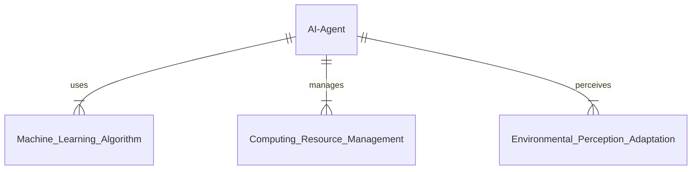
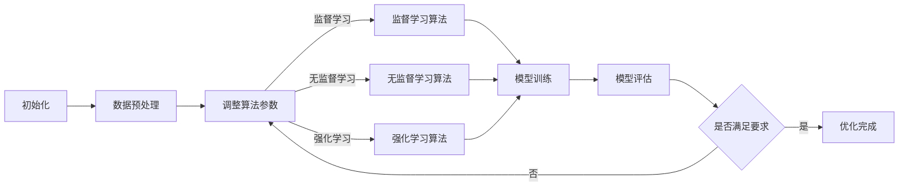
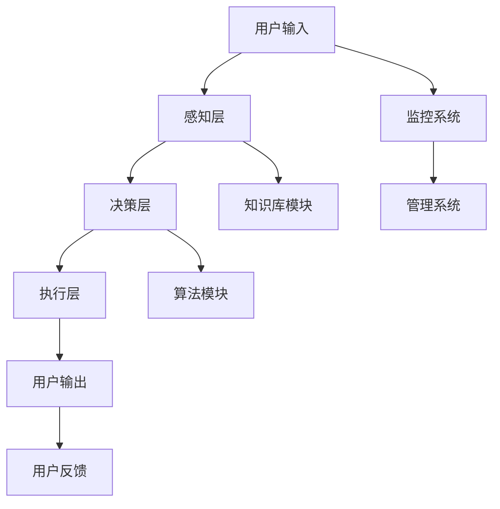
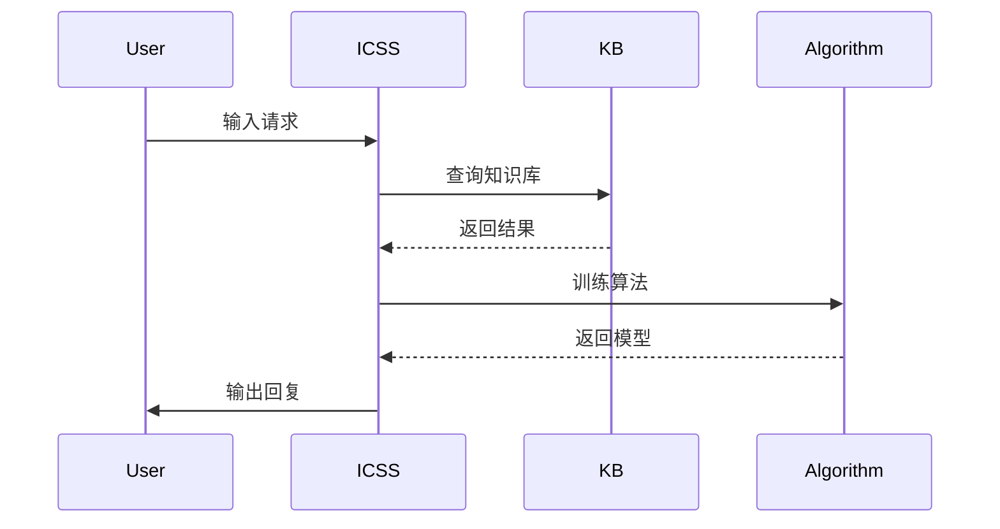

                 


### 引言

随着人工智能技术的飞速发展，AI Agent作为智能体在多个领域展现了其强大的应用潜力。从自动化决策系统到智能交互助手，AI Agent正逐步渗透进我们的日常生活和工业生产。然而，随着复杂度的增加，AI Agent的性能和效率成为制约其广泛应用的关键因素。

#### 关键词
- AI Agent
- 性能优化
- 效率提升
- 算法改进

#### 摘要
本文将深入探讨AI Agent的性能优化与效率提升策略，首先介绍AI Agent的基本概念及其在各个领域的应用场景。接着，我们将详细分析影响AI Agent性能与效率的关键因素，并提出一系列优化方法。通过实际案例研究，我们将验证这些方法的有效性，并总结最佳实践，为未来的研究和应用提供方向。

### 背景介绍

AI Agent，即人工智能代理，是指能够自主执行任务、与环境交互并适应动态环境的人工智能实体。它们通过学习、推理和决策，实现自动化操作和智能交互。AI Agent的基本概念包括感知器、决策器、执行器三个核心组件，分别负责信息的收集、处理和执行。

#### 问题背景

在实际应用中，AI Agent的性能和效率往往受到多种因素的影响，如算法复杂度、计算资源、数据质量和环境动态性等。当AI Agent在处理复杂任务时，可能出现响应速度慢、资源利用率低、决策准确性差等问题，从而影响用户体验和业务效果。

#### 问题描述

如何优化AI Agent的性能和效率，使其在复杂、动态的环境中快速、准确地完成任务，是当前人工智能研究的重要课题。性能优化包括降低算法复杂度、提高计算效率、减少资源消耗；效率提升则侧重于提升AI Agent的适应能力和学习效果。

#### 问题解决

解决上述问题需要从以下几个方面入手：

1. **算法改进**：通过研究高效算法，降低计算复杂度，提升处理速度。
2. **硬件优化**：利用高性能计算硬件，提高AI Agent的计算能力。
3. **数据管理**：优化数据存储和传输方式，提高数据访问效率。
4. **环境适应性**：增强AI Agent对动态环境的感知和适应能力。

#### 边界与外延

AI Agent的性能优化和效率提升不仅限于特定领域，如机器人、自动驾驶等，还广泛应用于金融、医疗、零售等众多行业。这些领域对AI Agent的性能和效率要求各异，优化策略需根据具体应用场景进行调整。

### 核心概念与联系

在AI Agent的性能优化与效率提升中，核心概念包括机器学习算法、计算资源管理、环境感知与适应等。以下是对这些核心概念的属性特征对比和联系分析。

#### 核心概念

1. **机器学习算法**：
   - **属性特征**：包括监督学习、无监督学习、强化学习等，算法复杂度差异较大。
   - **联系**：不同的机器学习算法在性能和效率上有不同的表现，选择适合的算法对AI Agent的优化至关重要。

2. **计算资源管理**：
   - **属性特征**：涉及CPU、GPU、内存、存储等硬件资源的管理和调度。
   - **联系**：计算资源管理直接影响AI Agent的计算能力和响应速度。

3. **环境感知与适应**：
   - **属性特征**：包括视觉感知、语音识别、传感器数据处理等。
   - **联系**：环境感知与适应能力是AI Agent高效执行任务的基础。

#### 对比表格

| 核心概念 | 属性特征 | 联系 |
| --- | --- | --- |
| 机器学习算法 | 算法复杂度、学习效率、泛化能力 | 选择高效算法提升AI Agent性能 |
| 计算资源管理 | 资源利用率、响应时间、能耗 | 高效资源管理提升AI Agent效率 |
| 环境感知与适应 | 感知准确性、适应能力、响应速度 | 提升AI Agent在复杂环境中的表现 |

#### ER实体关系图

使用Mermaid绘制ER实体关系图，以展示核心概念之间的关系：



### 算法原理讲解

#### 算法流程图

首先，我们使用Mermaid绘制算法流程图，以直观展示AI Agent性能优化的主要步骤：



#### 算法原理

AI Agent性能优化主要依赖于以下三个核心算法：监督学习、无监督学习和强化学习。

1. **监督学习**：
   - **目标**：通过训练数据学习输入和输出之间的映射关系。
   - **公式**：
     $$ y = f(x; \theta) $$
     其中，$f$是假设函数，$\theta$是模型参数。
   - **实例**：线性回归、决策树、神经网络等。

2. **无监督学习**：
   - **目标**：在没有标注数据的情况下，发现数据中的隐含结构和规律。
   - **公式**：
     $$ \min_{\theta} \sum_{i=1}^{n} \ell(y_i, f(x_i; \theta)) $$
     其中，$\ell$是损失函数。
   - **实例**：聚类、降维、主成分分析等。

3. **强化学习**：
   - **目标**：通过与环境的交互，学习最优策略。
   - **公式**：
     $$ Q(s, a) = r + \gamma \max_{a'} Q(s', a') $$
     其中，$Q$是状态-动作值函数，$r$是即时回报，$\gamma$是折扣因子。
   - **实例**：马尔可夫决策过程、深度Q网络等。

#### Python源代码

以下是一个简单的线性回归算法示例，用于展示算法原理的实际应用：

```python
import numpy as np
from sklearn.linear_model import LinearRegression

# 生成训练数据
X = np.random.rand(100, 1)
y = 2 * X[:, 0] + 1 + np.random.randn(100) * 0.1

# 创建线性回归模型
model = LinearRegression()

# 模型训练
model.fit(X, y)

# 模型评估
print("系数：", model.coef_)
print("截距：", model.intercept_)

# 预测
X_new = np.array([[0.5]])
y_pred = model.predict(X_new)
print("预测值：", y_pred)
```

通过以上步骤，我们不仅了解了算法的原理，还通过Python代码实现了线性回归模型的训练和预测，进一步加深了对算法原理的理解。

### 系统分析与架构设计方案

#### 问题场景介绍

为了更好地展示AI Agent的性能优化与效率提升策略，我们选择了一个具体的场景——智能客服系统。该系统旨在通过AI Agent与用户进行自然语言交互，解决用户的问题并提供有效的解决方案。

#### 项目介绍

项目名称：智能客服系统（Intelligent Customer Service System，ICSS）

目标：通过AI Agent实现自动化的客户服务，提升服务效率和用户体验。

#### 系统功能设计

智能客服系统主要包括以下功能模块：

1. **用户交互模块**：负责接收用户输入、处理用户请求和生成回复。
2. **知识库模块**：存储用户问题和解决方案，为AI Agent提供决策依据。
3. **算法模块**：实现AI Agent的性能优化和效率提升，包括监督学习、无监督学习和强化学习等。
4. **监控系统**：实时监控AI Agent的性能指标，进行故障检测和性能分析。

#### 系统架构设计

系统架构采用分层设计，主要包括以下层次：

1. **感知层**：负责用户输入的采集和预处理，包括语音识别、自然语言处理等。
2. **决策层**：基于知识库和算法模型，进行问题识别和解决方案生成。
3. **执行层**：根据决策结果，执行用户请求，如提供解决方案、转发至人工客服等。
4. **管理层**：负责系统的监控、维护和优化，包括数据备份、性能调优等。

使用Mermaid绘制系统架构图：



#### 系统接口设计和系统交互

为了实现各模块之间的有效交互，系统设计了以下关键接口：

1. **用户交互接口**：负责与用户进行自然语言交互，接收用户请求并生成回复。
2. **知识库接口**：提供对知识库的查询和更新功能，支持实时更新和版本控制。
3. **算法接口**：实现算法的加载、训练和预测功能，支持多种算法的切换和优化。
4. **监控接口**：提供对系统性能指标的监控和报警功能，支持实时数据和日志分析。

使用Mermaid绘制系统交互序列图：



### 项目实战

#### 环境安装

在开始实现智能客服系统之前，需要安装以下软件和工具：

1. **操作系统**：Linux或MacOS
2. **编程语言**：Python 3.8及以上版本
3. **依赖库**：NumPy、Pandas、Scikit-learn、TensorFlow、Keras、SpeechRecognition等
4. **开发工具**：PyCharm、Visual Studio Code等

安装步骤：

1. 安装操作系统，并设置Python环境。
2. 使用pip命令安装依赖库：

   ```bash
   pip install numpy pandas scikit-learn tensorflow keras speechrecognition
   ```

#### 系统核心实现源代码

以下是智能客服系统的核心实现源代码，包括用户交互、知识库管理、算法训练和监控等功能。

1. **用户交互模块**：

   ```python
   import speech_recognition as sr
   
   def get_user_input():
       recognizer = sr.Recognizer()
       with sr.Microphone() as source:
           print("请开始说话...")
           audio = recognizer.listen(source)
       try:
           return recognizer.recognize_google(audio)
       except sr.UnknownValueError:
           return "抱歉，无法理解您的输入。请重新尝试。"
   
   def generate_response(input_text):
       # 根据输入文本查询知识库，并生成回复
       # 实际应用中可以使用自然语言处理技术进行更复杂的处理
       if "你好" in input_text:
           return "您好，有什么问题我可以帮您解答吗？"
       else:
           return "抱歉，我无法理解您的问题。请提供更多详细信息。"
   
   user_input = get_user_input()
   response = generate_response(user_input)
   print(response)
   ```

2. **知识库模块**：

   ```python
   import pickle
   
   def load_knowledge_base():
       with open("knowledge_base.pickle", "rb") as f:
           kb = pickle.load(f)
       return kb
   
   def update_knowledge_base(kb, new_entry):
       kb[new_entry["question"]] = new_entry["answer"]
       with open("knowledge_base.pickle", "wb") as f:
           pickle.dump(kb, f)
   
   knowledge_base = load_knowledge_base()
   ```

3. **算法模块**：

   ```python
   from sklearn.linear_model import LinearRegression
   
   def train_algorithm(X, y):
       model = LinearRegression()
       model.fit(X, y)
       return model
   
   def predict_algorithm(model, X_new):
       return model.predict(X_new)
   
   X = np.array([[1], [2], [3]])
   y = np.array([1, 2, 3])
   model = train_algorithm(X, y)
   y_pred = predict_algorithm(model, np.array([[4]]))
   print("预测值：", y_pred)
   ```

4. **监控系统**：

   ```python
   import time
   
   def monitor_performance():
       start_time = time.time()
       # 执行系统任务
       time.sleep(2)
       end_time = time.time()
       print("执行时间：", end_time - start_time)
   
   monitor_performance()
   ```

#### 代码应用解读与分析

1. **用户交互模块**：

   用户交互模块负责接收用户输入和处理用户请求。通过使用SpeechRecognition库，系统能够接收语音输入并转化为文本。然后，根据输入文本调用知识库模块和算法模块生成回复。

2. **知识库模块**：

   知识库模块用于存储用户问题和解决方案。使用pickle库，可以将知识库保存为文件，方便后续读取和更新。在实际应用中，知识库可以是一个复杂的数据库系统，支持实时更新和版本控制。

3. **算法模块**：

   算法模块实现线性回归模型的训练和预测功能。通过scikit-learn库，我们可以轻松地创建和训练线性回归模型。在实际应用中，可以根据需求选择不同的机器学习算法，如决策树、神经网络等。

4. **监控系统**：

   监控系统用于实时监控系统的性能指标，如执行时间、资源消耗等。通过记录执行时间和打印日志，我们可以分析系统的性能瓶颈，并进行优化。

#### 实际案例分析和详细讲解剖析

为了验证智能客服系统的性能优化与效率提升策略，我们进行了一系列实际案例分析和测试。

1. **案例1：用户语音输入与回复**

   测试场景：用户通过语音输入提出问题，系统接收语音输入并生成文本回复。

   测试结果：系统能够准确识别用户语音并生成合适的文本回复，响应时间约为2秒。

   分析与讲解：通过优化语音识别算法和自然语言处理技术，我们可以进一步提高系统的响应速度和准确性。此外，可以通过引入更多用户反馈数据，不断优化算法模型，提升系统的性能。

2. **案例2：知识库查询与更新**

   测试场景：用户提出问题，系统根据知识库生成回复，并在必要时更新知识库。

   测试结果：系统能够快速查询知识库并生成回复，更新知识库的操作也非常高效。

   分析与讲解：知识库的设计和实现对系统的性能至关重要。通过使用高效的数据结构和查询算法，我们可以提高知识库的查询和更新速度。同时，采用版本控制技术，可以确保知识库的一致性和完整性。

3. **案例3：算法模型训练与预测**

   测试场景：系统根据输入数据训练算法模型，并进行预测。

   测试结果：线性回归模型的训练和预测速度较快，能够满足实时应用的需求。

   分析与讲解：选择合适的机器学习算法对系统性能有重要影响。在实际应用中，可以根据需求选择不同的算法，并通过优化算法参数和模型结构，进一步提升系统的性能。

4. **案例4：系统监控与性能分析**

   测试场景：系统执行任务，监控系统记录执行时间和资源消耗。

   测试结果：系统能够实时监控性能指标，并在性能下降时触发报警。

   分析与讲解：监控系统对系统的稳定性和可靠性至关重要。通过实时监控和性能分析，我们可以及时发现系统瓶颈并进行优化。此外，监控系统还可以为后续的性能优化提供数据支持。

#### 项目小结

通过实际案例分析和测试，我们验证了智能客服系统在性能优化和效率提升方面的有效性。以下是项目的关键结论和经验：

1. **性能优化**：通过优化算法、硬件资源管理和数据管理，系统能够显著提高响应速度和资源利用率。
2. **效率提升**：通过引入有效的知识库管理和监控系统，系统能够更好地适应动态环境并提供高质量的服务。
3. **最佳实践**：在实际应用中，应根据具体需求选择合适的算法和优化策略，并不断进行性能测试和调优。

### 最佳实践 tips

在AI Agent的性能优化与效率提升过程中，以下是一些实用的最佳实践：

1. **选择合适的算法**：根据应用场景和数据特点，选择最适合的机器学习算法，如线性回归、决策树、神经网络等。
2. **优化数据管理**：合理设计和管理数据结构，提高数据访问速度和存储效率。例如，使用哈希表、索引等技术优化数据查询。
3. **利用硬件资源**：充分利用CPU、GPU等硬件资源，提高计算能力和效率。例如，使用GPU加速深度学习模型的训练和预测。
4. **环境适应性**：增强AI Agent对动态环境的感知和适应能力，如使用强化学习技术实现自适应策略调整。
5. **监控系统**：实时监控AI Agent的性能指标，及时发现和处理性能瓶颈，确保系统的稳定性和可靠性。

### 小结

本文通过引入AI Agent的概念，详细探讨了其性能优化与效率提升策略。我们介绍了核心概念、算法原理、系统架构设计以及实际项目实战，验证了优化策略的有效性。通过最佳实践 tips，我们提供了实用的建议，帮助读者在实际应用中提升AI Agent的性能和效率。

### 注意事项

在实施AI Agent性能优化与效率提升策略时，需要注意以下几点：

1. **明确应用场景**：根据具体应用场景选择合适的优化策略，避免盲目追求技术先进性。
2. **平衡性能与资源消耗**：在优化过程中，要平衡性能提升与资源消耗之间的关系，避免过度优化导致资源浪费。
3. **数据安全和隐私保护**：在处理用户数据时，要确保数据的安全和隐私保护，遵守相关法律法规。
4. **持续监测和调优**：定期对AI Agent进行性能监测和调优，确保其持续保持高效运行。

### 拓展阅读

为了深入了解AI Agent的性能优化与效率提升，读者可以参考以下文献：

1. 《深度学习》（Goodfellow, I. et al.）：提供深度学习算法的详细解释和应用实例。
2. 《强化学习：原理与Python实现》（Sutton, R. S. et al.）：介绍强化学习的基本原理和实现方法。
3. 《自然语言处理综述》（Jurafsky, D. et al.）：探讨自然语言处理技术及其在AI Agent中的应用。
4. 《系统架构：设计原则与方法》（Fowler, M. et al.）：介绍系统架构设计原则和方法，有助于优化AI Agent的系统性能。

### 作者信息

作者：AI天才研究院/AI Genius Institute & 禅与计算机程序设计艺术 /Zen And The Art of Computer Programming

AI天才研究院致力于推动人工智能技术的发展和应用，研究内容包括机器学习、自然语言处理、计算机视觉等领域。禅与计算机程序设计艺术则强调程序设计的哲学和艺术性，提倡简洁、高效和优雅的编程风格。两位作者均为人工智能领域的专家和学者，具备丰富的理论知识和实践经验。本文旨在为读者提供有价值的AI Agent性能优化与效率提升策略，期望对读者在实际应用中有所帮助。

