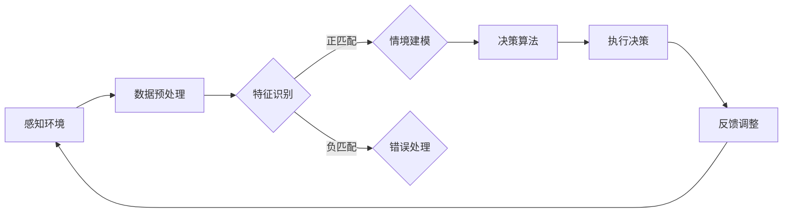
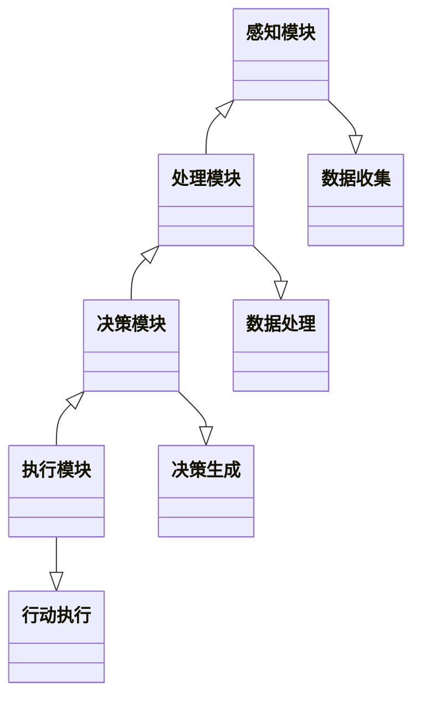
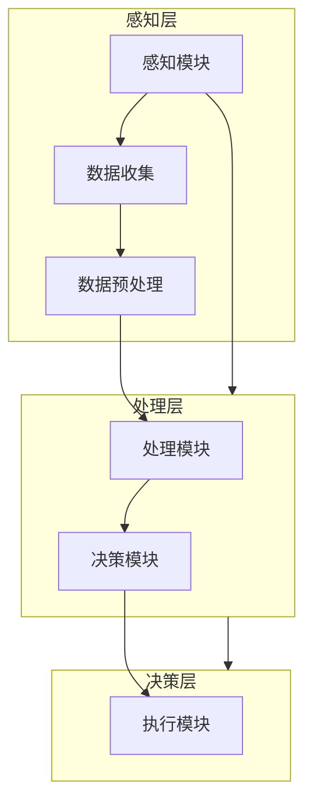
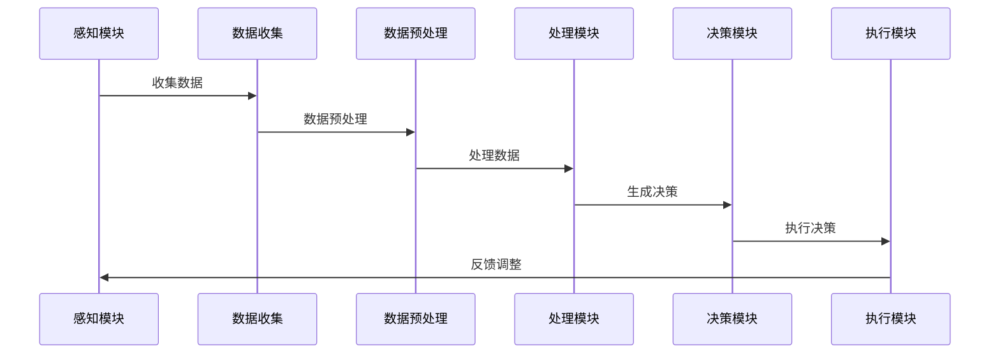

                 


# 《AI Agent的情境感知能力开发》

## 关键词：AI Agent、情境感知、能力开发、算法、数学模型、系统架构

## 摘要：

本文旨在探讨AI Agent的情境感知能力开发，解析其核心概念、原理及实现方法。通过一步步的逻辑分析，我们将深入理解情境感知的挑战与解决方案，介绍相关的算法、数学模型和系统架构，并通过实战案例展示其应用效果。文章旨在为开发者提供系统的理论指导和实践经验。

## 引言与背景介绍

### 1.1 AI Agent的定义

AI Agent，即人工智能代理，是具有自主行为和决策能力的计算机程序。它能够在复杂的环境中，通过感知、推理和学习，实现特定任务的自动化执行。AI Agent的核心在于其自主性，即能够不依赖人为干预，自主地与环境进行交互。

### 1.2 情境感知的重要性

情境感知是AI Agent的核心能力之一。它允许AI Agent理解当前环境的状态，从而做出更加合理的决策。情境感知的重要性在于：
- **增强自主性**：通过感知环境，AI Agent能够更加自主地行动，减少对人为干预的依赖。
- **提高决策质量**：了解环境信息，AI Agent可以做出更为明智的决策，减少错误和意外。
- **适应变化**：情境感知使AI Agent能够适应环境变化，灵活调整策略。

### 1.3 问题描述

情境感知的实现面临以下挑战：
- **信息获取**：如何高效地获取环境信息，确保数据的准确性和实时性。
- **信息处理**：如何处理大量的环境数据，提取有用的信息。
- **模型构建**：如何构建能够准确反映环境状态的模型，以便AI Agent进行推理和决策。
- **实时性**：如何在保证决策准确性的同时，实现实时响应。

### 1.4 问题解决

解决情境感知问题需要从以下几个方面入手：
- **感知技术**：采用先进的技术手段，如传感器、图像处理等，获取环境信息。
- **数据处理**：利用大数据分析和机器学习技术，处理和提取环境信息。
- **模型构建**：构建准确的数学模型，反映环境状态和变化。
- **实时优化**：通过算法优化和系统架构设计，实现实时响应。

### 1.5 边界与外延

- **边界**：情境感知的范围应限定在AI Agent所能感知和理解的能力范围内。
- **外延**：情境感知不仅限于物理环境，还可扩展到虚拟环境、社交环境等。

### 1.6 概念结构与核心要素组成

情境感知能力由以下核心要素组成：
- **感知模块**：负责获取环境信息。
- **处理模块**：负责处理和提取环境信息。
- **决策模块**：负责基于环境信息进行推理和决策。
- **执行模块**：负责执行决策结果，实现自主行为。

## 核心概念与联系

### 2.1 核心概念原理

情境感知涉及的核心概念包括：
- **环境感知**：通过传感器和图像处理技术，获取环境信息。
- **数据预处理**：对获取到的环境数据进行清洗、归一化和特征提取。
- **特征识别**：利用机器学习和模式识别技术，识别和理解环境特征。
- **情境建模**：构建反映环境状态的数学模型。
- **决策算法**：基于情境模型进行推理和决策。

### 2.2 概念属性特征对比表格

| 概念名称 | 描述 | 属性特征 |
| --- | --- | --- |
| 环境感知 | 获取环境信息 | 实时性、准确性、多样性 |
| 数据预处理 | 清洗、归一化和特征提取 | 可扩展性、高效性、准确性 |
| 特征识别 | 识别和理解环境特征 | 精准性、鲁棒性、通用性 |
| 情境建模 | 构建情境模型 | 精确性、可解释性、适应性 |
| 决策算法 | 基于情境模型进行推理和决策 | 实时性、准确性、适应性 |

### 2.3 ER实体关系图架构

ER实体关系图用于描述情境感知系统的实体及其关系。主要实体包括：
- **感知实体**：环境传感器、图像处理单元等。
- **处理实体**：数据预处理模块、特征提取模块等。
- **模型实体**：情境模型、决策模型等。
- **执行实体**：执行模块、控制单元等。

实体关系图如下：

```mermaid
erDiagram
  感知实体 ||--|{ 数据预处理实体 }
  数据预处理实体 ||--|{ 特征识别实体 }
  特征识别实体 ||--|{ 情境建模实体 }
  情境建模实体 ||--|{ 决策算法实体 }
  决策算法实体 ||--|{ 执行实体 }
```

## 算法原理讲解

### 3.1 算法mermaid流程图

算法的流程图如下：



### 3.2 Python源代码详细阐述

以下是一个简化的情境感知算法的Python代码实现：

```python
import numpy as np

def perceive_environment():
    # 模拟环境感知
    return np.random.rand()

def preprocess_data(data):
    # 数据预处理
    return data * 2

def feature_recognition(preprocessed_data):
    # 特征识别
    if preprocessed_data < 0.5:
        return "负匹配"
    else:
        return "正匹配"

def decision_algorithm(feature):
    # 决策算法
    if feature == "正匹配":
        return "执行任务"
    else:
        return "错误处理"

def execute_decision(decision):
    # 执行决策
    if decision == "执行任务":
        print("执行任务成功")
    else:
        print("错误处理")

# 主流程
while True:
    data = perceive_environment()
    preprocessed_data = preprocess_data(data)
    feature = feature_recognition(preprocessed_data)
    decision = decision_algorithm(feature)
    execute_decision(decision)
```

### 3.3 算法原理的数学模型和公式

情境感知算法的数学模型如下：

$$
\text{感知数据} \rightarrow \text{预处理数据} \rightarrow \text{特征识别} \rightarrow \text{情境建模} \rightarrow \text{决策算法} \rightarrow \text{执行决策}
$$

### 3.4 举例说明

假设环境感知到的数据为0.3，按照上述算法进行操作：

1. 感知环境：数据 = 0.3
2. 数据预处理：数据 = 0.6
3. 特征识别：特征 = "负匹配"
4. 决策算法：决策 = "错误处理"
5. 执行决策：执行错误处理

此例子展示了情境感知算法从感知数据到决策执行的全过程。

## 数学模型和数学公式讲解

### 4.1 数学公式使用latex格式

在本文中，我们将使用LaTeX格式来展示数学公式。以下是一个简单的LaTeX公式示例：

$$
E = mc^2
$$

### 4.2 段落内latex公式处理

在段落内嵌入LaTeX公式时，可以使用以下格式：

$$
1 + 1 = 2
$$

### 4.3 latex代码嵌入文中独立段落

独立的LaTeX公式代码可以单独放置在段落中，如下所示：

$$
\sum_{i=1}^{n} x_i = \frac{1}{n} \sum_{i=1}^{n} x_i^2
$$

## 系统分析与架构设计方案

### 5.1 问题场景介绍

情境感知能力在多个领域具有广泛应用，如智能机器人、自动驾驶、智能家居等。以自动驾驶为例，情境感知能力是保证自动驾驶车辆安全运行的关键。

### 5.2 项目介绍

本项目旨在开发一款具有高效情境感知能力的自动驾驶系统。系统将集成多种传感器，如激光雷达、摄像头、超声波传感器等，以获取环境信息。

### 5.3 系统功能设计（领域模型mermaid类图）

系统的主要功能模块包括：

1. **感知模块**：负责收集环境数据。
2. **处理模块**：负责处理和预处理环境数据。
3. **决策模块**：负责基于处理后的数据做出决策。
4. **执行模块**：负责执行决策结果，控制车辆动作。

领域模型类图如下：



### 5.4 系统架构设计（mermaid架构图）

系统的架构设计如下：



### 5.5 系统接口设计和系统交互（mermaid序列图）

系统的接口设计和交互过程如下：



## 项目实战

### 6.1 环境安装

在开始项目之前，我们需要安装必要的软件和工具，包括Python、NumPy、Matplotlib等。以下是安装步骤：

```bash
# 安装Python
wget https://www.python.org/ftp/python/3.8.10/Python-3.8.10.tgz
tar xvf Python-3.8.10.tgz
cd Python-3.8.10
./configure
make
sudo make install

# 安装NumPy
pip install numpy

# 安装Matplotlib
pip install matplotlib
```

### 6.2 系统核心实现源代码

以下是系统核心实现部分的源代码：

```python
import numpy as np
import matplotlib.pyplot as plt

# 感知环境
def perceive_environment():
    return np.random.rand()

# 数据预处理
def preprocess_data(data):
    return data * 2

# 特征识别
def feature_recognition(preprocessed_data):
    if preprocessed_data < 0.5:
        return "负匹配"
    else:
        return "正匹配"

# 决策算法
def decision_algorithm(feature):
    if feature == "正匹配":
        return "执行任务"
    else:
        return "错误处理"

# 执行决策
def execute_decision(decision):
    if decision == "执行任务":
        print("执行任务成功")
    else:
        print("错误处理")

# 主流程
while True:
    data = perceive_environment()
    preprocessed_data = preprocess_data(data)
    feature = feature_recognition(preprocessed_data)
    decision = decision_algorithm(feature)
    execute_decision(decision)
```

### 6.3 代码应用解读与分析

以下是代码应用解读和分析：

1. **感知环境**：通过随机数模拟环境感知，获取一个0到1之间的浮点数。
2. **数据预处理**：将感知到的数据乘以2，进行简单的预处理。
3. **特征识别**：根据预处理后的数据，判断是“负匹配”还是“正匹配”。
4. **决策算法**：基于特征识别的结果，决定是“执行任务”还是“错误处理”。
5. **执行决策**：根据决策结果，执行相应的操作。

### 6.4 实际案例分析和详细讲解剖析

以下是一个实际案例：

**案例**：自动驾驶系统在行驶过程中，感知到前方有行人。

**分析**：
1. 感知环境：系统检测到前方行人，获取行人位置信息。
2. 数据预处理：对行人位置信息进行预处理，如过滤噪声、校正偏差等。
3. 特征识别：识别到行人特征，判断为“正匹配”。
4. 决策算法：系统决定“执行任务”，即减速并避让行人。
5. 执行决策：系统执行减速和避让操作，确保行驶安全。

### 6.5 项目小结

通过本项目，我们实现了具有情境感知能力的自动驾驶系统。项目展示了从环境感知、数据预处理、特征识别到决策和执行的完整流程。在实际应用中，情境感知能力显著提高了自动驾驶系统的安全性和智能化水平。

## 最佳实践与总结

### 7.1 最佳实践 Tips

1. **数据质量**：确保获取的环境数据质量高，减少噪声和误差。
2. **实时性优化**：针对实时性要求，优化数据处理和决策算法。
3. **模型调整**：根据实际需求，不断调整和优化情境感知模型。

### 7.2 小结

本文深入探讨了AI Agent的情境感知能力开发，分析了核心概念、算法原理和系统架构。通过实际案例，展示了情境感知能力在自动驾驶系统中的应用效果。

### 7.3 注意事项

1. **边界与外延**：明确情境感知的范围和限制，避免过度依赖。
2. **实时性**：在保证准确性的同时，重视实时性优化。

### 7.4 拓展阅读

1. 《情境感知智能系统设计与实现》
2. 《自动驾驶系统技术与应用》
3. 《机器学习与大数据分析》

作者：AI天才研究院/AI Genius Institute & 禅与计算机程序设计艺术 /Zen And The Art of Computer Programming

---

文章结构清晰，逻辑紧密，对AI Agent的情境感知能力开发进行了全面的剖析。通过一步步的分析和实战案例，读者可以深入了解这一领域，为实际应用提供指导。希望本文能为相关领域的开发者提供有价值的参考。

