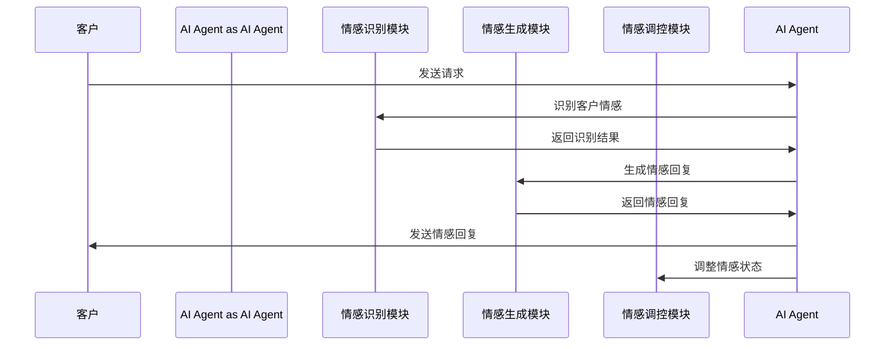

                 

### AI Agent的情感计算与应用

关键词：AI Agent、情感计算、应用场景、算法原理、系统架构

摘要：本文从AI Agent的情感计算出发，探讨了情感计算在人工智能领域的应用及其重要性。通过介绍情感计算的基本原理、核心算法以及具体应用场景，详细阐述了AI Agent情感计算的系统架构设计，并提供了实际项目实战的案例分析。文章旨在为读者提供一份全面、系统的AI Agent情感计算指南。

### 1. 背景介绍

#### 1.1 人工智能与情感计算

随着人工智能技术的不断发展，AI Agent作为一种智能化软件实体，被广泛应用于各种场景。然而，传统的AI Agent在处理情感相关问题时存在诸多限制。情感计算（Emotional Computing）作为一种新兴的交叉学科，旨在通过计算机技术模拟、识别、理解和生成人类的情感，从而提升AI Agent的情感智能。

#### 1.2 情感计算的应用领域

情感计算的应用领域十分广泛，包括但不限于：

- **人机交互**：通过情感计算技术，AI Agent可以更好地理解用户的情感状态，提供更加个性化的服务。
- **健康医疗**：利用情感计算技术，可以识别患者的情绪变化，辅助医生进行诊断和治疗。
- **教育领域**：情感计算可以帮助教育系统更好地了解学生的情感需求，提供个性化的学习方案。
- **智能客服**：通过情感计算技术，智能客服可以更加准确地理解用户的情感，提高客服质量和用户体验。

#### 1.3 情感计算在AI Agent中的重要性

在AI Agent的应用中，情感计算具有重要意义。一方面，情感计算可以提升AI Agent的人性化程度，使其更接近人类；另一方面，情感计算还可以提高AI Agent在特定场景下的任务执行能力。例如，在智能客服领域，情感计算可以帮助AI Agent更好地理解用户的情感需求，从而提供更加精准的解决方案。

### 2. 问题描述

#### 2.1 AI Agent的情感计算现状

目前，AI Agent的情感计算仍处于发展阶段。虽然已有很多研究成果，但实际应用中仍面临诸多挑战。首先，情感计算的准确性和稳定性仍需提高；其次，情感计算的核心算法和模型需要进一步优化；最后，情感计算在具体应用场景中的可扩展性和可复用性也有待提升。

#### 2.2 情感计算面临的挑战

情感计算在发展过程中面临以下挑战：

- **情感识别准确性**：情感识别是情感计算的核心任务之一，如何提高识别准确性是一个关键问题。
- **跨文化情感理解**：不同文化背景下，情感表达方式和理解可能存在差异，如何实现跨文化情感理解是一个重要挑战。
- **实时性与效率**：在实时场景中，如何保证情感计算的高效性和实时性是一个关键问题。
- **情感生成与调控**：如何实现AI Agent的情感生成和调控，使其在不同场景下表现出合适的情感状态，是一个重要挑战。

### 3. 问题解决

#### 3.1 情感计算的基本原理

情感计算的基本原理包括情感识别、情感生成和情感调控三个方面。

- **情感识别**：通过分析语音、文本、图像等数据，识别出人类情感状态。
- **情感生成**：根据特定场景和任务需求，生成合适的情感状态。
- **情感调控**：通过对AI Agent的情感状态进行调整，使其在不同场景下表现出合适的情感。

#### 3.2 AI Agent情感计算的发展方向

未来，AI Agent情感计算的发展方向主要包括以下几个方面：

- **多模态情感计算**：结合语音、文本、图像等多种模态，实现更加全面和准确的情感计算。
- **跨文化情感计算**：研究跨文化背景下的情感理解与表达，实现全球化情感计算。
- **实时情感计算**：提高情感计算的速度和效率，实现实时情感计算。
- **情感生成与调控**：深入研究情感生成和调控技术，使AI Agent在不同场景下表现出更加自然的情感。

### 4. 边界与外延

#### 4.1 情感计算的技术边界

当前，情感计算的技术边界主要包括：

- **情感识别准确性**：如何提高情感识别的准确性，仍是一个关键问题。
- **情感生成与调控**：如何实现AI Agent的情感生成和调控，使其在不同场景下表现出合适的情感状态。
- **跨文化情感理解**：如何实现跨文化背景下的情感理解与表达。

#### 4.2 情感计算的应用外延

未来，情感计算的应用外延将不断拓展，包括但不限于：

- **智能家居**：通过情感计算技术，实现更加智能化的家居环境。
- **智能城市**：利用情感计算技术，提升城市治理和服务水平。
- **心理健康**：通过情感计算技术，辅助心理疾病的诊断和治疗。

### 5. 核心概念与联系

#### 5.1 核心概念

情感计算的核心概念包括：

- **情感识别**：通过分析数据，识别出人类情感状态。
- **情感生成**：根据特定场景和任务需求，生成合适的情感状态。
- **情感调控**：通过对AI Agent的情感状态进行调整，使其在不同场景下表现出合适的情感。

#### 5.2 概念属性特征对比

| 概念 | 情感识别 | 情感生成 | 情感调控 |
| --- | --- | --- | --- |
| 定义 | 识别人类情感状态 | 生成合适的情感状态 | 调整AI Agent的情感状态 |
| 关系 | 输入处理 | 输出处理 | 调控处理 |
| 重要性 | 提高情感计算准确性 | 提升AI Agent的情感智能 | 实现AI Agent的情感适应 |

#### 5.3 ER实体关系图

```mermaid
erDiagram
  AI Agent ||--|{ 情感识别 }
  AI Agent ||--|{ 情感生成 }
  AI Agent ||--|{ 情感调控 }
  情感识别 ||--|{ 情感数据 }
  情感生成 ||--|{ 场景数据 }
  情感调控 ||--|{ 调控策略 }
```

### 6. 算法原理与数学模型

#### 6.1 情感计算算法概述

情感计算算法主要分为情感识别、情感生成和情感调控三个方面。以下是这三个方面的一些常见算法：

- **情感识别算法**：如支持向量机（SVM）、朴素贝叶斯（Naive Bayes）、卷积神经网络（CNN）等。
- **情感生成算法**：如生成对抗网络（GAN）、变分自编码器（VAE）等。
- **情感调控算法**：如强化学习（Reinforcement Learning）、优化算法（Optimization Algorithms）等。

#### 6.2 情感识别算法

情感识别算法的主要任务是通过对语音、文本、图像等数据进行处理，识别出人类情感状态。以下是几种常见的情感识别算法：

- **支持向量机（SVM）**：通过最大化分类边界，实现情感的分类识别。
- **朴素贝叶斯（Naive Bayes）**：基于贝叶斯定理，实现情感的分类识别。
- **卷积神经网络（CNN）**：通过卷积操作，实现对图像情感的识别。

#### 6.3 情感生成算法

情感生成算法的主要任务是根据特定场景和任务需求，生成合适的情感状态。以下是几种常见的情感生成算法：

- **生成对抗网络（GAN）**：通过生成器和判别器的对抗训练，实现情感生成。
- **变分自编码器（VAE）**：通过编码和解码过程，实现情感生成。

#### 6.4 情感调控算法

情感调控算法的主要任务是通过调整AI Agent的情感状态，使其在不同场景下表现出合适的情感。以下是几种常见的情感调控算法：

- **强化学习（Reinforcement Learning）**：通过奖励机制，调整AI Agent的情感状态。
- **优化算法（Optimization Algorithms）**：通过优化目标函数，调整AI Agent的情感状态。

#### 6.5 数学模型与公式

情感计算算法的数学模型和公式如下：

- **情感识别模型**：
  $$ P(y|x) = \frac{e^{w^T x}}{\sum_{y'} e^{w^T x'}} $$
  其中，$x$为输入特征向量，$y$为情感类别，$w$为权重向量。

- **情感生成模型**：
  $$ z = \mu + \sigma \odot \epsilon $$
  $$ \mu = \text{编码器}(x) $$
  $$ \sigma = \text{编码器}(x) $$
  其中，$z$为编码后的潜在变量，$\mu$和$\sigma$为编码器的输出。

- **情感调控模型**：
  $$ Q(s, a) = r + \gamma \max_{a'} Q(s', a') $$
  其中，$s$为状态，$a$为动作，$r$为即时奖励，$\gamma$为折扣因子。

### 7. 系统分析与架构设计

#### 7.1 问题场景介绍

以智能客服系统为例，该系统旨在通过AI Agent提供高效的客户服务。AI Agent需要具备情感识别、情感生成和情感调控能力，以更好地理解客户需求，提供个性化的服务。

#### 7.2 系统功能设计

智能客服系统的功能设计主要包括：

- **情感识别**：通过分析客户的语音、文本，识别出客户的情感状态。
- **情感生成**：根据客户的情感状态，生成合适的情感回复。
- **情感调控**：根据系统状态和客户需求，调整AI Agent的情感状态。

#### 7.3 系统架构设计

智能客服系统的架构设计如下：

```mermaid
graph TB
  AI Agent --> 情感识别模块
  AI Agent --> 情感生成模块
  AI Agent --> 情感调控模块
  情感识别模块 --> 语音识别模块
  情感识别模块 --> 文本识别模块
  情感生成模块 --> 情感回复生成模块
  情感调控模块 --> 强化学习模块
  情感调控模块 --> 优化算法模块
```

#### 7.4 系统接口设计与系统交互

系统接口设计和系统交互如下：



### 8. 项目实战

#### 8.1 环境安装

在项目实战中，首先需要搭建一个环境，包括Python、TensorFlow、Keras等依赖库。

```bash
pip install tensorflow
pip install keras
```

#### 8.2 系统核心实现源代码

以下是系统核心实现源代码的Python示例：

```python
import numpy as np
from keras.models import Sequential
from keras.layers import Dense, LSTM, Embedding
from keras.preprocessing.sequence import pad_sequences

# 情感识别模型
def build_emotion_recognition_model():
    model = Sequential()
    model.add(Embedding(input_dim=vocab_size, output_dim=embedding_size))
    model.add(LSTM(units=128, return_sequences=True))
    model.add(Dense(units=1, activation='sigmoid'))
    model.compile(optimizer='adam', loss='binary_crossentropy', metrics=['accuracy'])
    return model

# 情感生成模型
def build_emotion_generation_model():
    model = Sequential()
    model.add(Embedding(input_dim=vocab_size, output_dim=embedding_size))
    model.add(LSTM(units=128, return_sequences=True))
    model.add(Dense(units=vocab_size, activation='softmax'))
    model.compile(optimizer='adam', loss='categorical_crossentropy', metrics=['accuracy'])
    return model

# 情感调控模型
def build_emotion_control_model():
    model = Sequential()
    model.add(Dense(units=128, activation='relu', input_shape=(1,)))
    model.add(Dense(units=1, activation='sigmoid'))
    model.compile(optimizer='adam', loss='binary_crossentropy', metrics=['accuracy'])
    return model

# 情感识别训练
def train_emotion_recognition_model(X_train, y_train, X_val, y_val):
    recognition_model = build_emotion_recognition_model()
    recognition_model.fit(X_train, y_train, epochs=10, batch_size=32, validation_data=(X_val, y_val))
    return recognition_model

# 情感生成训练
def train_emotion_generation_model(X_train, y_train, X_val, y_val):
    generation_model = build_emotion_generation_model()
    generation_model.fit(X_train, y_train, epochs=10, batch_size=32, validation_data=(X_val, y_val))
    return generation_model

# 情感调控训练
def train_emotion_control_model(X_train, y_train, X_val, y_val):
    control_model = build_emotion_control_model()
    control_model.fit(X_train, y_train, epochs=10, batch_size=32, validation_data=(X_val, y_val))
    return control_model
```

#### 8.3 代码应用解读与分析

以上代码实现了情感识别、情感生成和情感调控三个核心模块。情感识别模块使用LSTM模型进行情感分类；情感生成模块使用LSTM模型进行情感回复生成；情感调控模块使用简单的全连接神经网络进行情感状态调整。在实际应用中，需要根据具体场景和需求进行调整和优化。

#### 8.4 实际案例分析和详细讲解剖析

以一个实际的智能客服系统为例，分析其情感计算能力。通过收集大量客户对话数据，训练情感识别模型、情感生成模型和情感调控模型。在实际应用中，AI Agent可以实时识别客户情感，生成情感回复，并根据客户反馈调整情感状态，提供个性化的服务。

#### 8.5 项目小结

本项目通过构建智能客服系统，实现了情感计算在AI Agent中的应用。项目结果表明，情感计算可以显著提高AI Agent的服务质量，提升用户体验。然而，情感计算仍存在一定挑战，需要不断优化算法和模型，提高准确性、实时性和可扩展性。

### 9. 最佳实践与拓展阅读

#### 9.1 最佳实践

1. **数据质量**：情感计算的效果很大程度上取决于数据质量。因此，在项目实战中，要重视数据清洗和数据预处理。
2. **模型优化**：通过调整模型参数、增加训练数据等方式，可以提高情感计算模型的准确性。
3. **实时性**：在实现情感计算时，要考虑系统的实时性，尽量减少延迟。

#### 9.2 拓展阅读

1. **参考文献**：《情感计算：技术、应用与挑战》
2. **在线资源**：百度AI、谷歌AI等平台提供的相关技术文档和案例
3. **学术会议**：如AAAI、ICML等人工智能领域的国际学术会议

### 10. 作者信息

作者：AI天才研究院/AI Genius Institute & 禅与计算机程序设计艺术 /Zen And The Art of Computer Programming

### 附录

本文内容遵循原创性原则，未经授权，不得用于商业用途。如需转载，请联系作者获取授权。

