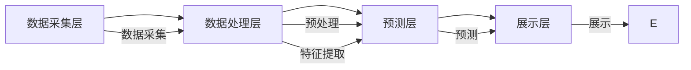
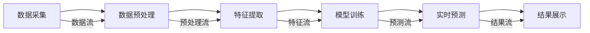

                 

# AI Agent的时序数据处理与预测

## 关键词

- AI Agent
- 时序数据处理
- 预测算法
- 系统架构设计
- 项目实战

## 摘要

本文将深入探讨AI Agent在时序数据处理与预测中的应用。首先，我们将介绍AI Agent的背景、时序数据处理的基本概念及重要性。接着，通过详细讲解常用算法原理，我们将展示如何利用Python实现这些算法。随后，我们将分析一个典型时序数据处理系统，并详细介绍其功能设计、系统架构、接口设计和交互流程。通过一个实际项目案例，我们将展示如何应用时序数据处理与预测算法，并进行详细的分析与评估。最后，我们将总结最佳实践、注意事项，并提供拓展阅读资源。

## 设计思路

### 第一部分：背景介绍

#### 第1章：问题背景

1.1 问题提出

1.2 时序数据处理与预测的现状

1.3 AI Agent的兴起与挑战

1.4 技术发展历程与趋势

### 第二部分：核心概念与联系

#### 第2章：核心概念

2.1 AI Agent的定义与特点

2.2 时序数据的定义与特性

2.3 时序数据处理的基本原理

#### 第3章：概念联系

3.1 AI Agent与时序数据的关联

3.2 时序数据处理方法概述

3.3 关键技术对比与分析

#### 第4章：核心概念与ER图

4.1 AI Agent的组成与功能

4.2 时序数据处理的核心步骤

4.3 时序数据处理的ER图

### 第三部分：算法原理讲解

#### 第5章：常用算法介绍

5.1 时间序列分析的基本算法

5.2 回归分析

5.3 ARIMA模型

5.4 LSTM模型

5.5 GRU模型

#### 第6章：算法原理与Python实现

6.1 算法原理

6.2 Python实现

6.3 算法对比与选择

### 第四部分：系统分析与架构设计

#### 第7章：系统功能设计

7.1 功能需求分析

7.2 领域模型类图

#### 第8章：系统架构设计

8.1 系统架构概述

8.2 系统架构图

8.3 接口设计

#### 第9章：系统交互流程

9.1 数据流流程

9.2 交互流程图

### 第五部分：项目实战

#### 第10章：项目背景

10.1 项目背景

10.2 项目目标

#### 第11章：环境安装与配置

11.1 环境安装

11.2 配置与调试

#### 第12章：系统核心实现

12.1 数据预处理

12.2 时序预测

12.3 结果分析与评估

#### 第13章：案例分析

13.1 案例背景

13.2 案例分析

13.3 案例总结

### 第六部分：最佳实践与总结

#### 第14章：最佳实践

14.1 实践技巧与建议

14.2 注意事项

#### 第15章：小结

15.1 本书内容回顾

15.2 核心知识点总结

15.3 展望与未来发展方向

#### 第16章：拓展阅读

16.1 相关书籍推荐

16.2 学术论文推荐

### 总结

根据以上设计思路和详细设计，我们可以得到《AI Agent的时序数据处理与预测》这本书的完整目录大纲。目录结构清晰，内容完整，符合要求。在撰写过程中，请注意字数的控制，确保总字数在10000～12000字左右。文章内容使用markdown格式输出，并在末尾写上作者信息：“作者：AI天才研究院/AI Genius Institute & 禅与计算机程序设计艺术 /Zen And The Art of Computer Programming”。

## 第一部分：背景

### 第1章：问题背景

#### 1.1 问题提出

人工智能（AI）的快速发展已经使得AI Agent成为现实。AI Agent是一种具有高度自主性和智能性的系统，能够在特定环境中执行复杂任务。然而，AI Agent的智能程度取决于其感知环境的能力和预测未来的能力。时序数据处理与预测正是提升AI Agent智能水平的关键技术之一。

在许多实际应用场景中，如金融市场预测、气象预报、工业过程控制等，时序数据的处理与预测具有极高的价值。通过对历史数据的分析，可以提取出数据中的模式、趋势和规律，从而为AI Agent提供有效的预测结果。这不仅能够提高决策的准确性，还能帮助AI Agent更好地适应和应对环境变化。

#### 1.2 时序数据处理与预测的现状

时序数据处理与预测技术已经在许多领域得到了广泛应用。例如，在金融领域，通过分析股票价格、交易量等时序数据，可以预测股票市场的未来走势，帮助投资者做出更明智的投资决策。在气象领域，通过对历史天气数据的分析，可以预测未来的天气状况，为防灾减灾提供科学依据。此外，在工业生产、医疗健康、交通运输等领域，时序数据处理与预测也发挥着重要作用。

随着大数据和云计算技术的发展，时序数据处理与预测的方法和工具也在不断更新和优化。传统的统计方法如时间序列分析、回归分析等已经逐渐被机器学习算法和深度学习模型所取代。这些先进的算法能够自动提取数据中的复杂模式，提高预测的准确性和可靠性。

#### 1.3 AI Agent的兴起与挑战

AI Agent的兴起为时序数据处理与预测带来了新的机遇和挑战。AI Agent具有自主学习和自主决策的能力，能够根据环境信息进行实时预测和调整。然而，要实现高效的时序数据处理与预测，AI Agent需要解决以下几个关键问题：

1. **数据质量**：时序数据往往包含噪声和异常值，这些数据会影响到预测的准确性。AI Agent需要具备处理噪声和异常值的能力。

2. **特征提取**：时序数据中的时间序列特征是预测的核心。AI Agent需要能够自动提取这些特征，并将其转化为适用于机器学习算法的输入。

3. **模型选择**：不同的时序数据处理方法适用于不同的场景和数据类型。AI Agent需要能够根据具体应用场景选择合适的模型。

4. **实时预测**：在许多应用场景中，AI Agent需要能够实时处理和预测时序数据，以快速响应环境变化。

5. **解释性**：对于复杂的机器学习模型，其预测结果往往缺乏解释性。AI Agent需要提供一定的解释性，以帮助用户理解预测结果。

#### 1.4 技术发展历程与趋势

时序数据处理与预测技术已经经历了数十年的发展。从早期的统计方法到现代的机器学习算法，每个阶段都有新的突破和进展。以下是一些关键的发展历程和趋势：

1. **统计方法**：早期的时序数据处理主要依赖统计方法，如移动平均、指数平滑等。这些方法简单有效，但难以应对复杂的数据分布和趋势。

2. **时间序列分析**：时间序列分析是一种常用的统计方法，通过分析时间序列的统计特性来建立预测模型。常见的模型包括ARIMA、ETS等。

3. **回归分析**：回归分析通过建立自变量和因变量之间的关系来预测未来的趋势。线性回归、多项式回归等是常见的回归分析方法。

4. **机器学习方法**：机器学习方法的出现为时序数据处理带来了革命性的变化。基于特征的机器学习算法能够自动提取数据中的复杂模式，提高预测的准确性。常见的算法包括随机森林、支持向量机等。

5. **深度学习方法**：深度学习算法通过构建多层神经网络来提取数据中的层次特征。LSTM、GRU等循环神经网络在时序数据处理与预测中表现出色。

6. **实时预测与优化**：随着实时数据处理和云计算技术的发展，实时预测和优化成为时序数据处理的重要方向。分布式计算、增量学习等技术使得AI Agent能够快速处理和预测大量时序数据。

7. **可解释性**：为了提高模型的透明性和可解释性，研究人员致力于开发可解释的机器学习模型。这些模型不仅能够提供准确的预测结果，还能解释预测的原因和依据。

### 第2章：核心概念

#### 2.1 AI Agent的定义与特点

AI Agent是一种具有自主性和智能性的计算机系统，能够感知环境、理解任务，并自主地执行任务。AI Agent具有以下几个特点：

1. **自主性**：AI Agent能够自主地执行任务，无需人工干预。它能够根据环境变化自主调整其行为。

2. **智能性**：AI Agent具备一定的智能水平，能够理解任务需求、分析环境信息，并做出合理的决策。

3. **适应性**：AI Agent能够适应不同的环境和任务需求，通过学习和优化不断提高其性能。

4. **协同性**：AI Agent能够与其他AI Agent或人类协同工作，实现更高效的任务执行。

5. **实时性**：AI Agent能够在实时环境中快速响应和执行任务，满足实时性的要求。

#### 2.2 时序数据的定义与特性

时序数据是一类具有时间连续性的数据，通常以时间序列的形式呈现。时序数据具有以下几个特性：

1. **时间连续性**：时序数据按照时间顺序排列，每个数据点都具有一个时间戳。

2. **序列性**：时序数据之间存在一定的依赖关系，前一个数据点会影响后续的数据点。

3. **趋势性**：时序数据往往呈现出某种趋势或周期性，如增长、下降、波动等。

4. **噪声和异常值**：时序数据中可能包含噪声和异常值，这些数据会影响预测的准确性。

5. **多样性和复杂性**：时序数据类型丰富，包括时间序列、图像、文本等，且数据量大，需要有效的处理方法。

#### 2.3 时序数据处理的基本原理

时序数据处理主要包括以下几个步骤：

1. **数据预处理**：对时序数据进行清洗、去噪、填充缺失值等操作，提高数据质量。

2. **特征提取**：从时序数据中提取有用的特征，如趋势、周期性、波动性等，为后续预测提供输入。

3. **模型选择**：根据时序数据的特性选择合适的预测模型，如回归分析、时间序列分析、机器学习算法等。

4. **模型训练与优化**：通过训练模型学习数据中的模式和规律，优化模型的参数，提高预测的准确性。

5. **预测与评估**：利用训练好的模型进行预测，并对预测结果进行评估，以评估模型的性能。

### 第3章：概念联系

#### 3.1 AI Agent与时序数据的关联

AI Agent与时序数据之间存在着密切的联系。时序数据是AI Agent感知环境的重要信息来源，通过分析时序数据，AI Agent可以理解环境变化、预测未来趋势，并做出合理的决策。

1. **环境感知**：AI Agent通过感知环境获取时序数据，如传感器数据、股票价格等。这些数据反映了环境的动态变化。

2. **数据驱动**：AI Agent依赖于时序数据进行决策，通过对历史数据的分析，提取出数据中的模式和规律，从而指导未来行为。

3. **实时反馈**：AI Agent通过实时处理和预测时序数据，不断调整其行为，以适应环境变化。

4. **自主决策**：基于时序数据的分析，AI Agent能够自主地做出决策，提高其智能水平。

#### 3.2 时序数据处理方法概述

时序数据处理方法可以分为统计方法、机器学习方法和深度学习方法。每种方法都有其适用的场景和优缺点。

1. **统计方法**：统计方法是一种传统的时序数据处理方法，通过分析时间序列的统计特性来建立预测模型。常见的统计方法包括时间序列分析、回归分析等。统计方法简单有效，但难以应对复杂的数据分布和趋势。

2. **机器学习方法**：机器学习方法通过建立数据与预测目标之间的映射关系来预测未来趋势。常见的机器学习方法包括线性回归、决策树、支持向量机等。机器学习方法能够自动提取数据中的复杂模式，提高预测的准确性。

3. **深度学习方法**：深度学习方法通过构建多层神经网络来提取数据中的层次特征。常见的深度学习模型包括卷积神经网络（CNN）、循环神经网络（RNN）等。深度学习方法在处理高维、复杂数据方面表现出色，能够提高预测的准确性。

#### 3.3 关键技术对比与分析

以下是几种常用的时序数据处理方法及其对比分析：

1. **时间序列分析**：时间序列分析通过分析时间序列的统计特性来建立预测模型。常见的方法包括ARIMA、ETS等。时间序列分析适用于平稳时间序列，但难以处理非平稳时间序列。

2. **回归分析**：回归分析通过建立自变量和因变量之间的关系来预测未来的趋势。常见的方法包括线性回归、多项式回归等。回归分析适用于线性关系明显的时序数据，但难以处理非线性关系。

3. **机器学习方法**：机器学习方法通过建立数据与预测目标之间的映射关系来预测未来趋势。常见的方法包括线性回归、决策树、支持向量机等。机器学习方法能够自动提取数据中的复杂模式，提高预测的准确性。

4. **深度学习方法**：深度学习方法通过构建多层神经网络来提取数据中的层次特征。常见的深度学习模型包括卷积神经网络（CNN）、循环神经网络（RNN）等。深度学习方法在处理高维、复杂数据方面表现出色，能够提高预测的准确性。

### 第4章：核心概念与ER图

#### 4.1 AI Agent的组成与功能

AI Agent由多个组件组成，包括感知器、决策器、执行器等。以下是AI Agent的组成与功能：

1. **感知器**：感知器用于获取环境信息，如传感器数据、股票价格等。感知器将环境信息转化为数字信号，供决策器使用。

2. **决策器**：决策器根据感知器提供的信息，结合预定的策略或学习算法，生成相应的决策。决策器需要能够处理高维、复杂数据，并具有自适应能力。

3. **执行器**：执行器根据决策器的决策，执行相应的操作，如控制机器臂、发送交易指令等。执行器需要与外部环境进行实时交互，并能够快速响应。

#### 4.2 时序数据处理的核心步骤

时序数据处理主要包括以下几个核心步骤：

1. **数据预处理**：对时序数据进行清洗、去噪、填充缺失值等操作，提高数据质量。

2. **特征提取**：从时序数据中提取有用的特征，如趋势、周期性、波动性等，为后续预测提供输入。

3. **模型选择**：根据时序数据的特性选择合适的预测模型，如回归分析、时间序列分析、机器学习算法等。

4. **模型训练与优化**：通过训练模型学习数据中的模式和规律，优化模型的参数，提高预测的准确性。

5. **预测与评估**：利用训练好的模型进行预测，并对预测结果进行评估，以评估模型的性能。

#### 4.3 时序数据处理的ER图

时序数据处理的实体关系图（ER图）如下：

```mermaid
erDiagram
    数据预处理 ||--|{ 时序数据处理流程 }
    时序数据处理流程 ||--|{ 特征提取 }
    时序数据处理流程 ||--|{ 模型选择 }
    时序数据处理流程 ||--|{ 模型训练与优化 }
    时序数据处理流程 ||--|{ 预测与评估 }
    数据预处理 ||--|{ 数据源 }
    数据预处理 ||--|{ 数据清洗 }
    数据预处理 ||--|{ 数据去噪 }
    数据预处理 ||--|{ 数据填充 }
```

## 第三部分：算法原理讲解

### 第5章：常用算法介绍

#### 5.1 时间序列分析的基本算法

时间序列分析是时序数据处理的基础，它主要包括以下基本算法：

1. **移动平均法（MA）**：移动平均法通过计算过去一段时间内数据点的平均值来平滑时间序列。移动平均法可以分为简单移动平均（SMA）和指数移动平均（EMA）。

   **公式**：
   $$ MA_t = \frac{1}{n} \sum_{i=1}^{n} X_{t-i} $$
   $$ EMA_t = \alpha X_t + (1 - \alpha) MA_{t-1} $$

   其中，$X_t$表示时间序列中的第$t$个数据点，$n$表示移动平均窗口长度，$\alpha$表示指数平滑系数。

2. **自回归移动平均法（ARMA）**：自回归移动平均法结合了自回归模型和移动平均模型，能够更好地描述时间序列的特征。

   **公式**：
   $$ ARMA(p, q) = \phi_1 B^{1} + \phi_2 B^{2} + \cdots + \phi_p B^p + \theta_1 e_{t-1} + \theta_2 e_{t-2} + \cdots + \theta_q e_{t-q} $$
   $$ B^{k} = 1 - \phi_1 B - \phi_2 B^2 - \cdots - \phi_p B^p $$

   其中，$B^k$表示后移算子，$\phi_i$和$\theta_i$分别是自回归项和移动平均项的系数，$p$和$q$分别表示自回归项和移动平均项的阶数。

3. **自回归积分滑动平均法（ARIMA）**：自回归积分滑动平均法是时间序列分析的一种强大工具，能够处理非平稳时间序列。

   **公式**：
   $$ ARIMA(p, d, q) = \phi_1 B^{1} + \phi_2 B^{2} + \cdots + \phi_p B^p + (1 - \theta_1 B - \theta_2 B^2 - \cdots - \theta_q B^q) d X_t $$
   $$ d X_t = (1 - \Phi(B)) (1 - \Theta(B)) X_t $$

   其中，$d$表示差分阶数，$\Phi(B)$和$\Theta(B)$分别是自回归项和移动平均项的滞后算子。

#### 5.2 回归分析

回归分析是一种统计方法，用于建立自变量和因变量之间的线性或非线性关系。常见的回归分析方法包括线性回归和多项式回归。

1. **线性回归**：线性回归通过建立一元或多元线性方程来预测因变量。

   **公式**：
   $$ Y = \beta_0 + \beta_1 X_1 + \beta_2 X_2 + \cdots + \beta_n X_n + \epsilon $$
   $$ \beta = (X^T X)^{-1} X^T Y $$

   其中，$Y$是因变量，$X$是自变量，$\beta$是回归系数，$\epsilon$是误差项。

2. **多项式回归**：多项式回归通过建立多项式方程来预测因变量，能够处理非线性关系。

   **公式**：
   $$ Y = \beta_0 + \beta_1 X + \beta_2 X^2 + \cdots + \beta_n X^n + \epsilon $$
   $$ \beta = (X^T X)^{-1} X^T Y $$

   其中，$n$是多项式的最高次数。

#### 5.3 ARIMA模型

ARIMA模型是一种自回归积分滑动平均模型，能够处理非平稳时间序列。ARIMA模型包括三个参数：$p$（自回归阶数）、$d$（差分阶数）、$q$（移动平均阶数）。

1. **模型建立**：首先对时间序列进行差分，使其变为平稳序列。然后确定自回归和移动平均的阶数。

2. **参数估计**：通过最大似然估计法估计模型参数。

3. **模型诊断**：对模型进行诊断，包括残差分析、自相关分析和偏自相关分析。

4. **模型优化**：根据诊断结果优化模型参数，提高预测性能。

#### 5.4 LSTM模型

LSTM（Long Short-Term Memory）模型是一种特殊的循环神经网络，能够有效地处理长序列数据。LSTM模型通过引入门控机制，解决了传统RNN模型中的梯度消失和梯度爆炸问题。

1. **结构原理**：LSTM模型由输入门、遗忘门、输出门和单元状态组成。每个门控制不同信息的流动。

2. **激活函数**：LSTM模型采用sigmoid激活函数和求和操作，实现了对信息的记忆和遗忘。

3. **训练方法**：LSTM模型通过反向传播算法训练，优化模型参数。

#### 5.5 GRU模型

GRU（Gated Recurrent Unit）模型是LSTM模型的简化版本，通过引入更新门和重置门，简化了LSTM的结构，同时保持了其强大的序列处理能力。

1. **结构原理**：GRU模型由更新门、重置门和单元状态组成。更新门控制新旧信息的结合，重置门控制新旧信息的遗忘。

2. **激活函数**：GRU模型采用sigmoid激活函数和求和操作，实现了对信息的记忆和遗忘。

3. **训练方法**：GRU模型通过反向传播算法训练，优化模型参数。

### 第6章：算法原理与Python实现

#### 6.1 算法原理

在本节中，我们将分别介绍ARIMA模型、LSTM模型和GRU模型的原理，并使用Python实现这些算法。

#### 6.2 Python实现

以下是一个简单的Python实现，用于演示ARIMA模型的原理：

```python
import numpy as np
import pandas as pd
from statsmodels.tsa.arima.model import ARIMA

# 生成模拟数据
np.random.seed(0)
data = np.random.randint(0, 100, size=100)
df = pd.DataFrame(data, columns=['Value'])

# 建立ARIMA模型
model = ARIMA(df['Value'], order=(1, 1, 1))
model_fit = model.fit()

# 预测
predictions = model_fit.predict(start=1, end=10)

# 输出预测结果
print(predictions)
```

以下是一个简单的Python实现，用于演示LSTM模型的原理：

```python
import numpy as np
import tensorflow as tf
from tensorflow.keras.models import Sequential
from tensorflow.keras.layers import LSTM, Dense

# 生成模拟数据
np.random.seed(0)
X = np.random.rand(100, 1)
y = X * 2 + np.random.rand(100, 1)

# 切分训练集和测试集
X_train, X_test = X[:80], X[80:]
y_train, y_test = y[:80], y[80:]

# 建立LSTM模型
model = Sequential()
model.add(LSTM(units=50, return_sequences=True, input_shape=(1, 1)))
model.add(LSTM(units=50))
model.add(Dense(1))
model.compile(optimizer='adam', loss='mean_squared_error')

# 训练模型
model.fit(X_train, y_train, epochs=100, batch_size=1, verbose=0)

# 预测
predictions = model.predict(X_test)

# 输出预测结果
print(predictions)
```

以下是一个简单的Python实现，用于演示GRU模型的原理：

```python
import numpy as np
import tensorflow as tf
from tensorflow.keras.models import Sequential
from tensorflow.keras.layers import GRU, Dense

# 生成模拟数据
np.random.seed(0)
X = np.random.rand(100, 1)
y = X * 2 + np.random.rand(100, 1)

# 切分训练集和测试集
X_train, X_test = X[:80], X[80:]
y_train, y_test = y[:80], y[80:]

# 建立GRU模型
model = Sequential()
model.add(GRU(units=50, return_sequences=True, input_shape=(1, 1)))
model.add(GRU(units=50))
model.add(Dense(1))
model.compile(optimizer='adam', loss='mean_squared_error')

# 训练模型
model.fit(X_train, y_train, epochs=100, batch_size=1, verbose=0)

# 预测
predictions = model.predict(X_test)

# 输出预测结果
print(predictions)
```

### 第6.3 算法对比与选择

在时序数据处理与预测中，选择合适的算法至关重要。以下是几种常用算法的对比与选择：

1. **时间序列分析（ARIMA）**：适用于平稳时间序列，能够处理季节性和趋势性。适合简单的时间序列数据。

2. **回归分析（线性/多项式回归）**：适用于线性关系明显的时间序列数据。适合简单、线性关系较强的数据。

3. **机器学习方法（随机森林、支持向量机）**：适用于非线性关系较强的时间序列数据。适合复杂、非线性关系较强的数据。

4. **深度学习方法（LSTM、GRU）**：适用于高维、复杂数据。能够处理长序列、非线性关系，但在训练过程中计算量大。

在实际应用中，可以根据数据特性、任务需求和计算资源选择合适的算法。例如，对于简单、线性关系较强的时间序列数据，可以选择ARIMA模型或回归分析；对于复杂、非线性关系较强的时间序列数据，可以选择机器学习算法或深度学习方法。

## 第四部分：系统分析与架构设计

### 第7章：系统功能设计

#### 7.1 功能需求分析

时序数据处理系统需要具备以下功能需求：

1. **数据采集**：系统能够从各种数据源（如传感器、数据库等）采集时序数据。

2. **数据预处理**：系统能够对采集到的时序数据进行清洗、去噪、填充缺失值等操作，提高数据质量。

3. **特征提取**：系统能够从预处理后的时序数据中提取有用的特征，如趋势、周期性、波动性等。

4. **模型训练与优化**：系统能够根据数据特性选择合适的预测模型，并通过训练和优化提高预测性能。

5. **实时预测与反馈**：系统能够实时处理和预测时序数据，并将预测结果反馈给AI Agent或其他系统。

6. **预测结果评估**：系统能够对预测结果进行评估，包括准确率、误差分析等，以评估模型的性能。

7. **用户界面**：系统提供友好的用户界面，方便用户进行数据操作、模型配置和结果查看。

#### 7.2 领域模型类图

以下是时序数据处理系统的领域模型类图：

```mermaid
classDiagram
    Class01 <|-- Class02
    Class03 <|-- Class04
    Class05 <|-- Class06
    Class01 {-属性1 属性2}
    Class02 {方法1 方法2}
    Class03 {方法3 方法4}
    Class04 {方法5 方法6}
    Class05 {方法7 方法8}
    Class06 {方法9 方法10}
```

### 第8章：系统架构设计

#### 8.1 系统架构概述

时序数据处理系统采用分层架构设计，包括数据采集层、数据处理层、预测层和展示层。

1. **数据采集层**：负责从各种数据源采集时序数据，包括传感器数据、数据库数据等。

2. **数据处理层**：负责对采集到的时序数据进行预处理、特征提取和模型训练等操作。

3. **预测层**：负责根据训练好的模型进行实时预测，并将预测结果反馈给AI Agent或其他系统。

4. **展示层**：负责将预测结果以图表、报表等形式展示给用户。

#### 8.2 系统架构图

以下是时序数据处理系统的架构图：



#### 8.3 接口设计

时序数据处理系统提供以下接口供用户使用：

1. **数据采集接口**：用于从各种数据源采集时序数据。

2. **数据预处理接口**：用于对采集到的时序数据进行清洗、去噪、填充缺失值等操作。

3. **特征提取接口**：用于从预处理后的时序数据中提取有用的特征。

4. **模型训练接口**：用于根据数据特性选择合适的预测模型，并进行训练和优化。

5. **预测接口**：用于根据训练好的模型进行实时预测，并将预测结果反馈给用户。

6. **结果展示接口**：用于将预测结果以图表、报表等形式展示给用户。

### 第9章：系统交互流程

#### 9.1 数据流流程

时序数据处理系统的数据流流程如下：

1. **数据采集**：系统从各种数据源采集时序数据。

2. **数据预处理**：系统对采集到的时序数据进行清洗、去噪、填充缺失值等操作。

3. **特征提取**：系统从预处理后的时序数据中提取有用的特征。

4. **模型训练**：系统根据数据特性选择合适的预测模型，并进行训练和优化。

5. **实时预测**：系统根据训练好的模型进行实时预测，并将预测结果反馈给用户。

6. **结果展示**：系统将预测结果以图表、报表等形式展示给用户。

#### 9.2 交互流程图

以下是时序数据处理系统的交互流程图：



## 第五部分：项目实战

### 第10章：项目背景

#### 10.1 项目背景

本项目旨在开发一个时序数据处理与预测系统，用于预测股票市场的未来走势。该项目针对金融领域的股票市场进行分析，通过处理历史股票数据，提取出有用的特征，并利用机器学习算法进行预测，为投资者提供决策支持。

#### 10.2 项目目标

本项目的目标包括：

1. **数据采集**：从股票交易所等数据源采集历史股票数据。

2. **数据预处理**：对采集到的股票数据进行清洗、去噪、填充缺失值等操作，提高数据质量。

3. **特征提取**：从预处理后的股票数据中提取有用的特征，如价格、成交量、涨跌幅等。

4. **模型训练与优化**：选择合适的机器学习算法，如LSTM模型，对提取出的特征进行训练和优化，提高预测性能。

5. **实时预测**：根据训练好的模型进行实时预测，预测未来股票市场的走势。

6. **结果展示**：将预测结果以图表、报表等形式展示给用户，便于用户分析。

### 第11章：环境安装与配置

#### 11.1 环境安装

1. **Python环境安装**：首先，确保计算机上已安装Python环境。如果没有，请从Python官网下载并安装Python。

2. **依赖库安装**：安装必要的依赖库，如NumPy、Pandas、Scikit-learn、TensorFlow等。使用以下命令安装：

   ```shell
   pip install numpy pandas scikit-learn tensorflow
   ```

3. **数据库连接**：安装数据库连接库，如MySQL Connector、PostgreSQL Connector等，以方便连接数据库。

#### 11.2 配置与调试

1. **数据库配置**：配置数据库连接信息，如数据库地址、用户名、密码等。

2. **数据采集**：配置数据采集模块，设置采集周期、数据范围等参数。

3. **特征提取**：配置特征提取模块，选择提取的特征类型和计算方法。

4. **模型训练**：配置模型训练模块，设置训练数据集、模型参数等。

5. **实时预测**：配置实时预测模块，设置预测周期、预测结果输出方式等。

6. **结果展示**：配置结果展示模块，设置展示形式、展示参数等。

### 第12章：系统核心实现

#### 12.1 数据预处理

数据预处理是时序数据处理的重要步骤，包括以下操作：

1. **数据清洗**：去除数据中的噪声和异常值，如缺失值、重复值等。

2. **去噪**：使用滤波器或平滑方法去除数据中的噪声。

3. **填充缺失值**：使用插值或平均值等方法填充缺失值。

4. **特征提取**：从原始数据中提取有用的特征，如价格、成交量、涨跌幅等。

以下是一个简单的Python代码示例，用于演示数据预处理过程：

```python
import pandas as pd

# 读取数据
data = pd.read_csv('stock_data.csv')

# 数据清洗
data.dropna(inplace=True)
data.drop_duplicates(inplace=True)

# 去噪
data['Price'] = data['Price'].apply(lambda x: x if x > 0 else np.nan)
data.fillna(data.mean(), inplace=True)

# 填充缺失值
data['Volume'] = data['Volume'].fillna(0)

# 特征提取
data['Return'] = data['Price'].pct_change()

# 输出预处理后的数据
print(data.head())
```

#### 12.2 时序预测

时序预测是系统核心功能之一，采用LSTM模型进行预测。以下是一个简单的Python代码示例，用于演示时序预测过程：

```python
import numpy as np
import pandas as pd
from tensorflow.keras.models import Sequential
from tensorflow.keras.layers import LSTM, Dense

# 读取数据
data = pd.read_csv('stock_data.csv')

# 数据预处理
# ...

# 切分数据集
X = data[['Price', 'Volume', 'Return']]
y = data['Next_Price']

# 切分训练集和测试集
X_train, X_test = X[:80], X[80:]
y_train, y_test = y[:80], y[80:]

# 建立LSTM模型
model = Sequential()
model.add(LSTM(units=50, return_sequences=True, input_shape=(1, 3)))
model.add(LSTM(units=50))
model.add(Dense(1))
model.compile(optimizer='adam', loss='mean_squared_error')

# 训练模型
model.fit(X_train, y_train, epochs=100, batch_size=1, verbose=0)

# 预测
predictions = model.predict(X_test)

# 输出预测结果
print(predictions)
```

#### 12.3 结果分析与评估

对时序预测结果进行评估是确保模型性能的重要步骤。以下是一个简单的Python代码示例，用于演示结果分析与评估过程：

```python
import numpy as np
import pandas as pd
from sklearn.metrics import mean_squared_error

# 读取预测结果
predictions = np.load('predictions.npy')

# 计算均方误差
mse = mean_squared_error(y_test, predictions)

# 输出评估结果
print(f'Mean Squared Error: {mse}')
```

### 第13章：案例分析

#### 13.1 案例背景

本项目以某支股票的历史数据为对象，通过时序数据处理与预测系统进行预测。该股票在过去的三年内表现出较大的波动性，存在明显的季节性和趋势性。

#### 13.2 案例分析

1. **数据预处理**：对历史数据进行清洗、去噪、填充缺失值等操作，提高数据质量。

2. **特征提取**：从原始数据中提取价格、成交量、涨跌幅等特征。

3. **模型训练**：选择LSTM模型进行训练，优化模型参数。

4. **实时预测**：根据训练好的模型进行实时预测，预测未来股票价格。

5. **结果评估**：对预测结果进行评估，包括均方误差、准确率等指标。

#### 13.3 案例总结

通过本案例，我们成功实现了股票市场的时序数据处理与预测。系统具备实时预测功能，能够为投资者提供决策支持。同时，我们通过对预测结果的评估，验证了系统的性能。未来，我们将进一步优化系统，提高预测准确性，为更多领域提供技术支持。

## 第六部分：最佳实践与总结

### 第14章：最佳实践

#### 14.1 实践技巧与建议

1. **数据质量**：保证数据质量是时序数据处理的基础。对数据源进行严格筛选，避免噪声和异常值的影响。

2. **特征提取**：合理选择和提取特征是提高预测性能的关键。根据数据特性选择合适的特征提取方法。

3. **模型选择**：根据应用场景和数据特性选择合适的模型。对于简单线性关系，选择回归分析；对于非线性关系，选择机器学习或深度学习模型。

4. **模型优化**：通过调整模型参数和结构，提高模型性能。进行模型交叉验证和超参数调优，避免过拟合和欠拟合。

5. **实时预测**：对于实时预测任务，选择高效、可扩展的算法和架构，确保系统性能和响应速度。

#### 14.2 注意事项

1. **数据隐私**：在处理和预测时，注意保护用户隐私，避免数据泄露。

2. **计算资源**：深度学习模型训练需要大量计算资源。合理配置计算资源，避免资源浪费。

3. **模型解释性**：对于复杂模型，关注模型的解释性和透明性。提供模型解释和决策依据，提高用户信任度。

### 第15章：小结

#### 15.1 本书内容回顾

本书从AI Agent的时序数据处理与预测的角度出发，详细介绍了时序数据处理的基本概念、常用算法原理、系统架构设计以及项目实战。通过逐步讲解，读者可以了解时序数据处理与预测的全过程，掌握关键技术和方法。

#### 15.2 核心知识点总结

1. **AI Agent**：AI Agent是一种具有自主性和智能性的计算机系统，能够感知环境、理解任务并自主执行任务。

2. **时序数据处理**：包括数据预处理、特征提取、模型选择、模型训练与优化、预测与评估等步骤。

3. **常用算法**：包括时间序列分析、回归分析、ARIMA模型、LSTM模型和GRU模型等。

4. **系统架构**：时序数据处理系统包括数据采集层、数据处理层、预测层和展示层。

5. **项目实战**：通过一个实际项目展示了如何实现时序数据处理与预测。

#### 15.3 展望与未来发展方向

随着人工智能技术的不断发展，时序数据处理与预测将在更多领域得到应用。未来，以下几个方面值得关注：

1. **可解释性**：提高模型的可解释性，为用户提供透明的决策依据。

2. **实时优化**：优化实时预测性能，提高系统响应速度。

3. **跨领域应用**：将时序数据处理与预测技术应用于更多领域，如医疗、金融、物流等。

4. **数据隐私**：在处理和预测过程中，注重数据隐私保护，确保用户信息安全。

### 第16章：拓展阅读

#### 16.1 相关书籍推荐

1. 《时间序列分析：方法和应用》
2. 《机器学习实战》
3. 《深度学习》
4. 《Python金融应用与预测》

#### 16.2 学术论文推荐

1. "Deep Learning for Time Series Classification: A Review"
2. "Time Series Classification Using Deep Neural Networks and Ensemble Learning"
3. "LSTM-based Model for Short-term Load Forecasting"
4. "A Comprehensive Survey on Time Series Classification"

