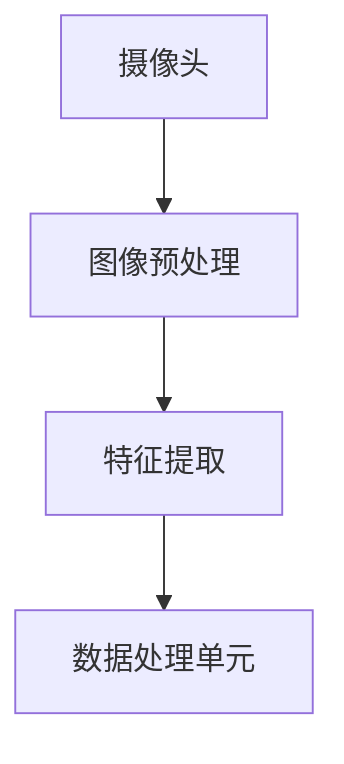
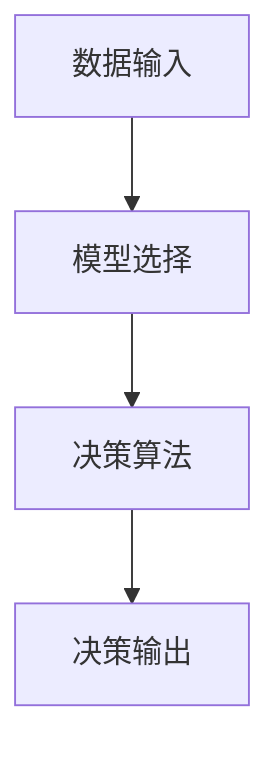
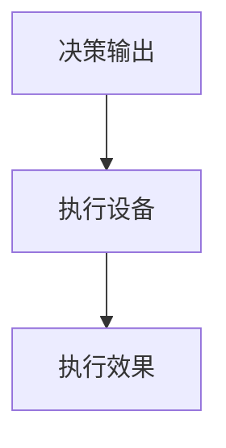
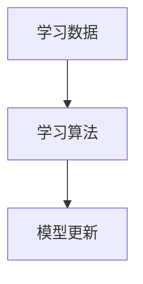
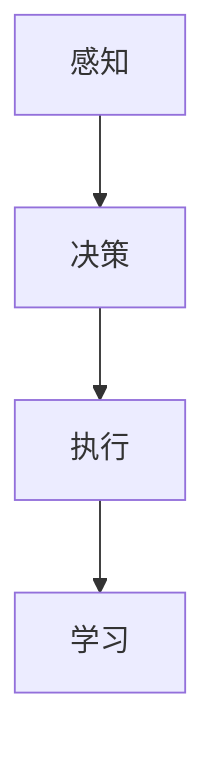
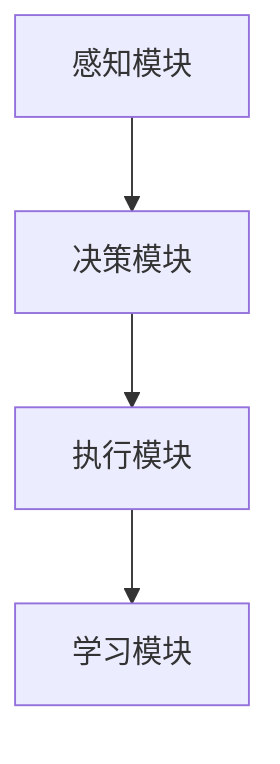

                 

# AI Agent的未来：趋势预测与展望

> 关键词：AI Agent，人工智能，未来趋势，应用场景，技术发展

> 摘要：本文将深入探讨AI Agent的基本概念、技术发展、未来趋势及其在各类应用场景中的展望。通过分析AI Agent的架构设计、实现技术及其在不同领域的应用，本文旨在为读者提供一个全面的AI Agent技术展望。

## 引言

随着人工智能技术的快速发展，AI Agent作为智能体的一种形式，正逐渐成为研究与应用的热点。AI Agent，即智能代理，是指具备一定智能的计算机程序或系统，能够在特定环境中自主完成特定任务。本文将围绕AI Agent的基本概念、技术发展、未来趋势以及各类应用场景进行深入探讨。

## AI Agent的基本概念与分类

### 1.1 AI Agent的定义

AI Agent指的是具备一定智能的计算机程序或系统，能够在特定环境中自主完成特定任务。它是一个能够在环境中感知、决策和执行任务的实体。

### 1.2 AI Agent的分类

AI Agent可以按照不同的分类标准进行分类，如基于规则、基于模型、基于行为的AI Agent。

#### 1.2.1 基于规则的AI Agent

基于规则的AI Agent通过预先定义的规则进行决策。这类Agent在规则清晰、任务简单的情况下表现良好，但面对复杂环境时，规则可能不够灵活。

#### 1.2.2 基于模型的AI Agent

基于模型的AI Agent通过学习数据构建模型，进行决策。这类Agent利用机器学习、深度学习等技术，能够处理复杂任务，并在面对新环境时具备一定的适应性。

#### 1.2.3 基于行为的AI Agent

基于行为的AI Agent根据观察到的行为模式进行决策。这类Agent通过模仿和学习人类行为，实现自主决策。

### 1.3 AI Agent的核心功能

AI Agent的核心功能包括感知、决策、执行和学习。

#### 1.3.1 感知

感知是AI Agent获取环境信息的过程。通过传感器和数据处理技术，AI Agent能够识别和理解周围环境。

#### 1.3.2 决策

决策是AI Agent根据感知到的信息，评估当前状态，并选择最优行动方案的过程。决策模块的核心在于评估和选择。

#### 1.3.3 执行

执行是AI Agent根据决策模块的决策结果，执行相应行动的过程。执行模块需要确保行动的准确性和有效性。

#### 1.3.4 学习

学习是AI Agent从经验中不断优化自身能力的过程。通过经验学习，AI Agent能够适应新环境，提高任务完成效率。

## AI Agent的技术发展与趋势

### 1.4 人工智能技术的基础框架

人工智能技术的基础框架包括机器学习、深度学习和强化学习。

#### 1.4.1 机器学习

机器学习是通过数据驱动的方式训练模型。通过学习大量数据，模型能够自动发现数据中的模式和规律。

#### 1.4.2 深度学习

深度学习是模拟人脑神经网络进行复杂模式识别。通过多层神经网络的组合，深度学习能够处理大量数据并提取特征。

#### 1.4.3 强化学习

强化学习是通过与环境的交互进行学习。通过不断试错，强化学习能够找到最优策略，实现自主决策。

### 1.5 AI Agent的技术演进

AI Agent的技术演进主要体现在以下几个方面：

#### 1.5.1 从静态规则到自适应学习

早期AI Agent主要依赖于静态规则，而现代AI Agent则通过机器学习和深度学习实现自适应学习，能够适应动态变化的环境。

#### 1.5.2 从单一任务到多任务处理

早期AI Agent专注于单一任务，而现代AI Agent则能够处理多个任务，实现复合任务处理。

#### 1.5.3 从弱AI到强AI

早期AI Agent被称为弱AI，专注于特定领域的任务。而现代AI Agent正逐渐向强AI发展，具备通用性。

### 1.6 AI Agent的基本概念与分类

#### 1.6.1 AI Agent的定义

AI Agent指的是具备一定智能的计算机程序或系统，能够在特定环境中自主完成特定任务。

#### 1.6.2 AI Agent的分类

AI Agent可以按照不同的分类标准进行分类，如基于规则、基于模型、基于行为的AI Agent。

#### 1.6.3 AI Agent的核心功能

AI Agent的核心功能包括感知、决策、执行和学习。

## AI Agent在各类应用场景中的未来展望

### 1.7 自动驾驶

自动驾驶是AI Agent的重要应用场景之一。未来，随着技术的不断进步，自动驾驶将更加智能化、自主化。

### 1.8 机器人

机器人是AI Agent的另一个重要应用领域。未来，随着AI技术的进步，机器人将在家庭服务、医疗辅助、工业生产等领域发挥更大作用。

### 1.9 电子商务

电子商务是AI Agent的另一个重要应用领域。未来，AI Agent将能够提供更加个性化的产品推荐、智能客服等服务。

### 1.10 医疗健康

医疗健康是AI Agent的重要应用领域之一。未来，AI Agent将在疾病预测、诊断、健康管理等方面发挥重要作用。

## 本章小结

本章对AI Agent的基本概念、技术发展、未来趋势以及各类应用场景进行了详细阐述。随着人工智能技术的不断进步，AI Agent将在更多领域发挥作用，为人类社会带来更多便利。

## 第二部分：AI Agent的架构设计与实现

### 2.1 AI Agent的架构设计

#### 2.1.1 AI Agent的总体架构

AI Agent的总体架构包括感知模块、决策模块、执行模块和学习模块。每个模块在AI Agent的运行过程中扮演着关键角色。

#### 2.1.2 感知模块

感知模块负责收集环境信息，并将其转化为可用于决策的数据。感知模块通常包括传感器和数据处理单元。

#### 2.1.3 决策模块

决策模块负责分析感知模块收集到的数据，并根据分析结果做出决策。决策模块通常采用机器学习、深度学习等算法。

#### 2.1.4 执行模块

执行模块负责根据决策模块的决策结果执行相应的行动。执行模块通常与具体的执行设备或系统相连。

#### 2.1.5 学习模块

学习模块负责从执行模块的执行结果中学习，并不断优化AI Agent的决策和执行能力。学习模块通常采用强化学习等算法。

### 2.2 AI Agent的关键技术

#### 2.2.1 机器学习算法

机器学习算法是AI Agent的核心技术之一。常见的机器学习算法包括监督学习、无监督学习和强化学习。

#### 2.2.2 深度学习框架

深度学习框架是AI Agent实现深度学习算法的重要工具。常见的深度学习框架包括TensorFlow、PyTorch等。

#### 2.2.3 传感器与数据处理

传感器与数据处理是AI Agent感知模块的重要组成部分。常见的传感器包括摄像头、麦克风、GPS等。数据处理单元则负责对传感器收集的数据进行预处理和特征提取。

### 2.3 AI Agent的架构设计实例

#### 2.3.1 感知模块设计

感知模块的设计需要考虑传感器类型、数据处理方式以及数据预处理算法。以下是一个感知模块设计的实例：



#### 2.3.2 决策模块设计

决策模块的设计需要考虑数据输入、模型选择、决策算法以及决策输出。以下是一个决策模块设计的实例：



#### 2.3.3 执行模块设计

执行模块的设计需要考虑决策结果、执行设备以及执行效果。以下是一个执行模块设计的实例：



#### 2.3.4 学习模块设计

学习模块的设计需要考虑学习数据、学习算法以及模型更新。以下是一个学习模块设计的实例：



### 2.4 AI Agent的架构设计与实现

#### 2.4.1 系统功能设计

AI Agent的系统功能设计包括感知、决策、执行和学习。以下是一个系统功能设计的实例：



#### 2.4.2 系统架构设计

AI Agent的系统架构设计需要考虑硬件、软件以及网络通信。以下是一个系统架构设计的实例：



#### 2.4.3 系统接口设计

AI Agent的系统接口设计需要考虑与外部系统的交互。以下是一个系统接口设计的实例：


#### 2.4.4 系统交互设计

AI Agent的系统交互设计需要考虑各模块之间的交互方式。以下是一个系统交互设计的实例：


### 2.5 AI Agent的实现与优化

#### 2.5.1 实现技术

AI Agent的实现涉及多种技术，包括编程语言、框架和工具。以下是一个实现技术的实例：

```python
# 感知模块实现
class SensorModule:
    def perceive(self):
        # 传感器数据收集与预处理
        pass

# 决策模块实现
class DecisionModule:
    def make_decision(self, data):
        # 数据分析与决策
        pass

# 执行模块实现
class ExecutionModule:
    def execute(self, action):
        # 行动执行
        pass

# 学习模块实现
class LearningModule:
    def learn(self, data):
        # 数据学习与模型更新
        pass
```

#### 2.5.2 优化策略

AI Agent的优化涉及模型优化、算法优化和系统优化。以下是一个优化策略的实例：

```python
# 模型优化
model = Model()
model.fit(X_train, y_train)

# 算法优化
def optimize_algorithm():
    # 算法调整与优化
    pass

# 系统优化
def optimize_system():
    # 系统性能优化
    pass
```

### 2.6 AI Agent的实战与应用

#### 2.6.1 实战案例

以下是一个AI Agent的实战案例：

```python
# AI Agent应用场景：自动驾驶
class AutonomousAgent:
    def drive(self, sensor_data):
        # 感知模块
        perception = SensorModule().perceive(sensor_data)
        
        # 决策模块
        decision = DecisionModule().make_decision(perception)
        
        # 执行模块
        ExecutionModule().execute(decision)
        
        # 学习模块
        LearningModule().learn(sensor_data)
```

#### 2.6.2 应用分析

AI Agent在不同应用场景中具有广泛的应用前景。以下是一个应用分析的实例：

```python
# AI Agent应用场景：智能客服
class IntelligentAgent:
    def handle_query(self, query):
        # 感知模块
        perception = SensorModule().perceive(query)
        
        # 决策模块
        decision = DecisionModule().make_decision(perception)
        
        # 执行模块
        response = ExecutionModule().execute(decision)
        
        # 学习模块
        LearningModule().learn(perception, response)
        
        return response
```

### 2.7 AI Agent的最佳实践与注意事项

#### 2.7.1 最佳实践

以下是一些AI Agent的最佳实践：

1. 设计灵活的感知模块，以适应不同应用场景。
2. 选用合适的决策算法，以提高决策质量。
3. 优化学习模块，以实现持续改进。

#### 2.7.2 注意事项

以下是一些AI Agent的注意事项：

1. 考虑数据隐私和安全问题。
2. 定期更新和维护AI Agent的模型和算法。
3. 考虑AI Agent的鲁棒性和适应性。

### 本章小结

本章对AI Agent的架构设计与实现进行了详细探讨，包括总体架构设计、关键技术、实现与优化、实战与应用以及最佳实践与注意事项。通过本章的学习，读者可以更好地理解AI Agent的架构与实现，为实际应用提供指导。

### 总结与展望

AI Agent作为人工智能的重要分支，具有广泛的应用前景。随着技术的不断进步，AI Agent将在更多领域发挥重要作用。未来，AI Agent的发展将更加智能化、自主化，为人类社会带来更多便利。同时，我们也需要关注AI Agent的伦理和安全问题，确保其发展符合人类社会的需求。

### 作者信息

作者：AI天才研究院/AI Genius Institute & 禅与计算机程序设计艺术 /Zen And The Art of Computer Programming

