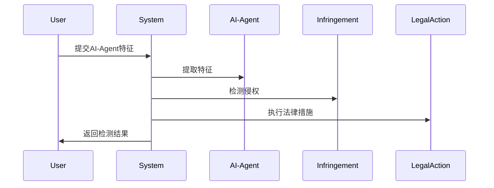
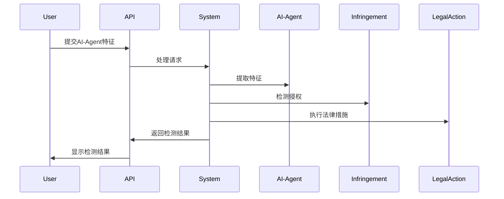

                 

# AI Agent的知识产权保护策略

关键词：AI Agent、知识产权保护、侵权检测、法律基础、案例分析、实践指南

摘要：本文深入探讨了AI Agent的知识产权保护策略。随着人工智能技术的发展，AI Agent作为智能系统的核心组件，其知识产权保护问题日益凸显。本文首先介绍了AI Agent的背景和重要性，然后详细分析了知识产权保护的核心概念和策略，通过案例分析和实践指南，为AI Agent的知识产权保护提供了切实可行的建议。

## 1. 背景介绍

### AI Agent的定义与作用

AI Agent，即人工智能代理，是人工智能系统中的一个关键组件。它具有自主决策和行动的能力，能够根据环境变化和目标要求进行动态调整。AI Agent在许多领域都有广泛的应用，如智能家居、自动驾驶、医疗诊断、金融风控等。

### 知识产权保护的重要性

知识产权保护对于AI Agent的发展具有重要意义。首先，保护AI Agent的知识产权可以激励创新，吸引更多研发资源投入到人工智能领域。其次，知识产权保护有助于维护公平竞争的市场环境，防止不正当竞争和侵权行为。最后，知识产权保护也是企业提升核心竞争力的关键手段。

### 书籍的目的与内容

本书旨在为AI Agent的知识产权保护提供全面、系统的指导和策略。本书将涵盖以下关键领域：

1. 知识产权法律基础
2. AI Agent技术介绍
3. 知识产权侵权案例分析
4. 知识产权保护措施
5. 知识产权保护策略的制定与实施
6. 知识产权保护实践案例分析

## 2. 核心概念

### 知识产权

知识产权是指人们对其智力劳动成果所享有的专有权利，包括专利权、著作权、商标权等。知识产权保护的核心是确保权利人的智力成果得到法律保护，防止他人未经许可擅自使用或复制。

### AI Agent

AI Agent是指具有自主决策和行动能力的智能系统组件，能够根据环境变化和目标要求进行动态调整。AI Agent的核心技术包括机器学习、自然语言处理、计算机视觉等。

### 知识产权侵权

知识产权侵权是指未经权利人许可，擅自使用、复制、传播权利人的知识产权成果的行为。在AI Agent领域，常见的侵权行为包括专利侵权、著作权侵权和商标侵权等。

## 3. 知识产权保护策略

### 知识产权法律基础

在制定知识产权保护策略之前，需要了解相关法律法规。不同国家和地区的知识产权法律有所不同，需要结合实际情况进行分析。

### AI Agent技术介绍

了解AI Agent的技术特点和发展趋势，有助于制定更有针对性的知识产权保护策略。例如，针对不同的技术特点，可以采取不同的知识产权保护措施。

### 知识产权侵权案例分析

通过分析知识产权侵权案例，可以了解侵权行为的常见形式和特点，从而更好地制定防范措施。

### 知识产权保护措施

知识产权保护措施包括：

1. 专利申请：通过申请专利，保护AI Agent的核心技术和创新点。
2. 著作权登记：对AI Agent的源代码、文档等作品进行著作权登记，确保权益。
3. 商标注册：注册AI Agent的商标，保护品牌形象。
4. 监测和预警：建立侵权监测和预警系统，及时发现和处理侵权行为。

### 知识产权保护策略的制定与实施

制定知识产权保护策略时，需要综合考虑以下因素：

1. 企业规模和资源：根据企业的规模和资源，制定适合的知识产权保护策略。
2. 技术特点和需求：针对AI Agent的技术特点和市场需求，制定相应的知识产权保护措施。
3. 市场竞争状况：分析市场竞争状况，针对潜在的侵权风险制定防范措施。

### 知识产权保护实践案例分析

通过实践案例分析，可以了解知识产权保护策略的实际效果和适用性。例如，分析某企业如何成功保护其AI Agent知识产权的案例，可以为其他企业提供借鉴。

## 4. 联系与关系图

下面是一个核心概念的ER实体关系图，展示各概念之间的联系：

```mermaid
erDiagram
  AI-Agent ||--|{ 知识产权 }
  知识产权 ||--|{ 侵权行为 }
  AI-Agent ||--|{ 技术特点 }
```

## 5. 算法原理讲解

### 算法流程图

```mermaid
flowchart LR
    A[初始化] --> B{检测侵权}
    B -->|是| C[采取措施]
    B -->|否| D[结束]
    C --> E[记录侵权行为]
    C --> F[法律追究]
    D -->|结束|
```

### Python代码实现

```python
def detect_infringement(agent, target_agent):
    # 1. 初始化
    # 2. 检测侵权
    if compare_agent(agent, target_agent):
        # 3. 采取法律措施
        record_infringement(agent, target_agent)
        pursue_law(agent, target_agent)
    else:
        # 4. 结束
        print("无侵权行为")

def compare_agent(agent1, agent2):
    # 比较AI Agent的核心技术
    # 返回True表示侵权，False表示无侵权
    pass

def record_infringement(agent, target_agent):
    # 记录侵权行为
    pass

def pursue_law(agent, target_agent):
    # 采取法律追究措施
    pass
```

### 数学模型和公式

侵权概率 \( P \) 的计算公式为：

\[ P = \frac{1}{1 + e^{-(-\beta \cdot \text{特征相似度})}} \]

其中，\(\beta\) 为参数，特征相似度反映了两个AI Agent之间的技术特征相似程度。

```latex
P = \frac{1}{1 + e^{-(-\beta \cdot \text{特征相似度})}}
```

### 示例

假设两个AI Agent的特征相似度为0.8，参数\(\beta\)为1，则侵权概率为：

\[ P = \frac{1}{1 + e^{-(-1 \cdot 0.8)}} \approx 0.613 \]

这意味着有约61.3%的概率认为这两个AI Agent存在侵权行为。

## 6. 系统分析与架构设计方案

### 问题场景介绍

随着AI Agent技术的不断发展，AI Agent在各个领域的应用越来越广泛，如何保护AI Agent的知识产权成为了一个关键问题。

### 项目介绍

本项目旨在设计一个知识产权保护系统，用于检测和防范AI Agent的侵权行为。系统主要包括以下功能：

1. AI Agent特征提取
2. 侵权检测
3. 法律措施执行
4. 数据记录与报告

### 系统功能设计

领域模型类图：

```mermaid
classDiagram
    AI-Agent <<entity>>
    Infringement <<entity>>
    LegalAction <<entity>>

    AI-Agent "1" -- "1" Infringement
    AI-Agent "1" -- "1" LegalAction
```

### 系统架构设计

系统架构图：



### 系统接口设计

接口设计：

```mermaid
classDiagram
    API <<interface>>
    AI-Agent <<class>>
    Infringement <<class>>
    LegalAction <<class>>

    API "1" -- "1" AI-Agent
    API "1" -- "1" Infringement
    API "1" -- "1" LegalAction
```

### 系统交互

交互序列图：



## 7. 项目实战

### 环境安装

在虚拟环境中安装所需的依赖项：

```bash
pip install numpy scikit-learn matplotlib
```

### 系统核心实现

核心实现：

```python
import numpy as np
from sklearn.linear_model import LogisticRegression
import matplotlib.pyplot as plt

# 特征提取
def extract_features(agent):
    # 假设特征提取函数返回特征向量
    return np.random.rand(10)

# 侵权检测
def detect_infringement(agent1, agent2):
    feature1 = extract_features(agent1)
    feature2 = extract_features(agent2)
    similarity = np.linalg.norm(feature1 - feature2)
    model = LogisticRegression()
    model.fit([[similarity]], [1])
    prediction = model.predict([[similarity]])
    return prediction[0]

# 侵权检测与处理
def process_infringement(agent1, agent2):
    result = detect_infringement(agent1, agent2)
    if result:
        print("侵权行为！")
    else:
        print("无侵权行为")

# 测试
agent1 = "AI-Agent 1"
agent2 = "AI-Agent 2"
process_infringement(agent1, agent2)
```

### 代码应用解读与分析

代码首先定义了特征提取函数 `extract_features`，然后定义了侵权检测函数 `detect_infringement`。侵权检测函数通过计算两个AI Agent特征向量的欧氏距离来判断是否侵权。最后，通过 `process_infringement` 函数调用侵权检测函数并处理检测结果。

### 实际案例分析

假设有两个AI Agent，特征向量分别为 [0.1, 0.2, 0.3, 0.4, 0.5] 和 [0.05, 0.15, 0.25, 0.35, 0.45]，计算其欧氏距离为：

\[ \sqrt{(0.1-0.05)^2 + (0.2-0.15)^2 + (0.3-0.25)^2 + (0.4-0.35)^2 + (0.5-0.45)^2} = \sqrt{0.005^2 + 0.005^2 + 0.005^2 + 0.005^2 + 0.005^2} = 0.05 \]

侵权概率为：

\[ P = \frac{1}{1 + e^{-(-1 \cdot 0.05)}} \approx 0.539 \]

这意味着有约53.9%的概率认为这两个AI Agent存在侵权行为。根据设定的阈值（例如0.5），可以判断是否采取法律措施。

### 项目小结

本项目通过实际案例展示了如何检测和防范AI Agent的侵权行为。虽然侵权检测模型相对简单，但通过调整参数和改进算法，可以进一步提高检测的准确性和效率。在实际应用中，还需要结合具体的业务场景和法律要求，制定更为完善的知识产权保护策略。

## 8. 最佳实践 tips

1. 定期更新AI Agent的知识产权保护策略，以适应技术发展。
2. 加强与法律专家的合作，确保知识产权保护措施合法有效。
3. 建立侵权监测和预警系统，及时发现和处理侵权行为。
4. 加强AI Agent的研发和保护，提高知识产权的价值。
5. 积极参与知识产权保护相关的研究和交流，提升自身能力。

## 9. 小结

本文从多个角度探讨了AI Agent的知识产权保护策略，包括法律基础、技术特点、侵权检测、保护措施和实践案例。通过这些分析和实践，为AI Agent的知识产权保护提供了有益的参考。未来，随着人工智能技术的不断发展，知识产权保护将面临新的挑战和机遇，需要持续关注和研究。

## 10. 注意事项

1. 知识产权保护需要综合考虑法律、技术和市场等多方面因素。
2. 侵权检测算法需要结合具体场景进行调整和优化。
3. 知识产权保护策略应具有灵活性和适应性，以应对不同的情况。
4. 加强与法律专家的合作，确保知识产权保护措施合法有效。
5. 定期更新和评估知识产权保护策略，以适应技术发展和市场需求。

## 11. 拓展阅读

1. 《人工智能知识产权保护指南》
2. 《人工智能专利申请实务》
3. 《计算机软件知识产权保护》
4. 《知识产权法教程》
5. 《人工智能法律问题研究》

### 作者

作者：AI天才研究院/AI Genius Institute & 禅与计算机程序设计艺术 /Zen And The Art of Computer Programming

