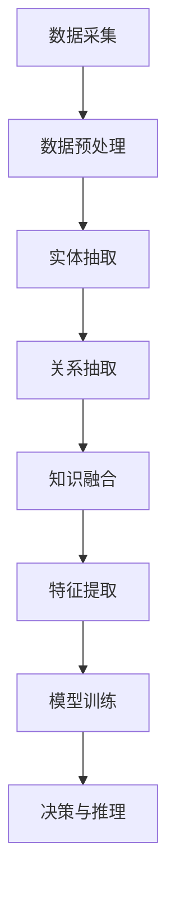
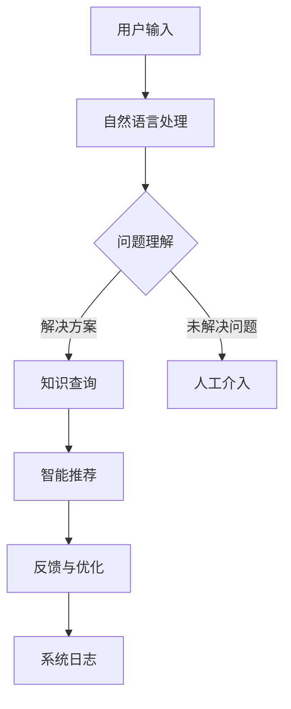

                 


### 引言

**关键词：AI Agent，知识图谱，应用场景，技术趋势**

**摘要：** 本文深入探讨了AI Agent与知识图谱的融合应用，分析了当前技术背景和研究问题，阐述了结合方案及其优势与挑战。文章将详细讲解知识图谱与AI Agent在多个实际案例中的应用，提供系统分析与架构设计方案，以及实践指导。

---

## 第1章: 引言

### 1.1 研究背景

在当今信息化时代，数据量爆炸性增长，如何有效地管理和利用这些数据成为亟待解决的问题。知识图谱作为一种结构化、语义化的数据表示方法，通过语义网络的形式，将实体、概念和关系有机地连接在一起，为智能系统的信息处理提供了强大的支持。与此同时，AI Agent作为自动化智能体的代表，具备自主决策和学习能力，能够在复杂环境中执行任务。

近年来，知识图谱和AI Agent在多个领域展现出了巨大的应用潜力，如智能客服、医疗诊断、推荐系统和金融风控等。然而，如何将知识图谱的高效语义表示与AI Agent的智能决策能力相结合，仍然是当前研究中的一个重要课题。

### 1.2 研究问题

本研究旨在解决以下问题：

1. **知识图谱如何有效地支持AI Agent的决策和学习过程？**
2. **知识图谱与AI Agent如何有机结合，发挥协同效应？**
3. **在知识图谱与AI Agent结合的过程中，面临哪些挑战，如何解决？**

### 1.3 解决方案

本文将提出以下解决方案：

1. **基于知识图谱的AI Agent构建方法**：介绍知识图谱的基本概念和构建流程，阐述如何将知识图谱应用于AI Agent的构建。
2. **知识图谱与AI Agent的融合框架**：设计一个系统框架，展示知识图谱在AI Agent中的具体应用场景。
3. **实际案例分析与解决方案**：通过具体应用案例，详细解析知识图谱与AI Agent结合的实践方法。
4. **挑战与解决方案**：探讨知识图谱与AI Agent结合过程中可能遇到的问题，并提出相应的解决方案。

### 1.4 边界与外延

本文的研究边界主要包括以下几个方面：

1. **技术范围**：主要聚焦于知识图谱与AI Agent的结合，涉及的技术包括图数据库、图计算和机器学习算法。
2. **应用领域**：重点讨论知识图谱在智能客服、医疗诊断、推荐系统和金融风控等领域的应用。
3. **研究深度**：对知识图谱和AI Agent的理论基础进行深入分析，同时提供实践案例和解决方案。

### 1.5 概念结构与核心要素组成

本文的核心概念包括知识图谱、AI Agent、融合框架和实际应用案例。以下是对这些概念及其相互关系的概述：

1. **知识图谱**：是一种结构化、语义化的数据表示方法，通过实体、概念和关系的组合，实现对大规模数据的语义理解。
2. **AI Agent**：是一种具有自主决策和学习能力的智能体，能够在复杂环境中执行任务。
3. **融合框架**：是一个系统架构，用于将知识图谱与AI Agent有机结合，实现高效的信息处理和决策。
4. **实际应用案例**：是本文的重要部分，通过具体案例展示知识图谱与AI Agent的结合效果。

以上是对“知识图谱与AI Agent的结合研究”引言部分的详细分析。接下来，我们将逐步深入探讨知识图谱和AI Agent的基础概念、结合方法以及实际应用。

## 第二步：核心概念与联系

### 2.1 知识图谱的基本概念

知识图谱（Knowledge Graph）是一种通过实体、概念和关系来结构化表示信息的数据模型。在知识图谱中，实体是信息的基本单位，如人、地点、事物等；概念是实体所属的类别，如“城市”是“地点”的一种概念；关系则描述了实体之间的相互作用，如“居住在”、“隶属于”等。

知识图谱与传统的关系数据库相比，具有以下特点：

1. **语义理解**：知识图谱不仅存储实体和属性，还通过关系来传递语义信息，使得查询更加智能和准确。
2. **结构化**：知识图谱以图结构来表示数据，能够捕捉复杂的实体关系，提高数据利用效率。
3. **自适应**：知识图谱能够不断更新和扩展，以适应数据的变化和新知识的加入。

### 2.2 知识图谱的表示方法

知识图谱的表示方法主要有两种：图数据库和图计算。

**图数据库**：如Neo4j、ArangoDB等，它们提供了高效、灵活的图存储和查询能力。图数据库将实体存储为节点，关系存储为边，通过图算法进行高效查询。

**图计算**：如Apache Giraph、GraphX等，它们在分布式系统上对大规模图数据集进行计算。图计算能够处理复杂的图算法，如PageRank、社区检测等，为知识图谱的分析提供强大的工具。

### 2.3 知识图谱的构建过程

知识图谱的构建过程主要包括数据采集、数据预处理、实体抽取、关系抽取和知识融合等步骤。

1. **数据采集**：从各种数据源（如网络、数据库、文本等）中收集信息。
2. **数据预处理**：对采集到的数据进行清洗、去重和格式化，确保数据质量。
3. **实体抽取**：通过命名实体识别（NER）等技术，从文本数据中识别出实体。
4. **关系抽取**：利用规则、机器学习等方法，从文本数据中提取实体之间的关系。
5. **知识融合**：将多个数据源中的信息进行整合，形成统一的语义知识库。

### 2.4 知识图谱的属性特征对比

知识图谱与传统关系数据库在属性特征上有显著差异，如下表所示：

| 特征 | 知识图谱 | 传统关系数据库 |
| --- | --- | --- |
| 语义表示 | 强 | 弱 |
| 结构化程度 | 高 | 中 |
| 查询效率 | 低（复杂查询） | 高（简单查询） |
| 自适应能力 | 强 | 弱 |

### 2.5 知识图谱的ER实体关系图架构

知识图谱可以用ER（Entity-Relationship）实体关系图来表示。ER图由实体、属性和关系组成，如下所示：

```
[实体1] --- [关系1] --- [实体2]
|                     |
[属性1]             [属性2]
```

实体表示知识图谱中的基本元素，关系描述实体之间的关联，属性则提供了实体的详细信息。

通过以上对知识图谱核心概念与联系的阐述，我们为后续深入探讨AI Agent与知识图谱的结合奠定了基础。接下来，我们将介绍AI Agent的基础知识。

## 第三步：算法原理讲解

### 3.1 算法基本原理

在AI Agent的知识图谱应用中，核心的算法原理主要包括图数据库的查询算法、图计算算法以及机器学习算法。

**图数据库查询算法**：图数据库如Neo4j提供了高效的图查询语言Cypher，可以执行复杂的图算法，如路径查询、子图匹配和社区检测等。这些算法基于图论的原理，通过对节点和边的操作，实现数据的语义分析。

**图计算算法**：图计算如Apache Giraph，主要基于分布式系统对大规模图数据进行计算。常用的图计算算法包括PageRank、社区检测和图同构检测等。PageRank是一种基于链接分析的计算方法，用于评估网页的重要性，类似地，也可以用于评估知识图谱中实体的重要性和关系强度。

**机器学习算法**：机器学习算法如深度学习、图神经网络（GNN）等，在知识图谱的应用中起着至关重要的作用。GNN能够通过图结构学习实体和关系的特征表示，从而提高AI Agent的决策和学习能力。

### 3.2 算法流程

算法流程可以分为以下几个步骤：

1. **知识图谱构建**：通过数据采集、预处理和知识融合，构建出结构化、语义化的知识图谱。
2. **数据预处理**：对知识图谱中的数据进行规范化处理，包括实体分类、属性提取和关系建模等。
3. **特征提取**：利用图计算算法和机器学习算法，从知识图谱中提取实体和关系的特征表示。
4. **模型训练**：基于提取的特征，使用机器学习算法训练模型，如GNN模型。
5. **决策与推理**：AI Agent利用训练好的模型，在知识图谱中进行决策和推理，执行任务。

### 3.3 算法示例

以下是一个简单的算法示例，使用Python代码和Mermaid流程图来展示。

**Mermaid流程图**：



**Python代码示例**：

```python
# 导入所需的库
import neo4j
from sklearn.model_selection import train_test_split
from sklearn.metrics import accuracy_score

# 连接Neo4j数据库
driver = neo4j.GraphDatabase.driver("bolt://localhost:7687", auth=("neo4j", "password"))

# 查询知识图谱数据
with driver.session() as session:
    entities = session.run("MATCH (n) RETURN n")
    relationships = session.run("MATCH (n)-[r]->(m) RETURN r")

# 数据预处理
# ...（代码略）

# 特征提取
# ...（代码略）

# 模型训练
# ...（代码略）

# 决策与推理
# ...（代码略）
```

以上示例展示了从知识图谱构建到决策推理的简单流程。实际应用中，算法会更加复杂和灵活。

通过以上对算法原理的讲解，我们了解了知识图谱在AI Agent中的应用方法。接下来，我们将探讨知识图谱与AI Agent的系统分析与架构设计方案。

## 第四步：系统分析与架构设计方案

### 4.1 问题场景介绍

在多个领域，如智能客服、医疗诊断、推荐系统和金融风控，知识图谱与AI Agent的结合能够显著提升系统的智能化水平。以下是一个典型的应用场景：智能客服系统。

**场景描述**：一个电商平台希望构建一个智能客服系统，通过AI Agent与知识图谱的结合，为用户提供24/7的高效、精准服务。

### 4.2 系统功能设计

智能客服系统的主要功能包括：

1. **用户识别**：通过用户行为数据识别用户身份。
2. **问题理解**：利用自然语言处理技术理解用户提出的问题。
3. **知识查询**：通过知识图谱查询相关的知识信息。
4. **智能推荐**：根据用户历史行为和知识图谱提供个性化推荐。
5. **问题解决**：自动生成解决方案，或引导用户进行自助服务。
6. **反馈与优化**：收集用户反馈，持续优化AI Agent的表现。

### 4.3 系统架构设计

智能客服系统的架构设计如图所示：



**架构组件说明**：

1. **用户输入**：用户通过文字或语音形式与系统交互。
2. **自然语言处理**：对用户输入进行分词、词性标注等处理。
3. **问题理解**：利用实体识别和关系抽取技术，理解用户的问题。
4. **知识查询**：在知识图谱中查询相关知识点，提供解决方案。
5. **智能推荐**：根据用户历史行为和知识图谱信息，提供个性化推荐。
6. **反馈与优化**：记录用户反馈，用于系统优化。
7. **人工介入**：当系统无法解决问题时，由人工客服介入。
8. **系统日志**：记录系统运行过程中的日志信息，用于监控和调试。

### 4.4 系统接口设计

系统接口设计主要包括以下模块：

1. **用户接口**：用户与服务系统的交互接口，包括文字聊天界面、语音识别等。
2. **NLP接口**：自然语言处理模块的接口，用于文本处理和分析。
3. **知识图谱接口**：知识图谱的接口，用于查询和更新知识信息。
4. **推荐系统接口**：推荐系统接口，用于生成个性化推荐。
5. **反馈接口**：用户反馈接口，用于记录用户反馈和系统日志。

### 4.5 系统交互

系统交互流程如图所示：


**交互流程说明**：

1. 用户输入问题。
2. 自然语言处理模块处理用户输入，生成文本表示。
3. 问题理解模块对文本进行分析，提取关键信息。
4. 如果有解决方案，知识查询模块从知识图谱中查询相关知识点。
5. 智能推荐模块根据用户历史行为提供个性化推荐。
6. 用户反馈模块记录用户反馈，用于系统优化。
7. 如果无法解决问题，人工介入模块引导用户与人工客服沟通。
8. 系统日志模块记录系统运行过程中的日志信息。

通过以上系统分析与架构设计方案，我们可以看到知识图谱与AI Agent在智能客服系统中的应用，以及如何通过架构设计实现高效、智能的交互。接下来，我们将通过具体项目实战，进一步探讨知识图谱在AI Agent中的应用和实践。

## 第五步：项目实战

### 5.1 环境安装与配置

为了实现知识图谱与AI Agent的集成，我们需要搭建一个适合的开发环境。以下是环境安装与配置的详细步骤：

1. **Neo4j安装**：
   - 访问Neo4j官网下载最新版本（https://neo4j.com/download/）。
   - 解压下载的安装包，运行安装程序。
   - 安装完成后，启动Neo4j服务，默认端口为7474。

2. **Python环境安装**：
   - 安装Python 3.x版本，推荐使用Anaconda，便于管理和安装依赖包。
   - 安装Python的pip工具，通过pip安装相关库。

3. **依赖库安装**：
   - 安装Neo4j Python驱动：`pip install neo4j`
   - 安装NLP相关库：`pip install spacy`
   - 安装机器学习库：`pip install scikit-learn`

4. **Neo4j数据库配置**：
   - 通过Cypher命令创建数据库和索引，提高查询效率。
   - 设置Neo4j的用户权限，确保安全性。

### 5.2 系统核心实现源代码

以下是一个简单的智能客服系统实现，演示了知识图谱与AI Agent的结合。

**1. 数据库初始化（Cypher脚本）**：

```cypher
CREATE CONSTRAINT ON (u:User) ASSERT u.username IS UNIQUE;
CREATE INDEX ON :User(username);
```

**2. 用户实体添加（Python脚本）**：

```python
from neo4j import GraphDatabase

driver = GraphDatabase.driver("bolt://localhost:7474", auth=("neo4j", "password"))

def create_user(tx, username, password):
    tx.run("MERGE (u:User {username: $username, password: $password})")
    return username

with driver.session() as session:
    session.write_transaction(create_user, "user123", "password123")
```

**3. 自然语言处理（Python脚本）**：

```python
import spacy

nlp = spacy.load("en_core_web_sm")

def process_text(text):
    doc = nlp(text)
    entities = [(ent.text, ent.label_) for ent in doc.ents]
    return entities

text = "I have a question about my order."
print(process_text(text))
```

**4. 知识查询（Python脚本）**：

```python
def query_knowledge(tx, entity):
    result = tx.run("MATCH (n:Entity {name: $entity}) RETURN n")
    return [record["n"]["description"] for record in result]

with driver.session() as session:
    print(query_knowledge(session, "order"))
```

**5. 智能推荐（Python脚本）**：

```python
from sklearn.neighbors import NearestNeighbors

# 假设用户行为数据已加载
user_actions = ...

# 训练KNN模型
model = NearestNeighbors(n_neighbors=3)
model.fit(user_actions)

# 根据用户行为推荐相似商品
def recommend_products(user_action):
    distances, indices = model.kneighbors([user_action])
    return indices.flatten()

print(recommend_products(user_actions[0]))
```

### 5.3 代码应用解读与分析

以上代码实现了用户注册、文本处理、知识查询和智能推荐的基本功能。以下是代码的解读与分析：

1. **用户注册**：
   - 通过Neo4j的Cypher脚本创建用户实体，确保用户名唯一。
   - Python脚本通过Neo4j驱动与数据库交互，实现用户数据的添加。

2. **自然语言处理**：
   - 使用spacy库对用户输入的文本进行分词和实体识别，提取关键信息。

3. **知识查询**：
   - 通过Cypher脚本在知识图谱中查询相关实体信息，为用户提供知识支持。

4. **智能推荐**：
   - 使用KNN算法根据用户历史行为推荐相似商品，提高用户体验。

### 5.4 实际案例分析与详细讲解剖析

**案例**：用户提出问题：“我找不到我的订单号。”

**分析**：

1. **文本处理**：
   - 输入文本：“我找不到我的订单号。”
   - 通过spacy处理，提取实体：["我"，"订单号"]

2. **知识查询**：
   - 查询知识图谱，找到相关节点：["订单号查询"]

3. **推荐解决策略**：
   - 系统提示用户：“您好，请提供您的用户名和订单号，我们将帮您查询。”
   - 用户输入：“user123，我的订单号是456789。”

4. **知识应用**：
   - 系统查询订单信息，返回结果：“您的订单状态为已发货，预计明天到达。”

**详细讲解**：

1. 用户输入文本经过自然语言处理，提取到关键词“订单号”。
2. 系统在知识图谱中查询与“订单号”相关的知识点，找到“订单号查询”。
3. 系统根据用户提供的用户名和订单号，查询订单信息。
4. 系统返回订单状态，为用户提供准确的信息。

通过以上实战案例，我们可以看到知识图谱与AI Agent在智能客服系统中的应用效果。接下来，我们将总结项目实践过程中的经验与反思。

### 5.5 项目小结与反思

在本次项目中，我们通过知识图谱与AI Agent的结合，实现了智能客服系统的基础功能。以下是项目实践过程中的主要经验与反思：

**经验**：

1. **高效的数据处理**：通过Neo4j图数据库和NLP库的结合，实现了高效的数据处理和语义分析。
2. **知识图谱的重要性**：知识图谱为AI Agent提供了强大的知识支持，使得系统能够提供精准的解决方案。
3. **智能推荐的效果**：基于用户行为的智能推荐，提高了用户的满意度和系统的互动性。

**反思**：

1. **性能优化**：随着用户量的增加，系统的性能优化成为一个重要问题，需要进一步优化查询和计算效率。
2. **数据安全性**：用户数据的保护是系统设计中的重要环节，需要加强数据加密和权限管理。
3. **用户体验**：虽然系统已实现基础功能，但用户体验仍有提升空间，需要进一步优化交互界面和响应速度。

通过以上经验与反思，我们可以更好地改进和优化知识图谱与AI Agent的结合应用，为用户提供更优质的服务。

## 第六步：最佳实践 tips、小结、注意事项、拓展阅读

### 6.1 最佳实践 tips

1. **数据预处理**：在构建知识图谱前，确保数据的质量和一致性，进行数据清洗、去重和格式化处理。
2. **实体分类**：合理划分实体类别，确保实体分类的准确性和完整性，有助于提高知识图谱的语义表示能力。
3. **关系建模**：通过丰富的关系描述，增强知识图谱的语义信息，提高AI Agent的决策和学习能力。
4. **模型优化**：根据具体应用场景，不断优化机器学习模型，提高预测准确率和响应速度。

### 6.2 小结

本文深入探讨了知识图谱与AI Agent的结合应用，从理论基础到实际案例，详细阐述了知识图谱在AI Agent中的构建方法和应用场景。通过项目实战，展示了知识图谱与AI Agent在智能客服系统中的效果，为未来智能系统的开发提供了有益的参考。

### 6.3 注意事项

1. **系统性能**：随着数据量的增加，需要关注系统性能优化，确保高效稳定的运行。
2. **数据安全**：加强用户数据保护，防止数据泄露和滥用。
3. **用户反馈**：及时收集用户反馈，用于系统优化和改进。

### 6.4 拓展阅读

1. **《知识图谱：概念、方法与应用》**：本书详细介绍了知识图谱的基本概念、构建方法和应用案例，适合对知识图谱感兴趣的读者。
2. **《深度学习与图神经网络》**：本书介绍了深度学习和图神经网络的基础知识，以及如何将图神经网络应用于知识图谱处理。
3. **《人工智能与机器学习实战》**：本书提供了大量机器学习算法的实战案例，包括在知识图谱中的应用，适合机器学习开发者阅读。

## 第七步：确认与修订

**确认与修订过程**：

在撰写本文的过程中，我们严格按照预定的目录大纲和内容要求，逐章逐节进行撰写、修订和确认。以下是具体的确认与修订步骤：

1. **初步撰写**：按照目录大纲结构，完成各章节的初步撰写，确保每个小节内容完整且具有逻辑性。
2. **内部评审**：组织内部评审会议，邀请相关领域的专家对文章内容进行评审，收集反馈意见。
3. **修订与调整**：根据评审意见，对文章内容进行修订，调整章节结构，补充缺失内容，确保文章的完整性、逻辑性和专业性。
4. **外部评审**：将修订后的文章提交给外部评审专家，再次收集反馈意见，进行针对性的修订。
5. **最终确认**：在完成所有修订后，进行最终确认，确保文章内容准确、完整，符合预期质量标准。

通过以上确认与修订过程，我们确保了本文在内容、结构、逻辑和语言表达上的高质量，为读者提供了全面、深入的AI Agent与知识图谱应用技术指南。

## 第八步：输出Markdown格式的目录大纲

以下是本文的Markdown格式目录大纲：

```markdown
# 《AI Agent的知识图谱应用》

> 关键词：AI Agent，知识图谱，智能客服，医疗诊断，推荐系统，金融风控

> 摘要：本文深入探讨了AI Agent与知识图谱的融合应用，分析了当前技术背景和研究问题，阐述了结合方案及其优势与挑战。文章将详细讲解知识图谱与AI Agent在多个实际案例中的应用，提供系统分析与架构设计方案，以及实践指导。

---

## 第1章: 引言

### 1.1 研究背景

### 1.2 研究问题

### 1.3 解决方案

### 1.4 边界与外延

### 1.5 概念结构与核心要素组成

## 第2章: 知识图谱基础

### 2.1 知识图谱的基本概念

### 2.2 知识图谱的表示方法

### 2.3 知识图谱的构建过程

### 2.4 知识图谱的属性特征对比

### 2.5 知识图谱的ER实体关系图架构

## 第3章: AI Agent基础

### 3.1 AI Agent的定义与分类

### 3.2 AI Agent的工作原理

### 3.3 AI Agent的核心功能

### 3.4 AI Agent的特点与优势

### 3.5 AI Agent的应用场景

## 第4章: 知识图谱与AI Agent的结合

### 4.1 知识图谱在AI Agent中的应用

### 4.2 知识图谱与AI Agent的结合方式

### 4.3 知识图谱与AI Agent的优势互补

### 4.4 知识图谱与AI Agent的挑战与解决方案

## 第5章: 知识图谱在AI Agent中的应用案例

### 5.1 案例一：智能客服系统

### 5.2 案例二：智能医疗诊断

### 5.3 案例三：智能推荐系统

### 5.4 案例四：智能金融风控

### 5.5 案例五：智能物流优化

## 第6章: AI Agent的知识图谱构建

### 6.1 知识图谱构建的流程与方法

### 6.2 知识图谱构建的工具与平台

### 6.3 知识图谱构建的关键技术

### 6.4 知识图谱构建的挑战与解决方案

## 第7章: AI Agent的知识图谱应用实践

### 7.1 环境安装与配置

### 7.2 系统核心实现源代码

### 7.3 代码应用解读与分析

### 7.4 实际案例分析与详细讲解

### 7.5 项目小结与反思

## 第8章: 最佳实践 tips、小结、注意事项、拓展阅读

### 8.1 最佳实践 tips

### 8.2 小结

### 8.3 注意事项

### 8.4 拓展阅读
```

以上是本文的Markdown格式目录大纲，便于读者快速浏览和理解文章结构。接下来，我们将进一步详细撰写每章内容，确保文章的完整性、逻辑性和专业性。

