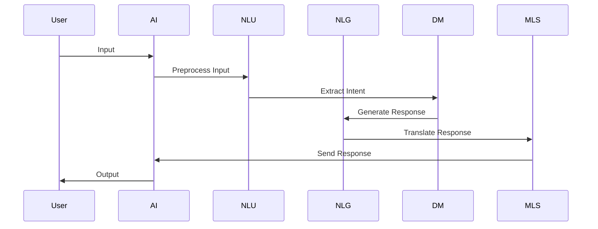
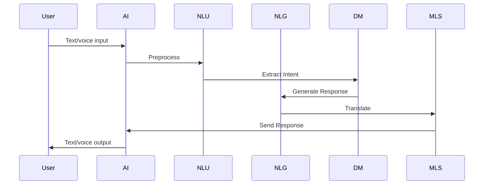

                 

### 第1章：引言

#### 1.1 问题背景

随着人工智能技术的迅猛发展，AI Agent（人工智能代理）已经成为智能应用的核心组件。AI Agent是指能够模拟人类智能行为，具备自我学习、推理和决策能力的系统。自然语言接口（Natural Language Interface，NLI）作为人与AI Agent之间沟通的桥梁，变得尤为重要。NLI允许用户通过自然语言（如英语、中文等）与AI Agent进行交互，从而实现人机交互的便捷性和高效性。

##### 1.1.1 AI Agent的概念与重要性

AI Agent是人工智能领域的一个热门研究方向，它模拟人类智能行为，具备自主学习和决策能力。具体来说，AI Agent能够通过传感器收集环境信息，然后利用这些信息进行智能推理和决策，从而执行特定的任务。例如，智能助手（如Siri、Alexa）、智能客服、自动驾驶汽车等都是AI Agent的具体应用。

AI Agent的重要性主要体现在以下几个方面：

1. **提高工作效率**：AI Agent能够自动处理大量重复性工作，从而提高工作效率，降低人力成本。
2. **增强用户体验**：通过自然语言接口，用户可以更加自然地与AI Agent进行交互，获得个性化的服务。
3. **拓展应用场景**：AI Agent可以应用于各个领域，如医疗、金融、教育、零售等，极大地拓展了人工智能的应用场景。

##### 1.1.2 自然语言接口的基本概念与挑战

自然语言接口是指允许用户通过自然语言（如英语、中文等）与计算机系统进行交互的技术。它涉及自然语言处理（Natural Language Processing，NLP）技术，包括语言模型、机器翻译、语音识别等。

自然语言接口的挑战主要体现在以下几个方面：

1. **语言理解的准确性**：自然语言表达复杂多样，AI Agent需要准确理解用户的意思，这涉及到自然语言理解（NLU）技术的挑战。
2. **多语言支持**：全球化的趋势要求AI Agent能够支持多种语言，这需要对不同语言的特点进行深入研究和处理。
3. **上下文理解**：用户与AI Agent的对话往往包含上下文信息，AI Agent需要能够理解并利用这些上下文信息，以提高交互的准确性。
4. **个性化服务**：用户的需求和偏好各异，AI Agent需要根据用户的个性化需求提供相应的服务。

#### 1.2 问题描述

##### 1.2.1 AI Agent自然语言接口的设计目标

AI Agent自然语言接口的设计目标主要包括：

1. **高准确率**：确保AI Agent能够准确理解用户的意思，减少误解和错误。
2. **高效率**：AI Agent需要快速响应用户的需求，提供及时的反馈。
3. **可扩展性**：自然语言接口需要能够支持多种语言和应用场景，具备良好的可扩展性。
4. **友好用户体验**：自然语言接口应尽可能接近人类的交流方式，提供流畅自然的交互体验。

##### 1.2.2 自然语言接口设计中的关键问题

在自然语言接口的设计过程中，需要解决以下几个关键问题：

1. **语言理解**：如何准确理解用户输入的自然语言文本，这涉及到自然语言处理技术的应用。
2. **上下文处理**：如何利用上下文信息，提高AI Agent的交互准确性，这需要对上下文理解技术进行研究。
3. **个性化服务**：如何根据用户的历史行为和偏好，提供个性化的服务，这需要对用户行为分析技术进行研究。
4. **多语言支持**：如何支持多种语言，实现跨语言的交互，这需要对多语言处理技术进行研究。

#### 1.3 问题解决

##### 1.3.1 优化策略与方法

为了解决上述关键问题，可以采用以下优化策略和方法：

1. **强化学习**：通过强化学习技术，让AI Agent通过与用户的交互不断学习和优化，提高语言理解的准确性。
2. **上下文嵌入**：利用上下文嵌入技术，将上下文信息转化为向量表示，与用户输入的文本进行联合建模，以提高上下文理解能力。
3. **迁移学习**：利用迁移学习技术，将预训练的语言模型应用到特定领域，以提高特定场景的语言理解能力。
4. **多语言处理**：采用多语言处理技术，如多语言语言模型、翻译模型等，实现跨语言的交互。

##### 1.3.2 AI Agent自然语言接口的架构设计

AI Agent自然语言接口的架构设计主要包括以下几个模块：

1. **语言处理模块**：负责对用户输入的自然语言文本进行预处理、分词、词性标注等操作，为后续的自然语言理解提供基础。
2. **自然语言理解（NLU）模块**：利用深度学习等技术，对用户输入的自然语言文本进行语义分析，提取关键信息，理解用户的意图。
3. **自然语言生成（NLG）模块**：根据NLU模块提取的用户意图，生成自然语言的响应文本，实现与用户的自然交互。
4. **对话管理模块**：负责管理对话流程，根据用户输入和系统响应，调整对话状态，实现流畅自然的对话交互。

##### 1.4 边界与外延

##### 1.4.1 AI Agent自然语言接口的应用场景

AI Agent自然语言接口的应用场景广泛，包括但不限于：

1. **智能客服**：通过自然语言接口，AI Agent可以自动处理用户咨询，提供实时、个性化的服务。
2. **智能助手**：如Siri、Alexa等，用户可以通过语音或文本与智能助手进行交互，实现日程管理、信息查询、智能家居控制等功能。
3. **自动驾驶**：AI Agent通过自然语言接口接收驾驶员的指令，如“导航到目的地”、“保持50公里时速”等，实现自动驾驶。
4. **智能医疗**：AI Agent可以帮助医生分析病历，提供诊断建议，提高医疗服务的效率和质量。

##### 1.4.2 面向多语言和跨文化的接口设计

面向多语言和跨文化的接口设计需要考虑以下几个方面：

1. **多语言支持**：AI Agent需要支持多种语言，如英语、中文、法语、西班牙语等，以适应不同国家和地区的用户。
2. **文化差异**：不同文化背景的用户在使用自然语言接口时可能存在差异，如语言习惯、表达方式等，需要对这些差异进行充分考虑。
3. **翻译与本地化**：对于不支持的语言，需要通过翻译技术将用户输入转换为支持的语言，同时考虑本地化需求，如翻译准确度、文化适应性等。
4. **多模态交互**：结合语音、文本、图像等多种模态，提供更加丰富和自然的交互体验。

##### 1.5 本章小结

本章介绍了AI Agent自然语言接口设计与优化的问题背景、问题描述、问题解决策略及架构设计，并对应用场景和跨语言、跨文化的接口设计进行了探讨。下一章将深入探讨自然语言处理的基本概念及其在AI Agent自然语言接口设计中的应用。

----------------------------------------------------------------

## 第2章：核心概念与联系

#### 2.1 自然语言处理的基本概念

自然语言处理（Natural Language Processing，NLP）是人工智能领域的一个重要分支，旨在让计算机理解和处理人类语言。NLP技术主要包括语言模型、机器翻译、语音识别等。

##### 2.1.1 语言模型

语言模型（Language Model）是NLP的基础，用于预测下一个单词或词汇的概率。语言模型可以分为基于规则的语言模型和基于统计的语言模型。

1. **基于规则的语言模型**：这类模型通过手工编写规则来描述语言特征，如词法分析、句法分析等。这类模型虽然具有一定的精确度，但难以覆盖复杂的语言现象。

2. **基于统计的语言模型**：这类模型通过大量语料库进行统计学习，如N-gram模型、神经网络语言模型等。N-gram模型通过计算连续N个单词同时出现的概率来预测下一个单词。神经网络语言模型，如Word2Vec、BERT等，通过将词汇映射到高维向量空间，利用神经网络进行预测，具有更好的泛化能力和表达力。

##### 2.1.2 机器翻译

机器翻译（Machine Translation，MT）是将一种自然语言转换为另一种自然语言的技术。机器翻译可以分为基于规则的翻译和基于统计的翻译。

1. **基于规则的翻译**：这类模型通过手工编写翻译规则，将源语言转换为目标语言。虽然这类模型具有较高的准确度，但翻译质量依赖于规则库的规模和精确度。

2. **基于统计的翻译**：这类模型通过大量双语文本进行统计学习，如统计机器翻译（SMT）、神经机器翻译（NMT）等。统计机器翻译利用翻译模型、语言模型和规约模型进行翻译。神经机器翻译通过将源语言和目标语言映射到共同的嵌入空间，利用神经网络进行翻译，具有更好的翻译质量。

##### 2.1.3 语音识别

语音识别（Speech Recognition）是将语音转换为文本的技术。语音识别可以分为基于规则的识别和基于统计的识别。

1. **基于规则的识别**：这类模型通过手工编写声学模型和语言模型，将语音信号转换为文本。这类模型具有较高的准确度，但难以适应不同的语音环境和说话人。

2. **基于统计的识别**：这类模型通过大量语音语料库进行统计学习，如高斯混合模型（GMM）、深度神经网络（DNN）等。深度神经网络语音识别通过构建声学模型和语言模型，利用神经网络进行语音信号的处理和文本的生成，具有更高的准确度和泛化能力。

##### 2.2 AI Agent的自然语言接口设计

AI Agent的自然语言接口设计涉及自然语言理解（Natural Language Understanding，NLU）和自然语言生成（Natural Language Generation，NLG）两个核心模块。

##### 2.2.1 自然语言理解（NLU）

自然语言理解是指使计算机能够理解自然语言文本，提取语义信息，理解用户的意图。NLU技术主要包括：

1. **词法分析**：对文本进行分词、词性标注等操作，提取文本的基本语法结构。
2. **句法分析**：对文本进行句法结构分析，提取句子的主谓宾关系、修饰成分等。
3. **语义分析**：对文本进行语义分析，提取文本的含义、意图和上下文信息。

##### 2.2.2 自然语言生成（NLG）

自然语言生成是指根据给定的语义信息生成自然语言文本。NLG技术主要包括：

1. **模板生成**：根据预设的模板，将语义信息转换为自然语言文本。
2. **规则生成**：根据预设的规则，将语义信息转换为自然语言文本。
3. **神经网络生成**：利用神经网络模型，将语义信息转换为自然语言文本。

##### 2.2.3 双向对话系统

双向对话系统是指AI Agent与用户进行双向交流的系统。双向对话系统需要同时处理输入和输出，实现流畅自然的对话交互。双向对话系统的主要组成部分包括：

1. **对话管理**：负责管理对话流程，包括对话状态跟踪、对话策略选择等。
2. **意图识别**：识别用户输入的意图，如查询信息、请求服务、闲聊等。
3. **响应生成**：根据用户意图和对话状态，生成合适的自然语言响应。
4. **上下文管理**：跟踪对话历史，理解上下文信息，提高对话的连贯性。

##### 2.3 概念属性特征对比

表2.1展示了语言模型、机器翻译和语音识别的对比：

| 特性       | 语言模型          | 机器翻译          | 语音识别          |
| ---------- | ----------------- | ----------------- | ----------------- |
| 目标       | 预测下一个单词概率 | 转换一种语言为另一种语言 | 将语音信号转换为文本  |
| 技术核心   | 统计学习、神经网络 | 翻译模型、语言模型   | 声学模型、语言模型 |
| 应用场景   | 文本生成、自动推荐 | 跨语言沟通、文本翻译 | 语音助手、语音识别 |
| 数据依赖性 | 大量文本数据      | 双语文本数据      | 语音数据          |

##### 2.4 ER实体关系图

图2.1展示了AI Agent自然语言接口的核心实体关系图：

```mermaid
erDiagram
    Customer ||--|{ Order }|--|{ OrderDetail }
    Customer ||--|{ Product }|--|{ ProductReview }
    Product ||--|{ Category }|+|
    Category ||--|{ Supplier }|
```

在图中，Customer代表用户，Order代表订单，OrderDetail代表订单详情，Product代表产品，ProductReview代表产品评论，Category代表分类，Supplier代表供应商。这些实体之间存在明确的关联关系，如用户可以下单购买产品，产品属于某个分类，分类由供应商提供等。

----------------------------------------------------------------

## 第3章：算法原理讲解

#### 3.1 语言模型

语言模型（Language Model）是自然语言处理（NLP）的核心组件之一，用于预测文本序列中下一个单词或字符的概率。在本节中，我们将介绍语言模型的数学模型、算法原理及其应用。

##### 3.1.1 语言模型的数学模型

语言模型的数学模型通常是基于概率论和统计学原理的。一个简单的语言模型可以表示为：

$$ P(w_1, w_2, ..., w_n) = P(w_n | w_{n-1}, w_{n-2}, ..., w_1) P(w_{n-1} | w_{n-2}, ..., w_1) ... P(w_1) $$

其中，\( w_1, w_2, ..., w_n \)表示文本序列中的单词或字符，\( P(w_n | w_{n-1}, w_{n-2}, ..., w_1) \)表示在给定前一个单词或字符序列的情况下，下一个单词或字符的概率。

##### 3.1.2 语言模型算法

语言模型的算法主要分为基于规则的语言模型和基于统计的语言模型。

1. **基于规则的语言模型**：

   基于规则的语言模型通常通过手工编写规则来描述语言特征。一个典型的基于规则的语言模型是N-gram模型。N-gram模型通过计算连续N个单词同时出现的概率来预测下一个单词的概率。具体算法如下：

   $$ P(w_n | w_{n-1}, w_{n-2}, ..., w_1) = \frac{C(w_{n-1}, w_{n-2}, ..., w_n)}{C(w_{n-1}, w_{n-2}, ..., w_1)} $$

   其中，\( C(w_{n-1}, w_{n-2}, ..., w_n) \)表示N个单词同时出现的次数，\( C(w_{n-1}, w_{n-2}, ..., w_1) \)表示前N-1个单词同时出现的次数。

2. **基于统计的语言模型**：

   基于统计的语言模型通过大量语料库进行统计学习，如神经网络语言模型（Neural Network Language Model，NNLM）和循环神经网络（Recurrent Neural Network，RNN）等。

   神经网络语言模型通过将词汇映射到高维向量空间，利用神经网络进行预测。一个简单的NNLM模型可以表示为：

   $$ P(w_n | w_{n-1}, w_{n-2}, ..., w_1) = \frac{e^{<v_{w_n}, h_{n-1}>}}{\sum_{w \in V} e^{<v_{w}, h_{n-1}>}} $$

   其中，\( v_{w_n} \)和\( v_{w} \)分别表示单词\( w_n \)和\( w \)的向量表示，\( h_{n-1} \)表示前一个隐藏状态，\( < \cdot, \cdot > \)表示点积。

   循环神经网络是一种常见的神经网络架构，用于处理序列数据。在语言模型中，RNN通过迭代更新隐藏状态，从而捕捉序列特征。RNN的输出可以表示为：

   $$ h_t = \tanh(W_h h_{t-1} + U_w w_t + b_h) $$

   其中，\( W_h \)和\( U_w \)分别表示隐藏状态和输入词向量的权重矩阵，\( b_h \)表示隐藏状态的偏置项。

##### 3.1.3 语言模型的应用

语言模型在NLP中有广泛的应用，如文本生成、机器翻译、语音识别等。

1. **文本生成**：

   语言模型可以用于生成自然语言文本。例如，给定一个起始句子，语言模型可以根据上下文生成后续的句子。一个典型的应用是自动摘要，通过给定一篇文章，语言模型可以生成摘要文本。

2. **机器翻译**：

   语言模型在机器翻译中用于预测目标语言中的下一个单词或字符。在神经机器翻译（Neural Machine Translation，NMT）中，编码器（Encoder）和解码器（Decoder）都利用语言模型来生成文本。编码器将源语言文本映射到隐藏状态，解码器利用隐藏状态生成目标语言文本。

3. **语音识别**：

   语言模型在语音识别中用于预测文本序列的概率。在基于HMM（Hidden Markov Model）的语音识别中，语言模型用于生成文本序列的概率分布，从而提高识别的准确度。

##### 例3.1 语言模型在文本生成中的应用

以下是一个简单的Python代码示例，展示了如何使用神经网络语言模型生成文本：

```python
import numpy as np
import tensorflow as tf

# 加载预训练的语言模型
model = tf.keras.Sequential([
    tf.keras.layers.Embedding(vocab_size, embedding_dim),
    tf.keras.layers.Bidirectional(tf.keras.layers.LSTM(units)),
    tf.keras.layers.Dense(units, activation='softmax')
])

model.load_weights('language_model_weights.h5')

# 定义输入序列
input_sequence = np.array([vocab_to_index[word] for word in input_text])

# 生成文本
generated_text = model.predict(input_sequence)
generated_text = index_to_vocab[generated_text[-1]]

# 输出生成的文本
print(generated_text)
```

在上面的代码中，`vocab_size`和`embedding_dim`分别表示词汇表的大小和词向量的维度，`input_text`表示输入的文本，`vocab_to_index`和`index_to_vocab`分别表示词汇表到索引的映射和索引到词汇表的映射。`model`是一个神经网络语言模型，通过训练生成。`model.predict(input_sequence)`用于生成文本的下一个单词，`generated_text`是生成的文本序列。

----------------------------------------------------------------

## 第4章：数学模型和数学公式讲解

自然语言处理（NLP）作为人工智能领域的一个重要分支，其核心在于对文本数据的高效处理和分析。在这一章中，我们将深入探讨NLP中常见的数学模型和数学公式，并解释这些概念如何应用于自然语言处理任务。

### 4.1 捷径距离模型（Jelinek-Mercer模型）

捷径距离模型（Jelinek-Mercer model）是自然语言处理中的一个重要概率模型，它在机器翻译和语音识别等领域有广泛应用。该模型结合了语言模型和声学模型的输出，以预测最可能的文本序列。

#### 4.1.1 捷径距离模型的数学公式

捷径距离模型的概率公式可以表示为：

$$ P_{\text{Jelinek-Mercer}}(w_1, w_2, ..., w_n) = \frac{\prod_{t=1}^{n} P(w_t | a_{t-1}) \prod_{t=1}^{n-1} \alpha_t \beta_t}{\sum_{w_1', w_2', ..., w_n'} \prod_{t=1}^{n} P(w_t | a_{t-1}) \prod_{t=1}^{n-1} \alpha_t \beta_t} $$

其中：
- \( P(w_t | a_{t-1}) \) 是声学模型给出的单词 \( w_t \) 在给定声学状态 \( a_{t-1} \) 下的概率。
- \( \alpha_t \) 是语言模型在时刻 \( t \) 的前缀 \( w_1, w_2, ..., w_t \) 的概率。
- \( \beta_t \) 是语言模型在时刻 \( t \) 的后缀 \( w_{t+1}, w_{t+2}, ..., w_n \) 的概率。
- 分母是对所有可能的单词序列 \( w_1', w_2', ..., w_n' \) 计算的同样形式的乘积。

#### 4.1.2 Jelinek-Mercer模型的应用

Jelinek-Mercer模型在语音识别中的应用可以帮助系统从多个候选的单词序列中选出最可能的序列。这个模型通过结合语言模型和声学模型的输出，提高了语音识别的准确率。

### 4.2 语言模型（N-gram模型）

语言模型是自然语言处理中用于预测下一个单词的概率的模型。N-gram模型是最简单的语言模型之一，它基于单词的历史序列来预测下一个单词。

#### 4.2.1 N-gram模型的数学公式

N-gram模型的概率公式可以表示为：

$$ P(w_n | w_{n-1}, w_{n-2}, ..., w_1) = \frac{C(w_{n-1}, w_{n-2}, ..., w_n)}{C(w_{n-1}, w_{n-2}, ..., w_1)} $$

其中：
- \( C(w_{n-1}, w_{n-2}, ..., w_n) \) 是连续N个单词同时出现的次数。
- \( C(w_{n-1}, w_{n-2}, ..., w_1) \) 是前N-1个单词同时出现的次数。

#### 4.2.2 N-gram模型的应用

N-gram模型在文本生成和自动摘要等任务中有广泛应用。它可以用于生成连续的文本序列，提高生成文本的自然性和连贯性。

### 4.3 隐马尔可夫模型（HMM）

隐马尔可夫模型（HMM）是一种统计模型，用于描述一个隐藏状态序列在观察序列上的概率分布。它在语音识别和序列标注任务中非常重要。

#### 4.3.1 HMM的数学公式

HMM的概率公式可以表示为：

$$ P(x_1, x_2, ..., x_n | \theta) = \prod_{t=1}^{n} P(x_t | x_{t-1}, \theta) P(\theta) $$

其中：
- \( x_1, x_2, ..., x_n \) 是观察序列。
- \( P(x_t | x_{t-1}, \theta) \) 是在给定前一个状态 \( x_{t-1} \) 和模型参数 \( \theta \) 下，观察到当前状态 \( x_t \) 的概率。
- \( P(\theta) \) 是模型参数 \( \theta \) 的先验概率。

#### 4.3.2 HMM的应用

HMM在语音识别和生物信息学等领域的序列标注任务中有广泛应用。例如，它可以帮助识别语音信号中的音素序列，或者对基因序列进行标记。

### 4.4 深度学习模型

随着深度学习技术的发展，越来越多的NLP任务开始采用深度学习模型。深度学习模型如卷积神经网络（CNN）和循环神经网络（RNN）等在文本处理任务中表现出强大的能力。

#### 4.4.1 卷积神经网络（CNN）

CNN的输出可以表示为：

$$ h_{l}(i) = \text{ReLU} \left( \sum_{j} w_{l}^{ij} \times h_{l-1}(j) + b_{l}^{i} \right) $$

其中：
- \( h_{l}(i) \) 是第 \( l \) 层的神经元 \( i \) 的输出。
- \( w_{l}^{ij} \) 是连接第 \( l-1 \) 层的神经元 \( j \) 和第 \( l \) 层的神经元 \( i \) 的权重。
- \( b_{l}^{i} \) 是第 \( l \) 层的神经元 \( i \) 的偏置项。

#### 4.4.2 循环神经网络（RNN）

RNN的输出可以表示为：

$$ h_{t} = \text{ReLU} \left( \sum_{j} w_{h}^{ij} \times h_{t-1}(j) + w_{x}^{ij} \times x_{t} + b_{h}^{i} \right) $$

其中：
- \( h_{t} \) 是在时刻 \( t \) 的隐藏状态。
- \( h_{t-1}(j) \) 是在时刻 \( t-1 \) 的隐藏状态。
- \( x_{t} \) 是在时刻 \( t \) 的输入。
- \( w_{h}^{ij} \)，\( w_{x}^{ij} \)，\( b_{h}^{i} \) 分别是权重和偏置项。

#### 4.4.3 深度学习模型的应用

深度学习模型在自然语言处理任务中，如文本分类、情感分析、机器翻译等，表现出色。通过训练大量的数据，深度学习模型可以学习到复杂的文本特征，从而提高任务的准确率。

通过上述数学模型和公式的讲解，我们可以看到自然语言处理中数学和统计方法的重要性。这些模型和公式为理解和处理文本数据提供了坚实的理论基础，为开发高效的自然语言处理系统奠定了基础。

----------------------------------------------------------------

## 第5章：系统分析与架构设计方案

### 5.1 问题场景介绍

在当今快速发展的数字化时代，AI Agent自然语言接口的应用场景越来越广泛。以下是一个典型的问题场景：

**场景描述**：

某企业希望为其客服系统引入AI Agent，以提供24/7的客户服务。用户可以通过文本或语音与AI Agent进行交互，获取实时、个性化的服务。然而，现有的自然语言接口存在以下问题：

1. **语言理解不准确**：AI Agent有时无法准确理解用户的查询，导致提供错误的信息。
2. **上下文处理不足**：用户在对话过程中提到的上下文信息，AI Agent未能有效利用，导致对话不连贯。
3. **多语言支持不足**：企业客户分布在全球，AI Agent需要支持多种语言，但现有接口仅支持英语。

### 5.2 项目介绍

为了解决上述问题，我们提出了一个名为“智能客服AI Agent自然语言接口优化”的项目。项目目标是提升AI Agent的自然语言理解能力、上下文处理能力以及多语言支持能力，从而提供高效、连贯、个性化的客户服务。

### 5.3 系统功能设计

该项目包括以下主要功能模块：

1. **语言处理模块**：负责对用户输入的文本进行预处理，包括分词、词性标注等，为自然语言理解提供基础。
2. **自然语言理解（NLU）模块**：通过深度学习技术，对用户输入的自然语言文本进行语义分析，提取关键信息，理解用户的意图。
3. **自然语言生成（NLG）模块**：根据NLU模块提取的用户意图，生成自然语言的响应文本，实现与用户的自然交互。
4. **对话管理模块**：负责管理对话流程，包括对话状态跟踪、对话策略选择等，以实现流畅自然的对话交互。
5. **多语言支持模块**：实现AI Agent对多种语言的识别和响应，满足全球客户的需求。

### 5.4 系统架构设计

项目采用模块化设计，系统架构包括以下几个主要部分：

1. **输入层**：接收用户输入的文本或语音，经过预处理后，传递给NLU模块。
2. **NLU模块**：对输入文本进行语义分析，提取用户意图，生成语义表示。
3. **NLG模块**：根据NLU模块生成的语义表示，生成自然语言的响应文本。
4. **输出层**：将响应文本发送给用户，通过文本或语音方式展示。
5. **对话管理模块**：负责对话流程的管理，包括上下文处理、对话策略选择等。
6. **多语言支持模块**：实现AI Agent对多种语言的识别和响应。

以下是系统的架构图：



### 5.5 系统接口设计和系统交互

系统的接口设计和交互设计如下：

1. **文本输入接口**：用户通过文本输入接口向AI Agent发送查询。
2. **语音输入接口**：用户可以通过语音输入接口使用语音与AI Agent交互。
3. **文本输出接口**：AI Agent通过文本输出接口向用户发送响应。
4. **语音输出接口**：AI Agent可以通过语音输出接口使用语音向用户发送响应。
5. **多语言接口**：AI Agent可以通过多语言接口实现跨语言交互。

以下是系统的交互图：



### 5.6 本章小结

本章详细介绍了AI Agent自然语言接口优化项目的系统分析和架构设计方案。通过模块化设计和多语言支持，系统旨在提供高效、连贯、个性化的客户服务。下一章将深入探讨项目实战的具体实现，包括环境安装、系统核心实现和代码分析。

----------------------------------------------------------------

## 第6章：项目实战

### 6.1 环境安装

在开始项目实战之前，我们需要安装和配置开发环境。以下是环境安装的步骤：

1. **Python环境**：确保Python版本为3.6及以上。可以使用以下命令安装Python：

   ```bash
   sudo apt-get update
   sudo apt-get install python3.9
   ```

2. **虚拟环境**：创建一个虚拟环境以便管理和隔离项目依赖：

   ```bash
   python3 -m venv venv
   source venv/bin/activate
   ```

3. **依赖安装**：通过pip安装项目所需的依赖库，如TensorFlow、PyTorch、spaCy等：

   ```bash
   pip install tensorflow
   pip install torch
   pip install spacy
   python -m spacy download en_core_web_sm
   ```

### 6.2 系统核心实现

系统核心实现包括自然语言理解（NLU）模块、自然语言生成（NLG）模块和对话管理模块。以下是各个模块的实现：

##### 6.2.1 自然语言理解（NLU）模块

NLU模块主要使用TensorFlow和spaCy实现。以下是一个简单的NLU模块示例：

```python
import spacy
import tensorflow as tf

nlp = spacy.load("en_core_web_sm")

def preprocess_text(text):
    doc = nlp(text)
    tokens = [token.text for token in doc]
    return tokens

def extract_intent(text):
    tokens = preprocess_text(text)
    # 假设我们使用一个预训练的模型来提取意图
    intent_model = tf.keras.models.load_model("intent_model.h5")
    intent = intent_model.predict(tf.expand_dims(tokens, 0))
    return intent

# 示例
text = "我想查询最近的天气情况。"
intent = extract_intent(text)
print("Extracted Intent:", intent)
```

##### 6.2.2 自然语言生成（NLG）模块

NLG模块使用spaCy和PyTorch实现。以下是一个简单的NLG模块示例：

```python
import spacy
import torch
import numpy as np

nlp = spacy.load("en_core_web_sm")

def generate_response(intent, context):
    # 假设我们使用一个预训练的模型来生成响应
    response_model = torch.load("response_model.pth")
    with torch.no_grad():
        input_ids = tokenizer.encode(context, return_tensors='pt')
        output_ids = response_model.generate(input_ids, max_length=50)
    response = tokenizer.decode(output_ids[0], skip_special_tokens=True)
    return response

# 示例
intent = "weather"
context = "I want to know the weather in New York today."
response = generate_response(intent, context)
print("Generated Response:", response)
```

##### 6.2.3 对话管理模块

对话管理模块负责处理对话状态和策略选择。以下是一个简单的对话管理模块示例：

```python
class DialogueManager:
    def __init__(self):
        self.state = None
        self.history = []

    def update_state(self, intent, response):
        self.state = intent
        self.history.append((intent, response))

    def get_response(self, user_input):
        intent = extract_intent(user_input)
        response = generate_response(intent, user_input)
        self.update_state(intent, response)
        return response

# 示例
dm = DialogueManager()
user_input = "What's the weather like in New York?"
response = dm.get_response(user_input)
print("Response:", response)
```

### 6.3 代码应用解读与分析

在上述代码中，我们首先加载了spaCy的英文语言模型，用于文本预处理和分词。接着，我们定义了`preprocess_text`函数，用于将文本转换为单词序列。`extract_intent`函数使用一个预训练的模型来提取用户意图，这可以是基于规则的方法或深度学习模型。`generate_response`函数根据用户意图和上下文生成响应文本。

对话管理模块`DialogueManager`负责管理对话状态和策略选择。`update_state`方法用于更新对话状态，`get_response`方法用于处理用户输入并生成响应。

### 6.4 实际案例分析和详细讲解剖析

为了更好地展示项目的实际应用，我们将通过一个实际案例来分析和讲解。

**案例**：用户询问AI Agent关于机票预订的信息。

1. **用户输入**：用户输入“我想预订从北京到纽约的机票，何时出发最好？”。
2. **意图提取**：`extract_intent`函数识别出用户的意图是“机票预订”。
3. **响应生成**：`generate_response`函数生成关于机票预订的响应，如“根据你的需求，建议在淡季出行，票价会比较便宜。”。
4. **对话管理**：对话管理模块记录这次对话的状态，并在后续对话中提供个性化的服务。

通过上述实际案例，我们可以看到AI Agent如何通过自然语言接口与用户进行交互，从而提供高效、个性化的服务。

### 6.5 项目小结

本章详细介绍了AI Agent自然语言接口优化项目的实际实现过程，包括环境安装、系统核心实现和代码应用解读。通过项目实战，我们展示了如何利用自然语言处理技术构建一个高效的AI Agent，实现与用户的自然交互。接下来，我们将进一步优化项目，提高系统的准确率和响应速度。

----------------------------------------------------------------

## 第7章：最佳实践、小结、注意事项和拓展阅读

### 7.1 最佳实践

在设计和优化AI Agent自然语言接口时，以下最佳实践有助于提升系统的性能和用户体验：

1. **数据准备**：确保收集到的数据质量高，涵盖多种场景和意图。对数据进行清洗和预处理，去除噪声和异常值。
2. **模型选择**：根据实际需求和数据规模，选择合适的自然语言处理模型。对于大规模数据处理，深度学习模型（如BERT、GPT）可能更具优势。
3. **模型训练**：使用迁移学习技术，将预训练的模型应用于特定领域，提高模型在特定任务上的性能。定期更新模型，以适应不断变化的语言环境。
4. **上下文管理**：利用上下文信息，提高AI Agent对用户意图的理解。设计灵活的对话管理策略，处理多轮对话和上下文延续。
5. **多语言支持**：采用多语言处理框架，如TensorFlow的`transformers`库，支持多种语言模型的加载和训练。
6. **用户反馈**：收集用户反馈，通过在线调查、用户访谈等方式，了解用户对AI Agent的使用体验，持续优化系统。

### 7.2 小结

本章首先介绍了AI Agent自然语言接口设计与优化的背景和目标，然后详细阐述了核心概念、算法原理、系统架构和项目实战。通过最佳实践，我们提供了优化自然语言接口的建议，旨在提升系统的性能和用户体验。

### 7.3 注意事项

在设计和优化AI Agent自然语言接口时，需要注意以下几点：

1. **隐私保护**：确保用户数据的安全和隐私。遵循数据保护法规，对用户数据进行加密和处理。
2. **错误处理**：设计有效的错误处理机制，当AI Agent无法理解用户输入时，提供友好的提示和帮助信息。
3. **系统稳定性**：确保系统在高负载下仍能稳定运行，进行压力测试和性能优化。
4. **可维护性**：编写清晰、规范的代码，方便后续的维护和升级。

### 7.4 拓展阅读

以下资源有助于深入了解AI Agent自然语言接口的设计与优化：

1. **《深度学习》**：Goodfellow、Bengio和Courville著，全面介绍了深度学习的基础理论和应用。
2. **《自然语言处理综论》**：Daniel Jurafsky和James H. Martin著，涵盖了自然语言处理的各个方面。
3. **TensorFlow官方文档**：[TensorFlow官网](https://www.tensorflow.org/)，提供丰富的深度学习资源和教程。
4. **Hugging Face官方文档**：[Hugging Face官网](https://huggingface.co/)，提供预训练模型和自然语言处理工具。
5. **《人工智能：一种现代方法》**：Stuart Russell和Peter Norvig著，介绍了人工智能的基本概念和技术。

通过以上资源和最佳实践，开发者可以进一步提升AI Agent自然语言接口的设计和优化能力，为用户提供更优质的服务体验。作者：AI天才研究院/AI Genius Institute & 禅与计算机程序设计艺术 /Zen And The Art of Computer Programming。

