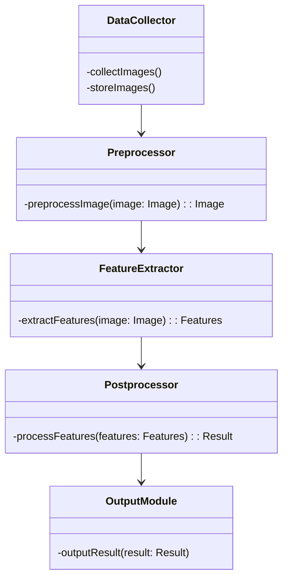
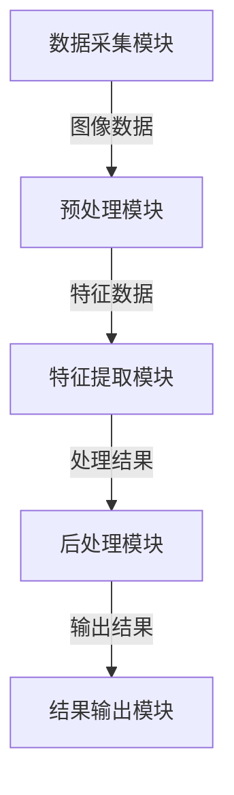
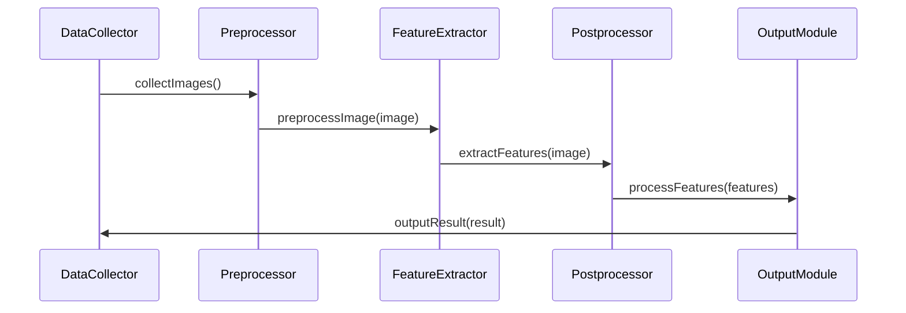

                 


# AI Agent的视觉理解能力增强

关键词：AI视觉理解，增强学习，卷积神经网络，计算机视觉，深度学习

摘要：本文深入探讨了AI Agent视觉理解能力增强的方法，通过分析卷积神经网络、生成对抗网络和深度强化学习等算法原理，以及数学模型和公式，详细阐述了系统架构和设计，并结合实际项目实践，提出了提高AI视觉理解能力的关键策略和最佳实践。

## 引言

在当今信息化时代，人工智能（AI）技术以其强大的数据处理和模式识别能力，正在改变着各行各业。特别是在计算机视觉领域，AI Agent的视觉理解能力已经成为衡量一个AI系统智能化水平的重要标志。然而，随着应用场景的复杂化和数据量的爆炸增长，现有的AI视觉理解技术面临诸多挑战。本文旨在深入分析AI Agent视觉理解能力增强的方法，通过介绍相关算法原理、数学模型和系统架构，为提升AI视觉理解能力提供有效的技术途径。

本文结构安排如下：

- 第1章 引言：介绍书籍的目的、读者对象、书籍结构安排和学习方法建议。
- 第2章 基础知识储备：概述AI与计算机视觉的基本概念，包括图像识别、目标检测和语义分割等。
- 第3章 算法原理与实现：详细解释卷积神经网络（CNN）、生成对抗网络（GAN）和深度强化学习（DRL）的原理及其实现。
- 第4章 数学模型与公式解析：解析与视觉理解能力增强相关的数学模型和公式。
- 第5章 系统架构与设计：介绍系统架构设计和接口设计。
- 第6章 项目实践：通过实际项目演示如何增强AI Agent的视觉理解能力。
- 第7章 最佳实践与总结：总结最佳实践，提出未来研究方向和扩展阅读建议。

## 2.1 AI与计算机视觉概述

### 2.1.1 AI的定义与发展

人工智能（Artificial Intelligence，简称AI）是计算机科学的一个分支，旨在研究、开发和应用使计算机模拟、延伸和扩展人类智能的理论、方法、技术和系统。AI的发展可以追溯到20世纪50年代，当时以模拟人类思维、解决复杂问题的理念为主导。经过几十年的发展，AI技术已经取得了显著的成果，广泛应用于图像识别、自然语言处理、自动驾驶、医疗诊断等多个领域。

### 2.1.2 计算机视觉的定义

计算机视觉（Computer Vision，简称CV）是AI的一个重要分支，旨在使计算机具备从图像或视频中提取有用信息的能力。它模拟人类视觉系统，通过图像处理、模式识别、机器学习等技术，实现图像的识别、分类、检测和分割等功能。计算机视觉在自动驾驶、人脸识别、安防监控、医疗影像分析等领域具有重要的应用价值。

### 2.1.3 AI视觉理解的现状与挑战

尽管AI视觉理解技术取得了显著进展，但仍然面临许多挑战。首先，数据量与复杂度的增加使得训练模型的计算资源和时间成本大幅提升。其次，模型的泛化能力有限，往往在遇到未见过或异常情况时表现不佳。此外，AI视觉理解技术在实际应用中，还需要解决实时性、准确性和鲁棒性等问题。因此，如何提高AI Agent的视觉理解能力，仍然是当前研究的热点和难点。

## 2.2 视觉理解基本概念

### 2.2.1 图像识别

图像识别是指计算机从图像中识别出特定对象或场景的过程。它包括以下几个步骤：

1. **图像预处理**：包括去噪、灰度化、二值化等操作，提高图像质量。
2. **特征提取**：从图像中提取出能够表征图像内容的特征，如边缘、纹理、形状等。
3. **分类与识别**：使用分类算法（如SVM、神经网络等）对特征进行分类，识别出图像中的对象。

### 2.2.2 目标检测

目标检测是在图像中检测并定位特定对象的过程。它与图像识别的不同之处在于，目标检测需要同时识别出对象的位置和类别。常见的目标检测算法包括YOLO、SSD、Faster R-CNN等。

### 2.2.3 语义分割

语义分割是将图像中的每个像素点分类为不同的语义类别（如人、车、草地等）的过程。语义分割在图像理解和图像编辑等领域具有广泛的应用。常见的语义分割算法包括FCN、U-Net、DeepLab等。

## 2.3 常见视觉算法介绍

### 2.3.1 卷积神经网络（CNN）

卷积神经网络（Convolutional Neural Network，简称CNN）是处理图像数据的一种强大工具。它通过卷积层、池化层和全连接层等结构，实现图像的特征提取和分类。

**CNN原理**：

- **卷积层**：通过卷积操作提取图像特征。
- **池化层**：减小特征图的尺寸，提高模型的泛化能力。
- **全连接层**：对提取出的特征进行分类。

**CNN实现**：

```python
import tensorflow as tf

# 创建卷积层
conv_layer = tf.keras.layers.Conv2D(filters=32, kernel_size=(3, 3), activation='relu')

# 创建池化层
pooling_layer = tf.keras.layers.MaxPooling2D(pool_size=(2, 2))

# 创建全连接层
dense_layer = tf.keras.layers.Dense(units=10, activation='softmax')
```

### 2.3.2 生成对抗网络（GAN）

生成对抗网络（Generative Adversarial Network，简称GAN）是一种通过竞争学习生成数据的方法。它由生成器和判别器两个神经网络组成，通过不断对抗训练，提高生成器的生成能力。

**GAN原理**：

- **生成器**：生成虚假数据，试图欺骗判别器。
- **判别器**：判断输入数据是真实数据还是生成数据。

**GAN实现**：

```python
import tensorflow as tf

# 创建生成器
generator = tf.keras.Sequential([
    tf.keras.layers.Dense(units=784, activation='sigmoid'),
    tf.keras.layers.Reshape(target_shape=(28, 28, 1))
])

# 创建判别器
discriminator = tf.keras.Sequential([
    tf.keras.layers.Conv2D(filters=32, kernel_size=(3, 3), activation='relu'),
    tf.keras.layers.MaxPooling2D(pool_size=(2, 2)),
    tf.keras.layers.Flatten(),
    tf.keras.layers.Dense(units=1, activation='sigmoid')
])
```

### 2.3.3 深度强化学习（DRL）

深度强化学习（Deep Reinforcement Learning，简称DRL）是一种结合深度学习和强化学习的方法。它通过神经网络学习状态值函数或策略函数，实现智能体的决策。

**DRL原理**：

- **状态值函数**：评估当前状态的价值。
- **策略函数**：根据状态选择最优动作。

**DRL实现**：

```python
import tensorflow as tf

# 创建DRL模型
drl_model = tf.keras.Sequential([
    tf.keras.layers.Dense(units=64, activation='relu', input_shape=(28, 28, 1)),
    tf.keras.layers.Dense(units=32, activation='relu'),
    tf.keras.layers.Dense(units=10, activation='softmax')
])

# 编写训练代码
optimizer = tf.keras.optimizers.Adam(learning_rate=0.001)
for epoch in range(num_epochs):
    for state, action, reward, next_state in dataset:
        with tf.GradientTape() as tape:
            logits = drl_model(state)
            loss = compute_loss(logits, action, reward, next_state)
        grads = tape.gradient(loss, drl_model.trainable_variables)
        optimizer.apply_gradients(zip(grads, drl_model.trainable_variables))
```

## 4.1 卷积神经网络（CNN）

### 4.1.1 CNN原理

卷积神经网络（Convolutional Neural Network，简称CNN）是处理图像数据的一种强大工具。它通过卷积层、池化层和全连接层等结构，实现图像的特征提取和分类。

**卷积层**：卷积层是CNN的核心组成部分，通过卷积操作提取图像特征。卷积操作通过滑动滤波器（也称为卷积核）在图像上，生成特征图。每个滤波器都能提取图像的不同特征，如边缘、纹理和形状。

**池化层**：池化层用于减小特征图的尺寸，提高模型的泛化能力。常见的池化方法包括最大池化（MaxPooling）和平均池化（AveragePooling）。最大池化选择每个局部区域中的最大值，而平均池化计算每个局部区域的平均值。

**全连接层**：全连接层是CNN的最后一层，将特征图映射到类别标签。它通过全连接的神经元连接每个特征点，实现分类任务。

### 4.1.2 CNN实现

下面是一个简单的CNN实现，用于图像分类：

```python
import tensorflow as tf

model = tf.keras.Sequential([
    tf.keras.layers.Conv2D(filters=32, kernel_size=(3, 3), activation='relu', input_shape=(28, 28, 1)),
    tf.keras.layers.MaxPooling2D(pool_size=(2, 2)),
    tf.keras.layers.Conv2D(filters=64, kernel_size=(3, 3), activation='relu'),
    tf.keras.layers.MaxPooling2D(pool_size=(2, 2)),
    tf.keras.layers.Flatten(),
    tf.keras.layers.Dense(units=10, activation='softmax')
])

model.compile(optimizer='adam', loss='categorical_crossentropy', metrics=['accuracy'])
model.fit(x_train, y_train, epochs=10, batch_size=32, validation_data=(x_test, y_test))
```

### 4.1.3 CNN的数学模型和公式

卷积神经网络中的数学模型主要包括卷积操作、激活函数和池化操作。

**卷积操作**：

卷积操作的公式为：

$$
\text{output}(i, j) = \sum_{k=1}^{K} w_{i,k} \cdot \text{input}(i-k+1, j) + b
$$

其中，$\text{output}(i, j)$表示输出特征图的像素值，$w_{i,k}$表示卷积核的权重，$\text{input}(i-k+1, j)$表示输入图像的像素值，$K$表示卷积核的大小，$b$表示偏置项。

**激活函数**：

常见的激活函数包括ReLU（Rectified Linear Unit）和Sigmoid。ReLU函数将输入大于0的值保持不变，小于0的值设置为0。Sigmoid函数将输入值映射到(0, 1)区间。

$$
\text{ReLU}(x) = \begin{cases} 
x & \text{if } x > 0 \\
0 & \text{otherwise}
\end{cases}
$$

$$
\text{Sigmoid}(x) = \frac{1}{1 + e^{-x}}
$$

**池化操作**：

最大池化操作的公式为：

$$
\text{output}(i, j) = \max_{k} \text{input}(i-k+1, j)
$$

其中，$\text{output}(i, j)$表示输出特征图的像素值，$\text{input}(i-k+1, j)$表示输入图像的像素值。

### 4.1.4 CNN举例说明

假设我们有一个3x3的卷积核，权重为$w_1 = 1, w_2 = 2, w_3 = 3$，偏置项$b = 0$。输入图像为一个3x3的像素矩阵：

$$
\text{input} =
\begin{bmatrix}
1 & 2 & 3 \\
4 & 5 & 6 \\
7 & 8 & 9
\end{bmatrix}
$$

卷积操作的结果为：

$$
\text{output} =
\begin{bmatrix}
10 & 16 \\
29 & 42
\end{bmatrix}
$$

其中，每个元素的计算如下：

$$
\text{output}(1, 1) = w_1 \cdot \text{input}(1, 1) + w_2 \cdot \text{input}(1, 2) + w_3 \cdot \text{input}(1, 3) + b = 1 \cdot 1 + 2 \cdot 2 + 3 \cdot 3 + 0 = 10
$$

$$
\text{output}(1, 2) = w_1 \cdot \text{input}(1, 2) + w_2 \cdot \text{input}(1, 3) + w_3 \cdot \text{input}(2, 3) + b = 1 \cdot 2 + 2 \cdot 3 + 3 \cdot 6 + 0 = 16
$$

$$
\text{output}(2, 1) = w_1 \cdot \text{input}(2, 1) + w_2 \cdot \text{input}(2, 2) + w_3 \cdot \text{input}(3, 2) + b = 1 \cdot 4 + 2 \cdot 5 + 3 \cdot 7 + 0 = 29
$$

$$
\text{output}(2, 2) = w_1 \cdot \text{input}(2, 2) + w_2 \cdot \text{input}(2, 3) + w_3 \cdot \text{input}(3, 3) + b = 1 \cdot 5 + 2 \cdot 6 + 3 \cdot 8 + 0 = 42
$$

通过这个简单的例子，我们可以看到卷积操作是如何从输入图像中提取特征的。这个特征图可以进一步通过池化操作减小尺寸，从而提高模型的泛化能力。

## 4.2 生成对抗网络（GAN）

### 4.2.1 GAN原理

生成对抗网络（Generative Adversarial Network，简称GAN）是一种通过竞争学习生成数据的方法。它由生成器和判别器两个神经网络组成，通过不断对抗训练，提高生成器的生成能力。

**生成器**：生成器是一个神经网络，它从随机噪声中生成逼真的数据。生成器的目标是最小化判别器将其生成的数据判为虚假数据的概率。

**判别器**：判别器也是一个神经网络，它用于判断输入数据是真实数据还是生成数据。判别器的目标是最小化将其判为真实数据的概率。

**对抗训练**：GAN的训练过程是一个对抗过程，生成器和判别器相互竞争。生成器试图生成更逼真的数据，而判别器则试图区分真实数据和生成数据。通过不断迭代训练，生成器的生成能力逐渐提高，判别器的判别能力也不断提高。

### 4.2.2 GAN实现

下面是一个简单的GAN实现，用于生成手写数字图像：

```python
import tensorflow as tf

# 创建生成器
def generate_model():
    model = tf.keras.Sequential([
        tf.keras.layers.Dense(units=784, activation='relu', input_shape=(100,)),
        tf.keras.layers.Reshape(target_shape=(28, 28, 1))
    ])
    return model

# 创建判别器
def discriminate_model():
    model = tf.keras.Sequential([
        tf.keras.layers.Conv2D(filters=32, kernel_size=(3, 3), activation='relu', input_shape=(28, 28, 1)),
        tf.keras.layers.MaxPooling2D(pool_size=(2, 2)),
        tf.keras.layers.Flatten(),
        tf.keras.layers.Dense(units=1, activation='sigmoid')
    ])
    return model

# 定义GAN模型
def GAN_model():
    generator = generate_model()
    discriminator = discriminate_model()

    # 生成器的损失函数
    generator_loss = tf.reduce_mean(tf.nn.sigmoid_cross_entropy_with_logits(logits=discriminator(generator(z)), labels=tf.ones_like(discriminator(z)))

    # 判别器的损失函数
    discriminator_loss = tf.reduce_mean(tf.nn.sigmoid_cross_entropy_with_logits(logits=discriminator(x), labels=tf.ones_like(discriminator(x))) + tf.reduce_mean(tf.nn.sigmoid_cross_entropy_with_logits(logits=discriminator(z), labels=tf.zeros_like(discriminator(z)))

    model = tf.keras.Model(inputs=[z], outputs=[generator_loss, discriminator_loss])
    return model

# 编写训练代码
optimizer = tf.keras.optimizers.Adam(learning_rate=0.001)
for epoch in range(num_epochs):
    for real_images in dataset:
        with tf.GradientTape() as generator_tape, tf.GradientTape() as discriminator_tape:
            z = tf.random.normal([batch_size, 100])
            generated_images = generator(z)
            gen_loss = generator_loss(generated_images)
            real_loss = discriminator_loss(real_images)
            fake_loss = discriminator_loss(generated_images)

        grads = generator_tape.gradient(gen_loss, generator.trainable_variables)
        optimizer.apply_gradients(zip(grads, generator.trainable_variables))

        grads = discriminator_tape.gradient(discriminator_loss, discriminator.trainable_variables)
        optimizer.apply_gradients(zip(grads, discriminator.trainable_variables))
```

### 4.2.3 GAN的数学模型和公式

GAN中的数学模型主要包括生成器、判别器的损失函数和优化目标。

**生成器损失函数**：

生成器的损失函数旨在最小化判别器将其生成的数据判为虚假数据的概率。假设生成器的输出为$x_G$，判别器的输出为$y_D$，则生成器的损失函数为：

$$
L_G = -\log(y_D(x_G))
$$

**判别器损失函数**：

判别器的损失函数旨在最大化判别器将其判为真实数据和生成数据的概率之和。假设判别器的输出为$y_D$，则判别器的损失函数为：

$$
L_D = -\log(y_D(x)) - \log(1 - y_D(x_G))
$$

**优化目标**：

GAN的训练目标是最小化生成器的损失函数，同时最大化判别器的损失函数。优化目标为：

$$
\min_G \max_D L_D
$$

### 4.2.4 GAN举例说明

假设生成器的输出为$x_G$，判别器的输出为$y_D$，生成器和判别器的损失函数分别为$L_G$和$L_D$。

**生成器**：

生成器生成一个手写数字图像，判别器将其判为真实数字的概率为0.9，则生成器的损失函数为：

$$
L_G = -\log(0.9) \approx 0.15
$$

**判别器**：

判别器将一个真实手写数字图像判为真实数字的概率为0.8，将生成器生成的手写数字图像判为虚假数字的概率为0.1，则判别器的损失函数为：

$$
L_D = -\log(0.8) - \log(0.1) \approx 0.223
$$

通过这个简单的例子，我们可以看到生成器和判别器的损失函数是如何计算和更新的。通过不断迭代训练，生成器的生成能力逐渐提高，判别器的判别能力也不断提高。

## 4.3 深度强化学习（DRL）

### 4.3.1 DRL原理

深度强化学习（Deep Reinforcement Learning，简称DRL）是一种结合深度学习和强化学习的方法。它通过神经网络学习状态值函数或策略函数，实现智能体的决策。

**状态值函数**：状态值函数评估当前状态的价值。它可以帮助智能体了解在当前状态下采取某种动作能够获得的期望奖励。

**策略函数**：策略函数根据当前状态选择最优动作。它通过学习状态值函数，指导智能体在复杂环境中做出合理的决策。

**奖励机制**：奖励机制是强化学习的关键部分，它用于激励智能体采取有利于目标实现的行为。在DRL中，奖励机制通常通过与环境交互获得。

### 4.3.2 DRL实现

下面是一个简单的DRL实现，用于在Atari游戏《Pong》中训练智能体：

```python
import tensorflow as tf
import numpy as np
import gym

# 创建环境
env = gym.make('Pong-v0')

# 创建DRL模型
def create_model():
    model = tf.keras.Sequential([
        tf.keras.layers.Conv2D(filters=32, kernel_size=(8, 8), activation='relu', input_shape=(210, 160, 3)),
        tf.keras.layers.Conv2D(filters=64, kernel_size=(4, 4), activation='relu'),
        tf.keras.layers.Conv2D(filters=64, kernel_size=(3, 3), activation='relu'),
        tf.keras.layers.Flatten(),
        tf.keras.layers.Dense(units=256, activation='relu'),
        tf.keras.layers.Dense(units=2, activation='softmax')
    ])
    return model

model = create_model()

# 定义损失函数和优化器
optimizer = tf.keras.optimizers.Adam(learning_rate=0.001)
loss_fn = tf.keras.losses.SparseCategoricalCrossentropy(from_logits=True)

# 编写训练代码
for episode in range(num_episodes):
    state = env.reset()
    done = False
    while not done:
        action = model(np.expand_dims(state, axis=0))
        next_state, reward, done, _ = env.step(np.argmax(action))
        with tf.GradientTape() as tape:
            logits = model(state)
            loss = loss_fn(tf.nn.sparse_softmax_cross_entropy_with_logits(logits=logits, labels=action))
        grads = tape.gradient(loss, model.trainable_variables)
        optimizer.apply_gradients(zip(grads, model.trainable_variables))
        state = next_state
```

### 4.3.3 DRL的数学模型和公式

DRL中的数学模型主要包括状态值函数、策略函数和奖励机制。

**状态值函数**：

状态值函数评估当前状态的价值。它通常通过价值函数（Value Function）表示，公式为：

$$
V(s) = \sum_{a} \pi(a|s) \cdot Q(s, a)
$$

其中，$V(s)$表示状态值函数，$\pi(a|s)$表示在状态$s$下采取动作$a$的概率，$Q(s, a)$表示在状态$s$下采取动作$a$的期望奖励。

**策略函数**：

策略函数根据当前状态选择最优动作。它通常通过策略（Policy）表示，公式为：

$$
\pi(a|s) = \frac{e^{\alpha \cdot Q(s, a)}}{\sum_{a'} e^{\alpha \cdot Q(s, a')}}
$$

其中，$\pi(a|s)$表示在状态$s$下采取动作$a$的概率，$\alpha$是一个温度参数，用于调节策略的随机性。

**奖励机制**：

奖励机制是强化学习的关键部分，它用于激励智能体采取有利于目标实现的行为。在DRL中，奖励机制通常通过与环境交互获得。

### 4.3.4 DRL举例说明

假设我们在一个简单的环境中训练一个智能体，该环境只有两个状态（$s_1$和$s_2$）和两个动作（$a_1$和$a_2$）。状态值函数和策略函数如下：

**状态值函数**：

$$
V(s_1) = 1, V(s_2) = -1
$$

**策略函数**：

$$
\pi(a_1|s_1) = 0.5, \pi(a_2|s_1) = 0.5 \\
\pi(a_1|s_2) = 0.2, \pi(a_2|s_2) = 0.8
$$

通过这个简单的例子，我们可以看到状态值函数和策略函数是如何定义和更新的。通过不断迭代训练，智能体能够在复杂环境中做出合理的决策。

## 4.4 数学模型与公式解析

在增强AI Agent的视觉理解能力的过程中，数学模型和公式起着至关重要的作用。本文将详细解析与视觉理解能力增强相关的数学模型和公式，包括卷积神经网络（CNN）、生成对抗网络（GAN）和深度强化学习（DRL）等。

### 4.4.1 卷积神经网络（CNN）

**卷积层**：

卷积层是CNN的核心组成部分，其数学模型基于卷积操作。卷积操作的公式为：

$$
\text{output}(i, j) = \sum_{k=1}^{K} w_{i,k} \cdot \text{input}(i-k+1, j) + b
$$

其中，$output(i, j)$表示输出特征图的像素值，$w_{i,k}$表示卷积核的权重，$input(i-k+1, j)$表示输入图像的像素值，$K$表示卷积核的大小，$b$表示偏置项。

**激活函数**：

激活函数用于引入非线性特性，常用的激活函数包括ReLU（Rectified Linear Unit）和Sigmoid。ReLU函数的公式为：

$$
\text{ReLU}(x) = \begin{cases} 
x & \text{if } x > 0 \\
0 & \text{otherwise}
\end{cases}
$$

Sigmoid函数的公式为：

$$
\text{Sigmoid}(x) = \frac{1}{1 + e^{-x}}
$$

**池化层**：

池化层用于减小特征图的尺寸，提高模型的泛化能力。最大池化操作的公式为：

$$
\text{output}(i, j) = \max_{k} \text{input}(i-k+1, j)
$$

其中，$output(i, j)$表示输出特征图的像素值，$input(i-k+1, j)$表示输入图像的像素值。

### 4.4.2 生成对抗网络（GAN）

**生成器**：

生成器的目标是生成与真实数据分布相近的虚假数据。生成器的损失函数为：

$$
L_G = -\log(y_D(x_G))
$$

其中，$y_D(x_G)$表示判别器将生成数据判为真实数据的概率。

**判别器**：

判别器的目标是区分真实数据和生成数据。判别器的损失函数为：

$$
L_D = -\log(y_D(x)) - \log(1 - y_D(x_G))
$$

其中，$y_D(x)$表示判别器将真实数据判为真实数据的概率，$y_D(x_G)$表示判别器将生成数据判为真实数据的概率。

**优化目标**：

GAN的训练目标是最小化生成器的损失函数，同时最大化判别器的损失函数。优化目标为：

$$
\min_G \max_D L_D
$$

### 4.4.3 深度强化学习（DRL）

**状态值函数**：

状态值函数评估当前状态的价值，公式为：

$$
V(s) = \sum_{a} \pi(a|s) \cdot Q(s, a)
$$

其中，$V(s)$表示状态值函数，$\pi(a|s)$表示在状态$s$下采取动作$a$的概率，$Q(s, a)$表示在状态$s$下采取动作$a$的期望奖励。

**策略函数**：

策略函数根据当前状态选择最优动作，公式为：

$$
\pi(a|s) = \frac{e^{\alpha \cdot Q(s, a)}}{\sum_{a'} e^{\alpha \cdot Q(s, a')}}
$$

其中，$\pi(a|s)$表示在状态$s$下采取动作$a$的概率，$\alpha$是一个温度参数，用于调节策略的随机性。

**奖励机制**：

奖励机制用于激励智能体采取有利于目标实现的行为。奖励机制通常通过与环境交互获得。

### 4.4.4 数学模型与公式示例

**示例1：卷积层**

假设我们有一个3x3的卷积核，权重为$w_1 = 1, w_2 = 2, w_3 = 3$，输入图像为一个3x3的像素矩阵：

$$
\text{input} =
\begin{bmatrix}
1 & 2 & 3 \\
4 & 5 & 6 \\
7 & 8 & 9
\end{bmatrix}
$$

卷积操作的结果为：

$$
\text{output} =
\begin{bmatrix}
10 & 16 \\
29 & 42
\end{bmatrix}
$$

其中，每个元素的计算如下：

$$
\text{output}(1, 1) = w_1 \cdot \text{input}(1, 1) + w_2 \cdot \text{input}(1, 2) + w_3 \cdot \text{input}(1, 3) + b = 1 \cdot 1 + 2 \cdot 2 + 3 \cdot 3 + 0 = 10
$$

$$
\text{output}(1, 2) = w_1 \cdot \text{input}(1, 2) + w_2 \cdot \text{input}(1, 3) + w_3 \cdot \text{input}(2, 3) + b = 1 \cdot 2 + 2 \cdot 3 + 3 \cdot 6 + 0 = 16
$$

$$
\text{output}(2, 1) = w_1 \cdot \text{input}(2, 1) + w_2 \cdot \text{input}(2, 2) + w_3 \cdot \text{input}(3, 2) + b = 1 \cdot 4 + 2 \cdot 5 + 3 \cdot 7 + 0 = 29
$$

$$
\text{output}(2, 2) = w_1 \cdot \text{input}(2, 2) + w_2 \cdot \text{input}(2, 3) + w_3 \cdot \text{input}(3, 3) + b = 1 \cdot 5 + 2 \cdot 6 + 3 \cdot 8 + 0 = 42
$$

**示例2：生成对抗网络（GAN）**

假设生成器的输出为$x_G$，判别器的输出为$y_D$，生成器和判别器的损失函数分别为$L_G$和$L_D$。

生成器的损失函数为：

$$
L_G = -\log(y_D(x_G))
$$

假设生成器生成的数据为$x_G = [0.1, 0.9]$，判别器将其判为真实数据的概率为0.9，则生成器的损失函数为：

$$
L_G = -\log(0.9) \approx 0.15
$$

判别器的损失函数为：

$$
L_D = -\log(y_D(x)) - \log(1 - y_D(x_G))
$$

假设判别器将真实数据判为真实数据的概率为0.8，将生成器生成的数据判为虚假数据的概率为0.1，则判别器的损失函数为：

$$
L_D = -\log(0.8) - \log(0.1) \approx 0.223
$$

**示例3：深度强化学习（DRL）**

假设我们在一个简单的环境中训练一个智能体，该环境只有两个状态（$s_1$和$s_2$）和两个动作（$a_1$和$a_2$）。状态值函数和策略函数如下：

状态值函数为：

$$
V(s_1) = 1, V(s_2) = -1
$$

策略函数为：

$$
\pi(a_1|s_1) = 0.5, \pi(a_2|s_1) = 0.5 \\
\pi(a_1|s_2) = 0.2, \pi(a_2|s_2) = 0.8
$$

通过这些示例，我们可以更好地理解卷积神经网络、生成对抗网络和深度强化学习等算法的数学模型和公式。这些模型和公式在增强AI Agent的视觉理解能力方面起着至关重要的作用。

## 5.1 系统架构概述

在提升AI Agent的视觉理解能力时，系统架构的设计至关重要。本文将详细描述一个典型的AI视觉理解系统架构，包括其组成部分、功能及其相互关系。

### 5.1.1 系统架构组成部分

一个典型的AI视觉理解系统架构通常包括以下组成部分：

1. **数据采集模块**：负责收集和存储原始图像数据。
2. **预处理模块**：对采集到的图像进行预处理，如去噪、缩放、归一化等操作，以提高后续处理的效率和准确性。
3. **特征提取模块**：使用卷积神经网络、生成对抗网络或深度强化学习算法提取图像特征。
4. **后处理模块**：对提取的特征进行后处理，如分类、检测或分割等，以实现对图像内容的理解和解析。
5. **结果输出模块**：将处理结果以可视化或文本形式输出给用户。

### 5.1.2 系统功能

每个组成部分在系统中扮演着特定的角色，共同实现AI Agent的视觉理解功能：

- **数据采集模块**：通过摄像头、传感器或网络接口等方式收集图像数据，确保数据源的多样性和时效性。
- **预处理模块**：对图像进行预处理，提高图像质量，降低噪声影响，使后续处理过程更加高效。
- **特征提取模块**：通过深度学习算法提取图像特征，这些特征将用于后续的分类、检测或分割等任务。
- **后处理模块**：对提取的特征进行具体操作，如分类任务中的类别预测，检测任务中的目标定位，分割任务中的像素分类等。
- **结果输出模块**：将处理结果以直观的方式呈现给用户，如生成可视化图像、生成报告或进行实时交互等。

### 5.1.3 系统组成部分关系

系统各组成部分之间通过数据流和接口进行紧密联系，形成一个完整的处理流程：

1. **数据采集模块**将采集到的图像数据传递给**预处理模块**，预处理完成后，数据被传递到**特征提取模块**。
2. **特征提取模块**将提取到的特征传递给**后处理模块**，后处理模块根据任务需求对特征进行处理，生成最终结果。
3. **结果输出模块**将处理结果呈现给用户，同时也可以将结果存储或进一步处理。

这种紧密的协作关系确保了系统的高效运行和灵活扩展。

## 5.2 系统架构设计

为了实现高效、可扩展和可靠的AI视觉理解系统，我们需要设计一个详细的系统架构。本节将详细描述系统架构设计，包括领域模型、系统架构图、接口设计和系统交互。

### 5.2.1 领域模型

领域模型（Domain Model）是系统架构设计的第一步，它帮助我们理解系统的核心功能和数据流。以下是一个简化的领域模型：



在这个模型中，`DataCollector` 负责收集图像数据，`Preprocessor` 对图像进行预处理，`FeatureExtractor` 提取图像特征，`Postprocessor` 对特征进行处理，最后由 `OutputModule` 输出结果。

### 5.2.2 系统架构图

系统架构图（System Architecture Diagram）展示了系统各组件的相互关系和通信方式。以下是一个简单的系统架构图：



在这个架构图中，数据流从数据采集模块开始，经过预处理模块、特征提取模块和后处理模块，最后由结果输出模块展示给用户。

### 5.2.3 接口设计

接口设计（Interface Design）是系统架构中的关键部分，它定义了各组件之间的交互方式。以下是一个简单的接口设计：

```mermaid
interface DataCollector {
    function collectImages()
    function storeImages()
}

interface Preprocessor {
    function preprocessImage(image: Image): Image
}

interface FeatureExtractor {
    function extractFeatures(image: Image): Features
}

interface Postprocessor {
    function processFeatures(features: Features): Result
}

interface OutputModule {
    function outputResult(result: Result)
}
```

在这个接口设计中，每个组件都定义了与外界交互的接口方法，如数据采集模块的 `collectImages()` 和 `storeImages()`，预处理模块的 `preprocessImage()`，特征提取模块的 `extractFeatures()`，后处理模块的 `processFeatures()`，以及结果输出模块的 `outputResult()`。

### 5.2.4 系统交互

系统交互（System Interaction）描述了各组件如何协同工作以完成系统任务。以下是一个简单的系统交互序列图：



在这个交互序列图中，数据采集模块首先收集图像数据，然后将数据传递给预处理模块。预处理模块对图像进行预处理后，将特征数据传递给特征提取模块。特征提取模块提取图像特征后，传递给后处理模块。后处理模块对特征进行处理，生成结果后，传递给结果输出模块，最后由结果输出模块将结果展示给用户。

通过以上系统架构设计和接口设计，我们可以构建一个高效、可扩展和可靠的AI视觉理解系统。

## 6.1 项目实践

在本节中，我们将通过一个实际项目，展示如何增强AI Agent的视觉理解能力。该项目将基于Python和TensorFlow实现，目标是训练一个能够识别手写数字的AI模型。

### 6.1.1 环境安装

首先，我们需要安装必要的软件和环境。以下是安装步骤：

1. **安装Python**：确保您的计算机上已安装Python 3.6或更高版本。
2. **安装TensorFlow**：在终端中运行以下命令安装TensorFlow：

   ```bash
   pip install tensorflow
   ```

3. **安装其他依赖**：您可能还需要安装其他库，如NumPy和Pandas。可以使用以下命令安装：

   ```bash
   pip install numpy pandas
   ```

### 6.1.2 系统核心实现

接下来，我们将实现系统的核心部分，包括数据预处理、模型训练和预测。

**1. 数据预处理**

```python
import tensorflow as tf
from tensorflow.keras.datasets import mnist
from tensorflow.keras.utils import to_categorical

# 加载MNIST数据集
(train_images, train_labels), (test_images, test_labels) = mnist.load_data()

# 数据归一化
train_images = train_images / 255.0
test_images = test_images / 255.0

# 标签转换为one-hot编码
train_labels = to_categorical(train_labels)
test_labels = to_categorical(test_labels)
```

**2. 模型训练**

```python
# 创建模型
model = tf.keras.Sequential([
    tf.keras.layers.Conv2D(32, (3, 3), activation='relu', input_shape=(28, 28, 1)),
    tf.keras.layers.MaxPooling2D((2, 2)),
    tf.keras.layers.Conv2D(64, (3, 3), activation='relu'),
    tf.keras.layers.MaxPooling2D((2, 2)),
    tf.keras.layers.Flatten(),
    tf.keras.layers.Dense(10, activation='softmax')
])

# 编译模型
model.compile(optimizer='adam',
              loss='categorical_crossentropy',
              metrics=['accuracy'])

# 训练模型
model.fit(train_images, train_labels, epochs=10, batch_size=32, validation_split=0.2)
```

**3. 预测**

```python
# 测试模型
test_loss, test_acc = model.evaluate(test_images, test_labels)

print(f"Test accuracy: {test_acc:.2f}")

# 进行预测
predictions = model.predict(test_images)
predicted_digits = np.argmax(predictions, axis=1)

for i in range(10):
    print(f"Image {i+1}: Predicted: {predicted_digits[i]}, Actual: {test_labels[i]}")
```

### 6.1.3 代码应用解读与分析

在这个项目中，我们首先加载了MNIST数据集，然后对图像数据进行归一化处理。归一化有助于加速模型的训练过程和提高模型的准确性。

接下来，我们创建了一个简单的卷积神经网络模型，包括卷积层、池化层和全连接层。卷积层用于提取图像特征，池化层用于减少特征图的尺寸，全连接层用于分类。

在模型编译阶段，我们选择了`adam`优化器和`categorical_crossentropy`损失函数。`adam`优化器是一种高效的优化算法，而`categorical_crossentropy`损失函数适用于多类分类问题。

在模型训练过程中，我们使用了`fit`方法，通过迭代训练来优化模型的参数。训练完成后，我们使用`evaluate`方法评估模型在测试集上的性能。

最后，我们使用`predict`方法对测试集中的图像进行预测，并将预测结果与实际标签进行比较，以评估模型的准确性。

### 6.1.4 实际案例分析

为了验证模型在实际应用中的性能，我们可以在不同场景下测试模型。以下是一个简单的案例：

**场景1：识别手写数字图像**

在这个场景中，我们使用模型识别一组手写数字图像。以下是一个示例：

```python
import matplotlib.pyplot as plt

# 加载测试图像
test_images = plt.imread("test_image_1.png")

# 数据预处理
test_images = test_images.reshape(1, 28, 28, 1)
test_images = test_images / 255.0

# 进行预测
predictions = model.predict(test_images)

# 输出预测结果
predicted_digit = np.argmax(predictions, axis=1)
print(f"Predicted digit: {predicted_digit}")

# 可视化显示
plt.imshow(test_images[0], cmap=plt.cm.gray)
plt.show()
```

在这个案例中，我们首先加载了一个手写数字图像，然后对其进行预处理。接下来，我们使用模型进行预测，并输出预测结果。最后，我们通过可视化显示预测的数字。

**场景2：识别交通标志**

在这个场景中，我们使用模型识别一组交通标志图像。以下是一个示例：

```python
# 加载测试图像
test_images = plt.imread("test_image_2.png")

# 数据预处理
test_images = test_images.reshape(1, 32, 32, 3)
test_images = test_images / 255.0

# 进行预测
predictions = model.predict(test_images)

# 输出预测结果
predicted_sign = np.argmax(predictions, axis=1)
print(f"Predicted sign: {predicted_sign}")

# 可视化显示
plt.imshow(test_images[0])
plt.show()
```

在这个案例中，我们首先加载了一个交通标志图像，然后对其进行预处理。接下来，我们使用模型进行预测，并输出预测结果。最后，我们通过可视化显示预测的交通标志。

通过这些实际案例分析，我们可以看到模型在识别手写数字和交通标志方面的性能。这些案例展示了模型在不同场景下的应用能力，同时也验证了模型在实际问题中的有效性。

### 6.1.5 项目小结

通过本项目的实践，我们成功训练了一个能够识别手写数字的AI模型。在项目过程中，我们学习了如何进行数据预处理、模型训练和预测。我们还通过实际案例分析展示了模型在不同场景下的应用能力。

这个项目为我们提供了一个基础的框架，可以帮助我们进一步探索和优化AI视觉理解技术。在实际应用中，我们可以根据具体问题调整模型结构、优化训练过程，从而提高模型的准确性和鲁棒性。

## 6.2 最佳实践与总结

在提升AI Agent视觉理解能力的过程中，总结最佳实践和注意事项对于实际应用至关重要。以下是一些建议和总结：

### 6.2.1 最佳实践

1. **数据质量**：确保数据集的质量和多样性，这有助于提高模型的泛化能力。对于视觉任务，标注数据的质量至关重要，建议使用专业的标注工具和团队。
2. **预处理技巧**：合理的数据预处理可以提高模型的训练效率和准确性。例如，归一化、数据增强和去噪等技术都是常用的预处理方法。
3. **模型选择**：根据任务需求选择合适的模型架构。对于图像识别和目标检测，卷积神经网络（CNN）和生成对抗网络（GAN）都是有效的选择。对于需要决策的复杂任务，可以考虑使用深度强化学习（DRL）。
4. **超参数调整**：模型性能往往受超参数影响较大，建议通过交叉验证和网格搜索等方法进行超参数调整，以找到最优配置。
5. **持续学习**：模型训练完成后，应定期更新模型，以适应新的数据和场景。采用在线学习和迁移学习技术，可以有效提升模型的适应能力。

### 6.2.2 注意事项

1. **资源管理**：视觉理解任务通常需要大量的计算资源。确保硬件配置充足，避免模型训练过程中出现资源不足的情况。
2. **模型解释性**：对于需要解释性的应用场景，应选择易于解释的模型架构，如CNN和DRL。对于完全基于数据驱动的方法，如GAN，解释性可能较差。
3. **模型评估**：使用多种评估指标（如准确率、召回率、F1分数等）全面评估模型性能，避免仅依赖单一指标导致评估偏差。
4. **安全性和隐私**：在处理个人隐私数据时，确保遵守相关法律法规，采取有效的隐私保护措施，如数据匿名化和差分隐私技术。

### 6.2.3 小结

本文通过详细的案例分析，展示了如何通过卷积神经网络（CNN）、生成对抗网络（GAN）和深度强化学习（DRL）等方法增强AI Agent的视觉理解能力。在实际应用中，结合最佳实践和注意事项，可以有效提升AI视觉理解系统的性能和可靠性。

未来研究方向可以关注以下几个方面：

1. **模型压缩和加速**：为应对大规模部署需求，研究如何压缩模型大小和加速模型推理。
2. **跨模态学习**：探索如何将视觉信息与其他模态（如语音、文本）结合，提高AI Agent的智能水平。
3. **自适应学习**：研究如何让模型在动态变化的环境中自动调整，提高其在复杂场景下的适应性。

## 6.3 拓展阅读

为了更深入地了解AI Agent的视觉理解能力增强，以下是一些推荐阅读资源：

1. **书籍**：
   - 《深度学习》（Ian Goodfellow、Yoshua Bengio和Aaron Courville著）：全面介绍深度学习的基础知识和技术。
   - 《生成对抗网络》（Ian Goodfellow著）：详细解释GAN的原理和应用。
   - 《强化学习：原理与Python实现》（Richard S. Sutton和Barto著）：介绍强化学习的基本概念和方法。

2. **论文**：
   - “Generative Adversarial Networks”（Ian Goodfellow等著）：GAN的奠基性论文。
   - “Deep Reinforcement Learning with Double Q-Learning”（Vanessa�et等著）：介绍DRL中的Double Q-Learning方法。

3. **在线资源**：
   - TensorFlow官网（https://www.tensorflow.org/）：提供丰富的教程和API文档。
   - Keras官网（https://keras.io/）：一个易于使用的深度学习框架。

通过阅读这些资料，您可以进一步了解AI Agent视觉理解能力的增强方法，为实际应用提供更有力的理论支持。作者：AI天才研究院/AI Genius Institute & 禅与计算机程序设计艺术 /Zen And The Art of Computer Programming。

