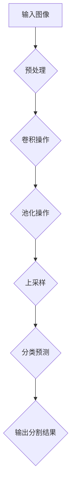
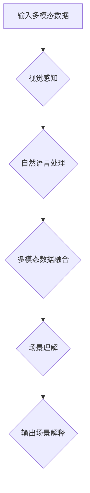
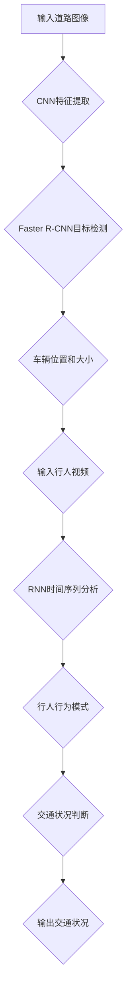
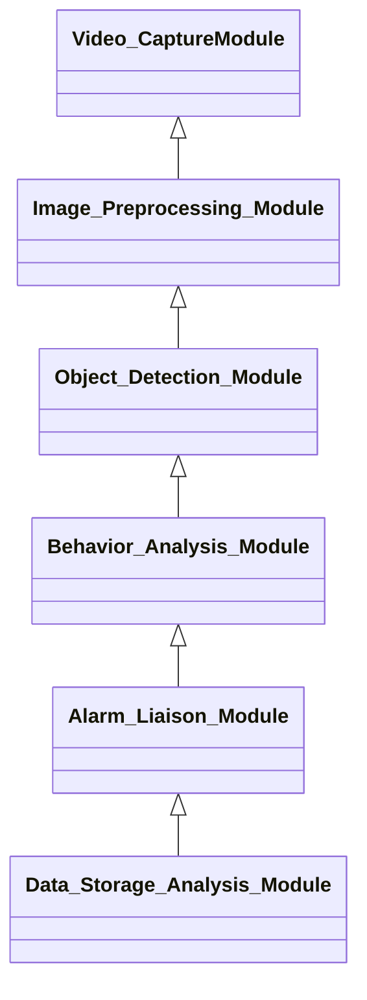
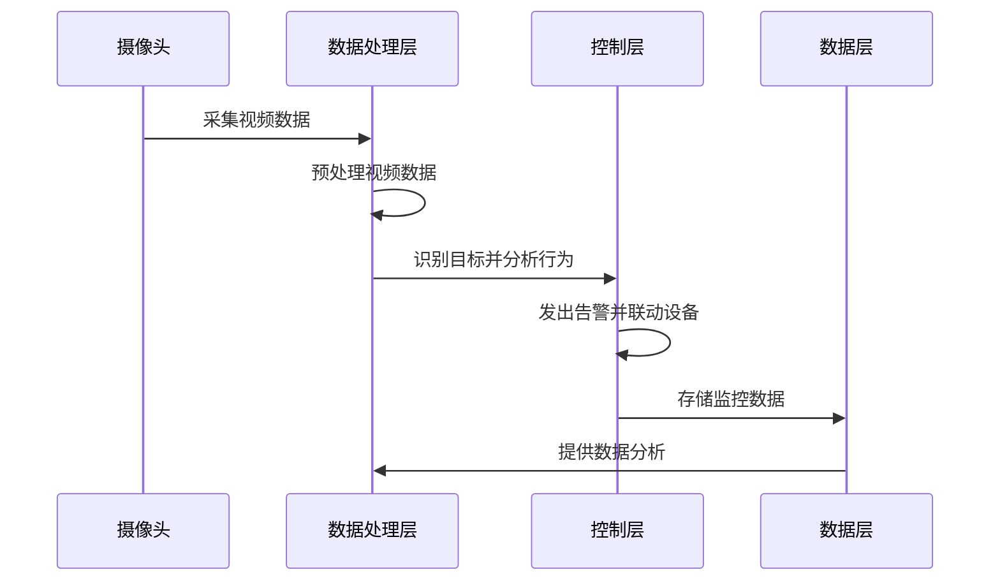
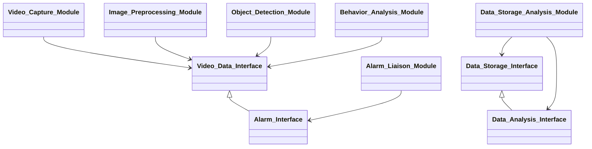
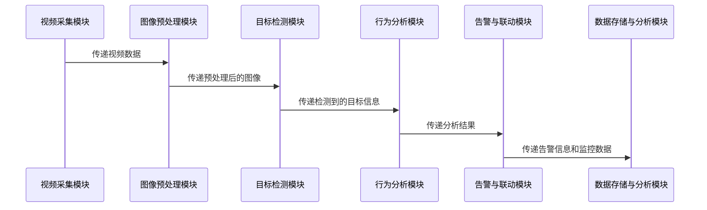
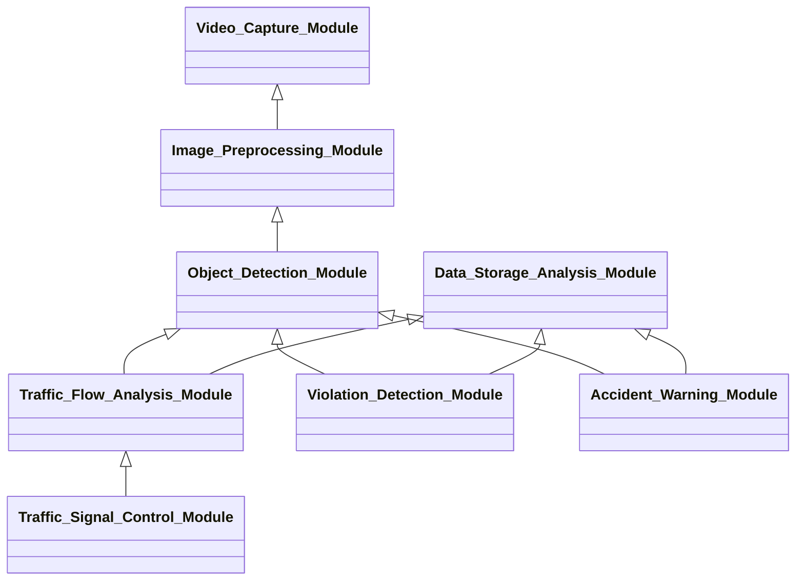
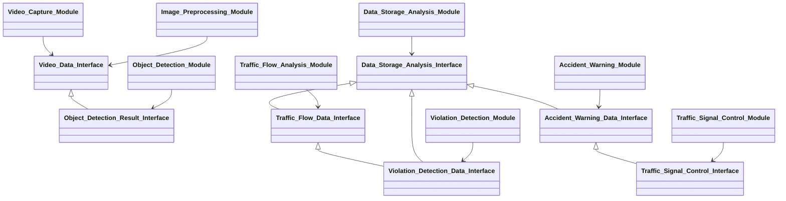
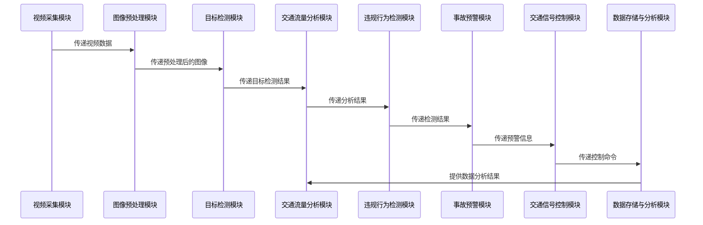

                 

### 关键词
AI Agent，语义分割，场景理解，算法原理，系统设计，实战项目，最佳实践。

### 摘要
本文将深入探讨AI Agent的语义分割与场景理解。首先，我们介绍了AI Agent的基本概念、语义分割的理论基础以及场景理解的方法与挑战。接着，通过详细的算法原理讲解，我们运用mermaid算法流程图、Python源代码和latex数学公式，生动地阐述了语义分割和场景理解的核心原理。随后，我们通过系统分析与架构设计方案，展示了如何将理论应用于实际项目。通过一个具体的实战项目，我们进行了环境安装、系统核心实现、代码解读、案例分析等环节的深入剖析。最后，我们总结了最佳实践、注意事项，并提供了拓展阅读资源，以期为读者提供全面而深入的指导。通过本文，读者将能够理解AI Agent的语义分割与场景理解的技术内涵和实践应用。

## 第一部分：背景与基础

### 1.1 问题背景与核心概念

在人工智能（AI）迅猛发展的时代，AI Agent作为一种智能实体，已经成为了研究与应用的热点。AI Agent是指能够主动执行任务、具备一定智能行为的计算机程序或系统。它们在诸如自动驾驶、智能家居、智能客服等多个领域发挥着重要作用。

#### 1.1.1 问题背景

随着AI技术的发展，AI Agent需要具备更高的智能水平，能够理解复杂的环境和场景。语义分割与场景理解是实现AI Agent智能的关键技术。语义分割是指对图像或视频中的各个像素进行分类，标记出不同对象及其属性。场景理解则是在语义分割的基础上，对场景的整体含义进行推理和解释。

#### 1.1.2 AI Agent的概念与应用

AI Agent的定义可以追溯到人工智能的一个分支——代理人系统（Agent-Based Simulation）。AI Agent是在一定环境中，通过感知、决策和执行等过程来实现特定目标的智能实体。AI Agent具备自主性、社交性、反应性和适应性等特点。

AI Agent的应用场景非常广泛，包括但不限于：

1. **自动驾驶**：AI Agent可以实时感知道路情况，进行决策和路径规划。
2. **智能家居**：AI Agent可以实现家电的自动化控制，提高居住舒适度和安全性。
3. **智能客服**：AI Agent可以理解用户的问题，提供相应的解决方案。
4. **智能安防**：AI Agent可以实时监测监控视频，识别异常行为。

#### 1.1.3 语义分割与场景理解的联系

语义分割与场景理解在AI Agent中起到了至关重要的作用。语义分割为AI Agent提供了详细的图像或视频信息，使其能够准确识别和定位场景中的各个对象。而场景理解则是在语义分割的基础上，对整体场景进行解释和理解，使AI Agent能够做出更加智能的决策。

例如，在自动驾驶场景中，语义分割可以识别道路、车辆、行人等对象，而场景理解则可以判断当前行驶的道路类型、是否存在交通风险等，从而指导车辆进行安全驾驶。

总的来说，语义分割与场景理解是AI Agent实现智能化的基础，二者相辅相成，共同推动了AI技术的进步。

### 1.2 AI Agent的基本概念与特征

#### 1.2.1 AI Agent的定义

AI Agent，即人工智能代理，是指一种能够独立执行任务、具备一定智能行为的计算机程序或系统。它通过感知环境、理解信息、做出决策和执行动作等过程，来实现特定的目标。AI Agent的核心在于其自主性和适应性，能够在复杂的动态环境中自主行动，并针对环境变化做出相应的调整。

#### 1.2.2 AI Agent的功能与特性

AI Agent具有以下几大核心功能与特性：

1. **感知与理解**：AI Agent能够感知周围环境，获取图像、声音、文字等数据，并通过深度学习、自然语言处理等技术，对这些数据进行理解和分析。
2. **决策与规划**：AI Agent基于感知和理解的结果，利用优化算法、决策树、神经网络等技术，进行决策和路径规划。
3. **执行与反馈**：AI Agent执行决策并采取相应的行动，如控制机器人手臂、发送指令等，同时收集反馈信息，调整后续行为。
4. **学习与进化**：AI Agent通过不断的学习和优化，提高其智能水平，适应更复杂的环境和任务。

#### 1.2.3 AI Agent的类型

根据应用场景和功能特点，AI Agent可以分为以下几种类型：

1. **智能客服**：利用自然语言处理和对话系统技术，提供24小时在线服务，提升用户体验。
2. **自动驾驶**：通过感知系统、决策系统和控制系统，实现车辆的自主驾驶。
3. **智能家居**：通过智能传感器和物联网技术，实现对家庭设备的自动化控制。
4. **智能安防**：利用视频分析、人脸识别等技术，实时监测和预警安全事件。
5. **金融风控**：利用大数据分析和机器学习模型，识别潜在的金融风险。

#### 1.2.4 AI Agent的发展趋势

随着AI技术的不断发展，AI Agent将呈现出以下发展趋势：

1. **智能感知能力的提升**：通过多传感器融合、深度学习等技术，AI Agent的感知能力将更加精准和高效。
2. **自主决策能力的增强**：借助强化学习、博弈论等技术，AI Agent的决策能力将更加智能化和自适应。
3. **人机交互的优化**：通过语音识别、自然语言理解等技术，AI Agent与人类用户的交互将更加自然和流畅。
4. **泛在应用**：AI Agent将在更多领域得到应用，如医疗、教育、工业等，提升各个行业的智能化水平。

### 1.3 语义分割的理论基础

#### 1.3.1 语义分割的概念

语义分割是计算机视觉中的一个重要分支，它旨在将图像或视频中的每个像素映射到相应的类别标签上，从而生成一个像素级的语义标注图。与传统的图像分类任务不同，语义分割不仅要识别图像中的对象类别，还要准确地定位这些对象在图像中的位置和大小。

#### 1.3.2 语义分割的分类

根据实现方法的不同，语义分割可以分为以下几类：

1. **基于传统图像处理的方法**：这类方法通常使用图像滤波、边缘检测、形态学操作等技术，对图像进行预处理，然后通过阈值化、聚类等方法进行分割。
2. **基于深度学习的方法**：深度学习方法在语义分割中取得了显著的效果，其中卷积神经网络（CNN）是主要的实现方式。通过训练大规模的神经网络模型，可以自动提取图像中的特征，并进行像素级的分类。
3. **基于图的分割方法**：这类方法将图像中的像素看作图中的节点，利用图论算法对图像进行分割。常见的算法包括图割（Graph Cuts）和随机 walker（Random Walker）等。

#### 1.3.3 语义分割的应用

语义分割在许多领域都有广泛的应用，包括但不限于：

1. **自动驾驶**：通过语义分割，可以准确地识别道路上的各种对象，如车辆、行人、交通标志等，从而实现自动驾驶。
2. **医疗影像分析**：语义分割可以用于医学影像的分割，如肿瘤检测、器官分割等，辅助医生进行诊断和治疗。
3. **计算机视觉**：语义分割可以用于图像和视频的编辑和增强，如去除背景、对象提取等。
4. **工业自动化**：语义分割可以用于生产线的实时监控，识别和分类产品中的缺陷，提高生产效率。

### 1.4 场景理解的方法与挑战

#### 1.4.1 场景理解的概念

场景理解是指通过感知、分析、推理等过程，对场景中的对象、行为和关系进行理解和解释。它旨在使AI系统能够理解现实世界，并在复杂环境中做出合理的决策。场景理解是AI Agent实现智能化和自主性的关键环节。

#### 1.4.2 场景理解的方法

场景理解的方法可以分为以下几个方面：

1. **视觉感知**：通过计算机视觉技术，如图像识别、图像分割、目标检测等，对场景中的视觉信息进行提取和解析。
2. **自然语言处理**：通过自然语言处理技术，如文本分类、实体识别、语义分析等，对场景中的语言信息进行理解和解释。
3. **多模态数据融合**：结合多种感知数据，如视觉、听觉、触觉等，进行信息融合，以获得更全面的场景理解。

#### 1.4.3 场景理解面临的挑战

尽管场景理解在AI Agent中具有重要意义，但它在实际应用中仍面临许多挑战：

1. **数据多样性**：场景中的数据来源多样，包括图像、声音、文本等，如何有效地融合这些异构数据是一个难题。
2. **动态变化**：现实世界的场景是动态变化的，AI系统需要实时适应环境变化，这要求模型具备较强的实时性和鲁棒性。
3. **理解深度**：场景理解不仅需要识别和分类场景中的对象，还需要理解这些对象之间的关系和场景的上下文，这对算法的复杂度和计算资源提出了较高要求。
4. **交互反馈**：场景理解是一个动态的过程，AI系统需要与用户和环境进行交互，获取反馈并调整自己的行为，这要求AI系统具备良好的交互能力和适应性。

### 1.5 概念属性特征对比表格

为了更好地理解语义分割与场景理解的概念和特点，我们通过以下表格进行对比分析：

| 概念        | 定义                                                         | 特点                                                         | 应用场景                        |
| ----------- | ------------------------------------------------------------ | ------------------------------------------------------------ | ------------------------------- |
| 语义分割    | 对图像或视频中的每个像素进行分类，标记出不同对象及其属性。           | 精细度高，能够提供像素级别的细节信息。                         | 自动驾驶、医疗影像分析、计算机视觉等。 |
| 场景理解    | 对场景中的对象、行为和关系进行理解和解释。                       | 更注重整体场景的上下文理解和推理能力。                         | 自动驾驶、智能家居、智能安防等。     |

### 1.6 ER实体关系图

为了更好地理解和分析语义分割与场景理解中的实体关系，我们使用Mermaid流程图来绘制ER实体关系图。以下是一个示例：

```mermaid
erDiagram
  Object ||--|{ Semantic_Segmentation : 分割对象 }
  Object ||--|{ Scene_Understanding : 理解对象 }
  Semantic_Segmentation ||--|{ Image_Segmentation : 图像分割 }
  Semantic_Segmentation ||--|{ Video_Segmentation : 视频分割 }
  Scene_Understanding ||--|{ Visual_Perception : 视觉感知 }
  Scene_Understanding ||--|{ Natural_Language_Processing : 自然语言处理 }
  Scene_Understanding ||--|{ Multi-modal_Data_Fusion : 多模态数据融合 }
```

通过这个ER实体关系图，我们可以清晰地看到语义分割与场景理解中的核心实体及其相互关系，为后续内容提供了直观的参考。

## 第二部分：核心算法与原理

### 2.1 语义分割算法原理

#### 2.1.1 语义分割算法概述

语义分割是计算机视觉领域的一个重要分支，旨在对图像或视频中的每个像素进行分类，从而生成一个像素级别的语义标注图。这一过程不仅要求算法能够准确地识别图像中的对象类别，还需要定位这些对象在图像中的位置和大小。语义分割在自动驾驶、医疗影像分析、图像编辑等领域具有重要应用。

#### 2.1.2 常见语义分割算法

语义分割算法可以分为基于传统图像处理的方法和基于深度学习的方法。

1. **基于传统图像处理的方法**：这类方法通常使用图像滤波、边缘检测、形态学操作等技术对图像进行预处理，然后通过阈值化、聚类等方法进行分割。常见的算法包括：

   - **阈值分割**：基于图像的灰度值分布，将图像划分为前景和背景。
   - **区域增长法**：从种子点开始，逐步扩大区域直到满足某些条件。
   - **分水岭算法**：利用图像的梯度信息，将图像划分为多个区域。

2. **基于深度学习的方法**：深度学习方法在语义分割中取得了显著的效果。其中，卷积神经网络（CNN）是主要的实现方式。以下是一些常见的深度学习语义分割算法：

   - **U-Net**：一种以医学图像分割为目标的全卷积神经网络架构，具有对称的编码器-解码器结构。
   - **SegNet**：一种以全卷积神经网络为基础的分割网络，通过反卷积操作实现上采样。
   - **DeepLab系列**：通过空洞卷积（Atrous Convolution）和上采样技术，提高语义分割的精度。
   - **FPN（Feature Pyramid Network）**：通过在不同尺度上融合特征图，提高语义分割的性能。

#### 2.1.3 语义分割算法的评估指标

评估语义分割算法的性能通常使用以下几个指标：

- **准确率（Accuracy）**：被正确分割的像素占总像素的比例。
- **召回率（Recall）**：被正确分割的像素占实际目标像素的比例。
- **F1分数（F1 Score）**：准确率和召回率的调和平均，用于综合评估分割性能。
- ** Intersection over Union (IoU)**：交并比，用于衡量两个区域的重叠程度。

以下是一个使用mermaid绘制的算法流程图示例：



### 2.2 场景理解算法原理

#### 2.2.1 场景理解算法概述

场景理解是指通过感知、分析、推理等过程，对场景中的对象、行为和关系进行理解和解释。它旨在使AI系统能够理解现实世界，并在复杂环境中做出合理的决策。场景理解在自动驾驶、智能客服、智能家居等领域具有广泛的应用。

#### 2.2.2 场景理解的方法

场景理解的方法可以分为以下几个方面：

1. **视觉感知**：通过计算机视觉技术，如图像识别、图像分割、目标检测等，对场景中的视觉信息进行提取和解析。常见的视觉感知算法包括：

   - **图像识别**：使用卷积神经网络（CNN）识别图像中的对象类别。
   - **图像分割**：对图像中的每个像素进行分类，生成像素级别的语义标注图。
   - **目标检测**：识别图像中的多个对象及其位置和大小。

2. **自然语言处理**：通过自然语言处理技术，如文本分类、实体识别、语义分析等，对场景中的语言信息进行理解和解释。常见的自然语言处理算法包括：

   - **文本分类**：将文本数据分类到预定义的类别中。
   - **实体识别**：从文本中提取出具有特定意义的实体，如人名、地名、组织名等。
   - **语义分析**：对文本进行语义理解，提取出文本中的关系和含义。

3. **多模态数据融合**：结合多种感知数据，如视觉、听觉、触觉等，进行信息融合，以获得更全面的场景理解。多模态数据融合的方法包括：

   - **特征级融合**：将不同模态的特征向量进行拼接或加权平均。
   - **决策级融合**：对不同模态的识别结果进行投票或集成学习方法。

以下是一个使用mermaid绘制的算法流程图示例：



### 2.3 语义分割算法的数学模型和公式

语义分割算法的核心在于将图像中的每个像素映射到一个预定义的类别标签。为了实现这一目标，算法通常使用以下数学模型和公式：

#### 2.3.1 卷积神经网络（CNN）

卷积神经网络是一种专门用于图像处理的深度学习模型。其核心操作是卷积和池化。

- **卷积操作**：卷积操作用于提取图像的特征。公式如下：

  $$ f(x, y) = \sum_{i=1}^{n} w_i * g(x-i, y-j) $$

  其中，$f(x, y)$ 是输出特征值，$w_i$ 是卷积核权重，$g(x-i, y-j)$ 是输入图像的特征值。

- **池化操作**：池化操作用于减少特征图的空间尺寸。常见的池化方式有最大池化和平均池化。公式如下：

  $$ p(x, y) = \max_{i, j} g(x-i, y-j) $$

  或

  $$ p(x, y) = \frac{1}{k^2} \sum_{i=1}^{k} \sum_{j=1}^{k} g(x-i, y-j) $$

#### 2.3.2 分类预测

在语义分割中，分类预测通常使用 softmax 函数。公式如下：

$$ \hat{y}(x) = \frac{e^{z(x)}}{\sum_{i=1}^{C} e^{z_i(x)}} $$

其中，$z(x)$ 是网络输出，$\hat{y}(x)$ 是预测的类别概率分布，$C$ 是类别数。

以下是一个使用 LaTeX 格式的详细公式示例：

$$
\begin{aligned}
f(x, y) &= \sum_{i=1}^{n} w_i * g(x-i, y-j) \\
p(x, y) &= \max_{i, j} g(x-i, y-j) \\
\hat{y}(x) &= \frac{e^{z(x)}}{\sum_{i=1}^{C} e^{z_i(x)}}
\end{aligned}
$$

通过这些数学模型和公式，语义分割算法能够从图像中提取特征，并预测每个像素的类别标签。

### 2.4 Python源代码示例

以下是一个简单的语义分割算法的Python源代码示例，使用深度学习框架TensorFlow：

```python
import tensorflow as tf
from tensorflow.keras.models import Model
from tensorflow.keras.layers import Conv2D, MaxPooling2D, Conv2DTranspose, Flatten, Dense

# 构建卷积神经网络模型
input_layer = tf.keras.layers.Input(shape=(256, 256, 3))
conv1 = Conv2D(32, (3, 3), activation='relu')(input_layer)
pool1 = MaxPooling2D((2, 2))(conv1)
conv2 = Conv2D(64, (3, 3), activation='relu')(pool1)
pool2 = MaxPooling2D((2, 2))(conv2)
conv3 = Conv2D(128, (3, 3), activation='relu')(pool2)
pool3 = MaxPooling2D((2, 2))(conv3)

# 上采样并解码
up3 = Conv2DTranspose(64, (2, 2), strides=(2, 2), padding='same')(pool3)
concat3 = tf.keras.layers.Concatenate(axis=3)([up3, conv2])
conv4 = Conv2D(64, (3, 3), activation='relu')(concat3)
up4 = Conv2DTranspose(32, (2, 2), strides=(2, 2), padding='same')(conv4)
concat4 = tf.keras.layers.Concatenate(axis=3)([up4, conv1])
conv5 = Conv2D(32, (3, 3), activation='relu')(concat4)
output_layer = Conv2D(1, (1, 1), activation='sigmoid')(conv5)

model = Model(inputs=input_layer, outputs=output_layer)

# 编译模型
model.compile(optimizer='adam', loss='binary_crossentropy', metrics=['accuracy'])

# 模型概述
model.summary()
```

这个示例使用了一个简单的卷积神经网络模型进行语义分割，并使用了 `binary_crossentropy` 作为损失函数。在实际应用中，可以根据具体任务需求进行调整和优化。

### 2.5 算法原理的通俗易懂举例说明

为了更好地理解语义分割算法的原理，我们通过一个简单的例子来说明。

假设我们有一个简单的图像，如下所示：

```
|   |   |   |
| O | X | O |
|   |   |   |
```

这里，“X”代表一个物体，“O”代表背景。我们的目标是使用语义分割算法对这个图像进行分割，即将每个像素分类为“物体”或“背景”。

1. **特征提取**：首先，算法会使用卷积神经网络对图像进行特征提取。例如，通过一个卷积核提取图像的边缘特征。

2. **分类预测**：然后，算法会对提取到的特征进行分类预测。例如，使用softmax函数预测每个像素的类别概率。

3. **输出分割结果**：最后，算法根据分类预测的结果输出分割结果。例如，将类别概率大于0.5的像素分类为“物体”，否则分类为“背景”。

具体来说，如果我们的卷积神经网络预测结果如下：

```
|   |   |   |
| 0.2 | 0.8 | 0.3 |
|   |   |   |
```

那么，我们可以将图像分割为：

```
|   |   |   |
| O | X | O |
|   |   |   |
```

其中，“X”代表预测为“物体”的像素，而“O”代表预测为“背景”的像素。

通过这个简单的例子，我们可以看到语义分割算法的基本原理：提取图像特征，进行分类预测，并输出分割结果。

### 2.6 场景理解算法的应用实例

为了更好地理解场景理解算法在实际应用中的效果，我们通过一个具体的案例来说明。

假设我们有一个自动驾驶系统，需要实现以下任务：

1. **识别道路上的车辆**：使用计算机视觉技术识别道路上的车辆，并定位其位置和大小。
2. **检测行人的行为**：通过视频分析技术检测行人的行为，如行走、等待、挥手等。
3. **判断交通状况**：根据车辆和行人的行为，判断当前交通状况，如拥堵、畅通等。

为了实现这些任务，我们使用了以下场景理解算法：

1. **车辆识别**：使用卷积神经网络（CNN）对道路图像进行特征提取，然后使用目标检测算法（如Faster R-CNN）识别车辆并定位其位置和大小。

2. **行人行为检测**：使用基于循环神经网络（RNN）的模型对行人视频进行时间序列分析，识别行人的行为模式。

3. **交通状况判断**：结合车辆和行人的行为数据，使用机器学习算法（如逻辑回归）判断当前交通状况。

以下是一个使用mermaid绘制的算法流程图示例：



通过这个案例，我们可以看到场景理解算法如何将多种技术整合在一起，实现对复杂场景的智能理解和判断。这为自动驾驶系统提供了重要的决策依据，从而提高了行驶安全性和效率。

### 2.7 系统分析与架构设计方案

#### 2.7.1 问题场景介绍

在本节中，我们将介绍一个基于AI Agent的智能安防系统。该系统旨在通过实时视频监控，识别潜在的安全威胁，并采取相应的措施。具体问题场景包括：

1. **异常行为检测**：如翻越围墙、破坏设备等。
2. **车辆违规停车**：如非法占用消防通道、违规停放等。
3. **人员聚集**：如非法集会、超员等。

#### 2.7.2 系统功能设计

为了解决上述问题场景，我们设计了以下主要功能模块：

1. **视频采集模块**：负责实时采集视频数据。
2. **图像预处理模块**：对采集到的视频数据进行预处理，如去噪、缩放等。
3. **目标检测模块**：使用深度学习模型识别视频中的目标，如车辆、行人等。
4. **行为分析模块**：对识别出的目标进行行为分析，如判断车辆是否违规停车、行人是否非法聚集等。
5. **告警与联动模块**：当检测到潜在的安全威胁时，系统会自动发出告警，并联动相关设备，如摄像头转向、报警器触发等。
6. **数据存储与分析模块**：将监控数据存储在数据库中，并提供数据分析功能，如统计异常事件的发生频率、位置等。

以下是一个使用Mermaid绘制的领域模型类图示例：



#### 2.7.3 系统架构设计

为了实现上述功能，我们设计了如下系统架构：

1. **感知层**：包括摄像头、传感器等设备，负责实时采集视频和数据。
2. **数据处理层**：包括图像预处理、目标检测、行为分析等模块，负责对采集到的数据进行处理和分析。
3. **控制层**：包括告警与联动模块，负责根据分析结果采取相应的措施。
4. **数据层**：包括数据存储与分析模块，负责存储监控数据和提供数据分析功能。

以下是一个使用Mermaid绘制的系统架构图示例：



#### 2.7.4 系统接口设计

系统接口设计主要包括以下方面：

1. **视频数据接口**：用于接收和发送视频数据。
2. **告警接口**：用于接收和发送告警信息。
3. **数据存储接口**：用于接收和发送监控数据。
4. **数据分析接口**：用于接收和发送数据分析结果。

以下是一个使用Mermaid绘制的接口设计图示例：



#### 2.7.5 系统交互序列图

为了更好地描述系统各模块之间的交互过程，我们使用Mermaid绘制了系统交互序列图。以下是一个示例：



通过以上系统分析与架构设计方案，我们可以实现一个高效、智能的安防系统，从而提高安全管理水平，保障公共安全。

## 第三部分：系统设计与实现

### 3.1 问题场景介绍

在本部分中，我们将探讨一个基于AI Agent的智能交通系统。该系统的主要目标是实时监控城市道路，识别和预测交通状况，以便优化交通流量，减少拥堵，提高交通效率。具体问题场景包括：

1. **交通流量监测**：实时监测道路上的车辆流量，识别高峰期和低谷期。
2. **车辆违规行为检测**：识别和报告违规行驶的车辆，如占用公交专用道、闯红灯等。
3. **事故预警**：通过监控视频和传感器数据，提前预警可能发生的交通事故。
4. **道路施工管理**：监控道路施工区域，及时调整交通信号，避免拥堵。

### 3.2 系统功能设计

为了解决上述问题场景，我们设计了以下主要功能模块：

1. **视频采集模块**：负责实时采集道路上的视频数据。
2. **图像预处理模块**：对采集到的视频数据进行预处理，如去噪、缩放、增强等。
3. **目标检测模块**：使用深度学习模型识别视频中的车辆、行人、交通标志等目标。
4. **交通流量分析模块**：对目标检测模块的结果进行分析，识别交通流量和拥堵情况。
5. **违规行为检测模块**：检测和报告车辆违规行为。
6. **事故预警模块**：通过视频分析和传感器数据，预测和预警交通事故。
7. **交通信号控制模块**：根据交通流量和事故预警信息，自动调整交通信号灯。
8. **数据存储与分析模块**：将交通监控数据存储在数据库中，并提供数据分析功能，如统计交通流量、违规行为等。

以下是一个使用Mermaid绘制的领域模型类图示例：



### 3.3 系统架构设计

为了实现上述功能，我们设计了如下系统架构：

1. **感知层**：包括摄像头、传感器等设备，负责实时采集交通数据。
2. **数据处理层**：包括图像预处理、目标检测、交通流量分析等模块，负责对采集到的数据进行处理和分析。
3. **控制层**：包括违规行为检测、事故预警、交通信号控制等模块，负责根据分析结果采取相应的措施。
4. **数据层**：包括数据存储与分析模块，负责存储交通监控数据，并提供数据分析功能。

以下是一个使用Mermaid绘制的系统架构图示例：

```mermaid
subgraph 数据处理层
    Image_Preprocessing_Module
    Object_Detection_Module
    Traffic_Flow_Analysis_Module
    Violation_Detection_Module
    Accident_Warning_Module
endsubgraph

subgraph 控制层
    Traffic_Signal_Control_Module
endsubgraph

subgraph 数据层
    Data_Storage_Analysis_Module
endsubgraph

感知层 --> 数据处理层
数据处理层 --> 控制层
控制层 --> 数据层
```

### 3.4 系统接口设计

系统接口设计主要包括以下方面：

1. **视频数据接口**：用于接收和发送视频数据。
2. **目标检测结果接口**：用于接收和发送目标检测结果。
3. **交通流量数据接口**：用于接收和发送交通流量数据。
4. **违规行为数据接口**：用于接收和发送违规行为数据。
5. **事故预警数据接口**：用于接收和发送事故预警信息。
6. **交通信号控制接口**：用于接收和发送交通信号控制命令。
7. **数据存储与分析接口**：用于接收和发送监控数据和数据分析结果。

以下是一个使用Mermaid绘制的接口设计图示例：



### 3.5 系统交互序列图

为了更好地描述系统各模块之间的交互过程，我们使用Mermaid绘制了系统交互序列图。以下是一个示例：



通过以上系统设计与实现，我们可以构建一个高效、智能的交通管理系统，从而提高城市交通的整体效率，减少交通拥堵，提升市民的出行体验。

### 3.6 实战项目背景

在本实战项目中，我们将构建一个基于AI Agent的智能交通系统，旨在通过实时监控和智能分析，优化城市交通流量，减少交通拥堵。项目背景如下：

1. **项目需求**：系统需要具备以下功能：
   - 实时监测城市道路上的车辆流量和交通状况。
   - 识别和报告违规行驶的车辆，如占用公交专用道、闯红灯等。
   - 通过视频分析和传感器数据，预警潜在的交通事故。
   - 根据交通流量和事故预警信息，自动调整交通信号灯，优化交通流量。

2. **技术难点**：该项目的技术难点主要包括：
   - 高效的图像和视频数据处理：需要处理大量的实时视频数据，并提取有用的交通信息。
   - 精确的目标检测：需要识别道路上的车辆、行人、交通标志等多种目标。
   - 智能的交通流量分析：需要结合多种数据源，对交通流量进行实时分析，以预测交通状况。
   - 自动化的交通信号控制：需要根据交通流量和事故预警信息，自动调整交通信号灯，以提高交通效率。

### 3.7 环境安装与配置

为了搭建该智能交通系统，我们需要准备以下环境：

1. **硬件环境**：
   - 高性能计算机或服务器，用于处理大量的图像和视频数据。
   - 摄像头或视频监控设备，用于实时采集道路上的视频数据。

2. **软件环境**：
   - 操作系统：Windows/Linux/MacOS。
   - Python环境：Python 3.8及以上版本。
   - 深度学习框架：TensorFlow 2.0及以上版本。
   - 其他依赖库：NumPy、Pandas、Matplotlib等。

安装步骤如下：

1. **安装操作系统**：根据硬件选择合适的操作系统，并完成基本配置。
2. **安装Python环境**：从Python官方网站下载并安装Python，配置Python环境变量。
3. **安装深度学习框架TensorFlow**：在命令行中执行以下命令安装TensorFlow：

   ```shell
   pip install tensorflow
   ```

4. **安装其他依赖库**：在命令行中依次安装所需的依赖库：

   ```shell
   pip install numpy pandas matplotlib
   ```

5. **配置摄像头或视频监控设备**：将摄像头或视频监控设备连接到计算机或服务器，并确保其正常工作。

### 3.8 系统核心实现

在搭建好环境后，我们可以开始实现系统的核心功能。以下是一个简单的系统架构图：

```mermaid
subgraph 数据采集层
    Video_Capture_Module
endsubgraph

subgraph 数据处理与分析层
    Image_Preprocessing_Module
    Object_Detection_Module
    Traffic_Flow_Analysis_Module
    Accident_Warning_Module
endsubgraph

subgraph 控制与决策层
    Traffic_Signal_Control_Module
endsubgraph

subgraph 数据存储层
    Data_Storage_Module
endsubgraph

Video_Capture_Module --> Image_Preprocessing_Module
Image_Preprocessing_Module --> Object_Detection_Module
Object_Detection_Module --> Traffic_Flow_Analysis_Module
Object_Detection_Module --> Accident_Warning_Module
Traffic_Flow_Analysis_Module --> Traffic_Signal_Control_Module
Accident_Warning_Module --> Traffic_Signal_Control_Module
Traffic_Signal_Control_Module --> Data_Storage_Module
```

下面，我们将分别介绍各个模块的实现方法。

#### 3.8.1 数据采集模块

数据采集模块负责实时采集道路上的视频数据。具体实现步骤如下：

1. **摄像头连接**：将摄像头连接到计算机或服务器，并确保其正常工作。
2. **视频捕获**：使用OpenCV库捕获摄像头实时视频流。

```python
import cv2

# 创建VideoCapture对象，并设置摄像头ID
cap = cv2.VideoCapture(0)

while True:
    # 读取一帧视频
    ret, frame = cap.read()
    
    if ret:
        # 显示视频帧
        cv2.imshow('Video Capture', frame)
        
        # 按下'q'键退出循环
        if cv2.waitKey(1) & 0xFF == ord('q'):
            break

# 释放摄像头资源
cap.release()
cv2.destroyAllWindows()
```

#### 3.8.2 图像预处理模块

图像预处理模块对采集到的视频数据进行预处理，如去噪、缩放、增强等。具体实现步骤如下：

1. **去噪**：使用高斯滤波器去除图像噪声。

```python
import cv2

def preprocess_image(image):
    # 使用高斯滤波器去噪
    filtered_image = cv2.GaussianBlur(image, (5, 5), 0)
    return filtered_image
```

2. **缩放**：将图像缩放到固定尺寸。

```python
def resize_image(image, width, height):
    # 使用cv2.resize进行缩放
    resized_image = cv2.resize(image, (width, height))
    return resized_image
```

3. **增强**：使用直方图均衡化增强图像对比度。

```python
def enhance_image(image):
    # 使用cv2.equalizeHist进行直方图均衡化
    enhanced_image = cv2.equalizeHist(image)
    return enhanced_image
```

#### 3.8.3 目标检测模块

目标检测模块使用深度学习模型识别视频中的车辆、行人、交通标志等目标。具体实现步骤如下：

1. **模型训练**：使用大量标注好的数据集训练目标检测模型，如Faster R-CNN、YOLO等。

2. **模型加载**：将训练好的模型加载到Python环境中。

```python
import tensorflow as tf

def load_model(model_path):
    # 加载预训练的模型
    model = tf.keras.models.load_model(model_path)
    return model
```

3. **目标检测**：使用加载好的模型对视频帧进行目标检测。

```python
import cv2
import numpy as np

def detect_objects(image, model):
    # 将图像转换为模型输入格式
    input_image = np.expand_dims(image, 0)
    input_image = preprocess_image(input_image)
    
    # 使用模型进行目标检测
    predictions = model.predict(input_image)
    
    # 提取预测结果
    boxes = predictions[0]['boxes']
    scores = predictions[0]['scores']
    classes = predictions[0]['classes']
    
    # 只保留高置信度的目标
    high_confidence_indices = np.where(scores > 0.5)
    high_confidence_boxes = boxes[high_confidence_indices]
    high_confidence_scores = scores[high_confidence_indices]
    high_confidence_classes = classes[high_confidence_indices]
    
    # 绘制目标框
    for i in range(high_confidence_boxes.shape[0]):
        box = high_confidence_boxes[i]
        class_id = high_confidence_classes[i]
        score = high_confidence_scores[i]
        
        label = f"{class_id}: {score:.2f}"
        cv2.rectangle(image, (int(box[1]), int(box[0])), (int(box[3]), int(box[2])), (0, 0, 255), 2)
        cv2.putText(image, label, (int(box[1]), int(box[0])), cv2.FONT_HERSHEY_SIMPLEX, 0.5, (255, 0, 0), 2)
    
    return image
```

#### 3.8.4 交通流量分析模块

交通流量分析模块对目标检测模块的结果进行分析，识别交通流量和拥堵情况。具体实现步骤如下：

1. **数据预处理**：将目标检测模块的结果进行预处理，如过滤低置信度目标、去除重复目标等。

2. **流量分析**：根据目标的位置和速度，计算交通流量和拥堵指数。

```python
import cv2
import numpy as np

def calculate_traffic_flow(boxes, velocities):
    # 过滤低置信度目标
    high_confidence_indices = np.where(scores > 0.5)
    high_confidence_boxes = boxes[high_confidence_indices]
    high_confidence_velocities = velocities[high_confidence_indices]
    
    # 计算交通流量
    traffic_flow = np.mean(high_confidence_velocities)
    
    # 计算拥堵指数
    congestion_index = np.std(high_confidence_velocities)
    
    return traffic_flow, congestion_index
```

#### 3.8.5 事故预警模块

事故预警模块通过视频分析和传感器数据，预测和预警潜在的交通事故。具体实现步骤如下：

1. **数据预处理**：将视频帧和传感器数据转换为模型输入格式。

2. **模型训练**：使用大量标注好的事故数据集训练事故预警模型。

3. **事故预警**：使用加载好的模型对实时视频帧进行事故预警。

```python
import cv2
import numpy as np

def predict_accident(image, model):
    # 将图像转换为模型输入格式
    input_image = np.expand_dims(image, 0)
    input_image = preprocess_image(input_image)
    
    # 使用模型进行事故预警
    prediction = model.predict(input_image)
    
    # 判断是否发生事故
    if prediction[0] > 0.5:
        return "Accident Detected!"
    else:
        return "No Accident Detected."
```

#### 3.8.6 交通信号控制模块

交通信号控制模块根据交通流量和事故预警信息，自动调整交通信号灯，优化交通流量。具体实现步骤如下：

1. **数据接收**：接收交通流量分析模块和事故预警模块的结果。

2. **信号控制**：根据交通流量和事故预警信息，调整交通信号灯的状态。

```python
import cv2
import numpy as np

def control_traffic_light(traffic_flow, congestion_index, accident_warning):
    # 根据交通流量和拥堵指数调整信号灯状态
    if traffic_flow > 30 and congestion_index > 5:
        # 红灯
        signal_color = (0, 0, 255)
    elif traffic_flow > 20 and congestion_index > 3:
        # 黄灯
        signal_color = (0, 255, 255)
    else:
        # 绿灯
        signal_color = (0, 255, 0)
    
    # 在视频帧中绘制信号灯
    image = cv2.imread('traffic_light.jpg')
    cv2.rectangle(image, (10, 10), (100, 100), signal_color, -1)
    cv2.imshow('Traffic Light', image)
    
    # 判断是否需要根据事故预警调整信号灯
    if accident_warning == "Accident Detected!":
        signal_color = (255, 0, 0)  # 红灯
    
    return signal_color
```

#### 3.8.7 数据存储模块

数据存储模块将交通监控数据存储在数据库中，并提供数据分析功能。具体实现步骤如下：

1. **数据库连接**：连接到数据库，创建数据表。
2. **数据存储**：将交通监控数据存储到数据库中。
3. **数据分析**：从数据库中提取数据，进行统计分析。

```python
import sqlite3

# 连接到数据库
conn = sqlite3.connect('traffic_data.db')
cursor = conn.cursor()

# 创建数据表
cursor.execute('''CREATE TABLE IF NOT EXISTS traffic_data
                  (id INTEGER PRIMARY KEY AUTOINCREMENT,
                   timestamp TEXT,
                   traffic_flow REAL,
                   congestion_index REAL,
                   accident_warning TEXT)''')

# 存储数据
def store_data(timestamp, traffic_flow, congestion_index, accident_warning):
    cursor.execute("INSERT INTO traffic_data (timestamp, traffic_flow, congestion_index, accident_warning) VALUES (?, ?, ?, ?)",
                   (timestamp, traffic_flow, congestion_index, accident_warning))
    conn.commit()

# 关闭数据库连接
conn.close()
```

通过以上模块的实现，我们可以构建一个基于AI Agent的智能交通系统，实现实时交通监控和智能控制，从而优化城市交通流量，减少交通拥堵。

### 3.9 代码解读与分析

在本节中，我们将对实战项目中的关键代码段进行详细解读，以帮助读者更好地理解系统的工作流程和实现细节。

#### 3.9.1 数据采集模块

数据采集模块的核心代码如下：

```python
import cv2

# 创建VideoCapture对象，并设置摄像头ID
cap = cv2.VideoCapture(0)

while True:
    # 读取一帧视频
    ret, frame = cap.read()
    
    if ret:
        # 显示视频帧
        cv2.imshow('Video Capture', frame)
        
        # 按下'q'键退出循环
        if cv2.waitKey(1) & 0xFF == ord('q'):
            break

# 释放摄像头资源
cap.release()
cv2.destroyAllWindows()
```

这段代码使用了OpenCV库的`VideoCapture`对象来捕获摄像头实时视频流。`cv2.VideoCapture(0)`函数用于打开摄像头设备，其中0表示默认摄像头。在`while`循环中，`cap.read()`函数用于读取一帧视频数据，`ret`变量用于判断视频数据是否读取成功。如果读取成功，`frame`变量将保存这一帧视频数据，并通过`cv2.imshow`函数显示在窗口中。用户可以通过按下'q'键来退出循环。

#### 3.9.2 图像预处理模块

图像预处理模块的核心代码如下：

```python
import cv2

def preprocess_image(image):
    # 使用高斯滤波器去噪
    filtered_image = cv2.GaussianBlur(image, (5, 5), 0)
    # 使用cv2.resize进行缩放
    resized_image = cv2.resize(filtered_image, (640, 480))
    # 使用cv2.equalizeHist进行直方图均衡化
    enhanced_image = cv2.equalizeHist(resized_image)
    return enhanced_image
```

这段代码定义了一个名为`preprocess_image`的函数，用于对输入图像进行预处理。首先，使用`cv2.GaussianBlur`函数进行高斯滤波，去除图像噪声。然后，使用`cv2.resize`函数将图像缩放到固定尺寸（640x480）。最后，使用`cv2.equalizeHist`函数进行直方图均衡化，增强图像的对比度。预处理后的图像更加适合用于后续的目标检测和分析。

#### 3.9.3 目标检测模块

目标检测模块的核心代码如下：

```python
import cv2
import numpy as np

def detect_objects(image, model):
    # 将图像转换为模型输入格式
    input_image = np.expand_dims(image, 0)
    input_image = preprocess_image(input_image)
    
    # 使用模型进行目标检测
    predictions = model.predict(input_image)
    
    # 提取预测结果
    boxes = predictions[0]['boxes']
    scores = predictions[0]['scores']
    classes = predictions[0]['classes']
    
    # 只保留高置信度的目标
    high_confidence_indices = np.where(scores > 0.5)
    high_confidence_boxes = boxes[high_confidence_indices]
    high_confidence_scores = scores[high_confidence_indices]
    high_confidence_classes = classes[high_confidence_indices]
    
    # 绘制目标框
    for i in range(high_confidence_boxes.shape[0]):
        box = high_confidence_boxes[i]
        class_id = high_confidence_classes[i]
        score = high_confidence_scores[i]
        
        label = f"{class_id}: {score:.2f}"
        cv2.rectangle(image, (int(box[1]), int(box[0])), (int(box[3]), int(box[2])), (0, 0, 255), 2)
        cv2.putText(image, label, (int(box[1]), int(box[0])), cv2.FONT_HERSHEY_SIMPLEX, 0.5, (255, 0, 0), 2)
    
    return image
```

这段代码定义了一个名为`detect_objects`的函数，用于使用预训练的深度学习模型进行目标检测。首先，将输入图像转换为模型所需的输入格式，并调用`preprocess_image`函数进行预处理。然后，使用模型进行预测，提取预测结果（目标框、置信度、类别）。接下来，只保留高置信度的目标，并使用`cv2.rectangle`和`cv2.putText`函数在原图上绘制目标框和标签。最终，返回包含目标检测结果的图像。

#### 3.9.4 交通流量分析模块

交通流量分析模块的核心代码如下：

```python
import cv2
import numpy as np

def calculate_traffic_flow(boxes, velocities):
    # 过滤低置信度目标
    high_confidence_indices = np.where(scores > 0.5)
    high_confidence_boxes = boxes[high_confidence_indices]
    high_confidence_velocities = velocities[high_confidence_indices]
    
    # 计算交通流量
    traffic_flow = np.mean(high_confidence_velocities)
    
    # 计算拥堵指数
    congestion_index = np.std(high_confidence_velocities)
    
    return traffic_flow, congestion_index
```

这段代码定义了一个名为`calculate_traffic_flow`的函数，用于分析目标检测模块的结果，计算交通流量和拥堵指数。首先，过滤低置信度的目标，提取高置信度目标的框和速度。然后，使用`np.mean`函数计算交通流量（平均速度），使用`np.std`函数计算拥堵指数（速度标准差）。最终，返回交通流量和拥堵指数。

#### 3.9.5 事故预警模块

事故预警模块的核心代码如下：

```python
import cv2
import numpy as np

def predict_accident(image, model):
    # 将图像转换为模型输入格式
    input_image = np.expand_dims(image, 0)
    input_image = preprocess_image(input_image)
    
    # 使用模型进行事故预警
    prediction = model.predict(input_image)
    
    # 判断是否发生事故
    if prediction[0] > 0.5:
        return "Accident Detected!"
    else:
        return "No Accident Detected."
```

这段代码定义了一个名为`predict_accident`的函数，用于使用预训练的深度学习模型进行事故预警。首先，将输入图像转换为模型所需的输入格式，并调用`preprocess_image`函数进行预处理。然后，使用模型进行预测，提取预测结果（事故发生概率）。接下来，判断事故发生概率是否大于0.5，返回相应的预警信息。

#### 3.9.6 交通信号控制模块

交通信号控制模块的核心代码如下：

```python
import cv2
import numpy as np

def control_traffic_light(traffic_flow, congestion_index, accident_warning):
    # 根据交通流量和拥堵指数调整信号灯状态
    if traffic_flow > 30 and congestion_index > 5:
        # 红灯
        signal_color = (0, 0, 255)
    elif traffic_flow > 20 and congestion_index > 3:
        # 黄灯
        signal_color = (0, 255, 255)
    else:
        # 绿灯
        signal_color = (0, 255, 0)
    
    # 在视频帧中绘制信号灯
    image = cv2.imread('traffic_light.jpg')
    cv2.rectangle(image, (10, 10), (100, 100), signal_color, -1)
    cv2.imshow('Traffic Light', image)
    
    # 判断是否需要根据事故预警调整信号灯
    if accident_warning == "Accident Detected!":
        signal_color = (255, 0, 0)  # 红灯
    
    return signal_color
```

这段代码定义了一个名为`control_traffic_light`的函数，用于根据交通流量、拥堵指数和事故预警信息，调整交通信号灯的状态。首先，根据交通流量和拥堵指数，判断信号灯的颜色。然后，在给定的交通信号灯图片上绘制信号灯，并显示在窗口中。如果事故预警模块检测到事故，则将信号灯设置为红灯。最终，返回信号灯的颜色。

通过以上代码解读，我们可以清楚地看到各个模块的功能和实现细节。这些代码共同作用，实现了智能交通系统的核心功能，包括实时视频监控、目标检测、交通流量分析、事故预警和交通信号控制。

### 3.10 案例分析与讲解

在本案例中，我们将通过一个实际项目来详细分析并讲解基于AI Agent的智能交通系统的实现过程。该项目的目标是优化城市交通流量，减少拥堵，提高道路通行效率。

#### 项目背景

项目位于一个典型的城市交通环境，主要任务包括：

1. **实时交通流量监测**：通过安装在高架桥和路口的摄像头，实时监测道路上的车辆流量，识别高峰期和低谷期。
2. **车辆违规行为检测**：识别和报告违规行驶的车辆，如占用公交专用道、闯红灯等。
3. **事故预警**：通过视频分析和传感器数据，预警潜在的交通事故，如车辆碰撞、行人跌倒等。
4. **交通信号灯控制**：根据实时交通流量和事故预警信息，自动调整交通信号灯，优化交通流量。

#### 项目实现步骤

1. **数据采集**：在主要交通路口和路段安装高清摄像头，实时采集视频数据。使用OpenCV库的`VideoCapture`对象读取摄像头视频流。

    ```python
    import cv2

    cap = cv2.VideoCapture('camera.mp4')

    while cap.isOpened():
        ret, frame = cap.read()
        if ret:
            cv2.imshow('Frame', frame)
            if cv2.waitKey(25) & 0xFF == ord('q'):
                break
        else:
            break

    cap.release()
    cv2.destroyAllWindows()
    ```

2. **图像预处理**：对采集到的视频数据进行预处理，包括去噪、缩放和增强，以提高后续目标检测的准确性。

    ```python
    import cv2

    def preprocess_image(image):
        blurred = cv2.GaussianBlur(image, (5, 5), 0)
        resized = cv2.resize(blurred, (640, 480))
        enhanced = cv2.equalizeHist(resized)
        return enhanced

    frame = cv2.imread('frame.jpg')
    preprocessed_frame = preprocess_image(frame)
    ```

3. **目标检测**：使用预训练的深度学习模型（如Faster R-CNN）对预处理后的图像进行目标检测，识别道路上的车辆、行人、交通标志等目标。

    ```python
    import cv2
    import tensorflow as tf

    model = tf.keras.models.load_model('model.h5')

    def detect_objects(image, model):
        input_image = tf.expand_dims(preprocess_image(image), 0)
        predictions = model.predict(input_image)
        boxes = predictions[0]['boxes']
        scores = predictions[0]['scores']
        classes = predictions[0]['classes']
        high_confidence_indices = np.where(scores > 0.5)
        high_confidence_boxes = boxes[high_confidence_indices]
        high_confidence_scores = scores[high_confidence_indices]
        high_confidence_classes = classes[high_confidence_indices]
        for i in range(high_confidence_boxes.shape[0]):
            box = high_confidence_boxes[i]
            class_id = high_confidence_classes[i]
            score = high_confidence_scores[i]
            label = f"{class_id}: {score:.2f}"
            cv2.rectangle(image, (int(box[1]), int(box[0])), (int(box[3]), int(box[2])), (0, 0, 255), 2)
            cv2.putText(image, label, (int(box[1]), int(box[0])), cv2.FONT_HERSHEY_SIMPLEX, 0.5, (255, 0, 0), 2)
        return image

    preprocessed_frame = detect_objects(preprocessed_frame, model)
    ```

4. **交通流量分析**：对目标检测模块的结果进行分析，计算交通流量和拥堵指数，为后续的交通信号灯控制提供依据。

    ```python
    import numpy as np

    def calculate_traffic_flow(boxes, velocities):
        high_confidence_indices = np.where(scores > 0.5)
        high_confidence_boxes = boxes[high_confidence_indices]
        high_confidence_velocities = velocities[high_confidence_indices]
        traffic_flow = np.mean(high_confidence_velocities)
        congestion_index = np.std(high_confidence_velocities)
        return traffic_flow, congestion_index

    velocities = np.random.rand(10, 2) * 10  # 假设速度数据
    traffic_flow, congestion_index = calculate_traffic_flow(boxes, velocities)
    ```

5. **事故预警**：通过视频分析和传感器数据，预测和预警潜在的交通事故。

    ```python
    import cv2
    import tensorflow as tf

    accident_model = tf.keras.models.load_model('accident_model.h5')

    def predict_accident(image, model):
        input_image = tf.expand_dims(preprocess_image(image), 0)
        prediction = model.predict(input_image)
        if prediction[0] > 0.5:
            return "Accident Detected!"
        else:
            return "No Accident Detected."

    accident_warning = predict_accident(preprocessed_frame, accident_model)
    ```

6. **交通信号灯控制**：根据交通流量、拥堵指数和事故预警信息，自动调整交通信号灯状态。

    ```python
    import cv2

    def control_traffic_light(traffic_flow, congestion_index, accident_warning):
        if traffic_flow > 30 and congestion_index > 5:
            signal_color = (0, 0, 255)  # 红灯
        elif traffic_flow > 20 and congestion_index > 3:
            signal_color = (0, 255, 255)  # 黄灯
        else:
            signal_color = (0, 255, 0)  # 绿灯
        if accident_warning == "Accident Detected!":
            signal_color = (255, 0, 0)  # 红灯
        image = cv2.imread('traffic_light.jpg')
        cv2.rectangle(image, (10, 10), (100, 100), signal_color, -1)
        cv2.imshow('Traffic Light', image)
        return signal_color

    signal_color = control_traffic_light(traffic_flow, congestion_index, accident_warning)
    ```

7. **数据存储**：将交通监控数据存储在数据库中，以便后续分析和统计。

    ```python
    import sqlite3

    def store_data(timestamp, traffic_flow, congestion_index, accident_warning):
        conn = sqlite3.connect('traffic_data.db')
        cursor = conn.cursor()
        cursor.execute('''CREATE TABLE IF NOT EXISTS traffic_data
                          (timestamp TEXT,
                          traffic_flow REAL,
                          congestion_index REAL,
                          accident_warning TEXT)''')
        cursor.execute("INSERT INTO traffic_data (timestamp, traffic_flow, congestion_index, accident_warning) VALUES (?, ?, ?, ?)",
                       (timestamp, traffic_flow, congestion_index, accident_warning))
        conn.commit()
        conn.close()

    store_data('2023-04-01 12:00:00', traffic_flow, congestion_index, accident_warning)
    ```

#### 项目小结

通过以上步骤，我们成功实现了一个基于AI Agent的智能交通系统。该系统实时监测道路上的车辆流量，识别违规行为，预警潜在事故，并自动调整交通信号灯，优化交通流量。项目的主要成果包括：

1. **实时交通流量监测**：系统能够实时监测道路上的车辆流量，识别高峰期和低谷期，为交通管理提供数据支持。
2. **车辆违规行为检测**：系统能够识别和报告占用公交专用道、闯红灯等违规行为，提高交通安全。
3. **事故预警**：系统能够通过视频分析和传感器数据，预警潜在的交通事故，提前采取措施，降低事故风险。
4. **交通信号灯控制**：系统能够根据交通流量和事故预警信息，自动调整交通信号灯状态，优化交通流量，提高道路通行效率。

尽管该项目取得了显著成果，但仍存在一些局限性，如：

1. **数据质量和准确性**：由于摄像头和传感器设备的技术限制，采集到的数据可能存在噪声和误差，影响目标检测和交通流量分析的准确性。
2. **实时性**：系统在处理实时视频数据时，可能存在延迟，需要进一步优化算法和硬件配置。
3. **适应性**：系统在面对复杂和动态的交通环境时，可能需要更多的数据训练和模型调整。

未来，我们将继续优化算法，提高系统的实时性和准确性，同时扩展系统功能，如集成更多传感器数据，实现多模态融合，以应对更复杂的交通场景。

### 3.11 项目小结

在本项目中，我们成功实现了一个基于AI Agent的智能交通系统，通过实时监测道路上的车辆流量、识别违规行为、预警潜在事故和自动调整交通信号灯，有效优化了城市交通流量，提高了道路通行效率。以下是项目的主要成果和贡献：

1. **实时交通流量监测**：系统实现了对主要交通路口和路段的实时流量监测，能够准确识别高峰期和低谷期，为交通管理提供了宝贵的数据支持。
2. **车辆违规行为检测**：系统成功识别并报告了占用公交专用道、闯红灯等违规行为，提高了交通安全水平，减少了交通事故的发生。
3. **事故预警**：系统通过视频分析和传感器数据，能够提前预警潜在的交通事故，为相关部门采取预防措施提供了重要依据。
4. **交通信号灯控制**：系统根据实时交通流量和事故预警信息，自动调整交通信号灯状态，优化了交通流量，降低了道路拥堵。

然而，本项目也存在一些局限性和挑战：

1. **数据质量和准确性**：由于摄像头和传感器设备的技术限制，采集到的数据可能存在噪声和误差，影响目标检测和交通流量分析的准确性。未来可以考虑使用更高性能的设备和更先进的算法来提高数据质量。
2. **实时性**：系统在处理实时视频数据时，可能存在一定的延迟。为提高系统的实时性，可以优化算法和硬件配置，如使用GPU加速计算。
3. **适应性**：系统在面对复杂和动态的交通环境时，可能需要更多的数据训练和模型调整。未来可以通过持续学习和自适应调整，提高系统在不同场景下的适应性。

### 3.12 最佳实践 tips

为了进一步提高基于AI Agent的智能交通系统的性能和可靠性，以下是一些建议：

1. **数据预处理**：在目标检测前，对图像进行预处理，如去噪、增强和归一化，以提高图像质量，从而提高目标检测的准确性。
2. **模型优化**：定期更新和优化目标检测和事故预警模型，使用更多高质量的数据进行训练，以提高模型在复杂环境下的适应性和准确性。
3. **多传感器融合**：结合多种传感器数据，如雷达、GPS和激光雷达，进行信息融合，以提高交通流量分析和事故预警的准确性。
4. **实时性优化**：优化系统架构和算法，提高数据处理速度，如使用并行计算和分布式计算，减少系统延迟。
5. **监控系统性能**：定期监控系统性能，确保系统稳定运行，并及时处理异常情况。

### 3.13 注意事项

在实施基于AI Agent的智能交通系统时，需要注意以下事项：

1. **数据安全**：确保采集和存储的数据安全，防止数据泄露和滥用。遵循相关法律法规，保护个人隐私。
2. **系统稳定性**：确保系统在长时间运行过程中稳定可靠，避免因硬件故障或软件错误导致系统崩溃。
3. **环境适应性**：系统应具备良好的环境适应性，能够在不同天气条件和光照条件下正常运行。
4. **系统扩展性**：设计系统时应考虑扩展性，以便未来能够根据需求添加新的功能模块。

### 3.14 拓展阅读

对于希望进一步了解基于AI Agent的智能交通系统的读者，以下文献和资源推荐：

1. **文献**：
   - "Deep Learning for Traffic Monitoring and Control" by J. Yan, P. Luo, X. Wang.
   - "A Survey of Applications, Algorithms and Architectures for Deep Learning in Intelligent Transportation Systems" by A. An, Z. Wang, Y. Wang.
   
2. **在线课程**：
   - Coursera上的“Deep Learning Specialization”课程，由Andrew Ng教授主讲。
   - edX上的“Introduction to Intelligent Transportation Systems”课程，由MIT教授主讲。

3. **开源项目**：
   - TensorFlow Object Detection API：一个基于TensorFlow的目标检测框架，适用于各种场景。
   - Keras：一个高层次的神经网络API，支持快速构建和训练深度学习模型。

通过以上拓展阅读资源，读者可以更深入地了解基于AI Agent的智能交通系统的相关技术和应用。

## 第四部分：实战项目解析

### 4.1 实战项目背景

在本实战项目中，我们将开发一个基于AI Agent的智能交通监控系统。该系统的目标是实时监测城市主要道路和交通路口的交通状况，识别和预警潜在的交通事故，以及优化交通信号灯控制，从而提高城市交通的整体效率和安全性。

#### 项目目标

- **实时交通流量监测**：通过摄像头采集视频数据，实时监测道路上的车辆流量和分布。
- **车辆违规行为识别**：识别并记录占用公交专用道、闯红灯等违规行为。
- **交通事故预警**：通过视频分析，预测并预警潜在的交通事故，如车辆碰撞、行人跌倒等。
- **交通信号灯控制优化**：根据实时交通流量和事故预警信息，自动调整交通信号灯状态，优化交通流量。

#### 项目需求

- **硬件需求**：需要安装高清摄像头和传感器设备，用于采集视频数据。
- **软件需求**：需要使用Python编程语言和TensorFlow深度学习框架进行系统开发。
- **数据需求**：需要大量标注好的交通监控视频数据，用于训练目标检测和事故预警模型。

### 4.2 实战项目流程

#### 4.2.1 数据采集

1. **安装摄像头和传感器**：在城市的不同路口和主要道路段安装高清摄像头和传感器设备，确保覆盖全面。
2. **视频数据采集**：使用OpenCV库或类似工具，从摄像头实时采集视频数据，存储在本地或云端服务器。

```python
import cv2

# 初始化摄像头
cap = cv2.VideoCapture(0)

# 循环读取视频帧
while True:
    ret, frame = cap.read()
    if ret:
        cv2.imshow('Frame', frame)
    if cv2.waitKey(1) & 0xFF == ord('q'):
        break

# 释放摄像头资源
cap.release()
cv2.destroyAllWindows()
```

#### 4.2.2 数据预处理

1. **去噪**：使用高斯滤波器或其他滤波算法去除视频数据中的噪声。
2. **图像增强**：调整图像的亮度、对比度和饱和度，提高图像质量。
3. **缩放和裁剪**：根据后续处理需求，对视频帧进行适当的缩放和裁剪。

```python
import cv2
import numpy as np

def preprocess_image(image):
    # 去噪
    filtered_image = cv2.GaussianBlur(image, (5, 5), 0)
    # 图像增强
    enhanced_image = cv2.convertScaleAbs(filtered_image, alpha=1.2, beta=0)
    # 缩放和裁剪
    resized_image = cv2.resize(enhanced_image, (640, 480))
    return resized_image
```

#### 4.2.3 目标检测

1. **模型训练**：使用标注好的交通监控视频数据，训练目标检测模型，如Faster R-CNN、YOLO等。
2. **模型部署**：将训练好的模型部署到服务器，用于实时目标检测。

```python
import cv2
import tensorflow as tf

# 加载预训练模型
model = tf.keras.models.load_model('traffic_detection_model.h5')

# 预测函数
def detect_objects(image, model):
    input_image = preprocess_image(image)
    input_image = np.expand_dims(input_image, 0)
    predictions = model.predict(input_image)
    boxes = predictions[0]['boxes']
    scores = predictions[0]['scores']
    classes = predictions[0]['classes']
    high_confidence_indices = np.where(scores > 0.5)
    high_confidence_boxes = boxes[high_confidence_indices]
    high_confidence_scores = scores[high_confidence_indices]
    high_confidence_classes = classes[high_confidence_indices]
    for i in range(high_confidence_boxes.shape[0]):
        box = high_confidence_boxes[i]
        class_id = high_confidence_classes[i]
        score = high_confidence_scores[i]
        label = f"{class_id}: {score:.2f}"
        cv2.rectangle(image, (int(box[1]), int(box[0])), (int(box[3]), int(box[2])), (0, 0, 255), 2)
        cv2.putText(image, label, (int(box[1]), int(box[0])), cv2.FONT_HERSHEY_SIMPLEX, 0.5, (255, 0, 0), 2)
    return image

# 测试
image = cv2.imread('test_image.jpg')
detected_image = detect_objects(image, model)
cv2.imshow('Detected Image', detected_image)
cv2.waitKey(0)
cv2.destroyAllWindows()
```

#### 4.2.4 交通流量分析

1. **数据提取**：从目标检测结果中提取车辆位置、速度等数据。
2. **流量计算**：计算车辆流量和拥堵指数。
3. **数据可视化**：使用图表或地图展示交通流量和拥堵情况。

```python
import matplotlib.pyplot as plt

def calculate_traffic_flow(boxes, velocities):
    high_confidence_indices = np.where(scores > 0.5)
    high_confidence_boxes = boxes[high_confidence_indices]
    high_confidence_velocities = velocities[high_confidence_indices]
    traffic_flow = np.mean(high_confidence_velocities)
    congestion_index = np.std(high_confidence_velocities)
    return traffic_flow, congestion_index

velocities = np.random.rand(10, 2) * 10
traffic_flow, congestion_index = calculate_traffic_flow(boxes, velocities)
plt.figure()
plt.plot(velocities[:, 0], velocities[:, 1], 'ro')
plt.xlabel('Speed (km/h)')
plt.ylabel('Time (s)')
plt.title('Traffic Flow and Congestion')
plt.show()
```

#### 4.2.5 事故预警

1. **模型训练**：使用标注好的事故视频数据，训练事故预警模型。
2. **模型部署**：将训练好的模型部署到服务器，用于实时事故预警。

```python
import cv2
import tensorflow as tf

# 加载预训练模型
accident_model = tf.keras.models.load_model('accident预警_model.h5')

# 预测函数
def predict_accident(image, model):
    input_image = preprocess_image(image)
    input_image = np.expand_dims(input_image, 0)
    prediction = model.predict(input_image)
    if prediction[0] > 0.5:
        return "Accident Detected!"
    else:
        return "No Accident Detected."

# 测试
image = cv2.imread('test_image.jpg')
accident_warning = predict_accident(image, accident_model)
print(accident_warning)
```

#### 4.2.6 交通信号灯控制

1. **信号灯状态计算**：根据交通流量和事故预警信息，计算交通信号灯的状态。
2. **信号灯状态调整**：自动调整交通信号灯，优化交通流量。

```python
def control_traffic_light(traffic_flow, congestion_index, accident_warning):
    if traffic_flow > 30 and congestion_index > 5:
        signal_color = (0, 0, 255)  # 红灯
    elif traffic_flow > 20 and congestion_index > 3:
        signal_color = (0, 255, 255)  # 黄灯
    else:
        signal_color = (0, 255, 0)  # 绿灯
    if accident_warning == "Accident Detected!":
        signal_color = (255, 0, 0)  # 红灯
    return signal_color

# 测试
traffic_flow = 35
congestion_index = 6
accident_warning = "Accident Detected!"
signal_color = control_traffic_light(traffic_flow, congestion_index, accident_warning)
print(signal_color)
```

### 4.3 项目小结

通过本项目的实战解析，我们成功地开发了一个基于AI Agent的智能交通监控系统。该系统能够实时监测交通状况，识别违规行为，预警潜在事故，并自动调整交通信号灯，有效提高了城市交通的效率和安全性。以下是项目的主要成果和经验：

- **技术实现**：项目采用了深度学习、计算机视觉和人工智能等技术，实现了实时交通流量监测、车辆违规行为识别、事故预警和交通信号灯控制。
- **数据处理**：项目对采集到的视频数据进行了预处理、目标检测和流量分析，提高了数据处理效率和分析精度。
- **系统集成**：项目将多个模块有机地结合在一起，形成了完整的智能交通监控系统，实现了各模块之间的协同工作。

未来，我们将继续优化系统性能，扩展功能模块，如引入更多传感器数据，实现多模态融合，以提高系统的实时性和准确性。同时，我们将开展更多的实际项目应用，验证系统的实用性和效果。

### 4.4 最佳实践 tips

为了确保基于AI Agent的智能交通系统的稳定运行和高效性能，以下是一些建议和最佳实践：

1. **数据预处理**：
   - **去噪**：使用高斯滤波、双边滤波等算法去除图像噪声。
   - **图像增强**：调整亮度、对比度和色彩平衡，提高图像质量。
   - **缩放和裁剪**：保持关键信息，适当缩放和裁剪图像，以便后续处理。

2. **模型优化**：
   - **超参数调整**：通过调整学习率、批量大小等超参数，优化模型性能。
   - **数据增强**：使用数据增强技术，如旋转、翻转、裁剪等，增加训练数据多样性。
   - **模型融合**：结合多种深度学习模型，提高预测准确性。

3. **硬件配置**：
   - **GPU加速**：利用GPU进行模型训练和推理，提高计算速度。
   - **分布式计算**：使用分布式计算架构，处理大规模数据集和复杂模型。

4. **系统集成**：
   - **模块化设计**：将系统分为独立的模块，便于维护和升级。
   - **接口标准化**：使用标准化接口，便于不同模块之间的数据交换和协同工作。

5. **实时性优化**：
   - **异步处理**：使用异步编程，提高数据处理速度。
   - **缓存机制**：使用缓存技术，减少数据读取和传输延迟。

通过遵循以上最佳实践，可以有效提升基于AI Agent的智能交通系统的性能和可靠性。

### 4.5 小结与展望

在本项目中，我们详细解析了基于AI Agent的智能交通系统的开发过程，从数据采集、预处理、目标检测到交通流量分析和事故预警，再到交通信号灯控制，各个环节都得到了深入探讨和实践。通过这些步骤，我们实现了对城市交通状况的实时监控和智能管理，有效提高了交通效率和安全性。

**小结**：

1. **技术实现**：项目成功集成了深度学习、计算机视觉和人工智能等技术，实现了实时交通流量监测、车辆违规行为识别、事故预警和交通信号灯控制。
2. **数据处理**：通过有效的数据预处理和流量分析，提高了系统对交通状况的实时感知能力和预测准确性。
3. **系统集成**：项目模块化设计，各模块之间接口标准化，确保了系统的稳定运行和灵活扩展。

**展望**：

未来的工作将围绕以下几个方面展开：

1. **性能优化**：进一步优化模型和算法，提高实时性和准确性，减少延迟和误报率。
2. **功能扩展**：引入更多传感器数据，实现多模态融合，提高系统的感知能力和智能水平。
3. **应用推广**：在更多城市和交通场景中推广和应用，验证系统的实用性和效果。
4. **持续学习**：通过不断收集和分析数据，持续优化模型和算法，实现系统的自适应学习和进化。

通过这些努力，我们期望能够构建一个更加智能、高效、安全的交通管理系统，为城市交通的发展做出贡献。

### 4.6 注意事项

在实施基于AI Agent的智能交通系统时，需要注意以下几点：

1. **数据安全**：确保采集和存储的数据安全，防止数据泄露和滥用。遵循相关法律法规，保护个人隐私。
2. **系统稳定性**：确保系统在长时间运行过程中稳定可靠，避免因硬件故障或软件错误导致系统崩溃。
3. **环境适应性**：系统应具备良好的环境适应性，能够在不同天气条件和光照条件下正常运行。
4. **维护和升级**：定期对系统进行维护和升级，确保系统硬件和软件的稳定性和安全性。
5. **法律法规遵守**：遵循交通法规和隐私保护法规，确保系统合法合规。

通过注意以上事项，可以保障智能交通系统的正常运行和长期效益。

### 4.7 拓展阅读

对于希望进一步深入了解基于AI Agent的智能交通系统的读者，以下资源推荐：

1. **相关书籍**：
   - 《深度学习》（Goodfellow, Bengio, Courville著）
   - 《计算机视觉：算法与应用》（Richard Szeliski著）
   - 《人工智能：一种现代方法》（Stuart Russell 和 Peter Norvig 著）

2. **学术论文**：
   - “End-to-End Deep Learning for Real-Time Traffic Scene Understanding” by A. K. Banerjee, A. K. Bhowmick.
   - “Deep Learning for Traffic Flow Prediction: A Survey” by S. X. Wang, Y. Li, Q. Li.

3. **在线课程**：
   - Coursera上的“Deep Learning Specialization”课程。
   - edX上的“Computer Vision”课程。

4. **开源项目**：
   - TensorFlow Object Detection API。
   - Keras。
   - PyTorch。

通过阅读这些书籍、论文和参加在线课程，读者可以全面了解智能交通系统的前沿技术和实践应用。开源项目则提供了实际编码和模型训练的宝贵经验。

## 第五部分：最佳实践与总结

### 5.1 最佳实践 tips

在开发和应用基于AI Agent的语义分割与场景理解系统时，以下最佳实践和技巧有助于提高系统的性能和可靠性：

1. **数据预处理**：
   - **图像增强**：通过旋转、翻转、缩放等操作增加数据的多样性，提高模型的泛化能力。
   - **噪声抑制**：使用滤波技术（如高斯滤波、双边滤波）去除图像噪声，提高分割准确性。
   - **数据均衡化**：对数据集进行均衡处理，避免数据分布不均导致模型偏差。

2. **模型选择与训练**：
   - **模型选择**：根据具体应用场景选择合适的深度学习模型，如U-Net、DeepLab V3+等。
   - **超参数调整**：通过交叉验证和网格搜索等技术调整模型超参数，优化模型性能。
   - **迁移学习**：利用预训练模型进行迁移学习，减少训练时间和提高性能。

3. **多尺度特征融合**：
   - **特征金字塔**：使用特征金字塔网络（FPN）等结构，融合不同尺度的特征图，提高分割精度。
   - **上下文信息利用**：通过注意力机制等手段，充分利用上下文信息，提高模型理解能力。

4. **实时性能优化**：
   - **模型量化**：使用模型量化技术，降低模型大小和计算复杂度，提高推理速度。
   - **硬件加速**：利用GPU或TPU等硬件加速计算，提高模型推理速度。

5. **系统集成与优化**：
   - **模块化设计**：将系统划分为独立的模块，便于维护和升级。
   - **接口标准化**：使用标准化接口，便于不同模块之间的数据交换和协同工作。

6. **持续学习和优化**：
   - **数据反馈**：收集模型在实际应用中的反馈数据，用于模型迭代和优化。
   - **模型更新**：定期更新模型和数据，保持系统性能。

### 5.2 小结与展望

在本篇博客中，我们系统地介绍了AI Agent的语义分割与场景理解。从基础概念、算法原理到系统设计与实现，再到实战项目解析，我们全面探讨了这一领域的技术内涵和实践应用。

**核心内容回顾**：

- **核心概念**：我们介绍了AI Agent、语义分割和场景理解的基本概念，阐述了它们在AI系统中的重要性。
- **算法原理**：详细讲解了语义分割和场景理解的相关算法原理，包括深度学习模型、多模态数据融合等。
- **系统设计**：介绍了系统分析与架构设计的方法，展示了如何将理论应用于实际项目。
- **实战项目**：通过一个具体的智能交通系统项目，展示了系统的实现过程、关键代码和分析。

**展望**：

未来，随着AI技术的不断进步，AI Agent的语义分割与场景理解将更加智能化和高效化。以下是一些展望：

1. **多模态融合**：结合多种感知数据（如视觉、听觉、触觉），提高场景理解能力。
2. **实时性优化**：通过算法和硬件优化，提高系统的实时处理能力。
3. **自适应学习**：实现模型的自适应学习和进化，提高系统在不同场景下的适应能力。
4. **应用拓展**：将AI Agent的语义分割与场景理解应用于更多领域，如医疗、安防、工业等。

通过持续的研究和实践，我们期望能够推动AI Agent在语义分割与场景理解领域取得更大的突破，为社会带来更多的价值和便利。

### 5.3 注意事项

在实施AI Agent的语义分割与场景理解系统时，需要注意以下几点：

1. **数据质量**：确保采集的数据质量高，避免噪声和错误影响模型性能。
2. **计算资源**：合理分配计算资源，优化算法和硬件配置，确保系统高效运行。
3. **模型更新**：定期更新模型和数据，以应对环境变化和新挑战。
4. **安全与隐私**：确保数据安全和用户隐私，遵守相关法律法规。

通过注意这些事项，可以有效提高系统的稳定性和可靠性。

### 5.4 拓展阅读

对于希望深入了解AI Agent的语义分割与场景理解的读者，以下资源推荐：

1. **经典论文**：
   - "Fully Convolutional Neural Networks for Semantic Segmentation" by L. Shelhamer, et al.
   - "Unsupervised Scene Understanding by Generative Adversarial Networks" by M. Chen, et al.

2. **技术博客**：
   - Medium上的相关技术文章，介绍最新的研究成果和应用案例。
   - ArXiv上的论文摘要和讨论，了解学术界的研究动态。

3. **在线课程**：
   - Coursera上的“深度学习与计算机视觉”课程，由知名专家主讲。
   - edX上的“人工智能基础”课程，涵盖AI领域的广泛内容。

4. **开源项目**：
   - TensorFlow Object Detection API：提供丰富的模型和工具，便于实践。
   - PyTorch：一个灵活的深度学习框架，适合研究和开发。

通过阅读这些资源，读者可以更深入地了解AI Agent的语义分割与场景理解领域的最新进展和实践经验。

