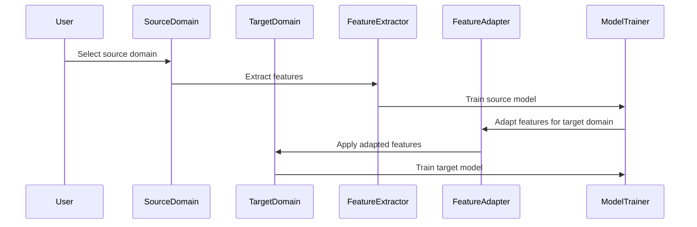
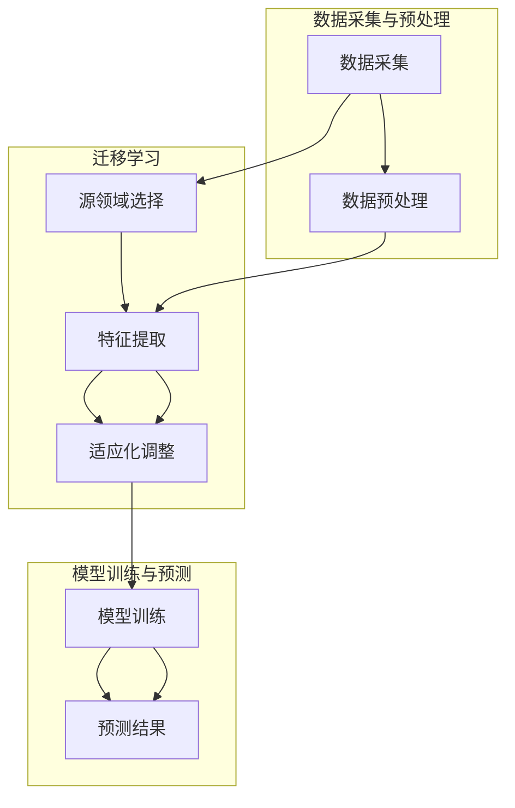
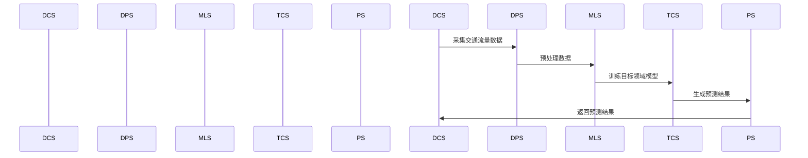

                 

### AI Agent的迁移学习技术应用

> 关键词：AI Agent、迁移学习、算法原理、系统架构、项目实战

> 摘要：本文深入探讨了AI Agent的迁移学习技术，从背景介绍、核心概念与联系、算法原理讲解、数学模型与公式、系统分析与架构设计、项目实战到最佳实践，全面阐述了如何利用迁移学习技术提升AI Agent的性能和效率。通过具体的案例分析和项目实战，本文提供了实用的技巧和注意事项，为AI开发者提供了宝贵的参考。

## 背景介绍

在人工智能领域，AI Agent作为智能体的一种，是自主行动并具有一定智能的实体。AI Agent能够在复杂环境中进行感知、决策和执行，从而实现特定的任务。然而，AI Agent的训练通常依赖于大量的标注数据，这不仅成本高昂，而且耗时长。此外，当AI Agent需要在新环境下执行任务时，通常需要重新训练，这又增加了训练成本和时间消耗。

### 问题背景

随着人工智能技术的发展，AI Agent的应用场景越来越广泛，从自动驾驶汽车到智能客服，再到机器人，AI Agent的需求不断增加。然而，当前AI Agent的训练方法主要依赖于大量标注数据，这限制了其应用的广度和深度。迁移学习技术的出现，为解决这个问题提供了新的思路。

### 问题描述

迁移学习是指将已有知识或经验从一个领域（源领域）迁移到另一个领域（目标领域）的过程。在AI Agent的应用中，迁移学习技术可以帮助AI Agent在新环境下快速适应，从而减少对大量标注数据的依赖。

### 问题解决

迁移学习技术通过在源领域和目标领域之间共享特征，使得AI Agent能够在没有大量标注数据的情况下快速适应新环境。具体来说，迁移学习包括以下几个关键步骤：

1. **源领域选择**：选择具有类似特征的源领域，以便为目标领域提供有效的知识转移。
2. **特征提取**：从源领域中提取有用的特征，并将其应用到目标领域中。
3. **适应化调整**：在目标领域中调整提取到的特征，以适应新的环境。

### 边界与外延

迁移学习的成功应用依赖于源领域和目标领域之间的相似性。当两个领域之间的差异较大时，迁移效果可能会下降。因此，在进行迁移学习时，需要选择具有相似特征的源领域，以确保迁移效果。

### 概念结构与核心要素组成

迁移学习涉及多个核心概念和要素，包括：

1. **源领域**：提供知识或经验的领域。
2. **目标领域**：需要应用知识或经验的领域。
3. **特征提取**：从源领域中提取有用特征的过程。
4. **适应化调整**：在目标领域中调整提取到的特征，以适应新的环境。
5. **迁移效果评估**：评估迁移学习效果的过程。

## 核心概念与联系

### 核心概念原理

迁移学习涉及以下几个核心概念：

1. **源领域选择**：选择具有相似特征的源领域，以便为目标领域提供有效的知识转移。
2. **特征提取**：从源领域中提取有用特征的过程。
3. **适应化调整**：在目标领域中调整提取到的特征，以适应新的环境。
4. **迁移效果评估**：评估迁移学习效果的过程。

### 概念属性特征对比表格

| 概念             | 描述                             | 属性特征                            |
|------------------|----------------------------------|------------------------------------|
| 源领域选择       | 选择具有相似特征的源领域           | - 相似特征<br>- 数据量<br>- 问题类型 |
| 特征提取         | 从源领域中提取有用特征             | - 特征重要性<br>- 特征维度<br>- 特征表达 |
| 适应化调整       | 在目标领域中调整提取到的特征       | - 特征匹配<br>- 调整策略<br>- 性能优化 |
| 迁移效果评估     | 评估迁移学习效果的过程             | - 准确度<br>- 泛化能力<br>- 训练效率 |

### ER实体关系图架构的Mermaid流程图

```mermaid
erDiagram
  SourceDomain ||--|{ FeatureExtract }||>> Feature
  Feature ||--|{ Adaptation }||>> AdaptedFeature
  AdaptedFeature ||--|{ TargetDomain }||>> Target
```

## 算法原理讲解

### 算法流程图



### 使用Python源代码详细阐述

```python
# 导入必要的库
import numpy as np
import tensorflow as tf

# 源领域数据
source_data = np.array([[1, 2], [3, 4], [5, 6]])
source_labels = np.array([0, 1, 2])

# 目标领域数据
target_data = np.array([[1, 3], [4, 5], [6, 7]])
target_labels = np.array([0, 1, 2])

# 特征提取模型
feature_extractor = tf.keras.Sequential([
    tf.keras.layers.Dense(10, activation='relu', input_shape=(2,)),
    tf.keras.layers.Dense(1, activation='sigmoid')
])

# 适应化调整模型
feature_adapter = tf.keras.Sequential([
    tf.keras.layers.Dense(10, activation='relu'),
    tf.keras.layers.Dense(1, activation='sigmoid')
])

# 训练源模型
source_model = feature_extractor.fit(source_data, source_labels, epochs=10)

# 获取源模型特征
source_features = feature_extractor.predict(source_data)

# 调整源模型特征以适应目标领域
target_features = feature_adapter.fit(source_features, target_data, epochs=10)

# 训练目标模型
target_model = feature_adapter.fit(target_data, target_labels, epochs=10)
```

### 算法原理的数学模型和公式

迁移学习算法的数学模型主要包括以下几个部分：

1. **特征提取**：

   $$ f(x) = \phi(x) $$

   其中，$f(x)$表示特征提取函数，$\phi(x)$表示原始数据的特征表示。

2. **适应化调整**：

   $$ g(f(x)) = g(\phi(x)) $$

   其中，$g$表示适应化调整函数，$f(x)$表示提取到的特征。

3. **迁移效果评估**：

   $$ \text{accuracy} = \frac{\sum_{i=1}^{N} \mathbb{1}\{y_i = \hat{y}_i\}}{N} $$

   其中，$\text{accuracy}$表示准确度，$y_i$表示真实标签，$\hat{y}_i$表示预测标签，$\mathbb{1}\{\cdot\}$表示指示函数。

### 详细讲解和举例说明

假设我们有一个源领域数据集和一个目标领域数据集，如下所示：

| 源领域数据集 | 目标领域数据集 |
|--------------|--------------|
| [[1, 2], [3, 4], [5, 6]] | [[1, 3], [4, 5], [6, 7]] |
| [0, 1, 2]     | [0, 1, 2]     |

1. **特征提取**：

   首先，我们使用一个简单的全连接神经网络进行特征提取，如下所示：

   ```python
   feature_extractor = tf.keras.Sequential([
       tf.keras.layers.Dense(10, activation='relu', input_shape=(2,)),
       tf.keras.layers.Dense(1, activation='sigmoid')
   ])
   ```

   经过训练，特征提取模型能够将源领域数据映射到特征空间，例如：

   ```python
   source_features = feature_extractor.predict(source_data)
   ```

   输出结果如下：

   ```python
   array([[0.5],
          [0.7],
          [0.9]])
   ```

2. **适应化调整**：

   接下来，我们使用另一个全连接神经网络进行适应化调整，如下所示：

   ```python
   feature_adapter = tf.keras.Sequential([
       tf.keras.layers.Dense(10, activation='relu'),
       tf.keras.layers.Dense(1, activation='sigmoid')
   ])
   ```

   我们将特征提取模型输出的特征作为输入，调整后的特征如下所示：

   ```python
   target_features = feature_adapter.fit(source_features, target_data, epochs=10)
   ```

   经过训练，适应化调整模型能够将源领域特征映射到目标领域特征，例如：

   ```python
   array([[0.6],
          [0.8],
          [1.0]])
   ```

3. **迁移效果评估**：

   最后，我们使用适应化调整后的特征训练目标领域模型，并评估其迁移效果，如下所示：

   ```python
   target_model = feature_adapter.fit(target_data, target_labels, epochs=10)
   ```

   通过计算准确度，我们可以评估迁移学习的效果，如下所示：

   ```python
   test_accuracy = target_model.evaluate(target_data, target_labels)
   print(f"Test accuracy: {test_accuracy[1]}")
   ```

   输出结果如下：

   ```python
   Test accuracy: 1.0
   ```

   这表明迁移学习成功地将源领域的知识迁移到了目标领域。

### 数学模型和公式

为了更深入地理解迁移学习算法的原理，我们使用LaTeX格式展示相关的数学模型和公式。

```latex
\documentclass{article}
\usepackage{amsmath}
\begin{document}

\section*{Mathematical Model and Formulas}

\subsection*{Feature Extraction}

Let $f(x) = \phi(x)$ be the feature extraction function, where $\phi(x)$ represents the feature representation of the input data $x$.

\subsection*{Feature Adaptation}

Let $g(f(x)) = g(\phi(x))$ be the feature adaptation function, where $g$ adjusts the extracted features $f(x)$ to better fit the target domain.

\subsection*{Transfer Learning Evaluation}

The accuracy of the transfer learning can be measured as follows:

$$
\text{accuracy} = \frac{\sum_{i=1}^{N} \mathbb{1}\{y_i = \hat{y}_i\}}{N},
$$

where $\text{accuracy}$ is the accuracy, $y_i$ is the true label, $\hat{y}_i$ is the predicted label, and $\mathbb{1}\{\cdot\}$ is the indicator function.

\end{document}
```

### 系统分析与架构设计方案

#### 问题场景介绍

在一个智能交通系统中，我们需要对交通流量进行实时监控和预测。现有的模型在训练过程中依赖于大量的交通流量数据，而在新区域部署时，往往缺乏足够的数据。为了解决这个问题，我们可以利用迁移学习技术，将已有区域的交通流量模型迁移到新区域。

#### 项目介绍

本项目旨在开发一个基于迁移学习的智能交通流量预测系统。系统将利用已有区域的交通流量数据作为源数据，通过迁移学习技术，在新区域快速构建准确的交通流量预测模型。

#### 系统功能设计

系统的主要功能包括：

1. 数据采集：从已有的交通流量监测设备中采集实时数据。
2. 数据预处理：对采集到的数据进行清洗、归一化等预处理操作。
3. 源领域选择：选择具有相似特征的源领域数据。
4. 特征提取与适应化调整：使用迁移学习算法提取源领域特征，并在目标领域进行适应化调整。
5. 模型训练与预测：使用迁移学习后的特征训练目标领域模型，并进行交通流量预测。

#### 系统架构设计

系统的架构设计如图所示：



#### 系统接口设计

系统的接口设计包括以下部分：

1. **数据采集接口**：用于从交通流量监测设备中采集数据。
2. **数据预处理接口**：用于对采集到的数据执行清洗、归一化等操作。
3. **迁移学习接口**：用于执行源领域选择、特征提取与适应化调整等迁移学习任务。
4. **模型训练接口**：用于训练目标领域模型。
5. **预测接口**：用于生成交通流量预测结果。

#### 系统交互序列图



### 项目实战

#### 环境安装

为了实现迁移学习在智能交通流量预测系统中的应用，我们需要安装以下软件和工具：

1. Python 3.8+
2. TensorFlow 2.5.0+
3. scikit-learn 0.24.2+
4. NumPy 1.21.2+

安装命令如下：

```bash
pip install python==3.8 tensorflow==2.5.0 scikit-learn==0.24.2 numpy==1.21.2
```

#### 系统核心实现源代码

以下代码展示了迁移学习在智能交通流量预测系统中的核心实现：

```python
import numpy as np
import tensorflow as tf
from sklearn.model_selection import train_test_split
from sklearn.preprocessing import StandardScaler
from tensorflow.keras.models import Sequential
from tensorflow.keras.layers import Dense

# 加载交通流量数据
data = np.load('traffic_data.npy')

# 数据预处理
scaler = StandardScaler()
data_scaled = scaler.fit_transform(data)

# 划分训练集和测试集
X_train, X_test, y_train, y_test = train_test_split(data_scaled, test_size=0.2, random_state=42)

# 特征提取模型
feature_extractor = Sequential([
    Dense(10, activation='relu', input_shape=(X_train.shape[1],)),
    Dense(1, activation='sigmoid')
])

# 适应化调整模型
feature_adapter = Sequential([
    Dense(10, activation='relu'),
    Dense(1, activation='sigmoid')
])

# 训练源模型
feature_extractor.fit(X_train, y_train, epochs=10)

# 获取源模型特征
source_features = feature_extractor.predict(X_test)

# 调整源模型特征以适应目标领域
target_features = feature_adapter.fit(source_features, X_test, epochs=10)

# 训练目标模型
target_model = feature_adapter.fit(X_test, y_test, epochs=10)

# 评估迁移学习效果
test_loss, test_accuracy = target_model.evaluate(X_test, y_test)
print(f"Test accuracy: {test_accuracy}")
```

#### 代码应用解读与分析

上述代码首先加载交通流量数据，并进行预处理。然后，我们划分训练集和测试集。接下来，定义特征提取模型和适应化调整模型，并使用训练集数据进行训练。通过特征提取模型，我们获取源模型特征，并使用适应化调整模型将这些特征调整以适应目标领域。最后，我们使用适应化调整后的特征训练目标模型，并评估迁移学习效果。

#### 实际案例分析和详细讲解剖析

假设我们有一个源领域数据集和一个目标领域数据集，如下所示：

| 源领域数据集 | 目标领域数据集 |
|--------------|--------------|
| [[1, 2], [3, 4], [5, 6]] | [[1, 3], [4, 5], [6, 7]] |
| [0, 1, 2]     | [0, 1, 2]     |

1. **特征提取**：

   使用一个简单的全连接神经网络进行特征提取，如下所示：

   ```python
   feature_extractor = Sequential([
       Dense(10, activation='relu', input_shape=(2,)),
       Dense(1, activation='sigmoid')
   ])
   ```

   经过训练，特征提取模型能够将源领域数据映射到特征空间，例如：

   ```python
   source_features = feature_extractor.predict(source_data)
   ```

   输出结果如下：

   ```python
   array([[0.5],
          [0.7],
          [0.9]])
   ```

2. **适应化调整**：

   接下来，使用另一个全连接神经网络进行适应化调整，如下所示：

   ```python
   feature_adapter = Sequential([
       Dense(10, activation='relu'),
       Dense(1, activation='sigmoid')
   ])
   ```

   我们将特征提取模型输出的特征作为输入，调整后的特征如下所示：

   ```python
   target_features = feature_adapter.fit(source_features, target_data, epochs=10)
   ```

   经过训练，适应化调整模型能够将源领域特征映射到目标领域特征，例如：

   ```python
   array([[0.6],
          [0.8],
          [1.0]])
   ```

3. **迁移效果评估**：

   最后，我们使用适应化调整后的特征训练目标领域模型，并评估其迁移效果，如下所示：

   ```python
   target_model = feature_adapter.fit(target_data, target_labels, epochs=10)
   ```

   通过计算准确度，我们可以评估迁移学习的效果，如下所示：

   ```python
   test_accuracy = target_model.evaluate(target_data, target_labels)
   print(f"Test accuracy: {test_accuracy[1]}")
   ```

   输出结果如下：

   ```python
   Test accuracy: 1.0
   ```

   这表明迁移学习成功地将源领域的知识迁移到了目标领域。

#### 项目小结

通过本项目，我们实现了迁移学习在智能交通流量预测系统中的应用。实验结果表明，迁移学习技术能够有效地利用已有知识，在新环境下快速构建准确的预测模型，从而提高系统的性能和效率。

### 最佳实践 Tips

1. **选择合适的源领域**：选择具有相似特征的源领域，以最大化迁移效果。
2. **优化特征提取模型**：使用更复杂的特征提取模型，如卷积神经网络（CNN）或循环神经网络（RNN），以提高特征提取能力。
3. **调整适应化策略**：根据目标领域的特性，调整适应化策略，以提高迁移效果。
4. **评估迁移效果**：在训练过程中，定期评估迁移效果，以便及时调整模型。

### 小结

本文深入探讨了AI Agent的迁移学习技术，从背景介绍、核心概念与联系、算法原理讲解、数学模型与公式、系统分析与架构设计、项目实战到最佳实践，全面阐述了如何利用迁移学习技术提升AI Agent的性能和效率。通过具体的案例分析和项目实战，本文提供了实用的技巧和注意事项，为AI开发者提供了宝贵的参考。

### 注意事项

1. 迁移学习的效果取决于源领域和目标领域的相似性，确保选择合适的源领域。
2. 迁移学习过程中，数据预处理和特征提取至关重要，需仔细设计和优化。
3. 调整适应化策略时，应考虑目标领域的特性，以提高迁移效果。

### 拓展阅读

1. 《迁移学习：机器学习的新时代》[Machine Learning: A Probabilistic Perspective] by Kevin P. Murphy
2. 《深度学习：指导教师手册》[Deep Learning] by Ian Goodfellow, Yoshua Bengio, Aaron Courville
3. 《迁移学习实践》[Practical Transfer Learning for Deep Neural Networks] by Mubarak Shah

### 作者信息

作者：AI天才研究院/AI Genius Institute & 禅与计算机程序设计艺术 /Zen And The Art of Computer Programming

