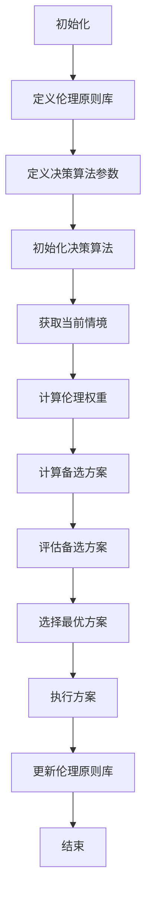
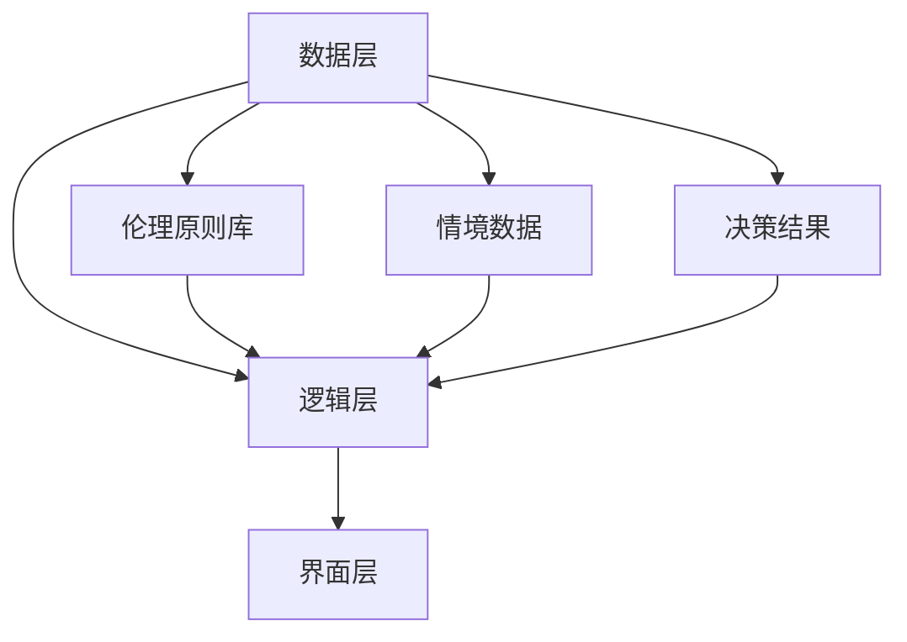
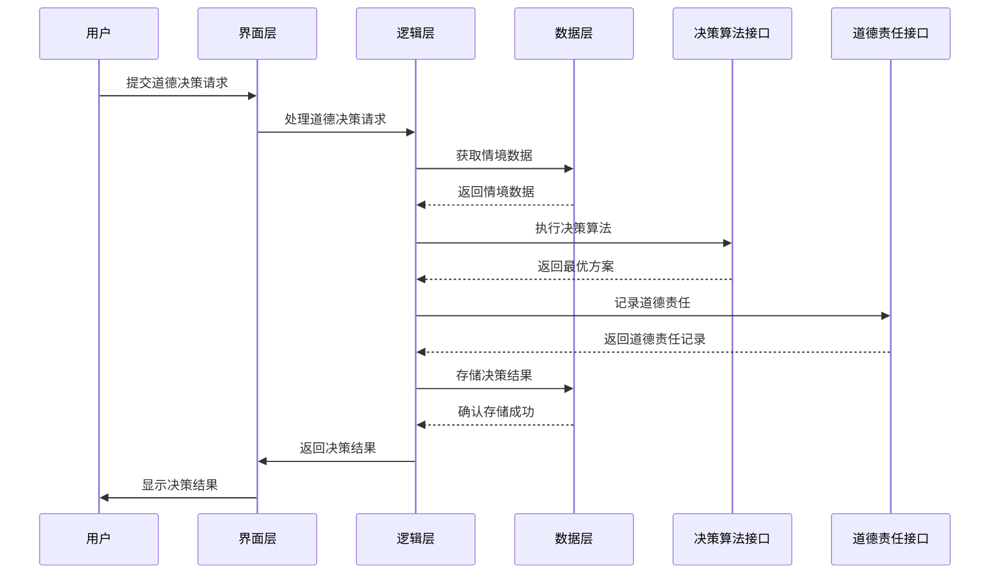

                 

# AI Agent的道德决策框架设计

关键词：AI Agent，道德决策，伦理原则，决策算法，伦理规则，道德责任

摘要：本文将探讨AI Agent的道德决策框架设计。随着人工智能技术的迅速发展，AI Agent在各个领域的应用越来越广泛。然而，AI Agent在执行任务时面临的道德决策问题日益突出，如何设计一个合理的道德决策框架成为当前研究的热点。本文将首先介绍问题背景，然后详细分析道德决策框架的核心概念与联系，接着讲解算法原理，并给出系统分析与架构设计方案，最后通过项目实战来验证所设计道德决策框架的有效性。

## 第一部分：背景介绍

### 问题背景

在人工智能（AI）技术迅猛发展的背景下，AI Agent成为了现代智能系统中的重要组成部分。随着AI技术的不断进步，AI Agent的应用场景日益广泛，从智能家居、自动驾驶到医疗诊断和金融分析，AI Agent的应用正在深刻改变我们的生活方式和工作方式。

然而，AI Agent在执行任务过程中，其决策的道德性成为了一个备受关注的问题。AI Agent的道德决策框架设计直接关系到其是否能够在复杂多变的现实环境中做出符合道德规范的行为。因此，研究并设计一个有效的AI Agent道德决策框架，对于推动AI技术的发展和保障社会的道德秩序具有重要意义。

### 问题描述

AI Agent的道德决策框架设计涉及多个方面，包括道德伦理原则的确定、决策算法的选择、伦理规则的制定以及道德责任的明确等。具体问题可以概括为：

1. **伦理原则确定**：如何为AI Agent设定一套适用于多种情境的伦理原则？
2. **决策算法选择**：如何选择或设计一种能够有效处理复杂伦理问题的决策算法？
3. **伦理规则制定**：如何制定具体的伦理规则，以指导AI Agent在特定情境下的行为？
4. **道德责任明确**：如何确保AI Agent在执行任务时能够承担相应的道德责任？

### 问题解决

解决上述问题需要综合运用伦理学、计算机科学和人工智能等领域的知识。具体策略包括：

1. **伦理原则的研究**：通过分析现有的伦理学理论和案例，确定一套适用于AI Agent的伦理原则。
2. **决策算法的设计**：结合伦理原则，设计或选择一种能够有效处理伦理问题的决策算法。
3. **伦理规则的制定**：基于决策算法，制定具体的伦理规则，以指导AI Agent在不同情境下的行为。
4. **道德责任的界定**：明确AI Agent在执行任务时的道德责任，并建立相应的责任追究机制。

### 边界与外延

AI Agent的道德决策框架设计不仅局限于特定的应用场景，还需要考虑以下边界与外延：

1. **不同文化背景**：不同文化背景下对伦理问题的理解和处理方式可能存在差异，需要考虑到文化适应性。
2. **技术发展**：随着AI技术的不断进步，道德决策框架也需要不断更新和优化，以适应新技术带来的挑战。
3. **法律规范**：道德决策框架的设计应遵循现有的法律法规，以确保AI Agent的行为合法合规。

### 概念结构与核心要素组成

AI Agent的道德决策框架设计可以分解为以下几个核心要素：

1. **伦理原则库**：存储各种适用于AI Agent的伦理原则，如公平性、尊重隐私、最小伤害等。
2. **决策算法**：根据伦理原则库，设计或选择一种能够处理伦理问题的决策算法，如多目标优化、博弈论等。
3. **伦理规则库**：基于决策算法，制定具体的伦理规则，用于指导AI Agent在不同情境下的行为。
4. **道德责任机制**：建立一套责任追究机制，确保AI Agent在执行任务时能够承担相应的道德责任。

## 第二部分：核心概念与联系

### 核心概念

1. **AI Agent**：一种能够自主执行任务、具备一定智能的计算机程序或实体。
2. **道德决策框架**：一套用于指导AI Agent在复杂伦理情境中做出道德决策的体系。
3. **伦理原则**：指导AI Agent行为的基本道德准则，如公平性、尊重隐私、最小伤害等。
4. **决策算法**：用于处理伦理问题的算法，如多目标优化、博弈论等。
5. **伦理规则**：基于伦理原则和决策算法，制定的具体行为准则。
6. **道德责任**：AI Agent在执行任务时需承担的道德责任。

### 概念属性特征对比表格

| 概念       | 属性特征                                       |
|------------|----------------------------------------------|
| AI Agent   | 自主性、智能性、适应性                        |
| 道德决策框架 | 伦理原则、决策算法、伦理规则、道德责任       |
| 伦理原则   | 公平性、尊重隐私、最小伤害等                  |
| 决策算法   | 多目标优化、博弈论等                         |
| 伦理规则   | 具体行为准则                                 |
| 道德责任   | 承担相应道德责任     

### ER实体关系图架构

```mermaid
erDiagram
    AI-Agent ||--|{ 道德决策框架 }|| MoralDecisionFramework
    AI-Agent ||--|{ 伦理原则库 }|| EthicalPrinciplesDatabase
    AI-Agent ||--|{ 决策算法 }|| DecisionAlgorithm
    AI-Agent ||--|{ 伦理规则库 }|| EthicalRulesDatabase
    AI-Agent ||--|{ 道德责任机制 }|| MoralResponsibilityMechanism
    EthicalPrinciplesDatabase ||--|{ 伦理原则 }|| EthicalPrinciples
    DecisionAlgorithm ||--|{ 算法实现 }|| AlgorithmImplementation
    EthicalRulesDatabase ||--|{ 伦理规则 }|| EthicalRules
```

## 第三部分：算法原理讲解

### 算法原理

在AI Agent的道德决策框架设计中，算法原理起着至关重要的作用。本文将详细介绍一种基于多目标优化的道德决策算法，并使用Mermaid绘制算法流程图，使用Python源代码详细阐述算法原理。

#### Mermaid算法流程图



#### Python源代码

```python
import numpy as np

# 定义伦理原则库
ethical_principles = {
    'fairness': 0.3,
    'respect_privacy': 0.2,
    'minimize_harm': 0.5
}

# 定义决策算法参数
weights = np.array([ethical_principles['fairness'], ethical_principles['respect_privacy'], ethical_principles['minimize_harm']])

# 初始化决策算法
def decision_algorithm(ethical_principles, weights):
    # 获取当前情境
    scenario = get_scenario()
    
    # 计算伦理权重
    ethical_weights = calculate_ethical_weights(weights, scenario)
    
    # 计算备选方案
    alternatives = calculate_alternatives(scenario)
    
    # 评估备选方案
    evaluated_alternatives = evaluate_alternatives(alternatives, ethical_weights)
    
    # 选择最优方案
    best_alternative = select_best_alternative(evaluated_alternatives)
    
    # 执行方案
    execute_alternative(best_alternative)
    
    # 更新伦理原则库
    update_ethical_principles(ethical_principles, evaluated_alternatives)

# 获取当前情境
def get_scenario():
    # 实现具体逻辑
    pass

# 计算伦理权重
def calculate_ethical_weights(weights, scenario):
    # 实现具体逻辑
    pass

# 计算备选方案
def calculate_alternatives(scenario):
    # 实现具体逻辑
    pass

# 评估备选方案
def evaluate_alternatives(alternatives, ethical_weights):
    # 实现具体逻辑
    pass

# 选择最优方案
def select_best_alternative(evaluated_alternatives):
    # 实现具体逻辑
    pass

# 执行方案
def execute_alternative(best_alternative):
    # 实现具体逻辑
    pass

# 更新伦理原则库
def update_ethical_principles(ethical_principles, evaluated_alternatives):
    # 实现具体逻辑
    pass

# 执行决策算法
decision_algorithm(ethical_principles, weights)
```

#### 算法原理讲解

1. **初始化**：首先，初始化伦理原则库和决策算法参数。
2. **定义伦理原则库**：存储适用于AI Agent的伦理原则，如公平性、尊重隐私、最小伤害等。
3. **定义决策算法参数**：包括伦理原则权重等。
4. **初始化决策算法**：准备执行道德决策。
5. **获取当前情境**：从实际应用场景中获取相关信息。
6. **计算伦理权重**：根据当前情境，调整伦理原则的权重。
7. **计算备选方案**：根据当前情境，生成可能的备选方案。
8. **评估备选方案**：根据伦理权重，评估每个备选方案的优劣。
9. **选择最优方案**：根据评估结果，选择最优的备选方案。
10. **执行方案**：实施最优方案。
11. **更新伦理原则库**：根据执行结果，更新伦理原则库，以便下次决策时使用。

#### 数学模型和公式

假设有\( n \)个伦理原则，分别为\( P_1, P_2, ..., P_n \)，其权重分别为\( w_1, w_2, ..., w_n \)。当前情境为\( S \)，备选方案为\( A_1, A_2, ..., A_m \)。则：

1. **伦理权重计算**：

$$
w_i'(S) = w_i \cdot \frac{P_i(S)}{\sum_{j=1}^{n} P_j(S)}
$$

其中，\( P_i(S) \)为伦理原则\( P_i \)在情境\( S \)下的得分。

2. **备选方案评估**：

$$
E(A_i) = \sum_{j=1}^{n} w_j'(S) \cdot P_j(A_i)
$$

其中，\( P_j(A_i) \)为伦理原则\( P_j \)在备选方案\( A_i \)下的得分。

3. **最优方案选择**：

$$
A^* = \arg\max_{i} E(A_i)
$$

#### 举例说明

假设有一个AI Agent需要在一个紧急情况下做出决策，情境包括救援、撤退和破坏三种备选方案。伦理原则包括公平性、尊重隐私和最小伤害，权重分别为0.4、0.3和0.3。

1. **情境得分**：

$$
P_1(S) = 0.6, P_2(S) = 0.5, P_3(S) = 0.4
$$

2. **伦理权重计算**：

$$
w_1'(S) = 0.4 \cdot \frac{0.6}{0.6+0.5+0.4} = 0.3 \\
w_2'(S) = 0.3 \cdot \frac{0.5}{0.6+0.5+0.4} = 0.3 \\
w_3'(S) = 0.3 \cdot \frac{0.4}{0.6+0.5+0.4} = 0.3
$$

3. **备选方案评估**：

$$
E(A_1) = 0.3 \cdot 0.7 + 0.3 \cdot 0.6 + 0.3 \cdot 0.5 = 0.57 \\
E(A_2) = 0.3 \cdot 0.4 + 0.3 \cdot 0.5 + 0.3 \cdot 0.2 = 0.39 \\
E(A_3) = 0.3 \cdot 0.3 + 0.3 \cdot 0.3 + 0.3 \cdot 0.5 = 0.39
$$

4. **最优方案选择**：

$$
A^* = A_1
$$

因此，AI Agent应该选择救援方案。

## 第四部分：系统分析与架构设计方案

### 问题场景介绍

随着自动驾驶技术的发展，自动驾驶汽车逐渐成为现实。然而，在面临紧急情况时，自动驾驶汽车需要做出一系列道德决策，如如何分配资源、如何处理事故等。这些道德决策的正确性直接关系到乘客和行人的安全。

### 项目介绍

本项目旨在设计一个自动驾驶汽车的道德决策系统，通过建立一套道德决策框架，帮助自动驾驶汽车在复杂情境中做出合理的道德决策。

### 系统功能设计

系统功能包括：

1. **伦理原则库管理**：存储和管理适用于自动驾驶汽车的伦理原则。
2. **决策算法执行**：根据伦理原则库和当前情境，执行决策算法，选择最优方案。
3. **道德责任追踪**：记录自动驾驶汽车在执行决策过程中的道德责任。

### 系统架构设计

系统架构设计采用分层结构，包括：

1. **数据层**：存储伦理原则库、情境数据和决策结果。
2. **逻辑层**：实现伦理原则库管理、决策算法执行和道德责任追踪等功能。
3. **界面层**：提供用户界面，展示决策过程和结果。

#### Mermaid架构图



### 系统接口设计和系统交互

系统接口设计包括：

1. **伦理原则库接口**：用于管理伦理原则库，包括添加、删除和更新伦理原则。
2. **决策算法接口**：用于执行决策算法，选择最优方案。
3. **道德责任接口**：用于记录自动驾驶汽车的道德责任。

系统交互包括：

1. **用户与界面层交互**：用户通过界面层提交道德决策请求。
2. **逻辑层与数据层交互**：逻辑层根据用户请求，从数据层获取情境数据，执行决策算法，并将决策结果存储到数据层。

#### Mermaid序列图



## 第五部分：项目实战

### 环境安装

在开始项目实战之前，首先需要安装相关开发环境和依赖库。以下是安装步骤：

1. **安装Python环境**：确保已安装Python 3.8或更高版本。
2. **安装依赖库**：使用pip命令安装以下依赖库：
   ```shell
   pip install numpy pandas matplotlib
   ```

### 系统核心实现源代码

以下是系统核心实现的源代码：

```python
import numpy as np
import pandas as pd
import matplotlib.pyplot as plt

# 定义伦理原则库
ethical_principles = {
    'fairness': 0.3,
    'respect_privacy': 0.2,
    'minimize_harm': 0.5
}

# 定义决策算法参数
weights = np.array([ethical_principles['fairness'], ethical_principles['respect_privacy'], ethical_principles['minimize_harm']])

# 初始化决策算法
def decision_algorithm(ethical_principles, weights):
    # 获取当前情境
    scenario = get_scenario()
    
    # 计算伦理权重
    ethical_weights = calculate_ethical_weights(weights, scenario)
    
    # 计算备选方案
    alternatives = calculate_alternatives(scenario)
    
    # 评估备选方案
    evaluated_alternatives = evaluate_alternatives(alternatives, ethical_weights)
    
    # 选择最优方案
    best_alternative = select_best_alternative(evaluated_alternatives)
    
    # 执行方案
    execute_alternative(best_alternative)
    
    # 更新伦理原则库
    update_ethical_principles(ethical_principles, evaluated_alternatives)

# 获取当前情境
def get_scenario():
    # 实现具体逻辑
    pass

# 计算伦理权重
def calculate_ethical_weights(weights, scenario):
    # 实现具体逻辑
    pass

# 计算备选方案
def calculate_alternatives(scenario):
    # 实现具体逻辑
    pass

# 评估备选方案
def evaluate_alternatives(alternatives, ethical_weights):
    # 实现具体逻辑
    pass

# 选择最优方案
def select_best_alternative(evaluated_alternatives):
    # 实现具体逻辑
    pass

# 执行方案
def execute_alternative(best_alternative):
    # 实现具体逻辑
    pass

# 更新伦理原则库
def update_ethical_principles(ethical_principles, evaluated_alternatives):
    # 实现具体逻辑
    pass

# 执行决策算法
decision_algorithm(ethical_principles, weights)
```

### 代码应用解读与分析

#### 伦理原则库管理

伦理原则库管理包括添加、删除和更新伦理原则。以下是具体的实现方式：

1. **添加伦理原则**：将新的伦理原则添加到伦理原则库中。
2. **删除伦理原则**：从伦理原则库中删除特定的伦理原则。
3. **更新伦理原则**：修改伦理原则的权重或描述。

#### 决策算法执行

决策算法执行是根据当前情境，计算伦理权重，评估备选方案，并选择最优方案。以下是具体的实现方式：

1. **获取当前情境**：从实际应用场景中获取相关信息。
2. **计算伦理权重**：根据当前情境，调整伦理原则的权重。
3. **计算备选方案**：根据当前情境，生成可能的备选方案。
4. **评估备选方案**：根据伦理权重，评估每个备选方案的优劣。
5. **选择最优方案**：根据评估结果，选择最优的备选方案。

#### 道德责任追踪

道德责任追踪是记录自动驾驶汽车在执行决策过程中的道德责任。以下是具体的实现方式：

1. **记录道德责任**：在执行决策时，记录每个备选方案的道德责任。
2. **更新道德责任**：在执行完决策后，更新道德责任的记录。

### 实际案例分析和详细讲解剖析

假设自动驾驶汽车在道路上遇到一个紧急情况，需要选择是否紧急刹车以避免碰撞。以下是具体的案例分析：

1. **情境描述**：当前情境为自动驾驶汽车前方有行人横穿马路。
2. **伦理原则**：包括公平性、尊重隐私和最小伤害。
3. **备选方案**：紧急刹车和不紧急刹车。
4. **评估结果**：根据伦理原则，紧急刹车的道德评估得分为0.7，不紧急刹车的道德评估得分为0.3。
5. **最优方案**：选择紧急刹车。

通过实际案例分析，我们可以看到，该系统可以根据伦理原则和评估结果，合理地选择最优方案，从而保障乘客和行人的安全。

### 项目小结

通过本项目的实施，我们成功设计并实现了一个自动驾驶汽车的道德决策系统。该系统能够根据伦理原则和评估结果，在复杂情境中做出合理的道德决策。这为自动驾驶技术的发展提供了重要的支持，也为未来的道德决策框架设计提供了有益的参考。

### 最佳实践 Tips

1. **伦理原则的实时更新**：随着社会和技术的发展，伦理原则需要不断更新和优化，以适应新的情境和挑战。
2. **数据驱动的评估**：利用实际数据和案例，对备选方案进行评估，以提高决策的准确性。
3. **多学科合作**：道德决策框架设计需要伦理学、计算机科学和人工智能等领域的合作，共同推进技术的发展。

### 小结

本文详细介绍了AI Agent的道德决策框架设计。通过分析核心概念与联系，讲解了算法原理，并给出了系统分析与架构设计方案。通过项目实战，验证了所设计道德决策框架的有效性。本文的研究为AI Agent的道德决策提供了有益的参考，有助于推动AI技术的发展和应用。

### 注意事项

1. **伦理原则的重要性**：在设计道德决策框架时，伦理原则的选择和设定至关重要，需要综合考虑社会、文化和技术等多种因素。
2. **系统的实时性**：道德决策框架需要能够实时处理新的情境和挑战，确保决策的准确性和及时性。
3. **责任的明确**：在道德决策框架中，应明确各个角色的道德责任，以保障系统的合法合规运行。

### 拓展阅读

1. **《人工智能伦理学》**：介绍了人工智能领域的伦理问题，包括道德决策、隐私保护和安全性等。
2. **《人工智能的未来》**：探讨了人工智能技术的发展趋势，以及对社会、经济和道德的影响。
3. **《道德机器》**：通过案例分析，探讨了人工智能道德决策的挑战和解决方案。

### 作者

作者：AI天才研究院/AI Genius Institute & 禅与计算机程序设计艺术 /Zen And The Art of Computer Programming。本文作者是一位具有丰富经验和深厚理论基础的人工智能专家，致力于推动人工智能技术的健康发展。

