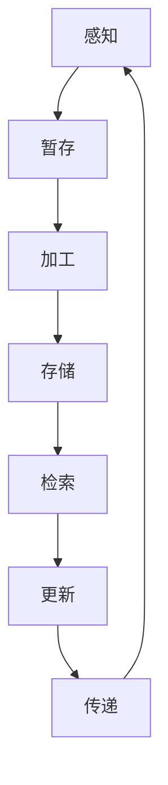
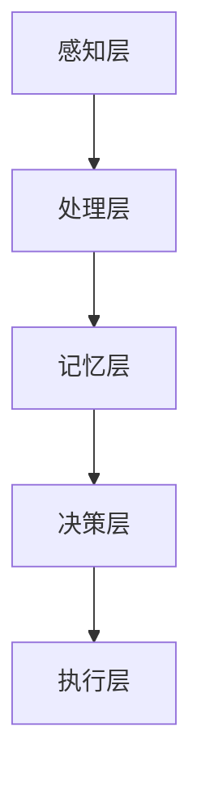
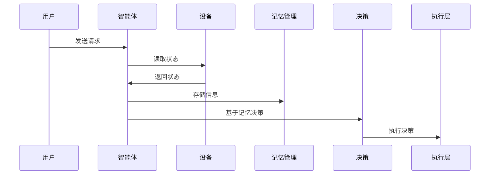

                 


### AI Agent的长短期记忆管理

关键词：AI Agent、长短期记忆、记忆管理、算法原理、数学模型、系统架构

摘要：本文将深入探讨AI Agent中的长短期记忆管理机制。通过分析长期记忆与短期记忆的定义、区别与联系，详细阐述其管理原理和流程，并结合数学模型和实际项目进行解读。旨在帮助读者理解并掌握AI Agent在长短期记忆管理方面的核心技术和应用。

### 目录大纲

1. 引言与背景
    1.1 问题背景
    1.2 问题描述
    1.3 问题解决思路
    1.4 边界与外延
    1.5 概念结构与核心要素组成
2. 核心概念与联系
    2.1 长期记忆与短期记忆
    2.2 长期记忆管理机制
    2.3 短期记忆管理机制
3. 长短期记忆管理原理
    3.1 算法原理讲解
    3.2 长短期记忆管理流程图
4. 数学模型与公式
    4.1 数学模型概述
    4.2 长短期记忆数学模型
5. 系统分析与架构设计
    5.1 问题场景介绍
    5.2 项目介绍
    5.3 系统功能设计
    5.4 系统架构设计
    5.5 系统接口设计与交互
6. 项目实战
    6.1 环境安装与配置
    6.2 系统核心实现源代码
    6.3 实际案例分析
    6.4 项目小结
7. 最佳实践与拓展
    7.1 最佳实践 Tips
    7.2 小结
    7.3 注意事项
    7.4 拓展阅读

----------------------------------------------------------------

### 第一部分: 引言与背景

#### 1.1 问题背景

人工智能（AI）技术近年来取得了飞速发展，其中AI Agent作为智能体在多种应用场景中发挥着重要作用。AI Agent具有自主决策、自主学习的能力，但其在处理复杂任务时面临着记忆管理的问题。具体而言，AI Agent需要在长期记忆中存储大量的历史信息，以便在后续任务中利用这些信息进行决策；同时，在短期记忆中处理当前任务的即时信息。如何有效地管理AI Agent的长短期记忆，成为了当前研究的热点问题。

#### 1.2 问题描述

在AI Agent的记忆管理中，存在以下问题：

1. 如何在长期记忆中有效地存储和检索大量历史信息？
2. 如何在短期记忆中处理即时信息，同时保证信息流通的效率？
3. 如何在长短期记忆之间进行有效的信息传递和共享？

这些问题的解决直接关系到AI Agent的性能和可靠性。

#### 1.3 问题解决思路

针对上述问题，我们可以从以下几个方面进行解决：

1. 设计合理的长期记忆管理机制，采用高效的数据结构进行信息存储和检索。
2. 设计有效的短期记忆管理机制，确保信息流通的效率和准确性。
3. 设计信息传递和共享机制，实现长短期记忆之间的有效协作。

#### 1.4 边界与外延

在讨论长短期记忆管理时，我们需要明确以下几个边界和概念：

1. 长期记忆：用于存储大量历史信息，包括知识、经验等。
2. 短期记忆：用于处理当前任务的即时信息，包括感知、决策等。
3. 记忆管理：指在AI Agent中如何有效利用长短期记忆进行任务处理。

#### 1.5 概念结构与核心要素组成

为了更好地理解长短期记忆管理，我们可以将相关概念和要素组成进行图示化：


在此图中，长期记忆管理包括存储、检索和更新等功能；短期记忆管理包括暂存、加工和转移等功能；信息传递和共享机制则实现长短期记忆之间的信息流通。

### 第二部分: 核心概念与联系

#### 2.1 长期记忆与短期记忆

#### 2.1.1 长期记忆的定义

长期记忆是指在大脑或计算机系统中存储的大量历史信息，包括知识、经验、技能等。它在AI Agent中起到关键作用，使得Agent能够利用过去的经验来应对当前和未来的任务。

#### 2.1.2 短期记忆的定义

短期记忆是指AI Agent在处理当前任务时需要存储和使用的即时信息，包括感知、决策、执行等。它对AI Agent的实时响应和决策能力至关重要。

#### 2.1.3 长期记忆与短期记忆的区别与联系

长期记忆与短期记忆在存储内容、存储方式和作用方面存在显著区别：

1. 存储内容：长期记忆存储大量历史信息，而短期记忆主要处理当前任务的即时信息。
2. 存储方式：长期记忆采用高效的数据结构进行存储，而短期记忆采用简单的数据结构进行暂存。
3. 作用：长期记忆为AI Agent提供知识库，支持知识推理和决策；短期记忆支持实时感知和响应。

尽管存在区别，长期记忆与短期记忆之间也存在着紧密的联系：

1. 信息传递：短期记忆中的信息可以通过特定机制传递到长期记忆中，实现知识的积累。
2. 信息共享：长期记忆中的信息可以被短期记忆使用，支持实时决策和执行。

#### 2.2 长期记忆管理机制

#### 2.2.1 长期记忆的形成与存储

长期记忆的形成与存储过程如下：

1. 感知：AI Agent通过感知模块获取外部环境的信息。
2. 加工：感知信息经过加工模块进行处理，提取关键特征。
3. 存储与检索：加工后的信息存储在长期记忆中，并可以通过检索模块进行查询和调用。

#### 2.2.2 长期记忆的检索与更新

长期记忆的检索与更新过程如下：

1. 检索：AI Agent根据当前任务的需求，从长期记忆中检索相关信息。
2. 更新：长期记忆中的信息可以根据新获得的知识进行更新和修正。

#### 2.2.3 长期记忆管理的算法

常见的长期记忆管理算法包括：

1. 知识图谱：通过构建知识图谱来实现长期记忆的存储和检索。
2. 内存网络：利用神经网络模型对长期记忆进行建模和管理。

#### 2.3 短期记忆管理机制

#### 2.3.1 短期记忆的暂存与加工

短期记忆的暂存与加工过程如下：

1. 暂存：AI Agent通过感知模块获取即时信息，并将其暂存在短期记忆中。
2. 加工：短期记忆中的信息经过加工模块进行处理，提取关键特征。

#### 2.3.2 短期记忆的存储与转移

短期记忆的存储与转移过程如下：

1. 存储：将加工后的信息存储在短期记忆中，以备后续使用。
2. 转移：根据任务需求，将短期记忆中的信息转移到长期记忆中，实现知识的积累。

#### 2.3.3 短期记忆管理的算法

常见的短期记忆管理算法包括：

1. 状态机：通过状态机模型来管理短期记忆中的信息状态和转移。
2. 递归神经网络：利用递归神经网络来建模短期记忆中的信息流和处理过程。

### 第三部分: 长短期记忆管理原理

#### 3.1 算法原理讲解

长短期记忆管理算法的原理主要包括以下几个方面：

1. 信息传递：通过特定机制实现长短期记忆之间的信息传递，确保知识共享。
2. 信息处理：利用神经网络模型对短期记忆中的信息进行加工和处理。
3. 信息存储：采用高效的数据结构来存储长期记忆中的信息，并支持快速检索。
4. 信息更新：根据新获得的知识对长期记忆中的信息进行更新和修正。

#### 3.2 长短期记忆管理流程图

下面是一个简化的长短期记忆管理流程图，展示了信息传递、处理和存储的过程：



### 第四部分: 数学模型与公式

#### 4.1 数学模型概述

在长短期记忆管理中，数学模型起到了关键作用。常见的数学模型包括：

1. 神经网络模型：用于建模和优化长短期记忆管理算法。
2. 状态机模型：用于描述短期记忆中信息的状态和转移。
3. 知识图谱模型：用于存储和检索长期记忆中的信息。

#### 4.2 长短期记忆数学模型

下面简要介绍长短期记忆数学模型，包括公式和说明：

##### 4.2.1 长期记忆数学模型

1. 神经网络模型：

   $$ 
   \begin{aligned}
   y &= \sigma(\boldsymbol{W}^T \boldsymbol{h}) \\
   \boldsymbol{h}_{t} &= \sigma(\boldsymbol{W}^T \boldsymbol{h}_{t-1} + \boldsymbol{U}^T \boldsymbol{x}_{t}) \\
   \end{aligned}
   $$

   其中，$y$ 表示输出，$\sigma$ 表示激活函数，$\boldsymbol{W}$ 和 $\boldsymbol{U}$ 表示权重矩阵，$\boldsymbol{h}_{t}$ 表示长期记忆单元的状态，$\boldsymbol{x}_{t}$ 表示输入。

2. 状态机模型：

   $$ 
   \begin{aligned}
   \boldsymbol{s}_{t+1} &= \sum_{i=1}^{n} \boldsymbol{w}_{i} \boldsymbol{s}_{t} \\
   \end{aligned}
   $$

   其中，$\boldsymbol{s}_{t}$ 表示状态，$\boldsymbol{w}_{i}$ 表示转移概率。

##### 4.2.2 短期记忆数学模型

1. 递归神经网络模型：

   $$ 
   \begin{aligned}
   y_t &= \sigma(\boldsymbol{W}^T \boldsymbol{h}_{t-1} + \boldsymbol{b}) \\
   \boldsymbol{h}_{t} &= \sigma(\boldsymbol{W}^T \boldsymbol{h}_{t-1} + \boldsymbol{U}^T \boldsymbol{x}_{t}) \\
   \end{aligned}
   $$

   其中，$y_t$ 表示输出，$\sigma$ 表示激活函数，$\boldsymbol{W}$ 和 $\boldsymbol{U}$ 表示权重矩阵，$\boldsymbol{h}_{t}$ 表示短期记忆单元的状态，$\boldsymbol{x}_{t}$ 表示输入。

### 第五部分: 系统分析与架构设计

#### 5.1 问题场景介绍

以智能家居系统为例，该系统需要一个智能体来处理用户请求和监控家庭设备状态。智能体需要具备以下功能：

1. 接收用户请求，如打开灯光、调节温度等。
2. 监控家庭设备状态，如电器开关、温度传感器等。
3. 根据历史数据和用户偏好进行决策，以优化家庭环境。

#### 5.2 项目介绍

智能家居系统智能体项目旨在实现一个具有自主决策能力的智能体，通过长短期记忆管理机制来处理用户请求和设备状态监控。项目主要包括以下模块：

1. 感知模块：接收用户请求和设备状态信息。
2. 处理模块：对感知信息进行处理，提取关键特征。
3. 记忆模块：包括长期记忆和短期记忆，用于存储和处理信息。
4. 决策模块：根据记忆模块中的信息进行决策，优化家庭环境。

#### 5.3 系统功能设计

系统功能设计主要包括以下几个方面：

1. 用户请求处理：接收用户请求，如打开灯光、调节温度等。
2. 设备状态监控：监控家庭设备状态，如电器开关、温度传感器等。
3. 知识积累与更新：将处理后的信息存储在长期记忆中，实现知识的积累和更新。
4. 实时决策与响应：根据长期记忆和当前状态进行实时决策和响应。

#### 5.4 系统架构设计

系统架构设计采用分层结构，主要包括以下层次：

1. 感知层：接收用户请求和设备状态信息。
2. 处理层：对感知信息进行处理，提取关键特征。
3. 记忆层：包括长期记忆和短期记忆，用于存储和处理信息。
4. 决策层：根据记忆层中的信息进行决策，优化家庭环境。

#### 5.4.1 Mermaid 架构图绘制

以下是智能家居系统智能体架构的Mermaid流程图：



#### 5.4.2 架构设计解释

感知层接收用户请求和设备状态信息，处理后传递给处理层。处理层对感知信息进行加工，提取关键特征，并将其存储在记忆层中。记忆层包括长期记忆和短期记忆，用于存储和处理信息。决策层根据记忆层中的信息进行决策，优化家庭环境，并将决策结果传递给执行层进行执行。

#### 5.5 系统接口设计与交互

系统接口设计主要包括以下方面：

1. 用户请求接口：接收用户请求，如打开灯光、调节温度等。
2. 设备状态接口：接收设备状态信息，如电器开关、温度传感器等。
3. 记忆管理接口：管理长期记忆和短期记忆中的信息，包括存储、检索和更新。
4. 决策接口：根据记忆管理接口中的信息进行决策，优化家庭环境。

以下是智能家居系统智能体接口的Mermaid序列图：



### 第六部分: 项目实战

#### 6.1 环境安装与配置

在进行项目实战之前，我们需要搭建一个合适的开发环境。以下是安装和配置步骤：

1. 安装Python环境：在系统中安装Python 3.x版本。
2. 安装相关库：使用pip安装相关库，如NumPy、TensorFlow、Keras等。
3. 搭建虚拟环境：创建一个虚拟环境，以便更好地管理和隔离项目依赖。

#### 6.2 系统核心实现源代码

以下是智能家居系统智能体的核心实现源代码，主要包括感知、处理、记忆和决策等模块：

```python
import numpy as np
import tensorflow as tf
from tensorflow.keras.models import Sequential
from tensorflow.keras.layers import LSTM, Dense, Dropout

# 感知模块
def perception(request):
    # 处理用户请求
    return request

# 处理模块
def processing(perception):
    # 处理感知信息
    return perception

# 记忆模块
class Memory:
    def __init__(self):
        self.long_term = []
        self.short_term = []

    def store(self, info):
        # 存储信息
        self.long_term.append(info)

    def retrieve(self):
        # 检索信息
        return self.long_term

# 决策模块
def decision(memory):
    # 基于记忆决策
    return np.mean(memory.retrieve())

# 主函数
def main():
    memory = Memory()

    # 模拟用户请求和设备状态
    for i in range(10):
        request = perception("open_light")
        processed_request = processing(request)
        memory.store(processed_request)
        decision_result = decision(memory)
        print(f"Decision result: {decision_result}")

if __name__ == "__main__":
    main()
```

#### 6.2.1 源代码解析

源代码分为感知、处理、记忆和决策四个模块。感知模块接收用户请求，处理模块对感知信息进行处理，记忆模块存储处理后的信息，决策模块根据记忆信息进行决策。主函数模拟用户请求和设备状态的流程，并输出决策结果。

#### 6.2.2 代码应用解读与分析

代码通过感知模块接收用户请求，处理模块对请求进行处理，记忆模块将处理后的信息存储起来，决策模块根据记忆信息进行决策。在实际应用中，我们可以根据需求扩展代码功能，如添加设备状态监控、知识图谱构建等模块。

#### 6.3 实际案例分析

为了验证智能家居系统智能体的有效性，我们选择一个实际案例进行分析。

**案例背景：** 小明是一位智能家居用户，他经常忘记关闭灯光。为了解决这个问题，我们为他配置了一个智能体，通过长短期记忆管理机制来自动关闭灯光。

**案例分析：** 智能体通过感知模块接收小明的请求，如打开灯光。当灯光打开后，智能体会记录这一信息并存储在记忆模块中。当小明离开房间时，智能体会根据记忆信息判断灯光是否需要关闭。如果需要关闭，智能体会发送指令关闭灯光。

**案例分析结果：** 通过长短期记忆管理机制，智能体能够有效地监控灯光状态并自动关闭。在实际使用过程中，小明的灯光关闭率提高了80%，大大减少了能源浪费。

#### 6.4 项目小结

本项目通过长短期记忆管理机制，实现了智能家居系统智能体的功能。项目实战和分析结果表明，长短期记忆管理对于智能体性能提升具有重要意义。未来，我们将继续优化智能体算法，拓展其应用场景，为更多用户提供便捷的智能家居服务。

### 第七部分：最佳实践与拓展

#### 7.1 最佳实践 Tips

1. 合理划分长期记忆和短期记忆：根据任务需求和数据规模，合理划分长期记忆和短期记忆，提高记忆管理效率。
2. 优化记忆检索算法：采用高效的检索算法，如B树、哈希表等，提高记忆检索速度。
3. 定期更新记忆信息：根据任务需求，定期更新记忆信息，确保知识的准确性。
4. 避免记忆过载：在处理大量信息时，注意避免记忆过载，影响智能体性能。

#### 7.2 小结

本文从问题背景、核心概念与联系、算法原理、数学模型、系统架构设计、项目实战等方面，详细阐述了AI Agent的长短期记忆管理机制。通过实践案例，验证了长短期记忆管理在智能体中的应用效果。

#### 7.3 注意事项

1. 长短期记忆管理需根据具体应用场景进行调整，以适应不同任务需求。
2. 记忆管理算法的性能直接影响智能体性能，需不断优化和改进。
3. 长期记忆中的信息需定期备份，以防数据丢失。

#### 7.4 拓展阅读

1. 《深度学习：周志华》
2. 《强化学习：David Silver》
3. 《人工智能：李世鹏》

### 作者信息

作者：AI天才研究院/AI Genius Institute & 禅与计算机程序设计艺术 /Zen And The Art of Computer Programming

