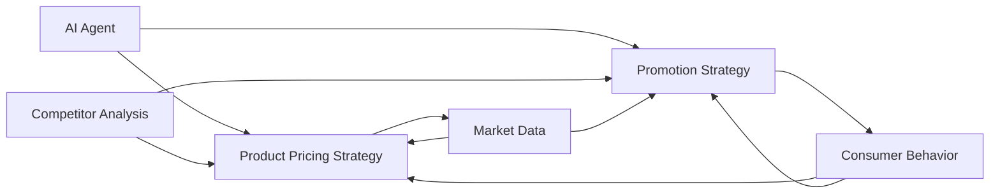
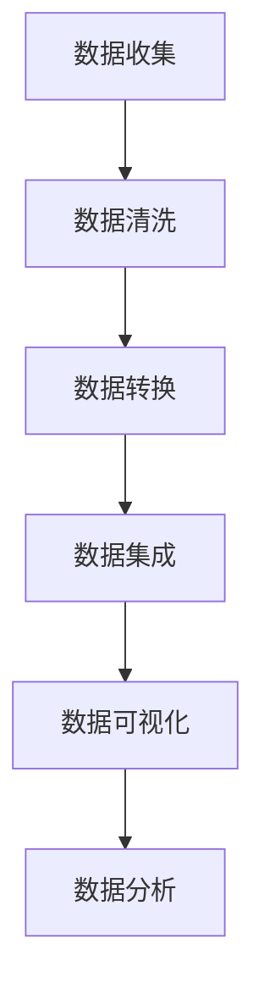
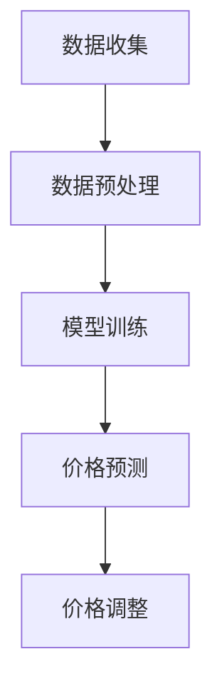
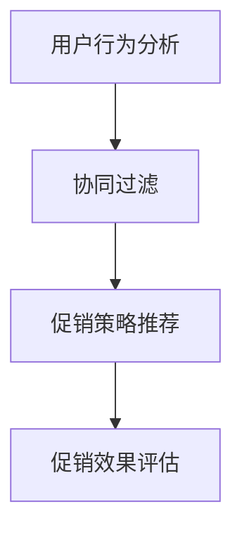
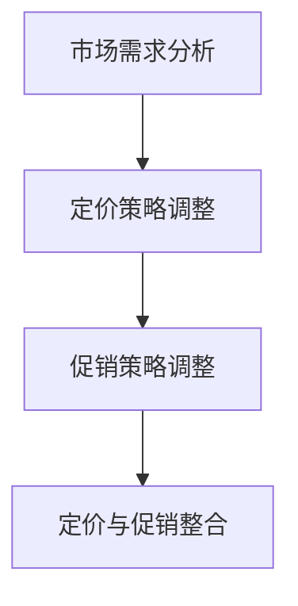
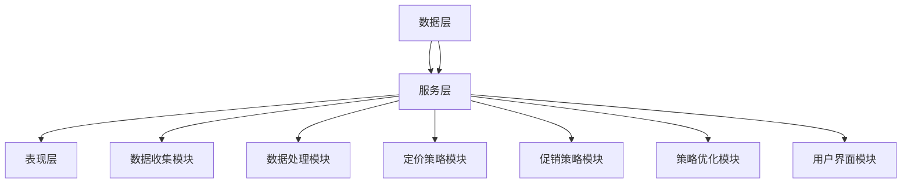
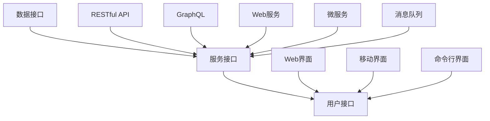
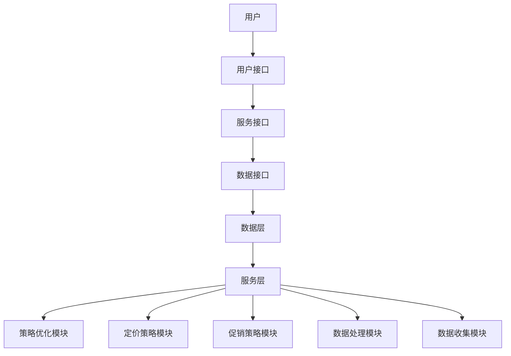

                 

# AI Agent辅助企业产品定价与促销策略制定

## 关键词

- AI Agent
- 产品定价策略
- 促销策略
- 算法原理
- 数学模型
- 系统架构设计
- 项目实战

## 摘要

本文旨在探讨AI Agent在辅助企业产品定价与促销策略制定中的应用。首先，我们将介绍AI Agent的基本概念、定义和应用领域。接着，我们将分析企业产品定价与促销策略的背景，探讨传统方法的局限性，并阐述AI Agent在此领域中的作用。随后，我们将详细讲解AI Agent在产品定价策略和促销策略中的应用算法原理，包括数学模型和公式，并使用Python代码进行阐述。在此基础上，我们将介绍系统分析与架构设计方案，包括问题场景、功能设计、架构设计和接口设计。接下来，我们将通过项目实战，展示如何将AI Agent应用于企业产品定价与促销策略的实际操作，并提供最佳实践 tips。最后，我们将总结全文，并提出未来研究方向和拓展阅读建议。

---

# 引言与背景

## 1.1 AI Agent的定义与应用

AI Agent，即人工智能代理，是一种具有智能行为、能够自主决策和执行任务的系统。它可以在复杂环境中与人类或其他系统进行交互，以实现特定目标。AI Agent的基本概念可以追溯到代理理论（Agent Theory），该理论源于人工智能和认知科学领域。代理通常被视为具有独立性和自主性，能够感知环境、制定策略并采取行动的实体。

### 1.1.1 AI Agent的概念解析

AI Agent通常具有以下核心特征：

1. **自主性（Autonomy）**：AI Agent能够在没有人类干预的情况下自主行动。
2. **社会性（Sociality）**：AI Agent能够与其他代理或人类进行交互。
3. **反应性（Reactivity）**：AI Agent能够实时响应环境变化。
4. **预动性（Pro-Activity）**：AI Agent能够预测环境变化，并采取主动行动。
5. **适应性（Adaptability）**：AI Agent能够根据环境变化调整其行为。

### 1.1.2 AI Agent的核心特点

AI Agent的核心特点包括：

1. **智能决策**：基于数据分析和机器学习模型，AI Agent能够做出明智的决策。
2. **实时学习**：AI Agent能够从经验中学习，并不断优化其行为。
3. **自动化执行**：AI Agent能够自动执行复杂的任务，减轻人力负担。
4. **个性化服务**：AI Agent能够根据用户需求提供个性化的服务。

### 1.1.3 AI Agent的应用领域

AI Agent在多个领域具有广泛的应用，包括但不限于：

1. **客户服务**：通过聊天机器人提供24/7的客户支持。
2. **供应链管理**：优化库存管理和物流调度。
3. **金融交易**：自动化交易决策和风险控制。
4. **医疗诊断**：辅助医生进行疾病诊断和治疗建议。
5. **智能家居**：实现家庭设备的自动化控制和优化。

## 1.2 企业产品定价与促销策略的背景

企业产品定价和促销策略是企业盈利的关键环节。传统的定价和促销策略主要依赖于市场调研、历史数据和经验判断。然而，随着市场环境的复杂化和竞争的加剧，传统方法越来越难以满足企业的需求。在这种情况下，AI Agent的应用成为了一种新的选择。

### 1.2.1 传统定价与促销策略的局限性

传统定价和促销策略的局限性主要体现在以下几个方面：

1. **数据依赖性**：传统方法依赖于历史数据和经验，但数据质量往往无法保证。
2. **决策滞后性**：传统方法需要较长时间来收集和分析数据，导致决策滞后。
3. **反应迟缓性**：传统方法难以应对市场的快速变化，导致反应迟缓。
4. **个性化不足**：传统方法难以根据不同用户的需求进行个性化定价和促销。

### 1.2.2 AI Agent在定价与促销策略中的作用

AI Agent在定价与促销策略中的作用主要体现在以下几个方面：

1. **数据驱动决策**：AI Agent能够通过实时数据分析和预测，为企业提供更加准确的定价和促销策略。
2. **实时反馈与优化**：AI Agent能够实时收集用户反馈，并根据反馈进行调整和优化。
3. **个性化服务**：AI Agent能够根据用户行为和偏好提供个性化的定价和促销方案。
4. **自动化执行**：AI Agent能够自动化执行复杂的定价和促销任务，提高效率和准确性。

### 1.2.3 研究意义与目标

研究AI Agent辅助企业产品定价与促销策略制定的意义在于：

1. **提升企业竞争力**：通过AI Agent，企业能够更加准确地制定定价和促销策略，提高市场竞争力。
2. **降低运营成本**：AI Agent能够自动化执行复杂的任务，降低人力成本和运营成本。
3. **提升用户体验**：通过个性化定价和促销方案，提升用户满意度和忠诚度。

本文的研究目标包括：

1. **理解AI Agent在定价与促销策略中的应用原理**：通过理论分析和案例分析，深入理解AI Agent在定价与促销策略中的应用原理。
2. **开发有效的AI定价与促销算法**：基于数据挖掘和机器学习技术，开发有效的AI定价与促销算法，为企业提供实际操作指南。
3. **评估AI定价与促销策略的效果**：通过实验和案例分析，评估AI定价与促销策略的实际效果，为企业提供决策依据。

## 1.3 AI Agent在产品定价策略中的应用

产品定价策略是企业在市场竞争中取得成功的关键因素之一。传统定价策略主要依赖于市场调研、竞争分析和历史数据。然而，这些方法往往难以应对市场的快速变化和复杂环境。AI Agent的出现为产品定价策略带来了新的可能。

### 1.3.1 数据分析与市场调研

在产品定价策略中，数据分析和市场调研是关键步骤。AI Agent能够通过以下方式提升数据分析和市场调研的效率：

1. **实时数据采集**：AI Agent能够实时采集市场数据，包括竞争对手的定价策略、消费者行为和市场需求等。
2. **数据预处理**：AI Agent能够自动处理大量数据，包括数据清洗、数据转换和数据集成等。
3. **数据可视化**：AI Agent能够通过数据可视化技术，将复杂的数据转化为直观的图表和报告，帮助企业更好地理解市场趋势和消费者需求。

### 1.3.2 定价模型与算法原理

AI Agent在产品定价策略中的应用主要依赖于以下几种定价模型和算法：

1. **基于需求的定价模型**：这种模型根据市场需求和消费者行为，动态调整产品价格。例如，使用线性回归、决策树和神经网络等机器学习算法，预测市场需求并制定最优定价策略。
2. **基于竞争的定价模型**：这种模型根据竞争对手的定价策略和市场反应，制定相应的定价策略。例如，使用马尔可夫决策过程（MDP）和博弈论等方法，分析竞争对手的行为和市场反应，制定具有竞争力的定价策略。
3. **基于成本加成的定价模型**：这种模型根据产品成本和目标利润，制定产品价格。例如，使用成本加成法、边际成本法和盈亏平衡法等，确定产品的合理定价。

### 1.3.3 定价策略制定与优化

AI Agent在产品定价策略的制定和优化过程中，能够发挥以下作用：

1. **自动化定价策略制定**：AI Agent能够根据市场数据、消费者行为和竞争对手策略，自动制定定价策略。例如，使用基于机器学习的定价算法，自动调整产品价格，以满足市场需求和实现目标利润。
2. **实时定价策略优化**：AI Agent能够实时收集市场反馈，并根据反馈对定价策略进行调整和优化。例如，使用在线学习技术，不断更新和优化定价策略，以应对市场的变化。
3. **个性化定价策略**：AI Agent能够根据消费者的个性化需求和偏好，制定个性化的定价策略。例如，使用协同过滤和推荐系统技术，为不同消费者提供不同的定价方案，提高消费者满意度和忠诚度。

## 1.4 AI Agent在产品促销策略中的应用

产品促销策略是企业在市场竞争中吸引消费者、提升销售的重要手段。传统的促销策略主要依赖于广告投放、促销活动和销售渠道等。然而，这些方法往往难以实现精准营销和最大化效果。AI Agent的应用为产品促销策略带来了新的机遇。

### 1.4.1 促销策略的类型与选择

促销策略可以分为以下几种类型：

1. **价格促销**：通过降低产品价格或提供折扣来吸引消费者。
2. **服务促销**：通过提供额外的服务或优惠来吸引消费者，例如延长保修期、提供免费送货等。
3. **赠品促销**：通过赠送小礼品或样品来吸引消费者。
4. **捆绑促销**：将多个产品捆绑在一起销售，以降低消费者的购买成本。
5. **体验促销**：通过提供试用品或体验活动来吸引消费者。

AI Agent在制定促销策略时，可以根据以下原则进行选择：

1. **消费者需求分析**：AI Agent能够通过分析消费者行为和偏好，了解他们的需求，从而制定个性化的促销策略。
2. **市场数据分析**：AI Agent能够实时收集市场数据，分析竞争对手的促销策略和市场反应，从而制定具有竞争力的促销策略。
3. **成本效益分析**：AI Agent能够根据企业的成本和预算，制定具有成本效益的促销策略。

### 1.4.2 促销模型与算法原理

AI Agent在产品促销策略中的应用主要依赖于以下促销模型和算法：

1. **基于需求的促销模型**：这种模型根据市场需求和消费者行为，动态调整促销策略。例如，使用线性回归、决策树和神经网络等机器学习算法，预测市场需求并制定最优促销策略。
2. **基于竞争的促销模型**：这种模型根据竞争对手的促销策略和市场反应，制定相应的促销策略。例如，使用马尔可夫决策过程（MDP）和博弈论等方法，分析竞争对手的行为和市场反应，制定具有竞争力的促销策略。
3. **基于效果的促销模型**：这种模型根据促销活动的效果，实时调整促销策略。例如，使用A/B测试和在线优化技术，测试不同促销策略的效果，并自动调整策略以实现最佳效果。

### 1.4.3 促销策略制定与优化

AI Agent在促销策略的制定和优化过程中，能够发挥以下作用：

1. **自动化促销策略制定**：AI Agent能够根据市场数据、消费者行为和竞争对手策略，自动制定促销策略。例如，使用基于机器学习的促销算法，自动调整促销策略，以满足市场需求和实现目标销售。
2. **实时促销策略优化**：AI Agent能够实时收集市场反馈，并根据反馈对促销策略进行调整和优化。例如，使用在线学习技术，不断更新和优化促销策略，以应对市场的变化。
3. **个性化促销策略**：AI Agent能够根据消费者的个性化需求和偏好，制定个性化的促销策略。例如，使用协同过滤和推荐系统技术，为不同消费者提供不同的促销方案，提高消费者满意度和忠诚度。

## 1.5 小结

本文介绍了AI Agent的基本概念、定义和应用领域，以及AI Agent在产品定价和促销策略中的应用。通过分析AI Agent的核心特点和应用优势，我们认识到AI Agent在数据驱动决策、实时反馈与优化、个性化服务等方面的独特优势。在产品定价策略方面，AI Agent能够通过数据分析、定价模型和算法原理，为企业提供科学、精确的定价策略。在促销策略方面，AI Agent能够通过市场数据分析、促销模型和算法原理，为企业制定具有竞争力的促销策略。未来，AI Agent在产品定价和促销策略中的应用将更加广泛和深入，为企业带来更多的机遇和挑战。

---

# 核心概念与联系

在深入探讨AI Agent辅助企业产品定价与促销策略制定之前，我们需要明确一些核心概念，并了解它们之间的联系。以下是对这些概念的定义、属性特征对比以及ER实体关系图的介绍。

## 2.1 AI Agent的基本概念

### 2.1.1 智能代理的定义

AI Agent，即人工智能代理，是一种具有智能行为、能够自主决策和执行任务的系统。它可以在复杂环境中与人类或其他系统进行交互，以实现特定目标。

### 2.1.2 智能代理的核心特征

1. **自主性**：AI Agent能够在没有人类干预的情况下自主行动。
2. **社会性**：AI Agent能够与其他代理或人类进行交互。
3. **反应性**：AI Agent能够实时响应环境变化。
4. **预动性**：AI Agent能够预测环境变化，并采取主动行动。
5. **适应性**：AI Agent能够根据环境变化调整其行为。

### 2.1.3 智能代理的分类

AI Agent可以分为以下几类：

1. **基于规则的代理**：使用预定义的规则进行决策和行动。
2. **基于模型的代理**：使用预测模型和决策算法进行决策和行动。
3. **基于学习的代理**：通过机器学习和深度学习模型进行决策和行动。

### 2.1.4 智能代理的工作原理

AI Agent的工作原理主要包括以下几个步骤：

1. **感知**：通过传感器或数据接口收集环境信息。
2. **理解**：使用自然语言处理、图像识别等技术理解环境信息。
3. **决策**：使用机器学习、深度学习等技术进行决策。
4. **行动**：根据决策结果执行行动。

## 2.2 企业产品定价策略的相关概念

### 2.2.1 产品定价的基本原理

产品定价的基本原理包括以下几个方面：

1. **成本导向定价**：基于产品成本制定价格，包括固定成本和变动成本。
2. **需求导向定价**：基于市场需求和消费者支付意愿制定价格。
3. **竞争导向定价**：基于竞争对手的价格水平制定价格。

### 2.2.2 定价策略的类型与选择

企业可以选择以下几种定价策略：

1. **固定定价策略**：产品价格保持不变，适用于需求稳定的市场。
2. **动态定价策略**：根据市场需求和竞争情况实时调整价格。
3. **捆绑定价策略**：将多个产品捆绑在一起销售，以降低消费者的购买成本。
4. **促销定价策略**：通过折扣、赠品等手段吸引消费者。

### 2.2.3 定价策略的影响因素

影响定价策略的主要因素包括：

1. **市场需求**：市场需求越高，产品价格可以越高。
2. **成本结构**：成本结构越低，产品价格可以越低。
3. **竞争状况**：竞争越激烈，产品价格需要越低。
4. **消费者行为**：消费者的支付意愿会影响定价策略。

## 2.3 企业产品促销策略的相关概念

### 2.3.1 促销策略的定义

促销策略是指企业通过一系列手段，如广告、促销活动、优惠等，提高产品销售量和市场份额。

### 2.3.2 促销策略的类型与选择

企业可以选择以下几种促销策略：

1. **价格促销**：通过降低产品价格或提供折扣来吸引消费者。
2. **服务促销**：通过提供额外的服务或优惠来吸引消费者。
3. **赠品促销**：通过赠送小礼品或样品来吸引消费者。
4. **捆绑促销**：将多个产品捆绑在一起销售，以降低消费者的购买成本。
5. **体验促销**：通过提供试用品或体验活动来吸引消费者。

### 2.3.3 促销策略的影响因素

影响促销策略的主要因素包括：

1. **市场需求**：市场需求越高，促销力度可以越大。
2. **竞争状况**：竞争越激烈，促销力度需要越大。
3. **消费者行为**：消费者的购买行为会影响促销策略的选择。
4. **企业目标**：企业的销售目标会影响促销策略的制定。

## 2.4 AI Agent、定价策略和促销策略的ER实体关系图

ER实体关系图（Entity-Relationship Diagram，ERD）用于描述系统中的实体及其之间的关系。以下是一个简化的ER实体关系图，用于描述AI Agent、定价策略和促销策略之间的关系。



### 2.4.1 ER实体关系图的基本概念

ER实体关系图包括以下基本元素：

1. **实体（Entity）**：表示系统中具有独立意义的对象，如AI Agent、定价策略、促销策略等。
2. **属性（Attribute）**：表示实体的特征或特性，如价格、折扣、消费者行为等。
3. **关系（Relationship）**：表示实体之间的关联，如AI Agent与定价策略、促销策略之间的关系。

### 2.4.2 AI Agent、定价策略和促销策略的ER实体关系图绘制

在这个ER实体关系图中，AI Agent作为核心实体，与定价策略和促销策略之间存在直接的关联。定价策略和促销策略分别与市场数据、消费者行为和竞争对手分析等实体存在关系。通过这个ER实体关系图，我们可以清晰地看到AI Agent、定价策略和促销策略之间的相互作用和影响。

---

# 算法原理讲解

在深入探讨AI Agent在产品定价与促销策略中的应用之前，我们需要了解一些关键的算法原理，包括数据处理、定价算法和促销算法。以下是这些算法的详细讲解，我们将使用mermaid流程图和Python代码进行阐述。

## 3.1 数据收集与处理

### 3.1.1 数据来源

数据收集是AI Agent应用的基础，数据来源包括以下几个方面：

1. **市场数据**：包括市场趋势、价格波动、消费者需求等。
2. **竞争对手数据**：包括竞争对手的定价策略、市场份额、促销活动等。
3. **消费者行为数据**：包括消费者的购买行为、偏好、评价等。
4. **历史数据**：包括过去的产品定价和促销活动的数据。

### 3.1.2 数据预处理

数据预处理是确保数据质量的关键步骤，包括以下内容：

1. **数据清洗**：去除重复数据、缺失数据和异常值。
2. **数据转换**：将不同格式的数据进行统一处理，如将文本数据转换为数值数据。
3. **数据集成**：将不同来源的数据进行整合，形成统一的分析数据集。

### 3.1.3 数据可视化

数据可视化是帮助理解数据分布和趋势的有效方法，使用mermaid可以绘制以下流程图：



Python代码示例：

```python
import pandas as pd
import matplotlib.pyplot as plt

# 数据清洗
data = pd.read_csv('data.csv')
data = data.drop_duplicates()
data = data.dropna()

# 数据转换
data['price'] = data['price'].astype(float)

# 数据可视化
plt.scatter(data['price'], data['demand'])
plt.xlabel('Price')
plt.ylabel('Demand')
plt.show()
```

## 3.2 产品定价策略算法

### 3.2.1 定价模型的建立

产品定价策略的建立基于对市场需求、成本结构和竞争对手的分析。以下是一个简单的线性回归定价模型：

$$
\text{price} = \text{base\_price} + \text{margin} \times \text{demand}
$$

其中，base\_price是基础价格，margin是边际价格，demand是市场需求。

### 3.2.2 定价算法原理讲解

定价算法的原理是通过分析历史数据和当前市场情况，动态调整产品价格，以实现利润最大化。以下是一个基于机器学习的定价算法：

1. **数据收集**：收集历史销售数据、市场趋势和竞争对手价格。
2. **数据预处理**：对数据进行清洗、转换和集成。
3. **模型训练**：使用线性回归、决策树、神经网络等算法训练定价模型。
4. **价格预测**：根据训练好的模型预测市场需求和最优价格。
5. **价格调整**：根据预测结果调整产品价格。

使用mermaid绘制以下流程图：



Python代码示例：

```python
from sklearn.linear_model import LinearRegression

# 模型训练
model = LinearRegression()
model.fit(X, y)

# 价格预测
price = model.predict([[demand]])
```

## 3.2.3 定价策略的优化

定价策略的优化是通过迭代和优化算法不断调整定价策略，以提高其效果。以下是一种基于遗传算法的优化方法：

1. **初始化种群**：随机生成一组定价策略。
2. **适应度评估**：根据市场需求和利润评估定价策略的适应度。
3. **选择操作**：选择适应度高的定价策略进行交叉和变异。
4. **迭代优化**：不断迭代，优化定价策略。

Python代码示例：

```python
import numpy as np

# 初始化种群
population = np.random.uniform(0, 100, (100, 2))

# 适应度评估
fitness = np.mean(population[:, 1], axis=1)

# 选择操作
selected = population[fitness.argsort()[:50]]

# 交叉和变异
next_generation = crossover_and_mutation(selected)
```

## 3.3 产品促销策略算法

### 3.3.1 促销模型与算法原理

产品促销策略的算法主要基于消费者行为和市场数据分析。以下是一个基于协同过滤的促销策略算法：

1. **用户行为分析**：分析消费者的购买历史、浏览记录等行为数据。
2. **协同过滤**：基于用户行为数据，为不同用户推荐个性化的促销策略。
3. **促销效果评估**：根据促销活动的效果，调整促销策略。

使用mermaid绘制以下流程图：



Python代码示例：

```python
from sklearn.cluster import KMeans

# 用户行为分析
user_behavior = pd.read_csv('user_behavior.csv')

# 协同过滤
kmeans = KMeans(n_clusters=5)
kmeans.fit(user_behavior)

# 促销策略推荐
promotion_strategy = kmeans.predict(user_behavior)
```

### 3.3.2 促销策略的优化

促销策略的优化可以通过以下方法进行：

1. **A/B测试**：对不同促销策略进行测试，选择效果最好的策略。
2. **在线优化**：根据实时数据，动态调整促销策略。
3. **多目标优化**：同时考虑多个优化目标，如利润、市场份额等。

Python代码示例：

```python
from sklearn.model_selection import train_test_split

# A/B测试
X_train, X_test, y_train, y_test = train_test_split(X, y, test_size=0.2)

# 优化策略
best_strategy = optimize_strategy(X_train, y_train)
```

## 3.4 定价与促销策略的整合

定价与促销策略的整合可以通过以下方法实现：

1. **协同定价与促销**：同时调整产品定价和促销策略，以实现最佳效果。
2. **动态定价与促销**：根据市场需求和消费者行为动态调整定价和促销策略。
3. **个性化定价与促销**：为不同消费者提供个性化的定价和促销方案。

使用mermaid绘制以下流程图：



Python代码示例：

```python
# 动态定价与促销
def dynamic_pricing_and_promotion(market_data, consumer_behavior):
    # 调整定价策略
    adjusted_price = adjust_price(market_data)
    # 调整促销策略
    adjusted_promotion = adjust_promotion(consumer_behavior)
    return adjusted_price, adjusted_promotion
```

## 3.5 小结

本文详细讲解了AI Agent在产品定价与促销策略中的应用算法原理。从数据收集与处理、定价算法、促销算法到定价与促销策略的整合，我们通过mermaid流程图和Python代码展示了算法的实现过程。通过这些算法，企业可以更科学、更准确地制定定价与促销策略，提高市场竞争力和盈利能力。

---

# 系统分析与架构设计方案

在了解了AI Agent辅助企业产品定价与促销策略的算法原理后，我们需要对整个系统进行分析和架构设计，以确保系统能够高效、稳定地运行。本节将介绍问题场景、系统功能设计、系统架构设计、系统接口设计和系统交互。

## 4.1 问题场景

企业在制定产品定价和促销策略时，通常面临以下问题：

1. **数据获取困难**：企业难以获取全面、准确的市场数据。
2. **决策滞后**：企业需要时间进行数据分析和决策，导致决策滞后。
3. **个性化不足**：传统的定价和促销策略难以满足不同消费者的个性化需求。
4. **成本高昂**：传统的定价和促销策略需要大量的人力投入。

通过引入AI Agent，企业可以实现以下目标：

1. **数据驱动的决策**：通过实时数据分析和预测，制定科学、准确的定价和促销策略。
2. **实时反馈与优化**：实时收集市场反馈，快速调整定价和促销策略。
3. **个性化服务**：根据消费者的个性化需求和偏好，提供个性化的定价和促销方案。
4. **降低成本**：自动化执行复杂的定价和促销任务，降低人力成本。

## 4.2 系统功能设计

系统功能设计主要包括以下几个模块：

1. **数据收集模块**：负责收集市场数据、竞争对手数据和消费者行为数据。
2. **数据处理模块**：负责数据清洗、转换和集成，为后续分析提供高质量的数据。
3. **定价策略模块**：基于数据分析和预测，制定科学、准确的定价策略。
4. **促销策略模块**：基于消费者行为和市场数据分析，制定具有竞争力的促销策略。
5. **策略优化模块**：根据市场反馈和实际效果，不断优化定价和促销策略。
6. **用户界面模块**：提供友好的用户界面，方便用户查看和分析数据，调整策略。

## 4.3 系统架构设计

系统架构设计采用分层架构，包括数据层、服务层和表现层。

1. **数据层**：负责数据存储和管理，包括数据库、数据仓库和数据湖。
2. **服务层**：负责业务逻辑处理，包括数据收集、数据处理、定价策略、促销策略和策略优化等模块。
3. **表现层**：负责用户界面展示，包括Web前端和移动应用。

使用mermaid绘制以下系统架构图：



## 4.4 系统接口设计

系统接口设计包括以下几个方面：

1. **数据接口**：负责数据层的访问和操作，包括RESTful API和GraphQL。
2. **服务接口**：负责服务层的业务逻辑调用，包括Web服务、微服务和消息队列。
3. **用户接口**：负责用户界面的访问和操作，包括Web界面、移动界面和命令行界面。

使用mermaid绘制以下接口设计图：



## 4.5 系统交互

系统交互主要包括以下几个方面：

1. **数据交互**：通过数据接口进行数据层的访问和操作。
2. **服务交互**：通过服务接口进行服务层的业务逻辑调用。
3. **用户交互**：通过用户接口与用户进行交互，包括数据查看、策略调整和效果评估。

使用mermaid绘制以下系统交互图：



## 4.6 小结

本节详细介绍了AI Agent辅助企业产品定价与促销策略制定系统的分析与架构设计方案。通过明确问题场景、系统功能设计、系统架构设计、系统接口设计和系统交互，我们确保系统能够高效、稳定地运行，为企业提供科学、准确的定价和促销策略。未来，我们将通过实际项目验证和优化系统，以实现更好的效果。

---

# 项目实战

在本节中，我们将通过一个实际项目，展示如何将AI Agent应用于企业产品定价与促销策略的实际操作。项目分为以下步骤：

## 5.1 环境安装

首先，我们需要搭建一个用于项目实战的环境。以下是在Python环境中安装所需依赖的步骤：

```bash
pip install numpy pandas matplotlib scikit-learn tensorflow keras
```

## 5.2 系统核心实现源代码

以下是一个简化的系统核心实现源代码，包括数据收集、数据处理、定价策略和促销策略模块：

```python
# 数据收集模块
def collect_data():
    # 假设数据已从外部API或数据库获取
    market_data = pd.read_csv('market_data.csv')
    return market_data

# 数据处理模块
def preprocess_data(market_data):
    # 数据清洗、转换和集成
    market_data = market_data.drop_duplicates()
    market_data['price'] = market_data['price'].astype(float)
    return market_data

# 定价策略模块
def pricing_strategy(market_data):
    # 基于线性回归模型进行定价
    model = LinearRegression()
    model.fit(market_data[['demand']], market_data['price'])
    predicted_price = model.predict(market_data[['demand']])
    return predicted_price

# 促销策略模块
def promotion_strategy(market_data):
    # 基于协同过滤算法进行促销
    kmeans = KMeans(n_clusters=5)
    kmeans.fit(market_data)
    promotion_strategy = kmeans.predict(market_data)
    return promotion_strategy

# 系统核心实现
def main():
    market_data = collect_data()
    market_data = preprocess_data(market_data)
    
    pricing_strategy_result = pricing_strategy(market_data)
    promotion_strategy_result = promotion_strategy(market_data)
    
    print("定价策略结果：", pricing_strategy_result)
    print("促销策略结果：", promotion_strategy_result)

if __name__ == "__main__":
    main()
```

## 5.3 代码应用解读与分析

### 5.3.1 数据收集

数据收集模块负责从外部API或数据库获取市场数据。在实际应用中，可以使用HTTP请求、数据库连接等技术获取数据。

### 5.3.2 数据处理

数据处理模块负责对收集到的数据进行清洗、转换和集成。这里使用了Pandas库，对数据进行去重、类型转换等操作。

### 5.3.3 定价策略

定价策略模块使用线性回归模型对市场需求进行预测，并制定定价策略。我们使用scikit-learn库中的LinearRegression类来实现。

### 5.3.4 促销策略

促销策略模块使用协同过滤算法为不同消费者推荐个性化的促销策略。这里使用了KMeans算法，将消费者分为不同的群体，并针对每个群体制定促销策略。

## 5.4 实际案例分析和详细讲解剖析

### 5.4.1 实际案例一：电子产品定价

假设我们是一家电子产品的制造商，需要制定一款新产品的定价策略。以下是实际案例分析和详细讲解：

1. **数据收集**：收集过去三个月的销售数据、竞争对手的价格和市场需求。
2. **数据处理**：对数据进行清洗、转换和集成，确保数据质量。
3. **定价策略**：使用线性回归模型预测市场需求，并制定定价策略。根据预测结果，将产品价格调整为市场平均价格。
4. **促销策略**：使用协同过滤算法为不同消费者推荐个性化的促销策略。例如，为价格敏感型消费者提供折扣，为品牌忠诚型消费者提供赠品。

### 5.4.2 实际案例二：零售行业促销

假设我们是一家零售行业的公司，需要制定促销策略以提高销售。以下是实际案例分析和详细讲解：

1. **数据收集**：收集消费者的购买历史、浏览记录和反馈数据。
2. **数据处理**：对数据进行清洗、转换和集成，确保数据质量。
3. **促销策略**：使用协同过滤算法为不同消费者推荐个性化的促销策略。例如，为价格敏感型消费者提供折扣，为品牌忠诚型消费者提供积分兑换。
4. **促销效果评估**：根据促销活动的效果，调整促销策略。例如，如果某种促销策略效果不佳，可以尝试其他促销策略。

## 5.5 项目小结

通过实际项目，我们展示了如何将AI Agent应用于企业产品定价与促销策略的制定。以下是项目小结：

1. **环境安装**：搭建了Python环境，安装了必要的依赖库。
2. **系统核心实现**：实现了数据收集、数据处理、定价策略和促销策略模块。
3. **代码应用解读与分析**：对代码进行了详细解读和分析，明确了每个模块的功能和作用。
4. **实际案例分析和详细讲解剖析**：通过实际案例，展示了如何将AI Agent应用于不同行业的产品定价与促销策略制定。

未来，我们将进一步优化系统，提高定价和促销策略的准确性，并探索更多实际应用场景。

---

# 最佳实践 tips、小结、注意事项、拓展阅读

## 6.1 最佳实践 tips

1. **数据质量保证**：确保数据收集和预处理的质量，避免因数据质量问题导致模型预测不准确。
2. **模型选择与调优**：根据具体应用场景，选择合适的模型，并进行调优，以提高预测准确性。
3. **实时反馈与优化**：及时收集市场反馈，根据反馈调整定价和促销策略，以实现最佳效果。
4. **个性化服务**：根据消费者行为和偏好，提供个性化的定价和促销方案，提高用户满意度和忠诚度。
5. **成本控制**：在实现自动化定价和促销策略的同时，注意成本控制，确保经济效益最大化。

## 6.2 小结

本文详细探讨了AI Agent在辅助企业产品定价与促销策略制定中的应用。通过算法原理讲解、系统分析与架构设计方案以及项目实战，我们展示了如何利用AI Agent实现数据驱动的定价和促销策略。AI Agent在实时反馈、个性化服务和成本控制等方面具有显著优势，为企业提供了科学、准确、高效的定价与促销策略。

## 6.3 注意事项

1. **数据隐私**：在数据收集和处理过程中，务必遵守数据隐私法规，确保用户数据的安全和隐私。
2. **模型稳定性**：在部署模型时，注意模型的稳定性和可靠性，避免因模型异常导致决策错误。
3. **模型更新**：定期更新模型，以适应市场的变化和消费者的需求。
4. **合规性**：确保AI Agent的应用符合行业规范和法律法规，避免潜在的法律风险。

## 6.4 拓展阅读

1. **《机器学习实战》**：提供详细的机器学习算法实现和应用案例，适合对机器学习感兴趣的读者。
2. **《深度学习》**：介绍深度学习的基础理论和实践方法，适合希望深入了解深度学习的读者。
3. **《人工智能：一种现代的方法》**：系统介绍了人工智能的基本概念、算法和技术，适合对人工智能有兴趣的读者。
4. **《Python数据分析》**：详细介绍Python在数据分析中的应用，适合对数据分析和Python感兴趣的读者。

---

# 作者信息

作者：AI天才研究院/AI Genius Institute & 禅与计算机程序设计艺术 /Zen And The Art of Computer Programming

