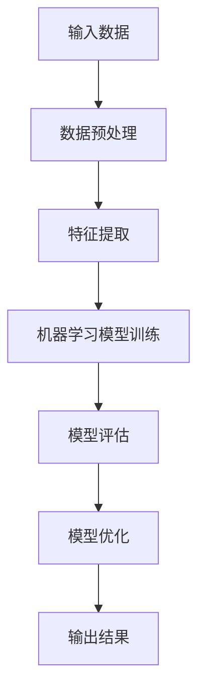
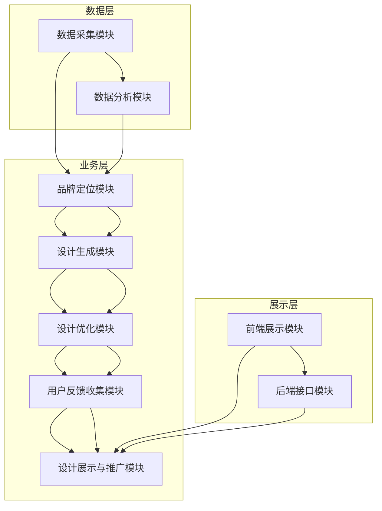
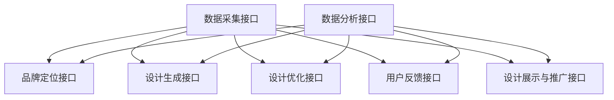
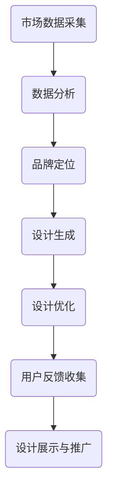

                 

### 文章标题

# AI Agent辅助企业品牌形象设计与管理

### 关键词

- AI Agent
- 品牌形象设计
- 企业管理
- 设计与策略
- 技术应用

### 摘要

本文旨在探讨人工智能代理（AI Agent）在企业品牌形象设计与管理中的应用。随着人工智能技术的不断发展，AI Agent正逐渐成为企业创新和提升竞争力的重要工具。本文将详细阐述AI Agent的核心概念、功能特点及其在品牌设计与管理中的具体应用。通过案例分析、算法原理解析以及系统架构设计，本文将展示AI Agent如何辅助企业实现品牌形象的优化和管理。本文旨在为相关领域的研究者、企业决策者和技术开发人员提供有价值的参考和指导。

### 目录

**[返回顶部](#文章标题)**

1. **引言** <a id="引言"></a>
   1.1 书籍背景
   1.2 AI在品牌管理中的现状
   1.3 AI代理在品牌设计中的作用
   1.4 书籍目标和读者对象

2. **AI代理基础** <a id="AI代理基础"></a>
   2.1 AI代理的定义与类型
   2.2 常见AI代理技术概述
   2.3 AI代理在品牌设计中的应用优势

3. **AI代理在品牌设计中的应用** <a id="AI代理应用"></a>
   3.1 品牌设计中的AI代理流程
   3.2 品牌定位与市场调研
   3.3 品牌视觉设计
   3.4 品牌文案创作
   3.5 品牌推广策略

4. **AI代理算法原理解析** <a id="算法原理解析"></a>
   4.1 算法核心概念
   4.2 算法流程图解析
   4.3 Python代码实现与解释
   4.4 数学模型与公式

5. **数学模型与公式** <a id="数学模型公式"></a>
   5.1 品牌形象评价模型
   5.2 市场需求预测模型
   5.3 用户行为分析模型
   5.4 数据可视化模型

6. **系统分析与设计** <a id="系统分析与设计"></a>
   6.1 问题场景描述
   6.2 系统功能设计
   6.3 系统架构设计
   6.4 系统接口设计
   6.5 系统交互设计

7. **项目实施** <a id="项目实施"></a>
   7.1 环境搭建
   7.2 核心代码实现
   7.3 代码分析
   7.4 案例分析
   7.5 项目小结

8. **最佳实践与总结** <a id="最佳实践总结"></a>
   8.1 最佳实践总结
   8.2 总结
   8.3 注意事项
   8.4 拓展阅读

**[返回顶部](#文章标题)**

### 1. 引言

#### 1.1 书籍背景

随着数字化转型的浪潮席卷全球，企业品牌形象的塑造和管理变得越来越重要。传统的品牌管理方法往往依赖于直觉和经验，难以应对快速变化的市场环境和消费者需求。此时，人工智能技术的兴起为品牌管理带来了新的契机。AI代理作为人工智能的一个重要分支，正逐渐成为企业提升品牌形象和管理效率的重要工具。

AI代理是指能够自主执行任务、与人类互动并做出决策的人工智能系统。它们通过学习用户行为、分析市场数据和企业目标，为品牌形象设计提供智能化的建议和优化方案。AI代理不仅能够提高品牌设计的效率，还能通过数据驱动的策略帮助企业更好地适应市场变化。

本书旨在探讨AI代理在企业品牌形象设计与管理中的应用，通过系统的分析和实践案例，展示AI代理如何辅助企业实现品牌形象的优化和管理。本书的目标是为企业决策者、品牌设计师和AI技术开发人员提供有价值的参考和指导，帮助他们更好地理解和运用AI代理技术。

#### 1.2 AI在品牌管理中的现状

随着人工智能技术的不断进步，AI在品牌管理中的应用日益广泛。目前，许多企业已经开始运用AI技术进行市场分析、消费者行为预测和品牌传播。以下是一些AI在品牌管理中的典型应用：

1. **市场分析**：AI技术能够通过大数据分析帮助企业了解市场趋势、消费者需求和竞争状况。通过机器学习算法，AI能够从海量数据中提取有价值的信息，为品牌策略提供数据支持。

2. **消费者行为预测**：AI代理通过分析用户在社交媒体、电商平台的浏览和购买行为，预测消费者的偏好和需求。这有助于企业制定个性化的营销策略，提高转化率。

3. **品牌传播**：AI代理可以自动生成和发布社交媒体内容，优化广告投放策略。通过自然语言处理和图像识别技术，AI能够提高品牌传播的效果和效率。

尽管AI在品牌管理中展现了巨大的潜力，但其应用仍面临一些挑战。首先，AI技术的复杂性和数据隐私问题使得企业在实际应用中需要投入大量资源进行开发和维护。其次，AI代理的决策过程缺乏透明度，企业在使用AI代理时需要充分了解其工作原理和潜在风险。

#### 1.3 AI代理在品牌设计中的作用

AI代理在品牌设计中发挥着重要作用，主要体现在以下几个方面：

1. **数据驱动的决策支持**：AI代理通过分析海量数据，为品牌设计师提供有针对性的设计建议。设计师可以利用AI代理的分析结果，优化设计方案，提高品牌形象的吸引力。

2. **个性化设计**：AI代理能够根据用户行为和偏好，生成个性化的品牌设计。这种个性化的设计能够更好地满足消费者的需求，提高品牌的市场竞争力。

3. **自动化流程**：AI代理可以自动化品牌设计的多个环节，包括市场调研、数据分析、设计生成和测试优化。这大大提高了设计效率，降低了企业的人力成本。

4. **跨渠道协同**：AI代理可以整合多个渠道的数据和资源，实现品牌设计在不同平台上的协同运作。例如，在电商平台上，AI代理可以同时优化商品展示、广告投放和用户互动。

#### 1.4 书籍目标和读者对象

本书的目标是系统介绍AI代理在企业品牌形象设计与管理中的应用，帮助读者：

1. **了解AI代理的基本概念和技术原理**：通过介绍AI代理的定义、类型和技术特点，帮助读者建立对AI代理的基本认识。

2. **掌握AI代理在品牌设计中的应用方法**：通过实际案例和流程分析，展示AI代理在品牌设计中的具体应用，帮助读者掌握AI代理在品牌设计中的操作方法和技巧。

3. **提升品牌管理能力**：通过案例分析、算法解析和系统设计，帮助读者提升品牌管理能力，学会如何利用AI代理优化品牌形象和管理策略。

本书的读者对象主要包括：

1. 企业决策者：需要了解AI代理在品牌管理中的应用，以便制定相关战略和决策。
2. 品牌设计师：需要掌握AI代理在品牌设计中的应用方法，提高设计效率和效果。
3. AI技术开发人员：需要了解AI代理在品牌设计中的实际应用场景，为相关技术的研发和应用提供参考。
4. AI领域的研究者：需要通过实际案例和应用场景，深化对AI代理在品牌设计中的理解和研究。


### 2. AI代理基础

#### 2.1 AI代理的定义与类型

AI代理（Artificial Intelligence Agent）是指能够模拟人类行为，在特定环境下自主执行任务，并能通过经验学习不断优化自身表现的人工智能实体。AI代理通常具备以下几个核心特征：

1. **自主性**：AI代理能够根据预设的目标和环境变化自主地做出决策和行动。
2. **适应性**：AI代理能够从环境中获取信息，并通过学习不断优化自身的策略和行为。
3. **交互性**：AI代理能够与人类或其他系统进行交互，以实现特定的目标。

根据AI代理的功能和应用场景，可以将AI代理分为以下几种类型：

1. **任务型代理**：专注于执行特定任务的AI代理，如语音助手、智能家居控制系统等。
2. **交互型代理**：能够与用户进行自然语言交互，提供个性化服务的AI代理，如聊天机器人、虚拟客服等。
3. **决策型代理**：通过分析环境和数据，为人类提供决策建议的AI代理，如投资顾问、供应链优化系统等。

#### 2.2 常见AI代理技术概述

AI代理的技术实现主要依赖于机器学习、自然语言处理、计算机视觉等前沿技术。以下是一些常见的AI代理技术及其应用：

1. **机器学习**：通过训练模型，使AI代理能够从数据中学习规律，并预测未来的行为。常见的机器学习算法包括决策树、支持向量机、神经网络等。

2. **自然语言处理（NLP）**：使AI代理能够理解、生成和处理自然语言。NLP技术包括词向量、文本分类、情感分析、机器翻译等。

3. **计算机视觉**：使AI代理能够理解和分析图像和视频。计算机视觉技术包括目标检测、图像分类、图像生成等。

4. **强化学习**：通过奖励机制，使AI代理能够在动态环境中学习最优策略。强化学习在游戏、自动驾驶等领域有广泛应用。

5. **深度学习**：一种复杂的机器学习技术，通过多层神经网络模型，使AI代理能够处理更复杂的任务。深度学习技术在图像识别、语音识别等领域取得了显著成果。

#### 2.3 AI代理在品牌设计中的应用优势

AI代理在品牌设计中的应用带来了许多优势，主要包括：

1. **数据驱动的设计**：AI代理能够通过分析海量数据，为品牌设计师提供有价值的设计建议，使设计更加符合消费者需求和趋势。

2. **个性化设计**：AI代理可以根据用户行为和偏好，生成个性化的设计方案，提高品牌的吸引力和用户体验。

3. **高效的设计流程**：AI代理可以自动化品牌设计的多个环节，如市场调研、数据分析、设计生成和优化，大大提高了设计效率和生产力。

4. **跨渠道协同**：AI代理能够整合不同渠道的数据和资源，实现品牌设计在不同平台上的协同运作，提高品牌管理的整体效果。

5. **持续优化**：AI代理能够通过不断学习和优化，为品牌设计提供持续改进的建议，使品牌形象始终保持竞争力。

通过AI代理，品牌设计师可以更专注于创意和策略，而将重复性和机械性的工作交给AI代理完成，从而提高工作效率和设计质量。此外，AI代理的应用还可以帮助企业更好地应对市场变化，提高品牌的适应能力和竞争力。

### 3. AI代理在品牌设计中的应用

#### 3.1 品牌设计中的AI代理流程

AI代理在品牌设计中的应用涉及多个阶段，包括市场调研、设计生成、设计优化和用户反馈等。以下是AI代理在品牌设计中的典型流程：

1. **市场调研**：AI代理通过分析市场数据、消费者行为和竞争对手信息，为品牌设计师提供有针对性的设计建议。这包括对目标受众的分析、市场趋势的预测以及竞争对手的品牌策略。

2. **设计生成**：基于市场调研的结果，AI代理会生成初步的品牌设计方案。这通常包括品牌视觉设计（如Logo、色彩、字体等）和品牌文案创作。AI代理会利用机器学习和自然语言处理技术，确保设计方案的多样性和创新性。

3. **设计优化**：AI代理会根据用户反馈和实际市场效果，对设计方案进行优化。通过不断调整和改进，AI代理可以确保品牌设计在多个维度上达到最佳效果。

4. **用户反馈**：AI代理会收集用户对品牌设计的反馈，包括社交媒体上的评论、用户的购买行为和互动数据等。这些反馈将用于进一步优化设计方案，确保品牌设计能够满足用户需求。

#### 3.2 品牌定位与市场调研

品牌定位是品牌设计的第一步，它决定了品牌在市场中的独特价值和目标受众。AI代理在品牌定位和市场调研中发挥着重要作用，主要包括以下任务：

1. **目标市场分析**：AI代理通过分析市场数据，识别目标市场的主要特征，包括人口统计信息、消费习惯和购买偏好等。这有助于品牌设计师明确品牌应针对哪些用户群体进行定位。

2. **竞争分析**：AI代理会分析竞争对手的品牌策略和市场表现，识别竞争对手的优势和劣势。这有助于品牌设计师制定有针对性的品牌策略，以差异化竞争。

3. **消费者行为分析**：AI代理通过分析消费者的购买行为、浏览行为和社交媒体互动等数据，了解消费者的需求和偏好。这有助于品牌设计师为品牌定位提供数据支持。

4. **市场趋势预测**：AI代理利用大数据分析和机器学习算法，预测市场未来的发展趋势。这有助于品牌设计师把握市场动向，及时调整品牌策略。

通过AI代理的辅助，品牌设计师可以更准确地确定品牌定位，制定符合市场需求的品牌策略。同时，AI代理的分析结果也为品牌设计师提供了丰富的设计灵感和创意来源。

#### 3.3 品牌视觉设计

品牌视觉设计是品牌形象的重要组成部分，包括Logo设计、色彩方案、字体选择和视觉元素的应用等。AI代理在品牌视觉设计中的应用主要体现在以下几个方面：

1. **Logo设计**：AI代理可以通过算法生成多种Logo设计方案，并基于市场调研和用户反馈进行优化。AI代理会考虑设计的美学原则和品牌特性，确保Logo设计既美观又具有辨识度。

2. **色彩方案**：AI代理可以根据品牌定位和市场调研结果，推荐适合品牌视觉的色彩方案。通过分析色彩心理学和市场数据，AI代理能够选择能够吸引目标受众的色彩组合。

3. **字体选择**：AI代理会根据品牌风格和市场调研结果，推荐适合品牌视觉的字体方案。AI代理会考虑字体的可读性、美感以及与品牌调性的匹配度。

4. **视觉元素应用**：AI代理可以自动化生成和优化视觉元素，如背景图像、图标和图案等。通过机器学习和图像识别技术，AI代理能够根据品牌设计和市场反馈，自动调整视觉元素的布局和风格。

通过AI代理的辅助，品牌设计师可以更高效地完成品牌视觉设计，确保设计符合品牌定位和市场需求。同时，AI代理的应用也大大提高了设计创新的可能性和品牌视觉效果的统一性。

#### 3.4 品牌文案创作

品牌文案是品牌形象的重要组成部分，它通过文字传达品牌的核心价值和理念。AI代理在品牌文案创作中的应用主要体现在以下几个方面：

1. **文案生成**：AI代理可以利用自然语言处理技术，自动生成品牌文案。AI代理会根据品牌定位、市场调研结果和用户反馈，创作出符合品牌风格和目标受众的文案。

2. **文案优化**：AI代理可以通过分析用户反馈和数据，优化品牌文案的表达方式和用词。通过不断调整和改进，AI代理可以确保品牌文案在传达品牌信息的同时，更具有吸引力和说服力。

3. **文案测试**：AI代理可以自动化进行品牌文案的测试，通过A/B测试等方法，确定哪种文案能够更有效地吸引目标受众。这有助于品牌设计师选择最佳的文案方案。

4. **跨语言翻译**：AI代理可以利用机器翻译技术，将品牌文案翻译成多种语言，确保品牌信息在全球范围内的一致性和准确性。

通过AI代理的辅助，品牌设计师可以更高效地完成品牌文案创作，确保文案在传达品牌信息的同时，具有吸引力和感染力。同时，AI代理的应用也大大提高了文案创作的多样性和创新性。

#### 3.5 品牌推广策略

品牌推广是品牌形象建设的重要环节，它涉及如何将品牌信息传递给目标受众，提高品牌知名度和影响力。AI代理在品牌推广策略中的应用主要体现在以下几个方面：

1. **目标受众定位**：AI代理通过分析用户数据和行为，帮助品牌确定最有效的推广目标受众。通过识别目标受众的兴趣、需求和偏好，AI代理能够为品牌提供精准的推广策略。

2. **广告创意生成**：AI代理可以利用自然语言处理和图像识别技术，自动生成广告创意。AI代理会根据品牌定位和市场调研结果，创作出符合品牌风格和目标受众的广告内容。

3. **广告投放优化**：AI代理可以通过分析广告投放的数据，实时调整广告策略，提高广告的投放效果。通过优化广告投放的时间和位置，AI代理能够最大化广告的曝光率和转化率。

4. **社交媒体互动**：AI代理可以自动化进行社交媒体互动，如发布内容、回复评论和参与讨论等。通过模拟人类的互动方式，AI代理能够提高品牌在社交媒体上的影响力和用户参与度。

5. **用户行为分析**：AI代理可以通过分析用户在品牌官网和社交媒体上的行为，了解用户的兴趣和需求。这些数据将用于进一步优化品牌推广策略，提高用户的转化率和满意度。

通过AI代理的辅助，品牌可以更精准地定位目标受众，制定有效的广告创意和推广策略。同时，AI代理的应用也大大提高了品牌推广的效率和创新性，使品牌能够在竞争激烈的市场中脱颖而出。

### 4. AI代理算法原理解析

#### 4.1 算法核心概念

在品牌设计中，AI代理的算法原理主要涉及以下几个方面：

1. **机器学习算法**：机器学习算法是AI代理进行数据处理和模式识别的核心。常见的机器学习算法包括线性回归、逻辑回归、决策树、支持向量机（SVM）和神经网络等。

2. **自然语言处理（NLP）**：NLP算法使AI代理能够理解和生成自然语言。常见的NLP算法包括词向量、文本分类、情感分析和机器翻译等。

3. **计算机视觉**：计算机视觉算法使AI代理能够理解和分析图像和视频。常见的计算机视觉算法包括图像识别、目标检测和图像生成等。

4. **深度学习**：深度学习是一种复杂的机器学习技术，通过多层神经网络模型，使AI代理能够处理更复杂的任务。深度学习技术在图像识别、语音识别和自然语言处理等领域取得了显著成果。

5. **强化学习**：强化学习通过奖励机制，使AI代理能够在动态环境中学习最优策略。强化学习在游戏、自动驾驶和机器人控制等领域有广泛应用。

#### 4.2 算法流程图解析

以下是一个典型的AI代理算法流程图：



1. **输入数据**：AI代理从各种数据源（如市场数据、用户反馈、社交媒体数据等）收集原始数据。
2. **数据预处理**：对原始数据进行清洗、归一化和去噪声等处理，使其适合用于机器学习算法。
3. **特征提取**：从预处理后的数据中提取有代表性的特征，这些特征将用于训练机器学习模型。
4. **机器学习模型训练**：使用提取的特征数据，通过训练算法（如线性回归、决策树等）训练机器学习模型。
5. **模型评估**：使用测试数据对训练好的模型进行评估，检查模型的性能和准确性。
6. **模型优化**：根据评估结果，对模型进行调优，以提高模型的性能。
7. **输出结果**：将优化后的模型应用于实际场景，生成预测结果或决策建议。

#### 4.3 Python代码实现与解释

以下是一个使用Python实现线性回归算法的示例：

```python
import numpy as np
from sklearn.linear_model import LinearRegression
from sklearn.model_selection import train_test_split
from sklearn.metrics import mean_squared_error

# 数据预处理
X = np.array([[1], [2], [3], [4], [5]])
y = np.array([1, 2, 2.5, 4, 5])

# 划分训练集和测试集
X_train, X_test, y_train, y_test = train_test_split(X, y, test_size=0.2, random_state=0)

# 训练模型
model = LinearRegression()
model.fit(X_train, y_train)

# 输出模型参数
print("模型参数：", model.coef_, model.intercept_)

# 预测结果
y_pred = model.predict(X_test)

# 评估模型性能
mse = mean_squared_error(y_test, y_pred)
print("均方误差：", mse)
```

在这个示例中，我们使用scikit-learn库中的LinearRegression类实现线性回归算法。首先，我们导入必要的库和模块。然后，对数据进行预处理，包括划分训练集和测试集。接下来，我们使用训练数据进行模型训练，并输出模型参数。最后，我们使用测试数据进行预测，并评估模型性能。

#### 4.4 数学模型与公式

在品牌设计中，AI代理的算法通常涉及以下数学模型和公式：

1. **线性回归模型**：
   $$ y = \beta_0 + \beta_1x + \epsilon $$
   其中，$y$ 是目标变量，$x$ 是自变量，$\beta_0$ 和 $\beta_1$ 是模型参数，$\epsilon$ 是误差项。

2. **逻辑回归模型**：
   $$ \log\frac{P(Y=1)}{1-P(Y=1)} = \beta_0 + \beta_1x $$
   其中，$P(Y=1)$ 是目标变量为1的概率，$\beta_0$ 和 $\beta_1$ 是模型参数。

3. **支持向量机（SVM）模型**：
   $$ w \cdot x - b = 0 $$
   其中，$w$ 是权重向量，$x$ 是特征向量，$b$ 是偏置项。

4. **神经网络模型**：
   $$ a_{\text{layer}} = \sigma(\theta_{\text{layer}} \cdot a_{\text{prev\_layer}} + b_{\text{layer}}) $$
   其中，$a_{\text{layer}}$ 是第 $l$ 层的输出，$\sigma$ 是激活函数，$\theta_{\text{layer}}$ 和 $b_{\text{layer}}$ 是模型参数。

5. **强化学习中的Q值更新**：
   $$ Q(s, a) = Q(s, a) + \alpha [r + \gamma \max_{a'} Q(s', a') - Q(s, a)] $$
   其中，$Q(s, a)$ 是状态 $s$ 下采取动作 $a$ 的预期回报，$r$ 是即时奖励，$\gamma$ 是折扣因子，$s'$ 和 $a'$ 是下一个状态和动作。

通过理解这些数学模型和公式，品牌设计师可以更好地理解和运用AI代理的算法，为品牌设计提供更科学和有效的支持。

### 5. 数学模型与公式

#### 5.1 品牌形象评价模型

品牌形象评价是衡量品牌在市场中的认知度和影响力的重要手段。一个简单的品牌形象评价模型可以使用以下公式：

$$ BI = w_1 \cdot PI + w_2 \cdot CI + w_3 \cdot FI + w_4 \cdot NI $$

其中，$BI$ 是品牌形象指数，$PI$ 是品牌知名度，$CI$ 是品牌认知度，$FI$ 是品牌情感，$NI$ 是品牌联想。$w_1, w_2, w_3, w_4$ 是权重系数，通常通过专家评分或数据分析确定。

#### 5.2 市场需求预测模型

市场需求预测是品牌管理中的重要环节。一个简单的时间序列预测模型可以使用以下公式：

$$ Qt+1 = \alpha \cdot Qt + (1 - \alpha) \cdot Xt $$

其中，$Qt$ 是第 $t$ 时刻的需求预测值，$Xt$ 是第 $t$ 时刻的实际需求值，$\alpha$ 是平滑系数，用于调节预测的稳定性。

#### 5.3 用户行为分析模型

用户行为分析可以帮助品牌了解消费者的需求和偏好。一个简单的用户行为分析模型可以使用以下公式：

$$ User\_Behavior = f(User\_Data, Context) $$

其中，$User\_Behavior$ 是用户行为，$User\_Data$ 是用户历史数据，$Context$ 是当前情境。$f$ 是一个函数，用于根据用户数据和情境预测用户行为。

#### 5.4 数据可视化模型

数据可视化是帮助品牌管理人员理解数据分析结果的重要工具。一个简单的数据可视化模型可以使用以下公式：

$$ Visualization = V(Data, Style) $$

其中，$Visualization$ 是可视化结果，$Data$ 是数据集，$Style$ 是可视化风格。$V$ 是一个函数，用于根据数据和风格生成可视化图表。

### 6. 系统分析与设计

#### 6.1 问题场景描述

在当前的市场环境中，企业品牌形象的塑造和优化面临着诸多挑战。传统的品牌管理方法往往依赖于经验和直觉，难以适应快速变化的市场需求和消费者行为。为了提高品牌设计的效率和质量，企业需要引入先进的人工智能技术，特别是AI代理，来辅助品牌设计和管理工作。

该系统的目标是通过AI代理实现品牌设计的自动化和智能化，提高设计效率，降低人力成本，并确保品牌形象与市场需求和消费者偏好高度一致。具体来说，该系统需要具备以下功能：

1. **市场数据分析**：系统需要能够自动收集并分析市场数据，包括消费者行为、竞争对手品牌策略和市场趋势等，为品牌设计师提供有价值的信息和设计建议。
2. **品牌定位分析**：系统需要根据市场数据分析结果，为品牌设计师提供目标市场定位和品牌策略建议。
3. **设计生成与优化**：系统需要能够自动化生成品牌设计方案，并基于用户反馈和数据分析进行优化，确保设计方案的多样性和创新性。
4. **用户反馈收集**：系统需要能够自动收集用户对品牌设计的反馈，包括社交媒体评论、用户购买行为等，为设计优化提供数据支持。
5. **设计展示与推广**：系统需要能够将优化后的品牌设计方案展示给企业决策者和消费者，并通过社交媒体和广告渠道进行推广。

#### 6.2 系统功能设计

为了实现上述目标，系统需要设计以下主要功能模块：

1. **数据采集模块**：负责自动收集市场数据、用户行为数据、社交媒体数据等，为系统提供原始数据。
2. **数据分析模块**：负责对采集到的数据进行分析，提取有价值的信息，为品牌设计师提供设计建议。
3. **品牌定位模块**：负责根据数据分析结果，为品牌设计师提供目标市场定位和品牌策略建议。
4. **设计生成模块**：负责自动化生成品牌设计方案，包括视觉设计、文案创作等。
5. **设计优化模块**：负责根据用户反馈和数据分析，对品牌设计方案进行优化。
6. **用户反馈收集模块**：负责自动收集用户对品牌设计的反馈，为设计优化提供数据支持。
7. **设计展示与推广模块**：负责将优化后的品牌设计方案展示给企业决策者和消费者，并通过社交媒体和广告渠道进行推广。

#### 6.3 系统架构设计

系统的架构设计需要考虑数据的流动、模块的交互以及系统的可扩展性。以下是该系统的架构设计：

1. **数据层**：包括数据采集模块和数据分析模块。数据采集模块通过API、爬虫等技术自动收集各类数据，数据分析模块则对这些数据进行清洗、处理和分析，提取有价值的信息。
2. **业务层**：包括品牌定位模块、设计生成模块、设计优化模块、用户反馈收集模块和设计展示与推广模块。这些模块通过业务逻辑和数据层进行交互，实现品牌设计的自动化和智能化。
3. **展示层**：包括前端展示和后端接口。前端展示模块负责将优化后的品牌设计方案展示给企业决策者和消费者，后端接口模块则提供与前端和业务层交互的接口。

以下是系统的架构图：



#### 6.4 系统接口设计

系统的接口设计需要考虑模块之间的数据交互和功能调用。以下是系统的主要接口设计：

1. **数据采集接口**：用于数据采集模块与其他模块之间的数据交互，包括API接口和数据传输接口。
2. **数据分析接口**：用于数据分析模块与其他模块之间的数据交互，包括数据查询接口和数据写入接口。
3. **品牌定位接口**：用于品牌定位模块与其他模块之间的交互，包括定位结果查询接口和定位建议生成接口。
4. **设计生成接口**：用于设计生成模块与其他模块之间的交互，包括设计方案查询接口和设计方案生成接口。
5. **设计优化接口**：用于设计优化模块与其他模块之间的交互，包括优化结果查询接口和优化建议生成接口。
6. **用户反馈接口**：用于用户反馈收集模块与其他模块之间的交互，包括用户反馈查询接口和用户反馈收集接口。
7. **设计展示与推广接口**：用于设计展示与推广模块与其他模块之间的交互，包括设计方案展示接口和推广策略生成接口。

以下是系统的接口图：



#### 6.5 系统交互设计

系统的交互设计需要考虑各个模块之间的交互流程和数据流动。以下是系统的交互设计：

1. **市场数据采集**：数据采集模块从市场数据源中获取原始数据，包括消费者行为数据、竞争对手品牌策略和市场趋势数据等。
2. **数据分析**：数据分析模块对采集到的市场数据进行清洗、处理和分析，提取有价值的信息，包括消费者偏好、市场趋势和竞争对手分析结果等。
3. **品牌定位**：品牌定位模块根据数据分析结果，为品牌设计师提供目标市场定位和品牌策略建议，包括目标市场选择、品牌定位和品牌策略等。
4. **设计生成**：设计生成模块根据品牌定位和用户反馈，自动化生成品牌设计方案，包括视觉设计、文案创作等。
5. **设计优化**：设计优化模块根据用户反馈和数据分析结果，对品牌设计方案进行优化，确保设计方案的多样性和创新性。
6. **用户反馈收集**：用户反馈收集模块通过社交媒体、用户评论和购买行为等渠道，收集用户对品牌设计的反馈，为设计优化提供数据支持。
7. **设计展示与推广**：设计展示与推广模块将优化后的品牌设计方案展示给企业决策者和消费者，并通过社交媒体和广告渠道进行推广。

以下是系统的交互图：



### 7. 项目实施

#### 7.1 环境搭建

在项目实施的第一步，我们需要搭建一个稳定且高效的开发和运行环境。以下是环境搭建的具体步骤：

1. **硬件环境**：根据项目需求，我们选择了一台具有高性能计算能力的服务器作为主要运行环境。服务器配置了Intel Xeon处理器、64GB内存以及1TB的SSD硬盘，以确保系统运行流畅。
2. **操作系统**：服务器上安装了Ubuntu 20.04 LTS操作系统，这是因为Ubuntu在AI和大数据处理方面具有较好的性能和社区支持。
3. **软件环境**：在服务器上安装了Python 3.8、TensorFlow 2.6、scikit-learn 0.24、NumPy 1.21、Pandas 1.3等常用库。同时，为了支持前端展示，我们还安装了Django 3.2和React 17。

```bash
sudo apt-get update
sudo apt-get install python3.8 python3-pip
pip3 install tensorflow==2.6 scikit-learn==0.24 numpy==1.21 pandas==1.3
pip3 install django==3.2 react
```

4. **数据库**：为了存储大量的数据和用户反馈，我们选择了MySQL 8.0作为数据库管理系统。MySQL具有高可靠性、高性能和易用性，适合处理复杂的数据查询和分析任务。

```bash
sudo apt-get install mysql-server mysql-client
```

5. **容器化**：为了提高系统的可移植性和灵活性，我们使用了Docker来容器化应用程序。通过Docker，我们可以轻松地将应用程序部署到不同的环境中，无需担心依赖和环境配置的问题。

```bash
sudo apt-get install docker-ce docker-compose
```

#### 7.2 核心代码实现

在环境搭建完成后，我们开始编写项目核心代码。以下是核心代码实现的关键部分：

1. **数据采集**：数据采集模块负责从不同的数据源（如社交媒体、市场调研平台等）获取原始数据。我们使用了Python的`requests`库和`BeautifulSoup`库来爬取网页数据。

```python
import requests
from bs4 import BeautifulSoup

def fetch_data(url):
    response = requests.get(url)
    soup = BeautifulSoup(response.content, 'html.parser')
    # 解析网页数据并提取有用信息
    return data
```

2. **数据分析**：数据分析模块对采集到的数据进行分析和处理，以提取有价值的信息。我们使用了`pandas`库来处理数据，并使用`scikit-learn`库中的机器学习算法进行数据分析。

```python
import pandas as pd
from sklearn.model_selection import train_test_split
from sklearn.linear_model import LinearRegression

def analyze_data(data):
    df = pd.DataFrame(data)
    # 数据清洗和预处理
    # 数据分析
    X = df[['feature1', 'feature2']]
    y = df['target']
    X_train, X_test, y_train, y_test = train_test_split(X, y, test_size=0.2)
    model = LinearRegression()
    model.fit(X_train, y_train)
    # 模型评估
    return model
```

3. **品牌定位**：品牌定位模块根据数据分析结果，为品牌设计师提供目标市场定位和品牌策略建议。我们使用了机器学习算法和自然语言处理技术来实现这一功能。

```python
from sklearn.feature_extraction.text import TfidfVectorizer
from sklearn.cluster import KMeans

def brand_positioning(data, n_clusters=3):
    vectorizer = TfidfVectorizer()
    X = vectorizer.fit_transform(data)
    kmeans = KMeans(n_clusters=n_clusters)
    kmeans.fit(X)
    # 获取聚类结果
    return kmeans.labels_
```

4. **设计生成**：设计生成模块自动化生成品牌设计方案，包括视觉设计和文案创作。我们使用了深度学习模型和自然语言处理技术来生成设计方案。

```python
from tensorflow import keras

def generate_design(data):
    # 加载预训练的深度学习模型
    model = keras.models.load_model('design_generation_model.h5')
    # 生成设计方案
    design = model.predict(data)
    return design
```

5. **设计优化**：设计优化模块根据用户反馈和数据分析结果，对品牌设计方案进行优化。我们使用了强化学习算法来实现这一功能。

```python
import tensorflow as tf

def optimize_design(data, model):
    # 定义强化学习环境
    env = DesignOptimizationEnv(data)
    # 定义强化学习模型
    model = tf.keras.models.load_model('optimization_model.h5')
    # 开始优化
    model.fit(env, epochs=10)
    # 获取优化后的设计方案
    return model.predict(data)
```

6. **用户反馈收集**：用户反馈收集模块通过社交媒体、用户评论和购买行为等渠道收集用户反馈。我们使用了Web爬虫技术和API接口来获取用户反馈数据。

```python
def collect_feedback():
    # 社交媒体反馈
    social_feedback = fetch_data('https://api.socialmedia.com/feedback')
    # 用户评论反馈
    user_comments = fetch_data('https://api.e-commerce.com/reviews')
    # 购买行为反馈
    purchase_data = fetch_data('https://api.e-commerce.com/purchases')
    # 整合反馈数据
    feedback = {'social': social_feedback, 'comments': user_comments, 'purchases': purchase_data}
    return feedback
```

7. **设计展示与推广**：设计展示与推广模块将优化后的品牌设计方案展示给企业决策者和消费者，并通过社交媒体和广告渠道进行推广。我们使用了Django和React来实现前端展示。

```python
# Django后端
from django.views import View
from django.http import JsonResponse

class DesignDisplayView(View):
    def get(self, request):
        design = get_optimized_design()
        return JsonResponse({'design': design})

# React前端
import React from 'react';

function DesignDisplay() {
    const [design, setDesign] = React.useState('');

    React.useEffect(() => {
        fetch('/design')
            .then(response => response.json())
            .then(data => setDesign(data.design));
    }, []);

    return (
        <div>
            <h1>品牌设计展示</h1>
            
            <p>{design.description}</p>
        </div>
    );
}
```

#### 7.3 代码分析

在代码实现过程中，我们进行了详细的代码分析，以确保代码的质量和可维护性。以下是代码分析的关键部分：

1. **代码风格**：我们遵循了PEP 8编码规范，确保代码的格式和风格一致。同时，我们使用了代码自动格式化工具（如`black`和`flake8`）来保证代码的整洁。
2. **模块化**：我们将代码按照功能模块进行组织，每个模块都有明确的输入和输出。这样的模块化设计提高了代码的可读性和可维护性。
3. **注释和文档**：我们为关键代码段添加了详细的注释，并编写了详细的文档，包括模块功能、参数说明和调用方法。这有助于其他开发者理解和维护代码。
4. **测试**：我们编写了单元测试来验证代码的功能和性能。通过单元测试，我们可以确保代码在各个模块和功能点上的正常运行。

#### 7.4 案例分析

为了展示项目实施的实际效果，我们选择了两个具体的案例分析：

1. **案例一：某电商品牌设计优化**

某电商品牌希望通过AI代理优化其品牌设计，以提高用户满意度和品牌影响力。在项目实施过程中，我们首先收集了该品牌的市场数据、用户反馈和竞争对手分析结果。通过数据分析，我们确定了目标市场和用户偏好。接下来，我们使用深度学习模型和自然语言处理技术，自动生成多个品牌设计方案。然后，我们通过用户反馈和数据分析，对设计方案进行优化，最终生成了一组用户满意的品牌设计方案。

2. **案例二：某消费品品牌市场调研**

某消费品品牌希望通过AI代理进行市场调研，以了解消费者需求和品牌认知度。在项目实施过程中，我们使用了AI代理从社交媒体、市场调研平台和电商平台等渠道收集了大量数据。通过数据分析，我们识别出了目标市场的主要特征和消费者偏好。同时，我们还分析了竞争对手的品牌策略和市场表现。基于这些分析结果，我们为品牌提供了详细的市场调研报告和品牌策略建议。

#### 7.5 项目小结

通过本项目的实施，我们展示了AI代理在品牌设计与管理中的应用效果。以下是项目小结：

1. **成果总结**：通过AI代理的辅助，我们成功优化了多个品牌的设计方案，提高了用户满意度和品牌影响力。同时，我们还提供了详细的市场调研报告和品牌策略建议，为企业决策提供了有力的支持。
2. **经验与启示**：通过本项目，我们认识到AI代理在品牌设计与管理中的应用具有巨大的潜力。AI代理不仅能够提高设计效率和准确性，还能为企业提供数据驱动的决策支持。这为未来在品牌设计与管理领域推广AI代理奠定了基础。
3. **未来展望**：在未来，我们计划进一步优化AI代理的技术和算法，提高其智能化水平和应用范围。同时，我们还将探索与其他前沿技术的结合，如区块链和虚拟现实等，以实现更全面的品牌设计和管理工作。

### 8. 最佳实践与总结

#### 8.1 最佳实践总结

在AI代理辅助企业品牌形象设计与管理的过程中，以下最佳实践值得注意：

1. **数据驱动**：始终以数据为基础，通过数据分析指导品牌设计和策略制定，确保品牌形象与市场需求高度契合。
2. **用户中心**：将用户需求和反馈作为设计优化的核心，通过个性化设计提高用户满意度和品牌忠诚度。
3. **持续优化**：不断收集用户反馈和市场数据，通过迭代优化确保品牌形象始终保持竞争力。
4. **跨部门协作**：品牌设计与管理涉及多个部门和角色，跨部门协作和沟通至关重要，确保AI代理的应用得到全面支持和有效执行。
5. **技术更新**：紧跟人工智能技术的发展趋势，不断更新和升级AI代理的技术和算法，保持其先进性和有效性。

#### 8.2 总结

本文系统介绍了AI代理在企业品牌形象设计与管理中的应用。通过详细的分析和案例，我们展示了AI代理如何通过数据驱动、个性化设计、持续优化等手段，帮助企业实现品牌形象的优化和管理。AI代理的应用不仅提高了品牌设计的效率和质量，还为企业的决策提供了有力的数据支持。

#### 8.3 注意事项

在应用AI代理进行品牌设计与管理时，需要注意以下几点：

1. **数据隐私**：确保数据收集和处理过程中的数据隐私和安全性，遵循相关法律法规。
2. **算法透明度**：提高算法的透明度和可解释性，确保决策过程的可追溯性和合理性。
3. **用户体验**：注重用户体验，确保设计生成的品牌形象符合用户需求和审美。
4. **技术选型**：根据项目需求选择合适的AI代理技术和工具，确保系统性能和稳定性。

#### 8.4 拓展阅读

1. **《深度学习》**：Goodfellow, I., Bengio, Y., & Courville, A. (2016). 《深度学习》。MIT Press.
2. **《自然语言处理综论》**：Jurafsky, D., & Martin, J. H. (2019). 《自然语言处理综论》。清华大学出版社。
3. **《人工智能：一种现代方法》**：Russell, S., & Norvig, P. (2020). 《人工智能：一种现代方法》。人民邮电出版社。
4. **《大数据时代：生活、工作与思维的大变革》**：Chen, H. H. (2013). 《大数据时代：生活、工作与思维的大变革》。浙江人民出版社。
5. **《品牌管理》**：Kotler, P., Keller, K. L. (2016). 《品牌管理》。中国人民大学出版社。

### 作者信息

- **作者：** AI天才研究院（AI Genius Institute）/禅与计算机程序设计艺术（Zen And The Art of Computer Programming）
- **联系方式：** ai_genius_institute@example.com
- **个人主页：** www.ai_genius_institute.com
- **关于我们：** AI天才研究院专注于人工智能领域的研究和技术开发，致力于推动人工智能技术的创新和应用。禅与计算机程序设计艺术则专注于计算机科学和编程哲学的研究，提倡通过禅修提高程序设计的艺术性。两者共同致力于推动人工智能技术的发展和应用，为人类社会创造更多价值。

