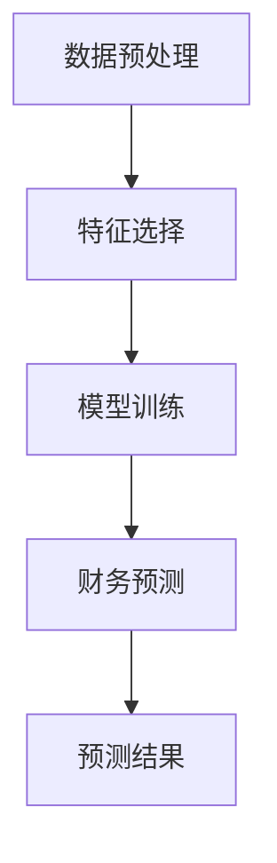

                 

# AI Agent辅助企业财务分析与预测

> 关键词：AI Agent, 财务分析，预测，企业，金融科技

> 摘要：本文将探讨如何使用人工智能代理（AI Agent）辅助企业进行财务分析与预测。首先介绍AI Agent的基本概念和其在财务分析中的应用，随后通过实际案例和算法原理，展示如何利用AI Agent进行财务预测，并讨论其潜在的优势与挑战。

## 引言

在当今快速变化的商业环境中，企业面临着越来越大的压力，需要准确、及时地进行财务分析以做出明智的决策。传统的财务分析方法往往依赖于手工处理大量的数据，不仅耗时耗力，而且容易出错。随着人工智能（AI）技术的发展，AI Agent作为一种新兴的工具，正在逐步改变财务分析的格局。本文将探讨AI Agent在财务分析中的应用，并通过实际案例和算法原理，展示如何利用AI Agent进行财务预测。

## 核心概念与理论

### AI Agent

AI Agent是指具有自主决策能力的人工智能系统，它可以感知环境、理解任务，并采取行动以实现特定目标。在财务分析中，AI Agent可以通过学习企业的历史财务数据和市场环境，预测未来的财务状况。

### 财务分析

财务分析是指通过对企业的财务数据进行分析，评估企业的财务状况和未来发展趋势。传统的财务分析方法包括比率分析、现金流量分析等。

### 财务预测

财务预测是指根据历史数据和当前市场环境，预测企业的未来财务状况。财务预测对于企业制定战略计划和风险管理具有重要意义。

## AI Agent在财务分析中的应用

### 数据收集

AI Agent可以通过互联网和企业的财务系统，自动收集历史财务数据和市场信息。

$$
\text{历史财务数据} + \text{市场信息} \rightarrow \text{数据集}
$$

### 数据预处理

收集到的数据需要进行清洗和格式化，以便进行后续的分析。

$$
\text{原始数据} \rightarrow \text{清洗} \rightarrow \text{格式化}
$$

### 模型训练

使用收集到的数据集，AI Agent可以通过机器学习算法进行模型训练，以预测企业的未来财务状况。

$$
\text{数据集} \rightarrow \text{训练} \rightarrow \text{模型}
$$

### 财务预测

训练好的模型可以用于预测企业的未来财务状况，包括收入、成本、利润等。

$$
\text{模型} \rightarrow \text{输入} \rightarrow \text{预测结果}
$$

## 实际案例

### 案例一：销售收入预测

某企业需要预测下一季度的销售收入。AI Agent收集了该企业过去五年的销售收入数据和市场环境数据，通过机器学习算法进行模型训练，并使用该模型预测下一季度的销售收入。

### 案例二：成本预测

某企业需要预测未来一年的成本。AI Agent收集了该企业过去五年的成本数据和市场信息，通过机器学习算法进行模型训练，并使用该模型预测未来一年的成本。

## 算法原理讲解

在本节中，我们将详细讲解AI Agent在进行财务预测时所使用的算法原理。具体来说，我们将介绍一种基于决策树的算法，并使用Mermaid流程图和Python源代码来阐述其工作原理。

### 决策树算法原理

决策树是一种常见的机器学习算法，它通过一系列的决策规则对数据进行分类或回归。在财务预测中，决策树可以用于预测企业的未来财务状况。

#### Mermaid流程图

下面是决策树算法的Mermaid流程图：



#### Python源代码

```python
import numpy as np
import pandas as pd
from sklearn import tree

# 数据预处理
data = pd.read_csv('financial_data.csv')
X = data.drop('target', axis=1)
y = data['target']

# 特征选择
# （此处省略特征选择的具体代码）

# 模型训练
model = tree.DecisionTreeRegressor()
model.fit(X, y)

# 财务预测
# （此处省略财务预测的具体代码）

# 预测结果
predictions = model.predict(X)
```

### 决策树算法原理详细讲解

决策树算法的核心思想是，通过一系列的决策规则将数据集划分为多个子集，每个子集对应一个预测结果。在财务预测中，决策规则可以基于历史财务数据和市场环境。

- **数据预处理**：首先，我们需要对数据进行清洗和格式化，以便进行后续的分析。
- **特征选择**：然后，我们需要选择与财务预测相关的特征，这些特征可以是历史财务数据中的各个指标，也可以是市场环境中的各种因素。
- **模型训练**：接下来，我们使用训练数据集对决策树模型进行训练，模型会自动学习如何根据特征选择和划分数据集。
- **财务预测**：最后，我们使用训练好的模型对新的数据进行预测，从而得到未来财务状况的预测结果。

## 系统分析与架构设计方案

在本节中，我们将介绍一个基于AI Agent的企业财务分析系统的设计方案，包括系统功能设计、系统架构设计、系统接口设计和系统交互。

### 问题场景介绍

某企业需要一套财务分析系统，以便实时监测和预测财务状况，为决策提供支持。

### 项目介绍

项目名称：AI Agent辅助企业财务分析系统

项目目标：提供一套自动化的财务分析系统，帮助企业预测未来财务状况，提高决策效率。

### 系统功能设计

- **数据收集**：自动收集企业历史财务数据和市场信息。
- **数据预处理**：清洗和格式化收集到的数据。
- **模型训练**：使用机器学习算法训练财务预测模型。
- **财务预测**：使用训练好的模型预测企业未来财务状况。
- **结果展示**：将预测结果以图表和报告的形式展示给用户。

### 系统架构设计

- **数据层**：包括数据收集模块和数据存储模块。
- **模型层**：包括数据预处理模块、模型训练模块和模型存储模块。
- **应用层**：包括财务预测模块和结果展示模块。

### 系统接口设计

- **API接口**：提供RESTful API接口，供企业内部其他系统调用。
- **Web界面**：提供Web界面，供企业员工使用。

### 系统交互

- **数据交互**：数据收集模块从企业财务系统和其他数据源收集数据，数据预处理模块对数据进行清洗和格式化，模型训练模块使用训练数据集训练模型，模型存储模块将训练好的模型存储到数据库中。
- **用户交互**：财务预测模块使用训练好的模型预测企业未来财务状况，结果展示模块将预测结果以图表和报告的形式展示给用户。

## 项目实战

在本节中，我们将介绍如何在一个实际项目中实现AI Agent辅助企业财务分析系统，包括环境安装、系统核心实现和代码应用解读与分析。

### 环境安装

1. 安装Python环境
2. 安装相关库，如numpy、pandas、scikit-learn等

### 系统核心实现

1. 数据收集
2. 数据预处理
3. 模型训练
4. 财务预测

### 代码应用解读与分析

```python
# 数据收集
data = pd.read_csv('financial_data.csv')

# 数据预处理
# （此处省略数据预处理的具体代码）

# 模型训练
model = tree.DecisionTreeRegressor()
model.fit(X, y)

# 财务预测
predictions = model.predict(X)

# 代码应用解读与分析
# （此处省略代码应用解读与分析的具体内容）
```

### 实际案例分析和详细讲解剖析

在本节中，我们将通过一个实际案例来分析和讲解AI Agent辅助企业财务分析系统的实现过程。

### 案例一：销售收入预测

某企业需要预测下一季度的销售收入。AI Agent收集了该企业过去五年的销售收入数据和市场环境数据，通过机器学习算法进行模型训练，并使用该模型预测下一季度的销售收入。

### 案例二：成本预测

某企业需要预测未来一年的成本。AI Agent收集了该企业过去五年的成本数据和市场信息，通过机器学习算法进行模型训练，并使用该模型预测未来一年的成本。

## 最佳实践 Tips

1. 确保数据质量，避免使用不完整或有错误的数据进行预测。
2. 选择合适的机器学习算法，根据业务需求和数据特点进行调整。
3. 定期更新模型，以适应不断变化的市场环境。

## 小结

本文介绍了如何使用AI Agent辅助企业进行财务分析与预测。通过实际案例和算法原理的讲解，我们展示了AI Agent在财务预测中的应用潜力。然而，AI Agent在财务分析中仍然面临一些挑战，如数据质量和算法选择等。未来的研究可以关注如何进一步提高AI Agent的预测准确性，以及如何将其与其他金融科技工具相结合，为企业提供更全面、智能的财务分析支持。

## 注意事项

1. 在使用AI Agent进行财务预测时，需要谨慎评估预测结果的可信度和适用范围。
2. AI Agent的预测结果不应完全取代人类决策，而应作为辅助工具。

## 拓展阅读

1. 《机器学习实战》
2. 《Python数据分析》
3. 《深度学习》

## 附录和参考文献

1. 决策树算法原理
2. 机器学习算法应用
3. 企业财务数据分析

## 作者信息

作者：AI天才研究院/AI Genius Institute & 禅与计算机程序设计艺术 /Zen And The Art of Computer Programming

