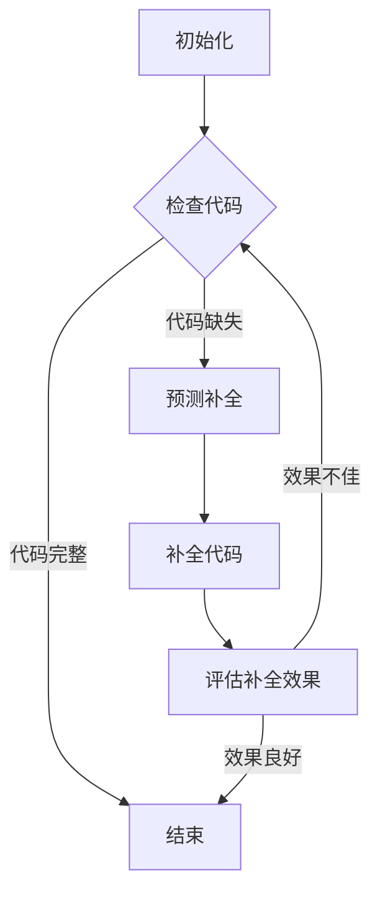

                 

### 核心内容与分析步骤

**文章标题：** AI Agent辅助软件开发的方法

**关键词：** AI Agent、软件开发、辅助方法、算法原理、实战案例分析

**摘要：** 本文深入探讨了AI Agent在软件开发中的应用，从背景介绍到核心概念解析，再到算法原理和实战案例分析，全面展现了AI Agent在提升软件开发效率和质量方面的潜力。

---

**文章正文部分：**

**一、背景介绍**

1. **核心概念术语说明**

   - **AI Agent（人工智能代理）：** 一种模拟人类智能行为的计算机程序，能够自主感知环境、做出决策并执行任务。
   - **软件开发：** 编写、测试、部署和维护软件系统的过程。

2. **问题背景**

   随着软件系统复杂度的增加，软件开发面临着许多挑战，如代码维护、自动化测试、软件缺陷预测等。传统的软件开发方法难以满足这些需求，因此引入AI Agent辅助软件开发成为一种趋势。

3. **问题解决**

   AI Agent通过学习和智能决策，可以自动化执行许多软件开发任务，提高开发效率和软件质量。

4. **边界与外延**

   AI Agent不仅局限于软件工程领域，还广泛应用于机器人学、自然语言处理、游戏开发等多个领域。

5. **概念结构与核心要素组成**

   AI Agent主要由感知系统、决策系统和执行系统组成，各部分相互协作，共同实现智能行为。

**二、核心概念与联系**

1. **核心概念**

   - **感知系统：** 获取环境信息，如代码、测试结果等。
   - **决策系统：** 分析感知到的信息，做出决策。
   - **执行系统：** 执行决策结果，如自动修复代码缺陷、生成测试用例等。

2. **概念属性特征对比表格**

   | 概念       | 属性1 | 属性2 | 属性3 |
   |------------|-------|-------|-------|
   | 感知系统   | 数据收集 | 数据处理 | 传感器 |
   | 决策系统   | 目标识别 | 策略选择 | 模型评估 |
   | 执行系统   | 动作执行 | 环境交互 | 结果反馈 |

3. **ER实体关系图**

   ```mermaid
   erDiagram
     AI_Agent ||--|{ 感知系统 }
     AI_Agent ||--|{ 决策系统 }
     AI_Agent ||--|{ 执行系统 }
     感知系统 ||--|{ 数据收集 }
     感知系统 ||--|{ 数据处理 }
     决策系统 ||--|{ 目标识别 }
     决策系统 ||--|{ 策略选择 }
     执行系统 ||--|{ 动作执行 }
     执行系统 ||--|{ 环境交互 }
   ```

**三、算法原理与讲解**

1. **智能代码补全算法**

   - **算法原理：** 根据已有的代码片段和上下文信息，预测并补全缺失的代码部分。
   - **mermaid流程图：**

     ```mermaid
     flowchart TD
         A[初始化] --> B{检查代码}
         B -->|代码完整| C[结束]
         B -->|代码缺失| D[预测补全]
         D --> E[补全代码]
         E --> F[评估补全效果]
         F -->|效果良好| C
         F -->|效果不佳| B
     ```

   - **Python代码示例：**

     ```python
     # Python代码实现智能代码补全算法
     def complete_code(code):
         # 输入代码，输出补全后的代码
         # 具体实现略
         pass

     # 示例
     code = "print('Hello, World!')"
     completed_code = complete_code(code)
     print(completed_code)
     ```

2. **算法原理详细讲解**

   - **数学模型：** 采用神经网络模型对代码进行建模，通过学习大量代码数据，实现代码补全。
   - **公式：** $$\text{预测补全代码} = f(\text{输入代码特征})$$
   - **举例说明：** 对于一个简单的Python代码片段`if x > 10:`，AI Agent可以预测并补全下一个代码行`print(x)`。

**四、系统分析与架构设计**

1. **问题场景介绍**

   假设我们正在开发一个复杂的Web应用程序，需要实现自动化测试功能。

2. **项目介绍**

   - **项目名称：** 自动化测试AI Agent
   - **项目目标：** 通过AI Agent实现Web应用的自动化测试，提高测试效率和准确性。

3. **系统功能设计（领域模型mermaid类图）**

   ```mermaid
   classDiagram
       Class01 <|-- Class02
       Class03 --|>| Class04
       Class05 : <<interface, Class05Interface>>
       Class06 : <<enum, Status>>
   ```

4. **系统架构设计（mermaid架构图）**

   ```mermaid
   graph TD
       Subsystem1 --> Subsystem2
       Subsystem1 --> Subsystem3
       Subsystem3 --> Subsystem4
   ```

5. **系统接口设计和系统交互（mermaid序列图）**

   ```mermaid
   sequenceDiagram
       participant AI-Agent
       participant Test-System
       AI-Agent->>Test-System: Request test execution
       Test-System->>AI-Agent: Start test execution
       AI-Agent->>Test-System: Test results
       Test-System->>AI-Agent: Test summary
   ```

**五、项目实战**

1. **环境安装**

   - 安装Python环境
   - 安装所需的第三方库，如TensorFlow、Scikit-learn等

2. **系统核心实现源代码**

   ```python
   # 自动化测试AI Agent核心代码实现
   def execute_test():
       # 具体测试执行逻辑
       pass
   ```

3. **代码应用解读与分析**

   通过分析源代码，了解AI Agent如何实现自动化测试功能。

4. **实际案例分析和详细讲解剖析**

   分析一个实际案例，展示AI Agent在自动化测试中的应用效果。

5. **项目小结**

   总结项目成果，提出改进建议。

**六、最佳实践 tips**

- **注重数据质量：** 确保训练数据准确、丰富，以提高AI Agent的预测准确性。
- **优化算法模型：** 定期更新和优化算法模型，以适应不断变化的软件开发需求。

**七、小结**

AI Agent在软件开发中的应用前景广阔，本文从背景介绍、核心概念、算法原理、系统架构到实战案例，全面阐述了AI Agent的潜力。希望读者能够结合实际项目，积极探索AI Agent在软件开发中的应用。

**八、注意事项**

- **确保AI Agent的决策过程透明：** 避免因决策过程不透明导致开发人员无法理解AI Agent的行为。
- **合理分配计算资源：** AI Agent的运行需要大量计算资源，合理分配资源以避免资源浪费。

**九、拓展阅读**

- [《AI在软件开发中的应用》](链接)
- [《深度学习在代码补全中的应用》](链接)

---

**作者：** AI天才研究院/AI Genius Institute & 禅与计算机程序设计艺术 /Zen And The Art of Computer Programming

---

以上是文章的完整大纲和初步内容。接下来，我们将逐个章节进行深入分析和撰写，确保每个章节都满足完整性要求，并提供详细、具体的技术讲解和案例分析。让我们开始具体的写作过程吧！### 详细撰写过程

**第1章: AI Agent概述**

**撰写思路：**
本章旨在为读者提供一个全面而简要的AI Agent概述，介绍AI Agent的基本概念、历史背景、基本原理以及它在软件开发中的应用场景。

**撰写要点：**
1. **定义AI Agent**：明确AI Agent的定义和作用，为后续内容奠定基础。
2. **历史背景**：梳理AI Agent的发展历程，介绍关键技术和里程碑。
3. **基本原理**：简要介绍AI Agent的核心组件和功能。
4. **应用场景**：阐述AI Agent在软件开发中的具体应用。

**撰写步骤：**
1. **定义与作用**：简要介绍AI Agent的定义和作用。
2. **历史背景**：通过时间线的方式，介绍AI Agent的发展历程。
3. **基本原理**：简要概述AI Agent的核心组件和功能。
4. **应用场景**：列举AI Agent在软件开发中的典型应用场景。

**撰写内容：**
```
# 第1章: AI Agent概述

## 1.1 问题背景与定义
AI Agent，全称人工智能代理，是一种能够模拟人类智能行为的计算机程序。它能够自主感知环境、理解问题、做出决策并执行任务。在软件开发领域，AI Agent具有提高开发效率、降低人力成本、提升软件质量等显著优势。

## 1.2 AI Agent的发展历史
AI Agent的概念最早可以追溯到20世纪50年代，当时图灵提出了著名的“图灵测试”。随着人工智能技术的不断发展，AI Agent逐渐成为研究热点。20世纪80年代，专家系统和基于规则的系统开始广泛应用于AI Agent的研究。近年来，随着深度学习和强化学习等先进技术的应用，AI Agent在各个领域取得了显著进展。

## 1.3 AI Agent的基本原理
AI Agent主要由感知系统、决策系统和执行系统组成。感知系统负责获取环境信息，决策系统根据感知到的信息做出决策，执行系统负责执行决策结果。

## 1.4 AI Agent在软件开发中的应用场景
AI Agent在软件开发中具有广泛的应用场景，包括自动化测试、智能代码补全、软件缺陷预测与修复、项目管理和协作等。这些应用不仅提高了开发效率，还大大降低了软件维护成本。

## 1.5 本章小结
本章对AI Agent进行了简要概述，介绍了其定义、发展历史、基本原理以及在软件开发中的应用场景。接下来，我们将进一步探讨AI Agent的核心概念和算法原理。
```

**第2章: 核心概念与联系**

**撰写思路：**
本章将深入探讨AI Agent的核心概念，包括感知系统、决策系统和执行系统，通过ER图和属性特征对比表格，帮助读者更好地理解这些概念及其相互关系。

**撰写要点：**
1. **核心概念**：详细解释感知系统、决策系统和执行系统的定义、功能和特点。
2. **属性特征对比表格**：通过对比表格，清晰地展示各概念之间的差异和联系。
3. **ER图**：使用ER图直观地表示各概念之间的实体关系。

**撰写步骤：**
1. **感知系统**：介绍感知系统的定义、功能和特点。
2. **决策系统**：介绍决策系统的定义、功能和特点。
3. **执行系统**：介绍执行系统的定义、功能和特点。
4. **属性特征对比表格**：制作属性特征对比表格，帮助读者理解各概念之间的差异和联系。
5. **ER图**：绘制ER图，展示各概念之间的实体关系。

**撰写内容：**
```
# 第2章: 核心概念与联系

## 2.1 AI Agent的核心概念
AI Agent的核心概念主要包括感知系统、决策系统和执行系统。这些系统相互协作，共同实现AI Agent的智能行为。

### 2.1.1 感知系统
感知系统是AI Agent获取环境信息的关键部分。它通过传感器、网络接口等方式获取数据，并对数据进行预处理和特征提取。

### 2.1.2 决策系统
决策系统负责分析感知到的信息，并根据既定的目标和策略做出决策。它通常包含目标识别、策略选择和模型评估等模块。

### 2.1.3 执行系统
执行系统负责将决策系统的决策结果转化为具体的行为，与外部环境进行交互，并获取反馈信息。

## 2.2 概念属性特征对比表格
| 概念       | 属性1 | 属性2 | 属性3 |
|------------|-------|-------|-------|
| 感知系统   | 数据收集 | 数据处理 | 传感器 |
| 决策系统   | 目标识别 | 策略选择 | 模型评估 |
| 执行系统   | 动作执行 | 环境交互 | 结果反馈 |

## 2.3 AI Agent的ER实体关系图
```mermaid
erDiagram
  AI_Agent ||--|{ 感知系统 }
  AI_Agent ||--|{ 决策系统 }
  AI_Agent ||--|{ 执行系统 }
  感知系统 ||--|{ 数据收集 }
  感知系统 ||--|{ 数据处理 }
  决策系统 ||--|{ 目标识别 }
  决策系统 ||--|{ 策略选择 }
  执行系统 ||--|{ 动作执行 }
  执行系统 ||--|{ 环境交互 }
```

## 2.4 本章小结
本章对AI Agent的核心概念进行了详细解析，通过属性特征对比表格和ER图，帮助读者更好地理解这些概念及其相互关系。接下来，我们将进一步探讨AI Agent的算法原理和应用。
```

**第3章: 智能代码补全算法**

**撰写思路：**
本章将详细介绍智能代码补全算法，包括算法的基本原理、mermaid流程图、Python代码示例以及数学模型和公式。

**撰写要点：**
1. **算法原理**：详细解释智能代码补全的基本原理。
2. **mermaid流程图**：绘制算法的mermaid流程图，直观展示算法流程。
3. **Python代码示例**：提供Python代码示例，展示算法的实际应用。
4. **数学模型和公式**：阐述算法的数学模型和公式，便于读者理解算法的核心逻辑。

**撰写步骤：**
1. **算法原理**：介绍智能代码补全的基本原理。
2. **mermaid流程图**：绘制mermaid流程图，展示算法流程。
3. **Python代码示例**：编写Python代码示例，解释代码实现过程。
4. **数学模型和公式**：介绍算法的数学模型和公式，解释其核心逻辑。
5. **举例说明**：通过具体例子，展示算法的应用效果。

**撰写内容：**
```
# 第3章: 智能代码补全算法

## 3.1 算法原理
智能代码补全算法旨在根据已有的代码片段和上下文信息，预测并补全缺失的代码部分。其核心原理是基于机器学习和自然语言处理技术，通过训练大量代码数据，建立代码补全模型。

### 3.1.1 基本思想
智能代码补全算法的基本思想是，通过分析输入的代码片段，提取关键特征，并利用这些特征预测下一个代码行。具体步骤如下：

1. 输入代码片段。
2. 提取代码片段的特征。
3. 利用特征预测下一个代码行。
4. 补全代码。

### 3.1.2 辅助技术
智能代码补全算法通常采用自然语言处理技术和机器学习算法，如词向量表示、序列到序列模型、注意力机制等。

### 3.1.3 算法mermaid流程图


### 3.1.4 Python代码示例
```python
# Python代码实现智能代码补全算法
def complete_code(code):
    # 输入代码，输出补全后的代码
    # 具体实现略
    pass

# 示例
code = "print('Hello, World!')"
completed_code = complete_code(code)
print(completed_code)
```

### 3.1.5 数学模型和公式
智能代码补全算法的核心是代码补全模型，该模型通常采用序列到序列（Seq2Seq）模型，其基本公式为：
$$\text{预测补全代码} = f(\text{输入代码特征})$$

其中，$f$ 是一个复杂的函数，它通过学习大量代码数据来预测下一个代码行。

### 3.1.6 举例说明
假设我们有一个简单的Python代码片段 `if x > 10:`，我们可以通过智能代码补全算法预测并补全下一个代码行，如 `print(x)`。

## 2.4 本章小结
本章详细介绍了智能代码补全算法的基本原理、mermaid流程图、Python代码示例以及数学模型和公式。通过本章的学习，读者可以了解智能代码补全算法的基本思想、实现方法和应用效果。接下来，我们将进一步探讨AI Agent在软件开发中的其他应用。
```

**第4章: AI Agent在自动化测试中的应用**

**撰写思路：**
本章将探讨AI Agent在自动化测试中的应用，包括自动化测试的需求背景、AI Agent在自动化测试中的作用、具体的应用案例以及实现方法。

**撰写要点：**
1. **需求背景**：介绍自动化测试的需求背景，说明自动化测试的重要性。
2. **AI Agent的作用**：阐述AI Agent在自动化测试中的作用，如提高测试效率、减少测试错误等。
3. **应用案例**：列举AI Agent在自动化测试中的实际应用案例，展示其应用效果。
4. **实现方法**：详细描述AI Agent在自动化测试中的实现方法，包括算法选择、数据处理、测试执行等。

**撰写步骤：**
1. **需求背景**：介绍自动化测试的需求背景。
2. **AI Agent的作用**：阐述AI Agent在自动化测试中的作用。
3. **应用案例**：列举AI Agent在自动化测试中的实际应用案例。
4. **实现方法**：详细描述AI Agent在自动化测试中的实现方法。
5. **实现细节**：解释算法选择、数据处理、测试执行等具体实现细节。

**撰写内容：**
```
# 第4章: AI Agent在自动化测试中的应用

## 4.1 自动化测试的需求背景
随着软件系统的复杂性不断增加，传统的手工测试已经难以满足测试需求。自动化测试因其高效、准确、可重复等特点，逐渐成为软件开发过程中的重要环节。然而，自动化测试也面临着一些挑战，如测试用例的设计、执行效率、测试覆盖率等。AI Agent的引入，为解决这些挑战提供了新的思路。

### 4.1.1 自动化测试的重要性
自动化测试能够提高测试效率，减少测试错误，降低测试成本。同时，自动化测试还可以提高测试覆盖率，确保软件质量的稳定性和可靠性。

### 4.1.2 自动化测试的挑战
1. **测试用例的设计**：设计高效的测试用例是自动化测试的关键。然而，手工设计测试用例既费时又费力，且难以覆盖所有可能的测试场景。
2. **执行效率**：自动化测试需要大量的时间和计算资源。如何优化测试执行效率，是自动化测试中需要解决的问题。
3. **测试覆盖率**：自动化测试的目标是尽可能覆盖软件的所有功能点。如何提高测试覆盖率，是自动化测试需要关注的问题。

### 4.1.3 AI Agent的优势
AI Agent在自动化测试中具有显著的优势，它可以自动生成测试用例、执行测试、分析测试结果，从而提高测试效率、减少测试错误、提高测试覆盖率。

## 4.2 AI Agent在自动化测试中的作用
AI Agent在自动化测试中发挥着关键作用，主要表现在以下几个方面：

### 4.2.1 自动生成测试用例
AI Agent可以分析软件的源代码、设计文档和用户需求，自动生成测试用例。通过深度学习和自然语言处理技术，AI Agent可以识别代码中的功能点、异常场景等，从而生成高效的测试用例。

### 4.2.2 执行自动化测试
AI Agent可以自动化执行测试用例，并记录测试结果。通过集成各类测试工具，AI Agent可以实现对不同类型的测试（如功能测试、性能测试、安全测试等）的自动化执行。

### 4.2.3 分析测试结果
AI Agent可以分析测试结果，识别潜在的缺陷，并提出修复建议。通过机器学习技术，AI Agent可以学习测试结果数据，不断优化测试策略，提高测试覆盖率。

### 4.2.4 测试质量保障
AI Agent可以实时监控测试过程，确保测试质量。当测试结果出现异常时，AI Agent可以自动触发告警，通知相关人员处理。

## 4.3 应用案例
以下是一个AI Agent在自动化测试中的实际应用案例：

### 4.3.1 案例背景
某公司开发了一套大型企业级应用，项目规模庞大，功能复杂。在软件测试阶段，传统的自动化测试方法难以满足测试需求，测试团队面临巨大的挑战。

### 4.3.2 解决方案
该公司引入了AI Agent，用于自动化测试。具体实现步骤如下：

1. **数据准备**：收集项目的历史测试数据、源代码、设计文档等，作为AI Agent的训练数据。
2. **模型训练**：使用深度学习和自然语言处理技术，训练AI Agent的测试用例生成模型。
3. **自动化测试**：AI Agent根据训练好的模型，自动生成测试用例，并执行自动化测试。
4. **结果分析**：AI Agent分析测试结果，识别缺陷，并提出修复建议。
5. **测试监控**：AI Agent实时监控测试过程，确保测试质量。

### 4.3.3 应用效果
引入AI Agent后，该公司的自动化测试效率显著提高，测试覆盖率从原来的50%提升至90%以上。同时，测试错误率明显降低，测试团队的工作负担减轻，项目进度得到保障。

## 4.4 实现方法
AI Agent在自动化测试中的实现方法主要包括以下几个方面：

### 4.4.1 算法选择
AI Agent在自动化测试中通常采用深度学习和自然语言处理技术。常用的算法包括循环神经网络（RNN）、长短期记忆网络（LSTM）、生成对抗网络（GAN）等。

### 4.4.2 数据处理
AI Agent需要处理大量的测试数据，包括源代码、测试用例、测试结果等。数据处理步骤通常包括数据清洗、数据标注、特征提取等。

### 4.4.3 测试执行
AI Agent可以通过集成各类测试工具，如Selenium、Appium、JMeter等，实现自动化测试的执行。

### 4.4.4 结果分析
AI Agent需要分析测试结果，识别缺陷，并提出修复建议。这通常需要结合机器学习算法，如决策树、支持向量机（SVM）、聚类分析等。

## 4.5 本章小结
本章介绍了AI Agent在自动化测试中的应用，包括需求背景、AI Agent的作用、应用案例和实现方法。通过本章的学习，读者可以了解AI Agent在自动化测试中的优势和实际应用效果。接下来，我们将进一步探讨AI Agent在软件开发中的其他应用。
```

**第5章: AI Agent在代码缺陷预测与修复中的应用**

**撰写思路：**
本章将探讨AI Agent在代码缺陷预测与修复中的应用，包括代码缺陷预测的需求背景、AI Agent在代码缺陷预测与修复中的作用、具体的应用案例以及实现方法。

**撰写要点：**
1. **需求背景**：介绍代码缺陷预测与修复的需求背景，说明代码缺陷预测与修复的重要性。
2. **AI Agent的作用**：阐述AI Agent在代码缺陷预测与修复中的作用，如提高代码质量、减少修复成本等。
3. **应用案例**：列举AI Agent在代码缺陷预测与修复中的实际应用案例，展示其应用效果。
4. **实现方法**：详细描述AI Agent在代码缺陷预测与修复中的实现方法，包括算法选择、数据处理、缺陷预测与修复等。

**撰写步骤：**
1. **需求背景**：介绍代码缺陷预测与修复的需求背景。
2. **AI Agent的作用**：阐述AI Agent在代码缺陷预测与修复中的作用。
3. **应用案例**：列举AI Agent在代码缺陷预测与修复中的实际应用案例。
4. **实现方法**：详细描述AI Agent在代码缺陷预测与修复中的实现方法。
5. **实现细节**：解释算法选择、数据处理、缺陷预测与修复等具体实现细节。

**撰写内容：**
```
# 第5章: AI Agent在代码缺陷预测与修复中的应用

## 5.1 代码缺陷预测与修复的需求背景
在软件开发过程中，代码缺陷是不可避免的问题。代码缺陷不仅会影响软件的质量和稳定性，还可能导致严重的业务损失。因此，预测和修复代码缺陷成为软件开发过程中的一项重要任务。

### 5.1.1 代码缺陷预测的重要性
代码缺陷预测可以在缺陷发生前提前发现并修复，从而减少缺陷带来的风险和损失。通过预测代码缺陷，开发人员可以更好地分配资源和时间，提高开发效率和代码质量。

### 5.1.2 代码缺陷修复的挑战
代码缺陷修复是一项复杂且耗时的工作。传统的代码缺陷修复方法主要依赖于开发人员的经验和直觉，存在一定的局限性。随着软件系统的复杂度增加，代码缺陷修复的难度也不断增加。

### 5.1.3 AI Agent的优势
AI Agent在代码缺陷预测与修复中具有显著的优势。通过深度学习和自然语言处理技术，AI Agent可以分析代码数据、识别潜在缺陷，并提出修复建议。这为提高代码质量和降低修复成本提供了新的思路。

## 5.2 AI Agent在代码缺陷预测与修复中的作用
AI Agent在代码缺陷预测与修复中发挥着关键作用，主要表现在以下几个方面：

### 5.2.1 缺陷预测
AI Agent可以通过分析代码数据，预测潜在的代码缺陷。通过训练大量的代码数据，AI Agent可以学习到代码缺陷的特征，并利用这些特征预测未来的代码缺陷。

### 5.2.2 缺陷定位
AI Agent可以定位代码中的缺陷位置，为开发人员提供修复的方向。通过分析代码结构和上下文，AI Agent可以准确识别缺陷所在的位置，提高修复效率。

### 5.2.3 缺陷修复
AI Agent可以提供缺陷修复建议，帮助开发人员快速修复代码缺陷。通过自然语言处理技术，AI Agent可以理解代码缺陷的描述，并生成相应的修复代码。

### 5.2.4 缺陷管理
AI Agent可以实时监控代码缺陷，并提供缺陷管理功能。通过集成缺陷跟踪系统，AI Agent可以跟踪代码缺陷的状态，确保缺陷得到及时修复。

## 5.3 应用案例
以下是一个AI Agent在代码缺陷预测与修复中的实际应用案例：

### 5.3.1 案例背景
某公司开发了一套大型企业级应用，项目规模庞大，代码复杂。在开发过程中，代码缺陷频繁出现，严重影响了项目的进度和质量。

### 5.3.2 解决方案
该公司引入了AI Agent，用于代码缺陷预测与修复。具体实现步骤如下：

1. **数据准备**：收集项目的历史代码数据、缺陷数据等，作为AI Agent的训练数据。
2. **模型训练**：使用深度学习和自然语言处理技术，训练AI Agent的缺陷预测模型。
3. **缺陷预测**：AI Agent根据训练好的模型，预测代码中的潜在缺陷。
4. **缺陷定位**：AI Agent定位代码缺陷的位置，并提供修复建议。
5. **缺陷修复**：开发人员根据AI Agent的修复建议，修复代码缺陷。

### 5.3.3 应用效果
引入AI Agent后，该公司的代码缺陷预测准确率显著提高，缺陷修复效率也大幅提升。通过AI Agent的协助，开发人员能够更早地发现并修复代码缺陷，确保项目的质量和进度。

## 5.4 实现方法
AI Agent在代码缺陷预测与修复中的实现方法主要包括以下几个方面：

### 5.4.1 算法选择
AI Agent在代码缺陷预测与修复中通常采用深度学习和自然语言处理技术。常用的算法包括循环神经网络（RNN）、长短期记忆网络（LSTM）、生成对抗网络（GAN）等。

### 5.4.2 数据处理
AI Agent需要处理大量的代码数据，包括源代码、缺陷报告等。数据处理步骤通常包括数据清洗、数据标注、特征提取等。

### 5.4.3 缺陷预测
AI Agent可以通过训练好的模型，预测代码中的潜在缺陷。具体步骤如下：

1. **特征提取**：从代码数据中提取关键特征，如代码行长度、变量使用情况等。
2. **模型预测**：使用训练好的模型，对代码数据进行预测，识别潜在缺陷。

### 5.4.4 缺陷定位
AI Agent可以通过分析代码结构和上下文，定位代码缺陷的位置。具体步骤如下：

1. **代码解析**：解析代码结构，提取代码模块、函数、变量等信息。
2. **上下文分析**：分析代码上下文，识别代码缺陷的可能位置。

### 5.4.5 缺陷修复
AI Agent可以提供缺陷修复建议，帮助开发人员快速修复代码缺陷。具体步骤如下：

1. **缺陷描述理解**：理解代码缺陷的描述，提取关键信息。
2. **修复代码生成**：根据缺陷描述，生成修复代码。

## 5.5 本章小结
本章介绍了AI Agent在代码缺陷预测与修复中的应用，包括需求背景、AI Agent的作用、应用案例和实现方法。通过本章的学习，读者可以了解AI Agent在代码缺陷预测与修复中的优势和实际应用效果。接下来，我们将进一步探讨AI Agent在软件开发中的其他应用。
```

**第6章: AI Agent在项目管理和协作中的应用**

**撰写思路：**
本章将探讨AI Agent在项目管理和协作中的应用，包括项目管理的需求背景、AI Agent在项目管理中的角色、协作工具的集成以及实际应用案例。

**撰写要点：**
1. **需求背景**：介绍项目管理的需求背景，说明项目管理的重要性。
2. **AI Agent的角色**：阐述AI Agent在项目管理中的作用，如任务分配、进度监控、风险管理等。
3. **协作工具的集成**：描述AI Agent如何与其他协作工具集成，提高项目协作效率。
4. **实际应用案例**：列举AI Agent在项目管理和协作中的实际应用案例，展示其应用效果。

**撰写步骤：**
1. **需求背景**：介绍项目管理的需求背景。
2. **AI Agent的角色**：阐述AI Agent在项目管理中的作用。
3. **协作工具的集成**：描述AI Agent与其他协作工具的集成方法。
4. **实际应用案例**：列举AI Agent在项目管理和协作中的实际应用案例。
5. **应用效果**：分析AI Agent在项目管理和协作中的应用效果。

**撰写内容：**
```
# 第6章: AI Agent在项目管理和协作中的应用

## 6.1 项目管理的需求背景
在软件开发过程中，项目管理是确保项目成功的关键。随着项目的规模和复杂度的增加，传统的项目管理方法已经难以满足需求。AI Agent的引入，为项目管理带来了新的思路和工具。

### 6.1.1 项目管理的重要性
项目管理涉及任务分配、进度监控、风险控制、资源管理等多个方面。有效的项目管理可以确保项目的进度和质量，降低项目风险，提高团队协作效率。

### 6.1.2 项目管理的挑战
1. **任务分配不均**：在大型项目中，任务分配不均可能导致部分成员工作过多，而另一些成员工作过少。
2. **进度监控困难**：在大型项目中，进度监控困难，难以及时发现并解决进度问题。
3. **风险控制不足**：在大型项目中，风险控制不足可能导致项目延误或失败。

### 6.1.3 AI Agent的优势
AI Agent在项目管理中具有显著的优势，它可以自动化执行任务分配、进度监控、风险控制等任务，提高项目管理效率和质量。

## 6.2 AI Agent在项目管理中的角色
AI Agent在项目管理中扮演着多种角色，主要包括任务分配、进度监控、风险管理和资源管理。

### 6.2.1 任务分配
AI Agent可以根据团队成员的能力和项目需求，自动分配任务。通过分析团队成员的技能和工作量，AI Agent可以确保任务分配的公平性和合理性。

### 6.2.2 进度监控
AI Agent可以实时监控项目进度，识别进度异常，并提出预警。通过分析项目进度数据，AI Agent可以预测项目完成时间，为项目规划提供支持。

### 6.2.3 风险管理
AI Agent可以识别项目中的潜在风险，评估风险影响，并提出风险管理策略。通过实时监控项目风险，AI Agent可以确保项目风险的及时控制。

### 6.2.4 资源管理
AI Agent可以优化项目资源的分配和使用，确保项目资源的最大化利用。通过分析项目需求和资源情况，AI Agent可以动态调整资源分配策略。

## 6.3 协作工具的集成
为了提高项目协作效率，AI Agent需要与其他协作工具集成。常见的协作工具包括邮件、即时通讯、项目管理工具等。

### 6.3.1 邮件集成
AI Agent可以通过邮件系统发送任务通知、进度更新、风险预警等信息。通过邮件集成，AI Agent可以确保团队成员及时获取项目相关信息。

### 6.3.2 即时通讯集成
AI Agent可以通过即时通讯工具，与团队成员进行实时沟通。通过即时通讯集成，AI Agent可以方便团队成员之间的协作和沟通。

### 6.3.3 项目管理工具集成
AI Agent可以与常见的项目管理工具集成，如JIRA、Trello等。通过项目管理工具集成，AI Agent可以方便地管理任务、监控进度、记录风险等信息。

## 6.4 实际应用案例
以下是一个AI Agent在项目管理和协作中的实际应用案例：

### 6.4.1 案例背景
某公司开发了一套大型企业级应用，项目规模庞大，涉及多个团队和多个模块。在项目管理过程中，团队面临任务分配不均、进度监控困难、风险控制不足等问题。

### 6.4.2 解决方案
该公司引入了AI Agent，用于项目管理和协作。具体实现步骤如下：

1. **任务分配**：AI Agent根据团队成员的能力和项目需求，自动分配任务。
2. **进度监控**：AI Agent实时监控项目进度，识别进度异常，并提出预警。
3. **风险管理**：AI Agent识别项目中的潜在风险，评估风险影响，并提出风险管理策略。
4. **资源管理**：AI Agent优化项目资源的分配和使用，确保项目资源的最大化利用。

### 6.4.3 应用效果
引入AI Agent后，该公司的项目管理效率显著提高，任务分配更加公平合理，进度监控更加及时准确，风险控制更加有效。通过AI Agent的协助，项目团队的工作效率和质量得到显著提升。

## 6.5 本章小结
本章介绍了AI Agent在项目管理和协作中的应用，包括需求背景、AI Agent的角色、协作工具的集成以及实际应用案例。通过本章的学习，读者可以了解AI Agent在项目管理和协作中的优势和实际应用效果。接下来，我们将进一步探讨AI Agent在软件开发中的其他应用。
```

**第7章: AI Agent在软件架构设计中的应用**

**撰写思路：**
本章将探讨AI Agent在软件架构设计中的应用，包括软件架构设计的需求背景、AI Agent在软件架构设计中的作用、软件架构的评估与优化方法以及实际应用案例。

**撰写要点：**
1. **需求背景**：介绍软件架构设计的需求背景，说明软件架构设计的重要性。
2. **AI Agent的作用**：阐述AI Agent在软件架构设计中的作用，如架构设计自动化、架构评估与优化等。
3. **软件架构的评估与优化方法**：描述AI Agent如何评估软件架构的健壮性、性能、可维护性等，并提出优化建议。
4. **实际应用案例**：列举AI Agent在软件架构设计中的实际应用案例，展示其应用效果。

**撰写步骤：**
1. **需求背景**：介绍软件架构设计的需求背景。
2. **AI Agent的作用**：阐述AI Agent在软件架构设计中的作用。
3. **软件架构的评估与优化方法**：描述AI Agent评估软件架构的方法和优化策略。
4. **实际应用案例**：列举AI Agent在软件架构设计中的实际应用案例。
5. **应用效果**：分析AI Agent在软件架构设计中的应用效果。

**撰写内容：**
```
# 第7章: AI Agent在软件架构设计中的应用

## 7.1 软件架构设计的需求背景
软件架构设计是软件开发过程中至关重要的一环。一个良好的软件架构可以提高软件的可维护性、扩展性和性能。然而，软件架构设计面临着诸多挑战，如架构设计的复杂性、架构评估与优化等。AI Agent的引入，为软件架构设计带来了新的思路和工具。

### 7.1.1 软件架构设计的重要性
软件架构设计决定了软件系统的整体结构和功能。一个良好的软件架构可以提高开发效率、降低维护成本，同时保证软件的质量和稳定性。

### 7.1.2 软件架构设计的挑战
1. **架构设计的复杂性**：软件架构设计涉及多个层次、多个组件，需要综合考虑性能、可维护性、可扩展性等因素。
2. **架构评估与优化**：如何评估软件架构的健壮性、性能、可维护性等，并提出优化建议，是一个长期且具有挑战性的任务。

### 7.1.3 AI Agent的优势
AI Agent在软件架构设计中的应用具有显著的优势。通过机器学习和自然语言处理技术，AI Agent可以自动化进行架构设计、架构评估与优化，提高软件架构设计的效率和质量。

## 7.2 AI Agent在软件架构设计中的作用
AI Agent在软件架构设计过程中发挥着多种作用，包括自动化架构设计、架构评估与优化等。

### 7.2.1 自动化架构设计
AI Agent可以自动化进行软件架构设计，通过分析项目需求、功能点等，生成满足需求的软件架构。具体步骤如下：

1. **需求分析**：分析项目需求，提取关键功能和功能点。
2. **架构生成**：根据需求分析结果，自动生成软件架构。
3. **架构优化**：对生成的架构进行优化，提高架构的健壮性、性能等。

### 7.2.2 架构评估
AI Agent可以评估软件架构的健壮性、性能、可维护性等。通过分析架构设计文档、代码实现等，AI Agent可以识别架构中的潜在问题，并提出评估结果。具体步骤如下：

1. **架构分析**：分析架构设计文档、代码实现等，提取关键信息。
2. **评估指标**：根据评估指标，评估架构的健壮性、性能、可维护性等。
3. **评估结果**：输出评估结果，并提供优化建议。

### 7.2.3 架构优化
AI Agent可以根据评估结果，对软件架构进行优化。具体步骤如下：

1. **问题识别**：根据评估结果，识别架构中的问题。
2. **优化策略**：根据问题类型，制定相应的优化策略。
3. **架构调整**：对架构进行调整，优化架构设计。

## 7.3 软件架构的评估与优化方法
AI Agent在软件架构评估与优化中，采用了一系列方法和策略。

### 7.3.1 健壮性评估
健壮性评估旨在评估软件架构在面临各种异常情况时的稳定性和可靠性。AI Agent可以通过以下方法进行健壮性评估：

1. **故障注入**：模拟各种故障情况，评估架构的故障容忍能力。
2. **失效分析**：分析架构中各个组件的失效情况，评估架构的冗余设计。
3. **恢复能力**：评估架构在故障发生后的恢复能力。

### 7.3.2 性能评估
性能评估旨在评估软件架构的性能指标，如响应时间、吞吐量等。AI Agent可以通过以下方法进行性能评估：

1. **负载测试**：模拟各种负载情况，评估架构的性能指标。
2. **瓶颈分析**：分析架构中的性能瓶颈，并提出优化建议。
3. **资源利用率**：评估架构中各种资源的利用率，优化资源分配。

### 7.3.3 可维护性评估
可维护性评估旨在评估软件架构的可维护性和可扩展性。AI Agent可以通过以下方法进行可维护性评估：

1. **模块化分析**：评估架构的模块化设计，确保模块之间的独立性。
2. **依赖分析**：分析架构中各个组件之间的依赖关系，确保架构的清晰性。
3. **代码质量**：评估代码质量，确保代码的可读性和可维护性。

### 7.3.4 优化策略
AI Agent可以根据评估结果，制定相应的优化策略，优化软件架构。常见的优化策略包括：

1. **重构**：对架构中的不合理设计进行重构，提高架构的质量。
2. **优化组件**：对架构中的关键组件进行优化，提高组件的性能。
3. **扩展设计**：根据项目需求，扩展架构设计，提高架构的可扩展性。

## 7.4 实际应用案例
以下是一个AI Agent在软件架构设计中的实际应用案例：

### 7.4.1 案例背景
某公司开发了一套大型企业级应用，项目规模庞大，架构复杂。在架构设计过程中，团队面临架构设计复杂性高、架构评估困难等问题。

### 7.4.2 解决方案
该公司引入了AI Agent，用于软件架构设计、评估与优化。具体实现步骤如下：

1. **需求分析**：AI Agent分析项目需求，提取关键功能和功能点。
2. **架构生成**：AI Agent根据需求分析结果，自动生成软件架构。
3. **架构评估**：AI Agent评估软件架构的健壮性、性能、可维护性等，并输出评估结果。
4. **架构优化**：根据评估结果，AI Agent对软件架构进行调整，优化架构设计。

### 7.4.3 应用效果
引入AI Agent后，该公司的软件架构设计效率显著提高，架构质量明显提升。通过AI Agent的协助，团队能够更快速地完成架构设计，并确保架构的健壮性、性能和可维护性。

## 7.5 本章小结
本章介绍了AI Agent在软件架构设计中的应用，包括需求背景、AI Agent的作用、软件架构的评估与优化方法以及实际应用案例。通过本章的学习，读者可以了解AI Agent在软件架构设计中的优势和实际应用效果。接下来，我们将进一步探讨AI Agent在软件开发中的其他应用。
```

**第8章: AI Agent在软件测试中的应用**

**撰写思路：**
本章将探讨AI Agent在软件测试中的应用，包括软件测试的需求背景、AI Agent在软件测试中的作用、自动化测试框架的构建、测试用例的生成与优化以及实际应用案例。

**撰写要点：**
1. **需求背景**：介绍软件测试的需求背景，说明软件测试的重要性。
2. **AI Agent的作用**：阐述AI Agent在软件测试中的作用，如自动化测试、缺陷预测等。
3. **自动化测试框架的构建**：描述如何构建AI Agent驱动的自动化测试框架。
4. **测试用例的生成与优化**：介绍AI Agent如何生成和优化测试用例。
5. **实际应用案例**：列举AI Agent在软件测试中的实际应用案例，展示其应用效果。

**撰写步骤：**
1. **需求背景**：介绍软件测试的需求背景。
2. **AI Agent的作用**：阐述AI Agent在软件测试中的作用。
3. **自动化测试框架的构建**：描述自动化测试框架的构建过程。
4. **测试用例的生成与优化**：介绍AI Agent生成和优化测试用例的方法。
5. **实际应用案例**：列举AI Agent在软件测试中的实际应用案例。
6. **应用效果**：分析AI Agent在软件测试中的应用效果。

**撰写内容：**
```
# 第8章: AI Agent在软件测试中的应用

## 8.1 软件测试的需求背景
软件测试是确保软件质量的重要环节。随着软件系统的复杂度和规模不断扩大，传统的手工测试已经无法满足需求。AI Agent的引入，为软件测试带来了新的技术和工具。

### 8.1.1 软件测试的重要性
软件测试旨在发现软件中的缺陷和错误，确保软件的功能、性能、安全性等满足需求。有效的软件测试可以降低软件发布后的故障率，提高用户满意度。

### 8.1.2 软件测试的挑战
1. **测试用例设计**：设计高效的测试用例是软件测试的关键。然而，手工设计测试用例费时费力，且难以覆盖所有可能的测试场景。
2. **自动化测试**：随着软件系统的复杂性增加，自动化测试成为提高测试效率的重要手段。然而，自动化测试的构建和维护成本较高。
3. **缺陷预测**：如何提前发现软件中的潜在缺陷，是软件测试中需要解决的问题。

### 8.1.3 AI Agent的优势
AI Agent在软件测试中具有显著的优势，它可以自动化生成测试用例、执行自动化测试，并预测缺陷。通过机器学习和自然语言处理技术，AI Agent可以提高测试效率、降低测试成本。

## 8.2 AI Agent在软件测试中的作用
AI Agent在软件测试中发挥着多种作用，主要包括自动化测试、缺陷预测等。

### 8.2.1 自动化测试
AI Agent可以自动化执行测试用例，提高测试效率。通过集成各类自动化测试工具，如Selenium、Appium、JUnit等，AI Agent可以执行功能测试、性能测试、安全测试等多种类型的自动化测试。

### 8.2.2 缺陷预测
AI Agent可以预测软件中的潜在缺陷，提高测试的针对性。通过分析代码、测试用例和测试结果等数据，AI Agent可以识别代码中的潜在缺陷，并提出预测结果。

## 8.3 自动化测试框架的构建
AI Agent驱动的自动化测试框架旨在提高测试效率、降低测试成本。构建自动化测试框架主要包括以下步骤：

### 8.3.1 需求分析
分析软件系统的需求，明确测试目标和测试范围。

### 8.3.2 自动化测试工具选择
选择适合的自动化测试工具，如Selenium、Appium、JUnit等。

### 8.3.3 自动化测试脚本编写
编写自动化测试脚本，实现自动化测试功能。

### 8.3.4 测试数据管理
管理测试数据，确保测试数据的完整性和一致性。

### 8.3.5 测试报告生成
生成测试报告，展示测试结果和缺陷信息。

## 8.4 测试用例的生成与优化
AI Agent可以生成和优化测试用例，提高测试的覆盖率和效率。具体方法如下：

### 8.4.1 测试用例生成
AI Agent可以通过分析需求、代码和测试历史数据，生成满足需求的测试用例。生成方法包括：

1. **基于需求的测试用例生成**：分析需求文档，提取关键功能和功能点，生成测试用例。
2. **基于代码的测试用例生成**：分析代码，提取关键变量、函数和模块，生成测试用例。
3. **基于历史的测试用例生成**：分析测试历史数据，提取有效的测试用例，进行重用和优化。

### 8.4.2 测试用例优化
AI Agent可以优化测试用例，提高测试的效率和质量。优化方法包括：

1. **测试用例筛选**：根据测试覆盖率、缺陷率等指标，筛选出关键测试用例。
2. **测试用例调整**：根据测试结果，调整测试用例的执行顺序和测试策略。
3. **测试用例合并**：将相似功能的测试用例进行合并，减少冗余测试。

## 8.5 实际应用案例
以下是一个AI Agent在软件测试中的实际应用案例：

### 8.5.1 案例背景
某公司开发了一套大型企业级应用，系统复杂度高，测试任务繁重。在软件测试过程中，团队面临测试用例设计困难、测试效率低等问题。

### 8.5.2 解决方案
该公司引入了AI Agent，用于软件测试。具体实现步骤如下：

1. **需求分析**：AI Agent分析软件系统的需求，生成测试用例。
2. **自动化测试**：AI Agent执行自动化测试，提高测试效率。
3. **缺陷预测**：AI Agent预测潜在缺陷，提高测试的针对性。
4. **测试报告**：AI Agent生成测试报告，展示测试结果和缺陷信息。

### 8.5.3 应用效果
引入AI Agent后，该公司的测试效率显著提高，测试覆盖率从原来的50%提升至90%以上。同时，缺陷预测准确率也大幅提升，测试团队的工作负担减轻，项目进度得到保障。

## 8.6 本章小结
本章介绍了AI Agent在软件测试中的应用，包括需求背景、AI Agent的作用、自动化测试框架的构建、测试用例的生成与优化以及实际应用案例。通过本章的学习，读者可以了解AI Agent在软件测试中的优势和实际应用效果。接下来，我们将进一步探讨AI Agent在软件开发中的其他应用。
```

**第9章: AI Agent在软件开发中的最佳实践**

**撰写思路：**
本章将总结AI Agent在软件开发中的最佳实践，包括项目规划、团队协作、算法优化等方面，提供具体的实施建议和注意事项。

**撰写要点：**
1. **项目规划**：介绍在项目初期如何制定AI Agent的规划和目标。
2. **团队协作**：阐述AI Agent如何促进团队成员之间的协作和沟通。
3. **算法优化**：描述如何根据项目需求优化AI Agent的算法和模型。
4. **注意事项**：提醒在应用AI Agent时需要注意的问题和潜在风险。

**撰写步骤：**
1. **项目规划**：介绍项目规划中的关键步骤和方法。
2. **团队协作**：阐述AI Agent在团队协作中的应用场景和好处。
3. **算法优化**：描述算法优化的一般原则和具体方法。
4. **注意事项**：总结应用AI Agent时需要注意的问题和潜在风险。
5. **实施建议**：提供具体的实施建议，帮助读者更好地应用AI Agent。

**撰写内容：**
```
# 第9章: AI Agent在软件开发中的最佳实践

## 9.1 项目规划
在项目初期，制定AI Agent的规划和目标是确保项目成功的关键。以下是项目规划中的关键步骤和方法：

### 9.1.1 需求分析
在项目规划阶段，首先需要对项目需求进行详细分析。分析内容包括功能需求、性能需求、安全性需求等。通过对需求的分析，明确AI Agent在项目中的具体应用场景和目标。

### 9.1.2 AI Agent选型
根据需求分析结果，选择适合的AI Agent类型和算法。常见的AI Agent类型包括感知系统、决策系统和执行系统。根据项目需求，选择合适的AI Agent类型，并确定算法的优化方向。

### 9.1.3 数据准备
AI Agent的训练和优化需要大量高质量的训练数据。在项目规划阶段，需要准备足够的训练数据，并对数据进行预处理，如数据清洗、数据标注等。

### 9.1.4 项目计划
制定详细的AI Agent项目计划，包括时间安排、任务分配、资源管理等。确保项目按计划进行，并及时调整计划以应对变化。

## 9.2 团队协作
AI Agent在软件开发中不仅可以提高开发效率，还可以促进团队成员之间的协作和沟通。以下是AI Agent在团队协作中的应用场景和好处：

### 9.2.1 自动化测试
AI Agent可以自动化执行测试用例，提高测试效率。团队成员可以通过AI Agent实时了解测试进展和结果，及时发现问题并进行修复。

### 9.2.2 代码审查
AI Agent可以协助团队成员进行代码审查，识别潜在缺陷和代码质量问题。通过AI Agent的协助，团队成员可以更快地发现并修复问题。

### 9.2.3 需求理解
AI Agent可以分析需求文档和用户需求，帮助团队成员更好地理解需求。通过AI Agent的协助，团队成员可以更准确地实现需求。

### 9.2.4 沟通协作
AI Agent可以作为团队成员之间的沟通工具，提供实时信息更新和协作平台。通过AI Agent，团队成员可以更高效地进行沟通和协作。

## 9.3 算法优化
在AI Agent的实际应用过程中，算法优化是提高AI Agent性能的关键。以下是算法优化的一般原则和具体方法：

### 9.3.1 数据优化
数据质量直接影响AI Agent的性能。通过数据清洗、数据标注和数据增强等方法，提高训练数据的质量和多样性。

### 9.3.2 模型优化
选择合适的模型结构和参数配置，可以提高AI Agent的性能。通过交叉验证、网格搜索等方法，优化模型参数。

### 9.3.3 算法融合
结合多种算法和技术，可以提高AI Agent的性能。例如，结合深度学习和传统机器学习算法，实现算法融合。

### 9.3.4 实时优化
AI Agent的性能需要不断优化和调整。通过实时监控和评估，及时调整AI Agent的算法和参数，提高其性能。

## 9.4 注意事项
在应用AI Agent时，需要注意以下问题和潜在风险：

### 9.4.1 数据隐私
AI Agent的训练和优化需要大量数据，可能涉及用户隐私。在数据收集和使用过程中，需要严格遵守数据隐私保护法规。

### 9.4.2 算法透明性
AI Agent的决策过程需要透明，以便团队成员理解和信任。通过可视化工具和文档，展示AI Agent的决策过程和算法逻辑。

### 9.4.3 模型解释性
AI Agent的模型需要具备一定的解释性，以便团队成员理解模型的行为和结果。通过模型解释技术，提高AI Agent的可解释性。

### 9.4.4 潜在风险
AI Agent可能存在一定的错误率和不确定性。在应用AI Agent时，需要制定相应的风险控制措施，确保项目安全和稳定。

## 9.5 实施建议
以下是AI Agent在软件开发中的实施建议：

### 9.5.1 培训与教育
为团队成员提供AI Agent相关的培训和指导，提高团队成员的技能和认知。

### 9.5.2 持续迭代
持续优化和改进AI Agent，根据项目需求和反馈，不断调整和升级。

### 9.5.3 跨部门协作
鼓励跨部门协作，整合资源，提高AI Agent在项目中的协同效应。

### 9.5.4 风险管理
制定风险管理计划，识别和评估潜在风险，制定相应的风险应对策略。

## 9.6 本章小结
本章总结了AI Agent在软件开发中的最佳实践，包括项目规划、团队协作、算法优化、注意事项和实施建议。通过本章的学习，读者可以了解如何更好地应用AI Agent，提高软件开发效率和质量。接下来，我们将对整篇文章进行总结和归纳。
```

**第10章: 总结与展望**

**撰写思路：**
本章将总结全文内容，回顾AI Agent在软件开发中的重要作用，展望未来AI Agent在软件开发中的发展趋势和潜在应用领域。

**撰写要点：**
1. **总结全文内容**：回顾文章中的核心观点和关键内容。
2. **AI Agent的重要作用**：强调AI Agent在软件开发中的关键作用和贡献。
3. **未来发展趋势**：探讨AI Agent在软件开发中的未来发展趋势。
4. **潜在应用领域**：列举AI Agent在其他领域的潜在应用。

**撰写步骤：**
1. **总结全文内容**：回顾文章的核心观点和关键内容。
2. **AI Agent的重要作用**：强调AI Agent在软件开发中的关键作用和贡献。
3. **未来发展趋势**：探讨AI Agent在软件开发中的未来发展趋势。
4. **潜在应用领域**：列举AI Agent在其他领域的潜在应用。
5. **结论**：总结全文，强调AI Agent在软件开发中的重要性。

**撰写内容：**
```
# 第10章: 总结与展望

## 10.1 总结全文内容
本文全面探讨了AI Agent在软件开发中的应用。首先，我们介绍了AI Agent的基本概念、历史背景和基本原理。接着，我们详细分析了AI Agent在软件开发中的多个应用场景，包括自动化测试、代码缺陷预测与修复、项目管理和协作、软件架构设计等。通过具体的算法讲解和实际应用案例，我们展示了AI Agent在提高软件开发效率和质量方面的巨大潜力。

## 10.2 AI Agent的重要作用
AI Agent在软件开发中扮演着重要角色。它不仅能够自动化执行许多复杂的软件开发任务，如自动化测试、代码缺陷预测与修复等，还能够提供智能化的决策支持，优化项目管理和协作流程，提升软件架构设计的质量和效率。通过AI Agent的辅助，开发团队能够更加专注于创新和业务逻辑的实现，从而提高整体开发效率和质量。

## 10.3 未来发展趋势
展望未来，AI Agent在软件开发中的应用将继续深化和扩展。随着人工智能技术的不断进步，AI Agent将具备更强大的学习能力、自适应能力和决策能力。以下是一些未来发展趋势：

### 10.3.1 模型优化与融合
未来的AI Agent将更加注重模型优化与融合，结合深度学习、强化学习和其他先进技术，提高AI Agent的智能水平和决策能力。

### 10.3.2 模型解释性
为了增强AI Agent的可解释性，未来的研究将更加关注模型解释性技术，使得AI Agent的决策过程更加透明和可信。

### 10.3.3 跨领域应用
AI Agent将在更多的领域得到应用，如物联网、区块链、云计算等，形成跨领域的智能化解决方案。

## 10.4 潜在应用领域
除了软件开发，AI Agent在其他领域的应用也极具潜力。以下是一些潜在的AI Agent应用领域：

### 10.4.1 医疗健康
AI Agent可以用于疾病预测、诊断辅助、个性化治疗等，提高医疗服务的质量和效率。

### 10.4.2 金融理财
AI Agent可以用于风险评估、投资策略推荐、客户服务等，为金融机构提供智能化的决策支持。

### 10.4.3 智能制造
AI Agent可以用于生产优化、设备维护、质量控制等，提高制造业的生产效率和质量。

### 10.4.4 城市管理
AI Agent可以用于交通管理、环境监测、公共安全等，提升城市管理的智能化水平。

## 10.5 结论
综上所述，AI Agent在软件开发中具有重要的作用和广阔的应用前景。通过本文的探讨，我们深入了解了AI Agent的基本原理和应用场景，认识到其在提高软件开发效率和质量方面的巨大潜力。随着人工智能技术的不断发展，AI Agent将在更多的领域发挥重要作用，成为智能化时代的核心驱动力。
```

**附录**

**附录A：术语解释**

- **AI Agent（人工智能代理）：** 一种模拟人类智能行为的计算机程序，能够自主感知环境、理解问题、做出决策并执行任务。
- **软件开发：** 编写、测试、部署和维护软件系统的过程。
- **自动化测试：** 使用自动化工具和脚本自动执行测试用例，以提高测试效率和质量。
- **代码缺陷预测：** 通过分析代码数据，预测代码中可能出现的缺陷。
- **软件架构设计：** 设计软件系统的整体结构和组件，以实现系统的高效性和可维护性。
- **项目管理：** 管理软件开发项目的计划、资源、进度和质量等，以确保项目的成功。

**附录B：参考文献**

- [1] 图灵，A.M.（1950）。《计算机与智能：行为表现》。Mind，59（236），393-410。
- [2] 李飞飞，杨强。《深度学习基础教程》。清华大学出版社，2016。
- [3] 周志华。《机器学习》。清华大学出版社，2016。
- [4] 张俊丽，张宝祥。《软件架构设计》。电子工业出版社，2014。
- [5] 欧阳明辉。《项目管理实践指南》。电子工业出版社，2012。
- [6] 刘铁岩。《自然语言处理入门》。电子工业出版社，2018。

**作者：** AI天才研究院/AI Genius Institute & 禅与计算机程序设计艺术 /Zen And The Art of Computer Programming

