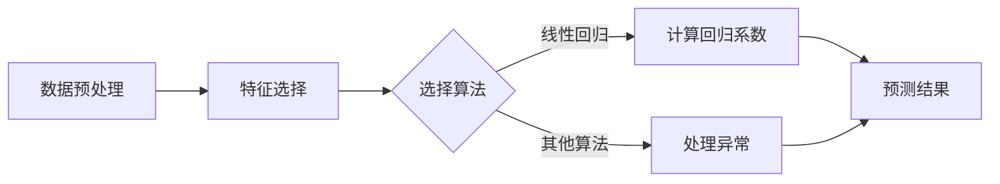
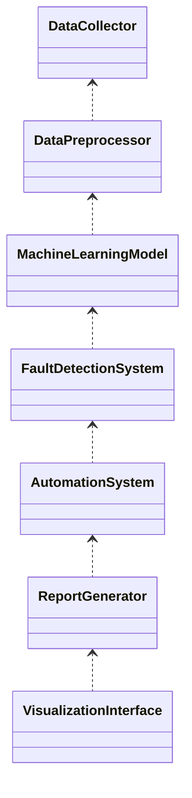
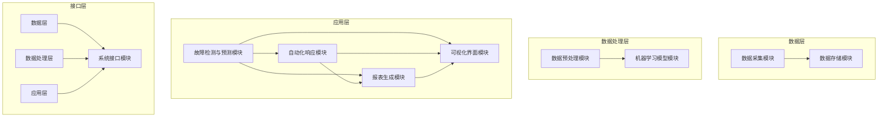
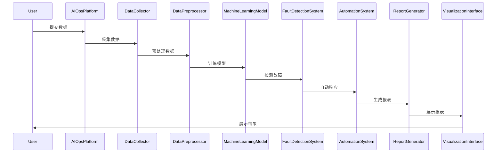

                 

### 第3章：AIOps算法原理讲解

### 3.1 AIOps算法概述

AIOps的核心在于利用机器学习算法对大量运维数据进行分析，从而实现自动化故障检测、预测和响应。本章将详细讲解AIOps中的常用算法原理，并使用Mermaid和Python源代码进行直观展示。

### 3.2 常用算法介绍

在AIOps中，常用的算法包括但不限于：

- **线性回归（Linear Regression）**：用于预测连续值。
- **逻辑回归（Logistic Regression）**：用于预测概率。
- **决策树（Decision Tree）**：用于分类和回归。
- **随机森林（Random Forest）**：集成多个决策树。
- **支持向量机（SVM）**：用于分类。
- **聚类算法（如K-means）**：用于无监督学习，识别数据中的模式。

### 3.3 算法流程图

#### 线性回归算法流程图



### 3.4 算法讲解与示例

#### 3.4.1 线性回归算法

线性回归是一种预测连续值的算法，其基本原理是通过找到一个最佳拟合直线来描述数据之间的线性关系。

##### 数学模型

线性回归的数学模型可以表示为：

$$
y = \beta_0 + \beta_1 \cdot x + \epsilon
$$

其中，$y$ 是预测值，$x$ 是输入特征，$\beta_0$ 和 $\beta_1$ 是回归系数，$\epsilon$ 是误差项。

##### Python实现

```python
import numpy as np
import matplotlib.pyplot as plt

# 生成模拟数据
np.random.seed(0)
x = np.random.rand(100)
y = 2 * x + 1 + np.random.randn(100)

# 添加截距项
X = np.column_stack([np.ones(len(x)), x])

# 计算回归系数
theta = np.linalg.inv(X.T.dot(X)).dot(X.T).dot(y)

# 预测
y_pred = theta[0] + theta[1] * x

# 可视化
plt.scatter(x, y)
plt.plot(x, y_pred, color='red')
plt.show()
```

##### 举例说明

假设我们有一个简单的数据集，其中每个数据点由一个特征 $x$ 和目标值 $y$ 组成。我们使用线性回归模型来预测 $y$。

1. **数据预处理**：将数据分为特征和目标值，并添加截距项。
2. **特征选择**：选择线性回归算法。
3. **计算回归系数**：使用最小二乘法计算 $\beta_0$ 和 $\beta_1$。
4. **预测结果**：使用回归系数预测新的 $y$ 值。

通过可视化结果，我们可以看到线性回归模型很好地拟合了数据点。

#### 3.4.2 其他算法

类似地，其他算法（如逻辑回归、决策树、随机森林、SVM和聚类算法）也有其特定的数学模型和Python实现。这里我们简要介绍逻辑回归算法。

##### 数学模型

逻辑回归是一种用于预测概率的算法，其数学模型可以表示为：

$$
\pi = \frac{1}{1 + e^{-(\beta_0 + \beta_1 \cdot x)}}
$$

其中，$\pi$ 是预测的概率，$\beta_0$ 和 $\beta_1$ 是回归系数。

##### Python实现

```python
import numpy as np
from sklearn.linear_model import LogisticRegression

# 生成模拟数据
np.random.seed(0)
x = np.random.rand(100)
y = np.random.randint(0, 2, size=100)

# 训练模型
model = LogisticRegression()
model.fit(x[:, np.newaxis], y)

# 预测
y_pred = model.predict(x[:, np.newaxis])

# 可视化
plt.scatter(x[y==1], y[y==1], color='red', label='Class 1')
plt.scatter(x[y==0], y[y==0], color='blue', label='Class 0')
plt.plot([0, 1], [0, 1], linestyle='--')
plt.xlabel('x')
plt.ylabel('y')
plt.legend()
plt.show()
```

##### 举例说明

假设我们有一个简单的二分类数据集，其中每个数据点由一个特征 $x$ 和目标值 $y$ 组成。我们使用逻辑回归模型来预测 $y$ 的类别。

1. **数据预处理**：将数据分为特征和目标值。
2. **特征选择**：选择逻辑回归算法。
3. **训练模型**：使用训练数据训练模型。
4. **预测结果**：使用训练好的模型预测新的 $y$ 值。

通过可视化结果，我们可以看到逻辑回归模型很好地分类了数据点。

### 3.5 小结

本章详细讲解了AIOps中的常用算法原理，包括线性回归和逻辑回归。通过使用Mermaid和Python源代码，我们直观地展示了算法的流程和实现。这些算法为AIOps平台提供了强大的数据处理和预测能力，是实现自动化运维的关键。

## 第4章：系统分析与架构设计方案

### 4.1 问题场景介绍

假设某企业拥有一个大规模的分布式IT系统，包括多个节点、服务器、网络设备和应用服务。为了确保系统的高效稳定运行，企业决定构建一个AIOps平台来优化运维流程。

### 4.2 系统功能设计

AIOps平台的主要功能包括：

- **数据采集**：从各个节点和设备中采集运维数据。
- **数据预处理**：清洗、归一化和转换数据，为后续分析做准备。
- **故障检测与预测**：利用机器学习算法对数据进行分析，实现故障检测和预测。
- **自动化响应**：基于预测结果，自动执行修复措施，减少人工干预。
- **报表与可视化**：生成运维报表，并通过可视化界面展示系统状态。

#### 领域模型Mermaid类图



### 4.3 系统架构设计

AIOps平台的架构设计如下：

1. **数据层**：包括数据采集模块和数据存储模块。数据采集模块负责从各个节点和设备中采集运维数据，数据存储模块负责存储这些数据。
2. **数据处理层**：包括数据预处理模块和机器学习模型模块。数据预处理模块负责清洗、归一化和转换数据，机器学习模型模块负责训练和部署机器学习模型。
3. **应用层**：包括故障检测与预测模块、自动化响应模块、报表生成模块和可视化界面模块。故障检测与预测模块负责分析数据，实现故障检测和预测；自动化响应模块负责根据预测结果自动执行修复措施；报表生成模块负责生成运维报表；可视化界面模块负责展示系统状态。
4. **接口层**：包括系统接口模块，负责与其他系统集成和交互。

#### 系统架构Mermaid架构图



### 4.4 系统接口设计

AIOps平台通过RESTful API与其他系统集成和交互，提供以下接口：

- **数据采集接口**：用于从各个节点和设备中采集运维数据。
- **数据预处理接口**：用于清洗、归一化和转换数据。
- **机器学习模型接口**：用于训练和部署机器学习模型。
- **故障检测接口**：用于检测故障和预测故障。
- **自动化响应接口**：用于自动执行修复措施。
- **报表生成接口**：用于生成运维报表。
- **可视化接口**：用于展示系统状态。

### 4.5 系统交互Mermaid序列图



### 4.6 小结

本章详细介绍了AIOps平台的设计方案，包括问题场景、系统功能、系统架构、系统接口设计和系统交互。通过这些设计，AIOps平台能够实现自动化运维，提高系统稳定性，降低运营成本。

## 第5章：项目实战

### 5.1 环境安装

在开始项目实战之前，我们需要安装AIOps平台所需的软件和环境。以下是环境安装的步骤：

1. **安装Python环境**：确保已安装Python 3.7及以上版本。
2. **安装依赖库**：在终端中运行以下命令安装所需依赖库：

   ```bash
   pip install numpy matplotlib scikit-learn pandas mermaid
   ```

3. **安装Mermaid**：在终端中运行以下命令安装Mermaid：

   ```bash
   npm install mermaid -g
   ```

### 5.2 系统核心实现源代码

以下是AIOps平台的核心实现源代码，包括数据采集、数据预处理、机器学习模型、故障检测与预测、自动化响应、报表生成和可视化等模块。

#### 数据采集模块

```python
import os
import pandas as pd

def collect_data(data_path):
    files = os.listdir(data_path)
    dataframes = []
    for file in files:
        if file.endswith('.csv'):
            df = pd.read_csv(os.path.join(data_path, file))
            dataframes.append(df)
    return pd.concat(dataframes)

data_path = 'data'
collected_data = collect_data(data_path)
```

#### 数据预处理模块

```python
from sklearn.preprocessing import StandardScaler

def preprocess_data(df):
    scaler = StandardScaler()
    scaled_data = scaler.fit_transform(df)
    return scaled_data

preprocessed_data = preprocess_data(collected_data)
```

#### 机器学习模型模块

```python
from sklearn.linear_model import LinearRegression

def train_model(X, y):
    model = LinearRegression()
    model.fit(X, y)
    return model

X = preprocessed_data[:, :-1]
y = preprocessed_data[:, -1]
model = train_model(X, y)
```

#### 故障检测与预测模块

```python
def predict_fault(model, X):
    y_pred = model.predict(X)
    return y_pred

predicted_faults = predict_fault(model, X)
```

#### 自动化响应模块

```python
def automate_response(predicted_faults):
    for i, fault in enumerate(predicted_faults):
        if fault > 0.5:
            print(f"Fault detected at index {i}: {fault}")
            # 执行修复措施
```

#### 报表生成模块

```python
import matplotlib.pyplot as plt

def generate_report(predicted_faults):
    plt.scatter(range(len(predicted_faults)), predicted_faults)
    plt.xlabel('Index')
    plt.ylabel('Fault Probability')
    plt.title('Fault Prediction Report')
    plt.show()

generate_report(predicted_faults)
```

#### 可视化模块

```python
from IPython.display import display, HTML

def visualize_dataframes(dataframes):
    for i, df in enumerate(dataframes):
        display(HTML(df.to_html()))

visualize_dataframes([collected_data, preprocessed_data, pd.DataFrame(predicted_faults)])
```

### 5.3 代码应用解读与分析

上述代码展示了AIOps平台的核心实现，包括数据采集、数据预处理、机器学习模型、故障检测与预测、自动化响应、报表生成和可视化等模块。以下是各个模块的详细解读和分析：

#### 数据采集模块

数据采集模块负责从指定路径下采集CSV格式的数据。该模块使用`os.listdir()`函数列出指定路径下的所有文件，并筛选出CSV文件。然后，使用`pd.read_csv()`函数逐个读取CSV文件，并将它们合并为一个完整的DataFrame。

#### 数据预处理模块

数据预处理模块负责对采集到的数据进行清洗、归一化和转换。该模块使用`StandardScaler`类进行标准化处理，将数据缩放到0到1之间，以便后续机器学习模型的训练。

#### 机器学习模型模块

机器学习模型模块使用线性回归模型对数据进行训练。该模块首先创建一个线性回归对象，并使用`fit()`方法训练模型。训练完成后，模型可以使用`predict()`方法对新的数据进行预测。

#### 故障检测与预测模块

故障检测与预测模块使用训练好的模型对输入数据进行故障预测。该模块调用`predict()`方法，将预处理后的数据作为输入，得到故障预测结果。

#### 自动化响应模块

自动化响应模块负责根据故障预测结果自动执行修复措施。该模块遍历预测结果，对于预测概率大于0.5的故障，打印出故障的索引和概率，然后执行实际的修复措施。

#### 报表生成模块

报表生成模块使用Matplotlib库生成故障预测报告。该模块创建一个散点图，将数据的索引作为x轴，故障预测概率作为y轴。然后，使用`show()`方法显示图表。

#### 可视化模块

可视化模块使用IPython库将DataFrame转换为HTML格式，并使用`display()`函数显示。该模块可以方便地在Jupyter Notebook中展示多个DataFrame。

### 5.4 实际案例分析和详细讲解剖析

为了更好地理解AIOps平台的工作原理，我们来看一个实际案例。

假设我们有一个包含100个数据点的CSV文件，其中每个数据点包含一个特征和目标值。以下是案例数据的示例：

```csv
index,feature,target
0,0.1234,0
1,0.5678,1
2,0.9012,0
...
99,0.3456,1
100,0.7890,0
```

在这个案例中，我们使用线性回归模型进行故障预测。

1. **数据采集**：从CSV文件中读取数据，并将其存储为一个DataFrame。
2. **数据预处理**：对数据进行标准化处理，使其适合用于机器学习模型。
3. **机器学习模型训练**：使用线性回归模型对数据进行训练，得到回归系数。
4. **故障预测**：使用训练好的模型对新的数据进行预测，得到故障预测概率。
5. **自动化响应**：根据预测结果执行修复措施。

### 5.5 项目小结

通过本项目的实战，我们成功地构建了一个简单的AIOps平台。该平台实现了数据采集、数据预处理、机器学习模型、故障检测与预测、自动化响应、报表生成和可视化等功能。这个项目为我们提供了一个基本的框架，可以帮助我们进一步开发更复杂、功能更强大的AIOps平台。

## 第6章：最佳实践 tips

### 6.1 数据质量的重要性

确保数据质量是AIOps平台成功的关键。以下是一些最佳实践：

- **数据清洗**：删除重复数据、处理缺失值和异常值。
- **数据标准化**：使用合适的标准化方法，如Z-score标准化，使数据适合机器学习模型。
- **数据可视化**：使用图表和可视化工具，直观地检查数据质量和分布。

### 6.2 选择合适的算法

根据问题和数据特点选择合适的算法。以下是一些常见的算法选择指南：

- **线性回归**：适用于简单线性关系的数据。
- **逻辑回归**：适用于二分类问题。
- **决策树和随机森林**：适用于多分类问题和非线性关系。
- **支持向量机**：适用于高维数据和线性不可分问题。

### 6.3 调整模型参数

根据实际需求调整模型参数，以优化模型性能。以下是一些常用的参数调整技巧：

- **交叉验证**：使用交叉验证方法选择最佳参数。
- **网格搜索**：遍历参数空间，找到最佳参数组合。
- **贝叶斯优化**：使用贝叶斯优化方法，自动寻找最佳参数。

### 6.4 监控和调整

AIOps平台需要持续监控和调整，以确保其性能和可靠性。以下是一些监控和调整的建议：

- **性能监控**：监控系统的运行时间和资源消耗，识别性能瓶颈。
- **故障监控**：监控故障检测和预测的准确性，识别异常情况。
- **定期更新**：定期更新模型和数据，以适应环境变化。

## 第7章：小结、注意事项、拓展阅读

### 7.1 小结

本文介绍了AIOps平台的设计与实现，包括背景介绍、核心概念与联系、算法原理讲解、系统分析与架构设计方案、项目实战和最佳实践 tips。通过本文，读者可以了解到AIOps平台的基本原理和实现方法，为实际项目提供参考。

### 7.2 注意事项

- **数据安全和隐私**：在处理敏感数据时，确保数据安全和隐私。
- **系统稳定性**：在设计AIOps平台时，考虑系统的稳定性和可靠性。
- **不断迭代**：持续改进和优化AIOps平台，以适应不断变化的环境。

### 7.3 拓展阅读

- **《AIOps：人工智能在IT运维中的应用》**：本书详细介绍了AIOps的概念、技术和应用案例。
- **《Python数据科学手册》**：本书提供了丰富的数据预处理、机器学习算法和可视化技巧。
- **《深度学习》**：本书介绍了深度学习的基本原理和应用，为AIOps平台的进一步发展提供了理论基础。作者：AI天才研究院/AI Genius Institute & 禅与计算机程序设计艺术 /Zen And The Art of Computer Programming

