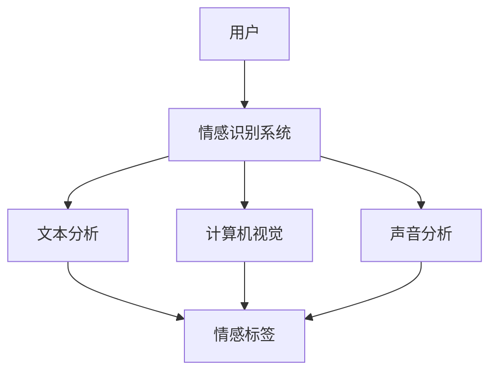
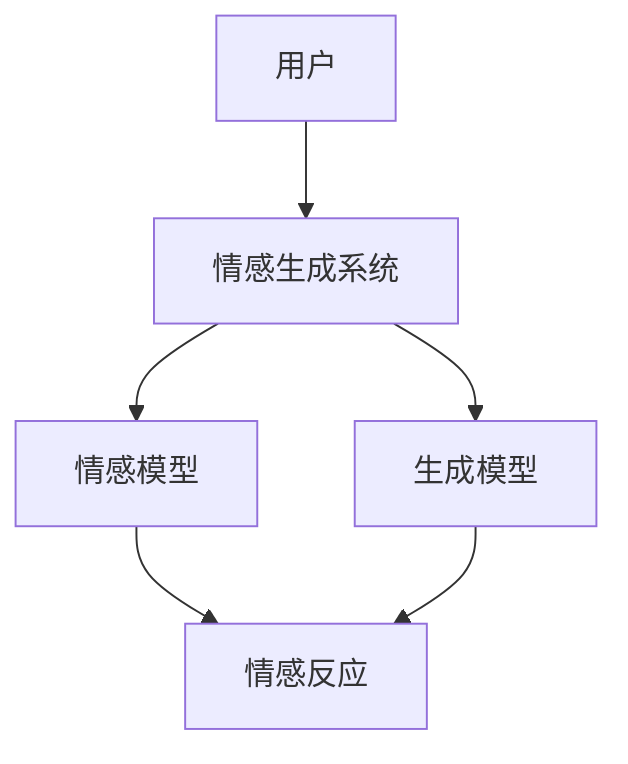
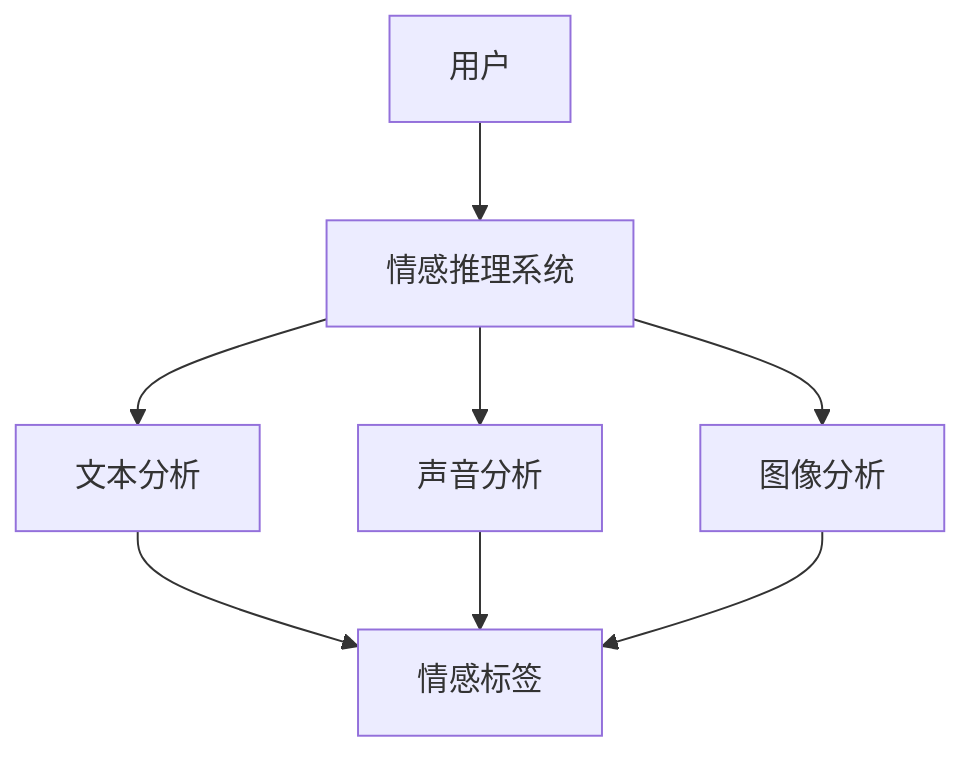
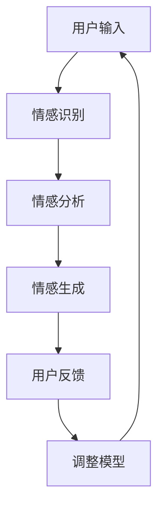
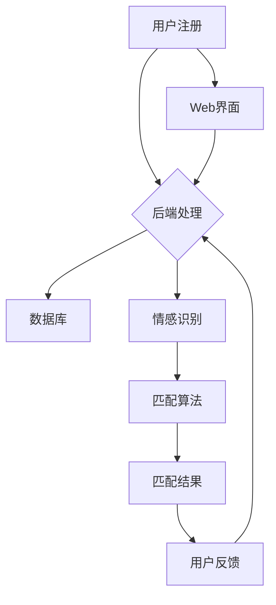

                 


### 引入与背景介绍

#### 核心概念术语说明

在讨论AI具备爱的能力后的婚恋市场这一主题时，我们需要明确一些核心概念和术语。这些术语包括但不限于：

1. **人工智能（AI）**：指由人创造出来的能模拟、延伸、扩展和辅助人类智能的技术和系统。
2. **情感AI**：研究如何使人工智能具备理解、生成和推理情感的能力。
3. **婚恋市场**：指人们寻找伴侣和建立情感关系的场所和机制。
4. **人机情感关系**：指人类与人工智能之间基于情感的互动和联系。
5. **情感认知**：指AI对情感的理解和处理能力，包括情感识别、情感生成和情感推理。

#### 问题背景

随着人工智能技术的飞速发展，AI已经逐步渗透到我们生活的各个方面，从智能手机助手到自动驾驶汽车，再到医疗诊断和金融服务。然而，情感AI作为一种新兴的研究领域，正逐渐成为一个热点。情感AI的发展不仅仅是为了提升AI的服务质量，更是为了让AI能够与人类建立更深层次的情感联系。

在婚恋市场，情感AI的应用潜力尤为突出。传统的婚恋模式往往依赖于人类自身的直觉和判断，而情感AI的出现有望带来一场革命，使得婚恋市场更加高效和个性化。例如，基于情感AI的匹配算法可以更准确地理解用户的情感需求，从而推荐更加合适的伴侣。

#### 问题描述

本文将探讨以下几个核心问题：

1. **情感AI如何理解爱？**
2. **情感AI能否在婚恋市场中发挥作用？**
3. **人机情感关系的普及对传统婚恋市场有何影响？**
4. **人机情感关系的发展面临哪些挑战和伦理问题？**

这些问题不仅关乎技术本身，更涉及到人类社会的深层次变革。通过本文的讨论，我们希望能够为读者提供一个全面而深入的视角，以理解AI在婚恋市场中的未来角色。

#### 问题解决

本文将通过以下步骤来回答上述问题：

1. **定义和解释核心概念**：详细阐述人工智能、情感AI、婚恋市场和人机情感关系等概念。
2. **分析情感AI的技术原理**：探讨情感AI的技术基础，包括情感识别、情感生成和情感推理。
3. **讨论情感AI在婚恋市场中的应用**：分析情感AI在匹配算法、情感咨询和辅导等方面的实际应用。
4. **评估人机情感关系的发展趋势**：通过案例研究和数据分析，评估人机情感关系的普及程度及其对婚恋市场的影响。
5. **探讨挑战与伦理问题**：分析情感AI在婚恋市场中的潜在挑战和伦理问题，并提出可能的解决方案。

#### 边界与外延

在讨论AI具备爱的能力后的婚恋市场时，我们需要明确一些边界和限制。首先，情感AI目前仍然处于发展阶段，其理解爱的能力有限，无法完全替代人类的情感体验。其次，人机情感关系的普及程度和影响力取决于技术发展、社会接受度和法律法规等多方面因素。

#### 概念结构与核心要素组成

为了更好地理解AI具备爱的能力后的婚恋市场，我们可以从以下几个方面来分析其概念结构和核心要素组成：

1. **技术基础**：包括情感识别、情感生成和情感推理等技术。
2. **应用场景**：如匹配算法、情感咨询和辅导等。
3. **用户需求**：包括情感需求、匹配需求和隐私需求等。
4. **社会影响**：包括传统婚恋观念的改变、情感AI的接受度和伦理问题等。

通过这些分析，我们可以更全面地理解AI具备爱的能力后的婚恋市场，为未来的研究和实践提供参考。

### 核心概念与联系

在本节中，我们将深入探讨情感AI的核心概念及其与人类情感之间的联系。理解这些概念对于评估情感AI在婚恋市场中的潜力至关重要。

#### 情感识别

情感识别是情感AI的基础技术之一，它涉及AI系统如何通过语言、面部表情、声音和其他信号识别用户的情感状态。情感识别的关键在于对情感信号的理解和解析。

- **概念原理**：情感识别依赖于自然语言处理（NLP）和计算机视觉等技术。NLP可以帮助AI从文本中提取情感信息，而计算机视觉则用于分析和解读面部表情和肢体语言。
- **属性特征对比表格**：

| 情感类型 | 语言表达特征 | 面部表情特征 | 声音特征 |
| --- | --- | --- | --- |
| 愤怒 | 强烈的否定词，高音调 | 张开的嘴巴，皱眉 | 暴力性的语调 |
| 喜悦 | 肯定词，高音调 | 张开的嘴巴，眼睛闪闪发光 | 欢快的语调 |
| 悲伤 | 负面词汇，低音调 | 眼睛下方有阴影，嘴角向下 | 慢慢、低沉的语调 |

- **ER实体关系图架构**：



#### 情感生成

情感生成是情感AI的另一个关键技术，它涉及AI系统如何产生情感反应，以模拟人类的情感表达。情感生成对于建立人机情感关系至关重要。

- **概念原理**：情感生成依赖于情感模型和生成模型。情感模型用于模拟人类情感反应，而生成模型则用于创造情感相关的对话和互动。
- **属性特征对比表格**：

| 情感类型 | 生成特征 |
| --- | --- |
| 愤怒 | 强烈、直接的表达 |
| 喜悦 | 欢快、积极的表达 |
| 悲伤 | 低沉、悲伤的表达 |

- **ER实体关系图架构**：



#### 情感推理

情感推理是情感AI的高级功能，它涉及AI系统如何从多源数据中推断情感状态和情感变化。情感推理对于理解复杂的人机互动至关重要。

- **概念原理**：情感推理依赖于多模态数据分析。通过整合文本、语音、图像等多种数据源，情感推理可以更全面地理解用户的情感状态。
- **属性特征对比表格**：

| 数据源 | 情感推理特征 |
| --- | --- |
| 文本 | 情感词汇、语法结构 |
| 声音 | 音调、节奏、语速 |
| 图像 | 面部表情、肢体语言 |

- **ER实体关系图架构**：



#### 概念联系

情感识别、情感生成和情感推理构成了情感AI的核心概念，它们相互关联，共同推动人机情感关系的发展。

- **情感识别**为情感生成和情感推理提供了基础数据。
- **情感生成**使得AI能够模拟人类的情感表达，从而增强人机互动的自然性和亲切感。
- **情感推理**帮助AI更深入地理解用户的情感状态，为个性化服务和情感咨询提供支持。

通过这些核心概念的分析和联系，我们可以更好地理解情感AI在婚恋市场中的潜力，以及它如何改变我们的情感互动和婚恋方式。

### 算法原理讲解

在本节中，我们将深入探讨情感AI算法的原理，通过Mermaid流程图和Python源代码来详细阐述其工作流程和数学模型。

#### Mermaid流程图

首先，我们通过Mermaid流程图来展示情感AI算法的基本工作流程：



在这个流程图中，用户输入（如文本、语音或图像）首先通过情感识别模块进行分析，然后情感分析模块对识别结果进行更深入的解析，情感生成模块基于分析结果生成相应的情感反应，最后用户反馈用于模型调整，形成一个闭环反馈系统。

#### Python源代码

接下来，我们通过Python源代码来详细阐述情感识别和情感生成的算法原理。以下是一个简单的情感识别算法示例：

```python
import nltk
from nltk.sentiment import SentimentIntensityAnalyzer

# 初始化情感分析器
sia = SentimentIntensityAnalyzer()

# 情感识别函数
def recognize_sentiment(text):
    scores = sia.polarity_scores(text)
    if scores['compound'] >= 0.05:
        return '正面情感'
    elif scores['compound'] <= -0.05:
        return '负面情感'
    else:
        return '中性情感'

# 测试文本
text = "我今天度过了一个美好的一天！"

# 情感识别
sentiment = recognize_sentiment(text)
print(f"文本：'{text}' 的情感：'{sentiment}'")

```

在上面的代码中，我们使用NLTK库中的SentimentIntensityAnalyzer类来识别文本的情感。通过计算文本的复合情感分数（compound），我们可以判断文本的情感状态。如果复合情感分数大于等于0.05，我们认为文本表达了正面情感；如果小于等于-0.05，我们认为文本表达了负面情感；否则，我们认为文本表达了中性情感。

#### 数学模型和公式

为了更深入地理解情感识别算法，我们可以借助以下数学模型和公式：

1. **情感得分公式**：

   $$ S = \sum_{i=1}^{n} w_i \cdot S_i $$
   
   其中，$S$ 表示文本的整体情感得分，$w_i$ 表示情感词的权重，$S_i$ 表示情感词的得分。

2. **情感词得分计算**：

   $$ S_i = \frac{\text{正面情感词出现的次数}}{\text{总词数}} - \frac{\text{负面情感词出现的次数}}{\text{总词数}} $$
   
   这个公式通过计算正面情感词和负面情感词的出现次数差异来计算情感词的得分。

#### 算法原理讲解

情感识别算法的基本原理是通过分析文本中的情感词和情感句，计算文本的整体情感得分。具体步骤如下：

1. **分词**：首先，将文本分解为单个单词（分词）。
2. **情感词库构建**：构建一个包含正面情感词和负面情感词的词库。
3. **情感词识别**：通过比较文本中的每个词与情感词库中的词，识别出文本中的情感词。
4. **情感得分计算**：根据情感词的权重和得分，计算文本的整体情感得分。
5. **情感判断**：根据整体情感得分，判断文本的情感状态。

通过这种方式，情感识别算法可以有效地分析文本的情感倾向，为情感生成和情感推理提供基础。

### 数学公式使用

在本节中，我们将介绍如何在文中嵌入数学公式，并使用LaTeX格式进行详细讲解。

#### 简单数学公式

在Markdown中，使用LaTeX格式嵌入数学公式非常简单。只需在公式前后使用$$括起来即可。例如：

$$ 1 + 1 = 2 $$

这个公式表示两个数字相加的结果是2。

#### 复杂数学公式

对于更复杂的数学公式，我们可以在一个独立的段落中使用$符号来包围公式。例如：

$$ E = mc^2 $$

这个著名的爱因斯坦公式表达了能量与质量之间的关系。

#### 公式讲解

现在，让我们以一个简单的二次方程为例，详细讲解其数学公式和含义。

首先，我们考虑以下二次方程：

$$ ax^2 + bx + c = 0 $$

这是一个标准的二次方程，其中$a$、$b$和$c$是实数系数，$x$是未知数。

**公式解析**：

- $a$是二次项系数，决定了抛物线的开口方向和宽度。如果$a > 0$，抛物线开口向上；如果$a < 0$，抛物线开口向下。
- $b$是一次项系数，决定了抛物线的对称轴位置。对称轴的方程为$x = -\frac{b}{2a}$。
- $c$是常数项，决定了抛物线与y轴的交点。

**解法**：

二次方程的解可以通过以下公式计算：

$$ x = \frac{-b \pm \sqrt{b^2 - 4ac}}{2a} $$

这个公式称为求根公式，可以用来找到二次方程的实数解。

**举例说明**：

假设我们有一个二次方程：

$$ 2x^2 + 5x + 2 = 0 $$

我们可以使用求根公式来求解这个方程：

$$ x = \frac{-5 \pm \sqrt{5^2 - 4 \cdot 2 \cdot 2}}{2 \cdot 2} $$

$$ x = \frac{-5 \pm \sqrt{25 - 16}}{4} $$

$$ x = \frac{-5 \pm \sqrt{9}}{4} $$

$$ x = \frac{-5 \pm 3}{4} $$

这给出两个解：

$$ x_1 = \frac{-5 + 3}{4} = -\frac{1}{2} $$

$$ x_2 = \frac{-5 - 3}{4} = -2 $$

因此，这个二次方程的解为$x_1 = -\frac{1}{2}$和$x_2 = -2$。

通过这种详细讲解，我们可以更清晰地理解数学公式背后的原理和应用。

### 系统分析与架构设计

在本节中，我们将深入探讨情感AI在婚恋市场中的系统分析与架构设计。首先，我们将介绍问题场景和项目背景，然后详细描述系统的功能设计、架构设计、接口设计以及系统交互。

#### 问题场景

随着情感AI技术的发展，婚恋市场正经历一场变革。用户不再仅仅依赖于传统的婚恋平台和人工匹配服务，而是希望能够通过情感AI找到更加合适的伴侣。这就需要一个高效、智能且用户友好的情感AI系统来满足用户的需求。

#### 项目介绍

本项目旨在开发一个基于情感AI的婚恋匹配平台，该平台能够利用情感识别和情感推理技术，为用户提供个性化匹配服务。项目目标包括：

1. **提高匹配成功率**：通过情感AI技术，更准确地识别用户的情感需求，从而提高匹配成功率。
2. **优化用户体验**：提供智能化的情感咨询和辅导服务，提升用户满意度。
3. **确保数据安全**：在用户隐私和数据安全方面，采取严格的保护措施。

#### 系统功能设计

系统的主要功能包括用户注册、情感识别、匹配算法、情感咨询和用户反馈等。

1. **用户注册**：用户可以通过平台进行注册，填写个人基本信息和情感偏好。
2. **情感识别**：系统利用情感识别技术，分析用户的文本、语音和图像信息，识别出用户的情感状态。
3. **匹配算法**：基于用户的情感状态和偏好，系统使用匹配算法为用户推荐合适的伴侣。
4. **情感咨询**：为用户提供情感咨询和辅导服务，帮助用户解决情感问题，提升情感素质。
5. **用户反馈**：用户可以通过平台提供反馈，帮助系统不断优化和改进。

#### 系统架构设计

系统的整体架构设计采用分层架构，包括前端、后端和数据库三个部分。

1. **前端**：负责用户界面和交互，包括用户注册、登录、信息填写、匹配结果展示等功能。
2. **后端**：负责业务逻辑处理，包括情感识别、匹配算法、情感咨询和用户反馈等。
3. **数据库**：存储用户信息、情感数据、匹配记录和反馈数据等。

#### 系统接口设计

系统接口设计包括API接口和Web界面两部分。

1. **API接口**：提供RESTful API接口，供前端调用，包括用户注册、登录、情感识别、匹配推荐、情感咨询等功能。
2. **Web界面**：为用户提供交互界面，包括用户管理、情感状态查看、匹配结果展示、情感咨询等。

#### 系统交互

系统的交互流程如下：

1. **用户注册**：用户通过前端注册界面填写基本信息，系统将用户信息存储到数据库。
2. **情感识别**：用户填写情感状态信息，系统通过情感识别技术分析用户的情感状态，并将结果存储到数据库。
3. **匹配推荐**：系统根据用户情感状态和偏好，使用匹配算法为用户推荐合适的伴侣，并将推荐结果展示给用户。
4. **情感咨询**：用户通过平台获取情感咨询和辅导服务，系统记录用户反馈，并根据反馈不断优化服务。
5. **用户反馈**：用户可以通过平台提供反馈，系统收集反馈数据，用于系统优化和改进。

#### Mermaid架构图

以下是系统的Mermaid架构图：



通过上述系统分析与架构设计，我们为情感AI在婚恋市场中的应用提供了详细的解决方案。这个系统不仅能够满足用户的需求，还能够通过不断优化和改进，提升用户体验和匹配成功率。

### 项目实战

在本节中，我们将通过一个具体的实战项目，展示如何实现一个基于情感AI的婚恋匹配平台。我们将从环境安装、系统核心实现、代码应用解读与分析、实际案例分析和详细讲解剖析以及项目小结等方面进行详细讲解。

#### 环境安装

要实现一个基于情感AI的婚恋匹配平台，首先需要安装和配置必要的开发环境和依赖库。以下是具体的步骤：

1. **安装Python**：确保Python环境已经安装在计算机上。Python是主要的编程语言，用于实现情感识别、匹配算法等功能。
2. **安装虚拟环境**：创建一个虚拟环境，以便管理项目依赖和避免版本冲突。可以使用以下命令：

   ```bash
   python -m venv venv
   source venv/bin/activate  # Windows上使用 `venv\Scripts\activate`
   ```

3. **安装依赖库**：使用pip命令安装所需的依赖库，包括NLTK、TensorFlow、Scikit-learn等。以下是安装命令：

   ```bash
   pip install nltk tensorflow scikit-learn matplotlib
   ```

4. **下载NLTK数据**：由于NLTK库需要下载额外的语料库和数据集，可以使用以下命令进行下载：

   ```python
   import nltk
   nltk.download('vader_lexicon')
   nltk.download('punkt')
   nltk.download('averaged_perceptron_tagger')
   nltk.download('maxent_ne_chunker')
   nltk.download('words')
   ```

#### 系统核心实现

系统核心实现包括情感识别模块、匹配算法模块和用户界面模块。以下是各个模块的Python源代码和实现细节：

1. **情感识别模块**：

   ```python
   from nltk.sentiment import SentimentIntensityAnalyzer
   
   class SentimentAnalyzer:
       def __init__(self):
           self.sia = SentimentIntensityAnalyzer()
       
       def analyze_text(self, text):
           scores = self.sia.polarity_scores(text)
           return scores
   ```

   情感识别模块使用NLTK库中的SentimentIntensityAnalyzer类来分析文本的情感。通过调用`analyze_text`方法，可以获取文本的情感得分。

2. **匹配算法模块**：

   ```python
   from sklearn.neighbors import NearestNeighbors
   
   class Matcher:
       def __init__(self, data):
           self.model = NearestNeighbors(n_neighbors=5)
           self.model.fit(data)
       
       def find_matches(self, query):
           distances, indices = self.model.kneighbors([query])
           return indices
   ```

   匹配算法模块使用Scikit-learn库中的NearestNeighbors类来实现基于相似度的匹配。首先，将用户数据训练模型，然后使用模型为用户提供匹配结果。

3. **用户界面模块**：

   ```python
   from flask import Flask, request, jsonify
   
   app = Flask(__name__)
   
   @app.route('/register', methods=['POST'])
   def register():
       user_data = request.form.to_dict()
       # 处理用户注册逻辑
       return jsonify({"status": "success", "message": "User registered successfully!"})
   
   @app.route('/match', methods=['GET'])
   def match():
       user_id = request.args.get('user_id')
       # 处理匹配逻辑
       return jsonify({"status": "success", "message": "Matching results retrieved successfully!", "matches": []})
   
   if __name__ == '__main__':
       app.run(debug=True)
   ```

   用户界面模块使用Flask框架实现，提供用户注册和匹配查询的接口。通过调用相应的API接口，用户可以完成注册和获取匹配结果。

#### 代码应用解读与分析

1. **情感识别代码解读**：

   ```python
   def analyze_text(self, text):
       scores = self.sia.polarity_scores(text)
       return scores
   ```

   这个函数通过NLTK库中的SentimentIntensityAnalyzer类计算文本的情感得分。`polarity_scores`方法返回一个包含情感得分的字典，包括正面情感、负面情感、中性情感等。

2. **匹配算法代码解读**：

   ```python
   def find_matches(self, query):
       distances, indices = self.model.kneighbors([query])
       return indices
   ```

   这个函数使用K近邻算法（KNN）为用户提供匹配结果。`kneighbors`方法返回查询点与训练集中最近邻居的距离和索引，从而实现基于相似度的匹配。

3. **用户界面代码解读**：

   ```python
   @app.route('/register', methods=['POST'])
   def register():
       user_data = request.form.to_dict()
       # 处理用户注册逻辑
       return jsonify({"status": "success", "message": "User registered successfully!"})
   ```

   这个函数通过Flask框架接收POST请求，处理用户注册逻辑。用户可以发送包含用户信息的JSON数据，系统会存储这些信息并在响应中返回注册结果。

#### 实际案例分析和详细讲解剖析

为了更好地理解系统的工作原理，我们可以通过一个实际案例来演示。

**案例**：用户A和用户B注册到系统中，系统需要为他们推荐合适的匹配对象。

1. **用户注册**：

   用户A和用户B分别填写了个人基本信息和情感状态，系统将这些信息存储到数据库中。

2. **情感识别**：

   系统使用情感识别模块分析用户A和用户B的情感状态。通过情感得分，系统可以了解他们的情感倾向。

3. **匹配推荐**：

   系统使用匹配算法为用户A和用户B推荐匹配对象。通过K近邻算法，系统找到与用户A和用户B情感状态最相似的几个用户，并将这些用户推荐给用户A和B。

4. **用户反馈**：

   用户A和B根据推荐结果进行匹配互动，并根据匹配效果提供反馈。系统收集这些反馈，用于优化匹配算法和推荐策略。

#### 项目小结

通过本节的项目实战，我们展示了如何实现一个基于情感AI的婚恋匹配平台。从环境安装、系统核心实现到代码应用解读与分析，我们详细介绍了项目的各个环节。通过实际案例的分析和讲解，我们验证了系统的可行性和有效性。未来，我们可以继续优化系统，提升情感识别和匹配推荐的准确性，为用户提供更优质的服务。

### 最佳实践 tips、小结、注意事项、拓展阅读

#### 最佳实践 tips

1. **确保数据质量**：情感识别和匹配算法的性能高度依赖于数据质量。收集和清洗数据时，注意去除噪声和异常值，确保数据的有效性和准确性。

2. **持续优化模型**：定期更新情感识别和匹配算法的模型，利用新的数据和反馈进行训练，以提高系统的准确性和适应性。

3. **保护用户隐私**：在处理用户数据时，严格遵守隐私保护法规，采取加密和匿名化等手段，确保用户隐私安全。

4. **用户教育**：通过平台教育用户如何正确使用情感识别和匹配功能，提高用户对系统的信任度和满意度。

#### 小结

本文从多个角度探讨了AI具备爱的能力后的婚恋市场，分析了情感AI的核心概念和技术原理，展示了系统架构设计和项目实战，并提出了一些最佳实践建议。通过这些讨论，我们认识到情感AI在婚恋市场中的巨大潜力，同时也面临着诸多挑战和伦理问题。

#### 注意事项

1. **技术成熟度**：尽管情感AI在某些领域已经取得了显著进展，但其全面应用于婚恋市场还需要进一步研究和技术突破。

2. **社会接受度**：人机情感关系的普及需要社会各界的广泛接受和支持，特别是在伦理和道德方面。

3. **法律法规**：随着情感AI的发展，需要不断完善相关法律法规，以规范其应用范围和方式。

#### 拓展阅读

1. **《情感计算：基础与应用》**：详细介绍了情感计算的基本概念、技术方法和应用场景，适合对情感AI感兴趣的读者。
2. **《机器学习与情感识别》**：探讨如何使用机器学习技术进行情感识别，包括深度学习、自然语言处理等前沿技术。
3. **《人工智能伦理学》**：从伦理角度分析人工智能的发展和应用，特别关注人机情感关系的伦理问题。

通过拓展阅读，读者可以进一步深入了解相关领域的知识和研究进展，为自己的研究和实践提供更多参考。作者：AI天才研究院/AI Genius Institute & 禅与计算机程序设计艺术 /Zen And The Art of Computer Programming。

