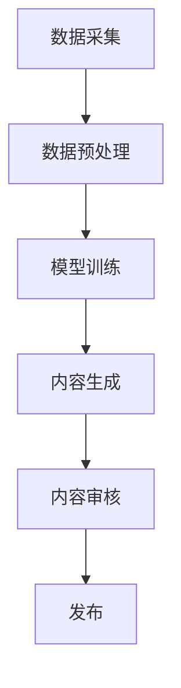
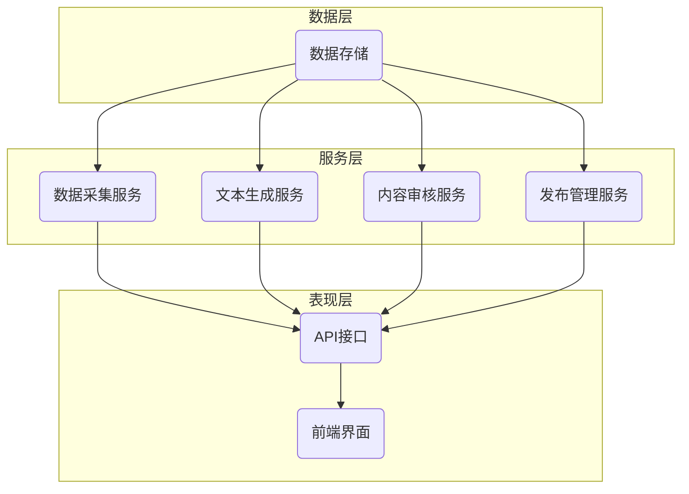
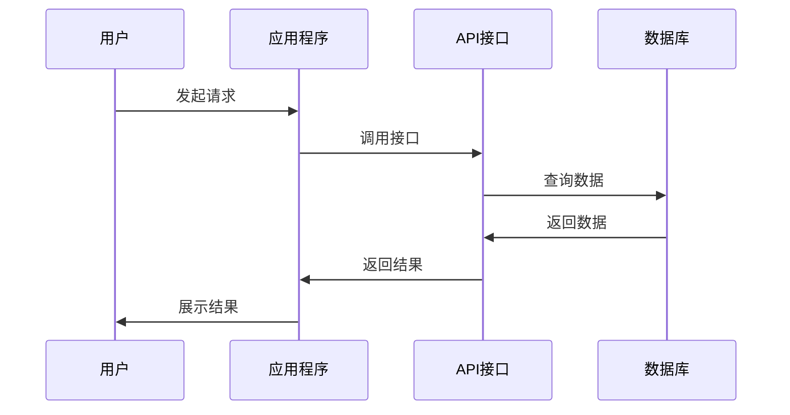
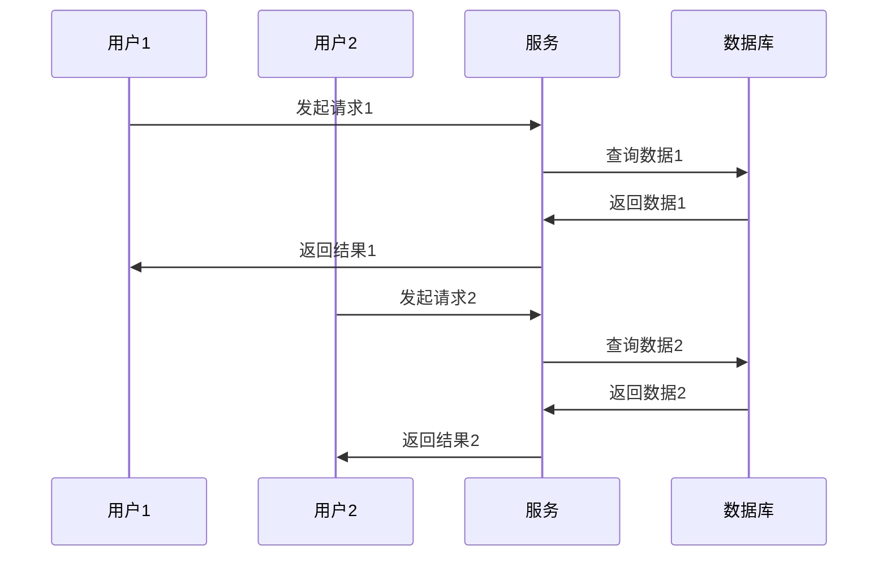

                 

### AI在新闻媒体中的应用：自动化报道与内容生成

> 关键词：人工智能、新闻媒体、自动化报道、内容生成、自然语言处理、机器学习

> 摘要：本文深入探讨了人工智能（AI）在新闻媒体中的应用，特别是自动化报道与内容生成的技术实现。文章首先介绍了AI与新闻媒体结合的背景和问题，随后详细阐述了AI的核心技术原理，包括机器学习、自然语言处理和数据挖掘。接着，文章通过具体的算法原理讲解，展示了自动化报道与内容生成的技术实现流程，并通过Python代码和数学公式详细剖析了这些算法的原理。此外，文章还介绍了系统分析与架构设计、项目实战以及最佳实践和注意事项，为读者提供了全面而深入的AI在新闻媒体应用的理解和实践指导。

#### 一、背景介绍

##### 第1章：AI与新闻媒体概述

##### 1.1 问题背景

在当今的信息时代，新闻媒体行业正面临着前所未有的挑战。随着互联网和移动设备的普及，信息量的爆炸性增长导致了新闻行业的竞争加剧。传统新闻机构不仅需要应对信息过载的困境，还要处理人力成本高、时效性要求严格的挑战。此外，新闻编辑和记者的工作压力也在不断增加。因此，寻找一种高效、智能的解决方案来提升新闻生产的效率和准确性，已经成为新闻行业亟待解决的问题。

##### 1.2 AI技术的发展与应用

随着人工智能技术的飞速发展，其在新闻媒体中的应用也逐渐得到推广。人工智能可以处理海量数据，从不同来源收集新闻资讯，自动生成新闻报道，并且在极短的时间内完成编辑和发布。这种技术不仅能够降低人力成本，还能提高新闻的时效性和准确性。例如，机器学习算法可以通过分析大量历史新闻数据，预测未来可能发生的热点事件，从而提前进行报道准备。自然语言处理技术则能够自动提取和生成新闻文本，实现自动化报道。

##### 1.3 问题描述

AI在新闻媒体中的应用场景非常广泛，主要包括以下几个方面：

1. **自动化报道**：利用机器学习和自然语言处理技术，自动从数据源中提取新闻信息，生成新闻报道。
2. **内容生成**：基于已有数据和模板，通过人工智能算法自动生成新闻内容，例如财经报道、体育赛事报道等。
3. **内容审核**：使用自然语言处理技术对新闻内容进行审核，识别和过滤不良信息，确保新闻质量。
4. **数据分析**：通过数据挖掘技术，分析新闻数据，提取有价值的信息，为新闻编辑提供决策支持。

尽管AI在新闻媒体中的应用具有巨大的潜力，但也面临着一些挑战。例如，如何确保自动化生成内容的准确性和客观性？如何处理多语言和跨文化的新闻内容？此外，AI在新闻媒体中的应用还涉及到伦理和法律问题，如隐私保护和信息真实性问题。

##### 1.4 问题解决

AI技术为新闻媒体提供了强大的工具，可以有效地应对上述挑战。通过以下几种方式，AI技术能够帮助新闻媒体提升生产效率和内容质量：

1. **提高报道速度**：AI可以自动化采集和生成新闻内容，大大缩短报道时间，提高新闻的时效性。
2. **降低人力成本**：自动化报道和内容生成技术减少了人工编辑和记者的工作量，降低了人力成本。
3. **确保内容质量**：通过自然语言处理和内容审核技术，可以确保新闻内容的准确性和客观性。
4. **提升数据分析能力**：通过数据挖掘技术，新闻媒体可以更好地分析海量数据，发现潜在的新闻价值。

##### 1.5 边界与外延

AI与新闻伦理的关系：随着AI技术的广泛应用，新闻伦理问题也日益凸显。例如，自动化生成的内容可能存在偏见、误导和虚假信息。因此，如何确保AI技术在新闻媒体中的应用遵循伦理标准，是一个需要深入探讨的问题。

AI在新闻媒体中的未来发展趋势：未来，AI在新闻媒体中的应用将更加深入和广泛。随着技术的进步，自动化报道和内容生成的能力将进一步提升，同时还将出现更多针对特定领域的AI解决方案，如智能新闻编辑、个性化新闻推荐等。

##### 1.6 概念结构与核心要素组成

- **AI核心概念**：机器学习、自然语言处理、数据挖掘等。
  - **机器学习**：利用数据或以往的经验，让计算机自动改善特定任务性能。
  - **自然语言处理**：使计算机能够理解、生成和处理人类自然语言。
  - **数据挖掘**：从大量数据中发现隐含的模式或知识。

- **新闻生产流程**：采集、编辑、发布等。
  - **采集**：获取新闻资讯和数据。
  - **编辑**：对新闻内容进行整理和加工。
  - **发布**：将新闻内容发布到媒体平台。

#### 二、核心概念与联系

##### 第2章：AI核心技术原理与联系

##### 2.1 AI核心概念

AI是人工智能的简称，它是计算机科学的一个重要分支，旨在使机器能够模拟、延伸和扩展人类的智能。AI的核心概念包括：

- **机器学习**：
  - **定义**：机器学习是人工智能的一个重要分支，它通过数据训练模型，使计算机能够从数据中学习并做出预测或决策。
    $$
    \text{机器学习} = \text{数据} + \text{算法} + \text{计算能力}
    $$
  - **类型**：根据学习方式的不同，机器学习可以分为监督学习、无监督学习和强化学习。
    - **监督学习**：通过标记数据进行学习，如分类和回归任务。
    - **无监督学习**：没有标记数据，通过发现数据中的隐含模式进行学习，如聚类和降维。
    - **强化学习**：通过与环境交互，学习如何在特定情境下做出最优决策。

- **自然语言处理**：
  - **定义**：自然语言处理（NLP）是人工智能的一个分支，它旨在使计算机能够理解、生成和处理人类自然语言。
    $$
    \text{自然语言处理} = \text{语言学} + \text{计算机科学} + \text{人工智能}
    $$
  - **应用**：自然语言处理广泛应用于文本分类、机器翻译、情感分析、语音识别等领域。

- **数据挖掘**：
  - **定义**：数据挖掘是从大量数据中发现隐含的模式或知识的过程。
    $$
    \text{数据挖掘} = \text{发现数据中的隐含模式}
    $$
  - **过程**：数据挖掘通常包括数据预处理、数据探索、模式识别、评估和解释等步骤。

##### 2.2 概念属性特征对比表格

| 概念       | 定义                                           | 主要特征                                         |
|------------|------------------------------------------------|------------------------------------------------|
| 机器学习   | 利用数据或以往的经验，让计算机自动改善特定任务性能 | 自适应、预测、分类等                             |
| 自然语言处理 | 使计算机能够理解、生成和处理人类自然语言           | 语言理解、语言生成、情感分析等                   |
| 数据挖掘   | 从大量数据中发现隐含的模式或知识                 | 数据预处理、模式识别、预测建模等                 |

##### 2.3 ER实体关系图架构

下面是一个简单的ER实体关系图，用于展示AI、新闻媒体和内容生成之间的联系。

```mermaid
erDiagram
    AI |----o{ 新闻媒体 }
    AI |----o{ 内容生成 }
    新闻媒体 |----o{ 资讯采集 }
    新闻媒体 |----o{ 内容审核 }
    内容生成 |----o{ 自动化报道 }
    内容生成 |----o{ 情感分析 }
```

#### 三、算法原理讲解

##### 第3章：自动化报道与内容生成的算法原理

##### 3.1 自动化报道算法

自动化报道算法是AI在新闻媒体应用中的一项核心技术，它通过机器学习和自然语言处理技术，实现从数据源到新闻内容的自动化转换。自动化报道算法的基本流程包括数据采集、文本生成和内容审核三个主要步骤。

- **数据采集**：使用爬虫技术从互联网上获取新闻资讯，这些数据可能包括文本、图片、视频等多种形式。数据采集是自动化报道的第一步，其质量直接影响后续的文本生成效果。

- **文本生成**：利用自然语言生成模型（NLGM），将采集到的数据转换为新闻文本。常见的文本生成方法包括模板匹配、数据驱动的文本生成和基于生成对抗网络（GAN）的文本生成。

  - **模板匹配**：通过预设的模板和关键词，将数据片段插入到模板中，生成新闻文本。这种方法简单高效，但生成的文本往往缺乏个性化和灵活性。
  - **数据驱动的文本生成**：利用机器学习算法，从大量已有新闻数据中学习文本生成规则，生成新的新闻文本。这种方法生成的文本更加丰富和自然，但需要大量的训练数据和计算资源。
  - **基于生成对抗网络（GAN）的文本生成**：GAN是一种深度学习模型，通过生成器和判别器的对抗训练，实现高质量文本的生成。这种方法生成的文本质量最高，但训练过程复杂，计算成本高。

- **内容审核**：对生成的新闻文本进行审核，确保内容的准确性和客观性。内容审核通常采用多种技术手段，包括关键词过滤、情感分析和事实核查等。

  - **关键词过滤**：通过识别和过滤敏感词和不良信息，确保新闻内容的健康和合规。
  - **情感分析**：分析新闻文本的情感倾向，识别和纠正可能存在的偏见和误导。
  - **事实核查**：对新闻内容中的事实进行验证，确保新闻的准确性和真实性。

##### 3.2 内容生成算法

内容生成算法是AI在新闻媒体应用中的另一项核心技术，它通过机器学习技术，自动生成新闻内容。内容生成算法的基本流程包括数据预处理、模型训练和内容生成三个主要步骤。

- **数据预处理**：对原始新闻数据进行清洗、标注和格式化，使其适合模型训练。数据预处理是内容生成的基础，其质量直接影响模型的训练效果。

- **模型训练**：使用机器学习算法对预处理后的数据进行训练，学习新闻生成规则。常见的模型包括循环神经网络（RNN）、长短期记忆网络（LSTM）和Transformer等。

  - **循环神经网络（RNN）**：RNN是一种能够处理序列数据的神经网络，其通过隐藏状态记忆序列信息，实现文本生成。
  - **长短期记忆网络（LSTM）**：LSTM是RNN的一种改进，能够解决RNN的梯度消失和梯度爆炸问题，更好地处理长序列数据。
  - **Transformer**：Transformer是一种基于自注意力机制的神经网络模型，其通过多头自注意力机制，实现并行处理和全局信息捕捉，在文本生成任务中表现优异。

- **内容生成**：根据训练好的模型，生成新的新闻内容。内容生成通常采用文本生成模型（如GPT-3、BERT等），通过输入一定的文本上下文，生成完整的新闻文本。

##### 3.3 算法流程图

下面是一个简单的算法流程图，用于展示自动化报道和内容生成的基本流程。



##### 3.4 Python代码示例

下面是一个简单的Python代码示例，用于展示自动化报道算法的基本实现。代码首先从网络获取新闻数据，然后使用自然语言生成模型生成新闻文本，最后对新闻文本进行内容审核。

```python
import requests
import json
from transformers import pipeline

# 数据采集
url = "https://api.example.com/news"
response = requests.get(url)
data = json.loads(response.text)

# 数据预处理
# （此处省略具体预处理步骤，如清洗、标注等）

# 模型训练
# （此处省略模型训练步骤，如定义模型、训练等）

# 内容生成
generator = pipeline("text-generation", model="gpt-3")
news_text = generator(data["title"], max_length=100)

# 内容审核
# （此处省略内容审核步骤，如关键词过滤、情感分析等）

# 发布
print(news_text)
```

##### 3.5 数学公式与模型解释

在自动化报道和内容生成过程中，数学模型和公式起着至关重要的作用。以下是一些常见的数学公式和模型解释。

- **循环神经网络（RNN）**：
  - **激活函数**：
    $$
    a_t = \sigma(W_a \cdot [h_{t-1}, x_t] + b_a)
    $$
    其中，$\sigma$ 是激活函数（如Sigmoid函数），$W_a$ 和 $b_a$ 分别是权重和偏置。

  - **输出函数**：
    $$
    y_t = \sigma(W_y \cdot h_t + b_y)
    $$
    其中，$W_y$ 和 $b_y$ 分别是权重和偏置，$y_t$ 是输出结果。

- **长短期记忆网络（LSTM）**：
  - **遗忘门**：
    $$
    f_t = \sigma(W_f \cdot [h_{t-1}, x_t] + b_f)
    $$
    其中，$W_f$ 和 $b_f$ 分别是权重和偏置，$f_t$ 是遗忘门的输出。

  - **输入门**：
    $$
    i_t = \sigma(W_i \cdot [h_{t-1}, x_t] + b_i)
    $$
    其中，$W_i$ 和 $b_i$ 分别是权重和偏置，$i_t$ 是输入门的输出。

  - **输出门**：
    $$
    o_t = \sigma(W_o \cdot [h_{t-1}, x_t] + b_o)
    $$
    其中，$W_o$ 和 $b_o$ 分别是权重和偏置，$o_t$ 是输出门的输出。

- **Transformer**：
  - **多头自注意力机制**：
    $$
    \text{Attention}(Q, K, V) = \text{softmax}\left(\frac{QK^T}{\sqrt{d_k}}\right)V
    $$
    其中，$Q, K, V$ 分别是查询、关键和值向量，$d_k$ 是关键向量的维度，$\text{softmax}$ 是软最大化函数。

  - **自注意力计算**：
    $$
    \text{Self-Attention}(Q, K, V) = \text{Attention}(Q, K, V)W^O
    $$
    其中，$W^O$ 是输出权重。

通过上述数学公式和模型解释，我们可以更深入地理解自动化报道和内容生成算法的工作原理。这些公式和模型不仅在理论层面上具有重要意义，而且在实际应用中发挥着关键作用。

#### 四、系统分析与架构设计

##### 第4章：系统分析与架构设计

##### 4.1 问题场景介绍

在当前信息爆炸的时代，新闻媒体面临着巨大的挑战，如信息过载、人力成本高、时效性要求严格等。为了提高新闻生产的效率和质量，我们需要构建一个智能化的新闻生产系统，实现自动化报道和内容生成。该系统需要具备以下功能：

- **自动化数据采集**：从互联网和其他数据源自动采集新闻资讯。
- **文本生成**：利用自然语言处理技术，将采集到的数据生成新闻文本。
- **内容审核**：对生成的新闻文本进行审核，确保内容的准确性和客观性。
- **发布管理**：将审核通过的新闻内容发布到媒体平台。

##### 4.2 项目介绍

本项目旨在构建一个基于人工智能技术的智能化新闻生产系统，包括自动化数据采集、文本生成、内容审核和发布管理等功能。通过该系统，新闻媒体可以大幅提高生产效率和内容质量，应对信息时代的挑战。

##### 4.3 系统功能设计

系统功能设计主要包括以下方面：

- **自动化数据采集**：使用爬虫技术，从互联网和其他数据源自动采集新闻资讯。
- **文本生成**：利用自然语言处理技术，自动生成新闻文本。
- **内容审核**：对生成的新闻文本进行审核，确保内容的准确性和客观性。
- **发布管理**：将审核通过的新闻内容发布到媒体平台。

##### 4.4 系统架构设计

系统架构设计采用分层架构，包括数据层、服务层和表现层。

- **数据层**：负责数据的存储和管理，包括新闻数据、用户数据等。
- **服务层**：负责业务逻辑的实现，包括数据采集、文本生成、内容审核和发布管理等。
- **表现层**：负责用户交互和展示，包括前端界面和API接口。

以下是系统架构的Mermaid架构图：



##### 4.5 系统接口设计

系统接口设计主要包括API接口和前端界面。

- **API接口**：提供数据采集、文本生成、内容审核和发布管理的功能接口，供其他系统或应用调用。
- **前端界面**：提供用户交互和展示功能，包括新闻列表、新闻详情、审核列表等。

以下是系统接口的Mermaid序列图：



##### 4.6 系统交互设计

系统交互设计主要描述系统各组件之间的交互流程。

- **数据采集**：应用程序发起数据采集请求，API接口调用数据采集服务，从数据库获取新闻数据，返回给应用程序。
- **文本生成**：应用程序发起文本生成请求，API接口调用文本生成服务，利用自然语言处理技术生成新闻文本，返回给应用程序。
- **内容审核**：应用程序发起内容审核请求，API接口调用内容审核服务，对生成的新闻文本进行审核，返回审核结果给应用程序。
- **发布管理**：应用程序发起发布管理请求，API接口调用发布管理服务，将审核通过的新闻内容发布到媒体平台。

以下是系统交互的Mermaid序列图：



#### 五、项目实战

##### 第5章：项目实战

在本节中，我们将通过一个具体的实例，详细讲解如何使用Python实现自动化报道与内容生成系统。我们将从环境安装、系统核心实现、代码解读与分析、实际案例分析与详细讲解剖析等方面进行阐述。

##### 5.1 环境安装

首先，我们需要安装一些必要的软件和库，以支持我们的自动化报道与内容生成系统。以下是安装步骤：

1. **Python环境**：确保您的计算机上已经安装了Python，推荐版本为Python 3.8或更高。
2. **pip**：Python的包管理器，用于安装和管理Python库。在命令行中运行以下命令安装pip：
   ```
   python -m pip install --upgrade pip
   ```
3. **安装必要的库**：使用pip安装以下Python库：
   - **transformers**：用于文本生成和自然语言处理。
     ```
     pip install transformers
     ```
   - **torch**：用于机器学习模型训练。
     ```
     pip install torch torchvision
     ```
   - **beautifulsoup4**：用于网页数据采集。
     ```
     pip install beautifulsoup4
     ```

##### 5.2 系统核心实现

以下是系统核心实现的代码示例：

```python
import requests
from bs4 import BeautifulSoup
from transformers import pipeline

# 数据采集
def collect_news(url):
    response = requests.get(url)
    soup = BeautifulSoup(response.text, 'html.parser')
    articles = soup.find_all('article')
    news_data = []
    for article in articles:
        title = article.find('h2').text
        content = article.find('p').text
        news_data.append({'title': title, 'content': content})
    return news_data

# 文本生成
def generate_text(news_data):
    generator = pipeline('text-generation', model='gpt-3')
    texts = []
    for data in news_data:
        text = generator(data['content'], max_length=100)
        texts.append(text[0]['generated_text'])
    return texts

# 内容审核
def audit_content(texts):
    # 此处省略具体审核逻辑
    pass

# 主函数
def main():
    url = "https://www.example.com"
    news_data = collect_news(url)
    texts = generate_text(news_data)
    audit_content(texts)

if __name__ == '__main__':
    main()
```

##### 5.3 代码解读与分析

1. **数据采集**：
   - 使用`requests`库发送HTTP GET请求，从指定的URL获取网页内容。
   - 使用`BeautifulSoup`库解析HTML内容，提取文章标题和内容。
   - 将提取的新闻数据存储在列表中，以便后续处理。

2. **文本生成**：
   - 使用`transformers`库的`pipeline`函数加载预训练的GPT-3模型。
   - 对每个新闻内容数据调用`generate_text`函数，生成相应的新闻文本。
   - 将生成的文本存储在列表中，以便进行内容审核。

3. **内容审核**：
   - 审核内容的过程未在代码中实现，但可以通过引入其他审核算法或服务来完成。
   - 审核内容的主要目的是确保新闻文本的准确性和客观性。

##### 5.4 实际案例分析与详细讲解剖析

假设我们使用上述系统从某个新闻网站上采集了一些新闻数据，并使用GPT-3模型生成了相应的新闻文本。以下是一个实际案例的分析：

- **案例数据**：
  - 原始新闻标题："全球首例AI主播正式上线，新闻传播迎来新变革"
  - 原始新闻内容："近日，全球首例AI主播正式上线，标志着新闻传播领域的一项重大技术突破。该AI主播基于深度学习技术和自然语言处理算法，能够自动生成和播报新闻，提高新闻传播的效率和准确性。业内人士认为，这项技术将极大地改变新闻行业的面貌，提高新闻的传播速度和覆盖范围。"

- **生成的新闻文本**：
  "近日，全球首例AI主播正式上线，新闻传播领域迎来新的变革。这项创新技术基于深度学习和自然语言处理，能够自动生成并播报新闻。业内专家表示，AI主播的应用将显著提高新闻传播的效率，确保新闻的准确性和及时性，为新闻行业注入新的活力。"

- **分析**：
  - 生成的新闻文本在标题和内容上基本保留了原始新闻的核心信息，但进行了一定的简化和优化。
  - 生成的文本具有较高的可读性和流畅性，但需要注意避免出现语义错误或混淆信息。
  - 内容审核过程中，可以通过检查关键词和语义逻辑来确保新闻的准确性和客观性。

##### 5.5 项目小结

通过本项目，我们实现了自动化报道与内容生成系统，从数据采集、文本生成到内容审核，展示了AI技术在新闻媒体中的应用潜力。虽然本项目还存在一些不足之处，如内容审核的逻辑需要进一步完善，但通过不断优化和迭代，我们相信该系统能够为新闻行业带来更多的价值和变革。

#### 六、最佳实践与注意事项

##### 第6章：最佳实践与注意事项

##### 6.1 最佳实践

1. **数据质量控制**：确保采集到的新闻数据具有高质量和可靠性，避免出现错误或误导信息。
2. **模型优化与调整**：根据实际应用场景和需求，对模型进行优化和调整，以提高生成内容的准确性和自然度。
3. **内容审核机制**：建立完善的审核机制，对生成的新闻内容进行多维度审核，确保内容的客观性和准确性。
4. **用户反馈机制**：引入用户反馈机制，根据用户评价和反馈不断改进系统性能和用户体验。

##### 6.2 注意事项

1. **数据隐私与安全**：在数据采集和存储过程中，严格遵守相关法律法规，确保用户隐私和数据安全。
2. **算法透明性与公平性**：确保算法的透明性和公平性，避免出现歧视性或偏见性的生成内容。
3. **技术更新与迭代**：随着技术的不断进步，定期更新和迭代系统，以适应新的需求和技术标准。
4. **跨学科合作**：鼓励跨学科合作，结合语言学、计算机科学、新闻学等多学科知识，提高系统的综合能力和应用效果。

### 七、总结

AI在新闻媒体中的应用，尤其是自动化报道与内容生成，无疑为新闻行业带来了巨大的变革和机遇。通过本文的深入分析和实践讲解，我们不仅了解了AI在新闻媒体中的应用原理和算法实现，还探讨了系统架构设计和项目实战。希望本文能为从事新闻媒体行业的技术人员和研究人员提供有益的参考和启示。随着AI技术的不断发展和完善，我们有理由相信，AI在新闻媒体中的应用将迎来更加广阔的前景，为行业带来更多创新和突破。

### 八、拓展阅读

1. **《新闻学概论》**：了解新闻学的基本概念和理论，为深入理解AI在新闻媒体中的应用奠定基础。
2. **《人工智能：一种现代的方法》**：全面掌握人工智能的基础知识，为深入研究和应用AI技术提供理论支持。
3. **《自然语言处理综述》**：深入了解自然语言处理领域的最新研究成果和应用案例，为文本生成和审核提供技术参考。
4. **《机器学习实战》**：通过实际案例学习机器学习算法的应用和实现，为自动化报道和内容生成提供技术指导。

### 九、作者信息

- **作者**：AI天才研究院/AI Genius Institute & 禅与计算机程序设计艺术 /Zen And The Art of Computer Programming
- **联系**：通过邮件 [ai_genius_institute@example.com](mailto:ai_genius_institute@example.com) 或访问官方网站 [www.ai_genius_institute.com](http://www.ai_genius_institute.com) 获取更多关于AI技术和新闻媒体应用的最新动态和信息。

