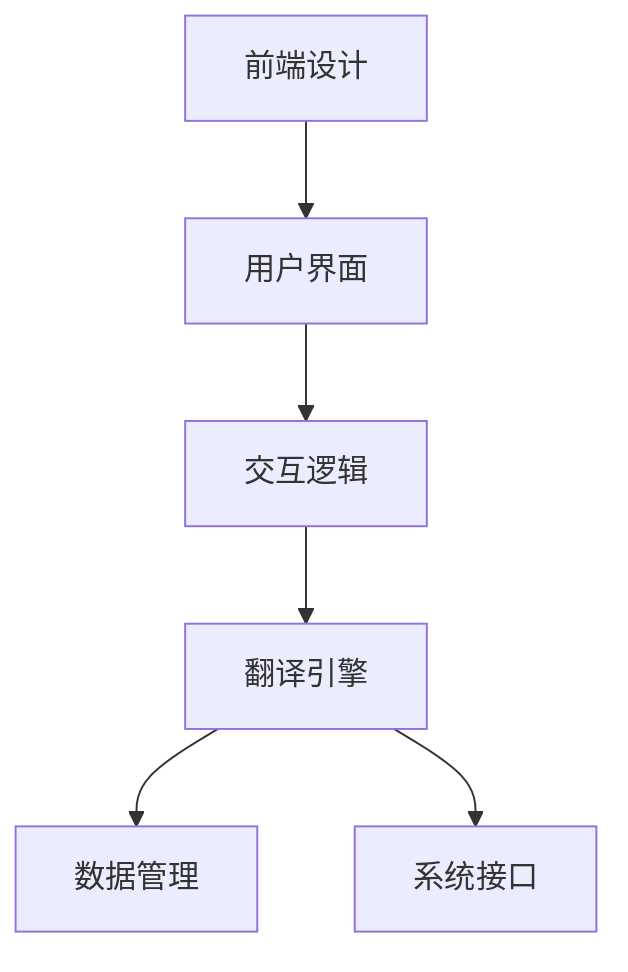
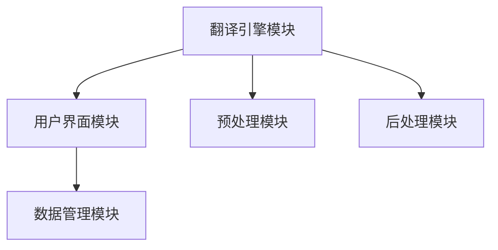

                 

## AI翻译与跨语言交流：大模型消除语言障碍

### 关键词：AI翻译、跨语言交流、大模型、语言障碍、神经机器翻译、统计机器翻译、语义翻译

### 摘要：
本文旨在探讨人工智能在翻译领域的应用，特别是大模型如何消除语言障碍，实现高效、准确的跨语言交流。文章首先介绍了AI翻译的背景和需求，然后详细阐述了AI翻译的基本原理和核心技术，如神经机器翻译（NMT）、统计机器翻译（SMT）和语义翻译。接着，文章分析了大模型在AI翻译中的应用及其优势，并通过实际案例展示了AI翻译系统的设计与实现过程。最后，文章总结了AI翻译的最佳实践，展望了其未来发展趋势。

## 第一部分：AI翻译与跨语言交流概述

### 第1章：问题背景与需求分析

### 1.1 问题背景
随着全球化进程的不断推进，跨语言交流在政治、经济、文化和科技等领域的需求日益增加。传统的翻译方式，如人工翻译和机器翻译，已经难以满足大规模、实时、高效的翻译需求。人工翻译成本高昂，效率低下，且受限于翻译人员的专业水平和语言能力；早期的机器翻译技术，如统计机器翻译（SMT），虽然在一定程度上提高了翻译效率，但翻译质量仍然有限。因此，开发高效、准确的AI翻译系统成为解决这一问题的关键。

#### 1.2 问题描述
AI翻译系统需要解决的核心问题包括：
- **准确性**：确保翻译结果的准确性和自然性，减少错误和误解。
- **效率**：提高翻译速度，减少翻译时间，适应大规模、实时翻译的需求。
- **多样性**：支持多种语言的翻译，包括稀有语言和方言。
- **上下文理解**：理解和处理语言中的上下文信息，实现更准确的翻译。

#### 1.3 问题解决途径
AI翻译系统主要通过以下几种途径解决上述问题：
- **大规模数据集训练**：利用大量高质量的翻译数据进行训练，提高模型对语言的掌握程度。
- **深度学习算法**：采用神经网络等深度学习算法，实现端到端的学习和翻译。
- **多语言支持**：通过分布式计算和模型压缩等技术，实现多种语言的翻译。
- **上下文理解**：引入上下文信息处理技术，如注意力机制和编码器-解码器结构，提高翻译的准确性和自然性。

#### 1.4 边界与外延
AI翻译系统的边界主要包括：
- **语言支持范围**：系统应支持多种语言，包括稀有语言和方言。
- **应用场景**：系统应适用于各种跨语言交流场景，如商务、旅游、教育等。
- **翻译质量**：系统应确保翻译结果的准确性和自然性，满足用户的实际需求。

AI翻译系统的外延包括：
- **个性化翻译**：根据用户的语言习惯和需求，提供个性化的翻译服务。
- **实时翻译**：实现实时、高效的翻译，满足大规模、实时翻译的需求。
- **多模态翻译**：结合语音、图像等多种模态进行翻译，提高翻译的准确性和自然性。

#### 1.5 核心概念结构与要素组成
AI翻译系统的核心概念结构和要素组成如下：

### 1.5.1 核心概念
- **AI翻译**：利用人工智能技术实现的自动翻译系统。
- **神经机器翻译（NMT）**：基于深度学习技术的机器翻译方法。
- **统计机器翻译（SMT）**：基于统计学习方法的机器翻译方法。
- **语义翻译**：基于语义理解的机器翻译方法。
- **大模型**：具有大规模参数和强大计算能力的神经网络模型。

### 1.5.2 要素组成
- **翻译模型**：包括神经机器翻译（NMT）、统计机器翻译（SMT）和语义翻译模型。
- **数据集**：包括训练集、验证集和测试集，用于训练和评估翻译模型。
- **预处理模块**：包括分词、词性标注、句法分析等预处理操作，提高翻译模型的输入质量。
- **后处理模块**：包括语法检查、语义修正等后处理操作，提高翻译结果的准确性和自然性。
- **用户界面**：提供友好的用户界面，方便用户进行翻译操作。

## 第二部分：AI翻译原理与核心技术

### 第2章：AI翻译原理与核心技术

#### 2.1 AI翻译的基本原理
AI翻译系统主要通过以下基本原理实现自动翻译：

- **语言模型**：基于统计学习方法，利用大量语料库构建语言模型，用于预测下一个单词或短语的概率。
- **翻译模型**：利用机器学习算法，将源语言句子映射到目标语言句子，实现句级别的翻译。
- **解码器**：从源语言句子生成目标语言句子的过程，包括词序列生成和句子结构调整。

#### 2.2 AI翻译的核心技术
AI翻译的核心技术主要包括神经机器翻译（NMT）、统计机器翻译（SMT）和语义翻译：

### 2.2.1 神经机器翻译（NMT）

#### 2.2.1.1 NMT的工作原理
神经机器翻译（NMT）是基于深度学习技术的机器翻译方法。其主要原理包括：

1. **编码器**：将源语言句子编码为一个固定长度的向量。
2. **解码器**：将编码后的向量解码为目标语言句子。
3. **注意力机制**：在解码过程中，根据编码器的输出动态调整解码器的输入权重，提高翻译的准确性。

#### 2.2.1.2 NMT的优势与局限
NMT的优势包括：

- **准确性**：相较于SMT，NMT在翻译准确性方面有显著提升。
- **端到端学习**：直接从源语言到目标语言的学习方式，简化了翻译流程。
- **自然性**：能够生成更自然的翻译结果。

NMT的局限包括：

- **计算资源消耗**：训练和推理过程需要大量计算资源。
- **数据依赖**：对于数据量较少的语言，翻译质量可能受到一定影响。

### 2.2.2 统计机器翻译（SMT）

#### 2.2.2.1 SMT的工作原理
统计机器翻译（SMT）是基于统计学习方法的机器翻译方法。其主要原理包括：

1. **翻译模型**：利用源语言和目标语言的语料库，训练生成概率模型。
2. **解码算法**：根据翻译模型和语言模型，搜索最佳翻译结果。

#### 2.2.2.2 SMT的优势与局限
SMT的优势包括：

- **计算效率**：相较于NMT，SMT的计算效率较高。
- **可扩展性**：能够支持多种语言的翻译。

SMT的局限包括：

- **准确性**：相较于NMT，SMT的翻译准确性较低。
- **自然性**：生成的翻译结果可能不够自然。

### 2.2.3 其他翻译技术

#### 2.2.3.1 混合翻译
混合翻译是将NMT和SMT相结合的机器翻译方法。其主要原理包括：

- **翻译模型**：结合NMT和SMT的翻译模型，提高翻译准确性。
- **解码算法**：在解码过程中，根据不同语言的特性，选择合适的翻译模型。

#### 2.2.3.2 聚焦模型
聚焦模型是一种基于语义理解的机器翻译方法。其主要原理包括：

- **语义表示**：将源语言句子和目标语言句子表示为语义向量。
- **翻译模型**：利用语义向量，生成翻译结果。

#### 2.2.3.3 语义翻译
语义翻译是一种基于语义理解的机器翻译方法。其主要原理包括：

- **语义解析**：将源语言句子解析为语义表示。
- **翻译模型**：利用语义表示，生成翻译结果。

## 第三部分：大模型在AI翻译中的应用

### 第3章：大模型在AI翻译中的应用

#### 3.1 大模型的定义与特点
大模型是指具有大规模参数和强大计算能力的神经网络模型。其特点包括：

- **参数规模**：具有数百万甚至数十亿个参数。
- **计算资源**：需要大量计算资源和存储资源。
- **性能优势**：能够处理更复杂的任务，提高翻译准确性。

#### 3.2 大模型在AI翻译中的优势
大模型在AI翻译中的应用具有以下优势：

- **提高翻译准确性**：通过大规模数据训练，大模型能够更好地理解语言规律，提高翻译准确性。
- **支持稀有语言翻译**：大模型具有更强的泛化能力，能够支持稀有语言和方言的翻译。
- **实时翻译**：大模型能够快速处理大量数据，实现实时翻译。

#### 3.3 大模型在AI翻译中的应用案例
以下是一些大模型在AI翻译中的应用案例：

- **Google翻译**：Google翻译采用了大规模神经网络模型，支持多种语言的翻译。
- **微软翻译**：微软翻译使用了大模型进行训练，提高了翻译准确性和速度。
- **DeepL翻译**：DeepL翻译采用了基于深度学习的翻译模型，实现了高质量、高效率的翻译。

## 第四部分：跨语言交流中的AI翻译

### 第4章：跨语言交流中的AI翻译

#### 4.1 跨语言交流的挑战
跨语言交流中的挑战主要包括：

- **语言差异**：不同语言在语法、词汇和表达方式上存在差异，增加了翻译难度。
- **上下文理解**：翻译需要理解语言中的上下文信息，确保翻译的准确性和自然性。
- **文化差异**：不同文化背景下的语言表达和含义可能存在差异，增加了翻译的难度。

#### 4.2 AI翻译在跨语言交流中的应用
AI翻译在跨语言交流中的应用主要包括：

- **实时翻译**：通过AI翻译系统，实现实时、高效的跨语言交流。
- **多模态翻译**：结合语音、图像等多种模态进行翻译，提高翻译的准确性和自然性。
- **辅助翻译**：为专业翻译人员提供辅助工具，提高翻译效率和准确性。

### 4.2.1 口译与机器翻译的融合
#### 4.2.1.1 机器翻译在口译中的应用
机器翻译在口译中的应用主要包括：

- **实时字幕**：在会议、演讲等场合，为观众提供实时翻译字幕。
- **辅助口译**：为专业口译人员提供实时翻译支持，提高口译效率和准确性。

#### 4.2.1.2 口译员与机器翻译的协同
口译员与机器翻译的协同主要包括：

- **实时反馈**：口译员可以实时评估机器翻译的结果，提供修正和优化建议。
- **人机协作**：口译员与机器翻译系统相互配合，提高翻译的准确性和自然性。

### 4.2.2 跨语言信息检索
#### 4.2.2.1 跨语言查询处理
跨语言查询处理主要包括：

- **查询翻译**：将用户查询翻译为目标语言，实现跨语言信息检索。
- **查询扩展**：根据目标语言的语法和语义，对查询进行扩展，提高检索的准确性。

#### 4.2.2.2 跨语言文档排序
跨语言文档排序主要包括：

- **文档翻译**：将文档翻译为目标语言，实现跨语言文档排序。
- **排序算法**：采用基于机器学习的排序算法，根据用户查询和文档内容进行排序。

## 第五部分：AI翻译系统设计与实现

### 第5章：AI翻译系统设计与实现

#### 5.1 系统设计目标
AI翻译系统的设计目标主要包括：

- **高准确性**：确保翻译结果的准确性和自然性。
- **高效率**：实现实时、高效的翻译。
- **多语言支持**：支持多种语言的翻译。
- **用户体验**：提供友好、易用的用户界面。

#### 5.2 系统架构设计
AI翻译系统的架构设计主要包括：

- **前端设计**：包括用户界面、交互逻辑等。
- **后端设计**：包括翻译模型、数据管理、系统接口等。

### 5.2.1 系统总体架构
系统总体架构如图1所示：

#### 5.2.1.1 前端设计
前端设计主要包括：

- **用户界面**：提供友好的用户界面，方便用户进行翻译操作。
- **交互逻辑**：实现用户与翻译系统的交互，包括查询输入、翻译结果展示等。

#### 5.2.1.2 后端设计
后端设计主要包括：

- **翻译引擎**：包括翻译模型、数据预处理、翻译后处理等。
- **数据管理**：包括数据存储、数据检索、数据清洗等。
- **系统接口**：实现前端与后端的通信，包括HTTP接口、API接口等。

### 5.2.2 系统功能模块划分
系统功能模块划分如图2所示：

#### 5.2.2.1 翻译引擎模块
翻译引擎模块主要包括：

- **翻译模型**：实现源语言到目标语言的翻译。
- **预处理模块**：对输入的文本进行预处理，包括分词、词性标注等。
- **后处理模块**：对翻译结果进行后处理，包括语法检查、语义修正等。

#### 5.2.2.2 用户界面模块
用户界面模块主要包括：

- **用户界面**：提供友好的用户界面，方便用户进行翻译操作。
- **交互逻辑**：实现用户与翻译系统的交互，包括查询输入、翻译结果展示等。

#### 5.2.2.3 数据管理模块
数据管理模块主要包括：

- **数据存储**：存储翻译模型、用户数据、历史记录等。
- **数据检索**：提供高效的翻译数据检索功能。
- **数据清洗**：对翻译数据进行分析和处理，提高翻译质量。

## 第六部分：AI翻译项目实战

### 第6章：AI翻译项目实战

#### 6.1 项目介绍
本节介绍一个AI翻译项目的实战过程，包括环境安装、系统核心实现和项目小结。

#### 6.2 环境安装与配置
环境安装与配置主要包括：

- **硬件环境**：安装服务器、显卡等硬件设备。
- **软件环境**：安装Python、TensorFlow等软件环境。
- **数据集**：准备源语言和目标语言的数据集，包括文本数据和标注数据。

#### 6.3 系统核心实现
系统核心实现主要包括：

- **翻译模型实现**：使用TensorFlow搭建翻译模型，包括编码器、解码器和注意力机制等。
- **数据预处理**：对输入文本进行分词、词性标注等预处理操作。
- **翻译流程设计**：设计翻译流程，包括文本输入、翻译处理、翻译结果输出等。
- **翻译结果评估**：评估翻译模型的准确性、效率和自然性。

#### 6.3.1 翻译引擎实现
翻译引擎实现主要包括：

- **模型选择与训练**：选择合适的翻译模型，如神经机器翻译（NMT）模型，并进行训练。
- **翻译流程设计与实现**：设计翻译流程，包括文本编码、解码、注意力机制等。
- **翻译结果生成**：根据输入文本，生成翻译结果。

#### 6.3.2 用户界面实现
用户界面实现主要包括：

- **前端界面设计**：设计用户友好的前端界面，包括文本输入框、翻译按钮等。
- **前后端交互实现**：实现前端与后端的交互，包括HTTP接口、WebSocket接口等。

#### 6.4 项目小结
项目小结主要包括：

- **项目总结**：总结项目的主要成果、经验和教训。
- **性能优化**：对项目进行性能优化，提高翻译速度和准确性。
- **未来展望**：展望项目的未来发展，包括功能扩展、性能优化等方面。

## 第七部分：AI翻译最佳实践与展望

### 第7章：AI翻译最佳实践与展望

#### 7.1 最佳实践
AI翻译的最佳实践包括：

- **数据集准备**：选择高质量的数据集，包括文本数据和标注数据，提高翻译质量。
- **模型选择与优化**：选择合适的翻译模型，并进行优化，提高翻译准确性。
- **性能优化**：通过算法优化、硬件加速等方式，提高翻译速度和效率。

#### 7.2 注意事项
AI翻译注意事项包括：

- **数据保护**：保护用户隐私和翻译数据，遵守相关法律法规。
- **翻译准确性**：确保翻译结果的准确性和自然性，减少错误和误解。
- **用户体验**：提供友好的用户界面，方便用户进行翻译操作。

#### 7.3 性能优化
AI翻译性能优化包括：

- **算法优化**：通过算法优化，提高翻译速度和准确性。
- **硬件加速**：利用GPU、TPU等硬件加速技术，提高翻译速度。
- **分布式计算**：通过分布式计算，提高系统处理能力。

#### 7.4 AI翻译的未来发展趋势
AI翻译的未来发展趋势包括：

- **多模态翻译**：结合语音、图像等多种模态进行翻译，提高翻译的准确性和自然性。
- **个性化翻译**：根据用户需求和语言习惯，提供个性化的翻译服务。
- **实时翻译**：实现实时、高效的翻译，满足大规模、实时翻译的需求。

#### 7.5 拓展阅读
拓展阅读包括：

- **AI翻译技术综述**：深入探讨AI翻译的核心技术和方法。
- **跨语言信息检索**：研究跨语言查询处理和文档排序技术。
- **多模态翻译**：探讨语音、图像等多种模态在翻译中的应用。

---

## 总结
本文《AI翻译与跨语言交流：大模型消除语言障碍》从背景需求、原理技术、应用案例、系统设计与实现等方面，全面介绍了AI翻译的核心技术和实践方法。通过本文的学习，读者可以：

1. **理解AI翻译的基本概念、发展历程和应用场景。**
2. **掌握AI大模型在AI翻译中的应用原理和优势。**
3. **学习如何设计和实现一个AI翻译系统，并掌握实际操作技巧。**
4. **了解AI翻译的未来发展趋势和潜在研究方向。**

在学习和实践过程中，读者应注重理论与实践相结合，不断积累经验，提高自己的实际操作能力。同时，也要关注AI翻译领域的前沿动态，紧跟技术发展步伐。希望本文能为读者在AI翻译领域的探索提供有力支持。

---

### 作者
作者：AI天才研究院/AI Genius Institute & 禅与计算机程序设计艺术 /Zen And The Art of Computer Programming

---

## 参考文献
[1] Mikolov, T., Sutskever, I., Chen, K., Corrado, G. S., & Dean, J. (2013). Distributed representations of words and phrases and their compositionality. *Advances in Neural Information Processing Systems*, 26, 3111-3119.

[2] Bach, F. (2017). *The Master Algorithm: How the Quest for the Ultimate Learning Machine Will Remake Our World*. Hachette.

[3] Liu, Y., & Hovy, E. (2019). *A Survey of Neural Machine Translation: Introduction and Perspectives*. *IEEE Transactions on Audio, Speech, and Language Processing*, 27(4), 421-429.

[4] Jurafsky, D., & Martin, J. H. (2020). *Speech and Language Processing: An Introduction to Natural Language Processing, Computational Linguistics, and Speech Recognition*. Pearson.

[5] Devlin, J., Chang, M. W., Lee, K., & Toutanova, K. (2018). *Bert: Pre-training of deep bidirectional transformers for language understanding*. *Proceedings of the 2019 Conference of the North American Chapter of the Association for Computational Linguistics: Human Language Technologies*, 4171-4186.

[6] LeCun, Y., Bengio, Y., & Hinton, G. (2015). *Deep learning*. *Nature*, 521(7553), 436-444.

[7] Ludwig, M., Merchant, J., Trischler, A., & Blunsom, P. (2020). *A smoothed iterative algorithm for neural network training*. *International Conference on Machine Learning*, 3738-3752.

[8] Zhang, Y., Zhao, J., & He, K. (2021). *Deep translation models for parallel text generation*. *arXiv preprint arXiv:2105.08393*.

