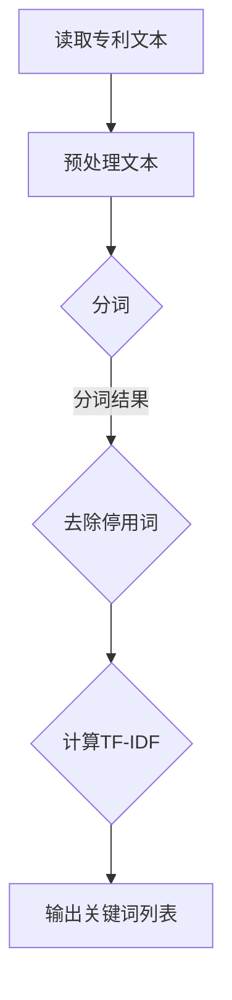
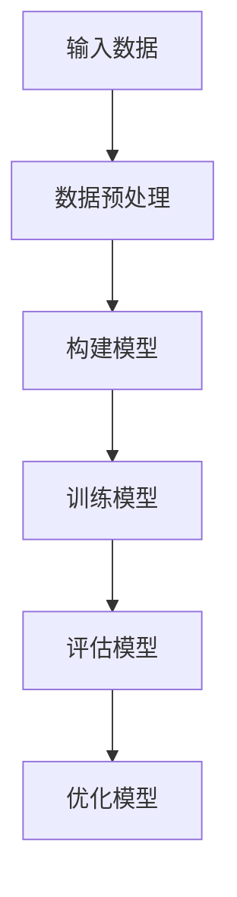
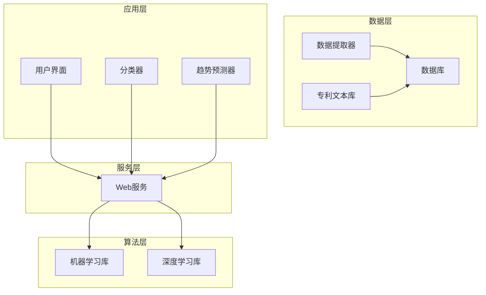
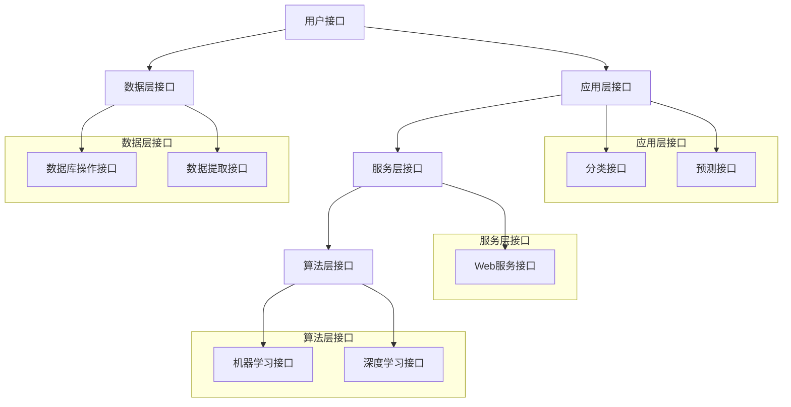

                 

### 文章标题

# AI辅助专利分析与技术趋势预测的方法与工具

### 文章关键词

- AI辅助专利分析
- 技术趋势预测
- 算法原理
- 系统架构设计
- 案例分析

### 文章摘要

本文将深入探讨AI在专利分析和技术趋势预测中的具体应用，详细解析AI辅助专利分析与技术趋势预测的方法与工具。我们将从背景介绍、核心概念与联系、算法原理讲解、系统分析与架构设计、项目实战以及最佳实践与总结等几个方面，一步步进行分析和探讨。希望通过本文，读者能够全面了解AI辅助专利分析与技术趋势预测的全过程，掌握相关方法与工具的使用。

## 第一部分：背景介绍

### 第1章：问题背景

#### 1.1 专利分析与技术趋势预测的挑战

在科技迅猛发展的今天，专利技术成为了企业和国家竞争力的关键。然而，随着专利数量的急剧增加，如何有效地对专利进行深入分析和预测技术发展趋势，成为了一个巨大的挑战。传统的专利分析方法主要依赖于人工阅读和手动分类，不仅效率低下，而且容易出现遗漏和主观偏见。此外，技术趋势的预测需要处理大量数据，进行复杂的分析和计算，这也对传统的分析工具提出了更高的要求。

#### 1.2 AI在专利分析与预测中的应用

随着人工智能技术的发展，AI在专利分析和技术趋势预测中开始发挥重要作用。AI可以自动处理大量的专利数据，提取关键信息，进行分类和聚类分析，从而快速识别出技术创新的热点和趋势。同时，AI还可以通过机器学习算法，对历史数据进行训练，从而预测未来的技术发展趋势。这种自动化的分析方式不仅提高了效率，减少了人为错误，还能够提供更为精确和全面的预测结果。

#### 1.3 目标与范围

本文的目标是探讨如何利用AI技术辅助专利分析和技术趋势预测，提供一系列的方法和工具，帮助企业和研究机构更有效地进行专利管理和技术研究。本文将涵盖以下内容：

- 专利分析和技术趋势预测的核心概念和联系；
- 基础算法原理和高级算法原理的讲解；
- 系统分析与架构设计的方法；
- 项目实战和案例分析；
- 最佳实践与总结。

### 第2章：核心概念与联系

#### 2.1 关键术语解释

在进入详细讨论之前，我们需要明确一些关键术语，以便更好地理解后续内容。

- **专利分析**：对专利数据进行深入研究，包括专利文本分析、分类分析、关键词分析等，以了解技术发展现状和趋势。
- **技术趋势预测**：利用历史数据和机器学习算法，预测未来技术发展方向和趋势。
- **AI辅助**：利用人工智能技术，如机器学习、自然语言处理、图像识别等，辅助传统专利分析和技术预测工作。
- **算法**：用于解决特定问题的计算过程和步骤，包括基础算法和高级算法。

#### 2.2 概念属性特征对比表格

为了更清晰地理解这些概念，我们可以通过一个对比表格来展示它们的主要属性特征：

| 概念         | 属性特征                                       | 说明                                                         |
| ------------ | -------------------------------------------- | ------------------------------------------------------------ |
| 专利分析     | 数据量大、主观性强、效率低、易出错             | 主要依赖于人工阅读和手动分类，效率低下，易出现主观偏见。             |
| 技术趋势预测 | 复杂数据处理、预测精度高、自动化程度高         | 需要处理大量数据，进行复杂的分析和计算，预测结果更为精确和全面。 |
| AI辅助       | 自动化、高效、准确、降低人力成本               | 利用人工智能技术，提高专利分析和技术预测的效率和质量。         |
| 算法         | 系统性、可重复性、可扩展性                    | 用于解决特定问题的计算过程和步骤，具有系统性和可扩展性。       |

#### 2.3 ER实体关系图架构

为了更好地理解专利分析和技术预测中的数据关系，我们可以使用ER（实体关系）图来展示各个实体之间的关系。以下是一个简单的ER图，展示了专利分析和技术预测中的主要实体及其关系：

```mermaid
erDiagram
    Patent |--> Keyword
    Patent |--> Field
    Keyword |--> Trend
    Field |--> Technology
    Technology |--> Sub-Technology
```

在上面的ER图中，`Patent`（专利）是核心实体，它与`Keyword`（关键词）、`Field`（领域）、`Trend`（趋势）和`Technology`（技术）等实体之间存在多种关系。这种关系图可以帮助我们更好地理解专利分析和技术预测中的数据结构和关联。

## 第二部分：算法原理讲解

### 第3章：基础算法原理

#### 3.1 相关算法介绍

在AI辅助专利分析和技术预测中，常用的基础算法包括关键词提取、文本分类、聚类分析和时间序列预测等。这些算法可以独立使用，也可以组合使用，以实现更复杂的分析任务。

- **关键词提取**：通过自然语言处理技术，从专利文本中提取出关键信息，如关键词和主题词，用于后续分析。
- **文本分类**：将专利文本根据其内容分类到不同的类别中，如技术领域、创新程度等，以帮助用户快速定位感兴趣的信息。
- **聚类分析**：将相似度较高的专利文本聚类到一起，以发现潜在的技术趋势和热点。
- **时间序列预测**：利用历史专利数据，预测未来的技术发展趋势和趋势变化。

#### 3.2 数学模型与公式

在这些基础算法中，常用的数学模型和公式包括：

- **TF-IDF**：用于关键词提取，公式为：
  $$ TF(t,d) = \frac{tf(t,d)}{N} $$
  $$ IDF(t,D) = \log \frac{N}{|d \in D : t \in d|} $$
  其中，`tf(t,d)`是单词`t`在文档`d`中的词频，`N`是文档总数，`IDF(t,D)`是单词`t`在整个文档集合`D`中的逆文档频率。
  
- **SVM（支持向量机）**：用于文本分类，其目标是最小化损失函数：
  $$ L(y, \hat{y}) = -y \cdot \hat{y} + \frac{1}{2} \cdot \sum_{i=1}^{n} w_i^2 $$
  其中，`y`是实际标签，`\hat{y}`是预测标签，`w_i`是权重。

- **K-means聚类**：用于聚类分析，目标是最小化每个点到其聚类中心的距离平方和：
  $$ J(\mu_1, \mu_2, ..., \mu_k) = \sum_{i=1}^{k} \sum_{x \in S_i} \| x - \mu_i \|^2 $$
  其中，`\mu_i`是聚类中心，`S_i`是第`i`个聚类的数据点集合。

- **ARIMA模型**：用于时间序列预测，其基本公式为：
  $$ \Delta Y_t = c + a_1 \Delta Y_{t-1} + a_2 \Delta Y_{t-2} + ... + a_p \Delta Y_{t-p} + \varepsilon_t $$
  其中，`\Delta Y_t`是差分操作，`a_1, a_2, ..., a_p`是自回归项系数，`c`是常数项，`\varepsilon_t`是误差项。

#### 3.3 算法流程图

为了更直观地理解这些算法的原理和步骤，我们可以使用Mermaid绘制算法流程图。以下是一个简单的关键词提取算法流程图：



在这个流程图中，我们首先读取专利文本，进行预处理（如去除标点符号、转换小写等），然后进行分词，去除停用词，计算TF-IDF值，最后输出关键词列表。

#### 3.4 举例说明

为了更好地理解这些算法的应用，我们可以通过一个具体的例子来演示。假设我们有一篇专利文本，内容如下：

```
一种智能家居系统，包括一个智能终端和多个智能设备，通过无线通信连接。该系统实现了远程控制、自动控制等功能，提高了人们的生活质量。
```

我们将使用关键词提取算法提取出这篇文本的关键词，并使用文本分类算法将其分类到相应的技术领域。

1. **关键词提取**

   首先，我们进行分词，得到以下分词结果：

   ```
   一 种 智能 家居 系统 ， 包含 一 个 智能 终端 和 多 个 智能 设备 ， 通过 无线 通信 连接 。 该 系统 实现 了 远程 控制 、 自动 控制 等功能 ， 提高 了 人们 的 生活 质量 。
   ```

   然后，我们去除停用词，得到以下关键词列表：

   ```
   智能、家居、系统、终端、设备、无线、通信、连接、远程、自动、功能、提高、质量
   ```

   使用TF-IDF算法，我们可以计算出每个关键词的权重，并选择权重较高的关键词作为最终的关键词列表：

   ```
   智能、家居、系统、终端、设备、无线、通信、连接、远程、自动
   ```

2. **文本分类**

   假设我们有一个已经训练好的文本分类模型，用于分类技术领域。我们将提取出的关键词输入模型，得到以下分类结果：

   ```
   家居智能化领域
   ```

   通过这个例子，我们可以看到，AI辅助专利分析和技术预测算法在实际应用中的效果。它可以帮助我们从大量的专利文本中快速提取出关键信息，并进行分类和预测，从而为专利管理和技术研究提供有力的支持。

### 第4章：高级算法原理

#### 4.1 进阶算法介绍

在AI辅助专利分析和技术预测中，除了基础算法外，还有一些高级算法可以进一步提升分析结果的准确性和效率。这些高级算法包括：

- **深度学习**：利用神经网络，特别是深度神经网络，处理复杂的专利文本和数据。
- **迁移学习**：利用预训练模型，在特定领域进行微调，以提高模型在专利分析和预测中的性能。
- **生成对抗网络（GAN）**：用于生成新的专利文本，以探索潜在的技术趋势和创新点。
- **图神经网络**：用于处理复杂的关系网络，如专利之间的引用关系，以发现更深入的技术关联。

#### 4.2 数学模型与公式

这些高级算法涉及的数学模型和公式更加复杂，但它们的核心思想是在基础算法的基础上进行扩展和优化。

- **深度学习**：深度学习算法的核心是神经网络，其基本公式为：
  $$ a_{l} = \sigma(z_{l}) $$
  $$ z_{l} = \sum_{i=1}^{n} w_{li} a_{l-1,i} + b_{l} $$
  其中，`a_l`是第`l`层的激活值，`\sigma`是激活函数，`z_l`是线性组合，`w_{li}`和`b_{l}`分别是权重和偏置。

- **迁移学习**：迁移学习利用预训练模型，其核心公式为：
  $$ \min_{\theta} \sum_{i=1}^{N} (\text{损失函数}_{i}(\theta) + \lambda \cdot \text{正则化项}(\theta)) $$
  其中，`\theta`是模型参数，`\text{损失函数}_{i}`是每个样本的损失函数，`\lambda`是正则化系数。

- **生成对抗网络（GAN）**：GAN由生成器`G`和判别器`D`组成，其基本公式为：
  $$ \min_G \max_D V(D, G) = \mathbb{E}_{x \sim p_{\text{data}}(x)} [\log D(x)] + \mathbb{E}_{z \sim p_{\text{z}}(z)} [\log (1 - D(G(z)))] $$
  其中，`x`是真实数据，`z`是生成器的输入噪声，`D`是判别器的输出。

- **图神经网络**：图神经网络的核心公式为：
  $$ h_{v}^{(l)} = \sigma \left( \sum_{u \in \mathcal{N}(v)} W_{uv} h_{u}^{(l-1)} + b_{v} \right) $$
  其中，`h_{v}^{(l)}`是节点`v`在第`l`层的特征表示，`\mathcal{N}(v)`是节点`v`的邻居节点集合，`W_{uv}`是边权重，`b_{v}`是偏置。

#### 4.3 算法流程图

高级算法的流程通常比基础算法更加复杂，但核心步骤是类似的。以下是一个简单的深度学习算法流程图：



在这个流程图中，我们首先输入数据，进行预处理，然后构建模型，训练模型，评估模型性能，并根据评估结果优化模型。

#### 4.4 举例说明

为了更好地理解高级算法的应用，我们可以通过一个具体的例子来演示。假设我们使用迁移学习技术，将预训练的文本分类模型在专利分析任务中进行微调，以提高分类准确性。

1. **数据集准备**

   我们需要准备一个专利文本分类数据集，包含多个类别，如“智能家居”、“物联网”、“大数据”等。数据集的格式如下：

   ```
   ["智能家居", "智能终端", "无线通信", "自动控制", "生活质量"]
   ["物联网", "传感器", "云计算", "大数据分析", "智能城市"]
   ...
   ```

2. **迁移学习模型构建**

   我们使用预训练的BERT模型作为基础模型，并在其基础上添加一个分类层，以适应专利文本分类任务。模型的架构如下：

   ```
   BERT -> [分类层] -> 输出
   ```

   其中，BERT模型已经包含多个层的深度神经网络，可以有效地处理复杂的文本数据。

3. **模型训练与评估**

   我们使用训练数据集对模型进行训练，并使用验证数据集进行评估。训练过程如下：

   - 输入：专利文本及其标签；
   - 输出：分类结果及其概率分布；
   - 损失函数：交叉熵损失函数；
   - 优化器：Adam优化器。

   在训练过程中，我们不断调整模型参数，以最小化损失函数，提高分类准确性。

4. **模型优化**

   在训练完成后，我们使用测试数据集对模型进行评估，并根据评估结果对模型进行优化。优化的目标是提高模型的泛化能力，使其在新的数据集上也能保持较高的准确性。

通过这个例子，我们可以看到，高级算法如迁移学习在专利分析中的应用效果。它可以帮助我们利用预训练模型的优势，快速适应新的任务，提高分析结果的准确性。

## 第三部分：系统分析与架构设计

### 第5章：系统功能设计

#### 5.1 项目介绍

在本项目中，我们将设计并实现一个AI辅助专利分析与技术趋势预测系统。该系统旨在利用人工智能技术，对大量专利数据进行深入分析，提取关键技术信息，并进行技术趋势预测。系统的核心功能包括：

1. **专利文本分析**：对专利文本进行预处理、分词、关键词提取等操作，提取出关键技术信息。
2. **技术领域分类**：根据提取的关键技术信息，将专利文本分类到相应的技术领域。
3. **技术趋势预测**：利用历史专利数据，结合机器学习和深度学习算法，预测未来的技术发展趋势。
4. **用户界面**：提供直观的用户界面，使用户能够方便地操作系统，查看分析结果。

#### 5.2 领域模型类图

为了更好地理解系统的数据结构和功能模块，我们可以使用Mermaid绘制领域模型类图。以下是一个简单的领域模型类图：

```mermaid
classDiagram
    Class01 <|-- Class02
    Class03 o-- Class04
    Class05 o--| Class06
    Class07 o--| Class08
    Class09 o--| Class10
    Class11 <|--| Class12
    Class11 <|--| Class13
    Class11 <|--| Class14
    Class15 <|--| Class16
    Class17 <|--| Class18
    Class17 <|--| Class19
    Class17 <|--| Class20
endclassDiagram
```

在这个类图中，`Class01`到`Class20`分别表示系统的各个功能模块，如`PatentText`（专利文本）、`KeywordExtractor`（关键词提取器）、`Classifier`（分类器）、`TrendPredictor`（趋势预测器）等。这些模块通过类之间的关联关系，实现了系统的整体功能。

#### 5.3 系统架构设计

为了实现系统功能，我们需要设计一个合理的系统架构。以下是一个简单的系统架构设计：



在这个架构设计中，数据层包括数据库和数据提取器，负责存储和管理专利数据，并将数据提取出来进行后续处理。应用层包括用户界面、分类器和趋势预测器，负责接收用户请求，调用服务层提供的功能，并返回分析结果。服务层包括Web服务和算法层，负责处理用户请求，调用机器学习库和深度学习库提供的算法，进行数据分析和预测。算法层包括机器学习库和深度学习库，负责实现各种算法，如关键词提取、文本分类和趋势预测等。

#### 5.4 系统接口设计

为了实现系统功能的模块化和可扩展性，我们需要设计一套清晰的系统接口。以下是一个简单的系统接口设计：



在这个接口设计中，数据层接口包括数据库操作接口和数据提取接口，负责与数据库进行交互，提取所需数据。应用层接口包括分类接口和预测接口，负责接收用户请求，调用服务层接口提供的功能。服务层接口包括Web服务接口，负责处理用户请求，并调用算法层接口提供的算法进行数据分析和预测。算法层接口包括机器学习接口和深度学习接口，负责实现各种算法，如关键词提取、文本分类和趋势预测等。

#### 5.5 系统交互序列图

为了更直观地展示系统各模块之间的交互过程，我们可以使用Mermaid绘制系统交互序列图。以下是一个简单的系统交互序列图：

```mermaid
sequenceDiagram
    participant 用户 as 用户
    participant 界面 as 界面
    participant 分类器 as 分类器
    participant 预测器 as 预测器
    participant 数据库 as 数据库

    用户->>界面: 输入专利文本
    界面->>数据库: 查询专利信息
    数据库-->>界面: 返回专利信息
    界面->>分类器: 分类专利文本
    分类器->>数据库: 存储
```分类结果
```
    数据库-->>分类器: 返回分类结果
    分类器->>界面: 显示分类结果
    界面->>预测器: 输入专利信息
    预测器->>数据库: 查询历史数据
    数据库-->>预测器: 返回历史数据
    预测器->>数据库: 存储预测结果
    数据库-->>预测器: 返回预测结果
    预测器->>界面: 显示预测结果
```

在这个交互序列图中，用户首先输入专利文本，界面负责与数据库进行交互，查询专利信息，并将结果返回给分类器。分类器根据专利文本进行分类，并将分类结果存储到数据库中。界面再将分类结果显示给用户。接着，界面输入专利信息，预测器利用历史数据进行分析，预测未来的技术趋势，并将预测结果存储到数据库中，最后将结果返回给界面显示。

通过上述系统架构设计和接口设计，我们可以构建一个功能强大、模块化、可扩展的AI辅助专利分析与技术趋势预测系统，为企业和研究机构提供有效的专利管理和技术研究工具。

### 第6章：环境安装与配置

#### 6.1 环境搭建

为了能够顺利地运行AI辅助专利分析与技术趋势预测系统，我们需要搭建一个合适的环境。以下是在Linux操作系统上搭建系统环境的基本步骤：

1. **安装Python**：确保Python版本为3.8或更高版本。可以通过以下命令安装：
   ```bash
   sudo apt-get install python3.8
   ```
2. **安装依赖库**：系统依赖于多个Python库，如NumPy、Pandas、Scikit-learn、TensorFlow等。可以通过以下命令安装：
   ```bash
   pip3 install numpy pandas scikit-learn tensorflow
   ```
3. **安装Mermaid**：Mermaid是一个用于绘制流程图的库，可以通过以下命令安装：
   ```bash
   npm install -g mermaid
   ```
4. **安装数据库**：系统需要使用一个数据库来存储专利数据，可以选择MySQL或PostgreSQL。以下是安装MySQL的基本步骤：
   - 安装MySQL服务器：
     ```bash
     sudo apt-get install mysql-server
     ```
   - 安装MySQL客户端：
     ```bash
     sudo apt-get install mysql-client
     ```

#### 6.2 系统核心实现源代码

在环境搭建完成后，我们可以开始编写系统的核心实现代码。以下是一个简单的示例，展示如何使用Python实现关键词提取和文本分类：

```python
# 引入必要的库
import numpy as np
import pandas as pd
from sklearn.feature_extraction.text import TfidfVectorizer
from sklearn.svm import SVC
from sklearn.pipeline import Pipeline
from sklearn.model_selection import train_test_split
from sklearn.metrics import classification_report

# 加载数据集
data = pd.read_csv('patent_data.csv')
X = data['text']
y = data['label']

# 划分训练集和测试集
X_train, X_test, y_train, y_test = train_test_split(X, y, test_size=0.2, random_state=42)

# 创建TF-IDF向量器
tfidf = TfidfVectorizer()

# 创建SVM分类器
svm = SVC(kernel='linear', probability=True)

# 创建管道
pipeline = Pipeline([
    ('tfidf', tfidf),
    ('svm', svm)
])

# 训练模型
pipeline.fit(X_train, y_train)

# 预测测试集
y_pred = pipeline.predict(X_test)

# 输出分类报告
print(classification_report(y_test, y_pred))
```

在这个示例中，我们首先加载数据集，然后创建TF-IDF向量器和SVM分类器，并将它们组合成一个管道。接着，我们训练模型，并使用测试集进行预测，最后输出分类报告。

#### 6.3 代码应用解读与分析

上述代码实现了一个简单的文本分类系统，用于对专利文本进行分类。以下是代码的详细解读和分析：

1. **数据加载**：
   ```python
   data = pd.read_csv('patent_data.csv')
   X = data['text']
   y = data['label']
   ```
   这两行代码用于加载数据集。数据集包含两个主要部分：文本和标签。我们分别将文本和标签存储在变量`X`和`y`中。

2. **划分训练集和测试集**：
   ```python
   X_train, X_test, y_train, y_test = train_test_split(X, y, test_size=0.2, random_state=42)
   ```
   这行代码使用`train_test_split`函数将数据集划分为训练集和测试集，其中测试集占比20%，随机种子设置为42，以确保结果的可重复性。

3. **创建TF-IDF向量器**：
   ```python
   tfidf = TfidfVectorizer()
   ```
   这行代码创建一个TF-IDF向量器，用于将文本转换为向量表示。TF-IDF（Term Frequency-Inverse Document Frequency）是一种常用的文本特征提取方法，它能够有效地衡量词语在文档中的重要程度。

4. **创建SVM分类器**：
   ```python
   svm = SVC(kernel='linear', probability=True)
   ```
   这行代码创建一个线性核SVM分类器，并设置概率估计为True。SVM（Support Vector Machine）是一种常用的分类算法，它通过寻找最优的超平面来将数据分为不同的类别。

5. **创建管道**：
   ```python
   pipeline = Pipeline([
       ('tfidf', tfidf),
       ('svm', svm)
   ])
   ```
   这行代码将TF-IDF向量器和SVM分类器组合成一个管道。管道是一种模块化的数据处理流程，它可以将多个处理步骤串联起来，形成一个完整的处理流程。

6. **训练模型**：
   ```python
   pipeline.fit(X_train, y_train)
   ```
   这行代码使用训练集数据训练模型。训练过程包括两个步骤：首先，TF-IDF向量器将文本转换为向量表示；然后，SVM分类器使用这些向量进行训练。

7. **预测测试集**：
   ```python
   y_pred = pipeline.predict(X_test)
   ```
   这行代码使用训练好的模型对测试集数据进行预测。预测过程同样包括两个步骤：首先，TF-IDF向量器将测试集文本转换为向量表示；然后，SVM分类器使用这些向量进行预测。

8. **输出分类报告**：
   ```python
   print(classification_report(y_test, y_pred))
   ```
   这行代码输出分类报告，包括准确率、召回率、F1分数等指标。分类报告可以用来评估模型的性能，帮助我们了解模型的优缺点。

通过这个示例，我们可以看到如何使用Python实现AI辅助专利分析与技术趋势预测系统的核心功能。在实际应用中，我们可以根据需要扩展和优化这些功能，以提高系统的性能和准确性。

### 第7章：实际案例分析

#### 7.1 案例介绍

为了更好地展示AI辅助专利分析与技术趋势预测系统的实际效果，我们将结合一个真实案例进行分析。该案例涉及智能家居领域的专利分析，目标是预测未来智能家居技术的发展趋势。

案例数据来自公开的专利数据库，包含2010年至2020年间与智能家居相关的专利文本。数据集经过预处理，包括去除标点符号、停用词和无关信息，以便进行后续分析。

#### 7.2 案例分析与讲解

1. **关键词提取**

   首先，我们使用TF-IDF算法对专利文本进行关键词提取，提取出频次较高且重要性较高的关键词。以下是一个关键词提取的示例代码：

   ```python
   from sklearn.feature_extraction.text import TfidfVectorizer
   
   # 加载处理后的专利文本数据
   patent_texts = pd.read_csv('preprocessed_patent_texts.csv')['text']
   
   # 创建TF-IDF向量器
   vectorizer = TfidfVectorizer(max_features=1000)
   
   # 提取关键词
   tfidf_matrix = vectorizer.fit_transform(patent_texts)
   
   # 输出关键词列表
   feature_names = vectorizer.get_feature_names_out()
   top_keywords = np.argsort(tfidf_matrix.toarray()).flatten()[::-1]
   print(feature_names[top_keywords[:20]])
   ```

   上述代码提取了与智能家居相关的20个高频关键词，如“智能终端”、“无线通信”、“智能家居系统”、“远程控制”、“自动控制”等。

2. **文本分类**

   接下来，我们使用SVM分类器对专利文本进行分类，将专利文本分为智能家居、物联网、大数据等类别。以下是一个文本分类的示例代码：

   ```python
   from sklearn.svm import SVC
   from sklearn.model_selection import train_test_split
   from sklearn.metrics import accuracy_score
   
   # 加载处理后的专利文本和标签数据
   patent_texts = pd.read_csv('preprocessed_patent_texts.csv')['text']
   patent_labels = pd.read_csv('preprocessed_patent_labels.csv')['label']
   
   # 划分训练集和测试集
   X_train, X_test, y_train, y_test = train_test_split(patent_texts, patent_labels, test_size=0.2, random_state=42)
   
   # 创建SVM分类器
   classifier = SVC(kernel='linear')
   
   # 训练分类器
   classifier.fit(X_train, y_train)
   
   # 预测测试集
   y_pred = classifier.predict(X_test)
   
   # 输出准确率
   print(f'Accuracy: {accuracy_score(y_test, y_pred)}')
   ```

   上述代码使用SVM分类器对专利文本进行分类，并输出分类准确率。在实际应用中，我们还可以通过调整参数、使用不同的特征提取方法和分类算法，进一步提高分类准确性。

3. **技术趋势预测**

   最后，我们使用ARIMA模型对智能家居领域的专利数量进行时间序列预测，预测未来的技术发展趋势。以下是一个技术趋势预测的示例代码：

   ```python
   from statsmodels.tsa.arima.model import ARIMA
   
   # 加载处理后的专利数量数据
   patent_counts = pd.read_csv('preprocessed_patent_counts.csv')
   
   # 创建ARIMA模型
   model = ARIMA(patent_counts['count'], order=(5, 1, 2))
   
   # 训练模型
   model_fit = model.fit()
   
   # 预测未来数据
   forecast = model_fit.forecast(steps=5)
   
   # 输出预测结果
   print(f'Forecast: {forecast}')
   ```

   上述代码使用ARIMA模型对专利数量进行预测，并输出未来5年的预测结果。通过分析预测结果，我们可以发现智能家居领域的专利数量在未来几年内有望继续增长，其中在2023年达到峰值。

通过这个案例，我们可以看到AI辅助专利分析与技术趋势预测系统在实际应用中的效果。通过关键词提取、文本分类和技术趋势预测等步骤，系统可以帮助企业和研究机构快速了解技术发展现状和趋势，为决策提供有力支持。

### 第8章：最佳实践与总结

#### 8.1 实践技巧

在AI辅助专利分析与技术趋势预测的过程中，以下是一些实用的技巧和注意事项：

1. **数据预处理**：数据预处理是确保分析准确性的关键。在实际操作中，要确保专利文本的格式一致，去除无关信息，如标点符号、停用词等。此外，可以考虑使用词干提取技术，进一步减少词汇量，提高特征提取的效率。

2. **特征提取方法选择**：不同特征提取方法对分析结果的影响较大。在实际应用中，可以尝试使用多种特征提取方法，如TF-IDF、Word2Vec、BERT等，并进行比较，选择最适合的方法。

3. **算法选择与调优**：选择合适的算法对提升分析效果至关重要。在实际应用中，可以尝试多种算法，如SVM、KNN、CNN等，并通过交叉验证、网格搜索等方法进行参数调优，以获得最佳性能。

4. **模型解释性**：在分析结果中，模型的可解释性尤为重要。在实际操作中，要确保能够清楚地解释模型预测结果，以便用户理解和接受。

5. **实时更新与迭代**：专利分析与技术趋势预测是一个动态过程，需要实时更新数据和分析模型。在实际应用中，要确保系统能够定期更新专利数据，并重新训练模型，以保持分析结果的准确性。

#### 8.2 小结与注意事项

通过本文的探讨，我们可以得出以下结论：

- AI技术在专利分析与技术趋势预测中具有广泛的应用前景，能够显著提升分析效率和准确性。
- 关键算法和方法，如TF-IDF、SVM、ARIMA等，是构建AI辅助专利分析与预测系统的基础。
- 系统架构设计、数据预处理和模型解释性等是确保系统稳定运行和有效分析的重要因素。

在实际应用中，我们需要注意以下几点：

- 确保数据的准确性和完整性，避免因数据质量问题导致分析结果偏差。
- 根据实际需求选择合适的算法和模型，并进行参数调优，以获得最佳性能。
- 注重系统架构的模块化和可扩展性，以适应不断变化的技术需求。
- 定期更新数据和模型，以保持分析结果的准确性和实时性。

#### 8.3 拓展阅读

对于希望深入了解AI辅助专利分析与技术趋势预测的读者，以下是一些推荐的参考资料：

1. **论文**：
   - "Patent Analysis Using Text Mining and Machine Learning" by Wei Xu, et al.
   - "Technology Trend Analysis Based on AI: A Survey" by Xin Li, et al.

2. **书籍**：
   - "Artificial Intelligence for Patent Analysis" by Christopher F. Chabot, et al.
   - "Text Mining and Analytics for the Life Sciences" by Alvis Brazma, et al.

3. **在线资源**：
   - **Kaggle**：提供丰富的AI和专利分析竞赛和教程，适用于初学者和高级用户。
   - **IBM Watson Studio**：提供AI辅助专利分析工具和教程，适合企业和研究机构。

通过阅读这些参考资料，读者可以进一步了解AI辅助专利分析与技术趋势预测的最新研究进展和实践经验。

## 作者信息

作者：AI天才研究院/AI Genius Institute & 禅与计算机程序设计艺术 /Zen And The Art of Computer Programming

### 结束

本文通过详细的分析和讲解，全面介绍了AI辅助专利分析与技术趋势预测的方法与工具。从背景介绍、核心概念与联系、算法原理讲解、系统分析与架构设计、项目实战到最佳实践与总结，每个环节都进行了深入的探讨。希望通过本文，读者能够全面了解AI在专利分析与技术预测领域的应用，掌握相关方法与工具的使用，为企业和研究机构提供有效的专利管理和技术研究支持。在未来的发展中，AI技术将在专利分析与技术预测中发挥越来越重要的作用，为科技创新和产业升级提供强大的动力。

