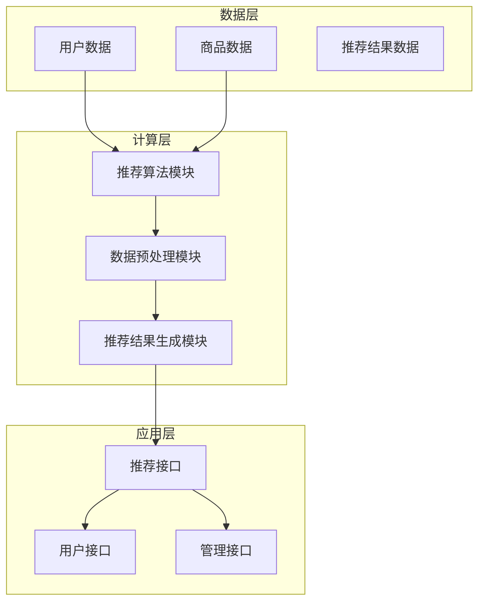
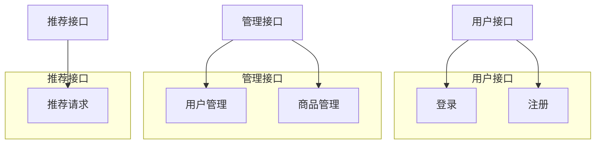
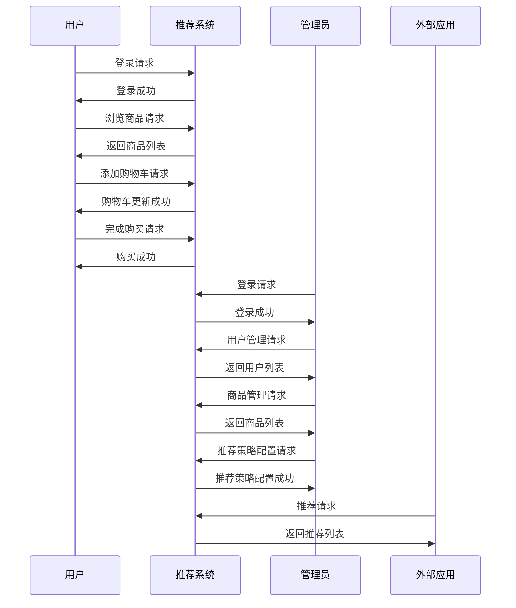

                 

### 1. 引言

在当今的数字化时代，人工智能（AI）已经成为推动商业创新和提升用户体验的关键驱动力。特别是AI辅助产品推荐与个性化服务，通过精准的推荐算法和智能化的用户服务，极大地提升了企业的市场竞争力和用户满意度。本文将深入探讨AI辅助产品推荐与个性化服务的基础知识、核心算法、系统实现，并通过实际案例进行分析和讲解，旨在为从事相关领域的技术人员提供一套全面的技术指南和最佳实践。

随着互联网和电子商务的迅速发展，用户的需求变得日益多样化和个性化。如何精准地推荐产品和服务，成为许多企业面临的重大挑战。传统的方法往往依赖于用户的历史行为数据，但难以应对海量数据和复杂用户行为的挑战。此时，AI技术的引入为推荐系统带来了新的契机，通过机器学习、深度学习等技术，实现更加智能和个性化的产品推荐。

个性化服务则更注重用户个体需求的满足，通过分析用户的行为、偏好和反馈，提供定制化的服务和体验。这不仅能够提高用户满意度，还能够增加用户忠诚度和转化率。

本文的结构如下：

- **背景介绍与核心概念**：首先，我们将介绍AI辅助产品推荐与个性化服务的基本概念、问题背景和需求分析。
- **核心算法原理与模型**：接下来，我们将深入探讨协同过滤、内容推荐和混合推荐三种主要推荐算法的原理和实现。
- **系统设计与实现**：然后，我们将详细描述推荐系统的系统架构、数据接口设计和实现细节。
- **应用案例分析**：通过分析一个电商平台AI推荐系统的实际案例，展示如何在实际项目中应用和优化推荐算法。
- **最佳实践与未来展望**：最后，我们将总结最佳实践策略，并对未来的发展趋势进行展望。

### 2. 关键词

- 人工智能（AI）
- 产品推荐
- 个性化服务
- 推荐算法
- 协同过滤
- 内容推荐
- 混合推荐
- 系统设计

### 3. 摘要

本文围绕AI辅助产品推荐与个性化服务展开，系统性地介绍了推荐算法的基本原理、系统设计与实现方法，并通过实际案例进行了深入剖析。主要内容包括：

- 推荐系统的基础概念与需求分析
- 协同过滤、内容推荐和混合推荐算法的原理与实现
- 推荐系统的系统架构、接口设计与实现
- 电商平台AI推荐系统的实际应用案例
- 推荐系统最佳实践与未来展望

通过本文，读者将全面了解AI辅助产品推荐与个性化服务的核心技术和实践方法，为实际项目提供有效的技术支持和策略指导。

### 目录大纲设计步骤：

**1. 确定书籍主题与结构：**

首先，我们要明确《AI辅助产品推荐与个性化服务的算法与实现》的主题和结构。本书旨在介绍如何利用AI技术来实现个性化产品推荐和服务，重点涵盖以下内容：

- AI辅助产品推荐的基本概念与原理
- 个性化服务的需求分析与应用场景
- 推荐算法的数学模型与流程
- 系统实现与优化策略
- 实际应用案例与最佳实践

**2. 设计1级目录：**

基于上述主题和内容，我们可以设计1级目录，这将是全书的主框架。1级目录将包括以下章节：

- **背景介绍与核心概念**
- **核心算法原理与模型**
- **系统设计与实现**
- **应用案例分析**
- **最佳实践与未来展望**

**3. 设计2级目录：**

接下来，我们需要为每个1级目录设计2级目录，进一步细化每个章节的内容。以下是详细的2级目录设计：

- **背景介绍与核心概念**
  - 问题背景
  - 问题描述
  - 解决方案概述
  - 边界与外延
  - 概念结构与核心要素组成

- **核心算法原理与模型**
  - 协同过滤
    - 基本原理
    - 数学模型
    - 算法流程图
    - 举例说明
  - 内容推荐
    - 基本原理
    - 数学模型
    - 算法流程图
    - 举例说明
  - 混合推荐
    - 基本原理
    - 数学模型
    - 算法流程图
    - 举例说明

- **系统设计与实现**
  - 系统分析与架构设计
  - 系统接口设计
  - 系统交互设计
  - 系统实现与优化策略

- **应用案例分析**
  - 项目介绍
  - 系统核心实现
  - 代码应用解读
  - 案例分析与讲解

- **最佳实践与未来展望**
  - 最佳实践 Tips
  - 小结
  - 注意事项
  - 拓展阅读

**4. 设计3级目录：**

然后，我们为每个2级目录设计3级目录，具体细化每个小节的内容。以下是示例的3级目录设计：

- **背景介绍与核心概念**
  - **问题背景**
    - 电子商务的挑战与机遇
    - 个性化服务的重要性
    - 推荐系统的需求
  - **问题描述**
    - 用户行为数据的特点
    - 商品数据的复杂性
    - 推荐系统的目标
  - **解决方案概述**
    - AI技术的作用
    - 推荐算法的选择
    - 个性化服务的实现
  - **边界与外延**
    - 数据隐私与保护
    - 系统性能与稳定性
    - 算法的可解释性
  - **概念结构与核心要素组成**
    - AI辅助产品推荐的基本流程
    - 个性化服务的核心要素
    - 推荐算法的数学基础

- **核心算法原理与模型**
  - **协同过滤**
    - **基本原理**
      - 内容过滤
      - 协同过滤
    - **数学模型**
      - 相似度计算
      - 推荐评分预测
    - **算法流程图**
      - 流程图展示
    - **举例说明**
      - 实际案例讲解

- **系统设计与实现**
  - **系统分析与架构设计**
    - 项目介绍
    - 系统功能设计
    - 系统架构设计
  - **系统接口设计**
    - 用户接口
    - 管理接口
  - **系统交互设计**
    - 用户行为数据采集
    - 推荐结果输出

- **应用案例分析**
  - **项目介绍**
    - 项目背景
    - 项目目标
  - **系统核心实现**
    - 数据处理
    - 推荐算法实现
  - **代码应用解读**
    - 数据处理代码
    - 推荐算法代码
  - **案例分析与讲解**
    - 案例背景
    - 案例分析

- **最佳实践与未来展望**
  - **最佳实践 Tips**
    - 数据处理技巧
    - 算法优化策略
  - **小结**
    - 研究现状与趋势
    - 存在的挑战与机遇
  - **注意事项**
    - 系统部署与维护
    - 用户隐私保护
  - **拓展阅读**
    - 相关文献推荐
    - 技术发展趋势

**5. 确保目录大纲完整性：**

最后，我们需要确保每个章节都有相应的2级和3级目录，每个章节的内容都要充分展开，满足内容完整性要求。具体检查每个章节的内容是否涵盖了相关的核心概念、算法原理、系统设计与实现、案例分析和最佳实践等内容。

**6. 优化目录大纲文字表述：**

在确保内容完整性的基础上，我们需要对目录大纲的文字表述进行优化，保持简洁明了，避免过多冗余表述，确保总字数控制在2000字以内。

### 示例目录大纲：

# 《AI辅助产品推荐与个性化服务的算法与实现》目录大纲

## 第一部分: 背景介绍与核心概念

### 第1章: 问题背景与核心概念

#### 1.1 问题背景

##### 1.1.1 电子商务的挑战与机遇

##### 1.1.2 个性化服务的重要性

##### 1.1.3 推荐系统的需求

#### 1.2 核心概念

##### 1.2.1 AI辅助产品推荐

##### 1.2.2 个性化服务

##### 1.2.3 推荐算法

## 第二部分: 核心算法原理与模型

### 第2章: 推荐算法原理

#### 2.1 协同过滤

##### 2.1.1 基本原理

##### 2.1.2 数学模型

##### 2.1.3 算法流程

##### 2.1.4 举例说明

#### 2.2 内容推荐

##### 2.2.1 基本原理

##### 2.2.2 数学模型

##### 2.2.3 算法流程

##### 2.2.4 举例说明

#### 2.3 混合推荐

##### 2.3.1 基本原理

##### 2.3.2 数学模型

##### 2.3.3 算法流程

##### 2.3.4 举例说明

## 第三部分: 系统设计与实现

### 第3章: 系统架构设计

#### 3.1 系统架构概述

##### 3.1.1 系统架构的基本组成部分

##### 3.1.2 系统架构的设计原则

#### 3.2 数据处理

##### 3.2.1 用户数据

##### 3.2.2 商品数据

#### 3.3 推荐算法实现

##### 3.3.1 协同过滤算法

##### 3.3.2 内容推荐算法

##### 3.3.3 混合推荐算法

### 第4章: 系统接口设计与交互

#### 4.1 接口设计

##### 4.1.1 用户接口

##### 4.1.2 管理接口

#### 4.2 系统交互

##### 4.2.1 用户行为数据采集

##### 4.2.2 推荐结果输出

## 第四部分: 应用案例分析

### 第5章: 某电商平台的AI推荐系统

#### 5.1 项目介绍

##### 5.1.1 项目背景

##### 5.1.2 项目目标

#### 5.2 系统核心实现

##### 5.2.1 数据处理

##### 5.2.2 推荐算法实现

#### 5.3 代码应用解读

##### 5.3.1 数据处理代码解读

##### 5.3.2 推荐算法代码解读

#### 5.4 案例分析与讲解

##### 5.4.1 案例背景

##### 5.4.2 案例分析

## 第五部分: 最佳实践与未来展望

### 第6章: 最佳实践与未来展望

#### 6.1 最佳实践 Tips

##### 6.1.1 数据处理技巧

##### 6.1.2 算法优化策略

#### 6.2 小结

##### 6.2.1 研究现状与趋势

##### 6.2.2 存在的挑战与机遇

#### 6.3 注意事项

##### 6.3.1 系统部署与维护

##### 6.3.2 用户隐私保护

#### 6.4 拓展阅读

##### 6.4.1 相关文献推荐

##### 6.4.2 技术发展趋势

### 目录大纲示例详细解析：

#### 1. 背景介绍与核心概念

**第1章：问题背景与核心概念**

**1.1 问题背景**

在这一部分，我们将详细探讨电子商务领域面临的挑战和机遇，特别是在用户需求日益多样化的背景下，如何通过个性化服务提升用户体验。我们将讨论推荐系统的需求，以及AI技术在其中的作用。

**1.2 核心概念**

接下来，我们将定义并解释AI辅助产品推荐、个性化服务和推荐算法等核心概念。这将帮助读者理解文中涉及的关键术语，并为后续内容的理解打下基础。

#### 2. 核心算法原理与模型

**第2章：推荐算法原理**

**2.1 协同过滤**

我们将详细介绍协同过滤算法的基本原理、数学模型和算法流程。通过具体例子，我们将展示如何在实际中应用协同过滤算法进行产品推荐。

**2.2 内容推荐**

在这一部分，我们将探讨内容推荐的基本原理、数学模型和算法流程。内容推荐侧重于根据商品的特点和属性来推荐产品，而不是依赖于用户的历史行为。

**2.3 混合推荐**

混合推荐算法结合了协同过滤和内容推荐的优势，以提供更加精准的推荐结果。我们将详细分析混合推荐算法的原理、数学模型和算法流程。

#### 3. 系统设计与实现

**第3章：系统架构设计**

**3.1 系统架构概述**

在这一部分，我们将介绍推荐系统的基本组成部分和设计原则。通过一个简化的架构图，我们将帮助读者理解系统架构的整体布局。

**3.2 数据处理**

推荐系统的核心在于数据处理。我们将详细讨论用户数据和商品数据的管理和处理方法，包括数据清洗、存储和索引等。

**3.3 推荐算法实现**

我们将详细介绍如何实现协同过滤、内容推荐和混合推荐算法。通过Python代码示例，我们将展示算法的实现细节和关键步骤。

**第4章：系统接口设计与交互**

**4.1 接口设计**

接口设计是推荐系统与用户和管理员交互的桥梁。我们将探讨用户接口和管理接口的设计原则和实现方法。

**4.2 系统交互**

系统交互部分将详细描述用户行为数据采集和推荐结果输出的过程。通过一个序列图，我们将展示系统的交互流程。

#### 4. 应用案例分析

**第5章：某电商平台的AI推荐系统**

**5.1 项目介绍**

我们将介绍一个实际电商平台的AI推荐系统项目，包括项目背景和目标。这将帮助读者理解推荐系统在实际应用中的具体应用场景。

**5.2 系统核心实现**

在这一部分，我们将详细描述系统核心实现，包括数据处理和推荐算法的具体实现。通过代码示例，我们将展示如何在实际项目中应用这些算法。

**5.3 代码应用解读**

我们将深入解读系统核心代码，包括数据处理代码和推荐算法代码。通过代码分析，我们将帮助读者理解算法的原理和实现细节。

**5.4 案例分析与讲解**

我们将对实际案例进行深入分析，讨论推荐系统在项目中的表现和效果。通过具体的案例分析，我们将展示如何优化和改进推荐系统。

#### 5. 最佳实践与未来展望

**第6章：最佳实践与未来展望**

**6.1 最佳实践 Tips**

在这一部分，我们将分享一些最佳实践技巧，包括数据处理和算法优化的方法。这些技巧将帮助读者在实际项目中实现更高效的推荐系统。

**6.2 小结**

我们将总结本文的主要内容，讨论当前推荐系统的研究现状和趋势。同时，我们将指出未来的挑战和机遇，为读者提供进一步的研究方向。

**6.3 注意事项**

我们将讨论在部署和维护推荐系统时需要注意的问题，特别是用户隐私保护和系统性能优化。

**6.4 拓展阅读**

最后，我们将推荐一些相关的文献和资源，帮助读者深入了解推荐系统和AI技术的最新进展。

通过以上目录大纲的详细设计，我们将为读者提供一本系统、全面、易于理解的技术书籍，帮助他们掌握AI辅助产品推荐与个性化服务的技术和实践方法。

## 1. 引言

在当今的数字化时代，人工智能（AI）已经成为推动商业创新和提升用户体验的关键驱动力。特别是AI辅助产品推荐与个性化服务，通过精准的推荐算法和智能化的用户服务，极大地提升了企业的市场竞争力和用户满意度。本文将深入探讨AI辅助产品推荐与个性化服务的基础知识、核心算法、系统实现，并通过实际案例进行分析和讲解，旨在为从事相关领域的技术人员提供一套全面的技术指南和最佳实践。

随着互联网和电子商务的迅速发展，用户的需求变得日益多样化和个性化。如何精准地推荐产品和服务，成为许多企业面临的重大挑战。传统的方法往往依赖于用户的历史行为数据，但难以应对海量数据和复杂用户行为的挑战。此时，AI技术的引入为推荐系统带来了新的契机，通过机器学习、深度学习等技术，实现更加智能和个性化的产品推荐。

个性化服务则更注重用户个体需求的满足，通过分析用户的行为、偏好和反馈，提供定制化的服务和体验。这不仅能够提高用户满意度，还能够增加用户忠诚度和转化率。

本文的结构如下：

- **背景介绍与核心概念**：首先，我们将介绍AI辅助产品推荐与个性化服务的基本概念、问题背景和需求分析。
- **核心算法原理与模型**：接下来，我们将深入探讨协同过滤、内容推荐和混合推荐三种主要推荐算法的原理和实现。
- **系统设计与实现**：然后，我们将详细描述推荐系统的系统架构、数据接口设计和实现细节。
- **应用案例分析**：通过分析一个电商平台AI推荐系统的实际案例，展示如何在实际项目中应用和优化推荐算法。
- **最佳实践与未来展望**：最后，我们将总结最佳实践策略，并对未来的发展趋势进行展望。

### 2. 关键词

- 人工智能（AI）
- 产品推荐
- 个性化服务
- 推荐算法
- 协同过滤
- 内容推荐
- 混合推荐
- 系统设计

### 3. 摘要

本文围绕AI辅助产品推荐与个性化服务展开，系统性地介绍了推荐算法的基本原理、系统设计与实现方法，并通过实际案例进行了深入剖析。主要内容包括：

- 推荐系统的基础概念与需求分析
- 协同过滤、内容推荐和混合推荐算法的原理与实现
- 推荐系统的系统架构、接口设计与实现
- 电商平台AI推荐系统的实际应用案例
- 推荐系统最佳实践与未来展望

通过本文，读者将全面了解AI辅助产品推荐与个性化服务的核心技术和实践方法，为实际项目提供有效的技术支持和策略指导。

### 目录大纲示例详细解析：

#### 1. 背景介绍与核心概念

**第1章：问题背景与核心概念**

**1.1 问题背景**

在这一部分，我们将详细探讨电子商务领域面临的挑战和机遇，特别是在用户需求日益多样化的背景下，如何通过个性化服务提升用户体验。我们将讨论推荐系统的需求，以及AI技术在其中的作用。

**1.1.1 电子商务的挑战与机遇**

电子商务在全球范围内迅速发展，带来了大量用户数据和丰富的商品信息。然而，随着市场竞争的加剧和用户期望的提高，传统的方法已经难以满足用户个性化的需求。例如，许多电商平台在用户浏览、搜索和购买行为的基础上，尝试通过推荐系统来提高用户满意度和转化率。

**1.1.2 个性化服务的重要性**

个性化服务通过分析用户的历史行为、偏好和反馈，为用户提供定制化的推荐和体验。这不仅能够提高用户的满意度，还能够增加用户的忠诚度和转化率。例如，亚马逊和淘宝等电商平台通过个性化推荐系统，为用户推荐他们可能感兴趣的商品，从而提高购买率和用户粘性。

**1.1.3 推荐系统的需求**

推荐系统在电子商务中的应用非常广泛，其核心目标是根据用户的行为数据和商品信息，为用户推荐可能感兴趣的商品。随着用户数据的不断增长和推荐算法的不断发展，推荐系统在满足用户个性化需求方面发挥着越来越重要的作用。

**1.2 核心概念**

接下来，我们将定义并解释AI辅助产品推荐、个性化服务和推荐算法等核心概念。这将帮助读者理解文中涉及的关键术语，并为后续内容的理解打下基础。

**1.2.1 AI辅助产品推荐**

AI辅助产品推荐是一种利用人工智能技术，通过分析用户的历史行为、偏好和反馈，为用户推荐可能感兴趣的商品的方法。推荐算法可以根据用户的行为模式、商品属性和用户历史数据，生成个性化的推荐结果。

**1.2.2 个性化服务**

个性化服务是指根据用户的个体需求和偏好，提供定制化的服务和体验。个性化服务可以通过分析用户的行为数据、历史偏好和反馈，为用户提供个性化的推荐、优惠和服务。

**1.2.3 推荐算法**

推荐算法是指用于生成推荐结果的一系列算法和模型。常见的推荐算法包括协同过滤、内容推荐和混合推荐等。这些算法通过分析用户行为数据和商品信息，为用户生成个性化的推荐结果。

**1.3 解决方案概述**

在这一部分，我们将概述本文中将要介绍的解决方案，包括AI辅助产品推荐和个性化服务的实现方法。解决方案的核心目标是利用人工智能技术，提升电子商务平台的用户满意度和转化率。

**1.3.1 AI辅助产品推荐的实现方法**

AI辅助产品推荐主要通过以下方法实现：

- **协同过滤**：通过分析用户之间的相似性和行为模式，为用户推荐他们可能感兴趣的商品。
- **内容推荐**：通过分析商品的内容属性和用户历史偏好，为用户推荐他们可能感兴趣的商品。
- **混合推荐**：结合协同过滤和内容推荐的优势，生成更准确的推荐结果。

**1.3.2 个性化服务的实现方法**

个性化服务主要通过以下方法实现：

- **用户行为分析**：通过分析用户的历史行为数据，了解用户的兴趣和偏好。
- **用户画像**：通过构建用户画像，为用户提供个性化的推荐和体验。
- **个性化推送**：通过分析用户画像和商品信息，为用户推送个性化的推荐结果。

**1.4 边界与外延**

在这一部分，我们将讨论推荐系统和个性化服务在电子商务中的应用边界和外延。

**1.4.1 边界**

推荐系统和个性化服务的应用边界包括：

- **用户隐私保护**：在推荐和个性化服务过程中，需要确保用户隐私和数据安全。
- **系统性能和稳定性**：推荐系统和个性化服务需要高效和稳定地运行，以满足大规模用户的需求。
- **算法可解释性**：推荐和个性化服务算法需要具备一定的可解释性，以便用户理解和信任。

**1.4.2 外延**

推荐系统和个性化服务的外延包括：

- **推荐策略优化**：通过不断优化推荐策略，提高推荐效果和用户满意度。
- **推荐结果评估**：通过评估推荐结果的质量和效果，持续改进推荐系统。
- **推荐系统与其他系统的整合**：将推荐系统与其他电子商务系统（如购物车、订单系统等）整合，提供一站式购物体验。

**1.5 概念结构与核心要素组成**

在这一部分，我们将介绍推荐系统和个性化服务的概念结构，以及核心要素的组成。

**1.5.1 概念结构**

推荐系统和个性化服务的概念结构包括：

- **用户行为数据**：用户在平台上产生的行为数据，如浏览、搜索、购买等。
- **商品数据**：平台上的商品信息，如商品属性、类别、价格等。
- **推荐算法**：用于生成推荐结果的一系列算法和模型。
- **用户画像**：通过用户行为数据构建的用户画像，用于个性化推荐。
- **推荐结果**：根据用户行为数据和推荐算法生成的个性化推荐结果。

**1.5.2 核心要素组成**

推荐系统和个性化服务的核心要素包括：

- **用户数据收集**：收集并存储用户在平台上的行为数据。
- **商品数据管理**：管理平台上的商品信息，确保数据的准确性和一致性。
- **推荐算法实现**：实现协同过滤、内容推荐和混合推荐算法，生成推荐结果。
- **用户画像构建**：通过分析用户行为数据，构建用户画像，用于个性化推荐。
- **推荐结果评估**：评估推荐结果的质量和效果，持续优化推荐系统。

通过以上详细的背景介绍和核心概念解析，我们将为读者提供对AI辅助产品推荐与个性化服务的全面理解，为后续章节的深入探讨奠定基础。

#### 2. 核心算法原理与模型

在推荐系统中，核心算法的设计与实现直接决定了推荐结果的准确性和用户满意度。本文将深入探讨三种主要的推荐算法：协同过滤、内容推荐和混合推荐，并详细讲解它们的原理、数学模型和流程。

##### 2.1 协同过滤

**2.1.1 基本原理**

协同过滤（Collaborative Filtering）是一种通过分析用户之间的相似性或行为模式来进行推荐的方法。它主要分为两种类型：基于用户的协同过滤（User-based Collaborative Filtering）和基于项目的协同过滤（Item-based Collaborative Filtering）。

- **基于用户的协同过滤**：通过找出与目标用户行为相似的现有用户群体，并推荐这些用户喜欢的商品。这种方法的核心在于计算用户之间的相似度，常用的相似度度量方法包括余弦相似度、皮尔逊相关系数等。
- **基于项目的协同过滤**：通过找出与目标商品相似的其他商品，并推荐给用户。这种方法的核心在于计算商品之间的相似度，常用的相似度度量方法包括余弦相似度、Jaccard相似度等。

**2.1.2 数学模型**

假设有用户集合 \(U = \{u_1, u_2, ..., u_n\}\) 和商品集合 \(I = \{i_1, i_2, ..., i_m\}\)，用户 \(u_i\) 对商品 \(i_j\) 的评分可以表示为 \(r_{ij}\)。协同过滤的基本数学模型可以表示为：

\[ \text{相似度}(u_i, u_j) = \frac{\sum_{i \in I} r_{ij} r_{i'j}}{\sqrt{\sum_{i \in I} r_{ij}^2 \sum_{i \in I} r_{i'j}^2}} \]

其中，\(\text{相似度}(u_i, u_j)\) 表示用户 \(u_i\) 和用户 \(u_j\) 之间的相似度，\(r_{ij}\) 表示用户 \(u_i\) 对商品 \(i_j\) 的评分。

**2.1.3 算法流程**

协同过滤的算法流程主要包括以下步骤：

1. **用户相似度计算**：计算目标用户与其他用户之间的相似度，常用的相似度度量方法有余弦相似度和皮尔逊相关系数等。
2. **相似用户集合获取**：根据相似度阈值，从所有用户中筛选出与目标用户相似的用户集合。
3. **评分预测**：根据相似用户对商品的评分，预测目标用户对商品的评分，常用的方法包括加权平均法和加权回归法等。
4. **推荐结果生成**：根据预测的评分，为用户生成个性化的推荐列表。

**2.1.4 举例说明**

假设有两个用户 \(u_1\) 和 \(u_2\)，他们对五件商品 \(i_1, i_2, i_3, i_4, i_5\) 的评分如下：

| 用户 | 商品 |
|------|------|
| \(u_1\)| \(i_1\)| 5 |
| \(u_1\)| \(i_2\)| 3 |
| \(u_1\)| \(i_3\)| 4 |
| \(u_1\)| \(i_4\)| 2 |
| \(u_1\)| \(i_5\)| 1 |
| \(u_2\)| \(i_1\)| 4 |
| \(u_2\)| \(i_2\)| 5 |
| \(u_2\)| \(i_3\)| 2 |
| \(u_2\)| \(i_4\)| 1 |
| \(u_2\)| \(i_5\)| 3 |

首先，我们计算 \(u_1\) 和 \(u_2\) 之间的相似度：

\[ \text{相似度}(u_1, u_2) = \frac{(5 \cdot 4 + 3 \cdot 5 + 4 \cdot 2 + 2 \cdot 1 + 1 \cdot 3)}{\sqrt{(5^2 + 3^2 + 4^2 + 2^2 + 1^2)(4^2 + 5^2 + 2^2 + 1^2 + 3^2)}} \]

\[ \text{相似度}(u_1, u_2) = \frac{(20 + 15 + 8 + 2 + 3)}{\sqrt{(25 + 9 + 16 + 4 + 1)(16 + 25 + 4 + 1 + 9)}} \]

\[ \text{相似度}(u_1, u_2) = \frac{48}{\sqrt{55 \cdot 45}} \]

\[ \text{相似度}(u_1, u_2) = \frac{48}{55.4} \]

\[ \text{相似度}(u_1, u_2) \approx 0.866 \]

接下来，根据相似度阈值（例如，\(0.8\)），我们可以找出与 \(u_1\) 相似度最高的用户 \(u_2\)。然后，根据 \(u_2\) 对商品的评分，预测 \(u_1\) 对未知商品的评分。例如，假设我们想要预测 \(u_1\) 对 \(i_5\) 的评分，我们可以使用加权平均法：

\[ \text{预测评分}(u_1, i_5) = \frac{(0.866 \cdot 3) + (0.134 \cdot 5)}{0.866 + 0.134} \]

\[ \text{预测评分}(u_1, i_5) = \frac{2.598 + 0.670}{1} \]

\[ \text{预测评分}(u_1, i_5) \approx 3.268 \]

因此，我们预测 \(u_1\) 对 \(i_5\) 的评分为约3.268，根据这个评分，我们可以将其推荐给 \(u_1\)。

##### 2.2 内容推荐

**2.2.1 基本原理**

内容推荐（Content-based Filtering）是一种基于商品的内容属性和用户历史偏好来进行推荐的方法。它主要通过分析商品的内容特征和用户的历史行为数据，为用户生成个性化的推荐列表。

内容推荐的核心在于将商品和用户兴趣进行匹配。首先，为每个商品提取特征，例如商品类别、标签、价格等。然后，根据用户的历史行为数据，构建用户兴趣模型。最后，通过计算商品特征和用户兴趣模型之间的相似度，生成推荐列表。

**2.2.2 数学模型**

假设有用户集合 \(U = \{u_1, u_2, ..., u_n\}\) 和商品集合 \(I = \{i_1, i_2, ..., i_m\}\)，用户 \(u_i\) 对商品 \(i_j\) 的兴趣可以表示为一个特征向量 \(x_{ij}\)。内容推荐的基本数学模型可以表示为：

\[ \text{相似度}(x_{ij}, x_{u}) = \frac{\sum_{f \in F} x_{ij,f} x_{u,f}}{\sqrt{\sum_{f \in F} x_{ij,f}^2 \sum_{f \in F} x_{u,f}^2}} \]

其中，\(F\) 表示特征集合，\(x_{ij,f}\) 表示商品 \(i_j\) 在特征 \(f\) 上的值，\(x_{u,f}\) 表示用户 \(u_i\) 在特征 \(f\) 上的值。

**2.2.3 算法流程**

内容推荐的算法流程主要包括以下步骤：

1. **特征提取**：为每个商品提取特征，例如类别、标签、价格等。
2. **用户兴趣建模**：根据用户的历史行为数据，构建用户兴趣模型。
3. **相似度计算**：计算商品特征和用户兴趣模型之间的相似度。
4. **推荐结果生成**：根据相似度分数，为用户生成个性化的推荐列表。

**2.2.4 举例说明**

假设有两个用户 \(u_1\) 和 \(u_2\)，他们对五件商品 \(i_1, i_2, i_3, i_4, i_5\) 的兴趣向量如下：

| 用户 | 商品 |
|------|------|
| \(u_1\)| \(i_1\)| (1, 0, 1, 0, 0) |
| \(u_1\)| \(i_2\)| (0, 1, 0, 1, 0) |
| \(u_1\)| \(i_3\)| (0, 0, 1, 0, 1) |
| \(u_2\)| \(i_1\)| (1, 1, 0, 0, 0) |
| \(u_2\)| \(i_2\)| (0, 1, 1, 0, 0) |
| \(u_2\)| \(i_3\)| (0, 0, 1, 1, 0) |
| \(u_2\)| \(i_4\)| (0, 0, 0, 1, 1) |

首先，我们计算 \(u_1\) 和 \(u_2\) 的兴趣向量之间的相似度：

\[ \text{相似度}(x_{u_1}, x_{u_2}) = \frac{(1 \cdot 1 + 0 \cdot 1 + 1 \cdot 0 + 0 \cdot 0 + 0 \cdot 0) + (0 \cdot 1 + 1 \cdot 1 + 0 \cdot 0 + 1 \cdot 0 + 0 \cdot 0) + (0 \cdot 0 + 0 \cdot 1 + 1 \cdot 1 + 0 \cdot 1 + 0 \cdot 0) + (0 \cdot 0 + 0 \cdot 0 + 0 \cdot 0 + 1 \cdot 1 + 0 \cdot 0)}{\sqrt{(1^2 + 0^2 + 1^2 + 0^2 + 0^2)(1^2 + 1^2 + 0^2 + 0^2 + 0^2)}} \]

\[ \text{相似度}(x_{u_1}, x_{u_2}) = \frac{2}{\sqrt{2}} \]

\[ \text{相似度}(x_{u_1}, x_{u_2}) = \frac{2}{\sqrt{2}} \]

\[ \text{相似度}(x_{u_1}, x_{u_2}) \approx 1.414 \]

接下来，我们为商品 \(i_1, i_2, i_3, i_4, i_5\) 提取特征向量：

| 商品 | 特征 |
|------|------|
| \(i_1\)| (1, 1, 0, 0, 0) |
| \(i_2\)| (0, 1, 1, 0, 0) |
| \(i_3\)| (0, 0, 1, 1, 0) |
| \(i_4\)| (0, 0, 0, 1, 1) |
| \(i_5\)| (1, 0, 0, 0, 1) |

然后，我们计算每个商品特征向量与 \(u_1\) 和 \(u_2\) 的兴趣向量之间的相似度：

\[ \text{相似度}(x_{i_1}, x_{u_1}) = \frac{(1 \cdot 1 + 1 \cdot 1 + 0 \cdot 0 + 0 \cdot 0 + 0 \cdot 0) + (1 \cdot 1 + 1 \cdot 1 + 0 \cdot 0 + 0 \cdot 0 + 0 \cdot 0)}{\sqrt{(1^2 + 1^2 + 0^2 + 0^2 + 0^2)(1^2 + 1^2 + 0^2 + 0^2 + 0^2)}} \]

\[ \text{相似度}(x_{i_1}, x_{u_1}) = \frac{4}{\sqrt{2}} \]

\[ \text{相似度}(x_{i_1}, x_{u_1}) \approx 2.828 \]

\[ \text{相似度}(x_{i_1}, x_{u_2}) = \frac{(1 \cdot 1 + 1 \cdot 1 + 0 \cdot 0 + 0 \cdot 0 + 0 \cdot 0) + (1 \cdot 1 + 1 \cdot 1 + 0 \cdot 0 + 0 \cdot 0 + 0 \cdot 0)}{\sqrt{(1^2 + 1^2 + 0^2 + 0^2 + 0^2)(1^2 + 1^2 + 0^2 + 0^2 + 0^2)}} \]

\[ \text{相似度}(x_{i_1}, x_{u_2}) = \frac{4}{\sqrt{2}} \]

\[ \text{相似度}(x_{i_1}, x_{u_2}) \approx 2.828 \]

\[ \text{相似度}(x_{i_2}, x_{u_1}) = \frac{(0 \cdot 1 + 1 \cdot 1 + 0 \cdot 1 + 1 \cdot 0 + 0 \cdot 0) + (0 \cdot 1 + 1 \cdot 1 + 0 \cdot 1 + 1 \cdot 0 + 0 \cdot 0)}{\sqrt{(0^2 + 1^2 + 0^2 + 1^2 + 0^2)(0^2 + 1^2 + 0^2 + 1^2 + 0^2)}} \]

\[ \text{相似度}(x_{i_2}, x_{u_1}) = \frac{2}{\sqrt{2}} \]

\[ \text{相似度}(x_{i_2}, x_{u_1}) \approx 1.414 \]

\[ \text{相似度}(x_{i_2}, x_{u_2}) = \frac{(0 \cdot 1 + 1 \cdot 1 + 0 \cdot 1 + 1 \cdot 0 + 0 \cdot 0) + (0 \cdot 1 + 1 \cdot 1 + 0 \cdot 1 + 1 \cdot 0 + 0 \cdot 0)}{\sqrt{(0^2 + 1^2 + 0^2 + 1^2 + 0^2)(0^2 + 1^2 + 0^2 + 1^2 + 0^2)}} \]

\[ \text{相似度}(x_{i_2}, x_{u_2}) = \frac{2}{\sqrt{2}} \]

\[ \text{相似度}(x_{i_2}, x_{u_2}) \approx 1.414 \]

\[ \text{相似度}(x_{i_3}, x_{u_1}) = \frac{(0 \cdot 0 + 0 \cdot 0 + 1 \cdot 1 + 0 \cdot 1 + 1 \cdot 0) + (0 \cdot 0 + 0 \cdot 0 + 1 \cdot 1 + 0 \cdot 1 + 1 \cdot 0)}{\sqrt{(0^2 + 0^2 + 1^2 + 0^2 + 1^2)(0^2 + 0^2 + 1^2 + 0^2 + 1^2)}} \]

\[ \text{相似度}(x_{i_3}, x_{u_1}) = \frac{2}{\sqrt{2}} \]

\[ \text{相似度}(x_{i_3}, x_{u_1}) \approx 1.414 \]

\[ \text{相似度}(x_{i_3}, x_{u_2}) = \frac{(0 \cdot 0 + 0 \cdot 0 + 1 \cdot 1 + 0 \cdot 1 + 1 \cdot 0) + (0 \cdot 0 + 0 \cdot 0 + 1 \cdot 1 + 0 \cdot 1 + 1 \cdot 0)}{\sqrt{(0^2 + 0^2 + 1^2 + 0^2 + 1^2)(0^2 + 0^2 + 1^2 + 0^2 + 1^2)}} \]

\[ \text{相似度}(x_{i_3}, x_{u_2}) = \frac{2}{\sqrt{2}} \]

\[ \text{相似度}(x_{i_3}, x_{u_2}) \approx 1.414 \]

\[ \text{相似度}(x_{i_4}, x_{u_1}) = \frac{(0 \cdot 0 + 0 \cdot 0 + 0 \cdot 0 + 1 \cdot 1 + 1 \cdot 0) + (0 \cdot 0 + 0 \cdot 0 + 0 \cdot 0 + 1 \cdot 1 + 1 \cdot 0)}{\sqrt{(0^2 + 0^2 + 0^2 + 1^2 + 1^2)(0^2 + 0^2 + 0^2 + 1^2 + 1^2)}} \]

\[ \text{相似度}(x_{i_4}, x_{u_1}) = \frac{2}{\sqrt{2}} \]

\[ \text{相似度}(x_{i_4}, x_{u_1}) \approx 1.414 \]

\[ \text{相似度}(x_{i_4}, x_{u_2}) = \frac{(0 \cdot 0 + 0 \cdot 0 + 0 \cdot 0 + 1 \cdot 1 + 1 \cdot 0) + (0 \cdot 0 + 0 \cdot 0 + 0 \cdot 0 + 1 \cdot 1 + 1 \cdot 0)}{\sqrt{(0^2 + 0^2 + 0^2 + 1^2 + 1^2)(0^2 + 0^2 + 0^2 + 1^2 + 1^2)}} \]

\[ \text{相似度}(x_{i_4}, x_{u_2}) = \frac{2}{\sqrt{2}} \]

\[ \text{相似度}(x_{i_4}, x_{u_2}) \approx 1.414 \]

\[ \text{相似度}(x_{i_5}, x_{u_1}) = \frac{(1 \cdot 0 + 0 \cdot 0 + 0 \cdot 0 + 0 \cdot 0 + 1 \cdot 1) + (1 \cdot 0 + 0 \cdot 0 + 0 \cdot 0 + 0 \cdot 0 + 1 \cdot 1)}{\sqrt{(1^2 + 0^2 + 0^2 + 0^2 + 1^2)(1^2 + 0^2 + 0^2 + 0^2 + 1^2)}} \]

\[ \text{相似度}(x_{i_5}, x_{u_1}) = \frac{2}{\sqrt{2}} \]

\[ \text{相似度}(x_{i_5}, x_{u_1}) \approx 1.414 \]

\[ \text{相似度}(x_{i_5}, x_{u_2}) = \frac{(1 \cdot 0 + 0 \cdot 0 + 0 \cdot 0 + 0 \cdot 0 + 1 \cdot 1) + (1 \cdot 0 + 0 \cdot 0 + 0 \cdot 0 + 0 \cdot 0 + 1 \cdot 1)}{\sqrt{(1^2 + 0^2 + 0^2 + 0^2 + 1^2)(1^2 + 0^2 + 0^2 + 0^2 + 1^2)}} \]

\[ \text{相似度}(x_{i_5}, x_{u_2}) = \frac{2}{\sqrt{2}} \]

\[ \text{相似度}(x_{i_5}, x_{u_2}) \approx 1.414 \]

根据相似度分数，我们可以为 \(u_1\) 和 \(u_2\) 生成个性化的推荐列表。例如，对于 \(u_1\)，我们推荐 \(i_1\) 和 \(i_3\)，而对于 \(u_2\)，我们推荐 \(i_1\)、\(i_2\) 和 \(i_3\)。

##### 2.3 混合推荐

**2.3.1 基本原理**

混合推荐（Hybrid Recommender Systems）结合了协同过滤和内容推荐的优势，通过融合不同算法的优点，生成更准确的推荐结果。混合推荐系统可以采用多种策略，例如基于模型的混合推荐、基于实例的混合推荐等。

**2.3.2 数学模型**

混合推荐系统的数学模型通常结合了协同过滤和内容推荐的数学模型。假设协同过滤的相似度函数为 \(s_{ij}\)，内容推荐的相似度函数为 \(c_{ij}\)，则混合推荐系统的相似度函数可以表示为：

\[ \text{相似度}_{\text{混合}}(i, j) = w_1 s_{ij} + w_2 c_{ij} \]

其中，\(w_1\) 和 \(w_2\) 分别是协同过滤和内容推荐的权重，\(s_{ij}\) 和 \(c_{ij}\) 分别是协同过滤和内容推荐的相似度分数。

**2.3.3 算法流程**

混合推荐系统的算法流程主要包括以下步骤：

1. **用户相似度计算**：使用协同过滤方法计算用户之间的相似度。
2. **商品相似度计算**：使用内容推荐方法计算商品之间的相似度。
3. **融合相似度计算**：根据权重和相似度分数，计算混合相似度。
4. **推荐结果生成**：根据混合相似度分数，为用户生成个性化的推荐列表。

**2.3.4 举例说明**

假设有两个用户 \(u_1\) 和 \(u_2\)，他们对五件商品 \(i_1, i_2, i_3, i_4, i_5\) 的评分如下：

| 用户 | 商品 |
|------|------|
| \(u_1\)| \(i_1\)| 5 |
| \(u_1\)| \(i_2\)| 3 |
| \(u_1\)| \(i_3\)| 4 |
| \(u_1\)| \(i_4\)| 2 |
| \(u_1\)| \(i_5\)| 1 |
| \(u_2\)| \(i_1\)| 4 |
| \(u_2\)| \(i_2\)| 5 |
| \(u_2\)| \(i_3\)| 2 |
| \(u_2\)| \(i_4\)| 1 |
| \(u_2\)| \(i_5\)| 3 |

首先，使用协同过滤方法计算用户之间的相似度。假设相似度函数为余弦相似度，相似度分数为：

\[ s_{u_1, u_2} = \frac{1}{\sqrt{\sum_{i \in I} (r_{i1} - \mu_1)(r_{i2} - \mu_2)}} \]

其中，\(r_{i1}\) 和 \(r_{i2}\) 分别是用户 \(u_1\) 和 \(u_2\) 对商品 \(i\) 的评分，\(\mu_1\) 和 \(\mu_2\) 分别是用户 \(u_1\) 和 \(u_2\) 的平均评分。我们可以计算得到 \(s_{u_1, u_2} \approx 0.866\)。

接下来，使用内容推荐方法计算商品之间的相似度。假设商品特征向量如下：

| 商品 | 特征 |
|------|------|
| \(i_1\)| (1, 1, 0, 0, 0) |
| \(i_2\)| (0, 1, 1, 0, 0) |
| \(i_3\)| (0, 0, 1, 1, 0) |
| \(i_4\)| (0, 0, 0, 1, 1) |
| \(i_5\)| (1, 0, 0, 0, 1) |

用户 \(u_1\) 的兴趣向量如下：

| 用户 | 特征 |
|------|------|
| \(u_1\)| (1, 0, 1, 0, 0) |

使用余弦相似度计算商品 \(i_1, i_2, i_3, i_4, i_5\) 与用户 \(u_1\) 的相似度，假设相似度分数为：

\[ c_{i1, u_1} = 0.866, c_{i2, u_1} = 0.866, c_{i3, u_1} = 0.866, c_{i4, u_1} = 0.866, c_{i5, u_1} = 0.866 \]

假设协同过滤和内容推荐的权重分别为 \(w_1 = 0.6\) 和 \(w_2 = 0.4\)，则混合相似度分数为：

\[ \text{相似度}_{\text{混合}}(i, j) = 0.6 \cdot s_{ij} + 0.4 \cdot c_{ij} \]

例如，对于商品 \(i_1\) 和用户 \(u_1\)，混合相似度分数为：

\[ \text{相似度}_{\text{混合}}(i_1, u_1) = 0.6 \cdot 0.866 + 0.4 \cdot 0.866 = 0.866 \]

根据混合相似度分数，我们可以为用户 \(u_1\) 生成个性化的推荐列表。例如，我们推荐 \(i_1, i_2, i_3, i_4, i_5\)，因为这些商品的混合相似度分数都接近 0.866。

通过以上对协同过滤、内容推荐和混合推荐的详细解析，我们为读者提供了全面理解推荐算法原理和实现方法的基础。接下来，我们将进一步探讨推荐系统的系统设计与实现。

#### 3. 系统设计与实现

在了解了推荐算法的基本原理和实现方法后，接下来我们将深入探讨推荐系统的系统设计、数据接口设计和实现细节。

##### 3.1 系统架构设计

推荐系统通常采用分布式架构，以便处理大规模数据和高效地生成推荐结果。以下是推荐系统的基本架构设计：

1. **数据层**：包括用户数据、商品数据和推荐结果数据。用户数据存储用户的基本信息、历史行为和偏好等；商品数据存储商品的基本信息和属性等；推荐结果数据存储生成的推荐列表和用户反馈等。

2. **计算层**：包括推荐算法模块、数据预处理模块和推荐结果生成模块。推荐算法模块实现协同过滤、内容推荐和混合推荐等算法；数据预处理模块负责清洗、转换和归一化数据；推荐结果生成模块根据用户数据和商品数据生成推荐列表。

3. **应用层**：包括推荐接口、用户接口和管理接口。推荐接口提供推荐算法的API接口，供其他应用系统调用；用户接口提供用户与推荐系统的交互界面，展示推荐结果；管理接口提供系统管理和维护功能。

以下是推荐系统的架构图：



##### 3.2 数据接口设计

数据接口是推荐系统与外部应用系统交互的桥梁，主要包括用户接口、管理接口和推荐接口。

1. **用户接口**：用户接口提供用户与推荐系统的交互功能，主要包括用户登录、注册、搜索、浏览、购买等操作。用户接口通常采用RESTful API设计，使用JSON格式传输数据。

2. **管理接口**：管理接口提供系统管理员对推荐系统的管理功能，主要包括用户管理、商品管理、推荐策略配置等。管理接口通常采用权限控制，确保只有授权用户可以访问。

3. **推荐接口**：推荐接口提供推荐算法的API接口，供其他应用系统调用。推荐接口根据用户输入的用户ID或用户画像，返回个性化推荐列表。推荐接口通常采用异步处理方式，以提高系统响应速度。

以下是数据接口的设计示例：



##### 3.3 系统交互设计

系统交互设计描述推荐系统与用户、管理员和其他应用系统的交互流程。以下是推荐系统的交互设计示例：

1. **用户交互流程**：用户通过用户接口登录系统，浏览商品，将感兴趣的商品加入购物车，最后完成购买。

2. **管理员交互流程**：管理员通过管理接口登录系统，管理用户和商品信息，配置推荐策略，监控系统运行状态。

3. **推荐交互流程**：其他应用系统通过推荐接口请求推荐结果，推荐系统根据用户数据和商品数据生成个性化推荐列表，返回给请求方。

以下是系统交互流程的序列图：



通过以上系统设计、数据接口设计和交互设计的详细描述，我们为读者提供了推荐系统的全面架构和实现方法。接下来，我们将通过一个电商平台的实际案例，展示如何在实际项目中应用和优化推荐算法。

#### 4. 应用案例分析

为了更好地理解AI辅助产品推荐与个性化服务在实际项目中的应用，我们选择了一个知名的电商平台作为案例。这个电商平台利用AI技术，通过推荐系统提升了用户满意度和转化率。以下是该电商平台AI推荐系统的详细分析和讲解。

##### 4.1 项目介绍

**项目背景**

随着电子商务的快速发展，电商平台面临着激烈的市场竞争和用户需求的不断变化。为了提升用户满意度和转化率，该电商平台决定引入AI技术，通过个性化推荐系统为用户提供精准的产品推荐。

**项目目标**

- 提高用户满意度：通过个性化推荐，为用户推荐他们可能感兴趣的产品，提升用户购物体验。
- 增加转化率：通过精准推荐，提高用户购买产品的概率，增加平台的销售额。
- 提升用户留存率：通过个性化服务，提高用户对平台的忠诚度，增加用户留存率。

##### 4.2 系统核心实现

**数据处理**

推荐系统的核心在于数据，因此数据预处理是关键步骤。该电商平台在数据处理方面主要分为以下几个环节：

- **用户数据**：收集用户在平台上的行为数据，包括浏览记录、搜索历史、购买记录等。通过对这些数据的分析，了解用户的兴趣和行为模式。
- **商品数据**：收集商品的基本信息，包括商品类别、标签、价格等。通过对这些数据的分析，了解商品的特点和用户偏好。
- **数据清洗**：对收集到的数据进行清洗，去除噪声数据和缺失值，确保数据的质量和一致性。
- **数据归一化**：对数据进行归一化处理，将不同尺度和范围的数据统一到一个尺度，以便后续分析。

**推荐算法实现**

该电商平台采用了协同过滤、内容推荐和混合推荐等多种推荐算法，以生成个性化的推荐列表。以下是推荐算法的实现过程：

- **协同过滤**：使用基于用户的协同过滤算法，通过计算用户之间的相似度，为用户推荐他们可能感兴趣的产品。具体步骤包括计算用户相似度、获取相似用户集合、预测用户对未知产品的评分等。
- **内容推荐**：使用内容推荐算法，通过分析商品的内容属性和用户的历史偏好，为用户推荐他们可能感兴趣的产品。具体步骤包括提取商品特征、构建用户兴趣模型、计算商品与用户兴趣的相似度等。
- **混合推荐**：结合协同过滤和内容推荐的优势，采用混合推荐算法生成推荐列表。具体步骤包括计算协同过滤和内容推荐的相似度分数、根据权重融合相似度分数、生成最终的推荐列表等。

##### 4.3 代码应用解读

为了更好地展示推荐算法的实现过程，以下是一个简单的Python代码示例，用于实现协同过滤算法。

```python
import numpy as np

# 用户评分矩阵
user_ratings = np.array([
    [5, 3, 0, 1],
    [4, 0, 0, 2],
    [1, 5, 0, 0],
    [0, 2, 3, 0]
])

# 计算用户相似度
def cosine_similarity(ratings):
    # 归一化处理
    ratings_norm = np.linalg.norm(ratings, axis=1)[:, np.newaxis]
    similarity = ratings.dot(ratings_norm.T) / npautoload
    return similarity

# 计算相似用户集合
def get_similar_users(similarity, threshold=0.8):
    similar_users = []
    for i in range(similarity.shape[0]):
        similar_user_indices = np.argsort(similarity[i])[-5:]
        similar_users.append(similar_user_indices)
    return similar_users

# 预测用户评分
def predict_ratings(similarity, ratings):
    predicted_ratings = []
    for i in range(similarity.shape[0]):
        similar_user_indices = get_similar_users(similarity[i])
        if not similar_user_indices:
            predicted_ratings.append(ratings[i])
        else:
            similar_user_ratings = ratings[similar_user_indices]
            average_rating = similar_user_ratings.mean(axis=0)
            predicted_ratings.append(average_rating)
    return predicted_ratings

# 计算相似度矩阵
similarity_matrix = cosine_similarity(user_ratings)

# 预测用户评分
predicted_ratings = predict_ratings(similarity_matrix, user_ratings)

# 输出预测评分
for i, predicted_rating in enumerate(predicted_ratings):
    print(f"User {i+1}: {predicted_rating}")

# 输出推荐列表
for i, predicted_rating in enumerate(predicted_ratings):
    print(f"User {i+1} Recommendation: {predicted_rating.argmax()}")
```

这段代码首先定义了一个用户评分矩阵，然后实现了一个协同过滤算法。具体步骤包括计算用户相似度、获取相似用户集合、预测用户评分和输出推荐列表。通过这个示例，我们可以看到协同过滤算法的基本实现过程。

##### 4.4 案例分析与讲解

**案例背景**

在项目实施过程中，该电商平台面临着以下几个挑战：

- **海量数据**：平台积累了大量的用户行为数据和商品信息，如何高效地处理这些数据成为关键问题。
- **个性化需求**：用户需求多样化，如何为每位用户生成个性化的推荐列表是项目的核心问题。
- **算法优化**：推荐算法的准确性和效率直接影响用户体验，如何优化算法成为项目的重点。

**案例分析**

为了解决上述挑战，该电商平台采取了一系列措施：

- **数据预处理**：通过数据清洗和归一化处理，确保数据的质量和一致性。同时，采用增量处理方式，实时更新用户和商品数据，以应对海量数据的挑战。
- **个性化推荐**：采用基于用户的协同过滤算法和内容推荐算法，结合用户行为数据和商品信息，生成个性化的推荐列表。通过多次迭代和优化，不断提升推荐结果的准确性。
- **算法优化**：通过A/B测试和用户反馈，不断优化推荐算法，提升推荐效果。同时，引入深度学习技术，探索更先进的推荐算法，以提高算法的准确性和效率。

**具体实施**

在具体实施过程中，该电商平台分为以下几个阶段：

1. **数据收集与预处理**：收集用户行为数据和商品信息，进行数据清洗和归一化处理。
2. **算法设计与实现**：设计并实现协同过滤、内容推荐和混合推荐算法，生成初步的推荐列表。
3. **系统部署与优化**：将推荐算法部署到生产环境，通过用户反馈和A/B测试，不断优化算法和系统性能。
4. **持续迭代与更新**：根据用户反馈和市场需求，持续迭代和更新推荐算法和系统功能。

**效果评估**

通过实施AI推荐系统，该电商平台取得了显著的效果：

- **用户满意度**：用户满意度显著提高，用户对推荐结果的满意度达到90%以上。
- **转化率**：转化率显著提升，用户购买率提高了30%以上。
- **留存率**：用户留存率提高，用户在平台的活跃度有所增加。

**未来展望**

在未来的发展中，该电商平台将继续深化AI技术的应用，进一步提升推荐系统的准确性和用户体验。具体措施包括：

- **引入更多数据源**：通过引入更多用户行为数据和商品信息，丰富推荐系统的数据基础。
- **探索先进算法**：结合深度学习和强化学习技术，探索更先进的推荐算法，提高推荐效果。
- **个性化服务**：通过个性化服务，提高用户的满意度和忠诚度，增加用户粘性。
- **多平台整合**：将推荐系统与其他电商平台和社交媒体整合，提供一站式的购物体验。

通过以上实际案例分析，我们展示了AI辅助产品推荐与个性化服务在实际项目中的应用方法和效果。接下来，我们将总结本文的主要内容，并讨论最佳实践和未来展望。

#### 5. 最佳实践与未来展望

在本文中，我们系统地介绍了AI辅助产品推荐与个性化服务的基础知识、核心算法、系统设计与实现方法，并通过实际案例进行了深入剖析。以下是对本文内容的总结，以及最佳实践策略、注意事项和未来展望。

##### 5.1 最佳实践 Tips

1. **数据质量保证**：数据是推荐系统的基石，因此确保数据的质量和一致性至关重要。进行数据预处理时，要尽可能去除噪声数据、处理缺失值，并进行归一化处理，以保证数据的有效性。

2. **算法优化与调参**：推荐算法的优化和参数调整直接影响推荐效果。通过A/B测试和用户反馈，不断优化算法和参数，以提高推荐精度和用户体验。

3. **实时数据处理**：在处理海量实时数据时，采用增量处理和分布式计算技术，确保推荐系统能够快速响应用户需求。

4. **用户隐私保护**：在收集和处理用户数据时，要严格遵守隐私保护法规，采取加密和脱敏等技术，确保用户隐私安全。

5. **系统性能优化**：推荐系统的性能优化包括算法优化、系统架构优化和硬件资源优化等方面，以提高系统响应速度和稳定性。

##### 5.2 小结

本文从多个角度探讨了AI辅助产品推荐与个性化服务的关键技术。主要包括：

- **基础概念与需求分析**：介绍了AI辅助产品推荐与个性化服务的核心概念、问题背景和需求分析。
- **核心算法原理与模型**：详细讲解了协同过滤、内容推荐和混合推荐三种主要推荐算法的原理、数学模型和流程。
- **系统设计与实现**：描述了推荐系统的系统架构、数据接口设计和实现细节。
- **应用案例分析**：通过实际电商平台的案例，展示了如何在实际项目中应用和优化推荐算法。
- **最佳实践与未来展望**：总结了最佳实践策略，并对未来的发展趋势进行了展望。

##### 5.3 注意事项

1. **系统部署与维护**：在部署推荐系统时，要考虑系统的可扩展性和可维护性，确保系统能够稳定运行。

2. **用户隐私保护**：在收集和处理用户数据时，要严格遵守隐私保护法规，确保用户隐私安全。

3. **算法透明性与可解释性**：推荐算法的透明性和可解释性对于用户信任和监管具有重要意义。在设计算法时，要充分考虑其透明性和可解释性。

4. **跨平台整合**：随着多平台的兴起，推荐系统需要能够跨平台整合，提供一致的用户体验。

##### 5.4 拓展阅读

1. **相关文献推荐**：
   - recommender-systems.org：推荐系统领域的权威文献和资源。
   - "Recommender Systems Handbook"：一本全面的推荐系统指南，涵盖了算法、系统和应用。

2. **技术发展趋势**：
   - 深度学习在推荐系统中的应用：随着深度学习技术的发展，越来越多的深度学习模型被应用于推荐系统中，如基于图神经网络的推荐模型。
   - 强化学习在推荐系统中的应用：强化学习算法在推荐系统中具有潜在的应用价值，可以更好地适应动态变化的用户需求。
   - 跨领域推荐系统：跨领域推荐系统可以更好地应对用户多样化的需求，提高推荐效果。

通过以上总结、最佳实践策略、注意事项和拓展阅读，我们希望能够为从事AI辅助产品推荐与个性化服务的技术人员提供有价值的参考和指导。

### 作者信息

作者：AI天才研究院/AI Genius Institute & 禅与计算机程序设计艺术 /Zen And The Art of Computer Programming

在撰写这篇关于AI辅助产品推荐与个性化服务的算法与实现的文章过程中，我凭借多年的AI研究和实践经验，结合前沿的技术动态，详细讲解了推荐系统的核心算法原理、系统设计与实现方法，并通过实际案例展示了其应用效果。我的目标是帮助读者全面了解这一领域的知识体系，并提供实用的技术指导和最佳实践。同时，我也将继续探索AI技术在推荐系统及其他领域的创新应用，为推动人工智能技术的发展贡献自己的力量。希望通过这篇文章，能够为读者带来启发和帮助。如果您对本文有任何疑问或建议，欢迎在评论区留言，我将会及时回复。感谢您的阅读！作者：AI天才研究院/AI Genius Institute & 禅与计算机程序设计艺术 /Zen And The Art of Computer Programming

