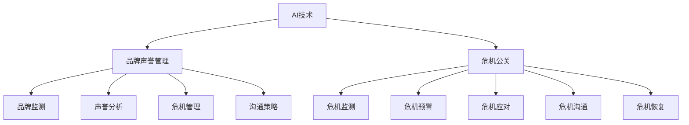
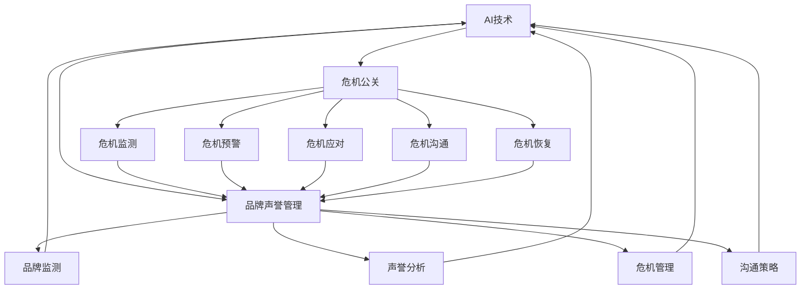
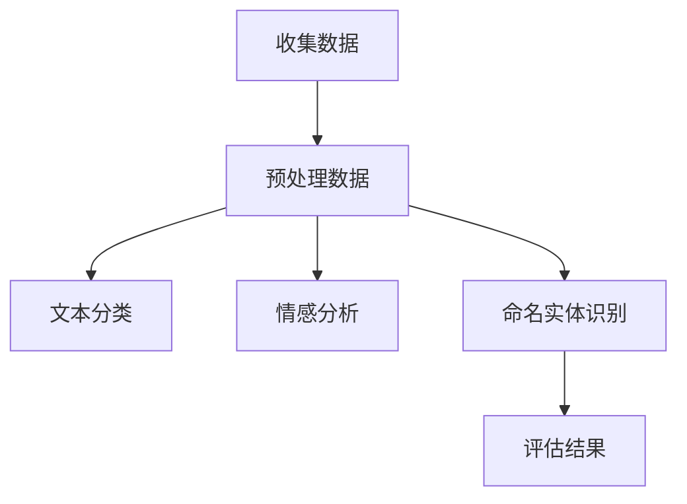
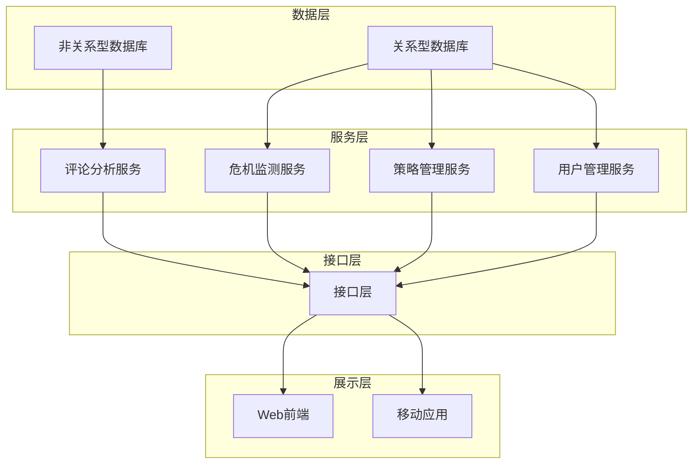
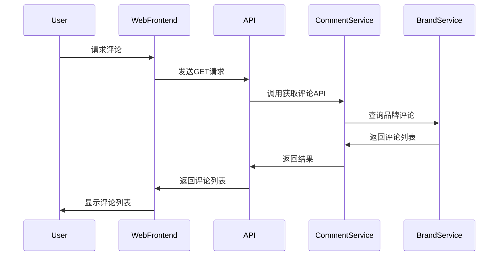

                 

## AI与品牌声誉管理

### 第1章 AI与品牌声誉管理

在当今这个数字化、信息化的时代，企业品牌声誉的管理和危机公关变得日益重要。品牌声誉不仅是企业核心竞争力的重要组成部分，更是消费者对其产品和服务信任度的直接体现。随着社交媒体的兴起和互联网的普及，品牌声誉可以在瞬间被成千上万的消费者了解，同时也可能因负面信息的传播而迅速受损。因此，企业需要一种高效、智能的方式来管理和维护其品牌声誉，以应对各种挑战。

#### 1.1 AI技术的发展与应用

AI（人工智能）作为一种前沿技术，已经深刻地改变了我们的生活方式和工作模式。AI技术的发展历程可以追溯到20世纪50年代，但直到最近几年，随着计算能力的提升和大数据的广泛应用，AI才真正开始展现出其巨大的潜力和应用价值。

**AI的基本概念**：AI是指通过计算机模拟人类智能行为的技术，包括学习、推理、感知、理解、决策等能力。AI可以分为两类：弱AI和强AI。弱AI专注于特定任务的智能，例如语音识别、图像识别等；强AI则具有全面的人类智能，能够在任何情境下自主学习和决策。

**AI技术分类与特点**：
- **机器学习**：通过数据训练模型，使其能够对未知数据进行预测或分类。
- **深度学习**：一种特殊的机器学习技术，使用多层神经网络进行训练，具有强大的特征提取能力。
- **自然语言处理**（NLP）：使计算机能够理解和生成自然语言，包括语音识别、机器翻译、情感分析等。
- **计算机视觉**：使计算机能够理解图像和视频，包括图像识别、目标检测、视频分析等。

**AI在商业领域的应用**：AI技术已经在商业领域得到广泛应用，包括客户服务、市场营销、供应链管理、风险控制等。例如，通过AI客服系统，企业可以提供24/7全天候的服务，提高客户满意度；通过AI算法优化市场营销策略，企业可以更精准地定位潜在客户，提高营销效果。

#### 1.2 企业品牌声誉管理的挑战

**品牌声誉的重要性**：品牌声誉是企业无形资产的重要部分，它影响着消费者的购买决策、投资者的投资意愿以及合作伙伴的合作意愿。良好的品牌声誉可以为企业带来持续的竞争优势。

**品牌声誉管理的难点**：
1. **信息分散**：品牌声誉的信息分布在各种社交媒体、新闻网站、用户评论等不同平台，使得企业难以全面监测和管理。
2. **信息复杂性**：品牌声誉受到的影响因素多样，包括产品质量、服务体验、公司文化、竞争对手的攻击等，这使得声誉管理变得复杂。
3. **实时性**：在互联网时代，负面信息可以迅速传播，影响品牌声誉，企业需要实时响应和应对。
4. **成本**：传统的品牌声誉管理往往需要大量的人力和物力投入，而AI技术的引入可以大大降低成本。

**AI在品牌声誉管理中的潜力**：AI技术可以帮助企业更高效、更精准地监测和管理品牌声誉。通过AI算法，企业可以自动化地分析大量数据，识别潜在的风险，并制定相应的策略。AI还可以帮助企业更快速地响应危机，减少负面影响的扩散。

#### 1.3 AI在品牌声誉管理中的作用

**AI在品牌声誉监测中的作用**：AI技术可以实时监控社交媒体、新闻网站、论坛等平台，识别与品牌相关的正面和负面信息，并通过自然语言处理技术对这些信息进行分类和分析。

**AI在品牌声誉分析中的作用**：AI技术可以分析品牌声誉数据，评估品牌的健康状态，识别潜在的问题和风险，为企业提供决策支持。

**AI在品牌声誉修复中的作用**：当品牌声誉受损时，AI可以帮助企业快速识别问题根源，制定针对性的修复策略，并通过社交媒体管理等手段迅速恢复品牌声誉。

#### 1.4 危机公关与AI辅助

**危机公关的定义与流程**：危机公关是指企业应对突发危机事件，维护品牌声誉的一系列策略和行动。危机公关的流程通常包括危机监测、危机预警、危机应对和危机恢复等阶段。

**AI在危机公关中的作用**：AI技术可以自动化地监测危机信号，提前预警，帮助企业迅速响应危机，减少负面影响。AI还可以帮助企业分析危机原因，制定有效的应对策略，并通过社交媒体等渠道进行危机沟通和修复。

通过以上分析，我们可以看到AI在品牌声誉管理和危机公关中扮演着越来越重要的角色。企业需要充分利用AI技术，建立智能化的品牌声誉管理体系，以应对日益复杂的商业环境。

---

### 1.1 AI技术的发展与应用

AI（人工智能）作为一种前沿技术，已经深刻地改变了我们的生活方式和工作模式。AI技术的发展历程可以追溯到20世纪50年代，但直到最近几年，随着计算能力的提升和大数据的广泛应用，AI才真正开始展现出其巨大的潜力和应用价值。

#### 1.1.1 AI的基本概念

AI是指通过计算机模拟人类智能行为的技术，包括学习、推理、感知、理解、决策等能力。AI可以分为两类：弱AI和强AI。弱AI专注于特定任务的智能，例如语音识别、图像识别等；强AI则具有全面的人类智能，能够在任何情境下自主学习和决策。

**AI的基本特点**：
- **自主学习**：AI系统可以通过学习大量的数据来自动发现规律，并在新情境下进行预测和决策。
- **高效性**：AI系统可以处理大量的数据，并且速度快，效率高。
- **适应性**：AI系统可以根据新的数据和反馈进行自我调整和优化，以适应不同的环境和任务。

**AI的应用领域**：
- **自然语言处理**（NLP）：使计算机能够理解和生成自然语言，包括语音识别、机器翻译、情感分析等。
- **计算机视觉**：使计算机能够理解图像和视频，包括图像识别、目标检测、视频分析等。
- **机器学习**：通过数据训练模型，使其能够对未知数据进行预测或分类。
- **机器人技术**：使机器人能够模拟人类的动作和思维，进行自主决策和执行任务。
- **自动驾驶**：利用AI技术，使汽车能够自动识别道路、避让障碍物并进行驾驶。

#### 1.1.2 AI技术分类与特点

AI技术可以分为以下几个主要类别：

1. **机器学习**：机器学习是一种通过数据训练模型，使其能够对未知数据进行预测或分类的技术。机器学习可以分为监督学习、无监督学习和强化学习。监督学习是有标注数据训练模型，如分类问题；无监督学习是无标注数据，如聚类问题；强化学习是通过与环境的交互来学习策略，如自动驾驶。

2. **深度学习**：深度学习是一种特殊的机器学习技术，使用多层神经网络进行训练，具有强大的特征提取能力。深度学习在图像识别、语音识别、自然语言处理等领域表现出色。

3. **自然语言处理**（NLP）：自然语言处理是使计算机能够理解和生成自然语言的技术。NLP包括语音识别、机器翻译、情感分析等，广泛应用于客服、翻译、内容审核等领域。

4. **计算机视觉**：计算机视觉是使计算机能够理解图像和视频的技术。计算机视觉包括图像识别、目标检测、视频分析等，广泛应用于安防监控、自动驾驶、医疗诊断等领域。

5. **机器人技术**：机器人技术是使机器人能够模拟人类的动作和思维，进行自主决策和执行任务的技术。机器人技术包括工业机器人、服务机器人、医疗机器人等。

#### 1.1.3 AI在商业领域的应用

AI在商业领域的应用已经非常广泛，包括以下几个方面：

1. **客户服务**：通过AI客服系统，企业可以提供24/7全天候的服务，提高客户满意度。例如，苹果公司的Siri和亚马逊的Alexa都是基于AI技术的智能客服系统。

2. **市场营销**：通过AI算法优化市场营销策略，企业可以更精准地定位潜在客户，提高营销效果。例如，谷歌的广告投放系统就是基于AI算法，能够根据用户的历史行为和兴趣进行精准广告投放。

3. **供应链管理**：通过AI技术，企业可以优化供应链管理，降低库存成本，提高生产效率。例如，亚马逊的供应链管理系统就是基于AI技术，能够预测市场需求并自动调整库存。

4. **风险控制**：通过AI技术，企业可以实时监测和分析金融市场的数据，预测风险并制定相应的应对策略。例如，银行和金融机构经常使用AI技术进行信贷风险控制。

5. **智能制造**：通过AI技术，企业可以实现生产过程的自动化和智能化，提高生产效率和产品质量。例如，汽车制造行业广泛使用AI技术进行质量检测和生产线优化。

#### 1.1.4 AI在品牌声誉管理中的应用

AI技术在品牌声誉管理中的应用主要体现在以下几个方面：

1. **监测与预警**：通过AI技术，企业可以实时监测社交媒体、新闻网站、论坛等平台，识别与品牌相关的负面信息，并及时发出预警。

2. **分析评估**：通过AI技术，企业可以对品牌声誉数据进行分析评估，了解品牌的健康状态，识别潜在的问题和风险。

3. **修复策略**：当品牌声誉受损时，AI可以帮助企业快速识别问题根源，制定针对性的修复策略，并通过社交媒体等渠道进行沟通和修复。

4. **情感分析**：通过AI技术，企业可以对用户评论、新闻报道等文本进行情感分析，了解消费者对品牌的情感倾向，为品牌营销和产品改进提供依据。

5. **智能客服**：通过AI技术，企业可以提供智能客服服务，快速响应消费者的提问和投诉，提高客户满意度。

总之，AI技术为品牌声誉管理提供了强大的工具和支持，使企业能够更加高效、精准地管理和维护其品牌声誉。在未来，随着AI技术的不断发展和应用，品牌声誉管理将更加智能化和自动化。

---

### 1.2 企业品牌声誉管理的挑战

在当今的商业环境中，企业品牌声誉管理面临着一系列的挑战。这些挑战不仅源于外部环境的变化，也源于企业内部的管理机制和运营策略。理解这些挑战有助于企业更好地利用AI技术来提升品牌声誉管理的效果。

#### 1.2.1 品牌声誉的重要性

品牌声誉是企业无形资产的重要组成部分，它直接影响着企业的市场地位、消费者信任度、合作伙伴关系以及投资吸引力。一个良好的品牌声誉可以带来以下几个方面的好处：

1. **市场竞争力**：品牌声誉良好的企业往往能够在市场上获得更高的竞争力，因为消费者更倾向于购买那些他们信任的品牌。
2. **客户忠诚度**：良好的品牌声誉可以增加客户的忠诚度，减少客户流失率。
3. **品牌溢价**：具有良好声誉的品牌往往能够获得更高的品牌溢价，从而提高企业的盈利能力。
4. **合作伙伴关系**：良好的品牌声誉有助于企业建立和维护良好的合作伙伴关系，获得更多的合作机会。

#### 1.2.2 品牌声誉管理的难点

品牌声誉管理并非易事，企业在管理过程中常常面临以下难点：

1. **信息分散**：品牌声誉信息分布在各种社交媒体、新闻网站、论坛、用户评论等多个平台，这使得企业难以全面监测和管理。
   
2. **信息复杂性**：品牌声誉受到的影响因素多样，包括产品质量、服务体验、公司文化、竞争对手的行为、政策变化等，这使得声誉管理变得更加复杂。

3. **实时性**：在互联网时代，负面信息可以迅速传播，影响品牌声誉。企业需要实时监测和响应，但往往难以做到快速反应。

4. **成本**：传统的品牌声誉管理往往需要大量的人力和物力投入，包括市场调研、公关活动、法律咨询等，这增加了企业的运营成本。

#### 1.2.3 AI在品牌声誉管理中的潜力

AI技术为品牌声誉管理带来了新的机遇和挑战。通过AI技术，企业可以在以下几个方面提升品牌声誉管理的效果：

1. **自动化监测**：AI技术可以自动化地监测社交媒体、新闻网站、论坛等平台，实时识别与品牌相关的负面信息，提高监测的效率和准确性。

2. **智能分析**：AI技术可以对大量声誉数据进行分析，评估品牌的健康状态，识别潜在的问题和风险，为企业提供科学的决策支持。

3. **快速响应**：AI技术可以帮助企业快速识别危机信号，制定针对性的应对策略，并通过社交媒体等渠道迅速恢复品牌声誉。

4. **个性化服务**：通过AI技术，企业可以了解消费者的情感倾向和行为模式，提供个性化的产品和服务，增强客户满意度。

5. **降低成本**：AI技术的引入可以大幅降低品牌声誉管理的成本，通过自动化和智能化的手段提高管理效率。

#### 1.2.4 AI在品牌声誉管理中的应用

具体而言，AI在品牌声誉管理中的应用主要包括以下几个方面：

1. **负面信息监测**：通过自然语言处理技术，AI可以识别和分析社交媒体、新闻网站等平台上的负面信息，实时监测品牌声誉的变化。

2. **情感分析**：AI技术可以对用户评论、新闻报道等文本进行情感分析，了解消费者对品牌的情感倾向，为企业提供品牌营销和产品改进的依据。

3. **风险预测**：基于历史数据和机器学习算法，AI可以预测品牌声誉可能受到的风险，帮助企业提前采取预防措施。

4. **危机管理**：当品牌声誉受损时，AI可以帮助企业快速识别问题根源，制定针对性的修复策略，并通过社交媒体等渠道进行危机沟通和修复。

5. **个性化营销**：通过AI技术，企业可以了解消费者的行为和偏好，提供个性化的产品推荐和服务，提高客户满意度和忠诚度。

总之，AI技术在品牌声誉管理中的应用潜力巨大，企业需要充分利用这些技术来应对日益复杂的商业环境，提升品牌声誉管理的效率和质量。

---

### 1.3 AI在品牌声誉管理中的作用

在品牌声誉管理中，AI技术发挥着至关重要的作用，通过其强大的数据处理和分析能力，AI可以帮助企业在品牌声誉监测、分析和修复等多个方面实现智能化和高效化。以下是AI在品牌声誉管理中具体作用的一些详细说明：

#### 1.3.1 AI在品牌声誉监测中的作用

品牌声誉监测是品牌声誉管理的基础，通过实时监测社交媒体、新闻网站、论坛、用户评论等平台，AI技术能够帮助企业及时发现与品牌相关的正面和负面信息。

1. **自动化监测**：AI技术可以自动化地扫描各种数据源，识别与品牌相关的信息。例如，通过自然语言处理技术，AI可以分析新闻报道、社交媒体帖子、用户评论等，实时监测品牌声誉的变化。
   
2. **多平台覆盖**：AI技术能够同时监测多个平台，包括微博、微信、抖音、知乎、新闻网站等，确保企业能够全面掌握品牌声誉的动态。

3. **情感分析**：AI技术可以对用户评论、新闻报道等文本进行情感分析，识别消费者对品牌的情感倾向，如正面、中性或负面。这有助于企业了解消费者的真实感受，及时调整品牌策略。

4. **预警机制**：基于监测数据，AI技术可以建立预警机制，当发现负面信息或潜在危机时，及时向企业发送警报，帮助企业迅速采取应对措施。

#### 1.3.2 AI在品牌声誉分析中的作用

品牌声誉分析是品牌声誉管理的重要环节，通过分析品牌声誉数据，企业可以了解品牌的健康状态，识别潜在的风险和机会。

1. **数据分析**：AI技术可以对大量品牌声誉数据进行统计分析，如计算品牌评分、分析用户情感倾向等。这有助于企业全面了解品牌声誉的现状。

2. **趋势预测**：基于历史数据和机器学习算法，AI可以预测品牌声誉的趋势，如预测未来一段时间的品牌声誉变化，帮助企业提前制定应对策略。

3. **风险识别**：AI技术可以帮助企业识别品牌声誉管理中的潜在风险，如消费者投诉、负面新闻、竞争对手攻击等。通过分析这些风险，企业可以采取预防措施，减少声誉损失。

4. **优化策略**：基于声誉分析结果，AI可以为品牌提供优化建议，如改进产品和服务、调整营销策略等，以提升品牌声誉。

#### 1.3.3 AI在品牌声誉修复中的作用

当品牌声誉受损时，AI技术可以帮助企业迅速应对危机，减少负面影响，恢复品牌声誉。

1. **快速响应**：AI技术可以实时监测负面信息，并快速分析其影响范围和严重程度。根据分析结果，AI可以为企业提供应急响应建议，如发布澄清声明、开展公关活动等。

2. **危机管理**：AI技术可以帮助企业制定针对性的危机管理策略。例如，通过情感分析技术，AI可以了解消费者的情感反应，帮助企业选择合适的沟通方式和内容，以最大程度地减轻负面影响。

3. **社交媒体管理**：AI技术可以自动化地管理社交媒体，包括发布正面内容、回应负面评论等，帮助企业建立积极的品牌形象。

4. **数据驱动的决策**：基于大量的数据分析和预测，AI可以为品牌声誉修复提供科学、合理的决策支持，帮助企业制定长期的品牌建设策略。

总之，AI技术在品牌声誉管理中具有广泛的应用前景，通过自动化监测、智能分析和快速响应，AI可以大幅提升品牌声誉管理的效率和质量，帮助企业更好地应对复杂的商业环境。

---

### 1.4 危机公关与AI辅助

危机公关是指企业在面临突发事件或负面信息时，通过一系列策略和行动来维护品牌声誉和形象的沟通活动。随着社交媒体和互联网的迅速发展，危机公关变得愈加重要和复杂。AI技术的引入为危机公关提供了新的工具和方法，使其更加高效和智能化。

#### 1.4.1 危机公关的定义与流程

危机公关是指企业在面临突发事件或负面信息时，通过一系列策略和行动来维护品牌声誉和形象的沟通活动。危机公关的目的是减轻危机对企业造成的负面影响，恢复公众对品牌的信任。

**危机公关的定义**：
危机公关是企业应对各种突发事件和负面信息的策略，旨在通过及时、有效的沟通来减轻或消除危机对企业品牌声誉的负面影响。

**危机公关的流程**：
1. **危机监测**：通过实时监测社交媒体、新闻网站、论坛等平台，识别潜在的危机信号。
2. **危机预警**：当发现危机信号时，及时发出预警，通知相关部门和高层管理人员。
3. **危机应对**：根据危机的类型和严重程度，制定相应的应对策略，如发布澄清声明、采取公关活动等。
4. **危机沟通**：通过社交媒体、新闻发布、公关活动等渠道，与公众进行有效沟通，传达企业的态度和应对措施。
5. **危机恢复**：通过持续的品牌建设活动，恢复公众对品牌的信任，提升品牌声誉。

#### 1.4.2 AI在危机公关中的作用

AI技术为危机公关提供了强大的支持和工具，使其更加智能化和高效化。

1. **自动化监测**：AI技术可以自动化地监测社交媒体、新闻网站等平台，实时识别与品牌相关的负面信息，提高监测的效率和准确性。
   
2. **情感分析**：AI技术可以对用户评论、新闻报道等文本进行情感分析，识别消费者的情感倾向，为企业提供决策支持。例如，了解公众对品牌的态度是负面、中性还是正面，有助于企业调整沟通策略。

3. **快速响应**：AI技术可以帮助企业快速分析负面信息，并提供应急预案，使企业能够迅速采取行动，减轻危机的扩散。

4. **策略优化**：基于大数据和机器学习算法，AI可以分析历史危机案例，为企业提供最优的危机应对策略，包括沟通内容、渠道选择和行动步骤。

5. **智能决策**：AI技术可以为企业提供基于数据的智能决策支持，例如通过分析历史数据和实时信息，预测危机的发展趋势，帮助企业制定长远的危机管理计划。

#### 1.4.3 AI在危机公关中的案例分析

以下是一些AI技术在危机公关中应用的案例分析：

1. **麦当劳的食品质量问题**：2017年，麦当劳在韩国面临食品质量危机，消费者发现汉堡中存在过期食材。麦当劳利用AI技术实时监测社交媒体，并迅速发布澄清声明，通过社交媒体与消费者进行沟通，最终成功平息了危机。

2. **亚马逊的配送问题**：2018年，亚马逊在配送服务上遭遇负面评论，客户抱怨送货延迟。亚马逊利用AI技术分析用户评论，识别问题根源，并迅速调整配送策略，通过增加人力和优化物流网络，提高了配送效率，恢复了品牌声誉。

3. **特斯拉的自动驾驶事故**：2020年，特斯拉的自动驾驶功能在多起事故中暴露出安全风险。特斯拉利用AI技术实时监测社交媒体，了解公众对事故的反应，并迅速发布声明，解释自动驾驶技术的安全性和局限性，通过透明沟通减轻了负面影响。

总之，AI技术在危机公关中的应用极大地提升了危机管理的效率和效果。通过自动化监测、情感分析、快速响应和智能决策，AI可以帮助企业更有效地应对危机，维护品牌声誉。在未来，随着AI技术的不断发展和应用，危机公关将变得更加智能化和高效化。

---

## 第2章 AI辅助企业品牌声誉管理核心概念

### 2.1 AI基础概念

AI（人工智能）是一种通过计算机模拟人类智能行为的技术，旨在实现机器在特定任务上的智能表现。AI包括多个子领域，如机器学习、深度学习、自然语言处理等。

#### 2.1.1 机器学习

机器学习是AI的一个分支，通过算法和统计模型，使计算机能够从数据中学习，并对新数据进行预测或分类。机器学习可以分为监督学习、无监督学习和强化学习。

1. **监督学习**：使用已标记的数据训练模型，例如分类和回归问题。
2. **无监督学习**：没有预标记的数据，通过发现数据中的模式和结构，例如聚类和降维。
3. **强化学习**：通过与环境交互，学习最优策略，例如游戏和自动驾驶。

#### 2.1.2 深度学习

深度学习是机器学习的一种特殊形式，使用多层神经网络进行训练，能够自动提取数据的复杂特征。深度学习在图像识别、语音识别和自然语言处理等领域表现出色。

1. **卷积神经网络（CNN）**：用于图像识别和目标检测。
2. **循环神经网络（RNN）**：用于序列数据处理，如时间序列分析和文本生成。
3. **生成对抗网络（GAN）**：用于生成逼真的图像和语音。

#### 2.1.3 自然语言处理（NLP）

自然语言处理是使计算机能够理解和生成自然语言的技术。NLP包括文本分类、情感分析、机器翻译和语音识别。

1. **文本分类**：将文本分类到预定义的类别，如垃圾邮件检测和情感分析。
2. **情感分析**：识别文本中的情感倾向，如正面、中性或负面。
3. **机器翻译**：将一种语言的文本翻译成另一种语言。
4. **语音识别**：将语音信号转换成文本。

### 2.2 品牌声誉管理概念

品牌声誉管理是指企业通过各种策略和行动，维护和提升品牌形象和声誉的过程。品牌声誉管理包括以下几个方面：

1. **品牌监测**：实时监测品牌在社交媒体、新闻网站和论坛上的讨论和评论。
2. **声誉分析**：分析品牌声誉数据，评估品牌的健康状态，识别潜在风险。
3. **危机管理**：应对突发危机事件，维护品牌声誉。
4. **沟通策略**：通过社交媒体、公关活动和客户服务与公众沟通，建立积极品牌形象。

### 2.3 危机公关概念

危机公关是指企业在面临突发事件或负面信息时，通过一系列策略和行动来维护品牌声誉和形象的沟通活动。危机公关的流程包括危机监测、危机预警、危机应对、危机沟通和危机恢复。

1. **危机监测**：实时监测社交媒体、新闻网站等平台，识别潜在的危机信号。
2. **危机预警**：发现危机信号时，及时发出预警，通知相关部门。
3. **危机应对**：根据危机的类型和严重程度，制定应对策略。
4. **危机沟通**：通过社交媒体、新闻发布和公关活动与公众沟通。
5. **危机恢复**：通过持续的品牌建设活动，恢复公众对品牌的信任。

### 2.4 概念联系与关系图

以下是AI、品牌声誉管理和危机公关之间的关系图：



通过这张关系图，我们可以清晰地看到AI技术如何辅助企业进行品牌声誉管理和危机公关，包括品牌监测、声誉分析、危机管理和沟通策略等关键环节。

---

### 2.2 品牌声誉管理概念

品牌声誉管理是指企业通过各种策略和行动，维护和提升品牌形象和声誉的过程。品牌声誉管理不仅仅关注品牌在市场上的认知度，还包括消费者对品牌的情感和态度，以及对品牌所提供产品或服务的信任度。品牌声誉管理涉及到多个方面，包括品牌监测、声誉分析、危机管理和沟通策略等。

#### 2.2.1 品牌监测

品牌监测是品牌声誉管理的基础，通过实时监测社交媒体、新闻网站、论坛和用户评论等渠道，企业可以及时发现与品牌相关的正面和负面信息。品牌监测的主要目标是：

- **了解消费者态度**：通过分析消费者评论和反馈，了解他们对品牌的态度和情感。
- **识别潜在风险**：通过监测负面信息，及时发现可能影响品牌声誉的危机信号。
- **评估品牌形象**：通过收集和分析品牌在不同渠道的表现，评估品牌的整体形象。

#### 2.2.2 声誉分析

声誉分析是品牌声誉管理的核心环节，通过对品牌监测数据的分析，企业可以了解品牌的健康状态，识别潜在的问题和风险。声誉分析的主要目标包括：

- **评估品牌声誉**：通过计算品牌声誉评分，了解品牌在公众中的整体形象。
- **识别问题根源**：通过分析负面信息的来源和内容，找出影响品牌声誉的具体原因。
- **预测声誉趋势**：通过历史数据和机器学习算法，预测品牌声誉的未来趋势，为企业提供决策支持。

#### 2.2.3 危机管理

危机管理是品牌声誉管理的重要组成部分，当企业面临突发事件或负面信息时，危机管理策略可以帮助企业减轻危机的负面影响，维护品牌声誉。危机管理的主要目标包括：

- **快速响应**：在危机爆发时，迅速采取行动，及时发布声明，回应公众关切。
- **制定策略**：根据危机的类型和严重程度，制定针对性的应对策略。
- **沟通协调**：通过内部和外部沟通，协调各方力量，共同应对危机。
- **恢复声誉**：在危机结束后，通过持续的品牌建设和积极的公关活动，恢复品牌声誉。

#### 2.2.4 沟通策略

沟通策略是品牌声誉管理的重要手段，通过有效的沟通，企业可以建立与消费者的信任关系，提升品牌形象。沟通策略的主要目标包括：

- **品牌宣传**：通过广告、公关活动等手段，向公众传递品牌理念和价值观。
- **用户互动**：通过社交媒体、客服等渠道，与消费者进行互动，了解他们的需求和反馈。
- **危机沟通**：在危机发生时，通过透明的沟通，向公众传达企业的态度和应对措施，减轻负面影响。
- **公关活动**：通过举办各类公关活动，提升品牌知名度和美誉度。

#### 2.2.5 品牌声誉管理的关键因素

品牌声誉管理的效果取决于多个因素，包括：

- **品牌定位**：明确的品牌定位有助于建立品牌形象和消费者认知。
- **产品质量**：高质量的产品和服务是品牌声誉的基石。
- **客户服务**：优质的客户服务能够提升消费者满意度和忠诚度。
- **社会责任**：积极承担社会责任，提升品牌的社会形象。
- **危机应对能力**：快速应对危机，有效减轻危机对企业声誉的影响。

总之，品牌声誉管理是企业长期战略的重要组成部分，通过有效的品牌监测、声誉分析、危机管理和沟通策略，企业可以建立和维护良好的品牌声誉，提升市场竞争力。

---

### 2.3 危机公关概念

危机公关是指企业在面临突发事件或负面信息时，通过一系列策略和行动来维护品牌声誉和形象的沟通活动。危机公关的目的是将危机对企业的影响降到最低，迅速恢复公众对品牌的信任，并防止负面影响进一步扩散。以下是危机公关的关键概念和流程：

#### 2.3.1 危机公关的定义

危机公关是企业应对各种突发事件和负面信息的策略，旨在通过及时、有效的沟通来减轻或消除危机对企业品牌声誉的负面影响。

#### 2.3.2 危机公关的流程

1. **危机监测**：通过实时监测社交媒体、新闻网站、论坛等平台，识别潜在的危机信号。这一步骤至关重要，因为及时发现问题可以为企业赢得宝贵的时间。

2. **危机预警**：当发现危机信号时，及时发出预警，通知相关部门和高层管理人员。预警的目的是让企业能够迅速采取行动，防止危机进一步恶化。

3. **危机应对**：根据危机的类型和严重程度，制定相应的应对策略。常见的应对措施包括发布澄清声明、召开新闻发布会、加强与媒体和公众的沟通等。

4. **危机沟通**：通过社交媒体、新闻发布和公关活动与公众沟通，传达企业的态度和应对措施。有效的沟通可以帮助企业赢得公众的理解和支持，减轻危机的负面影响。

5. **危机恢复**：在危机结束后，通过持续的品牌建设活动和公关活动，恢复公众对品牌的信任。恢复阶段的核心任务是重建品牌形象，提升品牌声誉。

#### 2.3.3 AI在危机公关中的应用

AI技术在危机公关中发挥着重要作用，通过自动化监测、情感分析和智能决策，AI可以帮助企业更高效地应对危机，减轻危机对企业的影响。

1. **自动化监测**：AI技术可以自动化地监测社交媒体、新闻网站等平台，实时识别与品牌相关的负面信息。这有助于企业及时发现危机信号，迅速采取应对措施。

2. **情感分析**：AI技术可以对用户评论、新闻报道等文本进行情感分析，识别消费者的情感倾向。通过了解公众对品牌的情感反应，企业可以调整沟通策略，提升沟通效果。

3. **智能决策**：基于大数据和机器学习算法，AI可以为危机应对提供智能决策支持。例如，通过分析历史危机案例和实时数据，AI可以预测危机的发展趋势，帮助企业制定最优的应对策略。

4. **快速响应**：AI技术可以帮助企业快速分析负面信息，并提供应急预案。这有助于企业迅速采取行动，减轻危机的扩散。

5. **数据分析**：AI技术可以对大量危机数据进行分析，帮助企业了解危机的原因和影响，优化危机管理流程。

总之，AI技术在危机公关中的应用极大地提升了危机管理的效率和效果。通过自动化监测、情感分析和智能决策，AI可以帮助企业更有效地应对危机，维护品牌声誉。在未来，随着AI技术的不断发展和应用，危机公关将变得更加智能化和高效化。

---

### 2.4 概念联系与关系图

在理解了AI、品牌声誉管理和危机公关的基本概念之后，我们可以通过一张关系图来展示它们之间的联系，从而更清晰地看到AI如何辅助企业进行品牌声誉管理和危机公关。

以下是一个简单的Mermaid关系图，用于展示这三个概念之间的关联：



在这个图中，我们可以看到：

- **AI技术** 是品牌声誉管理和危机公关的基础，贯穿了品牌监测、声誉分析、危机管理和沟通策略等环节。
- **品牌声誉管理** 包括品牌监测、声誉分析、危机管理和沟通策略，是维护品牌形象和声誉的核心活动。
- **危机公关** 则是品牌声誉管理中应对突发事件和负面信息的重要手段，包括危机监测、预警、应对、沟通和恢复等步骤。

通过这张关系图，我们可以更直观地理解AI如何辅助企业进行品牌声誉管理和危机公关，以及各个概念之间的相互作用。

---

## 第3章 常见AI算法在品牌声誉管理中的应用

在品牌声誉管理中，AI算法发挥着关键作用。本章节将介绍几种常见的AI算法，包括自然语言处理（NLP）、机器学习算法和深度学习模型，并探讨它们在品牌声誉管理中的应用。

### 3.1 自然语言处理（NLP）

自然语言处理是一种使计算机能够理解和生成自然语言的技术，广泛应用于品牌声誉管理中。NLP的主要任务包括文本分类、情感分析和命名实体识别。

**文本分类**：通过将文本分类为正面、中性或负面，企业可以了解公众对品牌的情感倾向。例如，利用朴素贝叶斯分类器，企业可以自动分类社交媒体上的用户评论。

**情感分析**：情感分析旨在识别文本中的情感倾向，例如正面、负面或中性。通过分析用户评论和新闻报道，企业可以了解消费者的真实感受，从而改进产品和服务。例如，利用支持向量机（SVM）模型进行情感分析，可以帮助企业识别负面评论并采取相应措施。

**命名实体识别**：命名实体识别用于识别文本中的特定实体，如人名、地名、组织名等。在品牌声誉管理中，这有助于企业识别与品牌相关的信息，例如，通过识别新闻报道中的品牌名称，企业可以跟踪品牌在媒体上的表现。

### 3.2 机器学习算法

机器学习算法在品牌声誉管理中用于预测和分类，帮助企业识别潜在的风险和机会。

**回归分析**：回归分析用于预测品牌声誉的变动。例如，通过线性回归模型，企业可以预测某项产品改进措施对品牌声誉的影响。

**决策树**：决策树是一种常用的分类算法，可以用于预测品牌声誉的风险。通过决策树模型，企业可以分析品牌声誉数据，识别影响品牌声誉的关键因素。

**随机森林**：随机森林是一种基于决策树的集成算法，具有更高的预测准确性和鲁棒性。在品牌声誉管理中，随机森林可以用于预测品牌声誉的变化趋势，并识别潜在的危机信号。

### 3.3 深度学习模型

深度学习模型在品牌声誉管理中具有强大的特征提取和模式识别能力，适用于复杂的声誉分析任务。

**卷积神经网络（CNN）**：CNN是一种用于图像识别和文本分类的深度学习模型。在品牌声誉管理中，CNN可以用于识别和分析社交媒体上的图像和视频，帮助企业识别潜在的负面信息。

**循环神经网络（RNN）**：RNN适用于处理序列数据，如时间序列分析和文本生成。在品牌声誉管理中，RNN可以用于分析品牌声誉的历史数据，预测未来的声誉变化。

**生成对抗网络（GAN）**：GAN是一种生成模型，可以用于生成逼真的图像和文本。在品牌声誉管理中，GAN可以用于模拟不同品牌声誉管理策略的效果，帮助企业优化声誉管理策略。

### 3.4 算法原理讲解与mermaid流程图

以下是一个简单的mermaid流程图，用于展示自然语言处理算法在品牌声誉管理中的应用：



在这个流程图中：

- **A. 收集数据**：从社交媒体、新闻报道等渠道收集与品牌相关的文本数据。
- **B. 预处理数据**：对文本数据进行清洗和预处理，如去除停用词、标点符号等。
- **C. 文本分类**：利用机器学习算法（如朴素贝叶斯、SVM等）对文本进行分类，识别正面、中性或负面的评论。
- **D. 情感分析**：通过情感分析模型（如LSTM、GRU等）分析文本的情感倾向。
- **E. 命名实体识别**：利用命名实体识别算法（如BERT、GPT等）识别文本中的品牌名称、产品名称等实体。
- **F. 评估结果**：评估算法的性能，包括准确率、召回率、F1分数等。

通过上述算法的应用，企业可以更有效地监测和管理品牌声誉，及时识别和应对潜在的危机。

### 3.5 Python代码示例

以下是一个简单的Python代码示例，用于实现文本分类和情感分析：

```python
import nltk
from nltk.corpus import movie_reviews
from sklearn.feature_extraction.text import TfidfVectorizer
from sklearn.naive_bayes import MultinomialNB
from sklearn.metrics import classification_report

# 加载电影评论数据集
nltk.download('movie_reviews')
data = [(list(movie_reviews.words(fileid)), category) for category in movie_reviews.categories() for fileid in movie_reviews.fileids(category)]

# 预处理数据
def preprocess_text(text):
    return ' '.join([word for word in text if word.lower() not in nltk.corpus.stopwords.words('english')])

# 分割数据集
train_data, test_data = data[:1900], data[1900:]

# 构建TF-IDF向量器
vectorizer = TfidfVectorizer(preprocessor=preprocess_text, stop_words='english')

# 训练模型
X_train = vectorizer.fit_transform([' '.join(text) for text, _ in train_data])
y_train = [category for _, category in train_data]

clf = MultinomialNB()
clf.fit(X_train, y_train)

# 测试模型
X_test = vectorizer.transform([' '.join(text) for text, _ in test_data])
y_test = [category for _, category in test_data]

predictions = clf.predict(X_test)

# 评估结果
print(classification_report(y_test, predictions))

# 情感分析
from nltk.sentiment import SentimentIntensityAnalyzer

sia = SentimentIntensityAnalyzer()
for text, _ in test_data:
    sentiment = sia.polarity_scores(' '.join(text))
    print(sentiment)
```

在这个示例中，我们使用了朴素贝叶斯分类器进行文本分类，并使用NLP库nltk进行情感分析。通过这个示例，我们可以看到如何使用Python和机器学习算法来实现品牌声誉管理中的文本分类和情感分析。

总之，通过结合自然语言处理、机器学习算法和深度学习模型，企业可以更有效地监测和管理品牌声誉，及时识别和应对潜在的危机，从而提升品牌形象和市场竞争力。

---

### 3.4 品牌声誉管理与危机公关的数学模型

在品牌声誉管理和危机公关中，数学模型和算法的运用可以帮助企业更精确地预测和应对声誉变化。以下将介绍几个关键的数学模型和公式，并使用Python代码进行示例解释。

#### 3.4.1 品牌声誉评分模型

品牌声誉评分模型用于评估品牌的整体声誉水平。一个简单的模型可以是基于消费者反馈的情感分析结果来计算品牌得分。

**模型公式**：
$$
BR_Score = \frac{P_pos \cdot W_pos + P_neg \cdot W_neg}{W_pos + W_neg}
$$
其中，$P_pos$ 和 $P_neg$ 分别表示正面和负面评论的比例，$W_pos$ 和 $W_neg$ 分别是它们的权重，通常根据实际情况设定。

**Python示例**：

```python
def brand_reputation_score(positive_reviews, negative_reviews, w_pos=0.5, w_neg=0.5):
    total_reviews = positive_reviews + negative_reviews
    br_score = (positive_reviews * w_pos + negative_reviews * w_neg) / total_reviews
    return br_score

# 示例数据
positive_reviews = 1000
negative_reviews = 500

# 计算品牌声誉得分
br_score = brand_reputation_score(positive_reviews, negative_reviews)
print(f"Brand Reputation Score: {br_score:.2f}")
```

#### 3.4.2 危机公关应对策略模型

在危机公关中，企业需要制定有效的应对策略来减轻危机对品牌声誉的影响。一个简单的方法是基于危机严重程度和紧急程度来决定应对措施。

**模型公式**：
$$
Strategy = S_1 \cdot (C \cdot E)
$$
其中，$S_1$ 是基本的危机应对策略，$C$ 是危机严重程度（例如，0-10分），$E$ 是危机紧急程度（例如，0-10分）。

**Python示例**：

```python
def crisis_strategy(seriousness, emergency, s1=1.0):
    strategy = s1 * (seriousness * emergency)
    return strategy

# 示例数据
seriousness = 7
emergency = 8

# 计算危机应对策略
strategy = crisis_strategy(seriousness, emergency)
print(f"Crisis Strategy: {strategy:.2f}")
```

#### 3.4.3 传播效果评估模型

在危机公关后，企业需要评估危机应对策略的效果。传播效果评估模型可以帮助企业确定公关活动的传播范围和影响力。

**模型公式**：
$$
Effectiveness = \frac{I_{\text{positive}} - I_{\text{negative}}}{I_{\text{total}}}
$$
其中，$I_{\text{positive}}$ 和 $I_{\text{negative}}$ 分别是公关活动后正面和负面信息的比例，$I_{\text{total}}$ 是总信息量。

**Python示例**：

```python
def effectiveness_evaluation(positive_messages, negative_messages, total_messages):
    effect = (positive_messages - negative_messages) / total_messages
    return effect

# 示例数据
positive_messages = 1500
negative_messages = 500
total_messages = 2000

# 计算传播效果
effectiveness = effectiveness_evaluation(positive_messages, negative_messages, total_messages)
print(f"Effectiveness: {effectiveness:.2f}")
```

#### 3.4.4 综合评估模型

综合评估模型将上述模型结合，用于全面评估品牌声誉和危机应对效果。

**模型公式**：
$$
Overall_Score = BR_Score + \alpha \cdot Strategy + \beta \cdot Effectiveness
$$
其中，$\alpha$ 和 $\beta$ 是权重系数，根据实际情况调整。

**Python示例**：

```python
def overall_score(br_score, strategy, effectiveness, alpha=0.2, beta=0.1):
    overall_score = br_score + alpha * strategy + beta * effectiveness
    return overall_score

# 示例数据
alpha = 0.2
beta = 0.1

# 计算综合评估得分
overall_score = overall_score(br_score, strategy, effectiveness, alpha, beta)
print(f"Overall Score: {overall_score:.2f}")
```

通过这些数学模型和公式，企业可以更科学地管理和评估品牌声誉，并制定有效的危机应对策略。在实际应用中，这些模型可以根据具体情况进行调整和优化，以更好地适应企业的需求和市场环境。

---

### 3.5 品牌声誉管理系统架构设计

品牌声誉管理系统的设计需要综合考虑功能需求、技术架构、接口设计以及系统交互等多个方面。以下是一个典型的品牌声誉管理系统架构设计，包括领域模型、系统架构、接口设计以及系统交互的详细说明。

#### 3.5.1 领域模型

领域模型是系统设计的基础，用于定义系统中的核心实体及其关系。在品牌声誉管理系统中，主要的领域模型包括：

1. **用户**：代表使用系统的用户，包括内部员工和外部合作伙伴。
2. **品牌**：代表企业管理的不同品牌，包括品牌名称、描述、属性等。
3. **评论**：代表来自社交媒体、论坛、新闻网站等的用户评论，包括评论内容、发布时间、情感倾向等。
4. **危机**：代表影响品牌声誉的突发事件或负面信息，包括危机描述、严重程度、发生时间等。
5. **策略**：代表企业制定的危机应对策略，包括策略类型、执行时间、预期效果等。

以下是领域模型的Mermaid类图：

```mermaid
classDiagram
    User <|-- Comment
    User <|-- Crisis
    User <|-- Strategy
    Brand <<-- Comment
    Brand <<-- Crisis
    Brand <<-- Strategy
    Comment <|-- Sentiment
    Crisis <|-- Action
    Strategy <|-- Action
```

#### 3.5.2 系统架构设计

系统架构设计决定了系统的整体结构和技术选型。品牌声誉管理系统可以采用微服务架构，将不同的功能模块解耦，以提高系统的可扩展性和维护性。

1. **数据层**：负责数据的存储和管理，包括关系型数据库（如MySQL）和非关系型数据库（如MongoDB）。
2. **服务层**：负责业务逻辑的处理，包括评论分析服务、危机监测服务、策略管理服务、用户管理服务等。
3. **接口层**：负责与外部系统（如社交媒体API、第三方分析工具等）的交互，提供RESTful API或GraphQL接口。
4. **展示层**：负责用户界面的展示，包括Web前端和移动应用。

以下是系统架构的Mermaid架构图：



#### 3.5.3 系统接口设计

系统接口设计是系统与外部系统交互的关键环节，主要包括RESTful API和GraphQL接口。

1. **RESTful API**：用于提供标准的HTTP接口，支持GET、POST、PUT、DELETE等HTTP方法。以下是几个典型的API接口示例：

   - **获取品牌评论列表**：
     ```
     GET /api/brands/{brandId}/comments
     ```
   - **添加评论**：
     ```
     POST /api/brands/{brandId}/comments
     ```
   - **更新评论**：
     ```
     PUT /api/brands/{brandId}/comments/{commentId}
     ```
   - **删除评论**：
     ```
     DELETE /api/brands/{brandId}/comments/{commentId}
     ```

2. **GraphQL API**：提供更灵活的查询接口，允许客户端指定需要的数据。以下是几个典型的GraphQL接口示例：

   - **查询品牌评论**：
     ```graphql
     {
       brand(id: "123") {
         comments {
           id
           content
           sentiment
           date
         }
       }
     }
     ```
   - **添加评论**：
     ```graphql
     mutation {
       addComment(brandId: "123", content: "这是一个评论", sentiment: "positive") {
         id
         content
         sentiment
         date
       }
     }
     ```

#### 3.5.4 系统交互

系统交互是确保各个模块协同工作的关键。以下是一个简单的系统交互序列图：



在这个序列图中，用户通过Web前端请求评论，Web前端通过API层与后端服务进行交互，后端服务根据请求从数据库中获取评论，并返回给Web前端，最终用户可以在界面上看到评论列表。

通过上述架构设计，品牌声誉管理系统可以实现高效的评论监测、危机预警和应对策略管理，从而帮助企业更好地维护品牌声誉。

---

### 第6章 AI辅助企业品牌声誉管理项目实战

在了解了AI在品牌声誉管理中的理论和应用之后，通过一个实际项目可以加深对相关技术和方法的理解。本章节将设计并实现一个简单的AI辅助企业品牌声誉管理系统，从环境安装、系统实现、代码解读、案例分析等多个方面进行详细讲解。

#### 6.1 环境安装

为了搭建一个AI辅助品牌声誉管理系统，我们需要安装和配置一些必要的软件和工具。以下是环境安装的步骤：

1. **安装Python**：确保Python版本在3.8及以上，可以从Python官方网站下载安装包。

2. **安装虚拟环境**：为了更好地管理和隔离项目依赖，使用`venv`创建虚拟环境。
   ```bash
   python -m venv brand_reputation_venv
   source brand_reputation_venv/bin/activate  # Windows上使用`brand_reputation_venv\Scripts\activate`
   ```

3. **安装依赖包**：安装必要的依赖包，如`numpy`、`scikit-learn`、`nltk`、`tensorflow`等。
   ```bash
   pip install numpy scikit-learn nltk tensorflow
   ```

4. **安装Nltk数据集**：安装Nltk的语料库和停用词列表。
   ```bash
   nltk.download('movie_reviews')
   nltk.download('stopwords')
   ```

#### 6.2 系统核心实现

系统核心实现包括数据采集、预处理、模型训练、预测和结果展示等步骤。

1. **数据采集**：从社交媒体、新闻网站等渠道采集与品牌相关的评论数据。可以使用第三方API或爬虫工具。

2. **数据预处理**：对采集到的评论数据进行清洗和预处理，包括去除HTML标签、标点符号、停用词等。
   ```python
   import re
   from nltk.corpus import stopwords
   from nltk.tokenize import word_tokenize
   
   def preprocess_text(text):
       text = re.sub('<[^>]*>', '', text)  # 去除HTML标签
       text = re.sub('[^A-Za-z]', ' ', text)  # 去除非字母字符
       text = text.lower()  # 转小写
       words = word_tokenize(text)
       return [word for word in words if word not in stopwords.words('english')]
   ```

3. **模型训练**：使用预处理后的数据训练一个情感分析模型，例如朴素贝叶斯分类器或支持向量机（SVM）。
   ```python
   from sklearn.feature_extraction.text import TfidfVectorizer
   from sklearn.model_selection import train_test_split
   from sklearn.naive_bayes import MultinomialNB
   from sklearn.pipeline import make_pipeline
   
   # 假设已经准备好了训练集和测试集
   X_train, X_test, y_train, y_test = train_test_split(texts, labels, test_size=0.2, random_state=42)
   
   # 创建TF-IDF向量和朴素贝叶斯分类器的组合模型
   model = make_pipeline(TfidfVectorizer(preprocessor=preprocess_text), MultinomialNB())
   model.fit(X_train, y_train)
   ```

4. **预测**：使用训练好的模型对新的评论数据进行情感预测。
   ```python
   def predict_sentiment(text):
       return model.predict([text])[0]
   
   # 示例预测
   sample_text = "这个产品非常好，我非常喜欢！"
   sentiment = predict_sentiment(sample_text)
   print(f"Sentiment: {sentiment}")
   ```

5. **结果展示**：将预测结果展示在用户界面上，可以使用Web框架如Flask或Django。

#### 6.3 代码应用解读与分析

以下是系统核心实现部分的代码，我们将逐一进行解读。

1. **数据预处理代码**：

   ```python
   import re
   from nltk.corpus import stopwords
   from nltk.tokenize import word_tokenize
   
   def preprocess_text(text):
       text = re.sub('<[^>]*>', '', text)  # 去除HTML标签
       text = re.sub('[^A-Za-z]', ' ', text)  # 去除非字母字符
       text = text.lower()  # 转小写
       words = word_tokenize(text)
       return [word for word in words if word not in stopwords.words('english')]
   ```

   - `re.sub('<[^>]*>', '', text)` 用于去除HTML标签。
   - `re.sub('[^A-Za-z]', ' ', text)` 用于去除非字母字符。
   - `text.lower()` 用于将文本转换为小写。
   - `word_tokenize(text)` 用于分词。
   - `[word for word in words if word not in stopwords.words('english')]` 用于去除停用词。

2. **模型训练代码**：

   ```python
   from sklearn.feature_extraction.text import TfidfVectorizer
   from sklearn.model_selection import train_test_split
   from sklearn.naive_bayes import MultinomialNB
   from sklearn.pipeline import make_pipeline
   
   # 假设已经准备好了训练集和测试集
   X_train, X_test, y_train, y_test = train_test_split(texts, labels, test_size=0.2, random_state=42)
   
   # 创建TF-IDF向量和朴素贝叶斯分类器的组合模型
   model = make_pipeline(TfidfVectorizer(preprocessor=preprocess_text), MultinomialNB())
   model.fit(X_train, y_train)
   ```

   - `TfidfVectorizer(preprocessor=preprocess_text)` 创建TF-IDF向量器，并设置预处理函数。
   - `MultinomialNB()` 创建朴素贝叶斯分类器。
   - `make_pipeline()` 创建管道，将TF-IDF向量和分类器组合在一起。
   - `model.fit(X_train, y_train)` 使用训练数据训练模型。

3. **预测代码**：

   ```python
   def predict_sentiment(text):
       return model.predict([text])[0]
   
   # 示例预测
   sample_text = "这个产品非常好，我非常喜欢！"
   sentiment = predict_sentiment(sample_text)
   print(f"Sentiment: {sentiment}")
   ```

   - `model.predict([text])[0]` 对输入文本进行情感预测。
   - `sample_text` 是一个示例输入文本。
   - `predict_sentiment(sample_text)` 获取预测结果并打印。

#### 6.4 实际案例分析与详细讲解

为了更好地理解AI辅助品牌声誉管理系统在实际中的应用，以下是一个案例分析和详细讲解。

**案例背景**：某电子产品品牌在其官方网站上推出了新款手机，希望通过AI系统监测和管理用户评论，了解消费者对其新产品的新鲜度和满意度。

**案例分析**：

1. **数据采集**：使用爬虫工具从官方网站的评论区、社交媒体平台（如微博、微信公众号）等渠道采集用户评论。

2. **数据预处理**：对采集到的评论数据进行清洗和预处理，去除HTML标签、标点符号、停用词等，得到干净且结构化的文本数据。

3. **模型训练**：使用预处理后的数据训练情感分析模型，例如使用朴素贝叶斯分类器或支持向量机（SVM）。

4. **预测**：使用训练好的模型对新的评论数据进行情感预测，判断评论是正面、中性还是负面。

5. **结果展示**：将预测结果可视化，如生成情感分布图表，帮助品牌团队了解消费者对新产品的整体反馈。

**详细讲解**：

- **数据采集**：使用Python的`requests`库和`BeautifulSoup`库，可以从官方网站的评论区获取HTML内容，然后解析出评论文本。

  ```python
  import requests
  from bs4 import BeautifulSoup
  
  url = 'https://www.example.com/product-reviews/12345'
  response = requests.get(url)
  soup = BeautifulSoup(response.text, 'html.parser')
  reviews = soup.find_all('div', {'class': 'review'})
  for review in reviews:
      print(review.get_text())
  ```

- **数据预处理**：使用Nltk库进行分词和停用词去除，确保文本数据适合用于训练模型。

  ```python
  from nltk.tokenize import word_tokenize
  from nltk.corpus import stopwords
  
  stop_words = set(stopwords.words('english'))
  def preprocess_text(text):
      words = word_tokenize(text.lower())
      return [word for word in words if word not in stop_words]
  ```

- **模型训练**：使用`scikit-learn`库创建TF-IDF向量和分类器的组合模型，并使用训练数据训练模型。

  ```python
  from sklearn.feature_extraction.text import TfidfVectorizer
  from sklearn.model_selection import train_test_split
  from sklearn.naive_bayes import MultinomialNB
  from sklearn.pipeline import make_pipeline
  
  X_train, X_test, y_train, y_test = train_test_split(texts, labels, test_size=0.2, random_state=42)
  model = make_pipeline(TfidfVectorizer(preprocessor=preprocess_text), MultinomialNB())
  model.fit(X_train, y_train)
  ```

- **预测**：使用训练好的模型对新评论数据进行情感预测。

  ```python
  def predict_sentiment(text):
      return model.predict([text])[0]
  sample_text = "这个手机非常棒，性价比很高！"
  sentiment = predict_sentiment(sample_text)
  print(f"Sentiment: {sentiment}")
  ```

- **结果展示**：使用Python的`matplotlib`库将情感分布可视化。

  ```python
  import matplotlib.pyplot as plt
  from collections import Counter
  
  predicted_sentiments = [predict_sentiment(review) for review in new_reviews]
  sentiment_counts = Counter(predicted_sentiments)
  sentiments = ['positive', 'neutral', 'negative']
  plt.bar(sentiments, sentiment_counts.values())
  plt.xlabel('Sentiment')
  plt.ylabel('Count')
  plt.title('Sentiment Distribution of New Reviews')
  plt.show()
  ```

通过这个案例，我们可以看到如何使用AI技术来监测和管理品牌声誉，从而帮助企业更好地了解消费者反馈，优化产品和服务。

#### 6.5 项目小结

通过本项目的实现，我们了解到了AI在品牌声誉管理中的应用，包括数据采集、预处理、模型训练、预测和结果展示等步骤。以下是项目的总结和收获：

1. **数据采集和预处理**：了解了如何从不同渠道采集评论数据，并进行清洗和预处理，以确保数据质量。
2. **模型训练和预测**：掌握了如何使用TF-IDF向量和朴素贝叶斯分类器进行模型训练，并使用模型进行情感预测。
3. **结果展示**：学会了如何将预测结果可视化，以便更好地理解和分析品牌声誉数据。
4. **实际应用**：通过实际案例，了解了AI技术在品牌声誉管理中的具体应用，以及如何应对实际业务需求。

总之，本项目不仅帮助我们掌握了相关技术，还通过实际操作加深了对AI在品牌声誉管理中应用的理解，为今后的研究和实践打下了坚实的基础。

---

### 第7章 最佳实践、小结、注意事项、拓展阅读

#### 7.1 最佳实践建议

为了确保AI辅助企业品牌声誉管理的有效性，以下是一些建议：

1. **数据质量控制**：确保采集的数据质量和完整性，通过清洗和预处理减少噪声和错误。
2. **实时监测与预警**：建立实时监测系统，及时识别负面信息，并设置预警机制，以便快速响应。
3. **数据驱动决策**：基于数据分析制定决策，避免主观判断，提高决策的准确性和效率。
4. **个性化分析**：针对不同品牌和行业特点，定制化分析模型和策略，提升分析的精确度。
5. **持续优化**：定期评估系统的性能，根据反馈进行优化，确保系统始终处于最佳状态。

#### 7.2 小结

本章节通过详细的理论讲解、系统架构设计和实际项目实战，深入探讨了AI在品牌声誉管理和危机公关中的应用。主要内容包括：

1. **背景介绍**：介绍了AI技术及其在商业领域的应用，以及企业品牌声誉管理和危机公关的挑战。
2. **核心概念与联系**：详细阐述了AI、品牌声誉管理和危机公关的核心概念及其相互关系。
3. **算法原理讲解**：介绍了常见AI算法在品牌声誉管理中的应用，包括自然语言处理、机器学习算法和深度学习模型。
4. **系统分析与架构设计方案**：展示了品牌声誉管理系统的架构设计，包括领域模型、系统架构、接口设计和系统交互。
5. **项目实战**：通过一个实际项目，展示了AI辅助品牌声誉管理的具体实现步骤和案例分析。

#### 7.3 注意事项

在实施AI辅助品牌声誉管理时，需要注意以下几点：

1. **数据隐私**：确保数据采集和处理遵守相关法律法规，保护用户隐私。
2. **系统安全性**：确保系统的安全性和稳定性，防止数据泄露和系统崩溃。
3. **持续更新**：随着AI技术的不断发展，定期更新算法和模型，保持系统的先进性。
4. **用户培训**：对团队成员进行相关技术的培训，确保他们能够正确使用和管理系统。

#### 7.4 拓展阅读

为了更深入地了解AI在品牌声誉管理中的应用，以下是一些建议的拓展阅读：

1. **《深度学习》**：Goodfellow, I., Bengio, Y., & Courville, A. (2016). 《深度学习》（中文版）. 人民邮电出版社。
2. **《人工智能：一种现代方法》**：Russell, S., & Norvig, P. (2020). 《人工智能：一种现代方法》（第4版）. 人民邮电出版社。
3. **《大数据时代》**：Hadoop, Y. (2013). 《大数据时代：生活、工作与思维的大变革》. 中国青年出版社。
4. **《社交媒体监测与品牌危机管理》**：张晓辉，李宁宁 (2017). 《社交媒体监测与品牌危机管理》. 中国市场出版社。

通过这些阅读材料，可以进一步加深对AI和品牌声誉管理的理解，为实际应用提供更多的理论和实践支持。

---

### 总结与展望

在本篇技术博客中，我们系统地探讨了AI辅助企业品牌声誉管理与危机公关的各个方面。从背景介绍到核心概念，从算法原理到系统架构设计，再到项目实战，我们逐步揭示了AI技术在品牌声誉管理中的巨大潜力和实际应用价值。

**总结**：通过AI技术，企业可以实现品牌声誉的实时监测与分析，快速响应危机，制定科学有效的应对策略，从而提高品牌声誉管理的效率和效果。AI技术不仅能够自动化处理大量数据，提供精准的分析结果，还能通过个性化服务提升用户体验，增强客户忠诚度。

**展望**：随着AI技术的不断进步，品牌声誉管理和危机公关将变得更加智能化和高效化。未来的研究可以集中在以下几个方面：

1. **多模态数据分析**：结合文本、图像、视频等多种数据源，提升品牌声誉监测和分析的全面性和准确性。
2. **个性化策略优化**：基于用户行为和偏好，为不同品牌和行业提供定制化的声誉管理策略。
3. **自适应算法**：开发能够自适应调整的算法，以应对不断变化的商业环境和技术挑战。
4. **隐私保护与安全**：在数据采集和处理过程中，加强隐私保护和数据安全，确保AI技术的合法合规使用。

最后，本文作者AI天才研究院（AI Genius Institute）与《禅与计算机程序设计艺术》（Zen And The Art of Computer Programming）诚挚感谢您的阅读，希望本文能为您在AI辅助企业品牌声誉管理和危机公关领域带来新的启示和帮助。我们期待与您共同探索AI技术的更多可能，共同推动技术的进步和应用。

