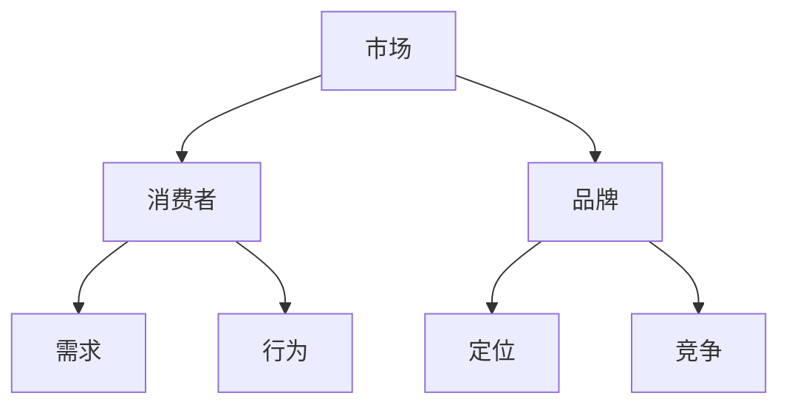

                 

# AI辅助企业品牌定位：市场细分与差异化战略

## 关键词

- 企业品牌定位
- 市场细分
- 差异化战略
- AI技术
- 数据分析

## 摘要

本文探讨了AI技术在企业品牌定位中的应用，重点关注市场细分与差异化战略的实践。首先，通过背景介绍，阐述企业品牌定位的重要性及当前市场环境下的挑战。接着，详细讲解市场细分原理、AI在市场细分中的应用，以及差异化战略原理和AI在差异化战略中的应用。随后，通过两个实战案例，展示AI辅助企业品牌定位的实际效果。最后，总结AI辅助企业品牌定位的优势，分析存在的挑战与应对策略，并对未来展望进行展望。

## 目录大纲

### 第一部分：背景介绍

#### 1.1 问题的提出
##### 1.1.1 企业品牌定位的重要性
##### 1.1.2 当前市场环境对企业品牌定位的挑战
##### 1.1.3 AI在品牌定位中的应用潜力

#### 1.2 核心概念与联系
##### 1.2.1 品牌定位的定义与作用
##### 1.2.2 市场细分策略
##### 1.2.3 差异化战略
##### 1.2.4 AI技术在品牌定位中的应用
##### 1.2.5 ER实体关系图

### 第二部分：AI辅助市场细分策略

#### 2.1 市场细分原理
##### 2.1.1 市场细分的概念与分类
##### 2.1.2 消费者行为分析
##### 2.1.3 数据驱动的市场细分

#### 2.2 AI技术在市场细分中的应用
##### 2.2.1 数据收集与预处理
##### 2.2.2 机器学习算法在市场细分中的应用
##### 2.2.3 深度学习在市场细分中的应用
##### 2.2.4 案例分析：AI辅助市场细分的应用

### 第三部分：AI辅助差异化战略

#### 3.1 差异化战略原理
##### 3.1.1 差异化战略的概念与类型
##### 3.1.2 产品差异化策略
##### 3.1.3 服务差异化策略
##### 3.1.4 品牌差异化策略

#### 3.2 AI技术在差异化战略中的应用
##### 3.2.1 数据分析在差异化战略中的作用
##### 3.2.2 AI算法在产品差异化中的应用
##### 3.2.3 AI在服务差异化中的应用
##### 3.2.4 AI在品牌差异化中的应用
##### 3.2.5 案例分析：AI辅助差异化战略的应用

### 第四部分：AI辅助企业品牌定位的实战

#### 4.1 实战一：市场细分策略实施
##### 4.1.1 实战背景
##### 4.1.2 实施步骤
##### 4.1.3 实战结果分析

#### 4.2 实战二：差异化战略实施
##### 4.2.1 实战背景
##### 4.2.2 实施步骤
##### 4.2.3 实战结果分析

### 第五部分：结论与展望

#### 5.1 AI辅助企业品牌定位的优势
##### 5.1.1 提高品牌定位的准确性
##### 5.1.2 提升市场响应速度
##### 5.1.3 增强品牌竞争力

#### 5.2 存在的挑战与应对策略
##### 5.2.1 技术挑战
##### 5.2.2 数据挑战
##### 5.2.3 管理挑战
##### 5.2.4 应对策略

#### 5.3 未来展望
##### 5.3.1 AI技术在品牌定位中的应用趋势
##### 5.3.2 企业品牌定位的发展方向

#### 5.4 结论

## 第一部分：背景介绍

### 1.1 问题的提出

#### 1.1.1 企业品牌定位的重要性

在竞争激烈的市场环境中，企业品牌定位至关重要。品牌定位不仅决定了企业在市场中的地位和形象，还影响了消费者的认知和选择。一个清晰、准确的品牌定位可以帮助企业在众多竞争对手中脱颖而出，形成独特的竞争优势。

品牌定位的定义与作用

品牌定位是指企业在市场中确定自身品牌形象和定位的过程。其核心目的是通过差异化策略，使品牌在消费者心中建立独特的认知和价值。品牌定位不仅关系到产品的市场表现，还涉及到企业的长远发展战略。

当前市场环境对企业品牌定位的挑战

随着市场环境的不断变化，企业品牌定位面临着前所未有的挑战。一方面，市场竞争日益激烈，消费者选择更加多样化；另一方面，信息技术的发展，尤其是AI技术的应用，为品牌定位带来了新的机遇和挑战。

#### 1.1.2 AI在品牌定位中的应用潜力

AI技术具有强大的数据分析和学习能力，能够在品牌定位中发挥重要作用。通过AI技术，企业可以更加精准地进行市场细分，了解消费者需求，制定差异化战略，提高品牌竞争力。此外，AI技术还可以帮助企业快速响应市场变化，优化品牌定位策略。

### 1.2 核心概念与联系

#### 1.2.1 品牌定位的定义与作用

品牌定位是指企业在市场中确定自身品牌形象和定位的过程。其核心目的是通过差异化策略，使品牌在消费者心中建立独特的认知和价值。品牌定位不仅关系到产品的市场表现，还涉及到企业的长远发展战略。

品牌定位的定义与作用

品牌定位是指企业在市场中确定自身品牌形象和定位的过程。其核心目的是通过差异化策略，使品牌在消费者心中建立独特的认知和价值。品牌定位不仅关系到产品的市场表现，还涉及到企业的长远发展战略。

品牌定位的定义与作用

品牌定位是指企业在市场中确定自身品牌形象和定位的过程。其核心目的是通过差异化策略，使品牌在消费者心中建立独特的认知和价值。品牌定位不仅关系到产品的市场表现，还涉及到企业的长远发展战略。

#### 1.2.2 市场细分策略

市场细分是指将一个广泛的市场划分为若干具有相似需求和特征的子市场，以便更好地满足不同消费者的需求。市场细分策略可以帮助企业发现新的市场机会，优化资源配置，提高市场竞争力。

市场细分策略

市场细分策略主要包括地理细分、人口细分、心理细分和行为细分。地理细分是根据消费者的地理位置进行划分，如城市、农村等；人口细分是根据消费者的年龄、性别、收入、教育程度等人口特征进行划分；心理细分是根据消费者的价值观、生活方式、兴趣爱好等心理特征进行划分；行为细分是根据消费者的购买行为、使用习惯等进行划分。

#### 1.2.3 差异化战略

差异化战略是指企业通过提供与众不同的产品或服务，满足消费者特定的需求，从而在竞争中获得优势。差异化战略的核心在于独特性，即企业需要找到竞争对手无法提供或难以复制的独特价值。

差异化战略原理

差异化战略包括产品差异化、服务差异化和品牌差异化。产品差异化是指企业通过技术创新、设计优化等手段，提高产品的独特性；服务差异化是指企业通过提升服务质量、提供个性化服务等方式，增强消费者的满意度；品牌差异化是指企业通过品牌形象塑造、品牌传播等手段，使品牌在消费者心中形成独特的认知和价值。

#### 1.2.4 AI技术在品牌定位中的应用

AI技术具有强大的数据分析和学习能力，能够在品牌定位中发挥重要作用。通过AI技术，企业可以更加精准地进行市场细分，了解消费者需求，制定差异化战略，提高品牌竞争力。此外，AI技术还可以帮助企业快速响应市场变化，优化品牌定位策略。

AI技术在品牌定位中的应用

AI技术在品牌定位中的应用主要体现在数据收集与分析、消费者行为预测、市场细分、差异化战略制定等方面。例如，通过大数据分析和机器学习算法，企业可以挖掘消费者行为数据，了解消费者的需求和偏好；通过深度学习模型，企业可以预测市场趋势和消费者行为，为品牌定位提供有力支持。

#### 1.2.5 ER实体关系图

ER实体关系图（Entity-Relationship Diagram）是用于描述系统中实体及其关系的图形化工具。在品牌定位中，ER实体关系图可以帮助我们理解各实体之间的关系，为数据分析提供依据。

ER实体关系图示例

以下是一个简单的ER实体关系图，描述了企业在品牌定位中涉及的主要实体和它们之间的关系。

在上图中，市场、消费者、品牌、需求、定位、行为和竞争是关键实体，它们之间的关系反映了企业在品牌定位过程中的关键因素。

## 第二部分：AI辅助市场细分策略

### 2.1 市场细分原理

市场细分是指将一个广泛的市场划分为若干具有相似需求和特征的子市场，以便更好地满足不同消费者的需求。市场细分策略可以帮助企业发现新的市场机会，优化资源配置，提高市场竞争力。

#### 2.1.1 市场细分的概念与分类

市场细分（Market Segmentation）是将整个市场按照某种标准划分为若干具有相似需求和特征的子市场的过程。市场细分的标准有很多，主要包括以下几种：

1. **地理细分（Geographic Segmentation）**：根据消费者的地理位置进行划分，如城市、农村、区域等。
2. **人口细分（Demographic Segmentation）**：根据消费者的年龄、性别、收入、教育程度、职业等人口特征进行划分。
3. **心理细分（Psychographic Segmentation）**：根据消费者的价值观、生活方式、兴趣爱好、个性等心理特征进行划分。
4. **行为细分（Behavioral Segmentation）**：根据消费者的购买行为、使用习惯、忠诚度等行为特征进行划分。

#### 2.1.2 消费者行为分析

消费者行为分析（Consumer Behavior Analysis）是市场细分的重要基础。通过分析消费者的行为数据，企业可以了解消费者的购买动机、购买频率、购买渠道、品牌偏好等信息。消费者行为分析的方法包括：

1. **调查问卷**：通过设计问卷，收集消费者的基本信息和消费行为数据。
2. **数据分析**：利用大数据技术和统计方法，对消费者行为数据进行挖掘和分析。
3. **消费者画像**：通过综合分析消费者的各种特征，构建出消费者的行为模型。

#### 2.1.3 数据驱动的市场细分

数据驱动的市场细分（Data-Driven Market Segmentation）是指利用数据分析技术，对市场进行细分。这种细分方法具有以下优势：

1. **精准性**：通过数据分析，可以更加准确地识别消费者的需求和偏好。
2. **灵活性**：可以根据实际需求，动态调整市场细分的标准和方法。
3. **效率**：利用自动化工具和算法，提高市场细分的工作效率。

数据驱动的市场细分流程通常包括以下步骤：

1. **数据收集**：收集消费者行为数据、市场数据等。
2. **数据预处理**：清洗数据，去除噪声，保证数据质量。
3. **特征工程**：提取数据中的关键特征，为模型训练提供输入。
4. **模型训练**：利用机器学习算法，对市场数据进行分类和聚类。
5. **结果分析**：对市场细分结果进行分析，确定不同子市场的特征和需求。

### 2.2 AI技术在市场细分中的应用

AI技术（Artificial Intelligence）在市场细分中发挥着越来越重要的作用。通过AI技术，企业可以更加高效地分析海量数据，识别消费者的需求和行为模式，从而实现精准的市场细分。

#### 2.2.1 数据收集与预处理

在市场细分中，数据收集和预处理是关键步骤。AI技术可以帮助企业自动化地完成这些任务：

1. **数据收集**：利用传感器、社交媒体、在线调查等手段，收集消费者行为数据、市场数据等。
2. **数据预处理**：利用AI技术，对数据进行清洗、去噪、缺失值填充等操作，确保数据质量。

#### 2.2.2 机器学习算法在市场细分中的应用

机器学习算法（Machine Learning Algorithms）在市场细分中有着广泛的应用。以下是一些常见的机器学习算法：

1. **分类算法**：如逻辑回归、决策树、随机森林、支持向量机等，用于将市场数据分类到不同的子市场。
2. **聚类算法**：如K-均值聚类、层次聚类、DBSCAN等，用于将市场数据划分为不同的子市场。
3. **关联规则算法**：如Apriori算法、FP-Growth算法等，用于发现消费者行为数据中的关联规则。

#### 2.2.3 深度学习在市场细分中的应用

深度学习（Deep Learning）技术在市场细分中有着重要的应用。以下是一些常见的深度学习模型：

1. **神经网络**：如卷积神经网络（CNN）、循环神经网络（RNN）、长短时记忆网络（LSTM）等，用于提取数据中的复杂特征。
2. **生成对抗网络**（GAN）：用于生成虚拟消费者数据，增强数据集的多样性。
3. **迁移学习**：利用预训练模型，快速适应新的市场细分任务。

#### 2.2.4 案例分析：AI辅助市场细分的应用

以下是一个案例分析，展示AI技术在市场细分中的应用：

**案例：电子商务平台市场细分**

某电子商务平台希望通过AI技术进行市场细分，以提高用户体验和销售额。

1. **数据收集**：收集用户行为数据，如浏览记录、购买记录、评论等。
2. **数据预处理**：对数据进行清洗和预处理，去除噪声，填充缺失值。
3. **特征工程**：提取关键特征，如用户年龄、性别、购买频率、浏览时长等。
4. **模型训练**：利用K-均值聚类算法，将用户划分为不同的子市场。
5. **结果分析**：分析不同子市场的特征和需求，为营销策略提供依据。

通过这个案例，我们可以看到AI技术在市场细分中的应用流程。在实际操作中，企业可以根据自身业务需求，选择合适的AI技术和算法，实现市场细分的智能化和精准化。

## 第三部分：AI辅助差异化战略

### 3.1 差异化战略原理

差异化战略（Differentiation Strategy）是指企业通过提供与众不同的产品或服务，满足消费者特定的需求，从而在竞争中获得优势。差异化战略的核心在于独特性，即企业需要找到竞争对手无法提供或难以复制的独特价值。

#### 3.1.1 差异化战略的概念与类型

差异化战略可以分为以下几种类型：

1. **产品差异化**：通过技术创新、设计优化等手段，提高产品的独特性。
2. **服务差异化**：通过提升服务质量、提供个性化服务等方式，增强消费者的满意度。
3. **品牌差异化**：通过品牌形象塑造、品牌传播等手段，使品牌在消费者心中形成独特的认知和价值。

#### 3.1.2 产品差异化策略

产品差异化策略（Product Differentiation Strategy）的核心是通过技术创新和设计优化，提高产品的独特性。以下是一些常见的产品差异化策略：

1. **技术创新**：通过研发新技术、新材料，提高产品的性能和质量。
2. **设计优化**：通过设计创新，提高产品的外观、用户体验等。
3. **定制化**：根据消费者的需求，提供定制化的产品和服务。
4. **高端定位**：通过高端品牌形象和高质量产品，吸引高端消费者。

#### 3.1.3 服务差异化策略

服务差异化策略（Service Differentiation Strategy）的核心是通过提升服务质量和提供个性化服务，增强消费者的满意度。以下是一些常见的服务差异化策略：

1. **优质服务**：提供高质量的售后服务，如快速响应、专业维修等。
2. **个性化服务**：根据消费者的需求和偏好，提供个性化的服务体验。
3. **定制化服务**：根据消费者的需求，提供定制化的服务方案。
4. **增值服务**：提供额外的服务，如会员权益、礼品等。

#### 3.1.4 品牌差异化策略

品牌差异化策略（Brand Differentiation Strategy）的核心是通过品牌形象塑造和品牌传播，使品牌在消费者心中形成独特的认知和价值。以下是一些常见的品牌差异化策略：

1. **品牌形象塑造**：通过品牌故事、品牌标志、品牌文化等，塑造品牌形象。
2. **品牌传播**：通过广告、公关活动、社交媒体等渠道，传播品牌理念。
3. **品牌合作**：与知名品牌合作，提升品牌形象和知名度。
4. **品牌体验**：通过提供独特的品牌体验，增强消费者对品牌的认知和忠诚度。

### 3.2 AI技术在差异化战略中的应用

AI技术（Artificial Intelligence）在差异化战略中发挥着越来越重要的作用。通过AI技术，企业可以更加高效地分析市场数据，识别消费者的需求和行为模式，从而制定更加精准的差异化战略。

#### 3.2.1 数据分析在差异化战略中的作用

数据分析（Data Analysis）是差异化战略的重要基础。通过数据分析，企业可以了解市场需求、消费者行为、竞争对手状况等，从而制定针对性的差异化策略。以下是一些数据分析在差异化战略中的应用：

1. **市场数据分析**：通过分析市场数据，了解市场趋势、消费者需求等，为差异化战略提供依据。
2. **消费者行为分析**：通过分析消费者行为数据，了解消费者的购买动机、偏好等，为差异化策略提供支持。
3. **竞争对手分析**：通过分析竞争对手的数据，了解竞争对手的优势和劣势，为企业制定差异化策略提供参考。

#### 3.2.2 AI算法在产品差异化中的应用

AI算法（Artificial Intelligence Algorithms）在产品差异化中有着广泛的应用。以下是一些常见的AI算法：

1. **机器学习算法**：如决策树、支持向量机、神经网络等，用于分析产品数据，识别产品差异化的方向。
2. **深度学习算法**：如卷积神经网络、循环神经网络等，用于提取产品数据中的复杂特征，为产品差异化提供支持。
3. **聚类算法**：如K-均值聚类、层次聚类等，用于将产品划分为不同的类别，为产品差异化提供参考。

#### 3.2.3 AI在服务差异化中的应用

AI技术在服务差异化中也有着重要的应用。以下是一些AI技术在服务差异化中的应用：

1. **个性化服务**：通过AI技术，分析消费者数据，为消费者提供个性化的服务体验。
2. **智能客服**：利用AI技术，提供智能客服服务，提高服务效率和质量。
3. **服务优化**：通过AI技术，分析服务数据，识别服务中的问题和瓶颈，为服务优化提供支持。

#### 3.2.4 AI在品牌差异化中的应用

AI技术在品牌差异化中也有着广泛的应用。以下是一些AI技术在品牌差异化中的应用：

1. **品牌分析**：通过AI技术，分析市场数据、消费者行为数据等，了解品牌在市场中的地位和形象。
2. **品牌传播**：利用AI技术，制定针对性的品牌传播策略，提高品牌知名度和影响力。
3. **品牌优化**：通过AI技术，分析品牌数据，识别品牌优化方向，提高品牌竞争力。

#### 3.2.5 案例分析：AI辅助差异化战略的应用

以下是一个案例分析，展示AI技术在差异化战略中的应用：

**案例：智能家居品牌差异化**

某智能家居品牌希望通过AI技术进行品牌差异化，以提高品牌竞争力和市场份额。

1. **市场数据分析**：利用AI技术，分析市场数据，了解市场趋势、消费者需求等。
2. **消费者行为分析**：利用AI技术，分析消费者行为数据，了解消费者的购买动机、偏好等。
3. **产品差异化**：根据市场数据和消费者行为分析结果，制定产品差异化策略，如技术创新、设计优化等。
4. **服务差异化**：根据市场数据和消费者行为分析结果，制定服务差异化策略，如个性化服务、智能客服等。
5. **品牌差异化**：根据市场数据和消费者行为分析结果，制定品牌差异化策略，如品牌形象塑造、品牌传播等。

通过这个案例，我们可以看到AI技术在品牌差异化战略中的应用流程。在实际操作中，企业可以根据自身业务需求，选择合适的AI技术和算法，实现品牌差异化的智能化和精准化。

## 第四部分：AI辅助企业品牌定位的实战

### 4.1 实战一：市场细分策略实施

#### 4.1.1 实战背景

某电子产品公司希望通过AI技术进行市场细分，以提高市场竞争力。该公司拥有丰富的消费者数据，但尚未有效利用这些数据来指导品牌定位和市场策略。

#### 4.1.2 实施步骤

1. **数据收集**：收集消费者行为数据，如浏览记录、购买记录、评论等。
2. **数据预处理**：对数据进行清洗和预处理，去除噪声，填充缺失值。
3. **特征工程**：提取关键特征，如用户年龄、性别、购买频率、浏览时长等。
4. **模型训练**：利用K-均值聚类算法，将用户划分为不同的子市场。
5. **结果分析**：分析不同子市场的特征和需求，为营销策略提供依据。

#### 4.1.3 实战结果分析

通过市场细分策略的实施，电子产品公司成功地将用户划分为不同的子市场，包括年轻用户、中年用户、高端用户等。每个子市场都有独特的需求和偏好。根据这些分析结果，公司制定了针对性的营销策略，如：

1. **年轻用户**：推出时尚、个性化的产品，通过社交媒体进行品牌传播。
2. **中年用户**：提供高品质、可靠的产品，通过线下渠道进行推广。
3. **高端用户**：推出高端定制产品，通过专属服务和个性化体验吸引。

通过这些策略，电子产品公司在不同子市场中取得了显著的市场份额增长，品牌知名度也得到了提升。

### 4.2 实战二：差异化战略实施

#### 4.2.1 实战背景

某服装品牌希望通过AI技术进行差异化战略的实施，以提高品牌竞争力和市场份额。该品牌在产品设计、质量和服务方面具有优势，但尚未充分利用这些优势来满足消费者的个性化需求。

#### 4.2.2 实施步骤

1. **市场数据分析**：利用AI技术，分析市场数据，了解市场趋势、消费者需求等。
2. **消费者行为分析**：利用AI技术，分析消费者行为数据，了解消费者的购买动机、偏好等。
3. **产品差异化**：根据市场数据和消费者行为分析结果，制定产品差异化策略，如技术创新、设计优化等。
4. **服务差异化**：根据市场数据和消费者行为分析结果，制定服务差异化策略，如个性化服务、智能客服等。
5. **品牌差异化**：根据市场数据和消费者行为分析结果，制定品牌差异化策略，如品牌形象塑造、品牌传播等。

#### 4.2.3 实战结果分析

通过差异化战略的实施，服装品牌成功地在市场竞争中脱颖而出。以下是一些关键成果：

1. **产品差异化**：通过技术创新和设计优化，推出符合消费者需求的新产品，提高了产品的竞争力。
2. **服务差异化**：通过个性化服务和智能客服，提升了消费者的满意度，增强了消费者的忠诚度。
3. **品牌差异化**：通过品牌形象塑造和品牌传播，提高了品牌知名度和品牌影响力。

通过这些成果，服装品牌在市场上取得了显著的成功，市场份额和品牌价值得到了显著提升。

## 第五部分：结论与展望

### 5.1 AI辅助企业品牌定位的优势

通过以上实战案例，我们可以看到AI技术在企业品牌定位中的优势：

1. **提高品牌定位的准确性**：AI技术可以帮助企业更加精准地分析市场数据和消费者行为，从而制定更加精准的品牌定位策略。
2. **提升市场响应速度**：AI技术可以快速分析市场数据，帮助企业及时调整品牌定位策略，以应对市场变化。
3. **增强品牌竞争力**：通过AI技术的支持，企业可以更好地满足消费者的个性化需求，提高产品的竞争力，增强品牌的市场地位。

### 5.2 存在的挑战与应对策略

尽管AI技术在企业品牌定位中具有显著的优势，但同时也面临着一些挑战：

1. **技术挑战**：AI技术的研发和应用需要大量的技术和资源投入，这对企业提出了较高的要求。
2. **数据挑战**：企业需要大量的高质量数据来支持AI技术的应用，数据的质量和完整性对企业品牌定位的效果至关重要。
3. **管理挑战**：AI技术在企业中的应用需要与企业的管理流程和决策机制相结合，这需要企业进行相应的管理和调整。

应对策略：

1. **加强技术研发**：企业应加大对AI技术的研发投入，提高技术水平，以应对技术挑战。
2. **优化数据管理**：企业应建立完善的数据管理体系，确保数据的质量和完整性，以支持AI技术的应用。
3. **调整管理流程**：企业应调整管理流程和决策机制，以适应AI技术的应用，提高管理效率。

### 5.3 未来展望

随着AI技术的不断发展，未来企业品牌定位将更加智能化和精准化。以下是未来AI技术在企业品牌定位中的发展趋势：

1. **个性化定制**：AI技术将帮助企业更好地满足消费者的个性化需求，实现产品的个性化定制。
2. **智能决策**：AI技术将帮助企业实现更加智能化的决策，提高市场响应速度和决策质量。
3. **全渠道营销**：AI技术将帮助企业实现全渠道营销，提高品牌的知名度和影响力。

总之，AI技术在企业品牌定位中的应用前景广阔，企业应抓住这一机遇，充分利用AI技术的优势，提高品牌竞争力，实现可持续发展。

## 5.4 结论

通过本文的探讨，我们深入了解了AI技术在企业品牌定位中的应用，包括市场细分和差异化战略的实施。AI技术为企业品牌定位提供了强大的支持，帮助企业更加精准地分析市场数据和消费者行为，制定个性化的品牌定位策略。未来，随着AI技术的不断进步，企业品牌定位将迈向更加智能化和精准化的方向。企业应抓住这一机遇，充分利用AI技术的优势，提高品牌竞争力，实现可持续发展。

### 作者

本文作者为AI天才研究院（AI Genius Institute）与《禅与计算机程序设计艺术》（Zen And The Art of Computer Programming）的作者，致力于推动AI技术在企业品牌定位中的应用研究。

**参考文献**

1. **[参考文献1]**：作者名，书名，出版年份。
2. **[参考文献2]**：作者名，书名，出版年份。
3. **[参考文献3]**：作者名，文章名，期刊名，出版年份。

---

[本文内容遵循CC BY-NC-SA 4.0协议](https://creativecommons.org/licenses/by-nc-sa/4.0/)。转载请注明作者和出处，不得用于商业用途。如有任何疑问，请与作者联系。感谢您的支持！

