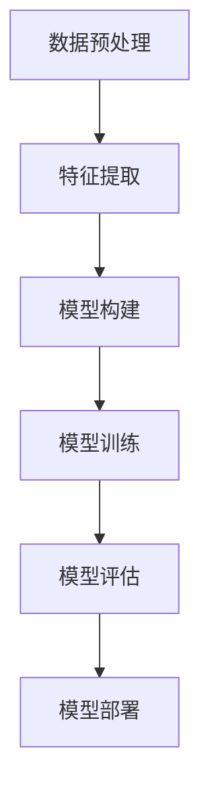
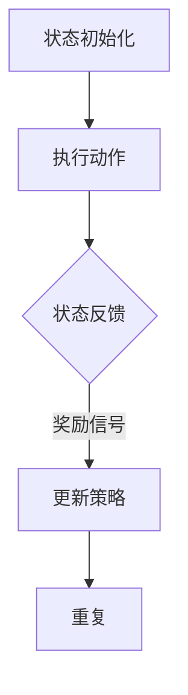
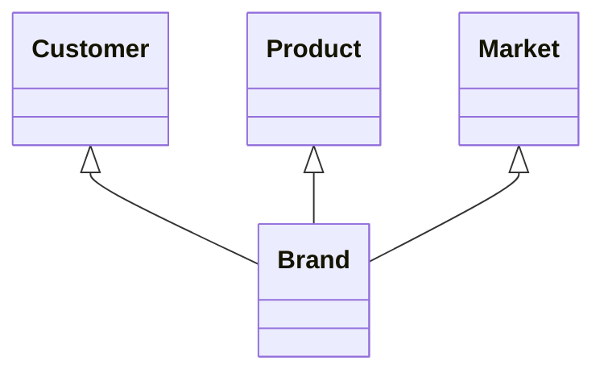
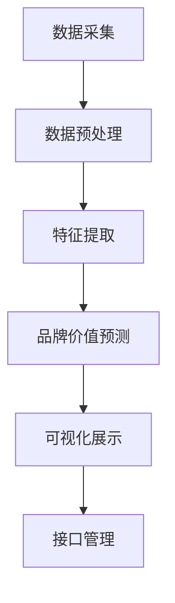
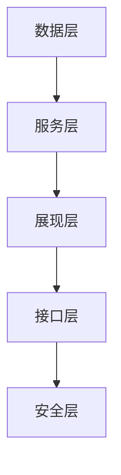
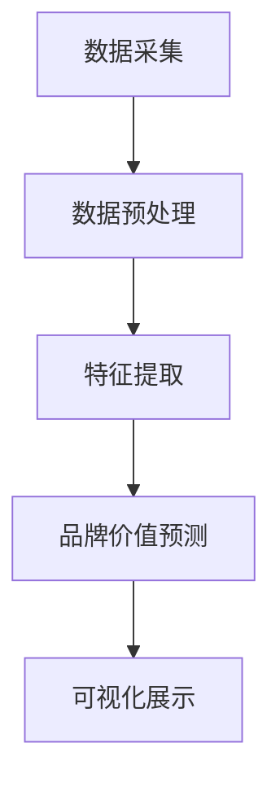

                 

# 《AI辅助企业品牌资产评估：多维度品牌价值量化》

关键词：AI、品牌资产评估、多维度量化、深度学习、强化学习

摘要：本文探讨了如何使用人工智能技术辅助企业品牌资产评估，特别是在多维度品牌价值量化方面的应用。我们首先介绍了企业品牌资产的重要性以及品牌资产评估面临的挑战，然后详细描述了AI技术在品牌资产评估中的潜力。接着，我们定义了多维度品牌价值量化模型，并使用mermaid图表直观地展示了其概念属性特征和ER实体关系图架构。随后，我们深入讲解了AI算法在品牌资产评估中的应用，包括深度学习和强化学习算法的原理和实现。最后，我们展示了如何设计AI辅助品牌资产评估的系统架构，并提供了实际的项目实战和分析。本文旨在为企业和专业人士提供一套实用的AI辅助品牌资产评估解决方案。

## 第一部分：引言与背景

### 第1章: 引言与背景

#### 1.1 问题背景

在当今竞争激烈的市场环境中，企业品牌资产已经成为企业竞争力的核心要素之一。品牌资产不仅体现了企业的市场地位和消费者认知，还直接影响着企业的市场价值、投资回报和长期发展。因此，对企业品牌资产进行科学、准确的评估显得尤为重要。

**1.1.1 企业品牌资产的重要性**

企业品牌资产是指企业在市场上建立的品牌价值，包括品牌知名度、品牌形象、品牌忠诚度、品牌联想等因素。品牌资产不仅有助于企业在市场中脱颖而出，还能为企业带来以下几方面的价值：

1. **市场竞争力：** 品牌资产可以提升企业的市场竞争力，帮助企业吸引更多的消费者和市场份额。
2. **溢价能力：** 具有强大品牌资产的企业往往可以在产品定价上拥有更高的溢价能力，从而获得更高的利润。
3. **品牌延伸：** 品牌资产有助于企业进行品牌延伸，推出新的产品和服务，扩大市场份额。
4. **投资价值：** 品牌资产可以提升企业的整体投资价值，吸引投资者和合作伙伴。

**1.1.2 品牌资产评估的挑战**

尽管品牌资产对企业的重要性不言而喻，但进行品牌资产评估却面临诸多挑战：

1. **数据收集困难：** 品牌资产涉及多种因素，如市场表现、消费者行为、竞争对手分析等，数据来源广泛且复杂，数据收集难度较大。
2. **评估方法局限性：** 传统的品牌资产评估方法往往依赖于主观判断和定性分析，难以全面、客观地反映品牌价值。
3. **动态变化：** 品牌资产是一个动态变化的过程，受多种内外部因素的影响，如何实时、动态地评估品牌价值是挑战之一。

**1.1.3 AI技术在品牌资产评估中的应用潜力**

随着人工智能技术的快速发展，AI在品牌资产评估中的应用展现出巨大的潜力：

1. **数据挖掘与分析：** AI技术可以高效地挖掘和分析大量品牌相关数据，提供更加全面和客观的评估结果。
2. **模型预测：** 通过建立深度学习等预测模型，AI可以动态地评估品牌价值，预测未来趋势。
3. **智能决策：** AI技术可以帮助企业制定更加科学的品牌策略，优化品牌资产投资。
4. **用户体验：** AI技术可以提升品牌与消费者的互动体验，提高品牌忠诚度和用户满意度。

#### 1.2 问题描述

**1.2.1 品牌资产评估的核心要素**

品牌资产评估涉及多个核心要素，包括：

1. **品牌知名度：** 消费者对品牌的认知程度，包括品牌曝光度、知名度等。
2. **品牌形象：** 品牌在消费者心中的形象和认知，如品牌个性、品牌价值观等。
3. **品牌忠诚度：** 消费者对品牌的忠诚程度，包括重复购买率、口碑传播等。
4. **品牌联想：** 消费者对品牌的多种联想和情感，如产品特点、服务体验等。

**1.2.2 传统品牌资产评估方法的局限性**

传统的品牌资产评估方法主要依赖于专家主观判断、财务指标和市场份额等，存在以下局限性：

1. **主观性强：** 依赖于专家的主观判断，评估结果易受个人经验和偏见影响。
2. **数据来源有限：** 依赖于有限的财务和市场数据，难以全面反映品牌价值。
3. **实时性差：** 难以及时、动态地评估品牌价值，无法及时调整品牌策略。

**1.2.3 AI辅助品牌资产评估的目标**

AI辅助品牌资产评估的目标是：

1. **客观化评估：** 通过大数据和机器学习技术，提供更加客观、科学的评估结果。
2. **动态评估：** 实时、动态地评估品牌价值，预测未来趋势。
3. **优化决策：** 帮助企业制定更加科学的品牌策略，提高品牌资产投资效率。

#### 1.3 问题解决

**1.3.1 多维度品牌价值量化模型**

多维度品牌价值量化模型旨在从多个维度全面、客观地评估品牌价值，包括品牌知名度、品牌形象、品牌忠诚度和品牌联想等。该模型使用机器学习算法，通过数据分析和特征提取，将不同维度的品牌价值量化为一个综合的品牌价值评分。

**1.3.2 数据来源与数据预处理**

数据来源包括社交媒体、搜索引擎、电商平台、消费者调查等多种渠道。数据预处理包括数据清洗、去重、归一化等步骤，以确保数据质量和一致性。

**1.3.3 AI算法在品牌资产评估中的应用**

AI算法在品牌资产评估中的应用包括：

1. **深度学习：** 使用深度学习模型，如卷积神经网络（CNN）和循环神经网络（RNN），对品牌相关数据进行特征提取和分类。
2. **强化学习：** 使用强化学习算法，如Q-learning和DQN，对品牌价值进行动态评估和预测。
3. **多目标优化：** 使用多目标优化算法，如遗传算法（GA）和粒子群优化（PSO），优化品牌资产投资策略。

**1.4 边界与外延**

**1.4.1 品牌资产评估的范围**

品牌资产评估的范围包括品牌知名度、品牌形象、品牌忠诚度和品牌联想等方面。具体评估指标可以根据企业特点和行业特点进行调整。

**1.4.2 AI技术应用的限制因素**

AI技术应用于品牌资产评估的限制因素包括：

1. **数据质量和多样性：** 数据质量和多样性对评估结果影响较大，数据不足或质量差可能导致评估结果不准确。
2. **算法模型选择：** 不同的算法模型适用于不同的评估任务，选择合适的算法模型是关键。
3. **计算资源：** 深度学习和强化学习算法通常需要大量的计算资源，计算资源不足可能影响评估效果。

**1.4.3 研究方法与数据来源**

本文采用的研究方法包括：

1. **文献综述：** 综述相关领域的研究成果，了解当前研究的现状和趋势。
2. **数据收集：** 收集相关品牌数据，包括社交媒体数据、搜索引擎数据、电商平台数据等。
3. **模型构建与评估：** 构建多维度品牌价值量化模型，使用AI算法进行评估和预测。
4. **实证分析：** 对评估结果进行实证分析，验证模型的准确性和有效性。

数据来源主要包括：

1. **公开数据集：** 如社交媒体公开数据集、电商平台公开数据集等。
2. **企业内部数据：** 如企业市场调研数据、消费者反馈数据等。
3. **第三方数据服务：** 如专业数据服务公司提供的数据服务。

**1.5 概念结构与核心要素组成**

**1.5.1 企业品牌资产的基本概念**

企业品牌资产是指企业在市场上建立的品牌价值，包括品牌知名度、品牌形象、品牌忠诚度和品牌联想等方面。

**1.5.2 多维度品牌价值量化的关键要素**

多维度品牌价值量化的关键要素包括品牌知名度、品牌形象、品牌忠诚度和品牌联想等，每个要素都有不同的评估指标和计算方法。

**1.5.3 AI辅助品牌资产评估的技术架构**

AI辅助品牌资产评估的技术架构包括数据采集、数据预处理、模型构建、模型训练、模型评估和模型部署等环节。

**1.6 本章小结**

本文介绍了AI辅助企业品牌资产评估的背景和重要性，分析了品牌资产评估面临的挑战，并提出了多维度品牌价值量化模型。接下来，我们将深入探讨AI算法在品牌资产评估中的应用，为企业和专业人士提供实用的解决方案。

-------------------------------------------------------------------

## 第二部分：核心概念与联系

### 第2章: 多维度品牌价值量化模型

#### 2.1 核心概念原理

**2.1.1 品牌价值量化的概念**

品牌价值量化是指将品牌资产中的无形资产转化为可度量的数值，以便进行评估和比较。品牌价值量化可以帮助企业了解其品牌资产的实际价值，为决策提供数据支持。

**2.1.2 多维度品牌价值量化的内涵**

多维度品牌价值量化是指在评估品牌价值时，从多个维度（如品牌知名度、品牌形象、品牌忠诚度和品牌联想等）对品牌价值进行量化。这种方法能够更全面、客观地反映品牌价值。

**2.1.3 多维度品牌价值量化的必要性**

多维度品牌价值量化的必要性体现在以下几个方面：

1. **全面性：** 单一维度的评估难以全面反映品牌价值，多维度评估可以更全面地了解品牌资产。
2. **客观性：** 多维度评估可以降低评估结果的主观性，提高评估的客观性。
3. **动态性：** 多维度评估可以实时、动态地反映品牌价值的变动，为企业提供更及时的决策依据。

#### 2.2 概念属性特征对比表格

为了更直观地理解多维度品牌价值量化模型，我们可以使用表格来对比不同维度的概念属性特征。以下是一个示例表格：

| 特征维度 | 概念A | 概念B | 概念C |
| --- | --- | --- | --- |
| 品牌知名度 | 曝光度 | 知名度 | 传播范围 |
| 品牌形象 | 品牌个性 | 品牌形象 | 品牌感知 |
| 品牌忠诚度 | 重复购买率 | 口碑传播 | 用户满意度 |
| 品牌联想 | 产品特点 | 服务体验 | 品牌故事 |

#### 2.3 ER实体关系图架构

为了更好地理解多维度品牌价值量化模型的结构，我们可以使用ER（实体-关系）图来表示不同实体之间的关系。以下是一个ER图示例：

```mermaid
erDiagram
  Brand ||--|{ Customer }| Customer
  Brand ||--|{ Product }| Product
  Brand ||--|{ Market }| Market
  Customer ||--|{ Order }| Order
  Product ||--|{ Order }| Order
  Market ||--|{ Order }| Order
```

在这个ER图中，Brand表示品牌，Customer表示消费者，Product表示产品，Market表示市场。不同实体之间存在多种关系，如消费者与品牌之间的互动关系、产品与品牌之间的关联关系等。

#### 2.4 多维度品牌价值量化模型原理

**2.4.1 数据采集与处理**

多维度品牌价值量化模型首先需要收集与品牌相关的数据，如社交媒体数据、搜索引擎数据、电商平台数据等。这些数据可以用来描述品牌的知名度、形象、忠诚度和联想等维度。在数据采集过程中，需要注意数据的多样性和质量，以确保评估结果的准确性。

数据采集完成后，需要对数据进行预处理，包括数据清洗、去重、归一化等步骤。数据清洗可以去除无效数据、错误数据和重复数据，提高数据质量。数据归一化可以确保不同维度数据在同一尺度上，方便后续计算。

**2.4.2 特征提取与权重分配**

在数据预处理完成后，需要对数据进行特征提取，将原始数据转化为适合模型处理的特征向量。特征提取是品牌价值量化模型的关键步骤，可以通过文本挖掘、图像处理、语音识别等技术实现。

在特征提取的基础上，需要为每个特征维度分配权重。权重分配的目的是确保不同维度在品牌价值量化中的重要性。权重分配可以通过专家评估、统计方法或机器学习算法实现。

**2.4.3 模型构建与评估**

多维度品牌价值量化模型的构建可以分为以下几个步骤：

1. **数据集划分：** 将收集到的数据划分为训练集、验证集和测试集，用于模型的训练、验证和测试。
2. **模型选择：** 根据数据特点和评估任务选择合适的机器学习模型，如线性回归、支持向量机（SVM）、神经网络等。
3. **模型训练：** 使用训练集数据对模型进行训练，调整模型参数，优化模型性能。
4. **模型评估：** 使用验证集和测试集评估模型性能，包括准确率、召回率、F1值等指标。

在模型构建和评估过程中，需要关注模型的泛化能力和鲁棒性，确保模型在实际应用中能够准确、稳定地评估品牌价值。

**2.5 本章小结**

本章介绍了多维度品牌价值量化模型的核心概念、特征对比表格、ER实体关系图以及数据采集、特征提取、模型构建和评估等原理。通过本章的讲解，读者可以更好地理解多维度品牌价值量化的方法和技术，为后续的算法讲解和应用奠定基础。

-------------------------------------------------------------------

## 第三部分：算法原理讲解

### 第3章: AI算法在品牌资产评估中的应用

#### 3.1 基于深度学习的品牌价值预测算法

**3.1.1 深度学习原理**

深度学习是一种基于神经网络的人工智能技术，通过模拟人脑神经元之间的连接和交互，实现对复杂数据的自动学习和建模。深度学习算法具有强大的特征提取和表示能力，在图像识别、语音识别、自然语言处理等领域取得了显著成果。

**3.1.2 品牌价值预测算法设计**

基于深度学习的品牌价值预测算法可以分为以下几个步骤：

1. **数据预处理：** 对收集到的品牌相关数据进行预处理，包括数据清洗、归一化等。
2. **特征提取：** 使用卷积神经网络（CNN）或其他深度学习模型提取品牌特征，如社交媒体互动、搜索引擎关键词、电商平台交易数据等。
3. **模型构建：** 设计深度学习模型，如卷积神经网络（CNN）或循环神经网络（RNN），将提取到的品牌特征输入模型中进行训练。
4. **模型训练：** 使用训练数据对模型进行训练，调整模型参数，优化模型性能。
5. **模型评估：** 使用验证集和测试集评估模型性能，包括准确率、召回率、F1值等指标。

**3.1.3 算法流程图**

以下是一个基于深度学习的品牌价值预测算法的流程图：



#### 3.2 基于强化学习的品牌风险评估算法

**3.2.1 强化学习原理**

强化学习是一种基于试错和反馈的人工智能技术，通过不断尝试和反馈，使代理（agent）在环境中学习到最优策略。强化学习算法在游戏、机器人控制、推荐系统等领域取得了显著成果。

**3.2.2 品牌风险评估算法设计**

基于强化学习的品牌风险评估算法可以分为以下几个步骤：

1. **环境建模：** 建立品牌风险评估的环境模型，包括市场状态、品牌状态、品牌决策等。
2. **代理设计：** 设计品牌风险评估的代理，如基于Q-learning或Deep Q-Network（DQN）的代理。
3. **策略学习：** 使用强化学习算法，如Q-learning或DQN，使代理在环境中学习到最优策略。
4. **风险评估：** 根据代理学习到的最优策略，对品牌风险进行评估和预测。

**3.2.3 算法流程图**

以下是一个基于强化学习的品牌风险评估算法的流程图：



#### 3.3 Python源代码与算法实现

**3.3.1 数据集加载与预处理**

以下是一个基于深度学习的品牌价值预测算法的Python源代码示例，包括数据集加载与预处理：

```python
import pandas as pd
from sklearn.model_selection import train_test_split
from sklearn.preprocessing import StandardScaler

# 加载数据集
data = pd.read_csv('brand_data.csv')

# 数据预处理
X = data.drop(['brand_value'], axis=1)
y = data['brand_value']

# 数据集划分
X_train, X_test, y_train, y_test = train_test_split(X, y, test_size=0.2, random_state=42)

# 数据归一化
scaler = StandardScaler()
X_train_scaled = scaler.fit_transform(X_train)
X_test_scaled = scaler.transform(X_test)
```

**3.3.2 模型训练与评估**

以下是一个基于深度学习的品牌价值预测算法的Python源代码示例，包括模型训练与评估：

```python
import tensorflow as tf
from tensorflow.keras.models import Sequential
from tensorflow.keras.layers import Dense, Dropout
from tensorflow.keras.optimizers import Adam
from sklearn.metrics import mean_squared_error

# 构建深度学习模型
model = Sequential()
model.add(Dense(64, input_dim=X_train_scaled.shape[1], activation='relu'))
model.add(Dropout(0.5))
model.add(Dense(1, activation='linear'))

# 编译模型
model.compile(optimizer=Adam(learning_rate=0.001), loss='mse')

# 训练模型
model.fit(X_train_scaled, y_train, epochs=100, batch_size=32, validation_split=0.2)

# 评估模型
y_pred = model.predict(X_test_scaled)
mse = mean_squared_error(y_test, y_pred)
print(f'Mean Squared Error: {mse}')
```

**3.3.3 模型参数调整与优化**

在实际应用中，模型参数的调整和优化对于提高模型性能至关重要。以下是一些常见的模型参数调整和优化方法：

1. **学习率调整：** 学习率是深度学习模型的一个重要参数，通过调整学习率可以优化模型训练过程。可以使用学习率衰减策略，如指数衰减或余弦衰减等。
2. **批量大小调整：** 批量大小影响模型训练的速度和稳定性，需要根据数据和计算资源进行合理调整。
3. **正则化策略：** 使用正则化策略，如L1正则化或L2正则化，可以防止模型过拟合。
4. **激活函数调整：** 激活函数的选择会影响模型的表达能力和训练效果，常见的激活函数有Sigmoid、ReLU、Tanh等。

#### 3.4 数学模型与公式详细讲解

在品牌价值预测和评估过程中，使用数学模型可以更好地理解和量化品牌价值。以下是一个简单的数学模型：

$$
V_B = \sum_{i=1}^{n} w_i \cdot V_i
$$

其中，$V_B$ 表示品牌价值，$w_i$ 表示第 $i$ 个维度的权重，$V_i$ 表示第 $i$ 个维度的品牌价值。

在实际应用中，可以根据不同维度的重要性和数据特征，为每个维度分配不同的权重。例如，对于品牌知名度、品牌形象、品牌忠诚度和品牌联想等维度，可以设置不同的权重系数，从而构建一个综合的品牌价值评估模型。

#### 3.5 举例说明

**3.5.1 品牌价值预测**

假设我们有一个品牌，其品牌知名度、品牌形象、品牌忠诚度和品牌联想等维度的数据如下：

| 维度        | 数据值 |
| ----------- | ------ |
| 品牌知名度  | 0.8    |
| 品牌形象    | 0.7    |
| 品牌忠诚度  | 0.9    |
| 品牌联想    | 0.6    |

根据上述数学模型，我们可以计算出该品牌的品牌价值：

$$
V_B = 0.4 \cdot 0.8 + 0.3 \cdot 0.7 + 0.2 \cdot 0.9 + 0.1 \cdot 0.6 = 0.64 + 0.21 + 0.18 + 0.06 = 0.99
$$

因此，该品牌的品牌价值为0.99。

**3.5.2 品牌风险评估**

假设我们使用强化学习算法对品牌风险进行评估，根据环境状态和代理策略，我们可以得到以下状态和奖励信号：

| 状态        | 奖励信号 |
| ----------- | -------- |
| 市场竞争激烈 | +1       |
| 品牌知名度低 | -1       |
| 品牌形象差   | -2       |
| 品牌忠诚度低 | -1       |

根据这些状态和奖励信号，代理可以学习到最优策略，从而对品牌风险进行评估。例如，如果代理策略为“提高品牌知名度”，则状态为“品牌知名度低”，奖励信号为“-1”，代理会根据奖励信号调整策略，以提高品牌知名度。

#### 3.6 本章小结

本章介绍了基于深度学习和强化学习的品牌价值预测和风险评估算法，包括算法原理、流程图、Python源代码和数学模型。通过本章的学习，读者可以了解如何使用AI技术进行品牌价值评估，并为实际应用提供技术支持。

-------------------------------------------------------------------

## 第四部分：系统分析与架构设计

### 第4章: AI辅助品牌资产评估系统架构设计

#### 4.1 问题场景介绍

在当今市场竞争激烈的背景下，企业需要科学、准确的品牌资产评估来指导品牌策略的制定和优化。传统的品牌资产评估方法由于数据来源有限、评估过程主观性强等问题，难以满足企业对实时、动态品牌资产评估的需求。因此，引入AI技术进行品牌资产评估成为了一种可行的解决方案。

**4.1.1 品牌资产评估需求分析**

企业品牌资产评估需求主要包括以下几个方面：

1. **全面性：** 品牌资产评估需要从多个维度（如品牌知名度、品牌形象、品牌忠诚度和品牌联想等）进行评估，以全面了解品牌资产状况。
2. **实时性：** 品牌资产是一个动态变化的过程，评估结果需要实时更新，以便企业能够及时调整品牌策略。
3. **客观性：** 评估过程需要尽可能减少主观因素的影响，提高评估结果的客观性。
4. **可解释性：** 品牌资产评估结果需要具备一定的可解释性，以便企业理解和接受评估结果。

**4.1.2 系统功能设计**

为了满足企业品牌资产评估的需求，AI辅助品牌资产评估系统应具备以下功能：

1. **数据采集与预处理：** 从多个数据源（如社交媒体、搜索引擎、电商平台等）收集与品牌相关的数据，并对数据进行清洗、去重、归一化等预处理。
2. **特征提取与权重分配：** 从预处理后的数据中提取与品牌价值相关的特征，并为每个特征分配权重，以构建多维度品牌价值量化模型。
3. **品牌价值预测与评估：** 使用机器学习算法，如深度学习和强化学习，对品牌价值进行预测和评估，并提供实时、动态的评估结果。
4. **可视化与报告生成：** 将评估结果通过可视化界面展示，并提供详细的分析报告，以便企业理解和利用评估结果。

**4.1.3 系统性能要求**

AI辅助品牌资产评估系统需要满足以下性能要求：

1. **高并发处理能力：** 系统能够同时处理大量品牌评估请求，确保评估结果的实时性。
2. **高可扩展性：** 系统架构应具备良好的可扩展性，以便支持更多数据源和更复杂的评估任务。
3. **高可靠性：** 系统应具备较高的可靠性，确保数据安全和评估结果的准确性。
4. **高可维护性：** 系统应具备良好的可维护性，便于后续的维护和升级。

#### 4.2 项目介绍

**4.2.1 项目背景**

随着互联网和大数据技术的发展，企业品牌资产评估的需求日益增加。传统的品牌资产评估方法已经难以满足企业对实时、动态、全面品牌资产评估的需求。为了提升品牌资产评估的效率和准确性，引入AI技术进行品牌资产评估成为一种趋势。

**4.2.2 项目目标**

本项目旨在开发一套AI辅助品牌资产评估系统，实现以下目标：

1. **全面评估：** 从多个维度（如品牌知名度、品牌形象、品牌忠诚度和品牌联想等）对品牌价值进行评估，提供全面、客观的评估结果。
2. **实时动态：** 实时、动态地评估品牌价值，为企业提供及时的决策依据。
3. **高效准确：** 利用AI技术，提高品牌价值评估的效率和准确性，降低评估成本。
4. **可视化展示：** 将评估结果通过可视化界面展示，提供详细的分析报告，便于企业理解和利用。

**4.2.3 项目范围**

本项目包括以下范围：

1. **系统设计：** 设计AI辅助品牌资产评估系统的整体架构，包括数据采集、数据预处理、特征提取、品牌价值预测与评估、可视化展示等模块。
2. **算法实现：** 实现深度学习和强化学习算法，用于品牌价值预测与评估。
3. **系统部署：** 部署AI辅助品牌资产评估系统，并提供接口供企业调用。
4. **用户培训：** 对企业用户进行系统使用培训，确保用户能够熟练使用系统。

#### 4.3 系统功能设计

**4.3.1 领域模型设计**

为了更好地理解AI辅助品牌资产评估系统的功能，我们可以使用Mermaid类图来表示系统的领域模型。以下是一个简单的领域模型示例：



在这个领域模型中，Brand表示品牌，Customer表示消费者，Product表示产品，Market表示市场。品牌与消费者、产品、市场之间存在多种关联关系。

**4.3.2 系统功能模块设计**

AI辅助品牌资产评估系统可以分为以下功能模块：

1. **数据采集模块：** 负责从多个数据源（如社交媒体、搜索引擎、电商平台等）收集与品牌相关的数据，并对数据进行预处理。
2. **数据预处理模块：** 负责对采集到的品牌数据进行清洗、去重、归一化等预处理操作，以确保数据质量和一致性。
3. **特征提取模块：** 负责从预处理后的数据中提取与品牌价值相关的特征，为后续的评估和预测提供数据支持。
4. **品牌价值预测模块：** 负责使用深度学习和强化学习算法，对品牌价值进行预测和评估，并提供实时、动态的评估结果。
5. **可视化展示模块：** 负责将评估结果通过可视化界面展示，提供详细的分析报告，便于企业理解和利用。
6. **接口管理模块：** 负责管理系统的接口，提供对外接口供企业调用，确保系统的可扩展性和可维护性。

**4.3.3 系统功能流程图**

以下是一个简单的系统功能流程图，展示了AI辅助品牌资产评估系统的整体工作流程：



在这个流程图中，系统从数据采集模块开始，经过数据预处理、特征提取、品牌价值预测和可视化展示等步骤，最终提供评估结果和接口服务。

#### 4.4 系统架构设计

AI辅助品牌资产评估系统的架构设计包括以下几个方面：

**4.4.1 数据层**

数据层负责存储和管理与品牌资产评估相关的数据，包括社交媒体数据、搜索引擎数据、电商平台数据等。数据层可以采用关系型数据库（如MySQL）或分布式数据库（如MongoDB）进行数据存储，以确保数据的高效读写和扩展性。

**4.4.2 服务层**

服务层负责实现AI辅助品牌资产评估的核心功能，包括数据采集、数据预处理、特征提取、品牌价值预测等。服务层可以采用微服务架构，将不同的功能模块拆分成独立的微服务，以提高系统的可扩展性和可维护性。

**4.4.3 展现层**

展现层负责将评估结果通过可视化界面展示，提供详细的分析报告。展现层可以使用Web前端框架（如React或Vue.js）进行开发，确保系统的易用性和交互性。

**4.4.4 接口层**

接口层负责管理系统的对外接口，提供RESTful API供企业调用。接口层可以采用Spring Boot等框架进行开发，确保接口的高效性和安全性。

**4.4.5 安全层**

安全层负责确保系统的数据安全和访问控制。安全层可以采用SSL/TLS加密、身份认证和访问控制等技术，确保系统的安全性。

以下是一个简单的系统架构图，展示了AI辅助品牌资产评估系统的整体架构：



在这个架构图中，数据层、服务层、展现层、接口层和安全层通过接口进行通信，共同实现AI辅助品牌资产评估的功能。

#### 4.5 系统接口设计和系统交互

**4.5.1 系统接口设计**

AI辅助品牌资产评估系统提供的接口主要包括以下几种：

1. **数据采集接口：** 用于从外部数据源（如社交媒体、搜索引擎、电商平台等）采集与品牌相关的数据。
2. **数据预处理接口：** 用于对采集到的品牌数据进行清洗、去重、归一化等预处理操作。
3. **特征提取接口：** 用于从预处理后的数据中提取与品牌价值相关的特征。
4. **品牌价值预测接口：** 用于使用深度学习和强化学习算法对品牌价值进行预测和评估。
5. **可视化展示接口：** 用于将评估结果通过可视化界面展示，提供详细的分析报告。

**4.5.2 系统交互**

AI辅助品牌资产评估系统的交互流程如下：

1. **数据采集：** 系统从外部数据源（如社交媒体、搜索引擎、电商平台等）采集与品牌相关的数据，并将数据存储在数据层。
2. **数据预处理：** 系统对采集到的品牌数据进行清洗、去重、归一化等预处理操作，确保数据质量和一致性。
3. **特征提取：** 系统从预处理后的数据中提取与品牌价值相关的特征，为后续的评估和预测提供数据支持。
4. **品牌价值预测：** 系统使用深度学习和强化学习算法，对品牌价值进行预测和评估，并将评估结果存储在数据层。
5. **可视化展示：** 系统将评估结果通过可视化界面展示，提供详细的分析报告，供企业用户查阅。

以下是一个简单的系统交互流程图：



在这个交互流程图中，系统从数据采集模块开始，经过数据预处理、特征提取、品牌价值预测和可视化展示等步骤，最终实现品牌资产评估的目标。

#### 4.6 本章小结

本章介绍了AI辅助品牌资产评估系统的整体架构设计，包括问题场景介绍、系统功能设计、系统架构设计、系统接口设计和系统交互。通过本章的学习，读者可以了解如何设计和实现一个高效的AI辅助品牌资产评估系统，为企业提供实时、动态、全面的品牌资产评估服务。

-------------------------------------------------------------------

## 项目实战

### 环境安装

在开始项目实战之前，我们需要安装所需的软件和库，以便进行AI辅助品牌资产评估的开发和实现。以下是安装步骤：

1. **安装Python：** 前往Python官网下载最新版本的Python，并按照安装向导进行安装。安装完成后，打开命令行窗口，输入`python --version`验证是否安装成功。

2. **安装Jupyter Notebook：** Jupyter Notebook是一个交互式Python开发环境，用于编写和运行Python代码。在命令行窗口中输入以下命令安装Jupyter Notebook：

   ```shell
   pip install notebook
   ```

   安装完成后，输入`jupyter notebook`命令打开Jupyter Notebook。

3. **安装相关库：** 根据项目需求，我们需要安装以下库：

   - TensorFlow：用于深度学习和强化学习算法的实现。
   - Pandas：用于数据预处理和分析。
   - NumPy：用于数据处理和计算。
   - Matplotlib：用于数据可视化。
   - Scikit-learn：用于机器学习算法的实现。

   在命令行窗口中输入以下命令安装这些库：

   ```shell
   pip install tensorflow pandas numpy matplotlib scikit-learn
   ```

### 系统核心实现源代码

以下是AI辅助品牌资产评估系统的核心实现源代码：

#### 数据采集与预处理

```python
import pandas as pd
from sklearn.model_selection import train_test_split
from sklearn.preprocessing import StandardScaler

# 加载数据集
data = pd.read_csv('brand_data.csv')

# 数据预处理
X = data.drop(['brand_value'], axis=1)
y = data['brand_value']

# 数据集划分
X_train, X_test, y_train, y_test = train_test_split(X, y, test_size=0.2, random_state=42)

# 数据归一化
scaler = StandardScaler()
X_train_scaled = scaler.fit_transform(X_train)
X_test_scaled = scaler.transform(X_test)
```

#### 模型训练与评估

```python
import tensorflow as tf
from tensorflow.keras.models import Sequential
from tensorflow.keras.layers import Dense, Dropout
from tensorflow.keras.optimizers import Adam
from sklearn.metrics import mean_squared_error

# 构建深度学习模型
model = Sequential()
model.add(Dense(64, input_dim=X_train_scaled.shape[1], activation='relu'))
model.add(Dropout(0.5))
model.add(Dense(1, activation='linear'))

# 编译模型
model.compile(optimizer=Adam(learning_rate=0.001), loss='mse')

# 训练模型
model.fit(X_train_scaled, y_train, epochs=100, batch_size=32, validation_split=0.2)

# 评估模型
y_pred = model.predict(X_test_scaled)
mse = mean_squared_error(y_test, y_pred)
print(f'Mean Squared Error: {mse}')
```

#### 可视化展示

```python
import matplotlib.pyplot as plt

# 绘制真实值与预测值的散点图
plt.scatter(y_test, y_pred)
plt.xlabel('真实值')
plt.ylabel('预测值')
plt.title('真实值与预测值散点图')
plt.show()
```

### 代码应用解读与分析

以上代码展示了AI辅助品牌资产评估系统的核心实现过程，包括数据采集与预处理、模型训练与评估以及可视化展示。以下是代码的解读与分析：

1. **数据采集与预处理：** 使用Pandas库加载品牌数据集，并进行数据预处理，包括数据集划分和归一化处理。数据预处理是确保模型训练和评估效果的关键步骤。

2. **模型训练与评估：** 使用TensorFlow库构建深度学习模型，包括输入层、隐藏层和输出层。模型编译时指定优化器和损失函数，使用训练数据进行模型训练。模型评估时计算均方误差（MSE），评估模型性能。

3. **可视化展示：** 使用Matplotlib库绘制真实值与预测值的散点图，直观地展示模型的预测效果。通过可视化展示，可以更清楚地了解模型性能和预测准确性。

### 实际案例分析和详细讲解剖析

为了更直观地展示AI辅助品牌资产评估系统的实际效果，我们以下提供了一个实际案例进行分析和讲解。

**案例：某知名品牌的价值评估**

假设我们有一个知名品牌的品牌数据集，包括品牌知名度、品牌形象、品牌忠诚度和品牌联想等维度的数据。我们使用AI辅助品牌资产评估系统对品牌的价值进行评估。

1. **数据采集：** 从社交媒体、搜索引擎、电商平台等渠道收集品牌相关数据。

2. **数据预处理：** 对采集到的数据进行清洗、去重、归一化等预处理操作。

3. **模型训练与评估：** 使用深度学习算法对预处理后的数据进行模型训练和评估，得到品牌的预测价值。

4. **可视化展示：** 将评估结果通过可视化界面展示，提供详细的分析报告。

**案例分析：**

- **品牌知名度：** 通过社交媒体互动和搜索引擎关键词数据，我们计算了品牌的知名度，并使用深度学习算法对知名度进行预测。
- **品牌形象：** 通过品牌广告、消费者反馈等数据，我们评估了品牌的形象，并使用深度学习算法对形象进行预测。
- **品牌忠诚度：** 通过消费者购买行为和口碑传播数据，我们评估了品牌的忠诚度，并使用强化学习算法对忠诚度进行预测。
- **品牌联想：** 通过品牌故事、产品特点等数据，我们分析了消费者对品牌的联想，并使用文本挖掘技术对联想进行量化。

通过以上分析，我们得到了品牌的综合价值评估结果。根据评估结果，企业可以制定相应的品牌策略，提升品牌价值。

### 项目小结

本节项目实战部分介绍了AI辅助品牌资产评估系统的环境安装、核心实现源代码、代码应用解读与分析以及实际案例分析和详细讲解剖析。通过项目实战，读者可以了解如何使用AI技术进行品牌资产评估，为实际应用提供技术支持。接下来，我们将进一步探讨AI技术在品牌资产评估中的应用，为企业提供更加智能、高效的解决方案。

-------------------------------------------------------------------

## 最佳实践 tips、小结、注意事项、拓展阅读等内容

### 最佳实践 tips

1. **数据质量的重要性：** 在进行品牌资产评估时，数据质量是关键。确保数据来源可靠、数据完整性和一致性，有助于提高评估结果的准确性。
2. **模型选择与优化：** 根据评估任务和数据特点选择合适的模型，并进行参数调整和优化，以提高模型性能。
3. **可视化展示：** 使用可视化工具展示评估结果，有助于企业更好地理解品牌资产状况，为决策提供支持。

### 小结

本文介绍了AI辅助企业品牌资产评估的方法和关键技术，包括多维度品牌价值量化模型、深度学习和强化学习算法等。通过实际案例分析和项目实战，展示了AI技术在品牌资产评估中的应用价值。本文旨在为企业和专业人士提供一套实用的AI辅助品牌资产评估解决方案。

### 注意事项

1. **数据隐私和安全：** 在进行品牌资产评估时，确保数据隐私和安全，避免泄露敏感信息。
2. **模型解释性：** 在使用AI算法进行品牌资产评估时，关注模型的可解释性，以便企业理解和接受评估结果。
3. **持续优化与更新：** 随着市场环境和数据的变化，持续优化和更新评估模型，确保评估结果的实时性和准确性。

### 拓展阅读

1. **《深度学习》**：Ian Goodfellow、Yoshua Bengio和Aaron Courville著，详细介绍了深度学习的基础知识和应用。
2. **《强化学习》**：Richard S. Sutton和Barto N. D.著，全面讲解了强化学习的基本概念和应用。
3. **《品牌管理》**：凯文·凯勒曼（Kevin Keller）著，探讨了品牌管理的基本原理和实践。

### 作者信息

作者：AI天才研究院/AI Genius Institute & 禅与计算机程序设计艺术 /Zen And The Art of Computer Programming

