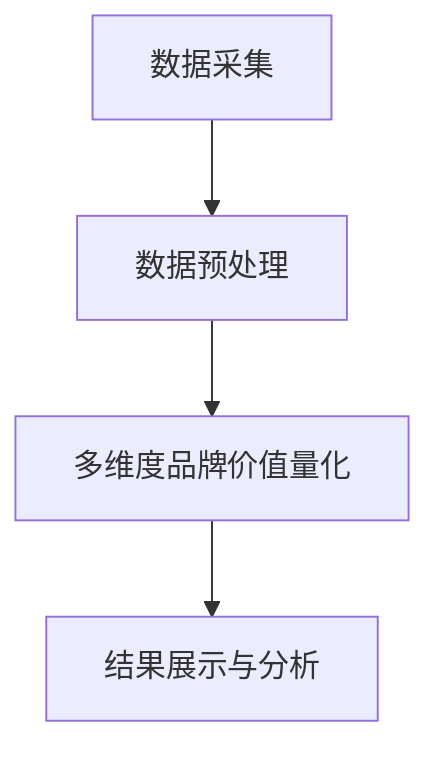

                 

# AI辅助企业品牌资产评估：多维度品牌价值量化与追踪系统

## 关键词：企业品牌资产评估、AI技术、品牌价值量化、追踪系统

## 摘要：
在数字化经济时代，企业品牌资产评估的重要性日益凸显。本文深入探讨了AI技术在企业品牌资产评估中的应用，通过多维度品牌价值量化方法和品牌价值追踪系统的设计，为企业提供了一种全新的品牌价值评估和监测工具。本文结构紧凑、逻辑清晰，旨在帮助读者理解AI辅助企业品牌资产评估的理论基础、方法体系以及实践应用。

----------------------------------------------------------------

## 第一部分：引言

### 1.1 书籍背景与主题

#### 1.1.1 企业品牌资产评估的重要性
品牌资产是企业核心竞争力的重要组成部分。它不仅代表了企业的市场地位，还蕴含了企业的无形价值。有效评估品牌资产，有助于企业制定战略决策、优化资源配置，提升市场竞争优势。

**品牌资产的概念与价值**：品牌资产是指企业通过品牌所积累的、能够带来未来经济利益的资源。它包括品牌知名度、品牌认知度、品牌忠诚度等要素。

**品牌资产评估的意义与作用**：品牌资产评估能够帮助企业识别品牌价值，衡量品牌贡献度，从而优化品牌战略，提升品牌价值。

#### 1.1.2 AI技术对品牌资产评估的影响
随着AI技术的飞速发展，其在各个领域的应用不断拓展，包括品牌资产评估。AI技术以其强大的数据分析、模式识别和智能决策能力，为品牌资产评估提供了全新的工具和方法。

**AI技术的概述与发展历程**：AI技术起源于20世纪50年代，经历了从符号主义到连接主义，再到现代的混合方法的发展历程。随着深度学习、强化学习等前沿技术的成熟，AI技术正迅速改变各个行业的面貌。

**AI辅助品牌资产评估的优势**：AI技术具有高效性、精确性和智能化等特点，能够快速、准确地评估品牌资产，为企业提供决策支持。

### 1.2 目标读者与阅读指南
本篇文章旨在为对AI技术有兴趣的企业管理者、品牌专家和IT从业者提供参考。文章将采用逻辑清晰、结构紧凑的方式，逐步介绍AI辅助企业品牌资产评估的理论基础、方法体系和实践应用。

**读者定位**：本篇文章适合对品牌管理和AI技术有一定了解的读者，特别是希望深入了解AI技术在品牌资产评估中应用的企业管理者和技术专家。

**阅读建议与结构**：建议读者按照文章的结构逐步阅读，以便系统地掌握AI辅助品牌资产评估的知识体系。文章分为四个主要部分：理论基础、多维度品牌价值量化方法、品牌价值追踪系统设计以及实践应用。

### 1.3 书籍结构安排
本文分为四个主要部分，各部分的核心内容如下：

- **第一部分**：引言。介绍企业品牌资产评估的重要性以及AI技术对品牌资产评估的影响。
- **第二部分**：AI辅助企业品牌资产评估的理论基础。阐述品牌资产评估的基本概念、AI技术在品牌资产评估中的应用以及品牌资产评估与AI技术的融合。
- **第三部分**：多维度品牌价值量化方法。介绍品牌价值量化的理论基础、多维度品牌价值量化的具体方法以及多维度品牌价值量化的综合应用。
- **第四部分**：品牌价值追踪系统设计。阐述品牌价值追踪系统的总体设计、数据采集与预处理以及系统架构和功能模块的设计。

本文将逐步深入探讨AI辅助企业品牌资产评估的理论基础、方法体系和实践应用，希望能为读者提供有价值的参考。

----------------------------------------------------------------

## 第二部分：AI辅助企业品牌资产评估的理论基础

### 2.1 品牌资产评估的基本概念

#### 2.1.1 品牌资产的定义
品牌资产是指企业通过品牌所积累的、能够带来未来经济利益的资源。它包括品牌知名度、品牌认知度、品牌忠诚度等要素。

- **品牌知名度**：消费者对企业品牌的认知程度，包括品牌知名度、品牌记忆度等。
- **品牌认知度**：消费者对品牌形象的认知程度，包括品牌个性、品牌情感等。
- **品牌忠诚度**：消费者对品牌的依赖程度，包括回购率、推荐度等。

#### 2.1.2 品牌资产的构成要素
品牌资产由多个构成要素组成，包括：

- **财务要素**：如品牌带来的销售收入、利润等。
- **市场要素**：如品牌的市场份额、品牌溢价等。
- **顾客要素**：如顾客的购买行为、顾客满意度等。
- **竞争要素**：如品牌的竞争优势、市场定位等。

#### 2.1.3 品牌资产评估的原则与方法

**品牌资产评估的原则**：
- **客观性原则**：评估过程应保持客观、公正，避免主观判断的影响。
- **全面性原则**：评估应涵盖品牌资产的各个构成要素，确保评估的全面性。
- **动态性原则**：品牌资产是一个动态变化的过程，评估应考虑品牌资产的变化趋势。

**品牌资产评估的方法**：

- **财务分析法**：通过财务数据，评估品牌对企业的经济贡献。
- **市场分析法**：通过市场数据，评估品牌的市场影响力和竞争力。
- **顾客分析法**：通过顾客行为和满意度，评估品牌在顾客心中的地位。
- **竞争分析法**：通过市场竞争态势，评估品牌的竞争优势。

**品牌资产评估的步骤与流程**：

- **评估准备**：明确评估目标、制定评估方案、收集相关数据。
- **评估实施**：对品牌资产进行定量和定性分析，形成评估报告。
- **评估结果分析**：根据评估结果，提出优化建议，为企业决策提供支持。

### 2.2 AI技术在品牌资产评估中的应用

#### 2.2.1 AI技术的概述
AI技术，即人工智能技术，是指使计算机系统具备类似人类智能的能力的技术。AI技术包括多个领域，如机器学习、深度学习、自然语言处理等。

- **机器学习**：通过算法让计算机从数据中自动学习和发现规律。
- **深度学习**：一种特殊的机器学习技术，通过多层神经网络模拟人类大脑的思考方式。
- **自然语言处理**：使计算机能够理解和处理人类自然语言的技术。

**AI技术的发展与应用**：

- **AI技术的起源与发展**：AI技术起源于20世纪50年代，随着计算能力的提升和算法的创新，AI技术得到了快速发展。
- **AI技术在各领域的应用**：AI技术广泛应用于医疗、金融、教育、制造等行业，极大地提高了行业效率和生产力。

#### 2.2.2 AI辅助品牌资产评估的优势

**数据分析与处理的强大能力**：
AI技术能够高效地处理和分析大量数据，快速识别品牌资产的关键因素，为评估提供精准的数据支持。

**模式识别与预测的精确性**：
AI技术通过机器学习和深度学习，能够从数据中发现潜在的模式和规律，对品牌资产进行精确预测和评估。

**智能决策与优化的高效性**：
AI技术能够基于评估结果，提供智能化的决策建议和优化方案，帮助企业优化品牌策略，提升品牌价值。

#### 2.2.3 AI在品牌资产评估中的关键应用

**数据挖掘与分析**：
AI技术通过对海量数据的挖掘和分析，识别品牌资产的关键因素，为评估提供数据支持。

**机器学习与预测模型**：
AI技术通过机器学习算法，构建预测模型，对品牌资产进行动态评估和预测。

**深度学习与图像识别**：
AI技术通过深度学习算法，实现图像识别和图像分析，用于品牌资产评估中的视觉数据解析。

#### 2.2.4 品牌资产评估与AI技术的融合

**品牌资产评估与AI技术的结合点**：
AI技术与品牌资产评估的结合点主要体现在数据收集与处理、模型建立与优化、结果分析与应用等方面。

- **数据收集与处理**：AI技术能够高效地收集和处理品牌资产相关的数据，为评估提供数据支持。
- **模型建立与优化**：AI技术能够基于大量数据，建立优化模型，提高评估的准确性。
- **结果分析与应用**：AI技术能够对评估结果进行深入分析，为企业提供智能化的决策建议。

**品牌资产评估与AI技术的挑战与机遇**：
AI技术在品牌资产评估中的应用面临以下挑战和机遇：

- **挑战**：数据质量与隐私保护、技术成熟度与适配性等。
- **机遇**：人机协同与智能化、新型评估方法的探索等。

#### 2.2.5 本章小结
本章介绍了品牌资产评估的基本概念、AI技术在品牌资产评估中的应用以及品牌资产评估与AI技术的融合。通过本章的介绍，读者可以了解品牌资产评估的重要性和AI技术在其中的应用，为后续章节的多维度品牌价值量化方法和品牌价值追踪系统设计提供理论基础。

在接下来的章节中，我们将进一步探讨多维度品牌价值量化方法的具体实施和品牌价值追踪系统的设计，帮助读者深入理解AI辅助企业品牌资产评估的实践应用。

----------------------------------------------------------------

## 第三部分：多维度品牌价值量化方法

### 3.1 品牌价值量化的理论基础

#### 3.1.1 品牌价值的内涵与外延
品牌价值是指品牌所具有的经济价值和潜在价值。它不仅反映了品牌的现有贡献，还预示了品牌未来的发展潜力。

**品牌价值的概念界定**：
品牌价值是指品牌在市场中的表现，包括品牌的市场影响力、品牌忠诚度、品牌溢价等因素。

**品牌价值的层次结构**：
品牌价值可以分为三个层次：

- **基础层**：包括品牌知名度、品牌认知度和品牌忠诚度等基础因素。
- **中间层**：包括品牌形象、品牌情感和品牌联想等中间因素。
- **高级层**：包括品牌的无形资产、市场地位和竞争优势等高级因素。

#### 3.1.2 品牌价值量化的意义与目标
品牌价值量化是将品牌价值转化为具体数值的过程，通过量化品牌价值，可以帮助企业更好地理解和管理品牌资产。

**品牌价值量化的意义**：
- **战略决策支持**：通过量化品牌价值，企业可以更加清晰地了解品牌资产的情况，为品牌战略的制定提供数据支持。
- **资源配置优化**：品牌价值量化可以帮助企业优化资源配置，将资源更多地投入到高价值品牌上。
- **品牌管理评估**：品牌价值量化可以用于品牌管理评估，衡量品牌管理的有效性和改进空间。

**品牌价值量化的目标**：
- **全面性**：量化应覆盖品牌价值的各个层次和维度，确保评估的全面性。
- **准确性**：量化应尽可能准确地反映品牌价值的实际情况，避免主观判断的影响。
- **实时性**：量化应具备实时性，能够及时捕捉品牌价值的变化，为决策提供最新的数据支持。

#### 3.1.3 品牌价值量化的一般模型与方法

**品牌价值量化的基本模型**：
品牌价值量化的一般模型包括以下几个部分：

1. **指标选择**：根据品牌价值的层次结构和评估目标，选择合适的指标。
2. **权重分配**：对选定的指标进行权重分配，确保评估的平衡性。
3. **计算模型**：构建计算模型，将指标值转换为品牌价值。

**品牌价值量化的方法分类**：
品牌价值量化的方法可以分为以下几类：

1. **财务分析法**：通过财务数据，评估品牌对企业的经济贡献。
2. **市场分析法**：通过市场数据，评估品牌的市场影响力和竞争力。
3. **顾客分析法**：通过顾客行为和满意度，评估品牌在顾客心中的地位。
4. **竞争分析法**：通过市场竞争态势，评估品牌的竞争优势。

**品牌价值量化的一般流程**：

1. **确定评估目标**：明确品牌价值量化的具体目标，为后续评估提供方向。
2. **选择评估指标**：根据评估目标，选择合适的评估指标。
3. **数据收集与处理**：收集与品牌价值相关的数据，并进行数据清洗和处理。
4. **权重分配**：对评估指标进行权重分配，确保评估的平衡性。
5. **计算模型构建**：构建计算模型，将指标值转换为品牌价值。
6. **结果分析与应用**：对量化结果进行分析，提出优化建议，为企业决策提供支持。

#### 3.1.4 本章小结
本章介绍了品牌价值量化的理论基础，包括品牌价值的内涵与外延、品牌价值量化的意义与目标以及品牌价值量化的一般模型与方法。通过本章的学习，读者可以了解品牌价值量化的基本概念和方法，为后续的多维度品牌价值量化方法和品牌价值追踪系统设计打下基础。

在接下来的章节中，我们将进一步探讨多维度品牌价值量化的具体方法，包括财务维度、市场维度、品牌认知维度和社会责任维度等，帮助读者深入理解如何量化品牌价值。

----------------------------------------------------------------

### 3.2 多维度品牌价值量化的具体方法

#### 3.2.1 财务维度品牌价值量化

**财务维度品牌价值量化的重要性**：
财务维度是品牌价值量化的重要组成部分，它直接反映了品牌对企业的经济贡献。通过财务维度品牌价值量化，企业可以了解品牌所带来的收入、利润等财务收益，从而制定更为有效的品牌战略。

**财务指标的选择与计算**：

- **收入**：品牌带来的销售收入是企业财务维度的核心指标。收入可以通过财务报表中的营业收入、净利润等数据进行量化。
- **利润**：品牌的利润贡献反映了品牌的市场竞争力和盈利能力。利润可以通过净利润、毛利率等财务指标进行量化。
- **现金流**：品牌所带来的现金流是企业持续发展的关键。现金流可以通过现金流量表中的经营活动现金流、投资活动现金流等数据进行量化。

**财务维度品牌价值的计算模型**：

1. **品牌收入贡献模型**：

   $$ 收入贡献 = (销售收入 - 成本费用) \times 品牌贡献率 $$

   其中，品牌贡献率是指品牌对企业整体收入的贡献比例。

2. **品牌利润贡献模型**：

   $$ 利润贡献 = (净利润 - 成本费用) \times 品牌贡献率 $$

   其中，品牌贡献率是指品牌对企业整体利润的贡献比例。

3. **品牌现金流贡献模型**：

   $$ 现金流贡献 = (经营活动现金流 - 投资活动现金流) \times 品牌贡献率 $$

   其中，品牌贡献率是指品牌对企业整体现金流的贡献比例。

**案例分析**：

假设一家企业的销售收入为1亿元，成本费用为0.5亿元，净利润为0.2亿元。如果品牌对该企业收入的贡献率为40%，利润的贡献率为30%，现金流的贡献率为20%，则该企业品牌的财务维度价值为：

1. **收入贡献**：

   $$ 收入贡献 = (1亿元 - 0.5亿元) \times 40\% = 0.2亿元 $$

2. **利润贡献**：

   $$ 利润贡献 = (0.2亿元 - 0.5亿元) \times 30\% = 0.06亿元 $$

3. **现金流贡献**：

   $$ 现金流贡献 = (0.2亿元 - 0.5亿元) \times 20\% = 0.02亿元 $$

综上，该企业品牌的财务维度价值为0.28亿元。

#### 3.2.2 市场维度品牌价值量化

**市场维度品牌价值量化的重要性**：
市场维度品牌价值量化反映了品牌在市场中的竞争力和影响力。通过市场维度品牌价值量化，企业可以了解品牌的市场占有率、品牌溢价等关键指标，从而制定更有针对性的市场策略。

**市场指标的选择与计算**：

- **市场份额**：品牌在市场中的占有率，可以通过销售额、销售量等数据进行量化。
- **品牌溢价**：品牌带来的价格溢价，可以通过比较同品类产品价格和品牌产品价格进行量化。
- **品牌认知度**：消费者对品牌的认知程度，可以通过市场调研、消费者满意度等数据进行量化。

**市场维度品牌价值的计算模型**：

1. **品牌市场份额模型**：

   $$ 市场份额 = 销售收入 \div 市场总规模 $$

   其中，市场总规模是指同品类产品的总销售额。

2. **品牌溢价模型**：

   $$ 品牌溢价 = (品牌产品价格 - 普通产品价格) \div 普通产品价格 $$

   其中，品牌产品价格和普通产品价格是指同品类产品的价格。

3. **品牌认知度模型**：

   $$ 品牌认知度 = (知道品牌的消费者数量 \div 总消费者数量) \times 100\% $$

   其中，知道品牌的消费者数量和总消费者数量是指市场调研的数据。

**案例分析**：

假设一家企业的销售收入为1000万元，市场总规模为5000万元。如果该企业的品牌产品价格为200元，普通产品价格为100元，消费者满意度调查结果显示知道品牌的消费者占总消费者数量的60%，则该企业品牌的市场维度价值为：

1. **市场份额**：

   $$ 市场份额 = 1000万元 \div 5000万元 = 20\% $$

2. **品牌溢价**：

   $$ 品牌溢价 = (200元 - 100元) \div 100元 = 100\% $$

3. **品牌认知度**：

   $$ 品牌认知度 = (60\% \div 100\%) \times 100\% = 60\% $$

综上，该企业品牌的市场维度价值为20%、100%和60%。

#### 3.2.3 品牌认知维度品牌价值量化

**品牌认知维度品牌价值量化的重要性**：
品牌认知维度反映了消费者对品牌的认知程度和品牌在消费者心中的地位。通过品牌认知维度品牌价值量化，企业可以了解品牌的知名度和认知度，从而优化品牌传播策略。

**品牌认知指标的选择与计算**：

- **品牌知名度**：消费者对品牌的认知程度，可以通过品牌曝光度、品牌提及量等数据进行量化。
- **品牌认知度**：消费者对品牌形象的认知程度，可以通过品牌情感、品牌联想等数据进行量化。
- **品牌忠诚度**：消费者对品牌的依赖程度，可以通过回购率、推荐度等数据进行量化。

**品牌认知维度品牌价值的计算模型**：

1. **品牌知名度模型**：

   $$ 品牌知名度 = (知道品牌的消费者数量 \div 总消费者数量) \times 100\% $$

   其中，知道品牌的消费者数量和总消费者数量是指市场调研的数据。

2. **品牌认知度模型**：

   $$ 品牌认知度 = (正面评价的消费者数量 \div 总消费者数量) \times 100\% $$

   其中，正面评价的消费者数量和总消费者数量是指市场调研的数据。

3. **品牌忠诚度模型**：

   $$ 品牌忠诚度 = (回购率 \div 平均回购率) \times 100\% $$

   其中，回购率和平均回购率是指消费者的回购行为数据。

**案例分析**：

假设一家企业的品牌知名度调查结果显示知道品牌的消费者占总消费者数量的70%，品牌认知度调查结果显示正面评价的消费者占总消费者数量的80%，回购率调查结果显示回购率是行业平均水平的2倍，则该企业品牌的认知维度价值为：

1. **品牌知名度**：

   $$ 品牌知名度 = (70\% \div 100\%) \times 100\% = 70\% $$

2. **品牌认知度**：

   $$ 品牌认知度 = (80\% \div 100\%) \times 100\% = 80\% $$

3. **品牌忠诚度**：

   $$ 品牌忠诚度 = (2 \div 1) \times 100\% = 200\% $$

综上，该企业品牌在认知维度上的价值为70%、80%和200%。

#### 3.2.4 社会责任维度品牌价值量化

**社会责任维度品牌价值量化的重要性**：
社会责任维度反映了企业在社会中的责任感和形象。通过社会责任维度品牌价值量化，企业可以了解其在社会责任方面的贡献和影响，从而提升企业的社会责任感和品牌形象。

**社会责任指标的选择与计算**：

- **环境责任**：企业在环境保护方面的投入和效果，可以通过环保措施、环保项目等数据进行量化。
- **社会贡献**：企业在社会公益、慈善等方面的投入和贡献，可以通过公益活动、慈善捐赠等数据进行量化。
- **员工福利**：企业在员工福利和培训方面的投入和效果，可以通过员工满意度、员工流失率等数据进行量化。

**社会责任维度品牌价值的计算模型**：

1. **环境责任模型**：

   $$ 环境责任价值 = 环保投入 \times 环保效益 $$

   其中，环保投入和环保效益是指企业在环保方面的投入和效果。

2. **社会贡献模型**：

   $$ 社会贡献价值 = 慈善捐赠 \times 社会影响力 $$

   其中，慈善捐赠和社会影响力是指企业在慈善公益方面的投入和效果。

3. **员工福利模型**：

   $$ 员工福利价值 = 员工满意度 \times 员工培训投入 $$

   其中，员工满意度和员工培训投入是指企业在员工福利和培训方面的投入和效果。

**案例分析**：

假设一家企业在环保方面的投入为100万元，环保效益为2倍；在慈善公益方面的捐赠为50万元，社会影响力为3倍；在员工福利和培训方面的投入为30万元，员工满意度为90%，则该企业在社会责任维度上的价值为：

1. **环境责任价值**：

   $$ 环境责任价值 = 100万元 \times 2 = 200万元 $$

2. **社会贡献价值**：

   $$ 社会贡献价值 = 50万元 \times 3 = 150万元 $$

3. **员工福利价值**：

   $$ 员工福利价值 = 30万元 \times 90\% = 27万元 $$

综上，该企业在社会责任维度上的总价值为477万元。

#### 3.2.5 多维度品牌价值量化的综合应用

**综合评价方法的选择与优化**：
在多维度品牌价值量化中，选择合适的综合评价方法至关重要。常用的综合评价方法包括层次分析法（AHP）、模糊综合评价法（FCE）和灰色关联度法（GRA）等。

1. **层次分析法（AHP）**：
   层次分析法通过构建层次模型，对指标进行权重分配，然后计算综合评价值。

2. **模糊综合评价法（FCE）**：
   模糊综合评价法通过模糊数学理论，对模糊性指标进行量化，然后计算综合评价值。

3. **灰色关联度法（GRA）**：
   灰色关联度法通过灰色系统理论，对变量进行关联度分析，然后计算综合评价值。

**综合评价方法的优化策略**：
为了提高综合评价方法的准确性，可以采取以下优化策略：

1. **数据质量优化**：
   提高数据质量，确保数据的准确性和可靠性。

2. **模型参数优化**：
   优化模型参数，如权重分配、阈值设定等，提高模型的拟合度。

3. **算法优化**：
   选择合适的算法，如遗传算法、粒子群算法等，提高模型的优化能力。

**多维度品牌价值量化的实践应用**：
多维度品牌价值量化在实际中的应用可以帮助企业了解品牌价值的全貌，从而制定更为精准的品牌战略。以下是一个企业品牌价值量化的实践应用案例：

1. **评估准备**：
   明确评估目标，制定评估方案，收集相关数据。

2. **评估实施**：
   对财务维度、市场维度、品牌认知维度和社会责任维度进行量化评估，构建综合评价模型。

3. **结果分析**：
   分析评估结果，识别品牌价值的优势和劣势，为品牌战略优化提供数据支持。

4. **优化建议**：
   根据评估结果，提出优化建议，如加强品牌宣传、提升品牌认知度、加大社会责任投入等。

#### 3.2.6 本章小结
本章介绍了多维度品牌价值量化的理论基础和具体方法，包括财务维度、市场维度、品牌认知维度和社会责任维度的品牌价值量化方法。通过本章的学习，读者可以了解如何从多个维度量化品牌价值，为企业制定品牌战略提供数据支持。

在接下来的章节中，我们将进一步探讨品牌价值追踪系统的设计和实现，帮助读者了解如何通过系统化的方法实时监测和评估品牌价值。

----------------------------------------------------------------

## 第四部分：品牌价值追踪系统设计

### 4.1 品牌价值追踪系统的总体设计

#### 4.1.1 系统设计的目标与原则

**系统设计的目标**：
品牌价值追踪系统的目标是实时监测和评估企业品牌价值，为企业提供科学、准确的品牌管理决策支持。

**系统设计的原则**：

1. **全面性**：系统应涵盖品牌价值的各个维度，确保评估的全面性。
2. **实时性**：系统应具备实时数据采集和处理能力，确保评估的实时性。
3. **准确性**：系统应采用科学、准确的量化方法，确保评估的准确性。
4. **可扩展性**：系统应具备良好的可扩展性，能够根据企业需求进行功能扩展和优化。

#### 4.1.2 系统的功能模块划分

**系统功能模块划分**：

1. **数据采集模块**：负责采集品牌价值相关的各类数据，包括财务数据、市场数据、顾客数据和竞争数据等。
2. **数据预处理模块**：负责对采集到的数据进行清洗、处理和标准化，确保数据质量。
3. **多维度品牌价值量化模块**：负责根据选定的量化方法，对品牌价值进行多维度量化评估。
4. **结果展示与分析模块**：负责将量化结果进行可视化展示，并提供深入的分析报告。

#### 4.1.3 系统架构设计

**系统架构的整体设计**：
品牌价值追踪系统采用分布式架构，包括数据采集层、数据处理层、量化评估层和结果展示层。

1. **数据采集层**：通过各类传感器和数据接口，实时采集品牌价值相关的数据。
2. **数据处理层**：对采集到的数据进行预处理，包括数据清洗、集成和标准化。
3. **量化评估层**：采用多维度量化方法，对品牌价值进行评估。
4. **结果展示层**：通过可视化工具和报表，将量化结果进行展示和报告。

**各模块之间的交互关系**：
各模块之间通过API进行交互，数据从数据采集层流向数据处理层，再流向量化评估层和结果展示层。各模块协同工作，实现品牌价值的实时监测和评估。

### 4.2 数据采集与预处理

#### 4.2.1 数据来源与类型

**数据来源**：
品牌价值追踪系统的数据来源包括内部数据和外部数据。

1. **内部数据**：包括企业的财务报表、销售数据、客户反馈等。
2. **外部数据**：包括市场调研数据、行业数据、社交媒体数据等。

**数据类型**：
品牌价值追踪系统涉及多种数据类型，包括结构化数据和非结构化数据。

1. **结构化数据**：如财务报表数据、销售数据等，通常以表格形式存储。
2. **非结构化数据**：如社交媒体数据、新闻报道等，通常以文本、图像、视频等形式存在。

#### 4.2.2 数据采集方法

**离线数据采集**：
离线数据采集是指通过定期导出企业内部系统中的数据，如ERP系统、CRM系统等。这种方法适合采集结构化数据，如财务报表、销售数据等。

**在线数据采集**：
在线数据采集是指通过实时监测和抓取企业外部数据，如社交媒体数据、行业数据等。这种方法适合采集非结构化数据，如新闻报道、社交媒体评论等。

**数据采集工具**：
常用的数据采集工具有爬虫工具（如Python的Scrapy）、数据库连接工具（如JDBC）和Web服务接口（如REST API）等。

#### 4.2.3 数据预处理技术

**数据清洗**：
数据清洗是数据预处理的重要环节，包括去除重复数据、填补缺失值、纠正错误数据等。数据清洗有助于提高数据质量，确保后续分析结果的准确性。

**数据集成**：
数据集成是将来自不同数据源的数据进行整合，形成一个统一的数据视图。数据集成有助于全面了解品牌价值，为量化评估提供全面的数据支持。

**数据标准化**：
数据标准化是将不同数据源的数据进行统一格式处理，如统一数据类型、统一时间格式等。数据标准化有助于提高数据分析的效率和准确性。

### 4.3 多维度品牌价值量化模块设计

#### 4.3.1 财务维度品牌价值量化模块

**财务维度品牌价值量化模块**负责根据选定的财务指标和方法，对品牌价值进行量化评估。具体包括以下步骤：

1. **指标选择**：根据企业财务数据，选择合适的财务指标，如收入、利润、现金流等。
2. **数据采集**：从企业内部系统和外部数据源中采集相关财务数据。
3. **数据处理**：对采集到的财务数据进行清洗、集成和标准化处理。
4. **量化评估**：根据选定的量化方法，对财务维度品牌价值进行计算和评估。
5. **结果展示**：将量化结果通过可视化工具和报表进行展示。

#### 4.3.2 市场维度品牌价值量化模块

**市场维度品牌价值量化模块**负责根据选定的市场指标和方法，对品牌价值进行量化评估。具体包括以下步骤：

1. **指标选择**：根据市场数据和品牌认知度，选择合适的市场指标，如市场份额、品牌溢价、品牌认知度等。
2. **数据采集**：从市场调研、行业报告、社交媒体等渠道采集相关市场数据。
3. **数据处理**：对采集到的市场数据进行清洗、集成和标准化处理。
4. **量化评估**：根据选定的量化方法，对市场维度品牌价值进行计算和评估。
5. **结果展示**：将量化结果通过可视化工具和报表进行展示。

#### 4.3.3 品牌认知维度品牌价值量化模块

**品牌认知维度品牌价值量化模块**负责根据选定的品牌认知指标和方法，对品牌价值进行量化评估。具体包括以下步骤：

1. **指标选择**：根据消费者行为和满意度调查，选择合适的品牌认知指标，如品牌知名度、品牌认知度、品牌忠诚度等。
2. **数据采集**：从消费者调研、社交媒体分析等渠道采集相关数据。
3. **数据处理**：对采集到的品牌认知数据进行清洗、集成和标准化处理。
4. **量化评估**：根据选定的量化方法，对品牌认知维度品牌价值进行计算和评估。
5. **结果展示**：将量化结果通过可视化工具和报表进行展示。

#### 4.3.4 社会责任维度品牌价值量化模块

**社会责任维度品牌价值量化模块**负责根据选定的社会责任指标和方法，对品牌价值进行量化评估。具体包括以下步骤：

1. **指标选择**：根据企业在环境保护、社会公益、员工福利等方面的表现，选择合适的社会责任指标，如环境责任、社会贡献、员工福利等。
2. **数据采集**：从企业内部系统和外部数据源中采集相关社会责任数据。
3. **数据处理**：对采集到的社会责任数据进行清洗、集成和标准化处理。
4. **量化评估**：根据选定的量化方法，对社会责任维度品牌价值进行计算和评估。
5. **结果展示**：将量化结果通过可视化工具和报表进行展示。

### 4.4 结果展示与分析模块设计

#### 4.4.1 结果展示模块设计

**结果展示模块**负责将量化结果以图表、报表等形式进行展示，使企业能够直观地了解品牌价值的各个方面。具体设计包括以下内容：

1. **可视化工具**：选择合适的可视化工具，如ECharts、D3.js等，以实现数据的图形化展示。
2. **报表生成**：生成各类报表，如品牌价值评估报告、财务分析报告、市场分析报告等。
3. **交互式展示**：提供交互式展示功能，如用户可以通过拖拽、筛选等方式查看具体数据。

#### 4.4.2 结果分析模块设计

**结果分析模块**负责对量化结果进行深入分析，为企业提供决策支持。具体设计包括以下内容：

1. **数据分析**：采用数据分析方法，如趋势分析、对比分析等，对量化结果进行深入分析。
2. **预测模型**：构建预测模型，预测品牌价值的未来趋势和变化。
3. **优化建议**：根据分析结果，提出品牌管理优化建议，如加强品牌宣传、提升顾客满意度、加大社会责任投入等。

### 4.5 本章小结
本章介绍了品牌价值追踪系统的总体设计，包括系统设计的目标与原则、功能模块划分、数据采集与预处理、多维度品牌价值量化模块设计以及结果展示与分析模块设计。通过本章的介绍，读者可以了解品牌价值追踪系统的设计思路和实现方法，为后续的品牌价值追踪系统实施提供理论基础。

在接下来的章节中，我们将进一步探讨品牌价值追踪系统的实现细节和实践应用，帮助读者深入理解品牌价值追踪系统的实际运作。

----------------------------------------------------------------

### 4.6 实践应用与系统实现

#### 4.6.1 系统实现的技术栈

**前端技术**：
- **React.js**：用于构建用户界面，实现数据的可视化展示。
- **ECharts**：用于实现数据的图表化展示，提供丰富的图表类型和交互功能。

**后端技术**：
- **Spring Boot**：用于构建RESTful API，处理数据请求和业务逻辑。
- **MySQL**：用于存储品牌价值量化数据和相关业务数据。

**数据处理与分析技术**：
- **Python**：用于数据处理和量化模型计算。
- **Scikit-learn**：用于构建和训练机器学习模型。
- **TensorFlow**：用于深度学习和图像识别。

#### 4.6.2 数据采集与处理

**数据采集**：
系统通过API接口与企业内部的ERP、CRM等系统进行数据对接，定期获取财务数据、销售数据等。同时，系统还通过爬虫技术采集市场数据、社交媒体数据等外部数据。

**数据处理**：
采集到的数据首先进行清洗，去除重复、缺失和错误的数据。然后进行数据集成和标准化处理，将不同来源和格式的数据进行统一格式处理，确保数据质量。

#### 4.6.3 多维度品牌价值量化

**财务维度品牌价值量化**：
- **收入贡献模型**：根据销售收入和成本费用计算品牌收入贡献。
- **利润贡献模型**：根据净利润和成本费用计算品牌利润贡献。
- **现金流贡献模型**：根据经营活动现金流和投资活动现金流计算品牌现金流贡献。

**市场维度品牌价值量化**：
- **市场份额模型**：根据销售收入和市场竞争规模计算市场份额。
- **品牌溢价模型**：根据品牌产品价格和普通产品价格计算品牌溢价。
- **品牌认知度模型**：根据消费者调查数据计算品牌认知度。

**品牌认知维度品牌价值量化**：
- **品牌知名度模型**：根据品牌提及量计算品牌知名度。
- **品牌认知度模型**：根据消费者满意度计算品牌认知度。
- **品牌忠诚度模型**：根据回购率计算品牌忠诚度。

**社会责任维度品牌价值量化**：
- **环境责任模型**：根据环保投入和环保效益计算环境责任价值。
- **社会贡献模型**：根据慈善捐赠和社会影响力计算社会贡献价值。
- **员工福利模型**：根据员工满意度和员工培训投入计算员工福利价值。

#### 4.6.4 结果展示与分析

**结果展示**：
系统通过ECharts将量化结果以图表形式展示，包括财务分析图表、市场分析图表、品牌认知分析图表和社会责任分析图表等。用户可以通过交互式操作查看具体数据和分析结果。

**结果分析**：
系统提供数据分析功能，包括趋势分析、对比分析等，帮助用户深入理解品牌价值的变化趋势和影响因素。同时，系统还提供预测功能，根据历史数据和现有趋势预测品牌价值的未来变化。

#### 4.6.5 实际案例分析与讲解

**案例背景**：
假设有一家大型消费品公司，希望通过品牌价值追踪系统了解其品牌价值的现状和未来趋势，从而制定相应的品牌管理策略。

**数据采集**：
系统从公司的ERP系统中获取了最近一年的财务数据，如销售收入、净利润等。同时，系统通过市场调研获取了品牌的市场份额、品牌溢价等数据。此外，系统还通过社交媒体监测和消费者调查获取了品牌认知度和忠诚度数据。

**数据处理**：
系统对采集到的数据进行清洗、集成和标准化处理，确保数据质量。

**品牌价值量化**：
系统根据选定的量化模型对财务维度、市场维度、品牌认知维度和社会责任维度的品牌价值进行了量化评估。

**结果展示与分析**：
系统通过图表和报表将量化结果展示给用户，并提供深入的分析报告。用户可以直观地了解品牌价值的各个方面，如财务价值、市场价值、品牌认知价值和社会责任价值等。

**预测与优化建议**：
系统根据历史数据和现有趋势，预测了品牌价值的未来变化，并提出优化建议，如加强品牌宣传、提升顾客满意度、加大社会责任投入等。

**案例小结**：
通过实际案例分析，品牌价值追踪系统为公司提供了全面的品牌价值评估和监测工具，帮助公司更好地理解和管理品牌资产，为品牌管理策略的制定提供了科学依据。

### 4.7 本章小结
本章通过实际案例分析和系统实现细节，详细介绍了品牌价值追踪系统的设计、数据采集与处理、多维度品牌价值量化、结果展示与分析等关键环节。通过本章的学习，读者可以了解品牌价值追踪系统的实际运作过程和实现方法，为后续的品牌价值追踪系统应用提供实践指导。

在接下来的章节中，我们将进一步探讨品牌价值追踪系统的应用效果、最佳实践和未来发展趋势，帮助读者深入理解品牌价值追踪系统的实际价值和潜力。

----------------------------------------------------------------

## 第五部分：品牌价值追踪系统的应用效果、最佳实践与未来发展趋势

### 5.1 应用效果

**品牌价值追踪系统**的应用效果主要体现在以下几个方面：

1. **提升品牌管理效率**：
   通过实时监测和量化品牌价值，企业可以及时了解品牌价值的变动情况，从而快速响应市场变化，优化品牌管理策略。

2. **科学决策支持**：
   品牌价值追踪系统提供的全面、准确的品牌价值评估数据，为企业制定品牌战略提供了科学依据，有助于做出更为明智的决策。

3. **优化品牌资源配置**：
   企业可以根据品牌价值评估结果，合理配置资源，优先支持高价值品牌，提升整体品牌价值。

4. **增强品牌竞争力**：
   通过品牌价值追踪系统，企业可以持续提升品牌价值，增强品牌的市场竞争力和品牌影响力。

### 5.2 最佳实践

**最佳实践**是企业在应用品牌价值追踪系统过程中总结出的一些成功经验和策略。以下是一些最佳实践：

1. **数据驱动决策**：
   企业应基于品牌价值追踪系统提供的数据，进行数据分析和决策，避免主观判断和情感因素的影响。

2. **持续优化评估模型**：
   企业应定期对品牌价值评估模型进行优化和调整，以适应市场环境和品牌发展的变化。

3. **跨部门协作**：
   品牌价值追踪系统涉及多个部门，如市场营销、财务、人力资源等。跨部门协作可以确保数据质量和评估结果的准确性。

4. **定期报告与反馈**：
   企业应定期生成品牌价值评估报告，并向高层管理层提供反馈，以便及时调整品牌管理策略。

### 5.3 小结

品牌价值追踪系统为企业提供了一个全面、科学、高效的工具，用于监测和量化品牌价值。通过本章的介绍，读者可以了解品牌价值追踪系统的应用效果、最佳实践和未来发展趋势。

### 5.4 未来发展趋势

**未来发展趋势**主要体现在以下几个方面：

1. **智能化与自动化**：
   随着AI技术的不断进步，品牌价值追踪系统的智能化和自动化程度将逐步提高，企业可以更加高效地进行品牌价值评估和管理。

2. **大数据分析**：
   随着大数据技术的普及，企业将能够收集和分析更多的品牌相关数据，从而提高品牌价值评估的精度和深度。

3. **实时监控与预测**：
   通过实时监控和预测技术，企业可以更快速地响应市场变化，预测品牌价值的未来趋势，提前采取应对措施。

4. **人机协同**：
   在未来，人机协同将成为品牌价值评估和管理的重要趋势。AI技术将辅助人类专家进行决策，提高评估的效率和准确性。

### 5.5 本章小结

品牌价值追踪系统在企业的品牌管理中发挥着重要作用，通过本章的介绍，读者可以了解品牌价值追踪系统的应用效果、最佳实践以及未来发展趋势。随着AI技术和大数据技术的不断进步，品牌价值追踪系统将为企业提供更加全面、科学、高效的品牌管理支持。

在未来的品牌管理中，企业应积极应用品牌价值追踪系统，结合最佳实践，不断提升品牌价值，增强品牌竞争力，实现可持续发展。

----------------------------------------------------------------

## 结语

在数字化经济的浪潮中，企业品牌资产评估的重要性愈发显著。AI技术的引入，为企业品牌资产评估提供了全新的视角和方法。本文从品牌资产评估的重要性、AI技术在其中的应用、多维度品牌价值量化方法以及品牌价值追踪系统设计等方面进行了深入探讨。

首先，我们阐述了品牌资产评估的概念、原则和流程，以及AI技术在品牌资产评估中的优势。接着，我们详细介绍了多维度品牌价值量化的方法，包括财务维度、市场维度、品牌认知维度和社会责任维度的量化模型。然后，我们设计了品牌价值追踪系统，从数据采集与预处理、多维度品牌价值量化模块、结果展示与分析模块等方面进行了系统化描述。

通过本文的介绍，我们希望读者能够：

1. **理解品牌资产评估的重要性**：品牌资产是企业核心竞争力的重要体现，有效的品牌资产评估有助于企业制定战略决策、优化资源配置。
2. **掌握AI技术在品牌资产评估中的应用**：AI技术以其高效性、精确性和智能化特点，为品牌资产评估提供了强有力的支持。
3. **了解多维度品牌价值量化的方法**：通过多维度品牌价值量化，企业可以全面、准确地评估品牌价值，为品牌管理提供科学依据。
4. **熟悉品牌价值追踪系统的设计**：品牌价值追踪系统为企业提供了一个实时、全面、高效的工具，用于监测和评估品牌价值。

未来，随着AI技术和大数据技术的不断进步，品牌价值追踪系统将变得更加智能化、自动化，为企业提供更加精准的品牌管理支持。我们期待读者能够结合本文的内容，进一步探索AI辅助品牌资产评估的实践应用，为企业的发展注入新的动力。

最后，感谢读者对本文的关注，我们期待与您共同探讨AI技术在品牌资产评估领域的更多可能性，为企业的数字化转型和品牌建设贡献力量。

**作者**：AI天才研究院/AI Genius Institute & 禅与计算机程序设计艺术 /Zen And The Art of Computer Programming

----------------------------------------------------------------

### 附录：核心概念、原理和模型

#### 1. 品牌资产的定义与构成

**核心概念**：品牌资产是指企业通过品牌所积累的、能够带来未来经济利益的资源。

**品牌资产的构成要素**：

- **品牌知名度**：消费者对企业品牌的认知程度。
- **品牌认知度**：消费者对品牌形象的认知程度。
- **品牌忠诚度**：消费者对品牌的依赖程度。

#### 2. AI技术在品牌资产评估中的应用

**核心概念**：AI技术是指使计算机系统具备类似人类智能的能力的技术。

**AI技术在品牌资产评估中的应用**：

- **数据分析与处理的强大能力**：AI技术能够高效地处理和分析大量数据，为品牌资产评估提供数据支持。
- **模式识别与预测的精确性**：AI技术能够从数据中发现潜在的模式和规律，对品牌资产进行精确预测和评估。
- **智能决策与优化的高效性**：AI技术能够基于评估结果，提供智能化的决策建议和优化方案，帮助企业优化品牌策略。

#### 3. 多维度品牌价值量化的方法

**财务维度品牌价值量化**：

- **品牌收入贡献模型**：

  $$ 收入贡献 = (销售收入 - 成本费用) \times 品牌贡献率 $$

- **品牌利润贡献模型**：

  $$ 利润贡献 = (净利润 - 成本费用) \times 品牌贡献率 $$

- **品牌现金流贡献模型**：

  $$ 现金流贡献 = (经营活动现金流 - 投资活动现金流) \times 品牌贡献率 $$

**市场维度品牌价值量化**：

- **品牌市场份额模型**：

  $$ 市场份额 = 销售收入 \div 市场总规模 $$

- **品牌溢价模型**：

  $$ 品牌溢价 = (品牌产品价格 - 普通产品价格) \div 普通产品价格 $$

- **品牌认知度模型**：

  $$ 品牌认知度 = (知道品牌的消费者数量 \div 总消费者数量) \times 100\% $$

**品牌认知维度品牌价值量化**：

- **品牌知名度模型**：

  $$ 品牌知名度 = (知道品牌的消费者数量 \div 总消费者数量) \times 100\% $$

- **品牌认知度模型**：

  $$ 品牌认知度 = (正面评价的消费者数量 \div 总消费者数量) \times 100\% $$

- **品牌忠诚度模型**：

  $$ 品牌忠诚度 = (回购率 \div 平均回购率) \times 100\% $$

**社会责任维度品牌价值量化**：

- **环境责任模型**：

  $$ 环境责任价值 = 环保投入 \times 环保效益 $$

- **社会贡献模型**：

  $$ 社会贡献价值 = 慈善捐赠 \times 社会影响力 $$

- **员工福利模型**：

  $$ 员工福利价值 = 员工满意度 \times 员工培训投入 $$

### 4. 品牌价值追踪系统设计

**系统架构设计**：

```
+------------------+       +------------------+       +------------------+
| 数据采集模块     |       | 数据预处理模块   |       | 多维度品牌价值量化模块 |
+------------------+       +------------------+       +------------------+
        ↑                              ↑                              ↑
        |                              |                              |
        |                              |                              |
        |                              |                              |
        +-----------------------------+-----------------------------+
                                           |
                                           |
                                           |
                                       +-----------------------------+
                                       | 结果展示与分析模块         |
                                       +-----------------------------+
```

**核心流程**：

1. **数据采集**：采集品牌相关的财务数据、市场数据、消费者数据和社会责任数据。
2. **数据预处理**：对采集到的数据清洗、集成和标准化。
3. **多维度品牌价值量化**：根据选定的量化模型，对品牌价值进行多维度量化评估。
4. **结果展示与分析**：将量化结果进行可视化展示和深入分析。

### 5. Mermaid流程图与ER实体关系图

**Mermaid流程图**：



**ER实体关系图**：

```mermaid
erDiagram
    Class1 ||--|{ Class2 }| Class3
    Class1 ||--|{ Class4 }| Class5
```

通过这些核心概念、原理和模型的介绍，读者可以更深入地理解AI辅助企业品牌资产评估的理论基础和实践应用。希望这些内容能为读者在相关领域的进一步学习和研究提供有益的参考。

