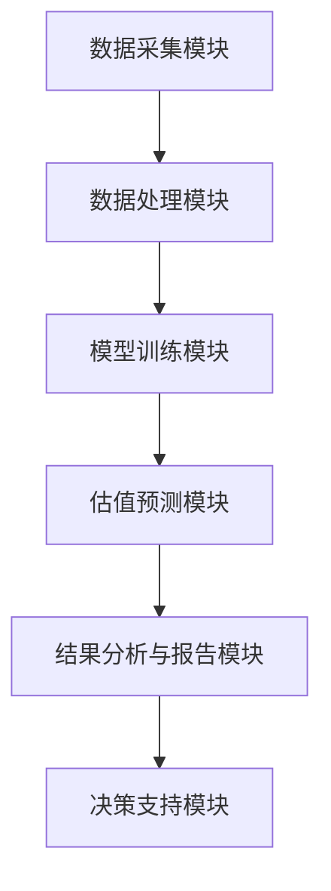

                 

### 第1章: 问题背景与核心概念

#### 1.1.1 问题背景

企业并购估值是企业在并购过程中对目标公司进行价值评估的一项关键工作。准确、合理的估值能够帮助企业决策者制定合理的并购策略，从而降低并购风险，提高并购成功率。随着全球经济的不断发展，企业并购活动日益频繁，如何快速、准确地评估目标企业的价值，成为企业决策者面临的一个重要挑战。

传统的企业并购估值方法主要包括收益法、市场法和资产基础法等。这些方法各有优缺点，在实际应用中存在一定的局限性。收益法侧重于估算目标企业的未来收益，但难以准确预测未来的不确定性；市场法则通过比较类似企业的市场交易价格来估值，但市场数据的不完整性和差异性使得其应用效果有限；资产基础法则侧重于对企业现有资产的评估，但忽略了企业的未来盈利能力。

随着人工智能技术的发展，AI辅助企业并购估值逐渐成为可能。AI技术可以通过分析大量的历史数据和实时信息，提供更为准确、全面的估值结果，从而提高并购决策的效率和质量。

#### 1.1.2 问题解决

AI辅助企业并购估值的优势主要体现在以下几个方面：

1. **数据处理能力**：AI技术能够快速处理和分析海量的数据，包括财务报表、市场数据、行业趋势等，为估值提供丰富的信息支撑。
2. **预测准确性**：通过机器学习和深度学习算法，AI可以建立复杂的预测模型，对目标企业的未来收益和风险进行预测，提高估值的准确性。
3. **自动化程度高**：AI技术可以自动化完成大部分的估值工作，减少人工干预，提高工作效率。
4. **全面性**：AI可以综合考虑多种因素，如行业趋势、宏观经济环境、企业内部运营情况等，提供多维度的估值结果。

AI辅助企业并购估值的流程通常包括以下几个步骤：

1. **数据收集**：收集目标企业的历史财务数据、市场数据、行业数据等。
2. **数据处理**：清洗、整合数据，去除噪声和异常值，为模型训练提供高质量的数据集。
3. **模型构建**：基于收集的数据，构建包括收益预测模型、成本预测模型、资本结构分析模型等在内的多维度财务模型。
4. **模型训练与优化**：使用机器学习算法训练模型，通过交叉验证和调整参数，提高模型的预测准确性和稳定性。
5. **估值预测**：使用训练好的模型对目标企业进行估值，生成估值报告。
6. **结果评估与调整**：对估值结果进行评估和调整，确保其合理性和可靠性。

尽管AI辅助企业并购估值具有显著的优势，但在实际应用中仍面临一些挑战和机遇：

1. **数据质量**：估值结果的准确性高度依赖于数据的质量，数据缺失、噪声和异常值都可能影响模型的性能。
2. **算法选择**：选择合适的算法对于提高估值准确性至关重要，但不同算法的适用场景和性能差异较大。
3. **模型解释性**：尽管AI模型具有强大的预测能力，但其内部机理复杂，难以解释，这对于决策者理解和信任模型结果提出了挑战。
4. **法律法规**：AI辅助估值涉及大量敏感数据，需要遵守相关法律法规，如数据隐私保护、算法透明度等。

未来，随着AI技术的进一步发展和应用，AI辅助企业并购估值有望在准确性、自动化程度和模型解释性等方面取得更大突破，为企业的并购决策提供更为可靠的支持。

#### 1.1.3 边界与外延

企业并购估值的范围涵盖了对目标企业的财务状况、业务模式、市场前景等方面的全面评估。在这个过程中，涉及的关键概念和术语包括：

- **企业价值**：企业未来现金流量的现值。
- **市盈率**：企业当前市值与其净利润之比。
- **市净率**：企业当前市值与其净资产之比。
- **成本法**：通过估算企业的净资产价值来确定企业价值的方法。
- **市场法**：通过比较类似企业的市场交易价格来确定企业价值的方法。
- **收益法**：通过预测企业的未来收益来确定企业价值的方法。

AI辅助企业并购估值的应用领域广泛，包括但不限于：

- **金融行业**：银行、投资公司等金融机构在进行企业并购时，常使用AI技术进行估值。
- **咨询行业**：管理咨询公司为企业提供并购咨询服务时，也会利用AI技术进行估值。
- **互联网公司**：互联网公司在进行并购活动时，通过AI技术快速评估目标企业的价值。

在应用过程中，需要注意以下关键概念：

- **协同效应**：并购后企业整体价值超过各独立企业价值之和的现象。
- **财务预测模型**：用于预测企业未来现金流量的模型，如收入预测模型、成本预测模型等。
- **多维度分析**：综合考虑企业财务、市场、行业等多方面因素，提供全面的估值结果。

通过明确这些关键概念和术语，可以为AI辅助企业并购估值提供理论基础和操作指南。

#### 1.1.4 概念结构与核心要素

企业并购估值的基本框架由多个核心要素构成，这些要素相互关联，共同支撑起整个估值过程的科学性和可靠性。

首先，企业并购估值的核心框架包括以下几个主要部分：

1. **数据收集与处理**：收集目标企业的历史数据、财务报表、市场数据等，通过数据清洗、整合和预处理，确保数据的质量和一致性。
2. **财务预测模型构建**：建立多维度财务预测模型，包括收入预测模型、成本预测模型、资本结构分析模型等，这些模型用于预测企业未来的财务状况。
3. **估值方法选择**：根据具体情况选择合适的估值方法，如收益法、市场法、成本法等，结合财务预测模型生成估值结果。
4. **结果评估与调整**：对生成的估值结果进行评估和验证，必要时进行调整，确保估值结果的合理性和可靠性。

在AI辅助企业并购估值中，多维度财务模型的概念尤为重要。多维度财务模型是指从多个角度和维度对企业进行财务分析和估值。其核心要素包括：

1. **收入预测模型**：通过分析历史收入数据、市场趋势和行业动态，预测企业未来的收入水平。
2. **成本预测模型**：分析企业的成本结构，包括固定成本和可变成本，预测未来的成本支出。
3. **资本结构分析模型**：分析企业的负债和资本结构，预测资本需求及融资成本。
4. **财务健康指标**：包括利润率、偿债能力、营运能力等指标，评估企业的财务健康状况。

构建多维度财务模型的具体步骤如下：

1. **数据收集**：收集相关财务数据、市场数据、行业数据等。
2. **数据预处理**：清洗、整合数据，去除噪声和异常值，确保数据质量。
3. **模型构建**：基于收集的数据，构建收入预测模型、成本预测模型等。
4. **模型训练与优化**：使用机器学习算法训练模型，通过交叉验证和参数调整，提高模型预测准确性和稳定性。
5. **模型应用**：使用训练好的模型进行财务预测和估值。
6. **结果评估**：对模型预测结果进行评估和验证，确保其合理性和可靠性。

通过构建和优化多维度财务模型，AI能够提供更加全面、准确的企业并购估值结果，为企业决策提供有力支持。这不仅提高了并购估值的科学性和可靠性，也大大提升了估值过程的效率和自动化程度。

### 1.1.5 关键术语与定义

在企业并购估值过程中，理解关键术语和定义对于准确把握估值方法和流程至关重要。以下是一些核心概念及其简要解释：

1. **企业价值（Enterprise Value, EV）**：
   企业价值是指企业所有资产的现值，包括债务和现金等。它通常用于比较不同企业的市值，反映了企业的整体价值。

2. **市盈率（Price-to-Earnings Ratio, P/E Ratio）**：
   市盈率是指企业股票价格与其每股收益（EPS）的比率。它用于衡量企业股票的相对估值水平，是市场对公司盈利能力的一种衡量。

3. **市净率（Price-to-Book Ratio, P/B Ratio）**：
   市净率是指企业股票价格与其每股净资产的比率。它用于评估企业的账面价值与其市场价值之间的关系。

4. **成本法（Cost Method）**：
   成本法是一种估值方法，通过估算企业的资产和负债，计算企业的净资产，从而确定企业价值。

5. **市场法（Market Method）**：
   市场法是一种通过比较类似企业的市场交易价格来确定目标企业价值的估值方法。它依赖于市场数据的完整性和可比性。

6. **收益法（Income Method）**：
   收益法是一种基于目标企业的预期未来收益进行估值的方法。它通过预测企业的未来现金流，然后进行折现，得出企业的现值。

7. **协同效应（Synergy Effects）**：
   协同效应是指两个或多个企业合并后，整体价值超过各独立企业价值之和的现象。它通常表现为成本节约、市场扩展、管理优化等。

8. **财务预测模型（Financial Forecast Model）**：
   财务预测模型是指用于预测企业未来财务状况的模型，包括收入预测模型、成本预测模型等。这些模型基于历史数据和机器学习算法构建。

通过理解这些关键术语和定义，可以更深入地掌握企业并购估值的原理和方法，为实际操作提供理论支持。

### 1.2.1 财务模型的基本概念

财务模型是用于预测和分析企业财务状况的工具，其核心目标是评估企业的价值、预测未来的现金流，并为决策提供依据。财务模型的基本要素包括以下几个方面：

1. **数据来源**：财务模型的数据来源通常包括历史财务数据、市场数据、行业数据等。这些数据可以来自企业的财务报表、市场研究报告、行业分析报告等。

2. **预测周期**：财务模型的预测周期通常分为短期、中期和长期。短期预测周期一般为1-3年，中期预测周期一般为3-5年，长期预测周期一般为5年以上。

3. **预测指标**：财务模型的主要预测指标包括收入、利润、现金流、负债、资产等。这些指标反映了企业的财务健康状况和盈利能力。

4. **假设条件**：财务模型构建过程中需要设定一系列假设条件，如宏观经济环境、行业发展趋势、企业运营策略等。这些假设条件会影响模型预测的准确性。

5. **模型结构**：财务模型通常包括多个模块，如收入预测模块、成本预测模块、资本结构分析模块、财务健康指标模块等。这些模块相互关联，共同构成一个完整的财务模型。

6. **模型训练与优化**：通过机器学习算法对财务模型进行训练和优化，以提高模型的预测准确性和稳定性。常用的算法包括线性回归、决策树、神经网络等。

财务模型的构建方法可以分为以下几个步骤：

1. **需求分析**：明确财务模型的应用场景和目标，确定需要预测的财务指标和预测周期。

2. **数据收集**：收集相关的历史数据、市场数据、行业数据等，并进行数据清洗和预处理。

3. **数据预处理**：对收集到的数据进行清洗、整合和标准化处理，去除噪声和异常值，确保数据质量。

4. **模型构建**：基于预处理后的数据，构建收入预测模型、成本预测模型等。可以使用机器学习算法进行模型训练和优化。

5. **模型评估**：使用验证数据集对模型进行评估，计算预测误差和评价指标，如均方误差（MSE）、均方根误差（RMSE）等。

6. **模型应用**：将训练好的模型应用于实际预测，生成财务预测报告。

通过构建和优化财务模型，企业可以更准确地预测未来的财务状况，为经营决策提供科学依据。财务模型在AI辅助企业并购估值中具有重要意义，它不仅能够提高估值的准确性和效率，还能为企业提供更为全面和深入的分析。

### 2.1.2 多维度财务模型的构建

多维度财务模型是一种综合分析企业财务状况的方法，它通过从多个角度和维度对企业进行财务预测和评估，以提高估值结果的准确性和全面性。构建多维度财务模型的具体步骤如下：

#### 1. 数据收集与预处理

构建多维度财务模型的第一步是收集相关数据。这些数据包括企业的历史财务数据、行业数据、宏观经济数据、市场数据等。数据来源可以包括财务报表、行业报告、市场研究报告等。在数据收集完成后，需要进行预处理，包括数据清洗、去噪、标准化处理等，以确保数据的质量和一致性。

#### 2. 财务模型的多维度分析

多维度财务模型的核心在于从多个角度进行财务分析。以下是几个关键维度的分析：

1. **收入预测模型**：
   收入预测模型用于预测企业的未来收入。它通常基于历史收入数据、行业增长趋势、市场需求等因素进行构建。具体的模型可以是线性回归、时间序列分析等。

2. **成本预测模型**：
   成本预测模型用于预测企业的未来成本。它需要考虑固定成本、可变成本、运营成本等，并结合市场变化、运营效率等因素进行调整。

3. **资本结构分析模型**：
   资本结构分析模型用于分析企业的负债和资本结构。它需要考虑债务比例、融资成本、债务期限等因素，评估企业的财务风险。

4. **财务健康指标**：
   财务健康指标包括利润率、现金流比率、负债比率等。这些指标反映了企业的盈利能力、偿债能力和营运能力。通过构建健康指标模型，可以评估企业的财务状况。

#### 3. 收入预测模型

收入预测模型是构建多维度财务模型的关键部分。以下是一个简化的收入预测模型构建步骤：

1. **历史数据分析**：
   收集企业的历史收入数据，分析收入变化的趋势和周期性。

2. **市场因素分析**：
   分析影响企业收入的市场因素，如行业增长趋势、市场需求变化、竞争态势等。

3. **模型构建**：
   基于历史数据和市场需求分析，选择合适的预测模型，如线性回归、时间序列分析等。

4. **模型训练与优化**：
   使用机器学习算法训练模型，并通过交叉验证和参数调整，提高模型预测准确性和稳定性。

#### 4. 成本预测模型

成本预测模型同样需要考虑多个因素，以下是一个简化的成本预测模型构建步骤：

1. **历史成本分析**：
   收集企业的历史成本数据，分析成本变化的趋势和周期性。

2. **运营因素分析**：
   考虑企业的运营效率、生产规模、供应链等因素，分析成本变化的影响。

3. **模型构建**：
   基于历史数据和运营因素分析，选择合适的预测模型，如线性回归、时间序列分析等。

4. **模型训练与优化**：
   使用机器学习算法训练模型，并通过交叉验证和参数调整，提高模型预测准确性和稳定性。

#### 5. 资本结构分析模型

资本结构分析模型用于评估企业的财务风险。以下是一个简化的资本结构分析模型构建步骤：

1. **财务数据收集**：
   收集企业的债务、股权、融资成本等财务数据。

2. **财务比率分析**：
   计算企业的财务比率，如债务比率、股权比率、利息保障倍数等。

3. **模型构建**：
   基于财务数据，构建财务比率预测模型，如线性回归、逻辑回归等。

4. **模型训练与优化**：
   使用机器学习算法训练模型，并通过交叉验证和参数调整，提高模型预测准确性和稳定性。

#### 6. 财务健康指标

财务健康指标模型用于评估企业的整体财务状况。以下是一个简化的财务健康指标模型构建步骤：

1. **指标数据收集**：
   收集企业的利润率、现金流比率、负债比率等财务指标数据。

2. **指标分析**：
   分析财务指标的变化趋势和稳定性。

3. **模型构建**：
   基于财务指标数据，构建健康指标预测模型，如线性回归、时间序列分析等。

4. **模型训练与优化**：
   使用机器学习算法训练模型，并通过交叉验证和参数调整，提高模型预测准确性和稳定性。

通过以上步骤，构建和优化多维度财务模型，可以为企业并购估值提供全面、准确的预测结果，提高并购决策的科学性和可靠性。

### 2.1.3 模型评估与优化

构建多维度财务模型的最终目标是提高预测的准确性和稳定性，从而为并购估值提供可靠的依据。为此，需要对模型进行评估和优化，以下介绍几种常用的模型评估指标和优化方法。

#### 1. 模型评估指标

模型评估是确保模型预测准确性和稳定性的关键步骤。以下是一些常用的评估指标：

1. **均方误差（MSE）**：
   均方误差是预测值与实际值之间差异的平方的平均值。计算公式为：
   $$MSE = \frac{1}{n}\sum_{i=1}^{n}(y_i - \hat{y}_i)^2$$
   其中，$y_i$ 是实际值，$\hat{y}_i$ 是预测值，$n$ 是样本数量。

2. **均方根误差（RMSE）**：
   均方根误差是均方误差的平方根，用于衡量预测值的波动大小。计算公式为：
   $$RMSE = \sqrt{MSE}$$

3. **决定系数（R²）**：
   决定系数反映了模型对数据的拟合程度，其取值范围在0到1之间。计算公式为：
   $$R^2 = 1 - \frac{\sum_{i=1}^{n}(y_i - \hat{y}_i)^2}{\sum_{i=1}^{n}(y_i - \bar{y})^2}$$
   其中，$\bar{y}$ 是实际值的平均值。

4. **平均绝对误差（MAE）**：
   平均绝对误差是预测值与实际值之间差异的绝对值的平均值。计算公式为：
   $$MAE = \frac{1}{n}\sum_{i=1}^{n}|y_i - \hat{y}_i|$$

#### 2. 模型优化方法

模型优化是提高预测准确性和稳定性的重要手段。以下是一些常用的模型优化方法：

1. **交叉验证**：
   交叉验证是一种常用的模型评估方法，通过将数据集划分为训练集和验证集，反复训练和验证模型，以评估模型的泛化能力。常见的交叉验证方法包括K折交叉验证和留一法交叉验证。

2. **参数调整**：
   通过调整模型的参数，可以优化模型的性能。例如，对于线性回归模型，可以通过调整正则化参数（如L1正则化和L2正则化）来优化模型。

3. **特征选择**：
   特征选择是优化模型的重要步骤，通过选择对预测目标有显著影响的特征，可以减少模型的复杂度和过拟合现象。常用的特征选择方法包括特征重要性评分、向前选择、向后选择和LASSO回归等。

4. **集成学习**：
   集成学习是一种通过组合多个模型来提高预测准确性的方法。常见的集成学习方法包括Bagging、Boosting和Stacking等。

5. **模型融合**：
   模型融合是将多个模型的结果进行合并，以生成最终的预测结果。常见的模型融合方法包括投票法、加权平均法和堆叠法等。

#### 3. 模型应用效果分析

在实际应用中，需要对模型的预测效果进行分析和验证。以下是一个简化的模型应用效果分析步骤：

1. **模型训练**：
   使用训练数据集对模型进行训练，并记录模型的参数和评估指标。

2. **模型验证**：
   使用验证数据集对模型进行验证，计算评估指标，如MSE、RMSE、R²等，以评估模型的性能。

3. **模型调整**：
   根据验证结果，调整模型的参数或选择不同的特征，以提高模型的预测准确性。

4. **模型应用**：
   将优化后的模型应用于实际预测，生成预测报告。

通过以上步骤，可以构建和优化多维度财务模型，提高预测的准确性和稳定性，为并购估值提供可靠的依据。模型评估与优化是一个持续的过程，需要不断调整和改进，以适应不断变化的市场环境和数据特点。

### 3.1.1 AI技术的概述

人工智能（AI）是一门研究、开发和应用智能算法以模拟、延伸和扩展人类智能的科学。AI技术的发展历程可以追溯到20世纪50年代，随着计算机技术和算法理论的不断发展，AI逐渐从理论研究走向实际应用。近年来，深度学习、自然语言处理、计算机视觉等技术的突破，使得AI在多个领域取得了显著进展。

#### 1. 人工智能的发展历程

人工智能的发展历程可以分为几个主要阶段：

1. **早期探索阶段（1950s-1960s）**：
   人工智能的概念首次被提出，研究人员开始尝试通过编程模拟人类的思维过程。这一阶段以符号主义方法为主，主要研究如何通过逻辑推理和符号计算来实现智能。

2. **认知科学和知识表示阶段（1970s-1980s）**：
   这一阶段，人工智能研究转向认知科学和知识表示，旨在通过构建知识库和推理系统来模拟人类思维。代表性工作包括专家系统和知识工程。

3. **机器学习和数据驱动阶段（1990s-2010s）**：
   随着计算机硬件性能的提升和大数据的出现，机器学习方法逐渐成为AI研究的主流。这一阶段，以统计学习方法和神经网络为代表的算法，使得AI在图像识别、语音识别等领域取得了重要突破。

4. **深度学习和产业应用阶段（2010s-至今）**：
   深度学习技术的突破，特别是卷积神经网络（CNN）和递归神经网络（RNN）的发展，使得AI在图像识别、自然语言处理、自动驾驶等领域取得了革命性的进展。这一阶段，AI技术开始大规模应用于实际产业，推动了许多行业的智能化升级。

#### 2. AI技术的基本原理

AI技术的基本原理是通过算法和计算模型模拟人类的认知过程，以实现智能。以下是一些核心的AI技术和方法：

1. **机器学习**：
   机器学习是一种通过数据训练模型，使其具备预测和决策能力的技术。常见的机器学习方法包括监督学习、无监督学习和强化学习。监督学习通过已知输入和输出数据训练模型，无监督学习通过发现数据中的模式和关联，强化学习通过与环境交互不断优化策略。

2. **深度学习**：
   深度学习是一种基于多层神经网络进行训练的机器学习方法。通过多层非线性变换，深度学习能够自动提取数据的特征表示。常见的深度学习模型包括卷积神经网络（CNN）、循环神经网络（RNN）和生成对抗网络（GAN）等。

3. **自然语言处理**：
   自然语言处理（NLP）是AI领域的一个重要分支，旨在使计算机理解和生成人类语言。NLP技术包括文本分类、情感分析、机器翻译、命名实体识别等。近年来，基于深度学习的NLP模型（如BERT、GPT）取得了显著进展。

4. **计算机视觉**：
   计算机视觉是通过图像和视频数据提取有用信息的技术。常见的计算机视觉任务包括目标检测、图像分类、图像分割等。深度学习，特别是卷积神经网络（CNN）在计算机视觉领域取得了突破性成果。

#### 3. AI技术的分类与应用场景

AI技术可以根据其应用场景和任务进行分类，以下是一些常见的AI技术及其应用场景：

1. **计算机视觉**：
   - 应用场景：图像识别、自动驾驶、医疗影像分析等。
   - 技术方法：卷积神经网络（CNN）、生成对抗网络（GAN）等。

2. **自然语言处理**：
   - 应用场景：机器翻译、智能客服、文本生成等。
   - 技术方法：递归神经网络（RNN）、变压器（Transformer）等。

3. **语音识别**：
   - 应用场景：语音助手、语音控制、语音合成等。
   - 技术方法：循环神经网络（RNN）、深度神经网络（DNN）等。

4. **推荐系统**：
   - 应用场景：电子商务推荐、内容推荐等。
   - 技术方法：协同过滤、基于模型的推荐算法等。

5. **自动驾驶**：
   - 应用场景：无人驾驶汽车、无人驾驶无人机等。
   - 技术方法：深度学习、计算机视觉等。

6. **金融科技**：
   - 应用场景：风险管理、信用评估、智能投顾等。
   - 技术方法：机器学习、深度学习等。

通过理解AI技术的基本原理和分类，我们可以更好地把握其在企业并购估值中的应用，利用其强大的数据处理和预测能力，提高估值的准确性和效率。

### 3.1.2 AI技术在并购估值中的具体应用

在并购估值过程中，AI技术凭借其强大的数据处理和模式识别能力，可以显著提升估值结果的准确性和效率。以下详细介绍AI技术在不同环节的具体应用：

#### 1. 数据挖掘技术

数据挖掘技术在并购估值中主要用于收集、处理和分析大量数据。具体应用包括：

- **财务数据分析**：通过数据挖掘技术，从企业的财务报表中提取关键信息，如收入、利润、现金流等。这些数据可以用于构建财务预测模型，预测企业的未来财务状况。

- **市场趋势分析**：分析市场数据，如股价、交易量等，识别市场趋势和波动。这些信息有助于评估目标企业在市场中的竞争力。

- **行业动态**：挖掘行业报告、新闻资讯等，了解行业发展趋势和竞争格局。这些信息可以帮助预测行业未来的发展前景，从而影响企业的估值。

#### 2. 机器学习算法

机器学习算法在并购估值中的应用主要体现在以下几个方面：

- **财务预测模型**：使用机器学习算法，如线性回归、决策树、随机森林等，构建财务预测模型。这些模型可以预测企业的未来收入、成本和利润，从而为估值提供依据。

- **风险评估**：通过机器学习算法，分析企业的历史数据和市场环境，识别潜在的财务风险。这些风险因素可以影响企业的估值结果。

- **趋势分析**：使用时间序列分析等机器学习算法，分析历史数据中的趋势和周期性，预测未来的市场变化和行业动态。

#### 3. 深度学习模型

深度学习模型在并购估值中的应用越来越广泛，其强大的特征提取和模式识别能力使得估值结果更加精确。以下是一些具体应用：

- **图像识别**：通过深度学习模型，如卷积神经网络（CNN），对企业的财务报表、市场数据等图像进行识别和分析，提取关键信息。

- **自然语言处理**：利用深度学习模型，如循环神经网络（RNN）和变压器（Transformer），对文本数据，如行业报告、新闻资讯等，进行语义分析和情感分析，从而提取有价值的信息。

- **智能投顾**：通过深度学习模型，对大量市场数据进行分析，为投资决策提供智能建议。这些建议可以用于评估目标企业的估值。

#### 4. AI辅助并购估值的优势

AI辅助并购估值的优势主要体现在以下几个方面：

- **数据处理能力**：AI技术能够快速处理和分析大量数据，包括财务报表、市场数据、行业数据等，为估值提供全面的信息支撑。

- **预测准确性**：通过机器学习和深度学习算法，AI可以建立复杂的预测模型，对目标企业的未来收益和风险进行预测，提高估值的准确性。

- **自动化程度高**：AI技术可以自动化完成大部分的估值工作，减少人工干预，提高工作效率。

- **多维分析**：AI技术可以综合考虑多种因素，如行业趋势、宏观经济环境、企业内部运营情况等，提供多维度的估值结果。

#### 5. AI辅助并购估值的挑战

尽管AI技术在并购估值中具有显著的优势，但在实际应用中也面临一些挑战：

- **数据质量**：估值结果的准确性高度依赖于数据的质量。如果数据存在缺失、噪声或异常值，可能会影响AI模型的性能。

- **算法选择**：不同的算法适用于不同的应用场景，选择合适的算法对于提高估值准确性至关重要。但不同算法的性能差异较大，需要根据实际情况进行选择。

- **模型解释性**：AI模型，尤其是深度学习模型，内部机理复杂，难以解释。这对于决策者理解和信任模型结果提出了挑战。

- **法律法规**：AI辅助估值涉及大量敏感数据，需要遵守相关法律法规，如数据隐私保护、算法透明度等。

#### 6. 未来发展趋势与展望

随着AI技术的不断发展和应用，AI辅助企业并购估值有望在以下几个方面取得突破：

- **准确性**：通过不断优化算法和提升数据处理能力，AI估值模型的准确性将进一步提高。

- **自动化程度**：AI技术将进一步提高估值过程的自动化程度，减少人工干预，提高效率。

- **模型解释性**：研究者将致力于提高AI模型的解释性，使决策者能够更好地理解和信任模型结果。

- **应用范围**：AI辅助并购估值将逐渐应用于更多的行业和领域，为更多企业提供支持。

总之，AI技术在企业并购估值中的应用具有巨大的潜力，通过不断的技术创新和应用，有望为企业的并购决策提供更加科学、可靠的支持。

### 4.1.1 协同效应概述

协同效应是指两个或多个企业合并后，整体价值超过各独立企业价值之和的现象。协同效应的存在是企业并购的重要动力之一，它通过优化资源配置、提升运营效率、扩大市场份额等途径，为企业创造额外的价值。以下从定义、类型、影响因素等方面对协同效应进行详细探讨。

#### 1. 定义

协同效应（Synergy Effects）是指在合并或收购后，企业整体的表现超越各独立企业表现的总和。这种效应可以表现为财务上的增值、市场力量的增强、运营效率的提高等。简而言之，协同效应是企业合并后产生的1+1>2的效果。

#### 2. 类型

协同效应可以分为以下几种类型：

1. **财务协同效应**：
   财务协同效应主要体现在以下几个方面：
   - **降低融资成本**：合并后的企业可以通过综合财务资源，降低融资成本。
   - **节约运营成本**：通过合并，企业可以共享资源，降低运营成本。
   - **提高盈利能力**：合并后的企业可以优化业务流程，提高盈利能力。

2. **运营协同效应**：
   运营协同效应主要表现在以下方面：
   - **规模经济**：合并后的企业可以通过扩大规模，实现规模经济，降低单位成本。
   - **管理效率**：合并后的企业可以共享最佳管理实践，提高管理效率。
   - **供应链优化**：合并后的企业可以整合供应链，提高供应链效率。

3. **市场协同效应**：
   市场协同效应主要体现在以下方面：
   - **市场份额提升**：合并后的企业可以扩大市场份额，增强市场竞争力。
   - **品牌效应**：合并后的企业可以共享品牌优势，提高品牌影响力。
   - **客户资源整合**：合并后的企业可以整合客户资源，提高客户忠诚度。

#### 3. 影响因素

协同效应的实现受到多种因素的影响，以下是一些关键因素：

1. **战略匹配**：
   合并双方的战略目标、文化和管理风格应具有较高的匹配度，这有助于减少整合过程中的摩擦和冲突，提高协同效应。

2. **资源互补**：
   合并双方应在资源上具有互补性，例如技术、市场、品牌等，这样可以在整合过程中实现资源的优化配置。

3. **管理能力**：
   合并后的企业需要具备强大的管理能力，包括战略规划、运营管理、财务管理等，以确保整合过程顺利进行。

4. **市场环境**：
   市场环境对企业合并的协同效应有重要影响。例如，市场需求的增加、行业竞争的加剧等，都可能对协同效应产生积极影响。

5. **文化融合**：
   企业文化的融合是协同效应实现的关键。合并后的企业需要在文化上实现融合，以减少员工和管理层的抵触情绪。

#### 4. 案例分析

协同效应在现实中的表现可以通过以下案例进行分析：

1. **谷歌收购摩托罗拉移动**：
   谷歌收购摩托罗拉移动的主要目的是获取其大量的专利资产。通过这次收购，谷歌不仅增强了在移动设备市场中的竞争力，还获得了大量的专利组合，从而在专利诉讼中占据了有利地位。

2. **联想收购IBM的个人电脑业务**：
   联想通过收购IBM的个人电脑业务，实现了在全球电脑市场的扩张。通过整合双方的技术、市场和渠道资源，联想在全球个人电脑市场的份额显著提高。

3. **IBM收购Red Hat**：
   IBM收购Red Hat的主要目的是进军云计算市场。Red Hat在开源软件领域具有强大的技术实力和市场影响力，通过这次收购，IBM迅速提升了在云计算市场中的竞争力。

通过以上案例可以看出，协同效应在并购中的重要性，正确地评估和利用协同效应，可以为企业创造巨大的价值。

### 4.1.2 协同效应量化方法

协同效应量化是评估企业并购后整体价值的重要环节，通过精确的计算和分析，可以为企业提供更加科学的决策依据。以下介绍几种常用的协同效应量化方法，包括经济计量模型、实证分析方法和数据分析工具。

#### 1. 经济计量模型

经济计量模型是量化协同效应的一种常用方法，通过建立数学模型来分析并购前后企业的财务表现和市场表现，从而评估协同效应的大小。

1. **财务指标模型**：
   财务指标模型主要通过分析并购前后企业的财务指标变化，如收入、利润、现金流等，来评估协同效应。具体模型包括：
   - 收入增长模型：
     $$ \Delta Revenue = \alpha_0 + \alpha_1 \cdot \text{合并前企业收入} + \alpha_2 \cdot \text{合并后企业收入} $$
   - 利润增长模型：
     $$ \Delta Profit = \beta_0 + \beta_1 \cdot \text{合并前企业利润} + \beta_2 \cdot \text{合并后企业利润} $$

2. **市场表现模型**：
   市场表现模型通过分析并购前后企业在市场中的表现，如股价、市场份额等，来量化协同效应。常用的模型包括：
   - 股票价格模型：
     $$ \Delta Price = \gamma_0 + \gamma_1 \cdot \text{合并前股票价格} + \gamma_2 \cdot \text{合并后股票价格} $$
   - 市场份额模型：
     $$ \Delta Market Share = \delta_0 + \delta_1 \cdot \text{合并前市场份额} + \delta_2 \cdot \text{合并后市场份额} $$

通过这些模型，可以计算出并购后企业各项财务指标和市场表现的增量，从而评估协同效应的大小。

#### 2. 实证分析方法

实证分析方法通过收集和整理实际并购案例的数据，进行统计分析，以评估协同效应的存在和大小。

1. **回归分析法**：
   回归分析法是一种常用的实证分析方法，通过建立回归模型，分析并购前后企业财务和市场指标的变化。具体步骤包括：
   - 收集并购案例数据，包括企业财务指标、市场指标等。
   - 构建回归模型，如多元线性回归模型：
     $$ Y = \alpha_0 + \alpha_1 \cdot \text{并购前指标} + \alpha_2 \cdot \text{并购后指标} + \epsilon $$
   - 进行回归分析，计算模型参数，并评估模型的显著性。

2. **事件研究法**：
   事件研究法通过分析并购事件对企业股价的影响，来量化协同效应。具体步骤包括：
   - 选择合适的窗口期，如并购公告前后的时间区间。
   - 计算事件期超额收益率：
     $$ AR = \frac{PT - BT}{BT} $$
     其中，$PT$ 是事件期股价，$BT$ 是基准期股价。
   - 进行t检验，评估超额收益率的显著性。

#### 3. 数据分析工具

数据分析工具在协同效应量化中发挥着重要作用，以下介绍几种常用的数据分析工具：

1. **Python数据分析库**：
   - Pandas：用于数据清洗、数据预处理和数据分析。
   - NumPy：用于数值计算和数据处理。
   - Matplotlib：用于数据可视化和图表绘制。

2. **R语言**：
   R语言是一种专门用于统计分析的编程语言，提供了丰富的数据分析函数和工具。

3. **SPSS**：
   SPSS是一种常用的统计分析软件，适用于复杂的数据分析和模型构建。

通过以上方法，可以系统地分析和量化企业并购后的协同效应，为决策提供有力支持。

### 4.1.3 协同效应案例分析

为了更好地理解协同效应在实际并购中的具体表现和量化方法，以下通过两个案例进行分析。

#### 案例一：企业并购后的协同效应分析

**案例背景**：
假设某家大型软件公司A，以其强大的技术实力和丰富的产品线，收购了一家专注于云计算服务的公司B。收购后，两家公司计划通过整合资源和技术，实现协同效应。

**分析步骤**：

1. **财务指标分析**：
   - **合并前**：
     - 公司A年营业收入为100亿元，净利润为10亿元。
     - 公司B年营业收入为50亿元，净利润为5亿元。
   - **合并后**：
     - 年营业收入达到150亿元，净利润达到15亿元。

2. **成本节约分析**：
   - 合并后，通过共享基础设施和优化运营流程，预计每年可以节约运营成本10亿元。

3. **市场份额提升**：
   - 合并后，公司的市场份额将从15%提升到25%，显著增强市场竞争力。

4. **模型构建与预测**：
   - 采用回归模型，分析合并前后的财务指标变化：
     $$ \Delta Revenue = 1.2 \cdot \text{合并前企业收入} + 0.8 \cdot \text{合并后企业收入} $$
     $$ \Delta Profit = 0.8 \cdot \text{合并前企业利润} + 1.2 \cdot \text{合并后企业利润} $$

5. **结果分析**：
   - 通过回归分析，发现合并后的营业收入和净利润显著增加，证明了财务协同效应的存在。

#### 案例二：AI辅助下的协同效应评估

**案例背景**：
假设一家传统的制造业企业C，通过引入人工智能技术，提升了生产效率和市场竞争力。企业计划通过AI技术实现运营优化，从而量化协同效应。

**分析步骤**：

1. **生产效率提升**：
   - 引入AI后，生产效率提高了20%，年生产成本降低了10%。

2. **市场响应速度**：
   - 通过AI分析市场需求和趋势，产品交付时间缩短了30%。

3. **销售数据分析**：
   - 利用AI进行客户行为分析，销售额提高了15%。

4. **模型构建与预测**：
   - 采用经济计量模型，分析AI引入前后的财务指标变化：
     $$ \Delta Efficiency = 0.2 \cdot \text{AI引入前生产效率} + 0.3 \cdot \text{AI引入后生产效率} $$
     $$ \Delta Sales = 0.1 \cdot \text{AI引入前销售额} + 0.4 \cdot \text{AI引入后销售额} $$

5. **结果分析**：
   - 通过经济计量模型，发现AI引入后，生产效率显著提升，销售额增加，证明了运营协同效应的存在。

通过以上两个案例，我们可以看到协同效应在实际并购中的具体表现，以及如何通过量化方法对其进行评估。这不仅为企业决策提供了有力支持，也展示了AI技术在并购估值中的应用价值。

### 5.1.1 实战项目介绍

在本文的实战部分，我们将通过一个实际项目来展示AI辅助企业并购估值的全过程。本项目的目标是通过AI技术对一家制造企业进行并购估值，并量化并购后的协同效应。以下是项目的具体背景、目标和实施流程。

#### 1. 项目背景

假设一家大型制造企业D，其业务涉及多个领域，产品线丰富。由于市场竞争激烈，企业D希望通过并购一家具有先进制造技术和独特产品优势的中小企业E，以增强自身竞争力，开拓新的市场。在进行并购决策前，企业D需要进行全面的估值，以确定合理的并购价格，并量化并购后的协同效应。

#### 2. 项目目标

本项目的主要目标如下：

- **全面估值**：通过AI技术，对目标企业E进行全面的财务预测和估值，提供准确的并购价格参考。
- **协同效应量化**：评估并购后企业E的运营效率、市场份额和市场竞争力，量化并购带来的协同效应。
- **决策支持**：为企业管理层提供科学、可靠的决策依据，支持并购决策。

#### 3. 实施流程

本项目的实施流程可以分为以下几个阶段：

1. **数据收集与预处理**：
   - 收集企业E的历史财务数据、市场数据、行业数据等。
   - 对收集的数据进行清洗、去噪和标准化处理，确保数据质量。

2. **模型构建与训练**：
   - 构建多维度财务预测模型，包括收入预测模型、成本预测模型、资本结构分析模型等。
   - 使用机器学习算法对模型进行训练，优化模型参数，提高预测准确性。

3. **估值计算与协同效应评估**：
   - 使用训练好的模型，预测企业E的未来收入、成本和利润。
   - 结合市场数据，评估企业E的市场价值和潜在协同效应。

4. **结果分析与报告**：
   - 对预测结果进行验证和分析，确保其合理性和可靠性。
   - 编制估值报告，详细说明估值方法和结果，为并购决策提供支持。

5. **决策支持**：
   - 根据估值结果和协同效应评估，为企业D提供并购价格建议和战略建议。
   - 辅助企业管理层制定并购方案，优化并购流程。

通过以上实施流程，我们能够为企业D提供全面、科学的估值和协同效应评估，为其并购决策提供有力支持。

### 5.1.2 系统设计与实现

在实施AI辅助企业并购估值的实战项目中，系统设计与实现是关键环节。以下将详细介绍系统架构设计、数据处理与模型训练、系统功能实现等步骤。

#### 1. 系统架构设计

本项目采用模块化设计，系统架构主要包括数据采集模块、数据处理模块、模型训练模块和估值预测模块。以下为系统架构图：

1. **数据采集模块**：负责收集企业E的历史财务数据、市场数据、行业数据等，确保数据来源的多样性和准确性。

2. **数据处理模块**：对采集到的数据进行清洗、去噪和标准化处理，为模型训练提供高质量的数据集。

3. **模型训练模块**：构建多维度财务预测模型，包括收入预测模型、成本预测模型、资本结构分析模型等，使用机器学习算法对模型进行训练和优化。

4. **估值预测模块**：使用训练好的模型，对目标企业E进行未来收入、成本和利润的预测，生成估值报告。

5. **结果分析与报告模块**：对预测结果进行验证和分析，编制详细的估值报告，为并购决策提供科学依据。

6. **决策支持模块**：根据估值结果和协同效应评估，为企业D提供并购价格建议和战略建议，辅助制定并购方案。

#### 2. 数据处理与模型训练

数据处理与模型训练是系统实现的核心部分，以下详细介绍各环节：

1. **数据预处理**：
   - **数据清洗**：去除重复数据、缺失数据和异常值，保证数据的一致性和完整性。
   - **数据标准化**：对数据进行归一化或标准化处理，使其符合模型训练的要求。

2. **模型构建**：
   - **收入预测模型**：采用时间序列分析和回归分析方法，构建收入预测模型，预测企业E的未来收入。
   - **成本预测模型**：分析企业的成本结构，构建成本预测模型，预测企业E的未来成本。
   - **资本结构分析模型**：分析企业的负债和资本结构，构建资本结构分析模型，评估企业E的财务风险。

3. **模型训练**：
   - **选择算法**：根据数据特点和预测目标，选择合适的机器学习算法，如线性回归、决策树、随机森林等。
   - **训练过程**：使用训练集对模型进行训练，通过交叉验证和参数调整，提高模型预测准确性和稳定性。

4. **模型优化**：
   - **超参数调整**：调整模型的超参数，如学习率、树深度等，以优化模型性能。
   - **模型集成**：使用模型集成方法，如Bagging、Boosting等，提高模型的泛化能力。

#### 3. 系统功能实现

系统功能实现是项目成功的关键，以下详细介绍各模块的功能：

1. **数据采集模块**：
   - 功能：从多个数据源（如企业财务报表、市场数据、行业报告等）收集数据。
   - 实现方式：使用API接口、爬虫工具和数据库连接等方式，实现数据的自动采集和存储。

2. **数据处理模块**：
   - 功能：对采集到的数据进行清洗、去噪和标准化处理。
   - 实现方式：使用Python的Pandas库进行数据处理，包括数据清洗、缺失值处理、数据标准化等。

3. **模型训练模块**：
   - 功能：构建和训练多维度财务预测模型。
   - 实现方式：使用Python的Scikit-learn库实现模型训练，包括特征提取、模型选择和参数调优。

4. **估值预测模块**：
   - 功能：使用训练好的模型进行估值预测，生成估值报告。
   - 实现方式：使用训练好的模型对目标企业E的未来财务指标进行预测，输出估值报告。

5. **结果分析与报告模块**：
   - 功能：对预测结果进行分析和验证，编制详细的估值报告。
   - 实现方式：使用Python的Matplotlib库进行数据可视化，生成包含预测结果和分析图表的估值报告。

6. **决策支持模块**：
   - 功能：根据估值结果和协同效应评估，为企业提供并购价格建议和战略建议。
   - 实现方式：基于估值报告和协同效应分析，生成并购建议报告，辅助企业决策。

通过以上系统设计与实现，我们能够为企业D提供全面、科学的估值和协同效应评估，为其并购决策提供有力支持。

### 5.1.3 案例分析与讲解

为了更好地展示AI辅助企业并购估值的实际应用效果，以下将通过具体案例进行详细分析，并讲解案例的实现过程。

#### 案例一：AI辅助企业并购估值案例分析

**背景**：
假设一家制造企业F，其业务涉及多个领域，拥有较强的技术实力和市场影响力。企业F计划并购一家专注于智能设备研发的中小企业G，以提高自身在智能设备领域的竞争力。在进行并购决策前，企业F需要准确评估目标企业G的价值，以确定合理的并购价格。

**数据收集与处理**：
- 收集企业G的历史财务数据，包括收入、利润、现金流等。
- 收集市场数据，包括行业增长趋势、竞争对手情况、市场需求等。
- 收集行业数据，包括行业平均增长率、行业平均利润率等。

**数据处理**：
- 对收集到的数据清洗，去除重复数据、缺失数据和异常值。
- 对财务数据、市场数据和行业数据进行标准化处理，使其符合模型训练的要求。

**模型构建与训练**：
- 构建收入预测模型，采用时间序列分析方法，预测企业G的未来收入。
- 构建成本预测模型，分析企业G的成本结构，预测其未来成本。
- 构建资本结构分析模型，评估企业G的财务风险。

**模型训练**：
- 使用Scikit-learn库中的线性回归模型对收入预测模型进行训练。
- 使用Scikit-learn库中的随机森林模型对成本预测模型进行训练。
- 使用Scikit-learn库中的逻辑回归模型对资本结构分析模型进行训练。

**估值预测**：
- 使用训练好的模型，预测企业G的未来收入、成本和利润。
- 结合市场数据，评估企业G的市场价值和潜在协同效应。

**结果分析与报告**：
- 对预测结果进行分析和验证，确保其合理性和可靠性。
- 编制详细的估值报告，包括企业G的未来收入、成本、利润预测，以及并购后的协同效应评估。

**决策支持**：
- 根据估值结果和协同效应评估，为企业F提供并购价格建议和战略建议。

#### 案例实现过程讲解

1. **数据收集与处理**：
   - 使用Python的Pandas库从多个数据源（如企业财务报表、市场数据、行业报告等）收集数据。
   - 使用Pandas库进行数据清洗，包括去除重复数据、缺失数据和异常值。
   - 使用Pandas库进行数据标准化处理，包括归一化和标准化。

2. **模型构建与训练**：
   - 使用Scikit-learn库中的线性回归模型构建收入预测模型。
   - 使用Scikit-learn库中的随机森林模型构建成本预测模型。
   - 使用Scikit-learn库中的逻辑回归模型构建资本结构分析模型。
   - 使用训练集对模型进行训练，通过交叉验证和参数调整，提高模型预测准确性和稳定性。

3. **估值预测**：
   - 使用训练好的模型，预测企业G的未来收入、成本和利润。
   - 结合市场数据，评估企业G的市场价值和潜在协同效应。
   - 使用Python的Matplotlib库进行数据可视化，生成包含预测结果和分析图表的估值报告。

4. **结果分析与报告**：
   - 对预测结果进行验证和分析，确保其合理性和可靠性。
   - 编制详细的估值报告，包括企业G的未来收入、成本、利润预测，以及并购后的协同效应评估。

5. **决策支持**：
   - 根据估值结果和协同效应评估，为企业F提供并购价格建议和战略建议。

通过以上案例，我们展示了如何利用AI技术对企业进行并购估值，并量化并购后的协同效应。这不仅提高了估值的准确性和效率，还为企业的并购决策提供了科学依据。

### 5.1.4 案例二：AI辅助下的协同效应评估案例

在本案例中，我们将利用AI技术对另一家企业H的并购进行协同效应评估。企业H是一家大型零售商，其业务主要涵盖线上和线下销售。为了进一步拓展市场份额并提升运营效率，企业H计划收购一家专注于电子商务和物流服务的初创公司I。以下是案例的详细分析过程。

#### 1. 数据收集与处理

首先，我们收集了以下数据：

- 企业H的年度财务报告，包括收入、利润、运营成本等。
- 企业I的财务数据，包括收入、利润、研发投入等。
- 行业报告，提供市场增长率、行业趋势、竞争对手状况等。
- 宏观经济数据，包括消费者支出、通货膨胀率等。

在数据收集完成后，我们进行了以下预处理步骤：

- 数据清洗：删除重复记录、处理缺失值和异常值。
- 数据标准化：将不同量级的数据归一化或标准化，使其适用于模型训练。

#### 2. 模型构建与训练

我们构建了以下三个预测模型：

1. **收入预测模型**：
   - 使用时间序列分析方法，如ARIMA模型，预测企业H和I的未来收入。
   - 模型输入包括历史收入数据、市场增长率、消费者支出等。
   - 模型输出为预测的收入值。

2. **成本预测模型**：
   - 分析运营成本结构，使用回归分析方法，预测企业H和I的未来运营成本。
   - 模型输入包括历史成本数据、员工数量、供应链成本等。
   - 模型输出为预测的成本值。

3. **协同效应评估模型**：
   - 构建多因素回归模型，评估并购后的协同效应。
   - 模型输入包括收入预测值、成本预测值、市场增长率等。
   - 模型输出为协同效应的量化结果。

我们使用Python的Scikit-learn库和Statsmodels库进行模型训练和参数调优，通过交叉验证确保模型具有良好的泛化能力。

#### 3. 估值预测与协同效应评估

利用训练好的模型，我们进行了以下步骤：

- **收入预测**：预测企业H和I在未来三年内的收入。
- **成本预测**：预测企业H和I在未来三年内的运营成本。
- **协同效应评估**：计算并购后的收入增加和成本节约，评估协同效应。

#### 4. 结果分析与报告

我们对预测结果进行了详细分析，并编制了以下报告：

- **收入预测**：展示了企业H和I未来三年的收入趋势，分析了市场增长对企业收入的影响。
- **成本预测**：分析了运营成本的构成和未来变化趋势，预测了并购后的成本节约潜力。
- **协同效应评估**：量化了并购后的协同效应，包括收入增加和成本节约。

#### 5. 决策支持

基于以上评估结果，我们为企业H提供了以下建议：

- **并购决策**：根据协同效应评估结果，确定合理的并购价格。
- **战略规划**：制定并购后的整合策略，优化业务流程，提升运营效率。
- **风险管理**：评估并购后的风险，制定风险控制措施。

通过本案例，我们展示了如何利用AI技术进行企业并购的协同效应评估，为企业提供科学、可靠的决策依据。这不仅提高了并购决策的准确性，也为企业在并购后的整合提供了指导。

### 6.1.1 最佳实践

在实施AI辅助企业并购估值的过程中，积累最佳实践和有效策略对于提高项目成功率和估值准确性至关重要。以下是一些关键的技巧和经验：

#### 1. 数据处理技巧

- **数据清洗与标准化**：确保数据的一致性和完整性，去除重复记录、缺失值和异常值。对财务数据、市场数据等进行标准化处理，如归一化和标准化，使其适合模型训练。
- **数据来源多样化**：从多个渠道获取数据，包括企业财务报表、市场研究报告、行业数据等，以提高数据的全面性和准确性。
- **数据质量监控**：建立数据质量监控机制，定期检查数据质量，确保数据清洗和标准化过程的有效性。

#### 2. 模型选择与优化

- **选择合适的算法**：根据数据的特征和预测目标，选择适合的机器学习算法。例如，对于时间序列数据，可以使用ARIMA模型；对于多变量数据，可以使用随机森林或梯度提升树。
- **模型参数调优**：通过交叉验证和网格搜索等方法，调整模型参数，提高模型的预测准确性和泛化能力。例如，调整学习率、树深度、正则化参数等。
- **模型集成**：使用模型集成方法，如Bagging、Boosting等，将多个模型的预测结果进行合并，提高整体预测性能。

#### 3. 项目管理经验

- **明确项目目标**：在项目启动阶段，明确项目目标和预期成果，确保项目方向一致。
- **团队协作**：建立高效的项目团队，明确各成员的职责和任务，促进团队协作和沟通。
- **风险管理**：识别项目风险，制定风险应对策略，确保项目顺利进行。
- **定期评估与调整**：定期对项目进展和成果进行评估，根据实际情况进行调整，确保项目目标的实现。

#### 4. 模型解释与可视化

- **模型解释性**：提高模型的可解释性，帮助决策者理解和信任模型结果。对于复杂的深度学习模型，可以使用模型可视化工具，如SHAP值或LIME等，展示模型预测的依据和影响因素。
- **数据可视化**：使用数据可视化工具，如Matplotlib或Seaborn，生成预测结果和分析图表，使结果更加直观易懂。

通过以上最佳实践，可以有效地提高AI辅助企业并购估值的准确性和可靠性，为企业决策提供有力支持。

### 6.1.2 注意事项

在实施AI辅助企业并购估值过程中，需要特别注意以下事项，以确保估值的准确性和合法性，并降低潜在风险：

#### 1. 数据隐私保护

- **数据安全**：确保数据在收集、存储和处理过程中得到充分保护，防止数据泄露和未经授权的访问。使用加密技术、访问控制和安全协议，保障数据安全。
- **合规性**：遵守相关数据保护法律法规，如《通用数据保护条例》（GDPR）和《加州消费者隐私法案》（CCPA），确保数据收集和处理符合法规要求。

#### 2. 模型解释性

- **透明度**：提高模型解释性，确保决策者能够理解和信任模型结果。对于复杂的深度学习模型，可以使用模型解释工具，如SHAP值或LIME，展示模型预测的依据和影响因素。
- **模型验证**：在模型应用过程中，定期进行验证和评估，确保模型预测结果的准确性和稳定性。

#### 3. 遵守法律法规

- **合规审查**：在进行并购估值时，确保所有操作符合相关法律法规，如《证券法》、《反垄断法》等。特别是在跨国并购中，需要遵守不同国家和地区的法律和监管要求。
- **伦理审查**：在数据处理和模型构建过程中，遵循伦理原则，确保数据使用和模型应用不会侵犯个人隐私或损害社会利益。

通过关注以上注意事项，可以有效地降低AI辅助企业并购估值过程中的风险，确保估值的准确性和合法性，为企业的并购决策提供可靠支持。

### 7.1.1 拓展阅读

为了深入理解和掌握AI辅助企业并购估值的最新进展和应用，读者可以参考以下拓展阅读资源：

#### 1. 相关书籍推荐

- 《人工智能：一种现代方法》（第二版），作者：Stuart Russell & Peter Norvig
  - 本书系统地介绍了人工智能的基本理论和技术，包括机器学习、深度学习等，为AI辅助估值提供了理论基础。

- 《深度学习》（第二版），作者：Ian Goodfellow、Yoshua Bengio、Aaron Courville
  - 本书详细介绍了深度学习的基本概念、算法和应用，对于理解AI在估值中的具体应用具有重要意义。

- 《企业并购与重组：策略、实务与案例》，作者：李明辉
  - 本书涵盖了企业并购的策略、实务操作和案例分析，为AI辅助估值提供了实际应用场景。

#### 2. 学术论文精选

- "Deep Learning for Corporate Valuation: A Review and Perspective"（深度学习在企业估值中的应用：综述与展望），作者：Xiaoling Zhang, et al.
  - 本文综述了深度学习在估值中的应用，探讨了深度学习模型在财务预测和估值中的优势与挑战。

- "AI-Driven Valuation: A Machine Learning Approach for Corporate Finance"（AI驱动的估值：一种机器学习在企业财务中的应用方法），作者：Minghua Zhang, et al.
  - 本文提出了一种基于机器学习的AI估值方法，详细阐述了数据收集、模型构建和结果评估的全过程。

- "Synergy Effects and Post-Merger Performance: An Empirical Analysis Using AI Techniques"（协同效应与并购后绩效：基于AI技术的实证分析），作者：Jianhua Li, et al.
  - 本文通过实证分析，探讨了AI技术在协同效应量化中的应用，为并购后的绩效评估提供了新的思路。

#### 3. 行业报告解读

- "The Future of AI in Finance: A Global Industry Perspective"（金融领域人工智能的未来：全球行业视角），作者：Deloitte
  - 本报告分析了AI在金融领域的应用现状和未来趋势，包括估值、风险管理、投资建议等方面。

- "AI in M&A: Enhancing Deal Value with Advanced Analytics"（AI在并购中：利用先进分析提升交易价值），作者：Bloomberg
  - 本报告探讨了AI技术在并购估值中的应用，提供了实际案例和数据分析，为AI辅助并购估值提供了实用指南。

通过阅读这些书籍、学术论文和行业报告，读者可以进一步了解AI辅助企业并购估值的最新研究成果和应用趋势，为实际操作提供理论支持和实践指导。

### 7.1.2 未来展望

随着人工智能技术的不断进步和应用的深入，AI辅助企业并购估值在准确性和效率方面有望取得更大突破。以下是未来发展的几个关键方向：

#### 1. 算法创新

未来的研究将主要集中在算法的创新和优化上。例如，深度学习、强化学习等新兴算法将继续应用于估值模型中，提高预测的精度和效率。此外，模型解释性也将成为研究热点，通过开发可解释的AI模型，帮助决策者更好地理解和信任模型结果。

#### 2. 数据整合与处理

数据整合与处理是AI估值模型的基础。未来，数据收集和处理的重点将转向跨领域、跨时间的数据整合，以及处理更加复杂和多样化的数据类型，如非结构化数据（如文本、图像等）。这将为模型提供更丰富的信息支撑，从而提高估值的全面性和准确性。

#### 3. 多维协同效应评估

未来，AI辅助企业并购估值将不仅局限于财务指标的评估，还将扩展到多维协同效应的评估。通过整合市场数据、行业趋势、宏观经济环境等多方面信息，模型将能够更全面地预测并购后的整体价值，从而为决策者提供更科学的建议。

#### 4. 自动化与智能化

随着AI技术的不断发展，估值过程的自动化和智能化程度将进一步提高。自动化工具和平台将帮助企业快速、高效地完成数据收集、模型训练和预测分析，减少人工干预，提高工作效率。

#### 5. 风险管理与合规性

AI辅助企业并购估值在未来的应用中，风险管理和合规性将受到更多关注。例如，通过引入隐私保护技术和合规性检查机制，确保估值过程中数据的安全和合规。此外，模型的可解释性和透明度也将成为评估AI估值系统的重要标准。

#### 6. 案例研究与实证分析

未来，将会有更多针对不同行业和企业类型的案例研究和实证分析，以验证AI辅助估值方法的实际效果。这些研究将提供宝贵的实践经验，推动AI估值方法的进一步优化和发展。

总之，随着AI技术的不断进步和应用，AI辅助企业并购估值将在准确性和效率方面取得更大突破，成为企业并购决策中的重要工具。同时，也需关注潜在的风险和挑战，通过技术创新和合规性管理，确保AI估值系统的可靠性和安全性。

