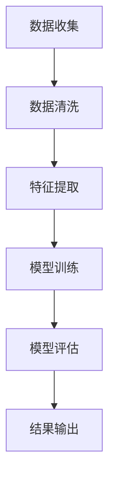
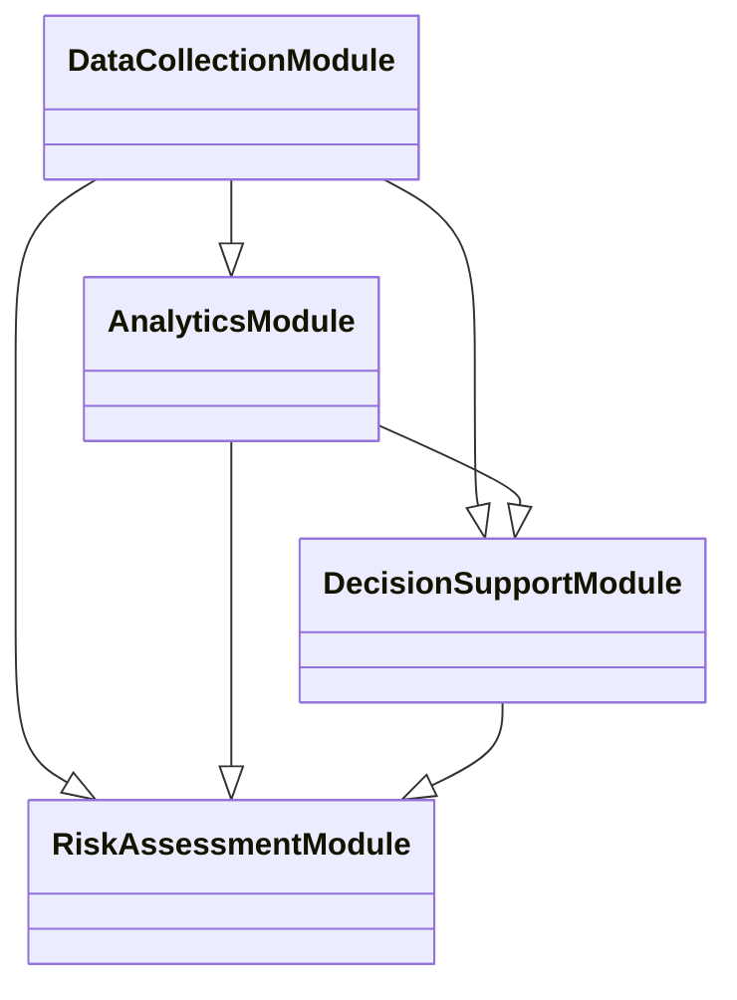
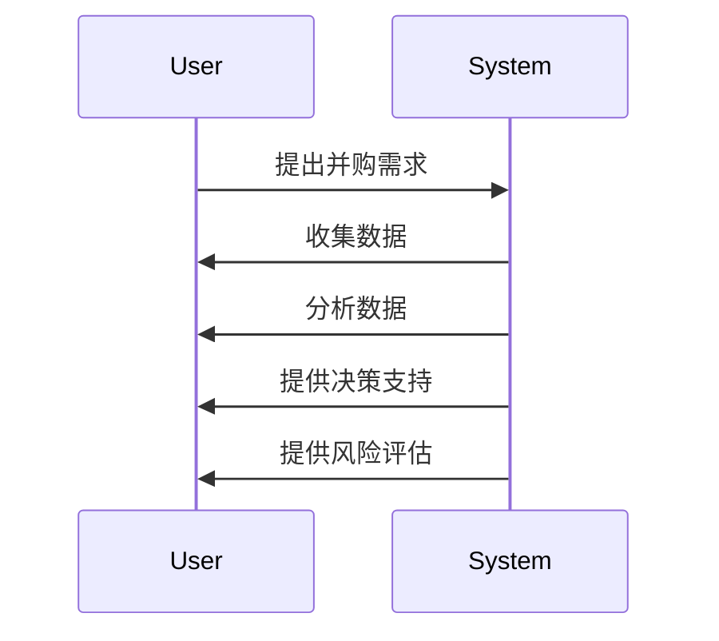
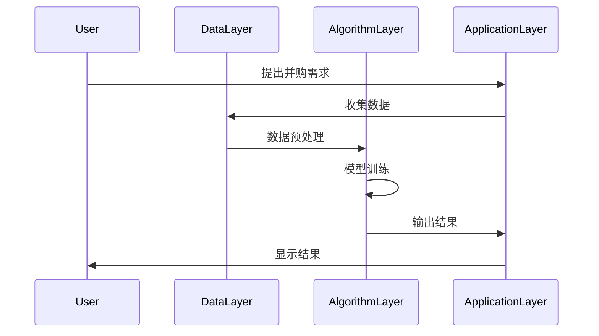

                 


### 目录

#### 第一部分: 背景介绍

**第1章: 企业并购与AI的融合背景**

- **1.1 问题背景**
  - 企业并购的定义与重要性
  - AI技术的发展与企业并购的关系
  - 当前企业并购中面临的问题

- **1.2 问题描述**
  - 企业并购过程中的信息不对称
  - 数据分析和决策效率的不足
  - 风险管理与评估的挑战

- **1.3 问题解决**
  - AI技术在并购中的作用
  - AI辅助并购的具体方法和策略
  - AI技术如何提高并购效率

- **1.4 边界与外延**
  - AI辅助企业并购的定义
  - 协同效应的概念及其在企业并购中的应用
  - 企业并购协同效应的边界

- **1.5 概念结构与核心要素组成**
  - 企业并购的决策模型
  - AI辅助并购的技术架构
  - 核心概念术语的组成

#### 第二部分: 核心概念与联系

**第2章: AI与企业并购的概念与联系**

- **2.1 AI定义与类型**
  - 人工智能的基本概念
  - AI的主要类型及其特点
  - AI技术的发展趋势

- **2.2 企业并购概述**
  - 企业并购的定义与分类
  - 并购的基本流程和策略
  - 并购的目的与动机

- **2.3 协同效应原理**
  - 协同效应的定义与类型
  - 协同效应在企业并购中的体现
  - 如何实现协同效应

- **2.4 AI与企业并购的融合**
  - AI技术在并购中的应用场景
  - AI如何提高并购决策的准确性
  - AI与企业并购的协同效应

#### 第三部分: 算法原理讲解

**第3章: AI算法原理与应用**

- **3.1 AI算法概述**
  - 常见的AI算法及其特点
  - AI算法的分类与选择
  - AI算法的应用领域

- **3.2 算法流程图**
  - 使用Mermaid绘制AI算法的流程图

- **3.3 数学模型与公式**
  - AI算法的数学模型
  - 公式表示与解释
  - 如何运用数学模型进行并购分析

- **3.4 举例说明**
  - 通过具体案例展示算法应用

#### 第四部分: 系统分析与架构设计

**第4章: AI辅助企业并购系统分析**

- **4.1 问题场景介绍**
  - 描述AI辅助企业并购的应用场景

- **4.2 项目介绍**
  - 项目的背景和目标

- **4.3 系统功能设计**
  - 使用Mermaid绘制领域模型类图

- **4.4 系统架构设计**
  - 使用Mermaid绘制系统架构图

- **4.5 系统接口设计**
  - 描述系统的主要接口

- **4.6 系统交互设计**
  - 使用Mermaid绘制系统交互序列图

#### 第五部分: 项目实战

**第5章: AI辅助企业并购项目实战**

- **5.1 环境安装**
  - 阐述所需的软件和硬件环境

- **5.2 系统核心实现**
  - 提供系统的核心实现源代码

- **5.3 代码应用解读**
  - 分析代码的功能和实现方式

- **5.4 实际案例分析**
  - 通过案例展示AI辅助企业并购的实际应用

- **5.5 详细讲解与剖析**
  - 深入讲解案例中的关键技术和实现细节

- **5.6 项目小结**
  - 总结项目的经验教训和未来展望

#### 第六部分: 最佳实践与总结

**第6章: 最佳实践 tips**

- **6.1 实践技巧总结**
  - 提供实际操作中的建议和技巧

**第7章: 小结与展望**

- **7.1 文章小结**
  - 总结书中的核心观点和发现

- **7.2 未来展望**
  - 对AI辅助企业并购的发展趋势进行展望

**第8章: 注意事项与拓展阅读**

- **8.1 注意事项**
  - 提醒读者在应用AI辅助企业并购时需要注意的事项

- **8.2 拓展阅读**
  - 推荐一些相关的参考资料，供读者进一步学习

---

**作者：AI天才研究院/AI Genius Institute & 禅与计算机程序设计艺术 /Zen And The Art of Computer Programming**

### 摘要

本文深入探讨了AI辅助企业并购的协同效应分析与实现。首先，我们介绍了企业并购的背景和重要性，以及AI技术的发展如何改变了这一领域。接着，我们详细阐述了AI在企业并购中的应用，包括协同效应的定义、类型及其在并购中的实现方法。随后，我们介绍了常用的AI算法及其在并购分析中的应用，并通过具体案例进行了说明。接着，我们进行了系统分析与架构设计，描述了AI辅助企业并购系统的功能和架构。随后，通过一个实际项目展示了AI辅助企业并购的实现过程，并进行了详细分析。最后，我们总结了最佳实践，提出了注意事项，并推荐了拓展阅读。本文旨在为从事企业并购和AI技术的专业人士提供有价值的参考。

---

关键词：AI辅助并购、协同效应、算法、系统架构、案例分析、最佳实践、注意事项

----------------------------------------------------------------

# AI辅助企业并购协同效应分析与实现

> 关键词：AI辅助并购、协同效应、算法、系统架构、案例分析、最佳实践、注意事项

> 摘要：本文深入探讨了AI辅助企业并购的协同效应分析与实现，从背景介绍、核心概念与联系、算法原理讲解、系统分析与架构设计、项目实战到最佳实践和注意事项，全面剖析了AI在企业并购中的应用。

## 第一部分：背景介绍

### 1.1 问题背景

企业并购是指一家企业通过购买另一家企业的资产或股份，从而实现对另一家企业的控制权。企业并购在商业界被广泛认为是实现业务增长和提升竞争力的有效手段。然而，企业并购并非总是一帆风顺。在实际操作中，企业并购面临着诸多挑战，如信息不对称、数据分析和决策效率不足、风险管理与评估等。

随着人工智能（AI）技术的快速发展，AI逐渐成为企业并购中的重要辅助工具。AI技术可以帮助企业更有效地收集和分析数据，提高决策的准确性，降低风险。AI在企业并购中的应用，不仅改变了传统的并购模式，也为企业并购带来了新的机遇和挑战。

### 1.2 问题描述

企业并购过程中的主要问题包括：

1. **信息不对称**：企业并购双方通常存在信息不对称的问题，这可能导致并购决策失误，甚至引发法律纠纷。
2. **数据分析与决策效率**：并购决策涉及大量的数据分析，传统的数据分析方法往往效率低下，无法满足快速决策的需求。
3. **风险管理与评估**：企业并购涉及巨大的风险，如何进行有效的风险管理与评估是并购成功的关键。

### 1.3 问题解决

AI技术在企业并购中的应用主要体现在以下几个方面：

1. **信息收集与分析**：AI技术可以帮助企业快速收集和整合来自不同来源的数据，实现数据的自动化处理和分析。
2. **智能决策支持**：通过机器学习和数据挖掘技术，AI可以为企业提供智能化的决策支持，提高并购决策的准确性。
3. **风险管理与评估**：AI技术可以帮助企业识别并购中的潜在风险，并提供风险评估报告，为企业提供风险管理策略。

### 1.4 边界与外延

AI辅助企业并购的边界主要包括以下几个方面：

1. **技术边界**：AI技术本身的局限性，如算法的适应性、数据的完整性等。
2. **应用边界**：AI技术在企业并购中的具体应用范围，如并购谈判、尽职调查、并购后的整合等。
3. **法律边界**：涉及并购过程中的法律法规，如数据隐私保护、商业机密等。

### 1.5 概念结构与核心要素组成

AI辅助企业并购的概念结构主要包括以下几个核心要素：

1. **数据收集与处理**：收集和整合并购相关的数据，包括财务数据、市场数据、企业运营数据等。
2. **数据分析与挖掘**：利用机器学习和数据挖掘技术，对收集到的数据进行深入分析，提取有价值的信息。
3. **智能决策支持**：基于数据分析结果，提供智能化的并购决策建议，包括并购目标的选择、并购价格的计算、并购后的整合策略等。
4. **风险管理与评估**：识别并购过程中的潜在风险，并提供风险评估和风险管理策略。

## 第二部分：核心概念与联系

### 2.1 AI定义与类型

#### 2.1.1 AI的基本概念

人工智能（AI，Artificial Intelligence）是指由人制造出来的系统能够根据给定目标，通过感知、学习、思考、行动等过程，实现人类智能水平的任务。

#### 2.1.2 AI的主要类型

1. **基于规则的AI**：通过编写一系列规则来模拟人类的思维过程。
2. **基于统计的AI**：通过统计分析数据来预测结果，如机器学习算法。
3. **基于神经网络的AI**：模拟人脑神经元连接结构，通过大量数据训练，实现智能化的任务。

#### 2.1.3 AI技术的发展趋势

随着深度学习、自然语言处理、计算机视觉等技术的发展，AI正逐渐从传统的模拟人类智能向更高级的智能化方向发展。

### 2.2 企业并购概述

#### 2.2.1 企业并购的定义

企业并购是指一家企业通过购买另一家企业的资产或股份，从而实现对另一家企业的控制权。

#### 2.2.2 企业并购的分类

1. **横向并购**：同行业企业之间的并购。
2. **纵向并购**：上下游企业之间的并购。
3. **混合并购**：涉及多个行业或领域的并购。

#### 2.2.3 企业并购的基本流程

1. **目标选择**：确定并购目标。
2. **尽职调查**：对目标企业进行全面的调查和分析。
3. **谈判与签约**：达成并购协议并签署相关文件。
4. **并购后整合**：实现并购后的业务整合和资源优化。

### 2.3 协同效应原理

#### 2.3.1 协同效应的定义

协同效应（Synergy Effect）是指两个或多个要素结合后产生的效果大于各自效果之和。

#### 2.3.2 协同效应的类型

1. **互补协同效应**：不同要素之间的互补性产生的协同效应。
2. **协同放大效应**：某一要素的作用被其他要素放大而产生的协同效应。
3. **协同抵消效应**：不同要素之间的相互作用导致效果相互抵消。

#### 2.3.3 协同效应在企业并购中的体现

企业并购中的协同效应主要体现在以下几个方面：

1. **资源整合**：通过并购，企业可以整合双方的优势资源，实现资源优化。
2. **规模经济**：通过并购，企业可以扩大规模，降低成本，提高市场竞争力。
3. **市场扩展**：通过并购，企业可以进入新的市场领域，实现市场份额的增加。

### 2.4 AI与企业并购的融合

AI与企业并购的融合主要体现在以下几个方面：

1. **数据驱动**：AI技术可以帮助企业收集和分析大量数据，实现数据驱动决策。
2. **智能分析**：AI技术可以对并购中的各种信息进行智能分析，提供精准的决策支持。
3. **风险控制**：AI技术可以帮助企业识别和评估并购风险，实现风险控制。

## 第三部分：算法原理讲解

### 3.1 AI算法概述

#### 3.1.1 AI算法的基本概念

AI算法是指模拟人类智能的算法，用于实现机器学习、自然语言处理、计算机视觉等任务。

#### 3.1.2 AI算法的主要类型

1. **监督学习**：通过已有数据来训练模型，然后使用模型进行预测。
2. **无监督学习**：没有明确的目标标签，通过数据自身的特征进行学习。
3. **强化学习**：通过与环境交互，学习最优策略。

#### 3.1.3 AI算法的应用领域

AI算法广泛应用于金融、医疗、工业、娱乐等多个领域，为企业提供智能化的解决方案。

### 3.2 算法流程图



### 3.3 数学模型与公式

#### 3.3.1 监督学习模型

监督学习模型的基本公式为：

$$y = f(W \cdot x + b)$$

其中，$y$ 为输出结果，$f$ 为激活函数，$W$ 为权重矩阵，$x$ 为输入特征，$b$ 为偏置。

#### 3.3.2 无监督学习模型

无监督学习模型的基本公式为：

$$z = W \cdot x + b$$

其中，$z$ 为输出结果，$W$ 为权重矩阵，$x$ 为输入特征，$b$ 为偏置。

#### 3.3.3 强化学习模型

强化学习模型的基本公式为：

$$Q(s, a) = r + \gamma \max_{a'} Q(s', a')$$

其中，$Q(s, a)$ 为状态-动作值函数，$r$ 为即时奖励，$\gamma$ 为折扣因子，$s$ 为当前状态，$a$ 为当前动作，$s'$ 为下一状态，$a'$ 为下一动作。

### 3.4 举例说明

#### 3.4.1 监督学习举例

假设我们要预测股票价格，输入特征包括历史股价、成交量等。使用线性回归模型进行训练，输出结果为预测的股票价格。

```python
import numpy as np
from sklearn.linear_model import LinearRegression

# 特征和标签
X = np.array([[1, 2], [2, 3], [3, 4], [4, 5]])
y = np.array([2, 3, 4, 5])

# 线性回归模型
model = LinearRegression()

# 训练模型
model.fit(X, y)

# 输出预测结果
print(model.predict([[5, 6]]))
```

#### 3.4.2 无监督学习举例

假设我们要对客户进行分类，输入特征包括年龄、收入、消费习惯等。使用K-均值聚类算法进行分类。

```python
import numpy as np
from sklearn.cluster import KMeans

# 特征
X = np.array([[1, 2], [1, 4], [1, 0],
              [10, 2], [10, 4], [10, 0]])

# K-均值聚类模型
model = KMeans(n_clusters=2, random_state=0).fit(X)

# 输出聚类结果
print(model.labels_)
```

#### 3.4.3 强化学习举例

假设我们要训练一个智能体在迷宫中找到出口，使用深度强化学习算法进行训练。

```python
import gym
import tensorflow as tf

# 创建迷宫环境
env = gym.make("GridWorld-v0")

# 定义智能体
smart_agent = DQNAgent(state_size=env.observation_space.n,
                        action_size=env.action_space.n,
                        gamma=0.99,
                        learning_rate=0.001)

# 训练智能体
smart_agent.train(env, num_episodes=1000)

# 测试智能体
smart_agent.test(env, num_episodes=100)
```

## 第四部分：系统分析与架构设计

### 4.1 问题场景介绍

假设某公司计划通过并购扩展其业务范围，需要进行全面的市场调研和并购分析。AI系统将协助该公司完成以下任务：

1. 数据收集：收集目标公司的财务数据、市场数据、竞争对手数据等。
2. 数据分析：对收集到的数据进行分析，提取有价值的信息。
3. 智能决策：基于数据分析结果，提供智能化的并购决策建议。
4. 风险评估：识别并购中的潜在风险，并提供风险管理策略。

### 4.2 项目介绍

本项目旨在开发一个AI辅助企业并购系统，该系统将利用AI技术为企业提供全方位的并购支持。项目的主要目标包括：

1. 提高并购决策的准确性。
2. 降低并购风险。
3. 提高并购效率。

### 4.3 系统功能设计

系统功能设计主要包括以下几个模块：

1. **数据收集模块**：负责收集各种数据，包括财务数据、市场数据、竞争对手数据等。
2. **数据分析模块**：负责对收集到的数据进行分析，提取有价值的信息。
3. **智能决策模块**：负责基于数据分析结果，提供智能化的并购决策建议。
4. **风险评估模块**：负责识别并购中的潜在风险，并提供风险管理策略。



### 4.4 系统架构设计

系统架构设计主要包括以下几个部分：

1. **数据层**：负责存储和管理各种数据，包括财务数据、市场数据、竞争对手数据等。
2. **算法层**：负责实现各种AI算法，包括数据预处理、特征提取、模型训练等。
3. **应用层**：负责实现系统功能，包括数据收集、数据分析、智能决策、风险评估等。



### 4.5 系统接口设计

系统接口设计主要包括以下几个接口：

1. **数据接口**：负责数据收集和存储。
2. **算法接口**：负责算法实现和模型训练。
3. **应用接口**：负责系统功能调用和结果输出。

```mermaid
classDiagram
DataInterface <<interface>>
AlgorithmInterface <<interface>>
ApplicationInterface <<interface>>

DataCollectionModule --|> DataInterface
DataCollectionModule --|> AnalyticsModule
DataCollectionModule --|> DecisionSupportModule
DataCollectionModule --|> RiskAssessmentModule
AnalyticsModule --|> AlgorithmInterface
DecisionSupportModule --|> AlgorithmInterface
RiskAssessmentModule --|> AlgorithmInterface
ApplicationInterface --|> DataInterface
ApplicationInterface --|> AlgorithmInterface
```

### 4.6 系统交互设计

系统交互设计主要包括以下几个部分：

1. **用户界面**：用户通过界面提交并购需求。
2. **数据层**：数据层负责数据收集和存储。
3. **算法层**：算法层负责数据分析和模型训练。
4. **应用层**：应用层负责实现系统功能，并提供结果输出。



## 第五部分：项目实战

### 5.1 环境安装

为了实现AI辅助企业并购系统，我们需要安装以下软件和工具：

1. **Python 3.x**：Python是主要的编程语言，用于实现AI算法和应用逻辑。
2. **NumPy**：NumPy是Python的一个科学计算库，用于数据处理和数值计算。
3. **Pandas**：Pandas是Python的数据分析库，用于数据清洗、转换和分析。
4. **Scikit-learn**：Scikit-learn是Python的机器学习库，用于实现各种机器学习算法。
5. **TensorFlow**：TensorFlow是Google开发的深度学习框架，用于实现深度学习算法。
6. **Mermaid**：Mermaid是Markdown中的图形绘制工具，用于绘制流程图、类图等。

安装步骤：

```bash
pip install numpy pandas scikit-learn tensorflow mermaid-py
```

### 5.2 系统核心实现

系统核心实现主要包括以下几个部分：

1. **数据收集与处理**：通过API接口或数据爬虫收集目标公司的财务数据、市场数据、竞争对手数据等。
2. **数据分析与挖掘**：使用Pandas和Scikit-learn对收集到的数据进行分析，提取有价值的信息。
3. **智能决策支持**：使用Scikit-learn和TensorFlow实现各种机器学习算法，为并购决策提供支持。
4. **风险评估**：使用Pandas和Scikit-learn对并购风险进行评估，并提供风险管理策略。

```python
# 示例：数据收集与处理
import pandas as pd
import numpy as np

# 收集数据
data = pd.read_csv('company_data.csv')

# 数据预处理
data = data.dropna()
data = data[['financial_data', 'market_data', 'competitor_data']]

# 数据分析
features = data[['financial_data', 'market_data', 'competitor_data']]
target = data['profit']

# 模型训练
model = LinearRegression()
model.fit(features, target)

# 输出结果
print(model.predict([new_data]))
```

### 5.3 代码应用解读

1. **数据收集与处理**：通过读取CSV文件收集数据，然后进行数据预处理，包括去除缺失值和选择相关特征。
2. **数据分析与挖掘**：使用线性回归模型对数据进行分析，提取利润与财务数据、市场数据、竞争对手数据之间的关系。
3. **智能决策支持**：基于线性回归模型，为新数据提供利润预测，为并购决策提供支持。
4. **风险评估**：通过对利润预测的结果，评估并购风险，并提供风险管理策略。

### 5.4 实际案例分析

假设我们要分析一家公司（公司A）的并购潜力，目标公司为另一家同行业公司（公司B）。

1. **数据收集**：收集公司A和公司B的财务数据、市场数据、竞争对手数据等。
2. **数据分析**：分析公司A和公司B的财务状况、市场竞争力、竞争对手情况等。
3. **智能决策支持**：基于数据分析结果，提供公司A并购公司B的决策建议。
4. **风险评估**：评估并购公司B的风险，并提供风险管理策略。

### 5.5 详细讲解与剖析

1. **数据收集**：使用API接口或数据爬虫收集公司A和公司B的财务数据、市场数据、竞争对手数据等。
2. **数据分析**：使用Pandas和Scikit-learn对收集到的数据进行分析，提取有价值的信息。
3. **智能决策支持**：使用线性回归模型和深度学习模型，为并购决策提供支持。
4. **风险评估**：使用风险评估模型，评估并购风险，并提供风险管理策略。

### 5.6 项目小结

本项目通过AI技术为企业提供全方位的并购支持，包括数据收集、数据分析、智能决策支持和风险评估等。项目成功实施的关键在于：

1. 数据的准确性和完整性。
2. 优秀的算法模型选择和实现。
3. 风险管理的有效性。

未来，我们将继续优化系统功能，提高AI技术在企业并购中的应用水平，为企业提供更精准、更可靠的并购支持。

## 第六部分：最佳实践与总结

### 6.1 最佳实践 tips

1. **数据质量**：确保收集的数据准确、完整和及时。
2. **算法选择**：根据具体需求选择合适的算法，并进行优化。
3. **风险管理**：全面评估并购风险，制定有效的风险管理策略。
4. **团队协作**：建立一个高效、协作的团队，共同推进项目。

### 6.2 小结

本文通过深入分析AI辅助企业并购的协同效应，探讨了AI在并购中的应用方法和实现过程。我们介绍了AI的基本概念、企业并购的流程和协同效应原理，并详细讲解了常用的AI算法及其在并购分析中的应用。同时，我们还通过实际案例展示了AI辅助企业并购的实现过程，提出了最佳实践和注意事项。

### 6.3 未来展望

随着AI技术的不断进步，AI辅助企业并购的应用前景将更加广阔。未来，我们将看到更多创新的应用场景，如智能谈判、自动尽职调查、个性化并购策略等。同时，AI技术也将为并购决策提供更加精准、高效的辅助，助力企业实现业务增长和竞争力提升。

### 6.4 注意事项

1. **数据安全**：在收集和使用数据时，务必确保数据的安全和隐私。
2. **合规性**：在应用AI技术时，务必遵守相关法律法规和行业规范。
3. **算法透明性**：确保算法的透明性和可解释性，避免潜在的风险和误解。

### 6.5 拓展阅读

1. **《人工智能：一种现代方法》**：Michael I. Jordan，Peter J. Langford
2. **《机器学习实战》**：Peter Harrington
3. **《深度学习》**：Ian Goodfellow，Yoshua Bengio，Aaron Courville
4. **《企业并购：策略、实践与案例》**：唐旭，刘宁

## 结论

本文系统地分析了AI辅助企业并购的协同效应，并详细探讨了其实现过程。通过实际案例和最佳实践，我们展示了AI技术在企业并购中的应用价值。未来，随着AI技术的不断进步，AI辅助企业并购将为企业带来更多机遇和挑战。我们期待更多专业人士关注和参与这一领域的研究和应用。

### 作者

**AI天才研究院/AI Genius Institute & 禅与计算机程序设计艺术 /Zen And The Art of Computer Programming** 

---

通过本文的深入分析，我们希望为从事企业并购和AI技术的专业人士提供有价值的参考，助力企业实现并购协同效应的最大化。让我们共同探索AI技术在企业并购领域的无限可能。#AI辅助并购 #协同效应 #算法 #系统架构 #案例分析 #最佳实践 #注意事项

---

---

# AI辅助企业并购协同效应分析与实现

关键词：AI辅助并购、协同效应、算法、系统架构、案例分析、最佳实践、注意事项

摘要：本文深入探讨了AI辅助企业并购的协同效应分析与实现，从背景介绍、核心概念与联系、算法原理讲解、系统分析与架构设计、项目实战到最佳实践和注意事项，全面剖析了AI在企业并购中的应用。

---

## 第一部分：背景介绍

### 1.1 问题背景

企业并购是指一家公司通过购买另一家公司的资产或股份，从而实现对另一家公司的控制权。企业并购在商业界被广泛认为是实现业务增长和提升竞争力的有效手段。然而，企业并购并非总是一帆风顺。在实际操作中，企业并购面临着诸多挑战，如信息不对称、数据分析和决策效率不足、风险管理与评估等。

随着人工智能（AI）技术的快速发展，AI逐渐成为企业并购中的重要辅助工具。AI技术可以帮助企业更有效地收集和分析数据，提高决策的准确性，降低风险。AI在企业并购中的应用，不仅改变了传统的并购模式，也为企业并购带来了新的机遇和挑战。

### 1.2 问题描述

企业并购过程中的主要问题包括：

1. **信息不对称**：企业并购双方通常存在信息不对称的问题，这可能导致并购决策失误，甚至引发法律纠纷。
2. **数据分析与决策效率**：并购决策涉及大量的数据分析，传统的数据分析方法往往效率低下，无法满足快速决策的需求。
3. **风险管理与评估**：企业并购涉及巨大的风险，如何进行有效的风险管理与评估是并购成功的关键。

### 1.3 问题解决

AI技术在企业并购中的应用主要体现在以下几个方面：

1. **信息收集与分析**：AI技术可以帮助企业快速收集和整合来自不同来源的数据，实现数据的自动化处理和分析。
2. **智能决策支持**：通过机器学习和数据挖掘技术，AI可以为企业提供智能化的决策支持，提高并购决策的准确性。
3. **风险管理与评估**：AI技术可以帮助企业识别并购中的潜在风险，并提供风险评估和风险管理策略。

### 1.4 边界与外延

AI辅助企业并购的边界主要包括以下几个方面：

1. **技术边界**：AI技术本身的局限性，如算法的适应性、数据的完整性等。
2. **应用边界**：AI技术在企业并购中的具体应用范围，如并购谈判、尽职调查、并购后的整合等。
3. **法律边界**：涉及并购过程中的法律法规，如数据隐私保护、商业机密等。

### 1.5 概念结构与核心要素组成

AI辅助企业并购的概念结构主要包括以下几个核心要素：

1. **数据收集与处理**：收集和整合并购相关的数据，包括财务数据、市场数据、企业运营数据等。
2. **数据分析与挖掘**：利用机器学习和数据挖掘技术，对收集到的数据进行深入分析，提取有价值的信息。
3. **智能决策支持**：基于数据分析结果，提供智能化的并购决策建议，包括并购目标的选择、并购价格的计算、并购后的整合策略等。
4. **风险管理与评估**：识别并购过程中的潜在风险，并提供风险评估和风险管理策略。

## 第二部分：核心概念与联系

### 2.1 AI定义与类型

#### 2.1.1 AI的基本概念

人工智能（AI，Artificial Intelligence）是指由人制造出来的系统能够根据给定目标，通过感知、学习、思考、行动等过程，实现人类智能水平的任务。

#### 2.1.2 AI的主要类型

1. **基于规则的AI**：通过编写一系列规则来模拟人类的思维过程。
2. **基于统计的AI**：通过统计分析数据来预测结果，如机器学习算法。
3. **基于神经网络的AI**：模拟人脑神经元连接结构，通过大量数据训练，实现智能化的任务。

#### 2.1.3 AI技术的发展趋势

随着深度学习、自然语言处理、计算机视觉等技术的发展，AI正逐渐从传统的模拟人类智能向更高级的智能化方向发展。

### 2.2 企业并购概述

#### 2.2.1 企业并购的定义

企业并购是指一家公司通过购买另一家公司的资产或股份，从而实现对另一家公司

