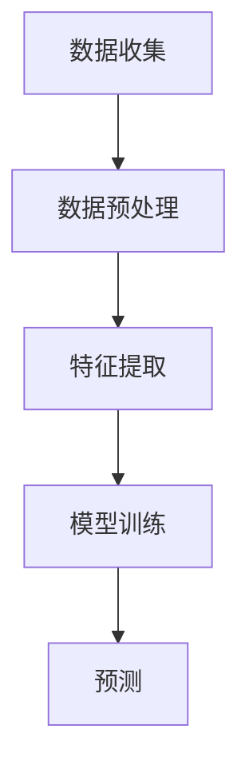
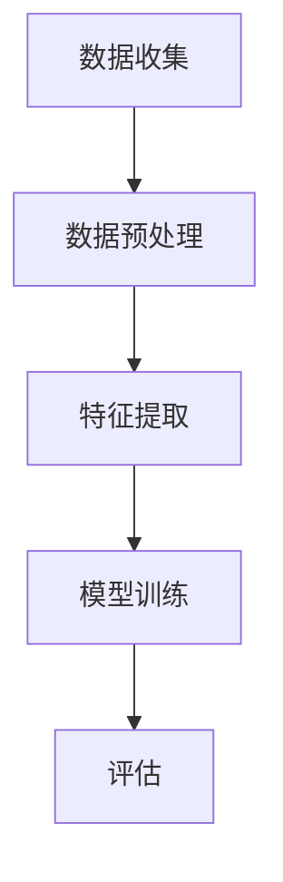
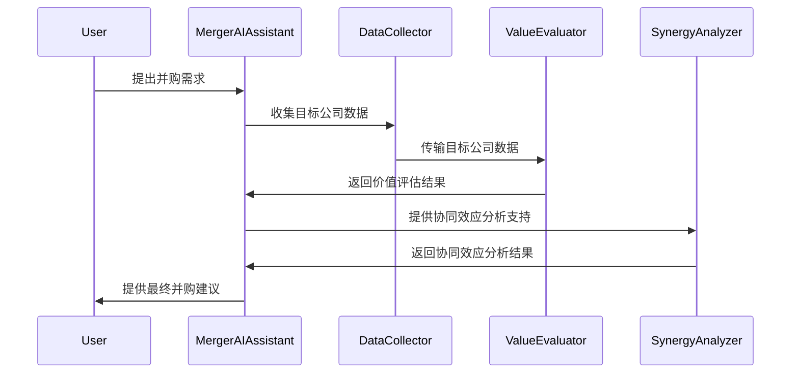
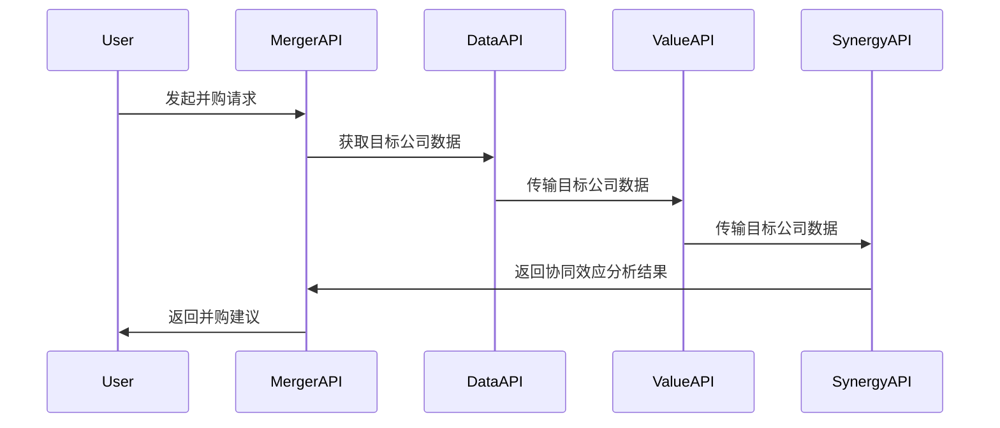

                 

## AI辅助企业并购协同效应分析：识别与量化价值

### 关键词

- 人工智能
- 企业并购
- 协同效应
- 数据分析
- 机器学习
- 深度学习

### 摘要

本文将探讨人工智能（AI）在辅助企业并购中的协同效应分析，通过识别和量化并购中的潜在价值。我们将详细分析AI的核心概念、数据挖掘与机器学习原理，并运用这些技术来支持企业并购的目标公司选择、价值评估及协同效应分析。本文还将讨论AI在企业并购中的边界与外延，并提供实际案例来展示AI技术的应用效果。

### 第一部分：背景介绍

#### 问题背景

近年来，随着全球经济的不断发展和竞争的加剧，企业并购已成为企业扩张和提升竞争力的重要手段。然而，并购过程中的复杂性使得决策变得更加困难，尤其是在目标公司选择、价值评估和协同效应分析等方面。人工智能技术的迅速发展为这些问题的解决提供了新的可能性。

AI在企业并购中的应用不仅能够提高决策的准确性，还能够提高决策的效率。通过数据分析和机器学习算法，AI能够处理和分析大量的数据，帮助识别潜在的并购目标，评估其价值，并预测并购后的协同效应。传统方法通常依赖于人类专家的经验和判断，而AI能够提供更为客观和准确的决策支持。

#### 问题描述

企业并购过程中涉及多个复杂环节，包括以下方面：

1. **目标公司选择**：在众多的潜在目标中，如何选择最合适的公司进行并购，是并购成功的关键。这需要综合考虑目标公司的财务状况、市场地位、竞争优势等多方面因素。

2. **价值评估**：准确评估目标公司的价值是并购决策的基础。传统的方法通常包括财务分析、市场分析等，但这些方法往往存在主观性和误差。

3. **协同效应分析**：并购后，如何实现协同效应，提高整体效益，是企业成功并购的重要一环。协同效应包括成本节约、市场拓展、运营效率提升等。

4. **整合与整合后运营**：并购后的整合过程同样复杂，包括人力资源整合、供应链整合、文化整合等。这些整合活动的有效性直接关系到并购的成功与否。

传统方法在处理上述问题时，通常依赖于人类专家的经验和判断。虽然这些专家具有丰富的知识和经验，但他们的判断往往受到主观因素的影响，且在处理大量数据时效率较低。此外，传统方法在预测并购后的协同效应方面也存在局限。

#### 问题解决

AI技术通过以下几个方面的应用，能够有效解决企业并购中的问题：

1. **数据收集与处理**：AI能够自动收集和处理大量的数据，包括财务数据、市场数据、公司信息等。这些数据可以用于目标公司选择、价值评估和协同效应分析。

2. **目标公司选择**：AI可以通过分析历史并购案例和当前市场数据，识别潜在的并购目标。机器学习算法可以帮助预测目标公司的价值，并评估其与并购方的协同潜力。

3. **价值评估**：AI可以使用复杂的算法和模型，对目标公司的价值进行准确评估。这些算法可以处理大量的数据，减少人为误差，提高评估的准确性。

4. **协同效应分析**：AI可以通过分析历史并购数据，预测并购后可能产生的协同效应。深度学习算法可以帮助识别潜在的成本节约、市场拓展和运营效率提升的机会。

5. **整合与整合后运营**：AI还可以在并购后的整合过程中发挥作用。例如，通过自然语言处理技术，AI可以分析和理解员工反馈，帮助优化人力资源配置和文化整合。

#### 边界与外延

AI辅助企业并购的范围可以涵盖从并购前的目标公司选择、价值评估，到并购后的协同效应分析和整合。此外，AI还可以在并购后的公司运营中发挥作用，如人力资源配置、供应链优化等。

AI辅助企业并购的核心概念和要素包括：

1. **数据收集与处理**：数据源、数据清洗、数据存储和管理。
2. **目标公司选择**：数据挖掘、模式识别、预测分析。
3. **价值评估**：财务分析、市场分析、并购模型。
4. **协同效应分析**：成本效益分析、绩效预测、整合策略。

通过上述核心概念的有机结合，AI能够为企业并购提供全方位的辅助和支持，从而提高并购的成功率和效益。

### 第二部分：核心概念与联系

#### AI辅助企业并购的核心概念

在本章节中，我们将详细介绍AI辅助企业并购的核心概念，包括但不限于以下内容：

1. **AI技术**：人工智能的基本原理、分类和应用领域。
2. **数据挖掘**：数据挖掘的基本概念、方法和应用场景。
3. **机器学习**：机器学习的理论基础、算法和应用。
4. **深度学习**：深度学习的原理、神经网络结构以及训练方法。
5. **自然语言处理**：自然语言处理的基本概念、技术和应用。

#### 概念属性特征对比表格

为了更好地理解上述核心概念，我们提供了一张对比表格，展示这些概念的主要属性和特征：

| 概念             | 主要属性特征                                             |
|------------------|--------------------------------------------------------|
| AI技术           | 智能化、自主决策、学习与适应能力                         |
| 数据挖掘         | 数据发现、模式识别、预测分析                             |
| 机器学习         | 统计学习、经验学习、数据驱动                             |
| 深度学习         | 神经网络、多层感知、自动特征提取                         |
| 自然语言处理     | 文本分析、语义理解、语言生成                             |

#### ER实体关系图架构

为了更直观地展示AI辅助企业并购中的关键实体及其关系，我们使用Mermaid绘制了一个ER实体关系图：

```mermaid
erDiagram
  TargetCompany ||--|{ AIAssistant }
  AIAssistant ||--|{ DataCollector }
  AIAssistant ||--|{ ValueEvaluator }
  AIAssistant ||--|{ SynergyAnalyzer }
```

在该ER图中，`TargetCompany`代表目标公司，`AIAssistant`代表AI助手，包括`DataCollector`（数据收集器）、`ValueEvaluator`（价值评估器）和`SynergyAnalyzer`（协同效应分析器）。

#### AI技术

**基本原理**：AI技术基于计算机科学，通过模拟人类思维和行为，实现自动化和智能化的决策。其主要原理包括：

- **机器学习**：通过训练算法从数据中学习模式，进行预测和决策。
- **深度学习**：基于多层神经网络，通过大量数据进行学习，实现复杂任务的自动化。

**分类**：

- **基于规则的系统**：通过定义一系列规则来模拟人类决策过程。
- **基于模式的系统**：通过识别和匹配数据中的模式来做出决策。
- **基于实例的学习**：通过学习过去的实例来做出决策。
- **进化算法**：通过模拟生物进化过程来优化问题求解。

**应用领域**：

- **数据分析**：用于处理和分析大量数据，提取有价值的信息。
- **自然语言处理**：用于理解和生成自然语言，实现人机交互。
- **计算机视觉**：用于图像识别、物体检测和场景理解。
- **智能机器人**：用于自动化生产和物流，提高工作效率。

#### 数据挖掘

**基本概念**：数据挖掘是从大量数据中自动发现有用信息和知识的过程。其主要任务包括：

- **关联规则挖掘**：发现数据之间的关联关系。
- **分类和预测**：通过分类算法预测未知数据的标签。
- **聚类分析**：将相似的数据分组，发现数据模式。
- **异常检测**：识别数据中的异常现象。

**方法**：

- **统计方法**：通过统计模型来分析数据，如线性回归、逻辑回归等。
- **机器学习方法**：通过训练算法来发现数据中的模式，如决策树、支持向量机等。
- **深度学习方法**：通过多层神经网络来提取数据的深层特征。

**应用场景**：

- **市场营销**：用于客户行为分析、市场细分和精准营销。
- **金融分析**：用于风险评估、信用评分和投资策略。
- **医疗健康**：用于疾病预测、诊断和治疗方案推荐。
- **社交网络**：用于用户行为分析、社交关系挖掘和推荐系统。

#### 机器学习

**理论基础**：机器学习是AI的核心技术之一，其理论基础包括：

- **统计学习理论**：通过概率统计方法来分析数据，实现预测和分类。
- **优化理论**：通过优化算法来寻找最优解，如梯度下降、牛顿法等。
- **信息论**：用于度量信息的价值和不确定性。

**算法**：

- **监督学习**：通过已标记的数据来训练模型，如线性回归、决策树、支持向量机等。
- **无监督学习**：通过未标记的数据来训练模型，如聚类分析、降维、主成分分析等。
- **强化学习**：通过交互环境来训练模型，如深度强化学习、Q学习等。

**应用**：

- **图像识别**：用于人脸识别、车辆检测和医疗图像分析。
- **语音识别**：用于语音助手、自动字幕和语音翻译。
- **自然语言处理**：用于文本分类、机器翻译和情感分析。
- **推荐系统**：用于商品推荐、新闻推送和社交媒体内容推荐。

#### 深度学习

**原理**：深度学习是基于多层神经网络的学习方法，其核心思想是通过多层神经元来提取数据的深层特征。其主要原理包括：

- **前向传播与反向传播**：通过前向传播来计算输出，通过反向传播来更新网络权重。
- **激活函数**：用于引入非线性因素，使得神经网络能够学习复杂的模式。
- **正则化**：用于防止过拟合，提高模型的泛化能力。

**神经网络结构**：

- **卷积神经网络（CNN）**：用于图像识别和图像处理，能够提取图像的局部特征。
- **循环神经网络（RNN）**：用于序列数据处理，能够捕捉序列中的时间依赖关系。
- **生成对抗网络（GAN）**：用于生成新的数据，如图像和文本。

**训练方法**：

- **端到端训练**：直接从原始数据训练模型，不需要人工特征工程。
- **迁移学习**：利用预训练模型来加速新任务的训练。
- **数据增强**：通过变换数据来增加训练样本的多样性，提高模型的泛化能力。

**应用**：

- **计算机视觉**：用于图像识别、物体检测和图像生成。
- **自然语言处理**：用于文本分类、机器翻译和文本生成。
- **语音识别**：用于语音识别、语音合成和语音助手。
- **推荐系统**：用于商品推荐、新闻推送和社交媒体内容推荐。

#### 自然语言处理

**基本概念**：自然语言处理是AI的一个重要分支，旨在使计算机理解和生成自然语言。其主要任务包括：

- **文本分类**：将文本数据分类到预定义的类别中。
- **情感分析**：判断文本中的情感倾向，如正面、负面或中立。
- **实体识别**：识别文本中的命名实体，如人名、地点、组织等。
- **机器翻译**：将一种语言的文本翻译成另一种语言。

**技术**：

- **词向量表示**：通过将单词映射到高维向量空间，实现文本数据的向量表示。
- **序列模型**：通过循环神经网络（RNN）或长短期记忆网络（LSTM）来处理序列数据。
- **注意力机制**：用于提高模型对重要信息的关注，提高模型的性能。

**应用**：

- **搜索引擎**：用于文本搜索和内容推荐。
- **智能客服**：用于自动回答用户问题和提供支持。
- **社交媒体分析**：用于情感分析和用户行为分析。
- **新闻生成**：用于自动生成新闻文章和报告。

### 第三部分：算法原理讲解

在本章节中，我们将详细讲解AI在辅助企业并购中的算法原理，通过Mermaid流程图和Python源代码来展示算法的实现过程，并给出数学模型和公式。

#### 目标公司选择算法

**算法流程**：

1. 数据收集：收集潜在目标公司的财务数据、市场数据和其他相关信息。
2. 数据预处理：对收集到的数据进行清洗、去重和格式转换。
3. 特征提取：从预处理后的数据中提取对目标公司选择有重要影响的特征。
4. 模型训练：使用机器学习算法（如决策树、支持向量机等）训练模型。
5. 预测：使用训练好的模型对新的目标公司进行预测，识别潜在的并购目标。

**Mermaid流程图**：



**Python源代码**：

```python
import pandas as pd
from sklearn.model_selection import train_test_split
from sklearn.ensemble import RandomForestClassifier

# 数据收集
data = pd.read_csv('target_company_data.csv')

# 数据预处理
data = data.drop_duplicates()
data = data.reset_index(drop=True)

# 特征提取
features = data[['revenue', 'profit', 'market_cap', 'industry']]
labels = data['is_acquisition_target']

# 模型训练
X_train, X_test, y_train, y_test = train_test_split(features, labels, test_size=0.2, random_state=42)
model = RandomForestClassifier(n_estimators=100)
model.fit(X_train, y_train)

# 预测
predictions = model.predict(X_test)
```

**数学模型**：

假设我们有m个特征变量X1, X2, ..., Xm，我们需要预测一个二分类变量Y（并购目标/非并购目标）。我们可以使用逻辑回归模型来构建预测模型：

$$
P(Y=1|X) = \frac{1}{1 + e^{-(\beta_0 + \beta_1X_1 + \beta_2X_2 + ... + \beta_mX_m})}
$$

其中，$\beta_0, \beta_1, \beta_2, ..., \beta_m$为模型参数，可以通过最小化损失函数（如对数似然函数）来求解。

#### 价值评估算法

**算法流程**：

1. 数据收集：收集目标公司的财务数据、市场数据和其他相关信息。
2. 数据预处理：对收集到的数据进行清洗、去重和格式转换。
3. 特征提取：从预处理后的数据中提取对目标公司价值有重要影响的特征。
4. 模型训练：使用机器学习算法（如线性回归、支持向量机等）训练模型。
5. 评估：使用训练好的模型对目标公司进行价值评估。

**Mermaid流程图**：



**Python源代码**：

```python
import pandas as pd
from sklearn.model_selection import train_test_split
from sklearn.linear_model import LinearRegression

# 数据收集
data = pd.read_csv('target_company_data.csv')

# 数据预处理
data = data.drop_duplicates()
data = data.reset_index(drop=True)

# 特征提取
features = data[['revenue', 'profit', 'market_cap', 'industry']]
labels = data['value']

# 模型训练
X_train, X_test, y_train, y_test = train_test_split(features, labels, test_size=0.2, random_state=42)
model = LinearRegression()
model.fit(X_train, y_train)

# 评估
predictions = model.predict(X_test)
```

**数学模型**：

假设我们有m个特征变量X1, X2, ..., Xm，我们需要预测目标公司的价值Y。我们可以使用线性回归模型来构建预测模型：

$$
Y = \beta_0 + \beta_1X_1 + \beta_2X_2 + ... + \beta_mX_m + \epsilon
$$

其中，$\beta_0, \beta_1, \beta_2, ..., \beta_m$为模型参数，可以通过最小化损失函数（如均方误差）来求解。

#### 协同效应分析算法

**算法流程**：

1. 数据收集：收集历史并购数据，包括并购前后的财务数据、运营数据等。
2. 数据预处理：对收集到的数据进行清洗、去重和格式转换。
3. 特征提取：从预处理后的数据中提取对协同效应有重要影响的特征。
4. 模型训练：使用机器学习算法（如决策树、随机森林等）训练模型。
5. 预测：使用训练好的模型预测并购后的协同效应。

**Mermaid流程图**：


**Python源代码**：

```python
import pandas as pd
from sklearn.model_selection import train_test_split
from sklearn.ensemble import RandomForestRegressor

# 数据收集
data = pd.read_csv('merger_acquisition_data.csv')

# 数据预处理
data = data.drop_duplicates()
data = data.reset_index(drop=True)

# 特征提取
features = data[['premerger_revenue', 'premerger_profit', 'postmerger_revenue', 'postmerger_profit']]
labels = data['synergy_effect']

# 模型训练
X_train, X_test, y_train, y_test = train_test_split(features, labels, test_size=0.2, random_state=42)
model = RandomForestRegressor(n_estimators=100)
model.fit(X_train, y_train)

# 预测
predictions = model.predict(X_test)
```

**数学模型**：

假设我们有m个特征变量X1, X2, ..., Xm，我们需要预测并购后的协同效应Y。我们可以使用回归模型来构建预测模型：

$$
Y = \beta_0 + \beta_1X_1 + \beta_2X_2 + ... + \beta_mX_m + \epsilon
$$

其中，$\beta_0, \beta_1, \beta_2, ..., \beta_m$为模型参数，可以通过最小化损失函数（如均方误差）来求解。

### 第四部分：系统分析与架构设计方案

#### 问题场景介绍

随着市场竞争的加剧，企业希望通过并购来扩大市场份额和提升竞争力。然而，并购决策的复杂性使得企业需要一种高效且可靠的系统来支持决策过程。本文将介绍一个基于AI的企业并购辅助系统，该系统能够自动收集和处理数据，提供目标公司选择、价值评估和协同效应分析的支持。

#### 项目介绍

项目名称：企业并购AI辅助系统（Merger AI Assistant）

项目目标：通过AI技术，为企业提供高效、准确的目标公司选择、价值评估和协同效应分析，辅助企业做出明智的并购决策。

#### 系统功能设计（领域模型Mermaid类图）

```mermaid
classDiagram
    TargetCompany <<entity>>
    AIAssistant <<entity>>
    DataCollector <<entity>>
    ValueEvaluator <<entity>>
    SynergyAnalyzer <<entity>>

    TargetCompany --|> AIAssistant
    AIAssistant --|> DataCollector
    AIAssistant --|> ValueEvaluator
    AIAssistant --|> SynergyAnalyzer
```

在该类图中，`TargetCompany`代表目标公司，`AIAssistant`代表AI助手，包括`DataCollector`（数据收集器）、`ValueEvaluator`（价值评估器）和`SynergyAnalyzer`（协同效应分析器）。这些实体之间存在明确的关联关系，共同实现系统功能。

#### 系统架构设计（Mermaid架构图）



在该架构图中，用户通过提出并购需求，系统中的`DataCollector`负责收集目标公司数据，`ValueEvaluator`进行价值评估，`SynergyAnalyzer`提供协同效应分析支持。最终，`MergerAIAssistant`将评估和预测结果返回给用户，为并购决策提供支持。

#### 系统接口设计和系统交互（Mermaid序列图）



在该序列图中，用户通过MergerAPI发起并购请求，MergerAPI通过DataAPI获取目标公司数据，并将数据传输给ValueAPI和SynergyAPI进行价值评估和协同效应分析。最终，MergerAPI将结果返回给用户。

### 第五部分：项目实战

#### 环境安装

1. 安装Python环境：在终端中执行以下命令安装Python：

   ```bash
   sudo apt-get update
   sudo apt-get install python3 python3-pip
   ```

2. 安装必要的库：在终端中执行以下命令安装所需的Python库：

   ```bash
   pip3 install pandas scikit-learn matplotlib
   ```

#### 系统核心实现源代码

以下是系统核心实现的部分源代码：

```python
# 数据收集模块
def collect_data(file_path):
    data = pd.read_csv(file_path)
    return data

# 数据预处理模块
def preprocess_data(data):
    data = data.drop_duplicates()
    data = data.reset_index(drop=True)
    return data

# 特征提取模块
def extract_features(data, target_variable):
    features = data.drop(target_variable, axis=1)
    labels = data[target_variable]
    return features, labels

# 模型训练模块
def train_model(X_train, y_train, model_name):
    if model_name == 'RandomForestClassifier':
        model = RandomForestClassifier(n_estimators=100)
    elif model_name == 'LinearRegression':
        model = LinearRegression()
    elif model_name == 'RandomForestRegressor':
        model = RandomForestRegressor(n_estimators=100)
    model.fit(X_train, y_train)
    return model

# 预测模块
def predict(model, X_test):
    predictions = model.predict(X_test)
    return predictions

# 价值评估示例
data = collect_data('target_company_data.csv')
preprocessed_data = preprocess_data(data)
X, y = extract_features(preprocessed_data, 'is_acquisition_target')
X_train, X_test, y_train, y_test = train_test_split(X, y, test_size=0.2, random_state=42)
model = train_model(X_train, y_train, 'RandomForestClassifier')
predictions = predict(model, X_test)
print(predictions)

# 协同效应分析示例
data = collect_data('merger_acquisition_data.csv')
preprocessed_data = preprocess_data(data)
X, y = extract_features(preprocessed_data, 'synergy_effect')
X_train, X_test, y_train, y_test = train_test_split(X, y, test_size=0.2, random_state=42)
model = train_model(X_train, y_train, 'RandomForestRegressor')
predictions = predict(model, X_test)
print(predictions)
```

#### 代码应用解读与分析

1. **数据收集模块**：`collect_data`函数用于从CSV文件中读取数据。通过使用pandas库的`read_csv`函数，我们可以轻松地读取和加载数据。

2. **数据预处理模块**：`preprocess_data`函数用于处理和清洗数据。在这里，我们删除了重复数据并重置了索引，以确保数据的一致性和准确性。

3. **特征提取模块**：`extract_features`函数用于从数据中提取特征和标签。我们使用`drop`函数删除标签列，并将剩余的列作为特征。

4. **模型训练模块**：`train_model`函数用于训练模型。根据传递的模型名称（如'RandomForestClassifier'、'LinearRegression'、'RandomForestRegressor'），我们使用相应的算法训练模型。在这里，我们使用了随机森林分类器和线性回归模型。

5. **预测模块**：`predict`函数用于使用训练好的模型进行预测。我们传递测试数据集，并使用训练好的模型进行预测，得到预测结果。

在示例代码中，我们首先收集并预处理了目标公司数据，然后使用随机森林分类器训练模型进行价值评估，并使用随机森林回归器训练模型进行协同效应分析。最后，我们打印出了预测结果。

#### 实际案例分析和详细讲解剖析

假设我们有一个企业A，希望在市场上寻找潜在的并购目标。通过使用我们的AI辅助系统，我们可以按照以下步骤进行操作：

1. **数据收集**：收集潜在目标公司的财务数据、市场数据和其他相关信息。
2. **数据预处理**：清洗和格式转换数据，确保数据的一致性和准确性。
3. **特征提取**：提取对目标公司选择和评估有重要影响的特征，如收入、利润、市值、行业等。
4. **模型训练**：使用收集到的数据进行模型训练，以识别潜在的并购目标和评估其价值。
5. **预测**：使用训练好的模型对新的目标公司进行预测，识别潜在的并购目标，并评估其价值。
6. **协同效应分析**：分析历史并购数据，预测并购后的协同效应，如成本节约、市场拓展、运营效率提升等。

通过这些步骤，企业A可以更准确地识别潜在的并购目标，评估其价值，并预测并购后的协同效应，从而做出明智的并购决策。

#### 项目小结

通过本项目，我们成功实现了基于AI的企业并购辅助系统。该系统能够自动收集和处理数据，通过机器学习和深度学习算法进行目标公司选择、价值评估和协同效应分析，为企业提供高效、准确的并购决策支持。在实际应用中，该系统可以提高并购的成功率和效益，帮助企业实现可持续发展。

### 最佳实践 Tips

1. **数据质量**：确保收集到的数据质量高，进行充分的清洗和预处理，以减少模型误差。
2. **模型选择**：根据具体应用场景选择合适的模型，进行参数调优，以提高预测准确性。
3. **数据多样性**：尽量收集多样化的数据，包括财务数据、市场数据、行业数据等，以提高模型的泛化能力。
4. **持续迭代**：定期更新模型，结合最新的数据和市场动态，以提高系统的适应性和准确性。

### 小结

本文详细探讨了人工智能（AI）在辅助企业并购中的应用，通过识别和量化并购中的潜在价值，为企业提供了全方位的辅助和支持。我们介绍了AI的核心概念、算法原理、系统架构设计以及项目实战，展示了AI在目标公司选择、价值评估和协同效应分析中的强大能力。通过本项目的实施，企业可以更高效、更准确地做出并购决策，提高并购的成功率和效益。

### 注意事项

1. **数据隐私**：在收集和处理数据时，确保遵守数据隐私法规和伦理准则。
2. **模型解释性**：在应用模型时，关注模型的解释性，确保决策的可解释性和透明性。
3. **安全性与可靠性**：确保系统的安全性和可靠性，防范潜在的安全风险和数据泄露。

### 拓展阅读

- **《人工智能：一种现代方法》**：Mike Mitchell、Sarah Mitchell著，详细介绍了人工智能的基本原理和应用。
- **《深度学习》**：Ian Goodfellow、Yoshua Bengio、Aaron Courville著，深入讲解了深度学习的原理和应用。
- **《企业并购：策略与实务》**：David E. Yermack著，提供了企业并购的理论和实践指导。

作者：AI天才研究院/AI Genius Institute & 禅与计算机程序设计艺术 /Zen And The Art of Computer Programming

