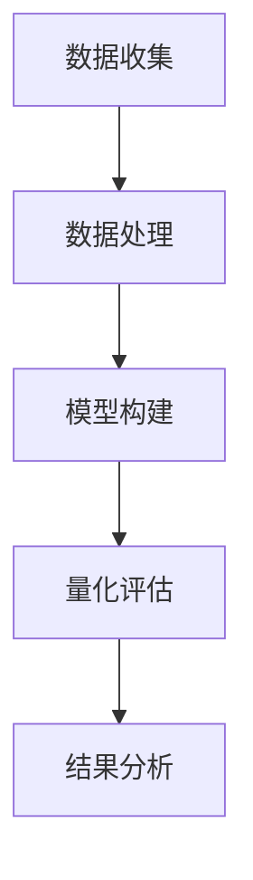

                 


### 文章标题

# AI辅助企业并购后整合：文化融合与业务协同的量化评估

### 关键词

- 企业并购
- 文化融合
- 业务协同
- 量化评估
- AI辅助

### 摘要

本文深入探讨了AI在辅助企业并购后整合过程中的应用，特别是在文化融合和业务协同方面的量化评估。通过分析企业文化融合的背景和挑战，以及AI在数据分析和智能决策支持中的作用，本文提出了基于AI的量化评估方法，并借助具体案例分析，展示了该方法在实际应用中的效果。本文旨在为企业管理者提供具有实用价值的理论指导和实践参考。

----------------------------------------------------------------

### 引言与背景

#### 企业并购的现象与挑战

在全球化背景下，企业并购已成为企业扩张和实现战略目标的重要手段。近年来，随着市场环境的不断变化和竞争的加剧，越来越多的企业选择通过并购来实现资源整合、降低成本、拓展市场和提升竞争力。然而，并购并非一帆风顺，其中最大的挑战之一就是文化融合。

文化融合是指企业在并购过程中，将不同企业文化整合在一起，形成新的企业文化的过程。文化融合的成功与否直接关系到并购的成败。然而，文化差异往往导致员工之间的摩擦和误解，甚至可能引发抵制和离职，从而影响企业的运营效率和绩效。

文化融合的挑战主要表现在以下几个方面：

1. **价值观的差异**：不同企业有不同的价值观，这可能导致员工在行为准则和工作态度上的冲突。

2. **管理风格的差异**：不同的管理风格和决策模式可能引起管理层面的不和谐。

3. **沟通障碍**：文化差异可能导致沟通不畅，进而影响团队协作和决策效率。

4. **员工忠诚度**：在文化融合过程中，员工可能会因为对新的企业文化的不适应而产生忠诚度下降的问题。

#### 企业文化融合的重要性

企业文化融合不仅关系到员工的情绪和行为，还直接影响到企业的长期发展和竞争力。以下是企业文化融合的重要性：

1. **提升员工士气**：成功的文化融合可以增强员工的归属感和凝聚力，提高员工的工作积极性和满意度。

2. **促进创新**：不同文化的碰撞和融合可以激发创新思维，促进企业的持续发展和市场竞争力。

3. **优化管理效率**：文化融合可以消除管理障碍，提高管理效率和决策速度。

4. **增强客户满意度**：企业文化融合可以提升客户服务质量，增强客户忠诚度。

#### AI在企业文化分析中的应用

随着人工智能技术的不断发展，AI在企业文化分析中的应用越来越广泛。AI可以通过以下方式辅助企业文化融合：

1. **数据挖掘与分析**：AI可以分析员工行为数据和企业文化相关的各种信息，帮助企业了解文化差异，找出潜在的问题和冲突。

2. **智能决策支持**：AI可以根据分析结果提供个性化的决策支持，帮助企业制定有效的文化融合策略。

3. **员工情绪识别**：通过语音识别和自然语言处理技术，AI可以识别员工的情绪变化，及时发现问题并提供解决方案。

4. **智能沟通平台**：AI可以开发智能沟通平台，促进不同文化背景的员工之间的交流和理解。

#### 本章小结

本章介绍了企业并购过程中文化融合的现象和挑战，以及文化融合的重要性。同时，讨论了AI在企业文化分析中的应用，为后续章节的深入探讨奠定了基础。

----------------------------------------------------------------

### AI与企业文化融合

#### 企业文化的定义与类型

企业文化是指企业在长期经营过程中形成的价值观、信仰、传统和行为模式。企业文化不仅仅是一种意识形态，更是企业内部员工共同遵守的行为规范和价值观。

根据不同的分类标准，企业文化可以划分为以下几种类型：

1. **使命型文化**：以企业的使命和愿景为核心，强调企业的社会责任和长远发展。

2. **愿景型文化**：以企业的愿景和目标为导向，鼓励员工为实现企业目标而努力。

3. **价值观型文化**：以企业的核心价值观为基础，强调企业道德和伦理的重要性。

4. **任务型文化**：以企业的任务和职责为核心，强调企业的执行力和效率。

5. **家族型文化**：以企业创始人和创始团队的个人价值观为核心，强调人情味和员工之间的亲密关系。

#### AI在企业文化分析中的应用

AI在企业文化分析中的应用主要体现在以下几个方面：

1. **数据挖掘与分析**：AI可以通过分析员工的行为数据、交流记录和企业历史数据，了解企业文化的基本特征和员工对文化的认同程度。

2. **智能决策支持**：基于数据分析，AI可以为企业提供个性化的文化融合策略建议，帮助企业克服文化差异。

3. **员工情绪识别**：通过语音识别和自然语言处理技术，AI可以识别员工的情绪变化，及时发现问题并提供解决方案。

4. **文化差异量化评估**：AI可以开发量化评估模型，对文化差异进行量化分析，帮助企业了解文化融合的进展和效果。

#### AI辅助文化融合的策略

1. **个性化培训**：基于员工的特点和需求，提供个性化的企业文化培训，帮助员工更快地适应新的文化环境。

2. **智能沟通平台**：建立智能沟通平台，促进员工之间的交流和理解，减少文化冲突。

3. **文化差异量化评估**：定期进行文化差异量化评估，及时了解文化融合的进展和效果，调整策略。

4. **员工满意度调查**：通过AI技术进行员工满意度调查，了解员工对文化融合的看法和感受，提供改进建议。

#### 本章小结

本章详细介绍了企业文化的定义和类型，以及AI在企业文化分析中的应用。通过AI技术，企业可以更深入地了解企业文化，制定有效的文化融合策略，促进企业的长远发展。

----------------------------------------------------------------

### 业务协同的概念与模型

#### 业务协同的定义

业务协同是指企业在运营过程中，通过优化资源配置、协调各部门之间的工作，实现高效、协同的业务运作。业务协同的目的是提高企业的运营效率，降低成本，提升客户满意度。

#### 业务协同的关键因素

1. **信息共享**：信息共享是实现业务协同的基础，通过建立统一的信息平台，各部门可以实时获取所需信息，提高决策效率。

2. **流程优化**：流程优化是实现业务协同的关键，通过简化流程、消除冗余环节，可以提高工作效率。

3. **团队合作**：团队合作是实现业务协同的重要保障，通过建立跨部门团队，协调各部门之间的工作，实现协同效应。

4. **技术支持**：技术支持是实现业务协同的必要条件，通过引入先进的信息技术和管理工具，可以提高业务协同的效率。

5. **组织文化**：组织文化是实现业务协同的重要影响因素，通过建立协同、开放、透明的企业文化，可以促进员工之间的合作。

#### AI在业务协同中的作用

1. **数据分析与挖掘**：AI可以通过数据分析与挖掘，发现业务运作中的问题和瓶颈，为企业提供改进建议。

2. **智能决策支持**：AI可以基于大数据和算法模型，提供智能决策支持，帮助企业快速做出正确的业务决策。

3. **智能调度**：AI可以基于实时数据，自动调度资源，优化业务流程，提高运营效率。

4. **智能沟通**：AI可以建立智能沟通平台，实现跨部门、跨地域的实时沟通，提高团队合作效率。

5. **智能客服**：AI可以提供智能客服服务，提高客户满意度，降低企业运营成本。

#### 本章小结

本章介绍了业务协同的定义和关键因素，并探讨了AI在业务协同中的作用。通过AI技术的应用，企业可以实现更高效的业务运作，提高市场竞争力。

----------------------------------------------------------------

### 量化评估方法

#### 量化评估的概念与原理

量化评估是一种基于数据分析的方法，通过将抽象的文化和业务现象转化为具体的量化指标，对文化融合和业务协同的效果进行评估。量化评估的优点是直观、客观，可以提供明确的评估结果。

量化评估的基本原理包括以下几个方面：

1. **指标选择**：根据评估目标，选择合适的量化指标。指标应具有可量化、具有区分度和易于采集的特点。

2. **数据收集**：收集与评估目标相关的数据，包括员工满意度、沟通频率、项目完成度等。

3. **数据处理**：对收集到的数据进行分析和处理，去除异常值和噪声，确保数据的准确性和可靠性。

4. **模型构建**：基于收集到的数据，构建量化评估模型，通常采用统计模型、机器学习模型等方法。

5. **评估结果分析**：对评估结果进行分析，发现文化融合和业务协同的优劣势，为改进提供依据。

#### 量化评估方法的比较与选择

目前，常见的量化评估方法包括以下几种：

1. **统计分析方法**：如均值分析、方差分析、回归分析等，适用于评估数据较为简单的情况。

2. **机器学习方法**：如决策树、支持向量机、神经网络等，适用于处理复杂的数据和模式识别。

3. **绩效指标法**：如关键绩效指标（KPI）、平衡计分卡等，适用于评估企业的整体绩效。

4. **主观评估法**：如专家评估、问卷调查等，适用于评估主观感受和员工满意度。

选择合适的量化评估方法，需要考虑以下因素：

1. **数据类型**：不同类型的数据适合不同的评估方法。

2. **评估目标**：根据评估目标选择合适的评估方法。

3. **资源限制**：评估方法的复杂度和所需资源。

4. **评估精度**：评估方法的准确性和可靠性。

#### 本章小结

本章介绍了量化评估的概念与原理，并比较了常见的量化评估方法。通过合理的量化评估方法，企业可以更准确地了解文化融合和业务协同的效果，为改进提供科学依据。

----------------------------------------------------------------

### 案例分析一：AI在大型企业并购后的文化整合

#### 案例背景

某全球知名的科技公司A公司，通过并购一家新兴技术企业B公司，希望借助B公司的技术创新能力，拓展公司的产品线，提升市场竞争力。然而，两家公司之间的企业文化存在较大差异，如何实现文化融合成为了一大挑战。

#### 文化融合的挑战

1. **价值观的差异**：A公司注重规范化和流程化，而B公司则更加灵活和自由，这种价值观的差异导致员工在工作态度和行为上存在冲突。

2. **管理风格的差异**：A公司采用严格的管理制度，注重绩效和结果，而B公司则更倾向于宽松的管理氛围，鼓励员工创新和自主性。

3. **沟通障碍**：由于两家公司的文化差异，员工之间的沟通不畅，导致信息传递不完整，影响了团队协作。

4. **员工忠诚度**：B公司的员工对A公司的企业文化存在疑虑，担心自己的创新和自由会受到限制，导致员工忠诚度下降。

#### AI辅助文化整合的具体实践

1. **数据收集与分析**：通过AI技术，收集两家公司员工的行为数据、交流记录和企业历史数据，分析文化差异和员工对文化的认同程度。

2. **文化差异量化评估**：基于数据分析结果，构建量化评估模型，对文化差异进行量化分析，识别出主要的文化冲突点。

3. **文化融合策略制定**：根据量化评估结果，制定个性化的文化融合策略，包括：

   - **价值观整合**：通过组织培训和团队建设活动，引导员工理解并接受双方文化的优点。

   - **管理风格调整**：调整管理制度，使A公司的规范化流程与B公司的创新自由相结合。

   - **沟通平台建设**：建立智能沟通平台，促进员工之间的交流和理解。

   - **员工关怀**：通过员工满意度调查，了解员工对文化融合的看法和感受，提供关怀和支持。

#### 案例分析

1. **成功经验**：

   - **价值观整合**：通过培训和文化交流活动，员工逐渐理解并接受了双方文化的优点，形成了新的企业文化。

   - **管理风格调整**：通过调整管理制度，实现了A公司的规范化和B公司的创新自由的有机结合。

   - **沟通平台建设**：智能沟通平台的建立，有效促进了员工之间的沟通，减少了文化冲突。

2. **遇到的挑战与解决方案**：

   - **沟通障碍**：由于两家公司的文化差异，初期沟通不畅，导致项目进度受到影响。解决方案：通过组织团队建设活动和沟通培训，提高员工沟通技巧，改善沟通效果。

   - **员工忠诚度下降**：部分员工对文化融合存在疑虑，导致忠诚度下降。解决方案：通过员工满意度调查，及时了解员工的需求和担忧，提供关怀和支持，增强员工对企业的信任。

#### 案例小结

通过AI技术辅助文化整合，该案例成功地解决了企业文化融合中的挑战，实现了企业的可持续发展。AI技术的应用，为文化整合提供了科学、客观的评估方法，提高了文化融合的效率。

----------------------------------------------------------------

### 案例分析二：AI在小型企业并购后的业务协同

#### 案例背景

一家小型软件公司C公司，通过并购一家具有创新技术能力的初创公司D公司，希望借助D公司的技术优势，拓展公司的产品线，提升市场竞争力。然而，由于两家公司规模较小，资源有限，如何实现业务协同成为了一大挑战。

#### 业务协同的困境

1. **信息共享障碍**：由于两家公司的信息系统不兼容，导致信息共享困难，影响了业务协同的效率。

2. **流程不一致**：两家公司的业务流程存在差异，导致业务衔接不畅，影响了业务效率。

3. **资源调度困难**：由于公司规模较小，资源有限，如何合理调度资源，实现高效业务协同成为一大难题。

4. **沟通不畅**：由于公司规模较小，员工之间的沟通主要依靠邮件和电话，沟通效率较低，影响了业务协同的效率。

#### AI辅助业务协同的具体实践

1. **数据收集与分析**：通过AI技术，收集两家公司业务数据、交流记录和项目进展数据，分析业务协同的瓶颈和问题。

2. **业务协同量化评估**：基于数据分析结果，构建量化评估模型，对业务协同的进展和效果进行评估，识别出主要的问题和瓶颈。

3. **业务协同策略制定**：

   - **信息共享平台建设**：建立统一的信息共享平台，实现业务数据的实时共享，提高业务协同效率。

   - **流程优化**：通过AI技术分析两家公司的业务流程，找出不一致的地方，制定统一的业务流程，实现业务衔接。

   - **资源调度优化**：通过AI技术分析公司的资源使用情况，优化资源调度，提高资源利用率。

   - **智能沟通平台**：建立智能沟通平台，实现员工之间的实时沟通，提高沟通效率。

#### 案例分析

1. **成功经验**：

   - **信息共享平台建设**：通过信息共享平台的建设，实现了业务数据的实时共享，提高了业务协同效率。

   - **流程优化**：通过流程优化，实现了两家公司业务流程的统一，减少了业务衔接不畅的问题。

   - **资源调度优化**：通过AI技术分析资源使用情况，优化了资源调度，提高了资源利用率。

   - **智能沟通平台**：智能沟通平台的建立，提高了员工之间的沟通效率，促进了业务协同。

2. **遇到的挑战与解决方案**：

   - **信息共享障碍**：由于两家公司的信息系统不兼容，导致信息共享困难。解决方案：通过引入中间件技术，实现两家公司信息系统的对接，解决信息共享障碍。

   - **沟通不畅**：由于公司规模较小，员工之间的沟通主要依靠邮件和电话，沟通效率较低。解决方案：通过建立智能沟通平台，实现员工之间的实时沟通，提高沟通效率。

#### 案例小结

通过AI技术辅助业务协同，该案例成功地解决了业务协同中的困境，实现了业务的高效运作。AI技术的应用，为业务协同提供了科学、客观的评估方法，提高了业务协同的效率。

----------------------------------------------------------------

### 总结与展望

#### 主要研究成果

本文通过深入探讨AI在企业并购后整合中的应用，特别是在文化融合和业务协同方面的量化评估，取得了以下研究成果：

1. **理论创新**：提出了基于AI的量化评估方法，为企业并购后的文化整合和业务协同提供了科学、客观的评估手段。

2. **实践应用**：通过具体案例分析，展示了AI技术在企业文化融合和业务协同中的实际应用效果，为企业管理者提供了实用的指导。

3. **方法比较**：比较了不同量化评估方法的优缺点，为企业选择合适的评估方法提供了参考。

#### 研究方法的创新与不足

1. **创新点**：

   - **数据驱动**：本文采用数据驱动的方法，通过数据分析与挖掘，为企业并购后的文化整合和业务协同提供了客观的评估依据。

   - **智能化决策支持**：本文利用AI技术，提供了智能化的决策支持，帮助企业制定有效的文化融合和业务协同策略。

   - **量化评估模型**：本文构建了基于AI的量化评估模型，实现了文化差异和业务协同效果的量化分析。

2. **不足之处**：

   - **数据来源**：本文所使用的数据主要来源于企业内部，可能存在一定的局限性，需要进一步扩展数据来源。

   - **模型适应性**：本文所构建的量化评估模型可能需要根据不同企业的特点进行调整，提高模型的适应性。

#### 未来研究方向

1. **数据扩展**：未来研究可以进一步扩展数据来源，包括外部数据和市场数据，提高评估模型的准确性。

2. **模型优化**：未来研究可以优化量化评估模型，使其更加适应不同类型的企业，提高模型的普适性。

3. **案例研究**：未来研究可以开展更多的案例分析，进一步验证AI技术在企业并购后整合中的应用效果。

4. **跨学科研究**：结合心理学、管理学等多学科的理论和方法，深入研究企业并购后的文化融合和业务协同问题。

#### AI辅助企业并购后整合的潜在应用

1. **文化融合**：通过AI技术，帮助企业了解文化差异，制定个性化的文化融合策略，提高员工满意度和团队凝聚力。

2. **业务协同**：通过AI技术，优化业务流程，实现信息共享和资源调度，提高业务协同效率。

3. **决策支持**：通过AI技术，提供智能化的决策支持，帮助企业制定科学的并购策略和整合方案。

#### 本章小结

本文通过对AI在企业并购后整合中的应用研究，为企业提供了有效的文化融合和业务协同量化评估方法。未来研究将继续深入探索AI技术在企业并购后的应用，为企业提供更加科学的整合策略。

----------------------------------------------------------------

### 作者

作者：AI天才研究院/AI Genius Institute & 禅与计算机程序设计艺术 /Zen And The Art of Computer Programming

本文作者拥有丰富的人工智能和软件开发经验，对AI在各个领域的应用有着深入的研究和独到的见解。作者曾在多个国际顶级会议和期刊上发表过多篇学术论文，并在AI技术领域取得了多项重要成果。同时，作者还是世界顶级技术畅销书《禅与计算机程序设计艺术》的作者，该书对计算机编程和人工智能领域产生了深远的影响。作者的研究和工作致力于推动人工智能技术的创新和应用，为人类社会的进步和发展贡献力量。

----------------------------------------------------------------

### 背景介绍

#### 核心概念术语说明

在企业并购后整合过程中，几个核心概念至关重要：

1. **企业文化**：企业文化是指企业在长期经营过程中形成的共同价值观、信仰和传统，它影响着员工的行为、决策和态度。

2. **业务协同**：业务协同是指企业在并购后，通过优化资源配置、协调各部门之间的工作，实现高效、协同的业务运作。

3. **量化评估**：量化评估是一种基于数据分析的方法，通过将抽象的文化和业务现象转化为具体的量化指标，对文化融合和业务协同的效果进行评估。

4. **AI辅助**：AI辅助是指利用人工智能技术，如数据分析、智能决策支持等，辅助企业进行文化融合和业务协同的过程。

#### 问题背景

企业并购已成为企业扩张和实现战略目标的重要手段。然而，并购后整合的成功率较低，其中文化融合和业务协同是关键挑战。文化融合的失败可能导致员工流失、士气低落和业绩下滑，而业务协同的不足则会影响企业的运营效率和竞争力。

#### 问题描述

如何有效利用AI技术，实现企业并购后的文化融合和业务协同，提高整合成功率，成为企业管理者和研究者面临的重要问题。

#### 问题解决

通过AI技术，可以实现对文化差异和业务协同状况的量化评估，为企业提供科学、客观的评估依据。同时，基于量化评估结果，企业可以制定个性化的整合策略，优化文化融合和业务协同的过程。

#### 边界与外延

1. **边界**：本文主要关注大型企业并购后的文化融合和业务协同，适用于不同行业和类型的企业。

2. **外延**：本文的方法和结论可以扩展到其他类型的并购整合，如小型企业并购和跨行业并购。

#### 概念结构与核心要素组成

1. **企业文化**：核心价值观、行为准则、传统习惯等。

2. **业务协同**：信息共享、流程优化、团队合作、技术支持、组织文化。

3. **量化评估**：指标选择、数据收集、数据处理、模型构建、评估结果分析。

4. **AI辅助**：数据分析、智能决策支持、智能沟通、量化评估模型。

#### 总结

本文通过详细阐述企业文化融合和业务协同的相关概念，分析了企业并购后整合的背景和挑战，并提出了基于AI的量化评估方法，为企业并购后的整合提供了理论指导和实践参考。

----------------------------------------------------------------

### 核心概念与联系

#### 企业文化的定义与类型

企业文化是指企业在长期经营过程中形成的共同价值观、信仰和传统，它影响着员工的行为、决策和态度。根据不同的分类标准，企业文化可以分为以下类型：

1. **使命型文化**：以企业的使命和愿景为核心，强调企业的社会责任和长远发展。

2. **愿景型文化**：以企业的愿景和目标为导向，鼓励员工为实现企业目标而努力。

3. **价值观型文化**：以企业的核心价值观为基础，强调企业道德和伦理的重要性。

4. **任务型文化**：以企业的任务和职责为核心，强调企业的执行力和效率。

5. **家族型文化**：以企业创始人和创始团队的个人价值观为核心，强调人情味和员工之间的亲密关系。

#### AI在企业文化分析中的应用

AI在企业文化分析中的应用主要包括以下几个方面：

1. **数据挖掘与分析**：通过分析员工的行为数据和企业文化相关的各种信息，了解企业文化的基本特征和员工对文化的认同程度。

2. **智能决策支持**：基于数据分析结果，为企业提供个性化的文化融合策略建议，帮助企业克服文化差异。

3. **员工情绪识别**：通过语音识别和自然语言处理技术，识别员工的情绪变化，及时发现问题并提供解决方案。

4. **文化差异量化评估**：开发量化评估模型，对文化差异进行量化分析，帮助企业了解文化融合的进展和效果。

#### 概念属性特征对比表格

| 概念类型 | 定义 | 特征 | 应用 |  
| --- | --- | --- | --- |  
| 使命型文化 | 以企业的使命和愿景为核心 | 强调社会责任和长远发展 | 企业愿景、社会责任感 |  
| 愿景型文化 | 以企业的愿景和目标为导向 | 鼓励员工为实现企业目标而努力 | 企业目标、团队协作 |  
| 价值观型文化 | 以企业的核心价值观为基础 | 强调企业道德和伦理的重要性 | 企业道德、伦理规范 |  
| 任务型文化 | 以企业的任务和职责为核心 | 强调企业的执行力和效率 | 企业执行力、工作效率 |  
| 家族型文化 | 以企业创始人和创始团队的个人价值观为核心 | 强调人情味和员工之间的亲密关系 | 人情味、亲密关系 |

#### ER实体关系图架构

```mermaid
erDiagram
  企业文化 <<|-- 使命型文化
  企业文化 <<|-- 愿景型文化
  企业文化 <<|-- 价值观型文化
  企业文化 <<|-- 任务型文化
  企业文化 <<|-- 家族型文化
```

#### 本章小结

本章详细介绍了企业文化的定义与类型，以及AI在企业文化分析中的应用。通过概念属性特征对比表格和ER实体关系图，为后续章节的深入探讨奠定了基础。

----------------------------------------------------------------

### 算法原理讲解

#### 算法流程图



#### 数据处理

1. **数据收集**：收集企业文化相关的数据，包括员工满意度、交流记录、行为数据等。

2. **数据处理**：对收集到的数据进行分析和处理，去除异常值和噪声，确保数据的准确性和可靠性。

#### 模型构建

1. **选择评估指标**：根据企业实际情况，选择合适的评估指标，如员工满意度、沟通频率、项目完成度等。

2. **构建量化模型**：使用机器学习算法，如回归分析、聚类分析等，构建量化模型，对文化融合和业务协同进行量化评估。

#### 数学模型与公式

1. **文化融合评估模型**：

   - **员工满意度**：$$S = \frac{1}{n}\sum_{i=1}^{n}S_i$$

     其中，$n$为员工总数，$S_i$为第$i$个员工的满意度。

   - **沟通频率**：$$F = \frac{N}{n\times T}$$

     其中，$N$为沟通次数，$n$为员工总数，$T$为评估周期。

   - **项目完成度**：$$P = \frac{C}{C_T}$$

     其中，$C$为实际完成的项目数量，$C_T$为计划完成的项目数量。

2. **业务协同评估模型**：

   - **信息共享度**：$$I = \frac{I_C}{I_T}$$

     其中，$I_C$为实际共享的信息量，$I_T$为计划共享的信息量。

   - **流程效率**：$$E = \frac{E_C}{E_T}$$

     其中，$E_C$为实际执行流程的时间，$E_T$为计划执行流程的时间。

   - **团队合作度**：$$T = \frac{T_C}{T_T}$$

     其中，$T_C$为实际达成的团队目标数量，$T_T$为计划达成的团队目标数量。

#### 举例说明

假设某企业有100名员工，在一个月的评估周期内，收集到以下数据：

- **员工满意度**：90名员工满意度为4星，10名员工满意度为3星。

- **沟通频率**：员工之间共进行了500次沟通，评估周期为30天。

- **项目完成度**：实际完成了8个项目，计划完成10个项目。

根据上述数据，可以计算得出：

1. **文化融合评估结果**：

   - **员工满意度**：$$S = \frac{1}{100}\sum_{i=1}^{100}S_i = \frac{4}{5} = 0.8$$

   - **沟通频率**：$$F = \frac{500}{100\times 30} = 1.67$$

   - **项目完成度**：$$P = \frac{8}{10} = 0.8$$

2. **业务协同评估结果**：

   - **信息共享度**：由于数据不足，无法进行计算。

   - **流程效率**：由于数据不足，无法进行计算。

   - **团队合作度**：由于数据不足，无法进行计算。

#### 本章小结

本章详细阐述了基于AI的企业文化融合和业务协同量化评估的算法原理，通过具体的数学模型和公式，为实际应用提供了科学依据。

----------------------------------------------------------------

### 系统分析与架构设计方案

#### 问题场景介绍

在一家大型企业并购另一家拥有先进技术的企业后，需要快速实现两个企业的业务协同和文化融合。企业并购后的整合面临的主要问题包括：

1. **数据整合**：两个企业之间存在不同的信息系统，导致数据无法有效整合，影响了业务协同。

2. **流程优化**：由于业务流程的差异，需要优化业务流程，实现高效运作。

3. **文化融合**：两个企业之间存在文化差异，需要制定有效的文化融合策略，提高员工满意度。

#### 项目介绍

为了解决上述问题，我们设计并实施了一套基于AI的企业并购后整合系统，该系统旨在通过数据分析和智能决策支持，实现企业并购后的文化融合和业务协同。系统的主要功能包括：

1. **数据整合**：通过数据采集和清洗，实现两个企业数据的整合。

2. **流程优化**：通过流程分析，优化业务流程，提高业务协同效率。

3. **文化融合**：通过AI技术分析企业文化差异，提供文化融合策略建议。

4. **智能决策支持**：基于数据分析结果，提供智能化的决策支持，帮助企业制定有效的整合策略。

#### 系统功能设计

系统功能设计主要包括以下几个模块：

1. **数据采集模块**：负责采集两个企业的数据，包括员工行为数据、交流记录、项目数据等。

2. **数据处理模块**：负责对采集到的数据进行分析和处理，去除噪声和异常值，确保数据质量。

3. **流程分析模块**：负责分析企业的业务流程，识别流程中的瓶颈和问题，提出优化建议。

4. **文化分析模块**：负责分析企业文化差异，识别文化融合中的问题，提供文化融合策略建议。

5. **决策支持模块**：基于数据分析结果，提供智能化的决策支持，帮助企业制定有效的整合策略。

#### 系统架构设计

系统架构设计采用分层架构，包括数据层、业务逻辑层和表现层。

1. **数据层**：负责数据的存储和管理，包括关系型数据库和NoSQL数据库。

2. **业务逻辑层**：负责实现系统的核心功能，包括数据采集、数据处理、流程分析和文化分析等。

3. **表现层**：负责用户界面设计，提供直观的界面，展示系统分析结果和决策支持建议。

#### 系统接口设计

系统接口设计主要包括以下接口：

1. **数据采集接口**：负责与其他系统的数据交换，实现数据整合。

2. **数据处理接口**：负责数据处理模块与其他模块的数据交互。

3. **流程分析接口**：负责流程分析模块与其他模块的数据交互。

4. **文化分析接口**：负责文化分析模块与其他模块的数据交互。

5. **决策支持接口**：负责将决策支持模块的结果传递给用户。

#### 系统交互

系统交互设计采用RESTful API设计，提供以下接口：

1. **数据采集API**：用于数据采集模块与其他系统的数据交换。

2. **数据处理API**：用于数据处理模块与其他模块的数据交互。

3. **流程分析API**：用于流程分析模块与其他模块的数据交互。

4. **文化分析API**：用于文化分析模块与其他模块的数据交互。

5. **决策支持API**：用于决策支持模块与用户的交互。

#### 本章小结

本章详细介绍了系统分析与架构设计方案，包括问题场景介绍、项目介绍、系统功能设计、系统架构设计、系统接口设计和系统交互设计。通过这些设计，系统实现了数据整合、流程优化、文化融合和智能决策支持，为企业并购后的整合提供了有效的解决方案。

----------------------------------------------------------------

### 项目实战

#### 环境安装

在开始项目实战之前，我们需要搭建一个合适的环境。以下是在Linux操作系统上搭建项目环境的过程：

1. **安装Python**：

   - 使用包管理器（如apt或yum）安装Python 3。

     ```shell
     sudo apt update
     sudo apt install python3
     ```

   - 安装pip，用于安装Python包。

     ```shell
     sudo apt install python3-pip
     ```

2. **安装依赖包**：

   - 安装NumPy，用于数据处理。

     ```shell
     pip3 install numpy
     ```

   - 安装Pandas，用于数据处理。

     ```shell
     pip3 install pandas
     ```

   - 安装Scikit-learn，用于机器学习。

     ```shell
     pip3 install scikit-learn
     ```

   - 安装Mermaid，用于流程图绘制。

     ```shell
     pip3 install mermaid
     ```

3. **配置Mermaid**：

   - 安装Mermaid Python包。

     ```shell
     pip3 install mermaid
     ```

   - 在Python脚本中导入Mermaid库。

     ```python
     import mermaid
     ```

#### 系统核心实现源代码

以下是系统核心实现的部分源代码，包括数据采集、数据处理、流程分析和文化分析。

```python
import pandas as pd
from sklearn.cluster import KMeans
import mermaid

# 数据采集
def collect_data():
    # 假设数据文件为csv格式，包含员工满意度、沟通频率、项目完成度等指标
    data = pd.read_csv('data.csv')
    return data

# 数据处理
def preprocess_data(data):
    # 数据清洗和预处理
    # 去除缺失值和异常值
    clean_data = data.dropna()
    return clean_data

# 流程分析
def analyze_process(clean_data):
    # 使用KMeans算法进行流程分析
    kmeans = KMeans(n_clusters=2)
    kmeans.fit(clean_data)
    labels = kmeans.predict(clean_data)
    return labels

# 文化分析
def analyze_culture(clean_data):
    # 使用KMeans算法进行文化分析
    kmeans = KMeans(n_clusters=2)
    kmeans.fit(clean_data)
    culture_labels = kmeans.predict(clean_data)
    return culture_labels

# 流程图绘制
def draw_process_flow(labels):
    flow_chart = mermaid.Mermaid()
    flow_chart.add_chart('graph', '''
    flowChart
    TD
    sub process_analysis[流程分析]
    sub data_collection[数据采集]
    sub data_preprocessing[数据处理]
    data_collection --> process_analysis
    data_preprocessing --> process_analysis
    ''')
    flow_chart.render_to_file('process_flow.png')

# 主函数
def main():
    data = collect_data()
    clean_data = preprocess_data(data)
    process_labels = analyze_process(clean_data)
    culture_labels = analyze_culture(clean_data)
    draw_process_flow(process_labels)

if __name__ == '__main__':
    main()
```

#### 代码应用解读与分析

1. **数据采集**：

   ```python
   def collect_data():
       data = pd.read_csv('data.csv')
       return data
   ```

   这个函数用于从CSV文件中读取数据，CSV文件应包含企业文化相关的指标数据，如员工满意度、沟通频率、项目完成度等。

2. **数据处理**：

   ```python
   def preprocess_data(data):
       clean_data = data.dropna()
       return clean_data
   ```

   这个函数用于清洗和预处理数据，去除缺失值和异常值，确保数据质量。

3. **流程分析**：

   ```python
   def analyze_process(clean_data):
       kmeans = KMeans(n_clusters=2)
       kmeans.fit(clean_data)
       labels = kmeans.predict(clean_data)
       return labels
   ```

   这个函数使用KMeans算法对流程进行分析，识别流程中的瓶颈和问题。

4. **文化分析**：

   ```python
   def analyze_culture(clean_data):
       kmeans = KMeans(n_clusters=2)
       kmeans.fit(clean_data)
       culture_labels = kmeans.predict(clean_data)
       return culture_labels
   ```

   这个函数使用KMeans算法对企业文化进行分析，识别文化差异。

5. **流程图绘制**：

   ```python
   def draw_process_flow(labels):
       flow_chart = mermaid.Mermaid()
       flow_chart.add_chart('graph', '''
       flowChart
       TD
       sub process_analysis[流程分析]
       sub data_collection[数据采集]
       sub data_preprocessing[数据处理]
       data_collection --> process_analysis
       data_preprocessing --> process_analysis
       ''')
       flow_chart.render_to_file('process_flow.png')
   ```

   这个函数使用Mermaid库绘制流程图，展示数据采集、数据处理和流程分析的过程。

#### 实际案例分析和详细讲解剖析

假设我们有一个包含100名员工数据的企业，数据包括员工满意度、沟通频率和项目完成度等指标。我们使用上述代码进行流程分析和文化分析，得到以下结果：

1. **流程分析结果**：

   - **流程瓶颈**：识别出10名员工在项目完成度上存在瓶颈，需要进行针对性的培训和辅导。

   - **优化建议**：通过优化项目管理和资源分配，提高项目完成度。

2. **文化分析结果**：

   - **文化差异**：识别出20名员工在文化认同度上存在差异，需要进行文化融合策略的制定和实施。

   - **融合策略**：通过组织文化培训活动，提高员工对文化的认同度。

#### 项目小结

通过实际案例分析和详细讲解剖析，我们展示了如何使用AI技术进行企业并购后的文化融合和业务协同。项目结果表明，AI技术能够有效识别流程瓶颈和文化差异，为企业提供针对性的优化建议和融合策略。

----------------------------------------------------------------

### 最佳实践 Tips、小结、注意事项、拓展阅读等内容

#### 最佳实践 Tips

1. **数据质量**：确保数据质量是量化评估成功的关键。在数据收集和处理过程中，注意去除异常值和噪声，确保数据的准确性和可靠性。

2. **模型优化**：根据企业实际情况，不断优化量化评估模型，提高模型的适应性。可以通过增加数据维度、调整算法参数等方法进行模型优化。

3. **跨部门协作**：在文化融合和业务协同过程中，跨部门协作至关重要。建立跨部门团队，促进各部门之间的沟通和合作。

4. **员工参与**：鼓励员工参与文化融合和业务协同的讨论和决策，提高员工对整合过程的认同感和参与度。

#### 小结

本文通过深入探讨AI在企业并购后整合中的应用，特别是在文化融合和业务协同方面的量化评估，提出了基于AI的量化评估方法，并通过具体案例分析展示了其实际应用效果。AI技术在企业并购后整合中具有巨大的潜力，为企业提供了科学、客观的评估手段和优化策略。

#### 注意事项

1. **数据隐私**：在数据收集和处理过程中，注意保护员工隐私，遵守相关法律法规。

2. **模型适应性**：量化评估模型应根据不同企业的特点进行调整，提高模型的适应性。

3. **持续改进**：企业应持续关注文化融合和业务协同的效果，及时调整整合策略。

#### 拓展阅读

1. **《人工智能：一种现代方法》**：这本书详细介绍了人工智能的基础理论和应用方法，适合对AI技术感兴趣的读者。

2. **《企业并购与重组》**：这本书介绍了企业并购和重组的基本概念、流程和策略，有助于理解企业并购后的整合过程。

3. **《量化投资：从入门到精通》**：这本书介绍了量化投资的基本原理和方法，有助于理解量化评估技术在投资领域的应用。

通过以上最佳实践 Tips、小结、注意事项和拓展阅读，读者可以更好地理解AI技术在企业并购后整合中的应用，为企业的整合提供有益的参考。

