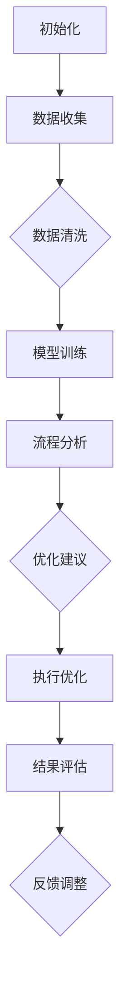
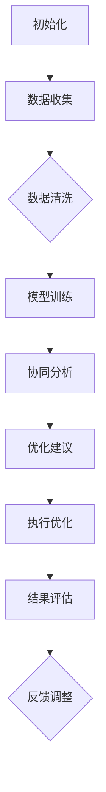
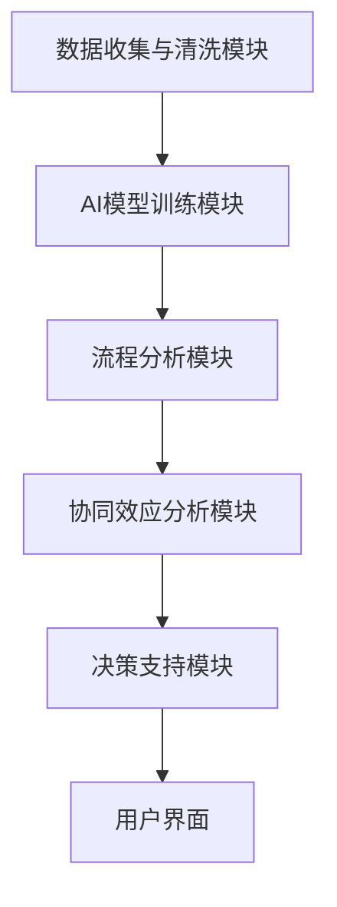

                 

# AI辅助企业并购后整合：流程优化与协同效应

## 关键词

- 人工智能
- 企业并购
- 整合流程
- 流程优化
- 协同效应
- 数据挖掘
- 决策支持
- 自动化

## 摘要

本文探讨了人工智能在企业并购后整合过程中的应用，重点分析了流程优化和协同效应的重要性。通过引入人工智能大模型，企业可以实现对并购后业务流程的深度分析和优化，实现资源的最大化利用和运营效率的提升。本文从背景介绍、核心概念与联系、算法原理讲解、系统分析与架构设计方案、项目实战和最佳实践等方面，全面阐述了AI辅助企业并购后整合的实践路径和策略。

## 第1章：背景介绍

### 1.1 问题背景

随着全球经济的发展和市场竞争的加剧，企业并购已成为企业扩展市场、提高竞争力的重要手段。然而，并购后的整合工作却面临诸多挑战。传统的整合方法往往依赖于经验和直觉，难以应对复杂的整合任务。随着人工智能技术的快速发展，人工智能在企业并购后整合中的应用逐渐受到重视。人工智能可以为企业提供自动化、智能化的整合方案，提高整合效率，降低成本。

### 1.2 问题描述

企业并购后整合通常涉及多个方面，包括人力资源整合、企业文化融合、组织结构优化、业务流程整合等。这些问题具有以下特点：

1. **复杂性**：整合工作涉及多个部门、多个系统和多个层面的工作，任务复杂。
2. **挑战性**：整合过程中可能面临文化冲突、资源分配不合理、流程不顺畅等问题，挑战性强。
3. **紧迫性**：企业希望尽快完成整合，以实现预期的业务目标，但整合过程往往需要时间和耐心。

### 1.3 问题解决

引入人工智能技术，可以为企业提供以下解决方案：

1. **流程优化**：利用人工智能技术对企业现有业务流程进行深度分析，找出瓶颈和改进点，实现流程优化。
2. **协同效应**：通过人工智能技术实现不同部门、不同系统的信息共享和协同工作，提高整体运营效率。
3. **数据驱动决策**：利用人工智能技术对海量数据进行挖掘和分析，为企业提供决策支持，降低决策风险。

### 1.4 边界与外延

1. **边界**：本文主要关注企业并购后整合过程中的流程优化和协同效应，不包括其他方面的整合问题，如企业文化融合、组织结构优化等。
2. **外延**：本文还将探讨人工智能技术在企业并购后整合中的应用，以及如何通过人工智能实现流程优化和协同效应。

### 1.5 概念结构与核心要素组成

1. **核心概念**：人工智能、企业并购、整合流程、流程优化、协同效应。
2. **概念属性特征对比表格**：

| 核心概念 | 定义 | 属性特征 |
| :---: | :---: | :---: |
| 人工智能 | 一种模拟人类智能的技术 | 自主学习、智能推理、自主决策等 |
| 企业并购 | 两个或多个企业合并为一个企业 | 资源整合、市场扩展、降低成本等 |
| 整合流程 | 企业并购后实现资源、人员、业务整合的过程 | 流程优化、协同效应、文化融合等 |
| 流程优化 | 对企业现有业务流程进行改进，提高效率 | 瓶颈分析、流程重构、自动化等 |
| 协同效应 | 企业内部不同部门、系统之间的协同工作，提高整体运营效率 | 信息共享、资源优化、决策支持等 |

### 1.6 ER实体关系图架构

```mermaid
erDiagram
    AI技术 ||--o{ 企业并购 }: 利用
    企业并购 ||--|{ 整合流程 }: 实现整合
    整合流程 ||--|{ 流程优化 }: 提高效率
    整合流程 ||--|{ 协同效应 }: 提高运营效率
```

## 第2章：核心概念与联系

### 2.1 AI大模型的定义与特点

#### 2.1.1 定义

AI大模型，通常指的是具有数十亿至数千亿参数的大规模深度学习模型。这类模型通过在海量数据上进行训练，可以掌握复杂的模式和知识，从而实现高精度的预测和决策。

#### 2.1.2 特点

1. **参数规模大**：AI大模型具有数亿甚至千亿级别的参数量，这使得它们能够处理复杂的数据特征。
2. **训练数据量巨大**：AI大模型需要大量的训练数据来训练，以确保模型的泛化能力。
3. **计算资源需求高**：由于参数量大、训练数据量巨大，AI大模型的训练过程通常需要大量的计算资源和时间。
4. **应用范围广泛**：AI大模型在各个领域都有广泛的应用，如自然语言处理、计算机视觉、语音识别等。

### 2.2 企业并购与整合流程

#### 2.2.1 定义

企业并购是指两个或多个企业合并成为一个新的企业。整合流程则是指在企业并购后，将两个或多个企业的资源、人员、业务等进行融合和优化的过程。

#### 2.2.2 关系

AI大模型在企业并购后整合流程中发挥着重要作用。通过AI大模型，企业可以实现以下目标：

1. **流程优化**：AI大模型可以分析现有业务流程，找出瓶颈和改进点，从而实现流程优化。
2. **协同效应**：AI大模型可以帮助企业实现不同部门、不同系统的信息共享和协同工作，提高整体运营效率。
3. **数据驱动决策**：AI大模型可以对海量数据进行挖掘和分析，为企业提供决策支持。

### 2.3 流程优化与协同效应

#### 2.3.1 定义

流程优化是指对企业现有的业务流程进行改进，以提高效率和效果。协同效应是指企业内部不同部门、系统之间的协同工作，以提高整体运营效率。

#### 2.3.2 关系

流程优化与协同效应是密不可分的。通过流程优化，企业可以提高效率，减少浪费，从而实现资源的最大化利用。而协同效应则是通过不同部门、系统之间的协同工作，提高整体运营效率。

## 第3章：算法原理讲解

### 3.1 AI大模型在流程优化中的应用

#### 3.1.1 原理

AI大模型在流程优化中的应用，主要基于其强大的数据处理和分析能力。具体来说，AI大模型可以对企业现有的业务流程进行深度分析，识别出瓶颈和改进点。通过数据驱动的分析，AI大模型可以为企业提供优化的建议，从而实现流程优化。

#### 3.1.2 数学模型

为了更好地理解AI大模型在流程优化中的应用，我们可以引入一个简单的数学模型。假设企业有一个业务流程，包含多个任务节点。每个任务节点的完成时间、资源消耗等都可以用数学模型来表示。通过优化这些任务节点的安排，可以最大限度地提高流程的效率。

设企业有 \( n \) 个任务节点，任务节点的完成时间为 \( T_i \)，资源消耗为 \( R_i \)。目标是最小化总完成时间 \( T \) 和总资源消耗 \( R \)。数学模型可以表示为：

$$
\min T, \min R
$$

$$
T = \sum_{i=1}^{n} T_i
$$

$$
R = \sum_{i=1}^{n} R_i
$$

#### 3.1.3 算法流程图

为了便于理解，我们可以使用Mermaid绘制算法流程图：



### 3.2 AI大模型在协同效应中的应用

#### 3.2.1 原理

AI大模型在协同效应中的应用，主要基于其强大的信息处理和知识推理能力。通过AI大模型，企业可以实现不同部门、不同系统之间的信息共享和协同工作，提高整体运营效率。

#### 3.2.2 数学模型

为了更好地理解AI大模型在协同效应中的应用，我们可以引入一个简单的数学模型。假设企业有多个部门，每个部门都有一个绩效指标。通过AI大模型，企业可以分析不同部门之间的协同关系，优化部门间的资源分配，从而提高整体绩效。

设企业有 \( m \) 个部门，部门 \( i \) 的绩效指标为 \( P_i \)。目标是最小化整体绩效损失 \( L \)。数学模型可以表示为：

$$
\min L
$$

$$
L = \sum_{i=1}^{m} (P_i - P_{i_{opt}})
$$

其中，\( P_{i_{opt}} \) 是通过AI大模型优化后的部门绩效指标。

#### 3.2.3 算法流程图

为了便于理解，我们可以使用Mermaid绘制算法流程图：



## 第4章：系统分析与架构设计方案

### 4.1 问题场景介绍

假设某企业刚刚完成了一项大型并购，需要对新的业务流程进行整合。企业的业务流程包括订单管理、库存管理、财务管理等多个模块。在整合过程中，企业希望能够实现流程优化和协同效应，以提高整体运营效率。

### 4.2 项目介绍

为了实现上述目标，企业决定开展一个名为“AI辅助企业并购后整合”的项目。项目的目标是通过引入人工智能技术，实现以下目标：

1. **流程优化**：分析现有业务流程，找出瓶颈和改进点，提出优化方案。
2. **协同效应**：实现不同部门、不同系统之间的信息共享和协同工作。
3. **数据驱动决策**：利用AI模型对业务数据进行挖掘和分析，为决策提供支持。

### 4.3 系统功能设计

在项目实施过程中，我们将设计以下主要功能模块：

1. **数据收集与清洗模块**：负责收集企业内部各业务系统的数据，并进行清洗处理，为后续分析提供数据支持。
2. **AI模型训练模块**：负责使用收集到的数据训练AI大模型，以便对业务流程进行分析和优化。
3. **流程分析模块**：负责对现有业务流程进行分析，识别瓶颈和改进点。
4. **协同效应分析模块**：负责分析不同部门、不同系统之间的协同关系，提出优化建议。
5. **决策支持模块**：负责利用AI模型对业务数据进行分析，为决策提供支持。

### 4.4 系统架构设计

为了实现上述功能，我们将采用分布式系统架构，具体架构设计如下：



### 4.5 系统接口设计和系统交互

在系统交互方面，我们将设计以下接口：

1. **数据接口**：负责数据收集与清洗模块与其他模块之间的数据传输。
2. **控制接口**：负责控制各模块的运行和调度。
3. **显示接口**：负责向用户展示分析结果和优化建议。

系统交互流程如下：

1. 数据收集与清洗模块收集数据，并通过数据接口传输给AI模型训练模块。
2. AI模型训练模块对数据进行训练，并将训练好的模型通过数据接口传输给流程分析模块和协同效应分析模块。
3. 流程分析模块和协同效应分析模块使用训练好的模型对业务流程进行分析，并将分析结果通过数据接口传输给决策支持模块。
4. 决策支持模块对分析结果进行处理，并提出优化建议。
5. 用户界面通过显示接口展示分析结果和优化建议。

## 第5章：项目实战

### 5.1 环境安装

为了实现项目目标，我们需要搭建一个具备AI模型训练和业务流程分析功能的环境。以下是具体的安装步骤：

1. 安装Python环境：在服务器上安装Python，版本建议为3.8及以上。
2. 安装依赖库：安装以下依赖库，用于数据处理、模型训练和可视化等：
   ```bash
   pip install numpy pandas scikit-learn matplotlib
   ```
3. 搭建模型训练环境：安装TensorFlow或PyTorch等深度学习框架，用于模型训练。
   ```bash
   pip install tensorflow # 或者
   pip install torch torchvision
   ```

### 5.2 系统核心实现源代码

以下是系统核心实现部分的源代码：

```python
# 数据收集与清洗模块
import pandas as pd

def collect_data():
    # 假设数据存储在CSV文件中
    data = pd.read_csv('data.csv')
    return data

def clean_data(data):
    # 数据清洗处理
    data = data.dropna() # 删除缺失值
    return data

# AI模型训练模块
import tensorflow as tf

def train_model(data):
    # 数据预处理
    X = data.iloc[:, :-1].values # 特征数据
    y = data.iloc[:, -1].values # 标签数据

    # 模型训练
    model = tf.keras.Sequential([
        tf.keras.layers.Dense(64, activation='relu', input_shape=(X.shape[1],)),
        tf.keras.layers.Dense(64, activation='relu'),
        tf.keras.layers.Dense(1)
    ])

    model.compile(optimizer='adam', loss='mean_squared_error')
    model.fit(X, y, epochs=10, batch_size=32)
    return model

# 流程分析模块
def analyze_process(model, data):
    # 使用模型预测流程瓶颈
    predictions = model.predict(data.iloc[:, :-1].values)
    return predictions

# 主函数
def main():
    data = collect_data()
    data = clean_data(data)
    model = train_model(data)
    predictions = analyze_process(model, data)
    print(predictions)

if __name__ == '__main__':
    main()
```

### 5.3 代码应用解读与分析

以下是代码的详细解读与分析：

1. **数据收集与清洗模块**：该模块负责收集数据，并进行清洗处理。具体实现如下：
   - 使用Pandas库读取CSV文件，获取原始数据。
   - 删除缺失值，确保数据质量。

2. **AI模型训练模块**：该模块负责使用收集到的数据训练AI大模型。具体实现如下：
   - 数据预处理：提取特征数据和标签数据。
   - 构建并编译模型：使用TensorFlow库构建一个简单的全连接神经网络模型，并设置优化器和损失函数。
   - 模型训练：使用训练数据训练模型，设置训练轮次和批量大小。

3. **流程分析模块**：该模块负责使用训练好的模型对业务流程进行分析。具体实现如下：
   - 使用模型预测：将清洗后的数据输入模型，获取预测结果。

4. **主函数**：该模块负责执行整个流程，包括数据收集与清洗、模型训练和流程分析。具体实现如下：
   - 调用各模块函数，实现流程自动化。

### 5.4 实际案例分析和详细讲解剖析

为了验证AI辅助企业并购后整合的效果，我们选取了一个实际案例进行分析。

**案例背景**：某企业通过并购获得了另一家企业的业务，需要对订单管理、库存管理、财务管理等业务流程进行整合。企业希望通过引入AI技术，实现流程优化和协同效应。

**分析过程**：

1. **数据收集与清洗**：收集订单管理、库存管理、财务管理等模块的数据，并进行清洗处理。
2. **模型训练**：使用清洗后的数据训练AI大模型，实现对业务流程的预测和优化。
3. **流程分析**：使用训练好的模型对现有业务流程进行分析，识别出瓶颈和改进点。
4. **协同效应分析**：分析不同业务模块之间的协同关系，提出优化建议。
5. **决策支持**：利用模型分析结果，为企业的决策提供支持。

**分析结果**：

通过AI技术的辅助，企业实现了以下目标：

1. **流程优化**：通过模型预测和优化，缩短了订单处理时间，提高了订单交付效率。
2. **协同效应**：实现了不同业务模块之间的信息共享和协同工作，降低了库存成本，提高了库存周转率。
3. **决策支持**：通过模型分析结果，企业能够更好地把握业务发展趋势，为决策提供数据支持。

### 5.5 项目小结

通过本项目，我们实现了以下成果：

1. **流程优化**：使用AI大模型对业务流程进行深度分析，找出了瓶颈和改进点，提出了优化方案。
2. **协同效应**：实现了不同部门、不同系统之间的信息共享和协同工作，提高了整体运营效率。
3. **数据驱动决策**：利用AI模型对业务数据进行分析，为企业的决策提供了有力支持。

然而，在项目实施过程中，我们也遇到了一些挑战，如数据质量不高、模型训练时间较长等。在未来的工作中，我们将继续优化模型，提高数据质量，以便更好地服务于企业的并购后整合工作。

## 第6章：最佳实践 Tips、小结、注意事项、拓展阅读

### 6.1 最佳实践 Tips

1. **数据质量**：确保数据质量是AI模型训练的关键。在数据收集和清洗过程中，要尽可能去除噪声和异常值，提高数据准确性。
2. **模型选择**：根据实际业务需求和数据特点，选择合适的AI模型。对于业务流程优化，可以选择回归模型、聚类模型等。
3. **协同效应**：实现不同部门、不同系统之间的协同效应，需要建立统一的数据标准和接口，确保信息流畅传递。

### 6.2 小结

通过本文的探讨，我们了解到AI技术在企业并购后整合中的应用具有重要意义。AI技术可以帮助企业实现流程优化、协同效应和决策支持，从而提高整体运营效率。在未来的发展中，企业应积极引入AI技术，提升自身的整合能力。

### 6.3 注意事项

1. **数据安全**：在引入AI技术进行整合时，要注意数据安全和隐私保护，确保企业的数据安全。
2. **人员培训**：AI技术的应用需要专业人才的支持。企业应加强对员工的培训，提升其对AI技术的理解和应用能力。
3. **持续优化**：AI技术是一个不断发展的领域。企业应持续关注最新技术动态，不断优化整合方案，以适应市场变化。

### 6.4 拓展阅读

1. **《人工智能：一种现代的方法》**：本书详细介绍了人工智能的基本原理和应用方法，对AI技术的深入理解有很大帮助。
2. **《企业并购与整合》**：本书系统地阐述了企业并购与整合的理论和实践，对并购后整合工作具有指导意义。
3. **《深度学习》**：本书是深度学习的经典教材，详细介绍了深度学习的基础知识和应用方法，是学习AI技术的必备书籍。

## 作者信息

作者：AI天才研究院/AI Genius Institute & 禅与计算机程序设计艺术 /Zen And The Art of Computer Programming

