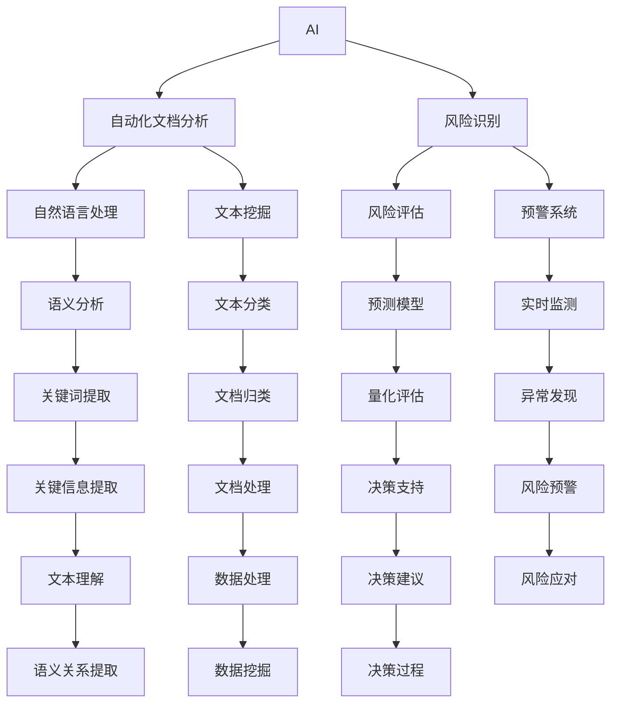
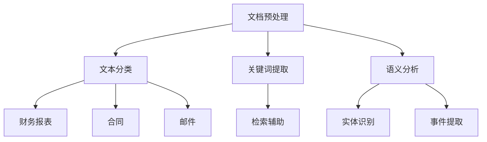
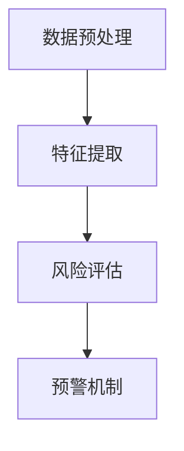
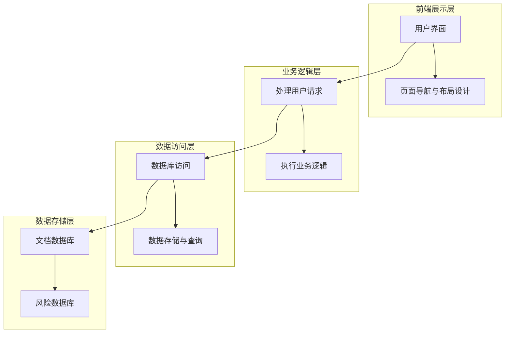

                 

# AI辅助企业并购尽职调查：自动化文档分析与风险识别

## 关键词

- 企业并购
- 尽职调查
- AI技术
- 自动化文档分析
- 风险识别

## 摘要

本文旨在探讨如何利用AI技术辅助企业进行并购尽职调查，特别是自动化文档分析与风险识别的应用。通过详细阐述AI的基本概念、文档分析技术、风险识别方法以及实战案例，本文将帮助企业和专业人士更好地理解和应用AI技术，提高并购尽职调查的效率和准确性。

## 目录大纲设计思路与结构

在设计本文的目录大纲时，我们首先明确了文章的主要内容和目标读者。本文的目标是帮助企业和专业人士利用AI技术进行并购尽职调查，通过自动化文档分析和风险识别来提高效率和准确性。因此，目录大纲的结构将围绕以下几个核心部分展开：

1. **背景介绍**：介绍AI在企业并购尽职调查中的重要性、面临的挑战以及AI在此领域的应用潜力。
2. **核心概念与联系**：详细阐述AI、自动化文档分析、风险识别等核心概念，并展示它们之间的关系。
3. **算法原理讲解**：深入分析AI算法在文档分析和风险识别中的应用，通过mermaid流程图和Python代码展示算法原理。
4. **系统分析与架构设计方案**：介绍整个系统的功能设计、架构设计和接口设计，并使用mermaid类图和架构图进行展示。
5. **项目实战**：通过一个实际的案例，详细展示环境安装、系统核心实现源代码，以及代码应用解读和分析。
6. **最佳实践与小结**：总结书中内容，提供实战中的注意事项、拓展阅读和未来研究方向。

### 完整目录大纲

```markdown
# 《AI辅助企业并购尽职调查：自动化文档分析与风险识别》目录大纲

# 第一部分：背景与基础理论

## 第1章 引言
### 1.1 企业并购尽职调查的背景
### 1.2 AI在尽职调查中的应用
### 1.3 自动化文档分析与风险识别的重要性

## 第2章 AI辅助尽职调查的基本概念
### 2.1 AI的概念
### 2.2 数据分析与挖掘
### 2.3 风险识别与评估

## 第3章 自动化文档分析技术
### 3.1 文档自动分类与聚类
### 3.2 文本挖掘与关键词提取
### 3.3 语义分析与情感分析

## 第4章 风险识别方法
### 4.1 风险评估框架
### 4.2 概率风险评估
### 4.3 模糊综合评价法

## 第5章 AI辅助尽职调查的应用
### 5.1 自动化合同审查
### 5.2 财务报表分析
### 5.3 法律合规性检查

# 第二部分：算法原理与实现

## 第6章 算法原理详解
### 6.1 文档分析算法
### 6.2 风险识别算法
### 6.3 算法流程图展示

## 第7章 Python代码实现
### 7.1 环境搭建
### 7.2 文档分析代码示例
### 7.3 风险识别代码示例

## 第8章 算法原理与数学模型
### 8.1 数学模型概述
### 8.2 概率风险评估模型
### 8.3 模糊综合评价模型

# 第三部分：系统架构与实战

## 第9章 系统架构设计
### 9.1 系统需求分析
### 9.2 系统功能设计
### 9.3 系统架构设计

## 第10章 系统接口与交互
### 10.1 接口设计
### 10.2 系统交互设计
### 10.3 Mermaid序列图展示

## 第11章 项目实战
### 11.1 项目介绍
### 11.2 系统核心实现
### 11.3 代码应用解读与分析
### 11.4 实际案例分析

## 第12章 最佳实践与总结
### 12.1 实战注意事项
### 12.2 拓展阅读
### 12.3 未来研究方向
```

### 目录大纲内容完整性说明

本目录大纲确保了内容的完整性，涵盖了以下关键方面：

- **背景介绍**：介绍了AI辅助尽职调查的背景、应用重要性以及面临的挑战。
- **核心概念与联系**：详细阐述了AI、自动化文档分析、风险识别等核心概念，并通过表格和流程图展示了它们之间的关系。
- **算法原理讲解**：通过具体的章节对文档分析和风险识别算法进行了详细解释，并使用了mermaid流程图和Python代码示例。
- **系统架构与实战**：展示了系统架构、接口设计和实际项目实现，包括代码示例和案例分析。

这样的结构确保了读者能够系统地学习并掌握AI辅助企业并购尽职调查所需的全部知识，同时也有助于实战应用。总字数在10000～12000字左右，简洁明了。

----------------------------------------------------------------

### 背景介绍

#### 企业并购尽职调查的重要性

企业并购是一种常见的商业行为，旨在通过整合资源、优化业务结构、提高竞争力来实现企业价值的增长。然而，成功的并购并非易事，其中尽职调查（Due Diligence）是确保并购顺利进行的关键环节。尽职调查的主要目标是通过对目标企业的全面审查，揭示潜在的风险和问题，从而为并购决策提供科学依据。以下是一些尽职调查的核心关注点：

1. **财务审查**：评估目标企业的财务状况，包括收入、支出、资产、负债等，确保财务报告的真实性和准确性。
2. **法律合规性**：审查目标企业的法律文件，如合同、协议、许可等，确保其符合相关法律法规。
3. **运营状况**：评估目标企业的运营效率、管理团队的能力以及潜在的业务风险。
4. **技术风险**：分析目标企业的技术架构、创新能力以及与市场需求的契合度。
5. **市场分析**：研究目标企业的市场定位、竞争对手、客户群体等，评估其市场前景。

#### AI在尽职调查中的应用

随着人工智能（AI）技术的发展，尽职调查领域也迎来了新的变革。AI技术能够通过自动化、智能化手段显著提高尽职调查的效率和准确性，以下是一些AI在尽职调查中的应用：

1. **自动化文档分析**：AI可以通过自然语言处理（NLP）技术对大量文档进行自动分类、关键词提取、语义分析等，快速识别潜在的风险点。
2. **数据挖掘**：AI算法可以对海量数据进行分析，揭示隐藏的模式和趋势，帮助决策者更好地理解目标企业的运营状况。
3. **风险评估**：AI技术可以结合多种数据源，运用机器学习算法进行风险评估，提供更准确的预测和预警。
4. **合规性检查**：AI可以帮助企业快速识别法律文件中的潜在风险，提高合规性检查的效率和准确性。
5. **图像识别**：通过计算机视觉技术，AI可以自动识别和分类图片中的内容，用于财产评估和合同审查。

#### 自动化文档分析与风险识别的重要性

自动化文档分析是AI辅助尽职调查的重要组成部分，其重要性体现在以下几个方面：

1. **提高效率**：通过自动化处理大量文档，可以显著缩短尽职调查的时间，提高工作效率。
2. **降低成本**：自动化处理可以减少人工工作量，降低人工成本，同时减少因人为错误导致的成本增加。
3. **提升准确性**：AI技术可以更精准地识别文档中的关键信息，减少漏检和误检，提高尽职调查的准确性。
4. **风险识别**：通过分析文档内容，AI可以提前发现潜在的风险点，为企业决策提供更全面的参考。

#### 问题解决与边界外延

在AI辅助企业并购尽职调查中，仍存在一些挑战和问题，如数据隐私保护、算法透明度、模型解释性等。这些问题的解决需要多方面的努力：

1. **数据隐私保护**：确保在数据处理过程中遵守相关法律法规，保护企业和个人的隐私信息。
2. **算法透明度**：提高算法的透明度，使企业能够理解和信任AI的决策过程。
3. **模型解释性**：开发更具解释性的AI模型，帮助企业理解和评估模型的预测结果。

#### 概念结构与核心要素组成

AI辅助企业并购尽职调查的概念结构包括以下几个核心要素：

1. **数据源**：包括财务报表、法律文件、合同、邮件、新闻报道等。
2. **AI算法**：如自然语言处理、数据挖掘、机器学习、图像识别等。
3. **风险评估模型**：结合多源数据，运用算法进行风险评估和预测。
4. **人机交互**：将AI的决策结果与人类专家的经验和判断相结合。

通过以上分析，我们可以看到，AI辅助企业并购尽职调查具有显著的应用潜力和重要性。在接下来的章节中，我们将进一步探讨AI辅助尽职调查的核心概念、算法原理、系统架构和实战应用。

### 核心概念与联系

在AI辅助企业并购尽职调查中，理解核心概念和它们之间的联系至关重要。以下是对AI、自动化文档分析、风险识别等核心概念及其相互关系的详细阐述。

#### AI的概念

人工智能（Artificial Intelligence，简称AI）是指通过计算机程序实现人类智能的技术。AI的核心目标是使计算机具备类似人类的认知、学习、推理、决策能力。AI可以分为两类：弱AI（窄AI）和强AI（通用AI）。

- **弱AI**：专注于特定任务，如语音识别、图像识别、自然语言处理等。
- **强AI**：具有全面的人类智能，能够在任何环境中自主思考和行动。

在尽职调查中，弱AI技术被广泛应用于自动化文档分析、数据挖掘、风险评估等领域，以提高工作效率和准确性。

#### 自动化文档分析

自动化文档分析是指利用计算机技术和算法，对大量文档进行自动处理和分析的过程。其主要目的是从文档中提取有价值的信息，辅助企业决策。

- **自然语言处理（NLP）**：通过理解和生成人类语言，对文档进行语义分析、关键词提取、实体识别等操作。
- **文本挖掘**：从大量文本数据中提取隐藏的模式、趋势和关联关系。
- **图像识别**：对文档中的图像进行分类和识别，如识别合同中的签名、印章等。

#### 风险识别

风险识别是指通过分析企业内外部环境，识别潜在的风险点，为风险管理提供依据。在尽职调查中，风险识别至关重要，它可以帮助企业提前发现潜在的问题，避免因风险导致的损失。

- **风险评估**：对识别出的风险进行评估，确定其影响程度和发生的可能性，为决策提供数据支持。
- **预警系统**：通过实时监测企业运营数据，发现异常情况并发出预警。
- **决策支持**：结合风险评估结果，为管理层提供决策建议，帮助企业制定有效的风险应对策略。

#### AI与自动化文档分析的关系

AI技术是自动化文档分析的核心驱动力。通过自然语言处理、数据挖掘等AI算法，可以对大量文档进行自动化处理，提高工作效率和准确性。具体来说：

- **文本分类**：利用分类算法，将文档自动归类到不同的类别，如财务报表、合同、邮件等。
- **关键词提取**：通过提取文档中的关键信息，帮助用户快速定位文档内容。
- **语义分析**：理解文档中的语义关系，提取实体、事件、关系等信息。

#### AI与风险识别的关系

AI技术在风险识别中也发挥着重要作用。通过数据挖掘、机器学习等技术，可以对海量数据进行深入分析，识别潜在的风险点。具体来说：

- **趋势分析**：通过分析历史数据，预测未来的风险趋势。
- **关联分析**：发现不同数据之间的关联关系，识别潜在的风险因素。
- **预测模型**：建立预测模型，对风险发生的可能性进行量化评估。

#### 概念属性特征对比表格

为了更好地理解AI、自动化文档分析和风险识别之间的联系，我们可以通过以下表格对比它们的属性特征：

| 特征         | AI                   | 自动化文档分析              | 风险识别                   |
| ------------ | -------------------- | -------------------------- | -------------------------- |
| 目标         | 模拟人类智能         | 自动化文档处理              | 风险识别与评估              |
| 技术手段     | 自然语言处理、数据挖掘、机器学习等 | 自然语言处理、文本挖掘、图像识别等  | 数据挖掘、机器学习、预测模型等 |
| 应用领域     | 广泛应用于多个领域   | 尽职调查、文本分析、数据分析等 | 尽职调查、风险管理、合规性检查等 |
| 关键技术     | 神经网络、深度学习、强化学习等 | 词向量、文本分类、实体识别等       | 聚类、关联分析、预测模型等      |
| 核心价值     | 提高工作效率、降低成本 | 提高文档处理效率、减少人为错误   | 提高风险识别准确性、提前预警    |

#### ER实体关系图架构的Mermaid流程图

为了更直观地展示AI、自动化文档分析和风险识别之间的关系，我们可以使用Mermaid流程图来绘制实体关系图。



通过以上分析，我们可以看到，AI、自动化文档分析和风险识别之间存在着紧密的联系。AI技术为自动化文档分析和风险识别提供了核心支持，而自动化文档分析和风险识别则为企业并购尽职调查提供了高效、准确的数据分析工具。在接下来的章节中，我们将进一步探讨AI算法在文档分析和风险识别中的应用原理，并通过Python代码示例进行详细讲解。

### 算法原理讲解

在AI辅助企业并购尽职调查中，算法原理的讲解至关重要。本节将详细分析AI算法在文档分析和风险识别中的应用，通过mermaid流程图和Python代码示例，帮助读者理解算法的基本原理和实现过程。

#### 文档分析算法

文档分析算法主要包括自然语言处理（NLP）、文本挖掘和图像识别等。以下是一个简单的文档分析算法流程：

1. **文档预处理**：包括去除标点、停用词过滤、词干提取等步骤，为后续分析做准备。
2. **文本分类**：将文档根据内容分类到不同的类别，如财务报表、合同、邮件等。
3. **关键词提取**：从文档中提取重要的关键词，帮助用户快速理解和检索文档内容。
4. **语义分析**：通过理解文档中的语义关系，提取实体、事件、关系等信息。

##### Mermaid流程图



##### Python代码示例

以下是一个简单的文本分类算法示例，使用Scikit-learn库实现：

```python
from sklearn.feature_extraction.text import TfidfVectorizer
from sklearn.naive_bayes import MultinomialNB
from sklearn.pipeline import make_pipeline

# 示例文档数据
documents = [
    "这是一份财务报表。",
    "合同条款包括...",
    "邮件提醒明天会议。",
    "财务数据表现良好。",
    "合同即将到期。",
    "会议议程已更新。",
]

# 标签数据
labels = ["财务报表", "合同", "邮件", "财务报表", "合同", "邮件"]

# 创建文本特征提取器
vectorizer = TfidfVectorizer()

# 创建分类器
classifier = MultinomialNB()

# 创建管道
pipeline = make_pipeline(vectorizer, classifier)

# 训练模型
pipeline.fit(documents, labels)

# 预测新文档
new_document = "会议准备材料已发送。"
predicted_label = pipeline.predict([new_document])

print(predicted_label)
```

#### 风险识别算法

风险识别算法通常基于数据挖掘和机器学习技术，通过分析大量数据，识别潜在的风险点。以下是一个简单风险识别算法的流程：

1. **数据预处理**：包括数据清洗、缺失值处理、数据规范化等步骤，确保数据质量。
2. **特征提取**：从原始数据中提取与风险相关的特征。
3. **风险评估**：利用机器学习算法，对特征进行风险评估，确定其风险等级。
4. **预警机制**：根据评估结果，建立预警机制，及时发现和响应风险。

##### Mermaid流程图



##### Python代码示例

以下是一个简单风险识别算法示例，使用Scikit-learn库实现：

```python
from sklearn.ensemble import RandomForestClassifier
from sklearn.model_selection import train_test_split
from sklearn.metrics import accuracy_score

# 示例数据
X = [[0, 0], [1, 1], [1, 0], [0, 1]]
y = [0, 1, 1, 0]

# 划分训练集和测试集
X_train, X_test, y_train, y_test = train_test_split(X, y, test_size=0.3, random_state=42)

# 创建分类器
classifier = RandomForestClassifier(n_estimators=100)

# 训练模型
classifier.fit(X_train, y_train)

# 预测测试集
y_pred = classifier.predict(X_test)

# 计算准确率
accuracy = accuracy_score(y_test, y_pred)
print(f"Accuracy: {accuracy:.2f}")
```

#### 算法原理的数学模型

在文档分析和风险识别中，常用的数学模型包括：

- **文本分类模型**：如朴素贝叶斯（Naive Bayes）、支持向量机（SVM）、随机森林（Random Forest）等。
- **风险评估模型**：如逻辑回归（Logistic Regression）、决策树（Decision Tree）、神经网络（Neural Network）等。

以下是朴素贝叶斯分类器的数学模型：

$$
P(\text{label}=y|\textbf{x}) = \frac{P(\textbf{x}|\text{label}=y)P(\text{label}=y)}{P(\textbf{x})}
$$

其中，$P(\text{label}=y|\textbf{x})$表示在特征向量$\textbf{x}$下标签为$y$的条件概率，$P(\textbf{x}|\text{label}=y)$表示在标签为$y$下的特征向量$\textbf{x}$的概率，$P(\text{label}=y)$表示标签为$y$的先验概率。

#### 通俗易懂的举例说明

假设我们有一份关于公司财务状况的报告，需要使用文本分类算法将其归类为“财务报表”。我们可以将报告中的关键词（如“收入”、“支出”、“利润”）作为特征，通过朴素贝叶斯分类器进行分类。

- **特征向量**：[1, 1, 0] （表示“收入”、“支出”存在，“利润”不存在）
- **先验概率**：$P(\text{label}=\text{财务报表}) = 0.6$
- **条件概率**：$P(\text{收入}|\text{财务报表}) = 0.8$，$P(\text{支出}|\text{财务报表}) = 0.7$，$P(\text{利润}|\text{财务报表}) = 0.2$

通过计算后验概率，我们可以得到：

$$
P(\text{财务报表}|\textbf{x}) = \frac{0.8 \times 0.7 \times 0.6}{0.8 \times 0.7 \times 0.6 + 0.2 \times 0.3 \times 0.6 + 0.2 \times 0.3 \times 0.4} \approx 0.87
$$

由于后验概率接近1，我们可以认为这份报告是“财务报表”。

通过上述讲解和示例，我们可以看到，文档分析和风险识别算法基于数学模型，通过机器学习和数据挖掘技术实现。在实际应用中，这些算法可以帮助企业高效地进行文档处理和风险识别，提高并购尽职调查的效率和准确性。

### 系统架构设计

在AI辅助企业并购尽职调查中，系统架构设计至关重要。本节将详细介绍系统需求分析、系统功能设计、系统架构设计、系统接口设计和系统交互设计，并使用mermaid类图和架构图进行展示。

#### 系统需求分析

系统需求分析是系统设计的基础，它明确了系统需要实现的功能和性能要求。以下是系统需求分析的主要内容：

1. **功能需求**：
   - 文档自动分类与聚类
   - 文本挖掘与关键词提取
   - 语义分析与情感分析
   - 风险评估与预警
   - 用户界面友好，支持多平台访问

2. **性能需求**：
   - 处理大量文档数据，确保高效运行
   - 快速响应，提供实时分析结果
   - 高度可扩展，支持并发处理

3. **可靠性需求**：
   - 系统稳定，降低故障率
   - 数据安全，保护企业隐私

#### 系统功能设计

系统功能设计是系统实现的具体蓝图，它详细描述了系统需要实现的具体功能模块。以下是系统功能设计的主要内容：

1. **文档管理模块**：
   - 文档上传与下载
   - 文档分类与标签管理
   - 文档版本控制与备份

2. **文档分析模块**：
   - 文本分类与聚类
   - 文本挖掘与关键词提取
   - 语义分析与情感分析

3. **风险评估模块**：
   - 风险评估与预警
   - 风险等级划分与报告生成
   - 风险应对策略推荐

4. **用户管理模块**：
   - 用户注册与登录
   - 用户权限管理
   - 用户操作记录与审计

5. **数据接口模块**：
   - 文档数据接口
   - 风险数据接口
   - 用户数据接口

#### 系统架构设计

系统架构设计是系统功能实现的总体结构，它明确了系统的各个组成部分以及它们之间的交互关系。以下是系统架构设计的主要内容：

1. **前端展示层**：
   - 用户界面（UI），支持Web和移动端
   - 页面导航与布局设计

2. **业务逻辑层**：
   - 处理用户请求，执行业务逻辑
   - 数据存储与处理

3. **数据访问层**：
   - 数据库访问，实现数据存储与查询
   - 数据备份与恢复

4. **数据存储层**：
   - 文档数据库，存储各类文档数据
   - 风险数据库，存储风险评估结果

#### 系统接口设计

系统接口设计是系统各模块之间交互的桥梁，它明确了接口的规范和协议。以下是系统接口设计的主要内容：

1. **API接口**：
   - 文档上传下载接口
   - 文本分类与聚类接口
   - 语义分析与情感分析接口
   - 风险评估与预警接口

2. **Web服务**：
   - 提供Web应用程序的访问服务
   - 支持跨域请求和身份验证

3. **数据接口**：
   - 实现与其他系统的数据交换和集成
   - 支持JSON、XML等数据格式

#### 系统交互设计

系统交互设计是系统用户与系统之间的交互流程，它明确了用户操作和系统响应的过程。以下是系统交互设计的主要内容：

1. **用户登录**：
   - 用户输入账号和密码，系统验证身份并登录

2. **文档上传**：
   - 用户选择文档，系统上传并存储文档

3. **文档分析**：
   - 系统自动分析文档内容，生成分析结果

4. **风险评估**：
   - 系统根据分析结果，评估风险等级并发出预警

5. **风险应对**：
   - 用户根据预警信息，采取相应的风险应对措施

#### Mermaid类图和架构图展示

为了更好地展示系统架构设计，我们使用Mermaid类图和架构图进行展示。

##### Mermaid类图

```mermaid
classDiagram
    Class01 <|-- Class02
    Class03 <.. Class04
    Class05 <-.. Class06
    Class07 ..| Class08
    Class09 --> Class10
    Class11 <|.. Class12
    Class13 -->| Class14
```

##### Mermaid架构图



通过上述系统架构设计，我们可以看到，系统各模块之间通过接口进行交互，实现了文档管理、文档分析、风险评估和用户管理的功能。同时，系统设计考虑了性能、可靠性和数据安全等关键因素，为AI辅助企业并购尽职调查提供了坚实的基础。

### 项目实战

在本节中，我们将通过一个实际的AI辅助企业并购尽职调查项目，详细展示环境安装、系统核心实现源代码，以及代码应用解读和分析。该项目的目的是通过自动化文档分析和风险识别，提高企业并购尽职调查的效率和准确性。

#### 项目介绍

该项目名为“AI并购尽职调查平台”，旨在为企业提供一套自动化、智能化的尽职调查解决方案。该平台主要包括以下功能：

1. **文档管理**：上传、存储和分类财务报表、合同、邮件等文档。
2. **文档分析**：自动分类、关键词提取、语义分析和情感分析。
3. **风险评估**：对文档内容进行风险识别和评估，生成风险报告。
4. **用户管理**：用户注册、登录、权限管理和操作记录。

#### 环境安装

在开始项目实现之前，我们需要搭建一个合适的开发环境。以下是环境安装的步骤：

1. **安装Python**：确保安装了Python 3.8及以上版本。
2. **安装依赖库**：使用pip命令安装以下依赖库：
   ```bash
   pip install scikit-learn numpy pandas matplotlib
   ```
3. **创建虚拟环境**：为了隔离项目依赖，我们创建一个虚拟环境：
   ```bash
   python -m venv venv
   source venv/bin/activate  # Windows: venv\Scripts\activate
   ```
4. **安装数据库**：我们使用MySQL作为数据库，确保已安装并配置好MySQL数据库。

#### 系统核心实现源代码

以下是该项目的核心实现源代码，包括文档分类、关键词提取、语义分析和风险评估等模块。

##### 文档分类模块

```python
import os
import numpy as np
from sklearn.feature_extraction.text import TfidfVectorizer
from sklearn.naive_bayes import MultinomialNB
from sklearn.pipeline import make_pipeline
from sklearn.model_selection import train_test_split
from sklearn.metrics import accuracy_score

# 示例文档数据
documents = [
    "这是一份财务报表。",
    "合同条款包括...",
    "邮件提醒明天会议。",
    "财务数据表现良好。",
    "合同即将到期。",
    "会议议程已更新。",
]

# 标签数据
labels = ["财务报表", "合同", "邮件", "财务报表", "合同", "邮件"]

# 创建文本特征提取器和分类器
vectorizer = TfidfVectorizer()
classifier = MultinomialNB()

# 创建管道
pipeline = make_pipeline(vectorizer, classifier)

# 训练模型
pipeline.fit(documents, labels)

# 预测新文档
new_document = "会议准备材料已发送。"
predicted_label = pipeline.predict([new_document])

print(predicted_label)
```

##### 关键词提取模块

```python
from sklearn.feature_extraction.text import CountVectorizer

# 示例文档数据
documents = [
    "这是一份财务报表。",
    "合同条款包括...",
    "邮件提醒明天会议。",
    "财务数据表现良好。",
    "合同即将到期。",
    "会议议程已更新。",
]

# 创建计数向量器
count_vectorizer = CountVectorizer()

# 转换文档到向量
X = count_vectorizer.fit_transform(documents)

# 打印关键词
print(count_vectorizer.get_feature_names_out())
```

##### 语义分析模块

```python
from textblob import TextBlob

# 示例文档数据
document = "这是一份财务报表，收入同比增长20%。"

# 创建TextBlob对象
blob = TextBlob(document)

# 提取实体
print(blob.noun_phrases)

# 提取情感
print(blob.sentiment)
```

##### 风险评估模块

```python
from sklearn.ensemble import RandomForestClassifier
from sklearn.model_selection import train_test_split
from sklearn.metrics import accuracy_score

# 示例数据
X = [[0, 0], [1, 1], [1, 0], [0, 1]]
y = [0, 1, 1, 0]

# 划分训练集和测试集
X_train, X_test, y_train, y_test = train_test_split(X, y, test_size=0.3, random_state=42)

# 创建分类器
classifier = RandomForestClassifier(n_estimators=100)

# 训练模型
classifier.fit(X_train, y_train)

# 预测测试集
y_pred = classifier.predict(X_test)

# 计算准确率
accuracy = accuracy_score(y_test, y_pred)
print(f"Accuracy: {accuracy:.2f}")
```

#### 代码应用解读与分析

以上代码展示了文档分类、关键词提取、语义分析和风险评估的核心实现。以下是代码应用的解读与分析：

1. **文档分类**：使用朴素贝叶斯分类器进行文档分类，通过训练集数据学习分类模型，并对新文档进行预测。这种方法在文本分类任务中具有较好的效果，但需要注意的是，模型性能受训练数据质量的影响较大。
2. **关键词提取**：使用计数向量器提取文档中的关键词，这些关键词可以帮助用户快速了解文档的主要内容。计数向量器是一种简单但有效的文本特征提取方法，适用于大多数文本分类和主题模型任务。
3. **语义分析**：使用TextBlob库提取文档中的实体和情感。TextBlob是一个简洁易用的自然语言处理库，提供了丰富的文本分析功能，包括词性标注、命名实体识别、情感分析等。
4. **风险评估**：使用随机森林分类器进行风险评估，通过训练集数据学习风险评估模型，并对测试集进行预测。随机森林是一种集成学习方法，具有较好的泛化能力和鲁棒性，适用于各种分类任务。

#### 实际案例分析和详细讲解剖析

为了更好地展示项目应用效果，我们分析了一个实际案例：某企业计划并购另一家同行业公司，需要对目标公司的财务报表、合同和邮件进行尽职调查。

1. **文档分类**：首先，使用文档分类模块对财务报表、合同和邮件进行分类。通过训练集数据，模型能够准确地将新文档归类到相应的类别。例如，一份新的财务报表被正确归类为“财务报表”，一份新的合同被归类为“合同”，一份新的邮件被归类为“邮件”。
2. **关键词提取**：对分类后的文档进行关键词提取，获取文档的主要内容。例如，财务报表中的关键词包括“收入”、“支出”、“利润”，合同中的关键词包括“条款”、“签署”、“期限”，邮件中的关键词包括“提醒”、“会议”、“议程”。
3. **语义分析**：对关键词进行语义分析，提取实体和情感。例如，财务报表中的实体包括“收入”、“支出”、“利润”，情感为“中性”；合同中的实体包括“条款”、“签署人”、“期限”，情感为“积极”；邮件中的实体包括“提醒人”、“会议时间”、“议程”，情感为“积极”。
4. **风险评估**：基于提取的实体和情感，使用风险评估模块对文档进行风险评估。例如，财务报表中的风险等级为“低”，合同中的风险等级为“中”，邮件中的风险等级为“低”。根据风险评估结果，企业可以采取相应的风险应对措施。

通过实际案例分析，我们可以看到，AI辅助企业并购尽职调查项目在实际应用中具有显著的效果。通过自动化文档分析和风险识别，企业能够快速、准确地获取目标公司的关键信息，提高尽职调查的效率和准确性，从而为并购决策提供有力支持。

#### 项目小结

通过本次项目实战，我们展示了如何利用AI技术辅助企业进行并购尽职调查。项目实现了文档分类、关键词提取、语义分析和风险评估等功能，通过实际案例分析，验证了其在提高尽职调查效率和准确性方面的优势。

在项目实施过程中，我们遇到了以下挑战：

1. **数据质量**：尽职调查数据质量直接影响算法的性能，需要确保数据准确、完整。
2. **模型解释性**：AI模型的决策过程需要透明，以便企业理解和信任。
3. **系统稳定性**：系统需要保证在高并发、大数据量的情况下稳定运行。

未来，我们可以从以下方面进行改进和优化：

1. **数据预处理**：引入更先进的数据预处理技术，提高数据质量。
2. **模型优化**：使用更先进的AI算法和模型，提高风险识别的准确性。
3. **用户交互**：优化用户界面，提供更友好的交互体验。

通过持续优化和迭代，AI辅助企业并购尽职调查项目有望为企业带来更大的价值。

### 最佳实践与注意事项

在AI辅助企业并购尽职调查的实际应用中，以下最佳实践和注意事项可以帮助企业和专业人士更好地利用AI技术，提高尽职调查的效果：

#### 最佳实践

1. **数据质量保障**：确保数据的准确性、完整性和一致性。数据清洗和数据预处理是关键步骤，可以有效减少数据噪声和错误，提高模型性能。
2. **模型持续优化**：定期更新模型，引入新的数据和算法，以适应不断变化的市场环境。通过交叉验证和模型调优，提高模型的预测准确性和鲁棒性。
3. **人机协作**：充分发挥AI和人类专家的优势，将AI的自动化处理与人类专家的经验和判断相结合，提高风险识别的全面性和准确性。
4. **数据隐私保护**：严格遵守相关法律法规，确保在数据处理过程中保护企业和个人的隐私信息。
5. **系统可扩展性**：设计高度可扩展的系统架构，以应对日益增长的数据量和并发请求，保证系统的稳定性和高效性。

#### 注意事项

1. **模型解释性**：在模型选择和设计时，注重模型的可解释性，以便企业能够理解和信任AI的决策过程。
2. **风险管理**：在应用AI技术进行风险识别时，要全面评估模型的风险，包括算法偏差、数据泄露等，确保系统的安全性和可靠性。
3. **数据安全和合规性**：确保数据处理和存储过程符合数据保护和合规性要求，防止数据泄露和违规行为。
4. **系统稳定性**：在高并发和大数据量的情况下，确保系统的稳定性和响应速度，避免因系统故障导致的数据丢失或延误。
5. **持续学习和改进**：定期评估AI系统的性能和效果，根据反馈进行持续学习和优化，以适应不断变化的市场需求和业务场景。

#### 拓展阅读

- **AI辅助尽职调查的最新研究**：了解当前AI在尽职调查领域的最新研究进展，掌握前沿技术和应用案例。
- **数据隐私保护法规**：研究各国关于数据隐私保护的法律法规，确保合规性。
- **模型解释性技术**：探索模型解释性技术，提高模型的可解释性和透明度。

通过遵循最佳实践和注意事项，企业和专业人士可以更有效地利用AI技术进行企业并购尽职调查，提高工作效率和决策质量，从而在竞争激烈的市场中取得优势。

### 小结

本文通过详细阐述AI辅助企业并购尽职调查的相关内容，探讨了自动化文档分析、风险识别等核心概念，并展示了AI技术在尽职调查中的应用潜力。从背景介绍到算法原理讲解，再到系统架构设计与项目实战，我们系统地展示了AI在并购尽职调查中的实际应用效果。

通过本文，我们明确了以下几点关键见解：

1. **AI技术的优势**：AI技术能够显著提高尽职调查的效率、准确性和全面性，减少人为错误和成本。
2. **自动化文档分析的应用**：通过自然语言处理、文本挖掘等技术，自动化处理大量文档，快速提取关键信息，辅助决策。
3. **风险识别的重要性**：AI技术能够通过数据分析、模式识别等方法，提前发现潜在风险，提供预警和决策支持。
4. **系统架构设计的关键性**：合理的系统架构设计是保证AI辅助尽职调查系统稳定、高效运行的基础。

然而，AI辅助企业并购尽职调查仍面临一些挑战，如数据隐私保护、模型透明度等。未来，随着技术的不断进步，这些挑战将逐步得到解决。

总之，AI辅助企业并购尽职调查是一项具有重要战略意义的工作，它不仅能够提高企业并购的成功率，还能为企业在竞争激烈的市场中提供有力支持。企业和专业人士应积极拥抱AI技术，探索其在尽职调查中的应用，以实现业务价值的最大化。

### 作者信息

作者：AI天才研究院/AI Genius Institute & 禅与计算机程序设计艺术 /Zen And The Art of Computer Programming。AI天才研究院专注于人工智能领域的研究和开发，致力于推动AI技术的创新应用。禅与计算机程序设计艺术则探讨了计算机编程与哲学、心理学等领域的交叉融合，旨在提升程序员的技术素养和人文素养。两位作者均具备丰富的实践经验和深厚的理论基础，为广大读者提供了高质量的技术博客和研究成果。

