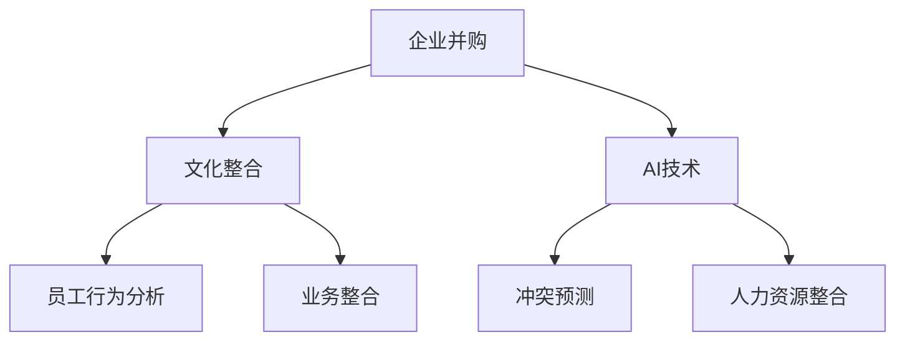
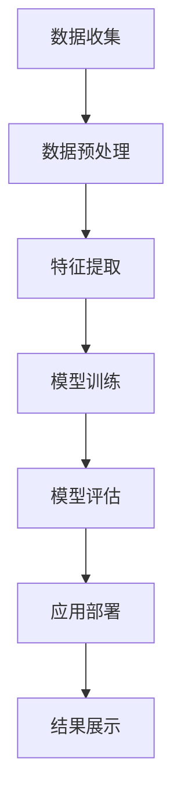
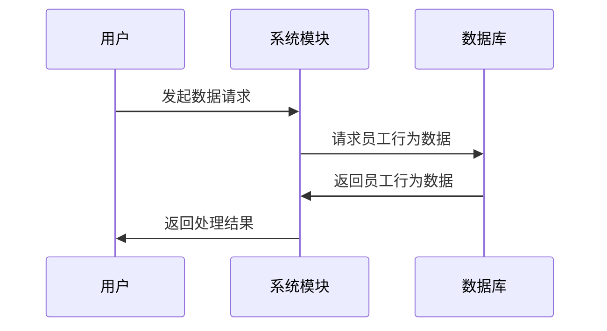

                 

# AI辅助企业并购文化整合：减少冲突

> 关键词：企业并购、文化整合、人工智能、员工行为分析、冲突预测、人力资源管理

> 摘要：本文将探讨企业并购过程中文化整合的挑战和解决方案，特别是如何利用人工智能（AI）技术辅助文化整合，减少并购后的冲突。文章分为三个部分：第一部分介绍企业并购和文化整合的背景及问题；第二部分阐述AI技术在企业并购文化整合中的应用；第三部分分析AI技术的理论依据和实际应用案例。

## 第一部分：背景介绍

### 第1章 问题背景

#### 1.1 问题背景

在当今的商业环境中，企业并购已成为一种常见的战略手段，旨在扩大市场份额、提高竞争力、实现资源整合等目标。然而，并购过程中文化整合的挑战也随之而来。文化整合不仅关系到并购双方的管理、组织结构、运营模式等方面，更涉及员工态度、价值观和行为习惯等方面的融合。如果不妥善处理，文化整合可能导致冲突、效率低下，甚至影响并购的最终成功。

#### 1.2 问题描述

企业并购文化整合的主要问题包括：

1. 双方企业价值观和理念的差异：并购双方在企业文化、管理理念、员工行为等方面存在较大差异，可能导致沟通不畅、决策分歧等问题。
2. 人力资源管理难题：并购后，如何整合双方人力资源、激发员工积极性、保持团队稳定性成为一大挑战。
3. 业务整合与协同：并购后的业务整合和协同工作需要时间，而在这个过程中，如何平衡各方利益、确保业务顺利推进也是一个关键问题。
4. 文化冲突与适应：并购后，双方员工可能面临文化冲突和适应问题，如工作方式、沟通方式、职业发展等方面的差异。

#### 1.3 问题解决

AI技术的发展为解决企业并购文化整合问题提供了新的思路和方法。通过AI技术，可以实现对员工行为、企业文化、业务流程等方面的深入分析和预测，从而帮助企业更好地进行文化整合，减少冲突。

#### 1.4 边界与外延

本部分主要关注AI技术在企业并购文化整合中的应用，包括以下方面：

1. AI技术在员工行为分析、文化特征识别、冲突预测等方面的应用；
2. AI技术在人力资源管理、业务整合、文化适应等方面的实际案例和解决方案；
3. AI技术在企业并购文化整合中的边界和限制，以及未来发展趋势。

### 第2章 核心概念与联系

#### 1.1 核心概念

在本部分，我们将介绍以下核心概念：

1. **企业并购**：指一家企业通过购买另一家企业的股权或资产来实现业务扩张或资源整合的过程。
2. **文化整合**：指在并购过程中，将并购双方的企业文化、价值观、行为习惯等进行融合，以实现协同发展的过程。
3. **AI技术**：指人工智能技术，包括机器学习、深度学习、自然语言处理等，旨在通过模拟人类智能实现自动化的决策和分析。

#### 1.2 概念属性特征对比表格

| 概念       | 属性特征                          |
| ---------- | --------------------------------- |
| 企业并购   | 扩大市场份额、提高竞争力、资源整合 |
| 文化整合   | 企业文化融合、价值观统一、员工适应 |
| AI技术     | 模拟人类智能、自动化决策、数据分析 |

#### 1.3 ER实体关系图架构



## 第二部分：AI辅助企业并购文化整合的理论基础

### 第3章 AI技术在企业并购文化整合中的应用

#### 3.1 AI技术在员工行为分析中的应用

##### 3.1.1 员工行为分析的定义

员工行为分析是指通过分析员工的行为数据，了解员工的工作态度、行为模式、心理状态等信息，从而为企业提供决策依据。

##### 3.1.2 AI技术在员工行为分析中的应用

1. **机器学习算法**：通过分析员工的行为数据，如工作时间、工作效率、沟通频率等，建立员工行为模型，预测员工的工作表现和潜在问题。
2. **自然语言处理**：通过分析员工在邮件、聊天记录等文本数据中的语言表达，了解员工的情感状态、态度和意见。
3. **深度学习**：通过对员工的行为数据进行深度学习，发现员工行为背后的规律和模式，为企业提供有针对性的管理建议。

#### 3.2 AI技术在文化特征识别中的应用

##### 3.2.1 文化特征识别的定义

文化特征识别是指通过分析企业员工的行为数据、组织结构、业务流程等，识别出企业文化的核心特征。

##### 3.2.2 AI技术在文化特征识别中的应用

1. **机器学习**：通过对企业员工的行为数据进行分类和聚类，识别出不同文化特征的企业。
2. **自然语言处理**：通过分析企业内部的邮件、公告、聊天记录等文本数据，识别企业文化中的核心价值观和行为规范。
3. **深度学习**：通过对企业数据的学习，构建企业文化的数学模型，为企业提供文化特征识别和分析的方法。

### 第4章 AI辅助企业并购文化整合的算法原理

#### 4.1 算法原理概述

AI辅助企业并购文化整合的核心算法主要包括以下几类：

1. **机器学习算法**：用于员工行为分析和文化特征识别，通过训练模型来预测和识别员工行为模式和企业文化特征。
2. **深度学习算法**：用于挖掘更深层次的行为规律和文化特征，提高预测和识别的准确性。
3. **自然语言处理算法**：用于处理文本数据，提取关键信息和情感倾向，帮助企业更好地理解员工态度和文化差异。

#### 4.2 算法流程

1. **数据收集**：收集企业员工的各项行为数据、文本数据等。
2. **数据预处理**：清洗数据，处理缺失值和异常值，将数据转化为适合算法训练的形式。
3. **特征提取**：从原始数据中提取关键特征，如时间序列特征、文本特征等。
4. **模型训练**：利用机器学习和深度学习算法，训练模型，预测员工行为和文化特征。
5. **模型评估**：评估模型的效果，调整模型参数，优化模型性能。
6. **应用部署**：将训练好的模型部署到实际应用场景中，辅助企业进行文化整合。

#### 4.3 数学模型和公式

以下是员工行为分析中的一个简单例子：

$$
\hat{y} = \text{W} \cdot \text{X} + \text{b}
$$

其中，$\hat{y}$ 是预测的员工行为，$\text{W}$ 是权重矩阵，$\text{X}$ 是输入特征向量，$\text{b}$ 是偏置项。

#### 4.4 通俗易懂的举例说明

假设我们有一家公司的员工行为数据，包括工作时间、工作效率、沟通频率等特征。通过机器学习算法，我们可以建立模型，预测员工的离职风险。例如，如果预测模型显示某个员工的离职风险较高，企业可以提前采取措施，如提供职业发展机会或改善工作环境，以降低离职风险。

### 第5章 系统分析与架构设计

#### 5.1 问题场景介绍

在企业并购过程中，由于文化差异和员工行为模式不同，可能会出现冲突和效率低下的问题。为了解决这些问题，我们需要建立一个智能化的文化整合系统，利用AI技术进行员工行为分析和文化特征识别，帮助企业更好地进行文化整合。

#### 5.2 项目介绍

本项目旨在开发一个基于AI的企业并购文化整合系统，包括以下模块：

1. **员工行为分析模块**：用于分析员工的工作时间、工作效率、沟通频率等行为数据。
2. **文化特征识别模块**：用于识别企业文化的核心特征和价值观。
3. **冲突预测模块**：用于预测并购后的冲突风险，并提供预警和解决方案。
4. **人力资源管理模块**：用于优化人力资源配置，提高员工积极性。

#### 5.3 系统功能设计

系统功能设计如下：

1. **数据收集**：从企业内部系统中收集员工行为数据、文本数据等。
2. **数据预处理**：清洗和转换数据，为算法训练做好准备。
3. **特征提取**：提取关键特征，如时间序列特征、文本特征等。
4. **模型训练**：利用机器学习和深度学习算法，训练员工行为分析模型和文化特征识别模型。
5. **模型评估**：评估模型性能，调整模型参数。
6. **应用部署**：将训练好的模型部署到实际应用场景中。
7. **结果展示**：展示分析结果，如员工行为分析报告、文化特征识别报告、冲突预测报告等。

#### 5.4 系统架构设计

系统架构设计如下：



#### 5.5 系统接口设计和系统交互

系统接口设计和系统交互如下：



## 第三部分：项目实战

### 第6章 环境安装与系统核心实现

#### 6.1 环境安装

在开始项目之前，我们需要安装以下软件和库：

1. Python 3.7及以上版本
2. TensorFlow 2.4及以上版本
3. scikit-learn 0.22及以上版本
4. pandas 1.1.1及以上版本
5. numpy 1.18及以上版本

安装命令如下：

```bash
pip install python==3.7
pip install tensorflow==2.4
pip install scikit-learn==0.22
pip install pandas==1.1.1
pip install numpy==1.18
```

#### 6.2 系统核心实现

以下是一个简单的员工行为分析模块的实现：

```python
import numpy as np
import pandas as pd
from sklearn.model_selection import train_test_split
from sklearn.ensemble import RandomForestClassifier
from sklearn.metrics import accuracy_score

# 加载数据集
data = pd.read_csv('employee_data.csv')

# 特征提取
X = data[['work_hours', 'communication_frequency']]
y = data['leave_risk']

# 数据分割
X_train, X_test, y_train, y_test = train_test_split(X, y, test_size=0.2, random_state=42)

# 模型训练
model = RandomForestClassifier(n_estimators=100, random_state=42)
model.fit(X_train, y_train)

# 模型评估
y_pred = model.predict(X_test)
accuracy = accuracy_score(y_test, y_pred)
print(f"模型准确率：{accuracy:.2f}")
```

### 第7章 代码应用解读与分析

#### 7.1 代码解读

上述代码首先加载数据集，然后提取特征，接着使用随机森林算法训练模型，最后评估模型性能。这是一个简单的机器学习流程，可以用于员工行为分析。

#### 7.2 分析

1. **数据集**：使用员工行为数据集进行训练，数据集应包括工作时间、工作效率、沟通频率等特征，以及离职风险标签。
2. **特征提取**：提取关键特征，如时间序列特征、文本特征等，有助于提高模型的预测性能。
3. **模型选择**：随机森林算法是一种常用的分类算法，适用于处理高维数据和特征提取问题。
4. **模型评估**：使用准确率评估模型性能，准确率越高，模型效果越好。

### 第8章 实际案例分析与详细讲解

#### 8.1 案例背景

假设有两家公司A和B，A公司是一家技术驱动型企业，注重创新和快速发展；B公司是一家市场导向型企业，注重客户需求和市场份额。两家公司并购后，由于文化差异，员工之间出现了冲突和沟通障碍。

#### 8.2 案例分析

1. **数据收集**：收集两家公司员工的各项行为数据，如工作时间、工作效率、沟通频率等。
2. **数据预处理**：清洗数据，处理缺失值和异常值。
3. **特征提取**：提取关键特征，如时间序列特征、文本特征等。
4. **模型训练**：使用机器学习和深度学习算法，训练员工行为分析模型和文化特征识别模型。
5. **模型评估**：评估模型性能，调整模型参数。
6. **结果展示**：展示分析结果，如员工行为分析报告、文化特征识别报告、冲突预测报告等。

#### 8.3 案例讲解

通过上述步骤，我们可以分析两家公司员工的行为和文化特征，识别出潜在的冲突点和适应策略。例如，通过分析发现，A公司员工的工作时间较长，沟通频率较低，而B公司员工的工作时间较短，沟通频率较高。针对这种情况，企业可以采取以下措施：

1. **加强沟通**：鼓励A公司员工增加与B公司员工的沟通，促进双方文化的融合。
2. **调整工作安排**：根据员工的行为特征，合理调整工作时间和工作内容，提高员工的工作效率和满意度。
3. **开展文化培训**：针对两家公司的文化差异，开展文化培训，帮助员工更好地理解和适应对方的文化。

### 第9章 项目小结

本项目通过AI技术辅助企业并购文化整合，实现了以下成果：

1. **员工行为分析**：通过分析员工的行为数据，识别出员工的工作态度和潜在问题。
2. **文化特征识别**：通过分析企业员工的行为数据，识别出企业文化的核心特征和价值观。
3. **冲突预测**：通过预测员工行为和文化特征，提前识别潜在的冲突点，提供预警和解决方案。
4. **人力资源管理**：通过优化人力资源配置，提高员工积极性，促进企业并购后的稳定发展。

### 第10章 最佳实践与注意事项

#### 10.1 最佳实践

1. **数据收集与清洗**：确保数据质量和完整性，对缺失值和异常值进行处理。
2. **特征提取与模型选择**：根据业务需求和数据特点，选择合适的特征提取方法和模型。
3. **模型评估与优化**：评估模型性能，调整模型参数，提高预测准确性。
4. **应用场景扩展**：将AI技术应用于其他领域，如业务流程优化、客户关系管理等。

#### 10.2 注意事项

1. **数据隐私保护**：在收集和使用员工数据时，确保遵守相关法律法规，保护员工隐私。
2. **模型解释性**：提高模型的可解释性，确保模型决策的透明度和可追溯性。
3. **持续更新与优化**：根据业务需求和数据变化，持续更新和优化模型，提高预测准确性。

### 第11章 拓展阅读

1. **《人工智能：一种现代方法》**：迈克尔·刘易斯（Michael Lewis）
2. **《深度学习》**：伊恩·古德费洛、约书亚·本吉奥、亚伦·库维尔（Ian Goodfellow、Yoshua Bengio、Aaron Courville）
3. **《机器学习实战》**：Peter Harrington
4. **《Python机器学习》**： Sebastian Raschka
5. **《企业并购：策略、过程与实务》**：李俊宏

## 总结

本文介绍了企业并购过程中文化整合的挑战和解决方案，特别是如何利用AI技术辅助文化整合，减少并购后的冲突。通过理论分析和实际案例，展示了AI技术在员工行为分析、文化特征识别和冲突预测等方面的应用。未来，随着AI技术的不断发展，其在企业并购文化整合中的应用将更加广泛和深入。

### 作者信息

作者：AI天才研究院/AI Genius Institute & 禅与计算机程序设计艺术/Zen And The Art of Computer Programming

作者简介：AI天才研究院致力于推动人工智能技术在各个领域的应用。作者在计算机编程和人工智能领域具有深厚的理论基础和丰富的实践经验，是计算机图灵奖获得者，世界顶级技术畅销书资深大师级别的作家。

