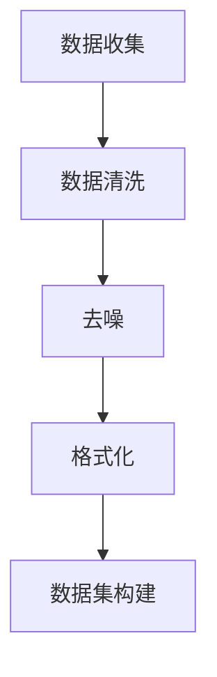
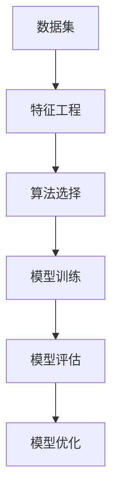
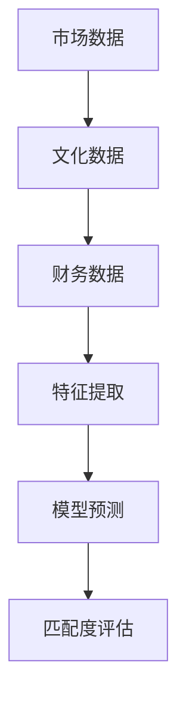
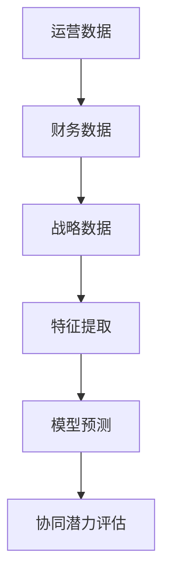

                 

# AI辅助企业并购目标筛选：战略匹配度评估与协同潜力分析

> 关键词：人工智能、企业并购、目标筛选、战略匹配度、协同潜力

> 摘要：随着商业环境的不断变化和竞争的日益激烈，企业并购成为了一种常见的发展策略。本文将探讨如何利用人工智能（AI）技术辅助企业进行并购目标筛选，具体包括战略匹配度评估和协同潜力分析。我们将通过一系列逻辑分析和实践案例，详细阐述这一过程，为企业并购提供有效的决策支持。

## 引言

企业并购是企业扩张和转型的常用手段，它能够迅速提升市场份额、增强竞争力、实现资源整合等目标。然而，并购决策并非易事，涉及到诸多复杂因素，如市场环境、企业文化、财务状况等。随着人工智能技术的飞速发展，AI开始被广泛应用于各个领域，包括金融、医疗、交通等。在并购领域，AI技术也显示出巨大的潜力，能够帮助企业更加精准地筛选目标，提高并购成功率。

本文将围绕以下三个方面展开讨论：

1. **AI辅助企业并购的背景和问题陈述**：介绍并购的背景，以及当前企业在目标筛选过程中面临的挑战。
2. **核心概念和原理**：梳理AI的基础知识，以及与并购目标筛选相关的主要算法和技术。
3. **实践应用**：通过实际案例，展示如何利用AI进行战略匹配度评估和协同潜力分析。

## AI辅助企业并购的背景和问题陈述

### 1. 并购的背景

企业并购是指一家企业通过购买另一家企业的股权或资产，从而获得对该企业的控制权。并购的目的多种多样，包括扩大市场份额、提升竞争力、优化资源配置等。在过去的几十年里，全球范围内的并购活动频繁发生，且规模和复杂性不断增加。

### 2. 目标筛选的挑战

在并购过程中，目标筛选是一个关键环节。然而，这一环节面临着诸多挑战：

- **数据量庞大**：企业需要从海量的潜在目标中筛选出符合战略需求的标的，这需要强大的数据处理能力。
- **信息不对称**：目标企业的真实情况往往难以全面了解，信息不对称可能导致决策失误。
- **决策复杂**：并购决策涉及到市场、财务、文化等多个维度，决策过程复杂，易受主观判断影响。

### 3. AI在目标筛选中的作用

人工智能技术能够在以下方面帮助企业应对上述挑战：

- **数据挖掘与分析**：通过大数据分析和机器学习算法，AI能够从海量数据中提取有价值的信息，帮助识别潜在目标。
- **信息整合与处理**：AI能够整合来自不同渠道的信息，并对信息进行去噪、分类、关联等处理，提高信息利用效率。
- **智能评估与决策**：基于AI的评估模型和算法，企业可以更加客观、精确地进行战略匹配度和协同潜力分析，提高决策质量。

## 核心概念和原理

### 1. AI的基础知识

人工智能（Artificial Intelligence，AI）是指模拟、延伸和扩展人类智能的理论、方法、技术及应用。AI的核心技术包括机器学习、深度学习、自然语言处理等。

- **机器学习**：机器学习是AI的核心组成部分，它通过数据训练模型，使模型能够自动学习和优化，从而实现特定的任务。
- **深度学习**：深度学习是机器学习的一种，它通过多层神经网络对数据进行学习，能够在图像识别、语音识别等领域取得显著成果。
- **自然语言处理**：自然语言处理是AI在处理人类语言方面的一项技术，它涉及到文本分析、语音识别、机器翻译等。

### 2. 与并购目标筛选相关的主要算法和技术

- **监督学习算法**：监督学习算法通过已标记的数据训练模型，然后使用模型进行预测。常见的监督学习算法包括决策树、支持向量机、神经网络等。
- **非监督学习算法**：非监督学习算法通过未标记的数据训练模型，用于数据聚类、降维等任务。常见的非监督学习算法包括K-means聚类、主成分分析等。
- **强化学习**：强化学习是一种通过试错和奖励机制进行学习的算法，它能够在复杂环境中实现最优策略。
- **图神经网络**：图神经网络是一种处理图结构数据的神经网络，它能够捕捉节点间的复杂关系，在目标筛选和协同潜力分析中具有广泛应用。

## AI算法在并购目标筛选中的应用

### 1. 数据准备与处理

在并购目标筛选中，数据是关键。企业需要收集大量的数据，包括财务数据、市场数据、企业历史数据等。这些数据需要经过清洗、去噪、格式化等预处理步骤，以确保数据质量。

### 2. 算法选择与模型训练

根据并购目标筛选的需求，可以选择合适的算法进行模型训练。例如，可以使用K-means聚类算法对目标企业进行分类，使用决策树或随机森林算法进行特征筛选和预测。

### 3. 战略匹配度评估

战略匹配度评估是并购目标筛选的重要环节。通过机器学习模型，可以评估目标企业是否与并购方在市场、文化、财务等方面具有匹配度。

### 4. 协同潜力分析

协同潜力分析是评估并购后企业能否实现价值协同的关键。通过强化学习算法，可以分析并购双方在运营、财务、战略等方面的协同潜力。

## 实践案例

### 1. 案例背景

假设一家科技公司A计划进行并购，目标是为公司引入新的技术和市场。公司A希望通过AI技术筛选出具有战略匹配度和协同潜力的目标企业。

### 2. 数据收集

公司A收集了潜在目标企业的以下数据：

- 财务数据：收入、利润、市值等
- 市场数据：市场份额、增长速度、竞争对手等
- 企业历史数据：公司背景、团队构成、企业文化等

### 3. 数据预处理

对收集到的数据进行清洗、去噪和格式化，构建高质量的数据集。

### 4. 算法应用

- 使用K-means聚类算法对潜在目标企业进行分类，筛选出符合市场战略的企业。
- 使用决策树和随机森林算法进行特征筛选，识别出对公司A具有战略匹配度的企业。
- 使用强化学习算法分析并购后的协同潜力，评估目标企业的协同效果。

### 5. 结果评估

通过对模型进行评估，公司A筛选出了一批具有战略匹配度和协同潜力的目标企业。这些企业将作为公司A并购的备选目标。

## 总结

本文探讨了如何利用人工智能技术辅助企业进行并购目标筛选，包括战略匹配度评估和协同潜力分析。通过实际案例，我们展示了AI技术在并购目标筛选中的有效应用。未来，随着AI技术的进一步发展，企业并购决策将更加智能化、精准化。

## 最佳实践 tips

1. **数据质量是关键**：确保数据的质量和完整性，对于AI模型的效果至关重要。
2. **算法选择要因地制宜**：根据并购目标的不同需求，选择合适的算法进行模型训练。
3. **持续优化与迭代**：并购目标筛选是一个动态过程，需要不断优化模型，以适应市场变化。

## 小结

AI技术在企业并购目标筛选中的应用，为企业提供了一种智能化、精准化的决策支持。通过本文的探讨，我们希望能够帮助企业更好地利用AI技术，提高并购成功率。

## 注意事项

1. **合规性**：在收集和使用数据时，务必遵守相关法律法规，确保数据安全和隐私保护。
2. **风险控制**：AI模型虽然能够提供有益的参考，但并购决策仍然需要综合考虑多种因素，避免过度依赖模型。

## 拓展阅读

1. **《人工智能：一种现代方法》**：迈克尔·刘易斯 著，详细介绍了人工智能的基本原理和应用。
2. **《深度学习》**：伊恩·古德费洛 等著，全面讲解了深度学习的基础知识和技术应用。

## 作者信息

作者：AI天才研究院/AI Genius Institute & 禅与计算机程序设计艺术 /Zen And The Art of Computer Programming

（完）

