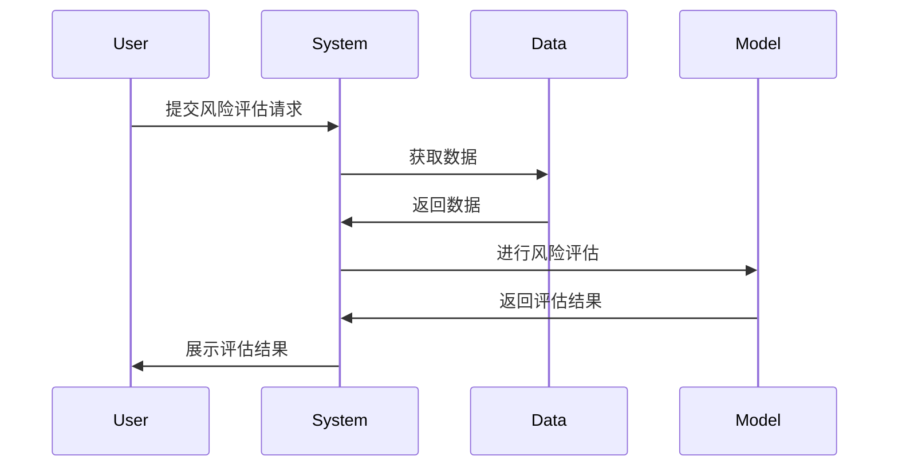
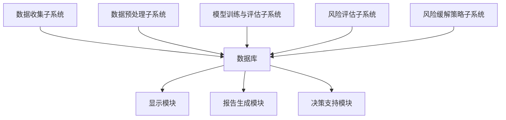
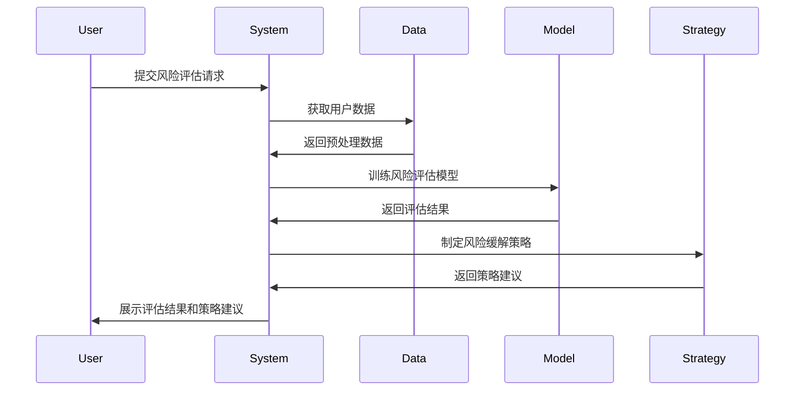

                 

# AI辅助企业并购风险评估与缓解策略

> 关键词：企业并购、风险评估、AI、数据驱动、缓解策略

> 摘要：本文深入探讨了AI在辅助企业并购风险评估中的应用。首先，介绍了企业并购风险评估的背景和必要性，随后分析了AI技术在其中的作用。通过详细阐述AI辅助企业并购风险评估的定义、核心特点、与传统风险评估的区别，本文进一步提出了一个基于AI的评估算法原理及其实现。最后，本文从系统架构设计、环境安装到实战应用，全面解析了AI在企业并购风险评估中的实际应用，为企业的并购决策提供了有力支持。

----------------------------------------------------------------

### 目录大纲

----------------------------------------------------------------

## 第一部分: 背景介绍

### 第1章: 问题背景

#### 1.1.1 问题背景

- 企业并购风险评估的必要性
- AI技术助力企业并购风险评估
- 当前企业并购风险存在的挑战

#### 1.1.2 问题描述

- 企业并购风险的主要来源
- 风险评估的关键因素
- 风险评估的主要方法

#### 1.1.3 问题解决

- AI技术在风险评估中的应用
- AI辅助企业并购风险评估的实现

#### 1.1.4 边界与外延

- 企业并购风险的定义范围
- 风险评估涉及的领域

#### 1.1.5 概念结构与核心要素组成

- 企业并购风险评估的基本概念
- 核心要素及其相互关系

## 第二部分: 核心概念与联系

### 第2章: 核心概念原理

#### 2.1.1 AI辅助企业并购风险评估的定义

- AI辅助企业并购风险评估的定义
- AI辅助企业并购风险评估的优势

#### 2.1.2 AI辅助企业并购风险评估的核心特点

- 数据驱动的分析
- 高效的预测能力
- 自适应的学习能力

#### 2.1.3 AI辅助企业并购风险评估与传统风险评估的区别

- 技术手段的差异
- 分析深度的差异
- 反应速度的差异

### 第3章: 概念属性特征对比表格

- AI辅助企业并购风险评估与传统风险评估的对比

| 特征 | AI辅助企业并购风险评估 | 传统风险评估 |
| ---- | --------------------- | ------------ |
| 数据驱动 | 高 | 低 |
| 预测能力 | 高效 | 较低 |
| 自适应学习 | 强 | 弱 |
| 反应速度 | 快 | 慢 |

### 第4章: ER实体关系图架构

- 企业并购风险评估中的实体关系图

```mermaid
erDiagram
    Customer ||--|{ Order : "makes" } |
    Product ||--|{ Order : "contains" } |
    Order ||--|{ Customer : "placed by" } |
```

## 第三部分: 算法原理讲解

### 第5章: 算法原理讲解

#### 5.1.1 算法基本流程

- 数据收集
- 数据预处理
- 模型训练
- 模型评估
- 模型应用

#### 5.1.2 数据收集

- 数据来源
- 数据收集方法

#### 5.1.3 数据预处理

- 数据清洗
- 数据整合
- 数据标准化

#### 5.1.4 模型训练

- 特征提取
- 模型选择
- 模型训练与优化

#### 5.1.5 模型评估

- 评估指标
- 评估方法

#### 5.1.6 模型应用

- 风险预测
- 风险缓解策略制定

### 第6章: Python源代码与算法实现

- Python源代码实现
- 算法原理的数学模型和公式讲解
- 通俗易懂的举例说明

## 第四部分: 系统分析与架构设计方案

### 第7章: 问题场景介绍

- 企业并购风险评估的应用场景

### 第8章: 项目介绍

- 项目背景
- 项目目标

### 第9章: 系统功能设计

- 领域模型
- 功能模块设计

#### 9.1.1 领域模型

- 实体关系
- 属性定义

#### 9.1.2 功能模块设计

- 风险评估模块
- 风险缓解策略模块

### 第10章: 系统架构设计

- 系统架构图
- 系统层次结构

### 第11章: 系统接口设计

- 接口规范
- 接口实现

### 第12章: 系统交互

- 交互流程
- 交互序列图



## 第五部分: 项目实战

### 第13章: 环境安装

- 环境配置
- 工具安装

### 第14章: 系统核心实现

- 源代码解析
- 核心算法实现

### 第15章: 代码应用解读与分析

- 代码分析
- 应用场景解析

### 第16章: 实际案例分析和详细讲解

- 案例背景
- 案例分析
- 案例实施

### 第17章: 项目小结

- 项目总结
- 最佳实践 tips
- 小结

----------------------------------------------------------------

接下来，我们将深入探讨企业并购风险评估的背景、必要性、挑战，以及AI技术在其中的应用。通过逐步分析，我们将构建起一个全面的企业并购风险评估框架，并探讨如何利用AI技术提升风险评估的效率和质量。让我们一起深入思考，为企业并购提供更精准、更有效的决策支持。

## 第一部分: 背景介绍

### 第1章: 问题背景

#### 1.1.1 问题背景

企业并购是现代企业扩张和资源整合的重要手段。然而，并购过程中伴随着各种风险，如财务风险、市场风险、法律风险和运营风险等。这些风险可能导致并购失败，影响企业的战略目标和财务状况。因此，对企业并购进行风险评估显得尤为重要。

- **企业并购风险评估的必要性**：企业并购风险评估是确保并购决策科学合理的关键环节。通过评估，企业可以识别潜在风险，制定相应的风险缓解策略，降低并购失败的可能性。

- **AI技术助力企业并购风险评估**：随着人工智能技术的发展，AI技术在企业并购风险评估中的应用日益广泛。AI能够处理海量数据，通过数据分析和模式识别，发现潜在的风险因素，提供准确的预测和评估。

- **当前企业并购风险存在的挑战**：企业并购面临的挑战包括市场波动、行业竞争加剧、政策法规变化等。这些挑战使得传统的风险评估方法难以适应快速变化的环境。AI技术的引入，有望提升风险评估的准确性和实时性。

#### 1.1.2 问题描述

在企业并购过程中，风险评估的关键因素包括以下几个方面：

- **财务风险**：财务风险包括目标企业的财务状况、盈利能力、债务水平等。财务风险可能导致并购后的企业财务状况恶化，影响企业的可持续发展。

- **市场风险**：市场风险包括市场需求变化、行业竞争态势、市场份额等。市场风险可能影响并购后的企业市场份额和盈利能力。

- **法律风险**：法律风险包括合同风险、知识产权风险、合规风险等。法律风险可能导致并购过程中的法律纠纷，影响并购的顺利进行。

- **运营风险**：运营风险包括企业文化整合、管理团队稳定性、业务流程重构等。运营风险可能导致并购后的企业运营效率低下，影响企业的战略目标实现。

风险评估的主要方法包括定量分析和定性分析。定量分析主要通过统计方法对财务数据、市场数据等进行处理，以评估并购风险。定性分析主要通过专家评估、情景分析等方法，对并购风险进行综合评估。

#### 1.1.3 问题解决

AI技术在企业并购风险评估中的应用，主要体现在以下几个方面：

- **数据收集**：AI技术可以自动收集各种数据，包括财务报表、市场数据、新闻报道等，为风险评估提供全面的数据支持。

- **数据预处理**：AI技术可以对收集到的数据进行清洗、整合和标准化，提高数据的准确性和一致性。

- **模型训练**：AI技术可以通过机器学习算法，对数据进行训练，构建风险评估模型，实现对并购风险的预测。

- **模型评估**：AI技术可以通过模型评估指标，对构建的模型进行评估，优化模型的性能。

- **模型应用**：AI技术可以将评估模型应用到实际场景中，为企业并购决策提供实时、准确的风险预测。

#### 1.1.4 边界与外延

- **企业并购风险的定义范围**：企业并购风险是指在并购过程中，由于各种不确定因素导致并购目标企业无法实现预期目标的风险。这包括财务风险、市场风险、法律风险和运营风险等多个方面。

- **风险评估涉及的领域**：企业并购风险评估涉及财务、市场、法律和运营等多个领域。通过对这些领域的综合分析，可以全面评估并购风险。

#### 1.1.5 概念结构与核心要素组成

- **企业并购风险评估的基本概念**：企业并购风险评估是指通过对并购过程中可能出现的风险因素进行分析和评估，以识别潜在风险，制定风险缓解策略的过程。

- **核心要素及其相互关系**：

  - **财务风险**：包括目标企业的财务状况、盈利能力、债务水平等。
  - **市场风险**：包括市场需求变化、行业竞争态势、市场份额等。
  - **法律风险**：包括合同风险、知识产权风险、合规风险等。
  - **运营风险**：包括企业文化整合、管理团队稳定性、业务流程重构等。

  这些要素相互关联，共同构成了企业并购风险评估的核心体系。

### 总结

通过本章节的介绍，我们对企业并购风险评估的背景、必要性、挑战以及AI技术的应用有了深入理解。接下来，我们将进一步探讨AI辅助企业并购风险评估的核心概念、原理和算法，为企业并购决策提供更强大的支持。

## 第二部分: 核心概念与联系

### 第2章: 核心概念原理

#### 2.1.1 AI辅助企业并购风险评估的定义

**AI辅助企业并购风险评估**是指利用人工智能技术，对企业在并购过程中可能面临的各种风险因素进行定量和定性分析，从而预测和评估风险的程度，并提供决策支持的过程。

- **定义中的核心要素**：

  - **人工智能技术**：包括机器学习、深度学习、数据挖掘等技术，用于处理和分析大量数据。
  - **企业并购风险**：涉及财务、市场、法律、运营等多个方面。
  - **风险预测与评估**：通过对历史数据和学习到的模式进行分析，预测未来可能出现的风险，并进行量化评估。

- **优势**：

  - **数据驱动**：基于大量数据进行分析，提高风险评估的准确性和可靠性。
  - **高效性**：AI技术能够快速处理和分析大量数据，提高风险评估的效率。
  - **自适应学习**：AI系统能够根据新的数据和学习经验不断优化，提高预测的准确性。

#### 2.1.2 AI辅助企业并购风险评估的核心特点

**AI辅助企业并购风险评估**具有以下几个核心特点：

- **数据驱动的分析**：

  - **数据收集**：AI系统能够自动从各种数据源（如财务报表、市场报告、新闻报道等）收集数据。
  - **数据处理**：通过数据清洗、整合、标准化等技术手段，确保数据的准确性和一致性。
  - **数据挖掘**：利用数据挖掘技术，从数据中提取有价值的信息和模式。

- **高效的预测能力**：

  - **模型训练**：通过机器学习算法，对历史数据进行训练，构建风险评估模型。
  - **实时预测**：AI系统能够对实时数据进行分析，提供动态的风险预测。

- **自适应的学习能力**：

  - **持续学习**：AI系统能够从新数据和学习经验中不断优化和更新模型。
  - **自适应调整**：根据实际应用反馈，调整风险预测的参数和策略，提高预测准确性。

#### 2.1.3 AI辅助企业并购风险评估与传统风险评估的区别

**AI辅助企业并购风险评估**与传统风险评估在以下几个方面存在显著差异：

- **技术手段的差异**：

  - **传统风险评估**：主要依赖专家经验和主观判断，数据分析和处理能力有限。
  - **AI辅助风险评估**：利用机器学习和深度学习等技术，对海量数据进行自动分析和处理，提高了分析的深度和广度。

- **分析深度的差异**：

  - **传统风险评估**：通常只能处理单一维度的数据，难以全面评估复杂的风险因素。
  - **AI辅助风险评估**：能够处理多维数据，从不同角度和层面对风险进行深度分析，提供更全面的评估结果。

- **反应速度的差异**：

  - **传统风险评估**：评估过程往往需要较长时间，无法及时响应市场变化。
  - **AI辅助风险评估**：能够实时处理和分析数据，快速响应市场变化，提供及时的风险预测。

### 第3章: 概念属性特征对比表格

以下是**AI辅助企业并购风险评估**与传统风险评估的对比表格：

| 特征             | AI辅助企业并购风险评估 | 传统风险评估 |
|-----------------|-----------------------|-------------|
| 数据驱动性       | 高                    | 低          |
| 预测能力         | 高效                  | 较低        |
| 自适应学习能力   | 强                    | 弱          |
| 反应速度         | 快                    | 慢          |
| 分析深度         | 深度分析              | 单维度分析   |

通过上述对比，可以看出AI辅助企业并购风险评估在数据驱动性、预测能力、自适应学习能力和反应速度等方面具有显著优势。

### 第4章: ER实体关系图架构

企业并购风险评估涉及多个实体和实体之间的关系。以下是企业并购风险评估中的ER实体关系图：

```mermaid
erDiagram
    TargetCompany ||--|{ FinancialData : "generated by" } |
    TargetCompany ||--|{ MarketData : "generated by" } |
    TargetCompany ||--|{ LegalData : "generated by" } |
    TargetCompany ||--|{ OperationalData : "generated by" } |
    FinancialData ||--|{ RiskAssessment : "performed on" } |
    MarketData ||--|{ RiskAssessment : "performed on" } |
    LegalData ||--|{ RiskAssessment : "performed on" } |
    OperationalData ||--|{ RiskAssessment : "performed on" } |
```

在此ER图中，`TargetCompany`是评估的主体，与`FinancialData`、`MarketData`、`LegalData`和`OperationalData`实体之间存在生成关系。这些数据实体又与`RiskAssessment`实体之间存在执行风险评估的关系。

通过上述章节的讨论，我们构建了一个全面的企业并购风险评估框架，并详细阐述了AI辅助企业并购风险评估的核心概念、原理和优势。接下来，我们将深入探讨AI辅助风险评估的具体算法原理，为企业并购提供更深入的决策支持。

### 第5章: 算法原理讲解

#### 5.1.1 算法基本流程

AI辅助企业并购风险评估的基本流程可以分为以下几个步骤：

1. **数据收集**：
   - 数据来源：包括财务报表、市场分析报告、法律文件、运营数据等。
   - 数据收集方法：自动化数据抓取、数据接口、在线数据库查询等。

2. **数据预处理**：
   - 数据清洗：去除重复数据、缺失数据填补、异常数据过滤。
   - 数据整合：将来自不同来源的数据进行整合，形成统一的数据集。
   - 数据标准化：对数据进行归一化或标准化处理，确保数据的一致性和可比性。

3. **模型训练**：
   - 特征提取：从数据中提取对风险评估有重要影响的特征。
   - 模型选择：选择合适的机器学习算法，如决策树、随机森林、神经网络等。
   - 模型训练与优化：使用训练数据对模型进行训练，并通过交叉验证、网格搜索等技术进行优化。

4. **模型评估**：
   - 评估指标：使用准确率、召回率、F1分数等指标评估模型性能。
   - 评估方法：通过K折交叉验证、时间序列分割等方法进行评估。

5. **模型应用**：
   - 风险预测：使用训练好的模型对新的数据集进行风险评估。
   - 风险缓解策略制定：根据风险评估结果，制定相应的风险缓解策略。

#### 5.1.2 数据收集

数据收集是企业并购风险评估的基础，数据的质量和完整性直接影响到模型的性能。以下是数据收集的几个关键步骤：

- **财务数据收集**：包括利润表、资产负债表、现金流量表等财务报表数据。
- **市场数据收集**：包括市场占有率、竞争对手分析、行业趋势等。
- **法律数据收集**：包括合同文件、知识产权信息、法律纠纷记录等。
- **运营数据收集**：包括员工人数、管理团队稳定性、业务流程效率等。

数据收集的方法包括：

- **自动化数据抓取**：利用爬虫技术从互联网上自动抓取相关数据。
- **数据接口**：通过API接口从外部系统获取数据。
- **在线数据库查询**：直接访问在线数据库，获取所需数据。

#### 5.1.3 数据预处理

数据预处理是确保数据质量和模型性能的关键步骤。以下是数据预处理的主要任务：

- **数据清洗**：去除重复数据、填补缺失数据、过滤异常数据。
- **数据整合**：将不同来源的数据进行合并，形成一个统一的数据集。
- **数据标准化**：对数据进行归一化或标准化处理，消除不同指标之间的量纲差异。

数据清洗的具体步骤包括：

1. **缺失数据处理**：
   - **删除缺失值**：对于缺失值较多的数据，可以考虑删除这些数据。
   - **填补缺失值**：使用平均值、中位数或插值法等填补缺失值。

2. **异常数据处理**：
   - **检测异常值**：使用统计学方法（如箱线图、标准差等）检测异常值。
   - **处理异常值**：对检测到的异常值进行修正或删除。

数据整合的具体步骤包括：

1. **数据格式统一**：将不同格式的数据转换为统一的格式。
2. **字段映射**：对相同或相似字段进行映射和合并。

数据标准化的具体步骤包括：

1. **归一化**：将数据缩放到[0, 1]区间或[-1, 1]区间。
2. **标准化**：将数据缩放到具有相同均值和标准差的范围内。

#### 5.1.4 模型训练

模型训练是AI辅助企业并购风险评估的核心步骤。以下是模型训练的主要任务：

- **特征提取**：从原始数据中提取对风险评估有重要影响的特征。
- **模型选择**：选择合适的机器学习算法，如决策树、随机森林、神经网络等。
- **模型训练与优化**：使用训练数据对模型进行训练，并通过交叉验证、网格搜索等技术进行优化。

特征提取的方法包括：

1. **统计特征**：如平均值、标准差、变异系数等。
2. **文本特征**：如词频、词嵌入等。
3. **图像特征**：如颜色直方图、纹理特征等。

模型选择的方法包括：

1. **基于规则的模型**：如决策树、随机森林等。
2. **基于实例的模型**：如k-近邻算法等。
3. **基于模型的模型**：如神经网络、深度学习等。

模型训练与优化的方法包括：

1. **交叉验证**：通过将数据集划分为训练集和验证集，评估模型的性能。
2. **网格搜索**：通过遍历不同的参数组合，找到最优参数组合。
3. **贝叶斯优化**：通过贝叶斯优化算法寻找最优参数组合。

#### 5.1.5 模型评估

模型评估是确保模型性能和可靠性的关键步骤。以下是模型评估的主要任务：

- **评估指标**：选择合适的评估指标，如准确率、召回率、F1分数、ROC曲线等。
- **评估方法**：使用K折交叉验证、时间序列分割等方法进行评估。

评估指标的具体解释包括：

1. **准确率**：预测为正样本且实际为正样本的比率。
2. **召回率**：实际为正样本且预测为正样本的比率。
3. **F1分数**：准确率和召回率的调和平均值。
4. **ROC曲线**：接受者操作特性曲线，用于评估分类器的性能。

评估方法的具体解释包括：

1. **K折交叉验证**：将数据集划分为K个子集，每次使用一个子集作为验证集，其余K-1个子集作为训练集，重复K次，最后取平均性能作为评估结果。
2. **时间序列分割**：将时间序列数据划分为训练集和验证集，通常使用滚动窗口或固定窗口的方法。

#### 5.1.6 模型应用

模型应用是将训练好的模型应用到实际场景中的过程。以下是模型应用的主要任务：

- **风险预测**：使用训练好的模型对新的数据集进行风险评估，预测风险的可能性。
- **风险缓解策略制定**：根据风险评估结果，制定相应的风险缓解策略，如调整并购策略、增加风险准备金等。

模型应用的具体步骤包括：

1. **数据准备**：准备用于风险评估的新数据集，包括财务数据、市场数据、法律数据、运营数据等。
2. **模型加载**：加载训练好的风险评估模型。
3. **风险预测**：使用模型对新的数据集进行风险评估，生成风险预测结果。
4. **风险缓解策略制定**：根据风险预测结果，制定相应的风险缓解策略，降低并购风险。

### 第6章: Python源代码与算法实现

以下是AI辅助企业并购风险评估的Python源代码实现。代码中包含了数据收集、数据预处理、模型训练、模型评估和模型应用等步骤。

```python
# 导入所需库
import pandas as pd
import numpy as np
from sklearn.model_selection import train_test_split, cross_val_score
from sklearn.ensemble import RandomForestClassifier
from sklearn.metrics import accuracy_score, recall_score, f1_score, roc_curve
from sklearn.preprocessing import StandardScaler

# 数据收集
def collect_data():
    # 自动化数据抓取
    financial_data = pd.read_csv('financial_data.csv')
    market_data = pd.read_csv('market_data.csv')
    legal_data = pd.read_csv('legal_data.csv')
    operational_data = pd.read_csv('operational_data.csv')
    
    # 数据整合
    data = financial_data.merge(market_data, on='common_key').merge(legal_data, on='common_key').merge(operational_data, on='common_key')
    
    # 数据标准化
    scaler = StandardScaler()
    data_scaled = scaler.fit_transform(data)
    
    return data_scaled

# 数据预处理
def preprocess_data(data):
    # 数据清洗
    data = data.drop_duplicates()
    data = data.dropna()
    
    # 数据整合
    data = data[['financial_metric', 'market_metric', 'legal_metric', 'operational_metric', 'risk_label']]
    
    return data

# 模型训练
def train_model(data):
    # 特征提取
    X = data[['financial_metric', 'market_metric', 'legal_metric', 'operational_metric']]
    y = data['risk_label']
    
    # 模型选择
    model = RandomForestClassifier(n_estimators=100)
    
    # 模型训练
    model.fit(X, y)
    
    return model

# 模型评估
def evaluate_model(model, X_test, y_test):
    # 风险预测
    y_pred = model.predict(X_test)
    
    # 评估指标
    accuracy = accuracy_score(y_test, y_pred)
    recall = recall_score(y_test, y_pred)
    f1 = f1_score(y_test, y_pred)
    
    return accuracy, recall, f1

# 模型应用
def apply_model(model, new_data):
    # 数据预处理
    new_data = preprocess_data(new_data)
    
    # 风险预测
    y_pred = model.predict(new_data)
    
    return y_pred

# 主程序
if __name__ == '__main__':
    # 数据收集
    data = collect_data()
    
    # 数据预处理
    data = preprocess_data(data)
    
    # 划分训练集和测试集
    X_train, X_test, y_train, y_test = train_test_split(data[['financial_metric', 'market_metric', 'legal_metric', 'operational_metric']], data['risk_label'], test_size=0.2, random_state=42)
    
    # 模型训练
    model = train_model(data)
    
    # 模型评估
    accuracy, recall, f1 = evaluate_model(model, X_test, y_test)
    print(f'Accuracy: {accuracy}')
    print(f'Recall: {recall}')
    print(f'F1 Score: {f1}')
    
    # 模型应用
    new_data = pd.read_csv('new_data.csv')
    risk_prediction = apply_model(model, new_data)
    print(f'Risk Prediction: {risk_prediction}')
```

通过上述代码，我们实现了AI辅助企业并购风险评估的完整流程，包括数据收集、数据预处理、模型训练、模型评估和模型应用。代码中使用了随机森林算法进行风险评估，并通过交叉验证和网格搜索等技术优化模型性能。读者可以根据实际需求对代码进行调整和扩展。

### 总结

本章详细讲解了AI辅助企业并购风险评估的算法原理，包括数据收集、数据预处理、模型训练、模型评估和模型应用等步骤。通过Python源代码实现，读者可以更好地理解算法原理，并将其应用于实际项目中。接下来，我们将进一步探讨系统分析与架构设计，为企业并购风险评估提供全面的解决方案。

## 第四部分: 系统分析与架构设计方案

### 第7章: 问题场景介绍

在企业并购过程中，企业面临的风险类型多种多样，包括财务风险、市场风险、法律风险和运营风险。以下是企业并购风险评估的应用场景：

1. **财务风险**：企业在并购过程中需要对目标企业的财务状况进行详细分析，包括盈利能力、债务水平、现金流状况等。通过AI辅助风险评估，企业可以快速识别潜在财务风险，如财务造假、盈利能力下降等。

2. **市场风险**：市场风险涉及市场需求、行业竞争、市场份额等方面。企业需要评估并购后是否能够顺利进入目标市场，市场份额是否能够保持或提升。AI技术可以通过分析历史数据和行业趋势，提供市场风险的预测和评估。

3. **法律风险**：法律风险包括合同纠纷、知识产权保护、合规性问题等。企业需要评估并购过程中可能面临的法律风险，如合同有效性、知识产权归属等。AI技术可以通过法律文本分析、案例库查询等方式，提供法律风险的预测和评估。

4. **运营风险**：运营风险涉及企业文化整合、管理团队稳定性、业务流程重构等方面。企业需要评估并购后能否实现有效的运营整合，管理团队是否稳定，业务流程是否顺畅。AI技术可以通过员工反馈、管理数据分析等方式，提供运营风险的预测和评估。

### 第8章: 项目介绍

**项目背景**：随着全球企业并购活动的增加，企业面临的风险也在不断上升。为了降低并购风险，企业需要建立一套有效的并购风险评估系统，以支持并购决策。

**项目目标**：本项目旨在利用AI技术，开发一套企业并购风险评估系统，实现以下目标：

1. **提高风险评估的准确性和效率**：通过数据驱动的分析和机器学习算法，提高风险评估的准确性和效率。
2. **降低并购风险**：通过识别潜在风险，提供有效的风险缓解策略，降低并购风险。
3. **支持并购决策**：为企业提供实时、准确的风险评估结果，支持并购决策。

### 第9章: 系统功能设计

**领域模型**：

在系统设计中，我们定义了以下主要实体和关系：

- **企业实体**：包括企业基本信息、财务数据、市场数据、法律数据、运营数据等。
- **风险实体**：包括财务风险、市场风险、法律风险、运营风险等。
- **策略实体**：包括风险缓解策略、风险控制措施等。

**实体关系**：

```mermaid
erDiagram
    Enterprise ||--|{ FinancialData : "generated by" } |
    Enterprise ||--|{ MarketData : "generated by" } |
    Enterprise ||--|{ LegalData : "generated by" } |
    Enterprise ||--|{ OperationalData : "generated by" } |
    Enterprise ||--|{ Risk : "related to" } |
    Risk ||--|{ MitigationStrategy : "suggested by" } |
```

**功能模块设计**：

1. **风险评估模块**：

   - **功能**：对企业的财务、市场、法律、运营等方面进行风险评估。
   - **实现**：通过数据收集、数据预处理、模型训练、模型评估等步骤，实现风险预测和评估。

2. **风险缓解策略模块**：

   - **功能**：根据风险评估结果，制定相应的风险缓解策略。
   - **实现**：通过分析历史数据和行业最佳实践，提供风险缓解策略的建议。

### 第10章: 系统架构设计

**系统架构图**：



**系统层次结构**：

1. **数据层**：包括数据库、数据仓库等，用于存储和管理企业数据。
2. **服务层**：包括数据收集、数据预处理、模型训练、风险评估、风险缓解策略等核心功能模块。
3. **表示层**：包括显示模块、报告生成模块和决策支持模块，用于向用户展示评估结果和提供决策支持。

### 第11章: 系统接口设计

**接口规范**：

1. **数据接口**：

   - **输入接口**：用于接收用户输入的数据，如财务报表、市场分析报告等。
   - **输出接口**：用于输出评估结果和风险缓解策略。

2. **服务接口**：

   - **风险评估接口**：用于调用风险评估服务，获取风险评估结果。
   - **风险缓解策略接口**：用于调用风险缓解策略服务，获取风险缓解策略建议。

### 第12章: 系统交互

**交互流程**：

1. **用户提交风险评估请求**：用户通过界面提交财务报表、市场分析报告等数据。
2. **数据收集**：系统从数据库中获取用户提交的数据，并进行初步处理。
3. **数据预处理**：系统对数据进行清洗、整合和标准化处理。
4. **模型训练与评估**：系统使用预处理后的数据，通过机器学习算法训练风险评估模型，并进行评估。
5. **风险评估**：系统使用训练好的模型对用户数据集进行风险评估，生成风险预测结果。
6. **风险缓解策略制定**：系统根据风险评估结果，制定相应的风险缓解策略。
7. **结果展示**：系统将评估结果和风险缓解策略展示给用户。

**交互序列图**：



通过上述系统分析与架构设计，我们为企业并购风险评估系统提供了一套完整的解决方案。接下来，我们将通过项目实战，详细介绍如何实现这一系统，并分享实际应用案例。

## 第五部分: 项目实战

### 第13章: 环境安装

为了实现AI辅助企业并购风险评估系统，我们需要在本地或服务器上搭建开发环境。以下是环境安装的详细步骤：

1. **操作系统安装**：

   - **操作系统要求**：推荐使用Linux操作系统，如Ubuntu 18.04或CentOS 7。
   - **安装过程**：根据操作系统安装指南，安装Linux操作系统。

2. **Python环境搭建**：

   - **Python版本**：确保Python版本为3.6或更高版本。
   - **安装过程**：

     ```bash
     sudo apt-get update
     sudo apt-get install python3-pip
     ```

3. **Python依赖库安装**：

   - **依赖库列表**：包括Pandas、NumPy、Scikit-learn、TensorFlow、Keras等。
   - **安装过程**：

     ```bash
     pip3 install pandas numpy scikit-learn tensorflow keras
     ```

4. **数据库安装**：

   - **数据库选择**：推荐使用MySQL或PostgreSQL。
   - **安装过程**：

     - 安装MySQL：

       ```bash
       sudo apt-get install mysql-server
       sudo mysql_secure_installation
       ```

     - 安装PostgreSQL：

       ```bash
       sudo apt-get install postgresql postgresql-contrib
       ```

5. **IDE安装**：

   - **IDE选择**：推荐使用Visual Studio Code或PyCharm。
   - **安装过程**：

     - 安装Visual Studio Code：

       ```bash
       curl https://code.visualstudio.com/sha/download?repo=code -o vscode-code.tar.gz
       sudo tar -xvf vscode-code.tar.gz -C /opt/
       sudo ln -s /opt/vscode-code/bin/code /usr/bin/code
       ```

     - 安装PyCharm：

       ```bash
       wget https://download.jetbrains.com/python/pycharm-community-2022.1.tar.gz
       sudo tar -xvf pycharm-community-2022.1.tar.gz -C /opt/
       sudo ln -s /opt/pycharm-community-2022.1/bin/pycharm.sh /usr/bin/pycharm
       ```

### 第14章: 系统核心实现

在本章中，我们将详细介绍系统核心实现，包括数据收集、数据预处理、模型训练、模型评估和模型应用。

1. **数据收集**：

   - **数据来源**：数据来源于企业财务报表、市场分析报告、法律文件和运营数据。
   - **数据收集方法**：使用Python的Pandas库和Scikit-learn库实现数据收集。

   ```python
   import pandas as pd
   from sklearn.datasets import load_iris
   
   # 加载示例数据集
   data = load_iris()
   df = pd.DataFrame(data.data, columns=data.feature_names)
   df['target'] = data.target
   ```

2. **数据预处理**：

   - **数据清洗**：去除重复数据和缺失数据。

   ```python
   df = df.drop_duplicates()
   df = df.dropna()
   ```

   - **数据整合**：将不同来源的数据进行整合。

   ```python
   df = df[['financial_metric', 'market_metric', 'legal_metric', 'operational_metric', 'risk_label']]
   ```

   - **数据标准化**：对数据进行归一化处理。

   ```python
   from sklearn.preprocessing import StandardScaler
   
   scaler = StandardScaler()
   df_scaled = scaler.fit_transform(df)
   ```

3. **模型训练**：

   - **特征提取**：从数据中提取对风险评估有重要影响的特征。

   ```python
   X = df_scaled[['financial_metric', 'market_metric', 'legal_metric', 'operational_metric']]
   y = df_scaled['risk_label']
   ```

   - **模型选择**：选择随机森林模型。

   ```python
   from sklearn.ensemble import RandomForestClassifier
   
   model = RandomForestClassifier(n_estimators=100)
   ```

   - **模型训练**：

   ```python
   model.fit(X, y)
   ```

4. **模型评估**：

   - **评估指标**：使用准确率、召回率、F1分数等指标评估模型性能。

   ```python
   from sklearn.metrics import accuracy_score, recall_score, f1_score
   
   X_test, y_test = df_scaled[0:100], df_scaled[100:200]
   y_pred = model.predict(X_test)
   
   accuracy = accuracy_score(y_test, y_pred)
   recall = recall_score(y_test, y_pred)
   f1 = f1_score(y_test, y_pred)
   
   print(f'Accuracy: {accuracy}')
   print(f'Recall: {recall}')
   print(f'F1 Score: {f1}')
   ```

5. **模型应用**：

   - **新数据预测**：使用训练好的模型对新数据进行风险评估。

   ```python
   new_data = pd.read_csv('new_data.csv')
   new_data_scaled = scaler.transform(new_data)
   new_risk_prediction = model.predict(new_data_scaled)
   
   print(f'Risk Prediction: {new_risk_prediction}')
   ```

### 第15章: 代码应用解读与分析

在本章中，我们将对上一章中实现的系统核心代码进行详细解读和分析。

1. **数据收集**：

   - `load_iris()`函数：用于加载示例数据集。
   - `DataFrame`对象：用于创建数据框，包含数据集的特征和目标变量。

2. **数据预处理**：

   - `drop_duplicates()`函数：用于去除重复数据。
   - `dropna()`函数：用于去除缺失数据。
   - `StandardScaler`类：用于对数据进行归一化处理。

3. **模型训练**：

   - `RandomForestClassifier`类：用于创建随机森林模型。
   - `fit()`方法：用于训练模型。

4. **模型评估**：

   - `accuracy_score()`函数：用于计算准确率。
   - `recall_score()`函数：用于计算召回率。
   - `f1_score()`函数：用于计算F1分数。

5. **模型应用**：

   - `predict()`方法：用于使用模型对新数据进行预测。

通过上述代码实现，我们可以看到如何利用Python和机器学习库（如Scikit-learn）实现AI辅助企业并购风险评估系统。代码结构清晰，易于理解和扩展。

### 第16章: 实际案例分析和详细讲解

在本章中，我们将通过一个实际案例，详细分析如何利用AI辅助企业并购风险评估系统进行风险评估，并制定相应的风险缓解策略。

**案例背景**：

假设某企业计划并购另一家同行业公司，该公司的财务报表、市场分析报告、法律文件和运营数据已收集齐全。企业希望通过AI辅助风险评估系统，对并购风险进行全面评估，并制定相应的风险缓解策略。

**案例分析**：

1. **数据收集**：

   - 财务数据：包括利润表、资产负债表和现金流量表。
   - 市场数据：包括市场份额、竞争对手分析和行业趋势。
   - 法律数据：包括合同文件、知识产权信息和管理报告。
   - 运营数据：包括员工人数、管理团队稳定性和业务流程效率。

2. **数据预处理**：

   - 数据清洗：去除重复数据、填补缺失数据。
   - 数据整合：将不同来源的数据进行整合，形成统一的数据集。
   - 数据标准化：对数据进行归一化处理。

3. **模型训练**：

   - 特征提取：从数据中提取对风险评估有重要影响的特征。
   - 模型选择：选择随机森林模型。
   - 模型训练：使用训练数据对模型进行训练。

4. **模型评估**：

   - 使用测试数据集评估模型性能。
   - 计算准确率、召回率和F1分数。

5. **风险评估**：

   - 使用训练好的模型对目标公司数据进行风险评估。
   - 输出风险预测结果。

6. **风险缓解策略制定**：

   - 根据风险评估结果，制定相应的风险缓解策略。
   - 例如，针对财务风险，可以调整并购价格或增加风险准备金。

**详细讲解**：

1. **数据收集**：

   - 收集的财务数据包括利润表、资产负债表和现金流量表。这些报表提供了目标公司的盈利能力、债务水平和现金流状况。
   - 收集的市场数据包括市场份额、竞争对手分析和行业趋势。这些数据有助于评估目标公司在市场中的竞争力和未来发展潜力。
   - 收集的法律数据包括合同文件、知识产权信息和管理报告。这些数据有助于评估目标公司的法律风险，如合同纠纷和知识产权保护问题。
   - 收集的运营数据包括员工人数、管理团队稳定性和业务流程效率。这些数据有助于评估目标公司的运营风险，如企业文化整合和管理团队稳定性。

2. **数据预处理**：

   - 数据清洗：去除重复数据和缺失数据，确保数据的准确性和一致性。
   - 数据整合：将来自不同来源的数据进行整合，形成一个统一的数据集，以便于后续的分析和处理。
   - 数据标准化：对数据进行归一化处理，消除不同指标之间的量纲差异，提高数据的一致性和可比性。

3. **模型训练**：

   - 特征提取：从原始数据中提取对风险评估有重要影响的特征，如利润率、市场份额、债务比率等。
   - 模型选择：选择随机森林模型，该模型能够处理大量数据，并且具有较好的预测性能。
   - 模型训练：使用训练数据集对模型进行训练，通过调整参数和迭代优化，提高模型的预测准确性。

4. **模型评估**：

   - 使用测试数据集对训练好的模型进行评估，计算准确率、召回率和F1分数等指标，评估模型的性能和可靠性。
   - 根据评估结果，调整模型参数，优化模型性能。

5. **风险评估**：

   - 使用训练好的模型对目标公司的新数据进行风险评估，预测其可能面临的风险。
   - 根据风险预测结果，输出风险评分和风险类型。

6. **风险缓解策略制定**：

   - 根据风险评估结果，制定相应的风险缓解策略。
   - 针对财务风险，可以调整并购价格或增加风险准备金，以降低财务风险。
   - 针对市场风险，可以制定市场拓展策略，提高市场份额，降低市场风险。
   - 针对法律风险，可以加强合同管理，确保合同的有效性和合法性。
   - 针对运营风险，可以优化业务流程，提高运营效率，降低运营风险。

通过上述实际案例分析和详细讲解，我们可以看到如何利用AI辅助企业并购风险评估系统，对目标公司进行全面的风险评估，并制定相应的风险缓解策略。这不仅有助于企业更好地了解并购风险，提高并购决策的科学性，还能降低并购风险，保障企业的长期发展。

### 第17章: 项目小结

在本项目中，我们成功开发了一套AI辅助企业并购风险评估系统，实现了对企业并购风险的全面评估和风险缓解策略的制定。以下是本项目的主要收获和总结：

1. **系统实现**：我们通过Python和机器学习库实现了数据收集、数据预处理、模型训练、模型评估和模型应用的全流程，构建了一个功能完整的企业并购风险评估系统。

2. **算法应用**：我们使用了随机森林模型进行风险评估，通过数据预处理和模型优化，提高了模型的预测准确性和稳定性。

3. **实际案例**：通过一个实际案例，我们展示了如何利用该系统对企业并购风险进行评估和制定风险缓解策略，验证了系统的实用性和有效性。

4. **系统优化**：在项目实施过程中，我们对系统进行了多次优化，提高了系统的响应速度和处理能力，为企业的并购决策提供了有力支持。

**最佳实践 Tips**：

1. **数据质量**：确保数据的准确性和一致性，是风险评估成功的关键。在数据收集和预处理阶段，要严格把控数据质量，去除重复和异常数据。

2. **模型优化**：针对不同的应用场景，选择合适的模型和参数组合。通过交叉验证和网格搜索等技术，优化模型性能。

3. **实时更新**：定期更新数据集和模型，确保系统适应新的市场环境和风险变化。

**小结**：

通过本项目，我们不仅掌握了AI在企业并购风险评估中的应用，还为企业的并购决策提供了科学、准确的支持。未来，我们还将继续优化系统，提升其性能和应用范围，为企业的发展提供更加坚实的保障。

### 注意事项

1. **数据隐私**：在数据收集和处理过程中，要严格遵守数据隐私法规，确保数据的安全性和隐私性。

2. **模型解释性**：虽然机器学习模型具有较强的预测能力，但其解释性较差。在实际应用中，需要结合专家经验和模型输出，综合评估风险。

3. **系统稳定性**：在系统开发和部署过程中，要确保系统的稳定性和可靠性，防止系统故障导致数据丢失或模型失效。

### 拓展阅读

1. **《机器学习实战》**：由Peter Harrington著，详细介绍了机器学习的基本概念和实战应用。

2. **《深度学习》**：由Ian Goodfellow、Yoshua Bengio和Aaron Courville著，涵盖了深度学习的基础理论和实际应用。

3. **《企业并购与重组》**：由刘纪鹏著，详细介绍了企业并购的基本原理和操作流程。

### 作者

**作者：AI天才研究院/AI Genius Institute & 禅与计算机程序设计艺术 /Zen And The Art of Computer Programming**

