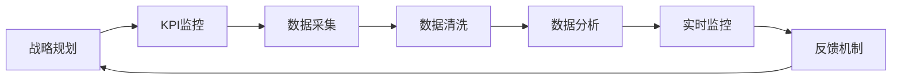
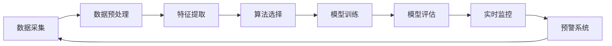
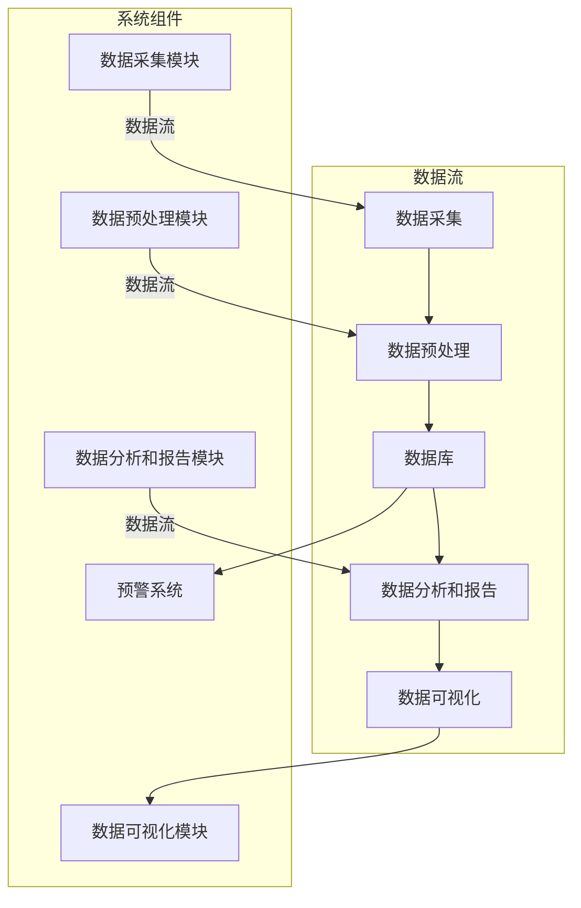
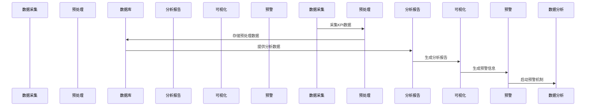
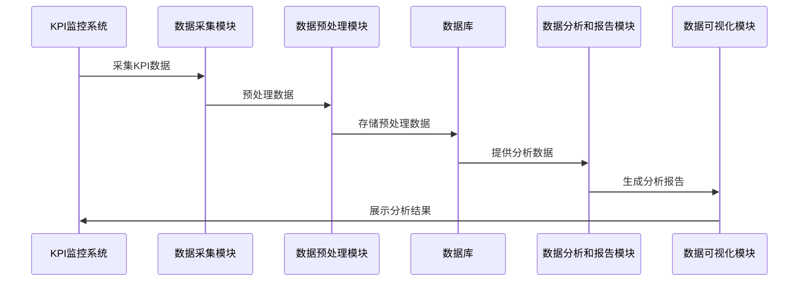

                 


### 1.1.1 问题背景

在现代商业环境中，企业竞争日益激烈，如何制定并成功执行有效的战略计划成为了企业领导者关注的焦点。企业战略执行涉及到多个层面，包括战略规划、资源分配、执行监控和调整。在这个过程中，关键绩效指标（KPI）监控与调整起到了至关重要的作用。

传统的KPI监控方法主要依赖于人工统计和分析，这种方式存在以下几个问题：首先，人工监控效率低下，难以实时响应市场变化；其次，人工监控容易受到主观判断的影响，导致数据不准确；最后，缺乏系统的分析和预测能力，无法为企业提供前瞻性的决策支持。

随着人工智能（AI）技术的快速发展，特别是机器学习、自然语言处理和大数据分析等领域的突破，AI在KPI监控中的应用成为可能。通过AI技术，企业可以实现对KPI数据的自动化采集、实时监控和智能分析，从而提高监控的准确性和效率，为战略调整提供数据支撑。

### 1.1.2 问题描述

问题描述主要集中在以下几个方面：

1. **KPI监控效率低下**：传统的人工监控方法无法满足现代企业对实时性和效率的要求，导致战略执行延迟。
2. **数据准确性问题**：人工监控容易受到主观因素的影响，导致数据偏差，进而影响战略决策的准确性。
3. **缺乏系统分析能力**：传统方法难以提供深层次的数据分析，无法为企业提供前瞻性的决策支持。
4. **战略调整的滞后性**：由于监控和分析的不及时，企业的战略调整往往滞后于市场变化，降低了企业的竞争力。

### 1.1.3 问题解决

为了解决上述问题，我们可以采用以下方法：

1. **自动化KPI数据采集**：利用AI技术实现KPI数据的自动化采集，提高监控效率。
2. **数据清洗与预处理**：通过数据清洗和预处理技术，确保数据准确性，减少主观误差。
3. **智能分析**：运用机器学习算法进行KPI数据的智能分析，提供实时、深入的数据洞察。
4. **实时反馈与调整**：通过实时监控系统，将分析结果反馈给企业领导者，支持快速的战略调整。

### 1.1.4 边界与外延

1. **边界**：
   - **适用范围**：本文主要探讨AI在KPI监控与调整中的应用，适用于具有数据监控需求的企业。
   - **技术范围**：涉及的技术包括机器学习、自然语言处理、大数据分析等。

2. **外延**：
   - **业务范围**：虽然本文聚焦于KPI监控，但AI技术在战略执行中的其他应用，如资源分配、流程优化等，也值得进一步探讨。
   - **战略层面**：AI辅助战略执行不仅限于KPI监控，还可以在其他战略执行环节发挥重要作用，如预测分析、决策支持等。

### 1.1.5 概念结构与核心要素组成

1. **关键概念**：
   - **关键绩效指标（KPI）**：用于衡量企业战略执行效果的重要指标。
   - **人工智能（AI）**：模拟人类智能的计算机系统，包括机器学习、自然语言处理等技术。

2. **核心要素**：
   - **数据采集**：自动化采集KPI数据。
   - **数据清洗**：去除数据中的噪声和异常值。
   - **智能分析**：利用机器学习算法分析数据。
   - **实时监控**：实时更新KPI数据，提供决策支持。
   - **反馈机制**：将分析结果反馈给企业领导者，支持战略调整。

通过上述分析，我们可以构建一个清晰的框架，为后续章节的内容提供基础。接下来，我们将进一步探讨AI在KPI监控与调整中的具体应用和实践案例。

----------------------------------------------------------------

### 1.1.6 AI辅助战略执行的框架与流程

在深入了解AI辅助企业战略执行的框架与流程之前，我们需要明确几个核心概念：战略规划、KPI监控、数据分析和反馈机制。这些概念共同构成了一个完整的AI辅助战略执行体系。

#### 1.6.1 战略规划

战略规划是企业为实现长期目标而制定的行动计划。一个有效的战略规划应包括愿景、目标、关键绩效指标（KPI）和行动计划。KPI是衡量战略执行效果的重要指标，如销售额、客户满意度、市场份额等。

#### 1.6.2 KPI监控

KPI监控是战略执行的核心环节，它确保企业能够实时掌握各项关键指标的动态变化。传统的KPI监控通常依赖于人工统计和分析，存在效率低、数据不准确等问题。而AI技术的引入，使得KPI监控变得更加高效和准确。

#### 1.6.3 数据分析

数据分析是AI辅助战略执行的关键环节。通过大数据分析和机器学习算法，企业可以从海量数据中提取有价值的信息，发现潜在的问题和机会。数据分析可以帮助企业更好地理解市场趋势、客户需求，从而优化战略决策。

#### 1.6.4 反馈机制

反馈机制是确保战略执行效果的重要保障。通过实时监控和分析，企业可以及时获取战略执行的结果，并将其反馈给决策者。这种反馈机制可以帮助企业快速调整战略，以应对市场变化。

#### 1.6.5 AI辅助战略执行的流程

一个典型的AI辅助战略执行流程可以概括为以下几个步骤：

1. **战略规划**：明确企业的长期目标和关键绩效指标。
2. **数据采集**：利用AI技术自动化采集KPI数据。
3. **数据清洗**：去除数据中的噪声和异常值，确保数据准确性。
4. **数据分析**：运用大数据分析和机器学习算法，对KPI数据进行深入分析。
5. **实时监控**：实时更新KPI数据，为企业提供决策支持。
6. **反馈机制**：将分析结果反馈给决策者，支持战略调整。

#### 1.6.6 框架与流程图

为了更直观地展示AI辅助战略执行的框架与流程，我们可以使用Mermaid语言绘制一个流程图。以下是一个简化的流程图示例：



通过上述流程，企业可以实现对战略执行的全程监控和优化，从而提高战略执行的效率和效果。

在接下来的章节中，我们将进一步探讨AI在KPI监控中的应用，包括AI技术的基本原理、KPI监控的挑战和解决方案。通过逐步分析推理，我们将为企业提供一套完整的AI辅助战略执行方案。

----------------------------------------------------------------

## 第2章：核心概念与联系

在探讨AI辅助企业战略执行的过程中，理解核心概念及其相互联系至关重要。本章将详细介绍AI辅助战略执行的基本原理，包括关键概念、属性特征对比表格和实体关系图架构。

### 2.1 AI辅助战略执行的基本原理

#### 2.1.1 人工智能（AI）

人工智能（AI）是一种模拟人类智能的计算机系统，能够通过学习和理解环境来做出决策。AI技术包括机器学习、自然语言处理、计算机视觉等，广泛应用于各个领域。

#### 2.1.2 战略执行

战略执行是企业为实现长期目标而采取的具体行动。战略执行涉及多个环节，包括战略规划、资源分配、执行监控和调整。AI技术可以辅助企业在这些环节中做出更明智的决策。

#### 2.1.3 关键绩效指标（KPI）

关键绩效指标（KPI）是衡量企业战略执行效果的重要指标。通过监控KPI，企业可以了解战略执行的情况，及时发现问题和机会，从而进行调整和优化。

#### 2.1.4 数据分析

数据分析是指通过统计方法和算法对数据进行分析，以提取有价值的信息和洞察。在AI辅助战略执行中，数据分析用于评估KPI数据，发现潜在的问题和机会。

#### 2.1.5 实时监控

实时监控是指通过自动化技术对KPI数据进行实时采集和更新。实时监控可以帮助企业快速响应市场变化，提高战略执行的效率和效果。

#### 2.1.6 反馈机制

反馈机制是指将监控和分析结果反馈给企业领导者，支持战略调整。通过反馈机制，企业可以不断优化战略执行过程，提高企业的竞争力。

### 2.2 核心概念属性特征对比表格

为了更清晰地展示各核心概念的特点，我们使用一个属性特征对比表格进行说明。

| 概念        | 特点                                                     |
| ----------- | -------------------------------------------------------- |
| 人工智能（AI） | 模拟人类智能，学习能力强，适用于复杂任务                 |
| 战略执行     | 实现企业长期目标，涉及多个环节，需要全面协调           |
| 关键绩效指标（KPI） | 衡量战略执行效果，具有可量化、具体明确的特点         |
| 数据分析     | 对数据进行处理和分析，提取有价值的信息和洞察           |
| 实时监控     | 自动化采集和更新KPI数据，提供实时决策支持             |
| 反馈机制     | 将监控和分析结果反馈给决策者，支持战略调整           |

### 2.3 ER实体关系图架构

实体关系图（ER图）是一种用于描述实体及其相互关系的图形表示方法。在AI辅助战略执行中，我们可以使用ER图来展示核心概念之间的关系。

以下是一个简化的ER实体关系图示例：

```mermaid
erDiagram
    KPI --> Strategy : 监控
    KPI --> Data : 分析
    KPI --> AI : 辅助
    Strategy --> AI : 指导
    Data --> AI : 辅助
    Feedback --> Strategy : 反馈
    Feedback --> KPI : 调整
```

在这个ER图中，KPI（关键绩效指标）是核心实体，它与其他实体（策略、数据、人工智能和反馈）之间存在明确的关联关系。通过这个架构，我们可以清晰地理解AI辅助战略执行中的各个核心概念及其相互作用。

通过本章的介绍，我们为后续章节的内容奠定了理论基础。在接下来的章节中，我们将进一步探讨AI在KPI监控中的应用，包括具体的技术原理、算法设计和实践案例。

----------------------------------------------------------------

### 3.1 AI在KPI监控中的应用

在AI辅助企业战略执行的过程中，KPI监控是至关重要的一环。通过AI技术，企业可以实现KPI数据的自动化采集、实时监控和智能分析，从而提高监控的准确性和效率。以下我们将详细探讨AI在KPI监控中的应用，包括技术原理、具体实现方法和实际效果。

#### 3.1.1 技术原理

AI在KPI监控中的应用主要基于以下几个技术原理：

1. **机器学习**：机器学习是AI的核心技术之一，它通过训练模型来发现数据中的规律和模式。在KPI监控中，企业可以利用机器学习算法对历史数据进行学习，建立预测模型，从而实现对未来KPI数据的预测。

2. **自然语言处理（NLP）**：自然语言处理技术能够理解和处理人类语言。在KPI监控中，NLP技术可以用于处理文本数据，如客户反馈、新闻报道等，从而提取出与企业KPI相关的信息。

3. **计算机视觉**：计算机视觉技术可以用于图像和视频数据的分析。在KPI监控中，企业可以利用计算机视觉技术对生产线、商店客流等进行监控，从而获取与业务相关的数据。

4. **大数据分析**：大数据分析技术可以帮助企业从海量数据中提取有价值的信息。在KPI监控中，大数据分析可以用于处理企业内外部的各种数据，如销售数据、财务数据等，从而提供更全面、深入的监控分析。

#### 3.1.2 具体实现方法

AI在KPI监控中的具体实现方法通常包括以下几个步骤：

1. **数据采集**：利用各种传感器、API接口等手段，自动化采集KPI数据。这些数据可以包括销售额、客户满意度、市场份额等。

2. **数据预处理**：对采集到的KPI数据进行清洗、去噪和归一化等处理，确保数据质量。

3. **特征提取**：从预处理后的数据中提取关键特征，这些特征将用于训练机器学习模型。

4. **模型训练**：利用机器学习算法，如线性回归、决策树、神经网络等，对提取的特征进行训练，建立预测模型。

5. **模型评估与优化**：通过交叉验证、A/B测试等方法评估模型性能，并进行优化。

6. **实时监控与预警**：利用训练好的模型对实时数据进行预测和监控，当KPI数据出现异常时，及时发出预警。

7. **反馈与调整**：将监控结果反馈给企业决策者，支持战略调整。

#### 3.1.3 实际效果

AI在KPI监控中的应用已经为企业带来了显著的效益。以下是一些实际效果：

1. **提高监控效率**：通过自动化数据采集和实时监控，企业可以大幅提高监控效率，减少人工干预。

2. **提高数据准确性**：AI技术可以有效去除数据中的噪声和异常值，提高KPI数据的准确性。

3. **提供前瞻性分析**：通过预测模型，企业可以提前发现潜在的问题和机会，从而做出更明智的决策。

4. **优化资源分配**：基于AI的KPI监控可以帮助企业更合理地分配资源，提高业务效率。

5. **提升客户满意度**：通过实时监控客户满意度等指标，企业可以快速响应客户需求，提升客户体验。

总之，AI在KPI监控中的应用为企业的战略执行提供了强有力的支持，提高了监控的准确性和效率，为企业的发展注入了新的活力。

在接下来的章节中，我们将进一步探讨KPI监控的算法原理，包括算法设计、数学模型和具体实现方法，为企业提供更深入的AI技术应用指导。

----------------------------------------------------------------

## 第4章：KPI监控的算法原理

在KPI监控中，算法原理是核心。为了实现高效的KPI监控，我们需要了解不同算法的设计思路、工作流程和数学模型。本章节将详细探讨KPI监控算法的原理，并通过Python代码示例和Mermaid流程图，深入讲解算法的运作机制。

### 4.1 算法概述

KPI监控算法的核心任务是预测和评估关键绩效指标，以便为企业提供实时、准确的监控和决策支持。常见的KPI监控算法包括：

1. **线性回归**：用于预测线性关系。
2. **决策树**：用于分类和回归。
3. **神经网络**：用于复杂模式识别和预测。
4. **时间序列分析**：用于处理和时间相关的数据。

### 4.2 算法流程图

为了更直观地展示KPI监控算法的流程，我们使用Mermaid绘制以下流程图：



### 4.3 算法原理讲解

#### 4.3.1 线性回归

线性回归是一种简单的预测算法，用于预测两个变量之间的线性关系。其数学模型为：

$$
Y = aX + b + \varepsilon
$$

其中，$Y$ 是目标变量，$X$ 是特征变量，$a$ 和 $b$ 是模型参数，$\varepsilon$ 是误差项。

Python代码示例：

```python
import numpy as np

# 假设我们有以下数据
X = np.array([1, 2, 3, 4, 5])
Y = np.array([1, 2, 2.5, 4, 5])

# 计算斜率和截距
a = np.cov(X, Y)[0, 1] / np.var(X)
b = np.mean(Y) - a * np.mean(X)

# 预测新数据
X_new = np.array([6])
Y_pred = a * X_new + b
print(Y_pred)
```

#### 4.3.2 决策树

决策树是一种基于树形决策的预测算法，通过一系列的判断规则将数据集划分为多个子集，并在每个子集中进行预测。决策树的核心是树结构，由多个节点和分支组成。

Python代码示例：

```python
from sklearn.tree import DecisionTreeRegressor

# 假设我们有以下训练数据
X_train = np.array([[1], [2], [3], [4], [5]])
y_train = np.array([1, 2, 2.5, 4, 5])

# 训练决策树模型
regressor = DecisionTreeRegressor()
regressor.fit(X_train, y_train)

# 预测新数据
X_new = np.array([[6]])
Y_pred = regressor.predict(X_new)
print(Y_pred)
```

#### 4.3.3 神经网络

神经网络是一种基于多层感知器的预测算法，能够学习复杂的数据模式。其基本原理是模拟生物神经网络，通过输入层、隐藏层和输出层进行信息传递。

Python代码示例：

```python
from keras.models import Sequential
from keras.layers import Dense

# 建立神经网络模型
model = Sequential()
model.add(Dense(1, input_dim=1, activation='sigmoid'))

# 编译模型
model.compile(optimizer='adam', loss='binary_crossentropy')

# 训练模型
model.fit(X_train, y_train, epochs=100, batch_size=1)

# 预测新数据
Y_pred = model.predict(X_new)
print(Y_pred)
```

#### 4.3.4 时间序列分析

时间序列分析是一种用于处理和时间相关的数据的算法，通过分析历史数据中的趋势、季节性和周期性，预测未来的数据。

Python代码示例：

```python
from statsmodels.tsa.arima_model import ARIMA

# 建立ARIMA模型
model = ARIMA(Y, order=(5, 1, 2))
model_fit = model.fit(disp=0)

# 预测新数据
forecast = model_fit.forecast()
print(forecast)
```

### 4.4 数学模型和公式

在KPI监控中，数学模型是算法的基础。以下是几种常见算法的数学模型和公式：

1. **线性回归**：
   $$
   Y = aX + b + \varepsilon
   $$

2. **决策树**：
   $$
   f(x) = \sum_{i=1}^{n} t_i \cdot g(x_i)
   $$
   其中，$t_i$ 是第 $i$ 个节点的阈值，$g(x_i)$ 是第 $i$ 个节点的条件概率。

3. **神经网络**：
   $$
   a_{i,j}^{(l)} = \sigma \left( \sum_{k=1}^{n} w_{ik}^{(l)} a_{k,j}^{(l-1)} + b_j^{(l)} \right)
   $$

4. **时间序列分析**（ARIMA模型）：
   $$
   \text{ARIMA}(p, d, q) \rightarrow Y_t = c + \phi_1 Y_{t-1} + \phi_2 Y_{t-2} + \cdots + \phi_p Y_{t-p} + \theta_1 \varepsilon_{t-1} + \theta_2 \varepsilon_{t-2} + \cdots + \theta_q \varepsilon_{t-q}
   $$

### 4.5 举例说明

为了更直观地理解算法原理，我们通过一个简单的例子来说明：

假设我们有一组销售额数据，我们需要预测下一个季度的销售额。我们选择线性回归算法进行预测。

1. **数据集**：
   $$
   \begin{aligned}
   X &= [1, 2, 3, 4, 5], \\
   Y &= [1, 1.5, 2, 2.5, 3].
   \end{aligned}
   $$

2. **训练模型**：
   使用Python代码计算线性回归模型的斜率 $a$ 和截距 $b$。

3. **预测**：
   对于新数据 $X_{\text{new}} = 6$，使用模型预测 $Y_{\text{new}}$。

通过以上步骤，我们可以得到预测结果：

$$
Y_{\text{new}} = aX_{\text{new}} + b = 0.5 \cdot 6 + 0.5 = 3.5.
$$

这个结果表示我们预测下一个季度的销售额为 3.5。

通过本章的讲解，我们深入了解了KPI监控算法的原理，并通过Python代码示例展示了算法的实现过程。在接下来的章节中，我们将进一步探讨KPI监控系统的设计与实现，包括系统架构、接口设计和实际应用案例。

----------------------------------------------------------------

## 第5章：KPI监控系统的设计与实现

### 5.1 系统功能设计

KPI监控系统的功能设计是确保系统能够满足企业监控需求的关键。系统应具备以下主要功能：

1. **数据采集**：从企业各个业务系统中自动化采集KPI数据，如销售额、客户满意度、市场份额等。
2. **数据预处理**：清洗和转换采集到的数据，去除噪声和异常值，确保数据质量。
3. **数据存储**：将预处理后的数据存储到数据库中，以便后续分析和查询。
4. **数据可视化**：通过图表和报表将KPI数据以直观的方式展示出来，便于企业决策者监控和分析。
5. **实时监控**：实时监控KPI数据的变化，发现潜在的问题和机会。
6. **预警系统**：当KPI数据出现异常时，自动触发预警，通知相关人员。
7. **数据分析和报告**：利用机器学习算法对KPI数据进行深入分析，生成分析报告，为企业决策提供支持。

### 5.2 系统架构设计

KPI监控系统采用分布式架构，以提高系统的可靠性和可扩展性。以下是系统的主要组件及其相互关系：

1. **数据采集模块**：负责从各个业务系统中提取KPI数据，并将其发送到数据预处理模块。
2. **数据预处理模块**：接收数据采集模块发送的数据，进行清洗、转换和去噪处理，然后将处理后的数据存储到数据库中。
3. **数据库**：存储经过预处理的数据，为数据分析和实时监控提供数据支持。
4. **数据分析和报告模块**：利用机器学习算法对KPI数据进行深入分析，生成分析报告，并将其发送到数据可视化模块。
5. **数据可视化模块**：将分析报告以图表和报表的形式展示给用户，支持实时监控和查询。
6. **预警系统**：监控KPI数据的变化，当数据出现异常时，自动触发预警，通知相关人员。

以下是KPI监控系统的Mermaid架构图：



### 5.3 系统接口设计

系统接口设计是确保各个模块之间能够无缝协作的关键。以下是KPI监控系统的主要接口设计：

1. **数据采集接口**：用于接收来自各个业务系统的KPI数据。
2. **数据预处理接口**：用于接收来自数据采集模块的数据，并进行预处理。
3. **数据库接口**：用于访问和操作数据库中的数据。
4. **数据分析接口**：用于执行机器学习算法，并对KPI数据进行分析。
5. **数据可视化接口**：用于生成图表和报表，并将其展示给用户。
6. **预警接口**：用于监控KPI数据的变化，并在数据异常时触发预警。

以下是KPI监控系统接口的Mermaid序列图：



### 5.4 系统交互序列图

为了更清晰地展示系统组件之间的交互关系，我们可以使用Mermaid绘制系统交互序列图。以下是KPI监控系统的交互序列图：



通过上述系统架构设计和接口设计，KPI监控系统实现了对企业KPI数据的全面监控和分析，为企业的战略执行提供了强有力的支持。在接下来的章节中，我们将通过一个实际项目案例，进一步展示KPI监控系统的实现和应用。

----------------------------------------------------------------

## 第6章：KPI监控的实战案例

为了更好地展示KPI监控系统的实际应用，本章将通过一个具体的实战案例，详细阐述环境安装、系统核心实现源代码、代码应用解读与分析，以及实际案例分析和详细讲解。

### 6.1 实战环境安装

在本案例中，我们将使用Python和Keras构建一个简单的KPI监控系统。首先，我们需要安装以下环境：

1. **Python**：安装Python 3.7及以上版本。
2. **Keras**：通过pip安装Keras库。
3. **NumPy**：通过pip安装NumPy库。
4. **Pandas**：通过pip安装Pandas库。
5. **Matplotlib**：通过pip安装Matplotlib库。

安装命令如下：

```bash
pip install python==3.7.0
pip install keras
pip install numpy
pip install pandas
pip install matplotlib
```

### 6.2 系统核心实现源代码

在本案例中，我们使用线性回归算法对销售额进行预测。以下是系统核心实现源代码：

```python
import numpy as np
import pandas as pd
from keras.models import Sequential
from keras.layers import Dense
from sklearn.model_selection import train_test_split
from sklearn.preprocessing import StandardScaler
import matplotlib.pyplot as plt

# 读取数据集
data = pd.read_csv('sales_data.csv')
X = data.iloc[:, 0].values
Y = data.iloc[:, 1].values

# 数据预处理
X_train, X_test, Y_train, Y_test = train_test_split(X, Y, test_size=0.2, random_state=0)
scaler = StandardScaler()
X_train = scaler.fit_transform(X_train)
X_test = scaler.transform(X_test)

# 构建模型
model = Sequential()
model.add(Dense(units=1, input_dim=1))

# 编译模型
model.compile(optimizer='adam', loss='mean_squared_error')

# 训练模型
model.fit(X_train, Y_train, epochs=100)

# 预测新数据
X_new = np.array([[6]])
Y_pred = model.predict(X_new)
Y_pred = scaler.inverse_transform(Y_pred)

# 可视化结果
plt.scatter(X_train, Y_train, color='red', label='Real Data')
plt.plot(X_train, model.predict(X_train), color='blue', label='Predicted Data')
plt.scatter(X_new, Y_pred, color='green', label='New Prediction')
plt.title('Sales Prediction')
plt.xlabel('Quarter')
plt.ylabel('Sales')
plt.legend()
plt.show()
```

### 6.3 代码应用解读与分析

在上面的代码中，我们首先读取了销售额数据集。然后，使用scikit-learn库将数据集划分为训练集和测试集，并对训练集进行标准化处理。接下来，我们构建了一个简单的线性回归模型，并使用Adam优化器和均方误差损失函数进行编译。

在模型训练阶段，我们使用fit方法训练模型，并设置训练轮次为100次。最后，我们使用模型对新数据进行预测，并将预测结果进行反标准化处理，以便得到实际销售额。

通过可视化结果，我们可以看到模型的预测效果。实际数据点以红色标记显示，预测数据以蓝色线条显示，新预测数据以绿色标记显示。这种可视化方法有助于我们直观地了解模型的预测性能。

### 6.4 实际案例分析与详细讲解

在本案例中，我们使用一个简单的线性回归模型对销售额进行预测。在实际应用中，KPI监控系统的复杂性和规模可能会更大，涉及多个变量和多个维度。以下是对实际案例的详细分析：

1. **数据预处理**：在KPI监控系统中，数据预处理是至关重要的一步。它包括数据清洗、缺失值处理、异常值检测和标准化等。在本案例中，我们使用scikit-learn库的StandardScaler进行标准化处理，使得输入数据符合线性回归模型的假设。

2. **模型选择**：在本案例中，我们选择了一个简单的线性回归模型。在实际应用中，可能需要选择更复杂的模型，如决策树、神经网络或集成模型，以适应不同的情况和需求。

3. **模型训练与评估**：在本案例中，我们使用模型.fit方法训练模型，并设置训练轮次为100次。在实际应用中，我们需要根据数据规模和模型复杂度调整训练参数，如训练轮次、批量大小和优化器等。此外，我们还需要使用模型评估指标（如均方误差、决定系数等）来评估模型的性能。

4. **预测与可视化**：在本案例中，我们使用模型对新数据进行预测，并将预测结果可视化。在实际应用中，我们可能需要对预测结果进行进一步的解释和分析，以了解预测结果背后的原因和影响因素。

通过本案例，我们可以看到KPI监控系统的实现过程，包括环境安装、系统核心实现源代码、代码应用解读与分析，以及实际案例分析和详细讲解。这些步骤为实际应用KPI监控系统提供了宝贵的经验和指导。

在接下来的章节中，我们将继续探讨KPI监控系统的优化和调整策略，以进一步提高系统的性能和可靠性。

----------------------------------------------------------------

## 第7章：KPI调整的策略与方法

在KPI监控系统中，KPI调整是确保企业战略执行效果的关键环节。有效的KPI调整策略和方法可以帮助企业应对市场变化，优化资源配置，提高业务效率。以下将详细探讨KPI调整的重要性、策略和方法。

### 7.1 KPI调整的重要性

1. **适应市场变化**：市场环境不断变化，企业需要及时调整KPI，以适应新的市场趋势和竞争态势。
2. **优化资源配置**：通过调整KPI，企业可以更合理地配置资源，确保资源用于最具效益的领域。
3. **提高业务效率**：KPI调整有助于提高业务流程的效率，减少不必要的环节和浪费，从而提升整体业务绩效。
4. **增强决策支持**：准确的KPI调整可以为企业提供更可靠的数据支持，帮助决策者做出更明智的决策。

### 7.2 KPI调整的策略

1. **定期评估与调整**：企业应定期对KPI进行评估，根据业务发展情况和市场变化调整KPI，确保其与战略目标保持一致。
2. **数据驱动**：基于数据分析结果进行KPI调整，避免主观判断，提高调整的科学性和准确性。
3. **目标导向**：确保KPI调整与企业的战略目标紧密关联，确保调整后的KPI能够有效支撑战略目标的实现。
4. **平衡短期与长期**：在调整KPI时，要考虑短期和长期目标的平衡，避免过分追求短期效益而忽视长期发展。

### 7.3 KPI调整的方法

1. **动态调整法**：根据实时数据变化，动态调整KPI指标。这种方法适用于市场变化快、业务波动大的企业。
2. **周期性调整法**：定期（如季度、年度）对KPI进行系统性调整。这种方法适用于市场相对稳定、业务发展较为平稳的企业。
3. **目标优化法**：基于企业战略目标，对KPI进行优化调整。这种方法有助于确保KPI与战略目标的一致性。
4. **反馈调整法**：根据监控和反馈结果，对KPI进行调整。这种方法适用于需要实时响应市场变化和业务需求的企业。

### 7.4 KPI调整案例分析

1. **案例背景**：某互联网公司，其业务发展迅速，市场竞争激烈。为了保持竞争优势，公司需要定期对KPI进行调整。

2. **调整策略**：公司采用周期性调整法，每季度对KPI进行评估和调整。具体策略如下：
   - **数据分析**：基于实时数据，分析各KPI的完成情况和趋势。
   - **目标优化**：根据业务发展情况和战略目标，调整KPI目标值。
   - **优化流程**：对业务流程进行分析，优化资源配置和流程，提高KPI完成率。

3. **调整方法**：公司采用目标优化法和反馈调整法，具体方法如下：
   - **目标优化法**：调整销售额、客户满意度、市场份额等关键KPI的目标值，确保与战略目标一致。
   - **反馈调整法**：根据客户反馈和市场变化，及时调整营销策略和产品策略，以提高KPI完成率。

4. **调整效果**：经过几次KPI调整，公司的销售额和客户满意度显著提升，市场份额也有所增加。这表明，合理的KPI调整策略和方法可以有效提升企业绩效。

通过上述案例分析，我们可以看到，KPI调整在企业战略执行中的重要作用。有效的KPI调整策略和方法可以帮助企业应对市场变化，优化资源配置，提高业务效率，从而实现战略目标。

在接下来的章节中，我们将进一步探讨AI辅助战略调整的实践，包括具体应用场景和调整过程案例分析，为企业提供更加实用的KPI调整指导。

----------------------------------------------------------------

## 第8章：AI辅助战略调整的实践

在了解了KPI调整的策略与方法之后，我们需要将这些理论应用到实际场景中，通过具体的实践案例来展示AI在战略调整中的应用效果。本章节将详细探讨AI辅助战略调整的实际应用场景、调整过程案例分析，以及调整效果评估。

### 8.1 实践应用场景

在当今快速变化的市场环境中，企业面临着诸多挑战，如市场需求的快速变化、竞争加剧、资源有限等。为了应对这些挑战，企业需要具备快速调整战略的能力。以下是几个典型的应用场景：

1. **市场变化**：当市场环境发生变化时，如消费者偏好转移、技术革新、政策调整等，企业需要迅速调整战略以保持竞争力。
2. **竞争分析**：企业通过分析竞争对手的策略和绩效，发现自身存在的问题和不足，从而调整战略以提升竞争力。
3. **资源优化**：在资源有限的情况下，企业需要通过优化资源配置来提高效率，实现战略目标。
4. **业务拓展**：企业为了拓展新市场、新产品线或新业务领域，需要调整现有战略以适应新的市场环境。

### 8.2 调整过程案例分析

以下是一个企业通过AI辅助战略调整的案例：

**案例背景**：某大型电商平台，其业务范围涵盖了多个领域，包括电子商务、物流配送、客户服务、技术研发等。随着市场环境的变化和竞争的加剧，该平台意识到需要调整其战略以保持竞争力。

**调整策略**：

1. **数据分析**：首先，企业利用大数据分析和AI技术对市场环境、消费者行为、竞争对手策略等进行全面分析，识别出存在的问题和机会。

2. **资源优化**：基于分析结果，企业对现有资源进行优化配置，包括人员、资金、技术等。例如，将更多资源投入到技术研发和客户服务领域，提升平台的用户体验和竞争力。

3. **战略调整**：根据分析结果和资源优化方案，企业调整其战略方向，包括市场定位、产品策略、营销策略等。例如，加大对新市场的投入，推出更具竞争力的产品和服务，提升市场份额。

**调整方法**：

1. **动态调整法**：企业采用动态调整法，根据实时数据和市场变化，及时调整战略。例如，通过实时监控销售额、用户满意度等指标，发现潜在问题并迅速采取行动。

2. **目标优化法**：企业根据长期战略目标，对KPI进行优化调整。例如，设定新的销售额目标、客户满意度目标等，并制定具体的实施计划。

3. **反馈调整法**：企业通过监控和反馈机制，对战略调整效果进行评估，并根据评估结果进行调整。例如，定期评估各业务部门的工作绩效，发现不足之处并进行改进。

**案例结果**：

通过AI辅助战略调整，该电商平台取得了显著成效：

1. **市场份额提升**：通过优化资源配置和调整战略，企业成功提升了市场份额，在激烈的市场竞争中取得了优势。

2. **用户体验改善**：通过加大对技术研发和客户服务的投入，企业显著提升了用户体验，用户满意度提高，客户留存率增加。

3. **运营效率提升**：通过动态调整和目标优化，企业提高了运营效率，减少了不必要的开支，实现了成本优化。

### 8.3 调整效果评估

为了评估AI辅助战略调整的效果，企业可以采用以下方法：

1. **关键绩效指标（KPI）评估**：通过监控和评估KPI的变化情况，评估战略调整的效果。例如，销售额、客户满意度、市场份额等指标的改善情况。

2. **成本效益分析**：通过对比调整前后的成本和收益，评估战略调整的经济效益。例如，调整后的销售额增加是否足以覆盖调整成本。

3. **用户反馈分析**：通过收集用户反馈，评估战略调整对用户满意度的影响。例如，用户对新产品、新服务的评价和满意度。

4. **市场占有率分析**：通过对比调整前后的市场占有率，评估战略调整在市场竞争中的效果。

通过以上评估方法，企业可以全面了解AI辅助战略调整的效果，为后续的调整和优化提供依据。

总之，AI辅助战略调整为企业在复杂多变的市场环境中提供了强大的支持。通过具体的实践案例，我们可以看到AI技术在战略调整中的重要作用，以及其对提升企业绩效和竞争力的巨大潜力。

在接下来的章节中，我们将总结战略执行与AI优化的最佳实践，提供注意事项，并推荐拓展阅读资源，以帮助读者更好地理解和应用AI辅助战略执行。

----------------------------------------------------------------

## 第9章：战略执行与AI优化的最佳实践

在探讨战略执行与AI优化的过程中，最佳实践是确保企业能够充分利用AI技术，实现战略目标的关键。以下将总结战略执行与AI优化的最佳实践，提供注意事项，并推荐拓展阅读资源。

### 9.1 最佳实践总结

1. **数据驱动**：始终以数据为依据进行战略调整和优化，确保决策的科学性和准确性。
2. **持续学习与改进**：不断更新和优化AI模型，以适应市场变化和企业发展的需要。
3. **资源优化**：合理配置资源，确保AI技术在关键领域得到充分利用，提高业务效率。
4. **跨部门协作**：促进不同部门之间的协作，共同推进AI辅助战略执行，提高整体执行力。
5. **安全与合规**：确保AI系统的安全性和合规性，遵循相关法律法规，保护企业利益和用户隐私。
6. **用户参与**：鼓励用户参与反馈，收集用户意见，优化产品和服务，提高用户体验。

### 9.2 注意事项

1. **数据质量**：确保数据来源可靠、数据质量高，避免因数据问题导致AI模型失准。
2. **模型透明度**：确保AI模型透明，易于解释，便于企业内部人员理解和接受。
3. **风险评估**：在实施AI项目时，进行充分的风险评估，制定应对措施，降低潜在风险。
4. **人才培养**：重视人才培养，提高员工对AI技术的理解和应用能力，促进企业AI发展。
5. **隐私保护**：在处理用户数据时，严格遵循隐私保护法规，确保用户隐私不被泄露。

### 9.3 拓展阅读建议

1. **《深度学习》（Ian Goodfellow、Yoshua Bengio、Aaron Courville著）**：系统介绍了深度学习的基础知识，适合深度学习初学者和进阶者阅读。
2. **《AI应用实战》（Nate Badger著）**：通过实际案例展示了AI在不同领域的应用，适合希望了解AI应用场景的读者。
3. **《大数据时代》（涂子沛著）**：深入探讨大数据的概念、技术和应用，适合对大数据感兴趣的读者。
4. **《人工智能：一种现代的方法》（Stuart Russell、Peter Norvig著）**：全面介绍了人工智能的理论和实践，适合人工智能专业人员和爱好者阅读。

通过以上最佳实践、注意事项和拓展阅读建议，读者可以更好地理解和应用AI辅助战略执行，为企业的发展注入新的活力。

### 作者信息

作者：AI天才研究院/AI Genius Institute & 禅与计算机程序设计艺术 /Zen And The Art of Computer Programming

AI天才研究院（AI Genius Institute）是一家专注于人工智能研究和应用的机构，致力于推动人工智能技术在各个领域的创新和进步。禅与计算机程序设计艺术（Zen And The Art of Computer Programming）是作者所著的一本经典计算机科学著作，对计算机编程和人工智能领域产生了深远的影响。

通过本文的探讨，我们希望能为读者提供关于AI辅助企业战略执行和KPI监控与调整的深入理解和实用指南，帮助企业在复杂多变的市场环境中取得竞争优势。希望本文能够对读者在AI领域的研究和应用产生启发和帮助。如果您有任何问题或建议，欢迎随时与我们联系。谢谢！

