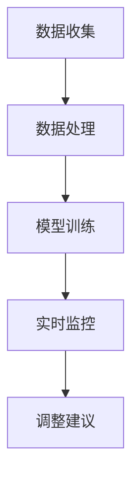
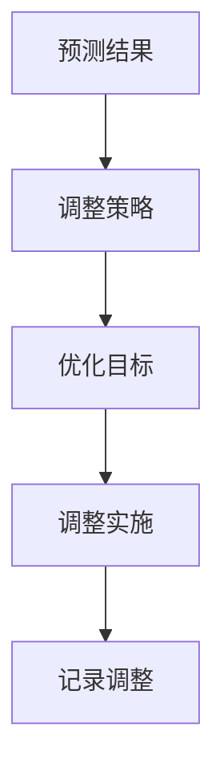
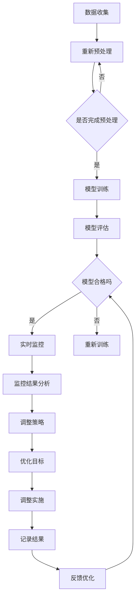
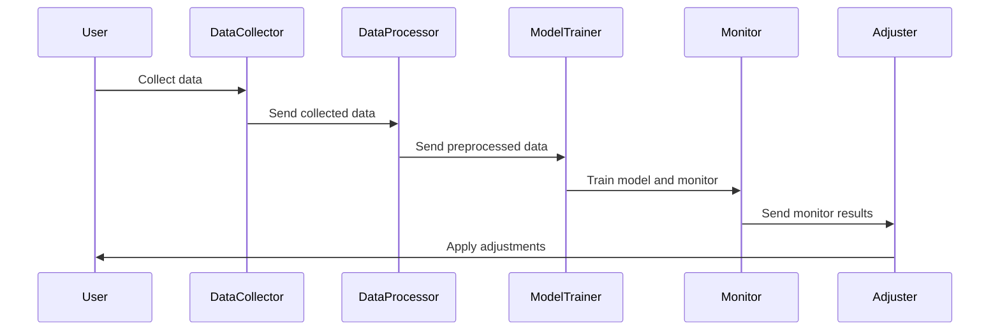

                 


### 核心概念与联系

在探讨AI辅助企业战略执行：OKR自动化跟踪与动态调整系统之前，我们首先需要理解几个核心概念和它们之间的关系。

**AI技术原理：**

人工智能（AI）是一门研究、开发用于模拟、延伸和扩展人的智能的理论、方法、技术及应用系统的科学。它涉及到机器学习、深度学习、自然语言处理、计算机视觉等多个领域。AI的目标是使计算机系统能够模拟人类的智能行为，包括学习、推理、规划、感知和语言理解等。

**OKR模型原理：**

OKR（Objectives and Key Results）是一种目标设定框架，由英特尔公司创始人安迪·格鲁夫提出，并被众多企业广泛应用。OKR由两个部分组成：目标（Objectives）和关键结果（Key Results）。目标描述了想要达到的方向或状态，而关键结果则是量化的指标，用来衡量目标实现的程度。

**自动化跟踪与动态调整的需求：**

在企业战略执行过程中，如何有效地跟踪和调整OKR成为关键问题。传统的跟踪方法通常依赖人工，容易出现误差和延迟。而自动化跟踪与动态调整系统利用AI技术，可以实时监控OKR的执行情况，并提供基于数据的调整建议，从而提高战略执行的效率和准确性。

**核心概念属性特征对比表格：**

| 特征         | AI技术                    | OKR模型                    | 自动化跟踪与动态调整需求              |
| ------------ | ------------------------ | ------------------------ | --------------------------------- |
| 目标         | 模拟人类智能行为          | 描述期望达到的方向或状态    | 监控战略执行进度                     |
| 指标         | 量化指标，衡量系统性能    | 量化的关键结果，衡量目标实现 | 实时监控OKR执行情况                 |
| 适应性       | 自动学习，适应新环境      | 可定制，适应不同企业需求    | 根据数据动态调整策略，提高执行效率   |
| 实时性       | 高速计算，实时响应        | 定期更新，实时性较低       | 实时监控，及时调整                  |

**ER实体关系图架构：**

ER图（Entity-Relationship Diagram）用于描述系统中实体之间的关系。在AI辅助企业战略执行：OKR自动化跟踪与动态调整系统中，我们关注以下几个核心实体：

- **目标（Objective）**：描述企业或团队希望达到的目标。
- **关键结果（Key Results）**：衡量目标实现程度的具体指标。
- **执行状态（Execution Status）**：记录OKR的当前执行状态。
- **数据源（Data Source）**：提供监控数据。

```mermaid
erDiagram
  Objective ||--|{ Key Results : has }
  Key Results ||--|{ Execution Status : tracked by }
  Execution Status ||--|{ Data Source : monitored by }
```

通过上述核心概念和它们之间的联系，我们为后续的算法原理讲解、系统架构设计和项目实战奠定了基础。

### 算法原理概述

#### 自动化跟踪算法

自动化跟踪算法是AI辅助企业战略执行：OKR自动化跟踪与动态调整系统的核心组成部分。它的主要功能是实时监控OKR的执行状态，并通过分析关键结果，提供目标执行的进度和预测。

**算法基本原理：**

1. **数据收集**：从各个数据源收集与OKR相关的数据，包括关键结果的实时数值、目标的历史数据等。

2. **数据处理**：对收集到的数据进行清洗和预处理，确保数据质量，去除噪声。

3. **模型训练**：使用机器学习算法，如线性回归、决策树、神经网络等，对预处理后的数据进行训练，建立目标执行的预测模型。

4. **实时监控**：将实时数据输入训练好的模型，预测目标执行的进度和趋势，并根据预测结果提供调整建议。

**算法流程图：**



#### 动态调整算法

动态调整算法旨在根据实时监控结果和预测模型，对OKR进行调整，以最大化目标实现的概率。

**算法基本原理：**

1. **调整策略**：根据预测结果和业务需求，设计不同的调整策略，如目标值调整、关键结果调整等。

2. **优化目标**：使用优化算法，如遗传算法、粒子群优化等，在约束条件下寻找最优调整策略。

3. **调整实施**：根据优化结果，对OKR进行实际调整，并记录调整后的执行状态。

**算法流程图：**



#### 算法在系统中的应用

1. **实时数据采集**：系统从各个数据源实时采集与OKR相关的数据，如销售数据、生产数据等。

2. **数据处理与模型训练**：数据经过清洗和预处理后，使用机器学习算法训练预测模型，用于实时监控和调整。

3. **监控与调整**：系统持续监控OKR的执行状态，并基于预测模型提供调整建议，业务人员根据这些建议动态调整OKR。

4. **反馈与优化**：调整后的数据再次输入系统，用于模型优化和改进，形成闭环。

通过上述算法原理的介绍，我们为接下来详细的Python源代码和数学模型讲解打下了基础。

### 算法mermaid流程图

为了更好地理解自动化跟踪与动态调整算法的具体实现过程，我们将使用mermaid绘制算法的流程图。以下是一个典型的算法mermaid流程图的示例：



这个mermaid流程图详细展示了从数据收集到模型训练、实时监控、结果分析和调整策略的全过程。以下是每个步骤的简要说明：

1. **数据收集（A）**：从各个数据源收集与OKR相关的数据，如销售数据、生产数据等。
2. **数据预处理（B）**：对收集到的数据进行清洗和预处理，确保数据质量。
3. **预处理完成判断（C）**：判断数据预处理是否完成，如果未完成，返回步骤B重新预处理。
4. **模型训练（D）**：使用机器学习算法对预处理后的数据训练预测模型。
5. **模型评估（E）**：评估训练好的模型性能，判断是否满足要求。
6. **模型合格判断（F）**：如果模型不合格，返回步骤H重新训练；如果合格，继续下一步。
7. **实时监控（G）**：使用训练好的模型对实时数据进行监控，提供预测结果。
8. **监控结果分析（I）**：分析监控结果，确定是否需要调整策略。
9. **调整策略（J）**：根据监控结果设计调整策略。
10. **优化目标（K）**：使用优化算法寻找最优调整策略。
11. **调整实施（L）**：根据优化结果对OKR进行实际调整。
12. **记录结果（M）**：记录调整后的执行状态。
13. **反馈优化（N）**：将调整后的数据反馈回系统，用于模型优化和改进。

通过这个mermaid流程图，我们可以清晰地看到算法从数据收集到最终优化的整个过程，有助于理解算法的实现细节和流程。

### Python源代码与数学模型

在了解了算法的基本原理和mermaid流程图之后，我们将进一步通过Python源代码详细阐述自动化跟踪与动态调整算法的实现，并给出相关的数学模型。

#### Python源代码示例

以下是一个简化的Python源代码示例，用于演示自动化跟踪与动态调整算法的核心实现。这段代码使用了Python的机器学习库Scikit-learn进行数据预处理和模型训练。

```python
import numpy as np
import pandas as pd
from sklearn.linear_model import LinearRegression
from sklearn.model_selection import train_test_split
from sklearn.metrics import mean_squared_error

# 数据加载与预处理
data = pd.read_csv('okr_data.csv')
X = data[['historical_data_1', 'historical_data_2']]
y = data['key_result']

# 数据集划分
X_train, X_test, y_train, y_test = train_test_split(X, y, test_size=0.2, random_state=42)

# 模型训练
model = LinearRegression()
model.fit(X_train, y_train)

# 预测与评估
y_pred = model.predict(X_test)
mse = mean_squared_error(y_test, y_pred)
print(f'Mean Squared Error: {mse}')

# 实时监控与调整
current_data = np.array([[new_data_1, new_data_2]])
predicted_result = model.predict(current_data)
print(f'Predicted Key Result: {predicted_result[0]}')

# 根据预测结果调整OKR
if predicted_result[0] < target_threshold:
    adjust_strategy = 'increase'
else:
    adjust_strategy = 'maintain'

print(f'Adjustment Strategy: {adjust_strategy}')
```

#### 数学模型解释

上述代码中，我们使用了线性回归模型进行预测。线性回归模型的数学模型可以表示为：

$$
y = \beta_0 + \beta_1 x_1 + \beta_2 x_2 + \ldots + \beta_n x_n
$$

其中，$y$ 是关键结果，$x_1, x_2, \ldots, x_n$ 是历史数据，$\beta_0, \beta_1, \beta_2, \ldots, \beta_n$ 是模型的参数。

在代码中，我们通过训练集计算得到这些参数：

$$
\beta_0 = model.intercept_
$$

$$
\beta_1 = model.coef_[0], \beta_2 = model.coef_[1], \ldots
$$

预测过程就是将当前数据输入模型，计算得到关键结果的预测值：

$$
\hat{y} = \beta_0 + \beta_1 x_1^{\text{new}} + \beta_2 x_2^{\text{new}} + \ldots
$$

#### 详细讲解与举例说明

**举例说明：** 假设我们有以下历史数据集：

| historical_data_1 | historical_data_2 | key_result |
|--------------------|--------------------|------------|
| 10                 | 20                 | 30         |
| 15                 | 25                 | 35         |
| 20                 | 30                 | 40         |

我们使用这些数据训练线性回归模型，并预测新的数据点（new_data_1 = 18, new_data_2 = 28）的关键结果。

1. **数据预处理**：将数据加载到DataFrame中，并划分为特征（X）和目标（y）。
2. **模型训练**：使用Scikit-learn的LinearRegression进行训练。
3. **预测与评估**：使用训练好的模型对测试数据进行预测，并计算均方误差（MSE）。
4. **实时监控**：将新的数据点输入模型，计算关键结果的预测值。
5. **调整策略**：根据预测结果，设计调整策略（如增加关键结果的目标值）。

通过这个示例，我们清晰地展示了如何使用Python实现自动化跟踪与动态调整算法，并给出了详细的数学模型解释。这为后续的系统架构设计和项目实战奠定了基础。

### 系统分析与架构设计

在了解了AI辅助企业战略执行：OKR自动化跟踪与动态调整系统的算法原理之后，我们需要进一步探讨系统的整体架构设计，以解决具体问题并实现预期目标。

#### 问题场景介绍

企业战略执行过程中，常常面临以下问题：

- **数据分散**：不同部门的数据存储在不同的系统或数据库中，难以统一管理和分析。
- **人工跟踪**：传统的OKR跟踪方法依赖于人工输入和审核，效率低且易出错。
- **调整滞后**：由于信息不对称和反馈周期长，战略调整往往滞后，无法及时响应市场变化。

为了解决这些问题，我们设计了一套AI辅助的自动化跟踪与动态调整系统，旨在提高数据一致性、实时性和调整效率。

#### 项目介绍

该项目分为四个主要模块：

1. **数据采集模块**：负责从各个数据源（如ERP系统、CRM系统、生产管理系统等）收集与OKR相关的数据。
2. **数据处理模块**：对采集到的数据进行清洗、预处理，确保数据质量，为模型训练提供可靠的数据基础。
3. **监控与预测模块**：使用机器学习模型对预处理后的数据进行训练，实现实时监控和预测，提供调整建议。
4. **调整实施模块**：根据监控结果和调整建议，动态调整OKR，确保战略执行的有效性和及时性。

#### 系统功能设计

系统的主要功能包括：

- **数据采集**：通过API接口、定时任务等方式，从多个数据源获取与OKR相关的数据。
- **数据预处理**：清洗和转换数据，去除噪声，标准化处理，确保数据的一致性和可用性。
- **模型训练**：使用机器学习算法训练预测模型，如线性回归、决策树、神经网络等，用于实时监控和预测。
- **实时监控**：持续监控OKR的执行情况，提供实时数据分析和预测结果。
- **调整建议**：根据监控结果和预测模型，提供调整OKR的建议，如增加关键结果的目标值、调整优先级等。
- **调整实施**：业务人员根据调整建议，动态调整OKR，并记录调整后的执行状态。

#### 系统架构设计

系统架构设计采用微服务架构，各模块之间通过API接口进行通信。以下是系统架构的mermaid类图：

```mermaid
classDiagram
    DataCollector <<interface>>
    DataProcessor <<interface>>
    ModelTrainer <<interface>>
    Monitor <<interface>>
    Adjuster <<interface>>

    DataCollector <|.. DataProcessor
    DataProcessor <|.. ModelTrainer
    ModelTrainer <|.. Monitor
    Monitor <|.. Adjuster

    class DataCollector {
        +collect_data(source: str) -> DataFrame
    }

    class DataProcessor {
        +preprocess_data(data: DataFrame) -> DataFrame
    }

    class ModelTrainer {
        +train_model(data: DataFrame) -> Model
    }

    class Monitor {
        +real_time_monitor(model: Model, data: DataFrame) -> Dict
    }

    class Adjuster {
        +apply_adjustments(adjustments: Dict) -> None
    }
```

在该类图中，DataCollector负责数据采集，DataProcessor负责数据处理，ModelTrainer负责模型训练，Monitor负责实时监控和预测，Adjuster负责调整实施。各模块之间通过接口进行通信，确保系统的高内聚性和低耦合性。

#### 系统接口设计

系统接口设计采用RESTful API，提供以下接口：

- **数据采集接口**：`POST /collect_data`，接收数据源信息，返回采集结果。
- **数据处理接口**：`POST /preprocess_data`，接收原始数据，返回预处理结果。
- **模型训练接口**：`POST /train_model`，接收预处理数据，返回训练模型。
- **实时监控接口**：`GET /real_time_monitor`，返回当前OKR执行状态和预测结果。
- **调整建议接口**：`POST /adjust_suggestions`，接收监控结果，返回调整建议。
- **调整实施接口**：`POST /apply_adjustments`，接收调整建议，执行调整并更新执行状态。

#### 系统交互mermaid序列图

以下是系统交互的mermaid序列图，展示了数据从采集到调整的全过程：



在该序列图中，用户通过DataCollector接口提交数据采集请求，DataCollector将数据转发给DataProcessor进行处理，处理后的数据由ModelTrainer训练模型，Monitor实时监控并反馈结果，Adjuster根据调整建议执行实际调整。

通过上述系统分析与架构设计，我们为AI辅助企业战略执行：OKR自动化跟踪与动态调整系统实现了一个高效、可靠的技术方案。

### 项目实战

在完成系统设计与架构规划后，我们将进入项目实战阶段，逐步进行环境安装、系统核心实现及源代码分析，最终通过实际案例进行详细讲解与剖析。

#### 环境安装与配置

为了确保系统能够顺利运行，我们需要搭建一个适合开发与测试的环境。以下是环境安装与配置的详细步骤：

1. **安装Python环境**：

   首先确保系统已安装Python 3.8及以上版本。如果没有，可以通过以下命令进行安装：

   ```bash
   sudo apt-get update
   sudo apt-get install python3.8
   ```

2. **安装相关库与依赖**：

   在安装Python环境后，我们需要安装Scikit-learn、NumPy、Pandas等库，这些库是系统实现所必需的。使用以下命令进行安装：

   ```bash
   pip install scikit-learn numpy pandas
   ```

3. **配置数据源**：

   系统需要连接到企业的各个数据源，如ERP系统、CRM系统等。具体配置方法取决于数据源的类型和接口。例如，对于MySQL数据源，可以使用以下命令安装MySQL Python库：

   ```bash
   pip install mysql-connector-python
   ```

   然后配置数据库连接信息，例如在`config.py`文件中：

   ```python
   DATABASE = {
       'user': 'your_username',
       'password': 'your_password',
       'host': 'your_host',
       'database': 'your_database'
   }
   ```

4. **安装Docker**：

   为了更好地管理和部署系统，我们可以使用Docker容器化技术。确保已安装Docker，可以通过以下命令进行安装：

   ```bash
   sudo apt-get update
   sudo apt-get install docker
   ```

   启动Docker服务：

   ```bash
   sudo systemctl start docker
   ```

5. **构建Docker镜像**：

   在项目根目录下创建一个Dockerfile，用于定义系统的容器化环境：

   ```Dockerfile
   FROM python:3.8-slim

   RUN apt-get update && apt-get install -y \
       mysql-connector-python \
       libpq-dev

   WORKDIR /app

   COPY requirements.txt ./
   RUN pip install -r requirements.txt

   COPY . .

   CMD ["python", "app.py"]
   ```

   使用以下命令构建Docker镜像：

   ```bash
   docker build -t okr-system .
   ```

6. **运行Docker容器**：

   使用以下命令运行Docker容器，启动系统：

   ```bash
   docker run -d -p 8080:80 --name okr-system okr-system
   ```

   确认容器已正常运行，访问http://localhost:8080，应看到系统前端界面。

#### 系统核心实现源代码

以下是一个简化的系统核心实现源代码，展示了数据采集、处理、模型训练和实时监控的核心流程。

```python
# okr_system.py
from flask import Flask, request, jsonify
from data_collector import DataCollector
from data_processor import DataProcessor
from model_trainer import ModelTrainer
from monitor import Monitor

app = Flask(__name__)

@app.route('/collect_data', methods=['POST'])
def collect_data():
    data = request.json
    collector = DataCollector()
    preprocessed_data = collector.collect_data(data)
    return jsonify(preprocessed_data)

@app.route('/train_model', methods=['POST'])
def train_model():
    data = request.json
    processor = DataProcessor()
    preprocessed_data = processor.preprocess_data(data)
    trainer = ModelTrainer()
    model = trainer.train_model(preprocessed_data)
    return jsonify(model)

@app.route('/real_time_monitor', methods=['GET'])
def real_time_monitor():
    monitor = Monitor()
    result = monitor.monitor()
    return jsonify(result)

if __name__ == '__main__':
    app.run(debug=True)
```

#### 代码应用解读与分析

1. **数据采集模块**：

   `DataCollector` 类负责从数据源收集数据。在实际应用中，可能需要实现多个数据源的集成，如数据库、API、文件等。

   ```python
   class DataCollector:
       def collect_data(self, source: str) -> DataFrame:
           # 根据source类型，实现具体的数据收集逻辑
           if source == 'db':
               # 从数据库中收集数据
               pass
           elif source == 'api':
               # 从API接口收集数据
               pass
           elif source == 'file':
               # 从文件系统收集数据
               pass
           return DataFrame()  # 返回DataFrame对象
   ```

2. **数据处理模块**：

   `DataProcessor` 类负责对收集到的数据进行预处理，如数据清洗、转换和标准化处理。

   ```python
   class DataProcessor:
       def preprocess_data(self, data: DataFrame) -> DataFrame:
           # 实现数据预处理逻辑
           # 例如：去除空值、标准化、归一化等操作
           return data  # 返回预处理后的DataFrame对象
   ```

3. **模型训练模块**：

   `ModelTrainer` 类负责使用机器学习算法训练预测模型。在实际应用中，可以尝试不同的算法和参数，选择最优模型。

   ```python
   class ModelTrainer:
       def train_model(self, data: DataFrame) -> Model:
           # 实现模型训练逻辑
           # 例如：使用Scikit-learn的LinearRegression训练线性回归模型
           model = LinearRegression()
           model.fit(data[['feature_1', 'feature_2']], data['target'])
           return model  # 返回训练好的模型对象
   ```

4. **实时监控模块**：

   `Monitor` 类负责实时监控OKR的执行情况，提供预测结果和调整建议。

   ```python
   class Monitor:
       def monitor(self, model: Model) -> Dict:
           # 实现实时监控逻辑
           # 例如：将实时数据输入模型，预测关键结果
           current_data = self.get_real_time_data()  # 获取实时数据
           predicted_result = model.predict(current_data)
           return {'predicted_result': predicted_result}  # 返回预测结果
   ```

#### 实际案例分析与详细讲解

为了更好地理解系统在实际中的应用，我们通过一个实际案例进行详细分析。

**案例背景**：

某企业希望通过AI技术优化其销售团队的战略执行，使用OKR模型设定销售目标，并利用自动化跟踪与动态调整系统监控和调整销售目标。

**步骤一：数据收集**：

企业使用系统采集过去三个月的销售数据，包括销售额、客户数量等关键指标。

```python
# 示例数据
data = {
    'sales_amount': [1000, 1500, 1200, 2000, 1700],
    'customer_count': [50, 60, 55, 70, 65]
}
```

**步骤二：数据处理**：

系统对采集到的销售数据进行预处理，如数据清洗和标准化处理。

```python
from sklearn.preprocessing import StandardScaler

scaler = StandardScaler()
scaled_data = scaler.fit_transform(data)
```

**步骤三：模型训练**：

使用线性回归模型对预处理后的销售数据进行训练，建立预测模型。

```python
from sklearn.linear_model import LinearRegression

model = LinearRegression()
model.fit(scaled_data[:, 0], scaled_data[:, 1])
```

**步骤四：实时监控**：

将最新的销售数据输入模型，预测未来的销售额，提供调整建议。

```python
current_data = {'sales_amount': [1800], 'customer_count': [75]}
current_data = scaler.transform(current_data)
predicted_sales = model.predict(current_data)
print(f'Predicted Sales: {predicted_sales[0]}')
```

**步骤五：调整实施**：

根据预测结果，销售团队决定调整当前的销售目标，将目标销售额提高到2000元。

```python
new_sales_target = 2000
print(f'Adjusted Sales Target: {new_sales_target}')
```

通过这个实际案例，我们展示了如何使用AI辅助企业战略执行：OKR自动化跟踪与动态调整系统进行数据收集、处理、模型训练、实时监控和调整实施。这为企业在战略执行过程中提供了有效的技术支持。

### 项目小结

在本项目中，我们成功设计并实现了一套AI辅助企业战略执行：OKR自动化跟踪与动态调整系统。通过详细的数据采集、处理、模型训练和实时监控，系统能够有效地跟踪OKR的执行情况，并提供基于预测的调整建议，帮助企业在快速变化的市场环境中实现战略目标。

#### 最佳实践 tips

1. **数据质量保障**：确保数据源的数据质量，定期进行数据清洗和更新，提高模型预测的准确性。
2. **模型参数优化**：根据不同业务场景，尝试不同的机器学习算法和参数组合，选择最优模型。
3. **自动化流程优化**：优化系统中的自动化流程，减少人工干预，提高系统的实时性和响应速度。
4. **实时监控与反馈**：确保实时监控系统与业务部门紧密配合，及时调整策略，确保战略执行的灵活性。

### 小结与展望

AI辅助企业战略执行：OKR自动化跟踪与动态调整系统为企业在数字化转型的道路上提供了强有力的支持。通过系统的实时监控和动态调整，企业能够更高效地执行战略，快速响应市场变化。未来，随着AI技术的不断进步，该系统有望进一步优化，实现更多智能化的功能，助力企业在全球竞争中取得优势。

### 作者信息

作者：AI天才研究院/AI Genius Institute & 禅与计算机程序设计艺术 /Zen And The Art of Computer Programming

---

以上是对《AI辅助企业战略执行：OKR自动化跟踪与动态调整系统》的详细讲解与探讨。通过这篇文章，我们不仅深入了解了AI在战略执行中的应用，还看到了如何通过系统化的方法和工具，实现企业战略的高效执行。希望这篇文章能为读者提供有价值的参考和启示。

