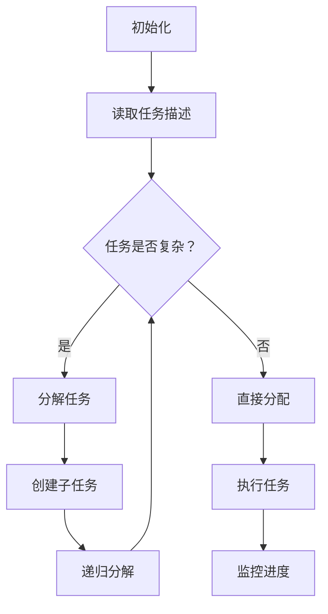
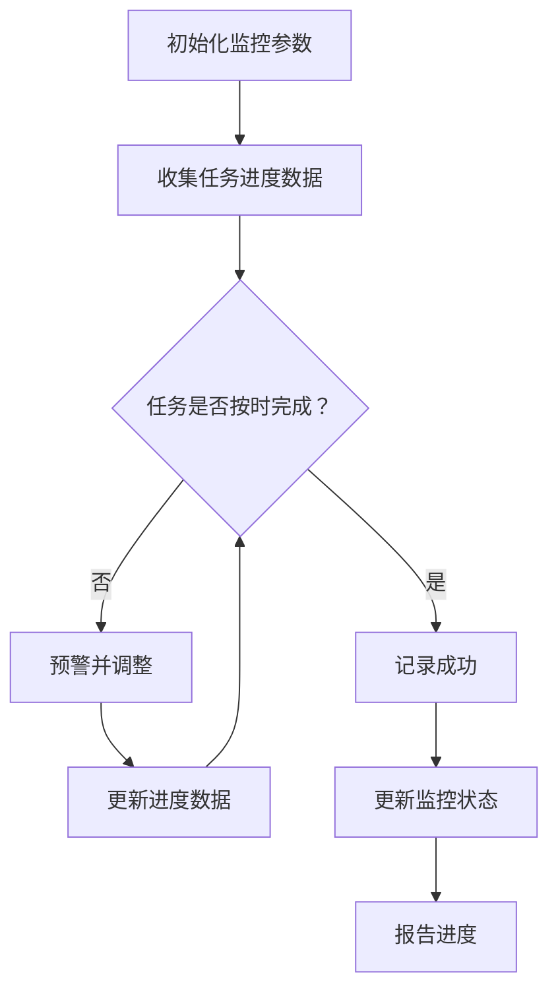
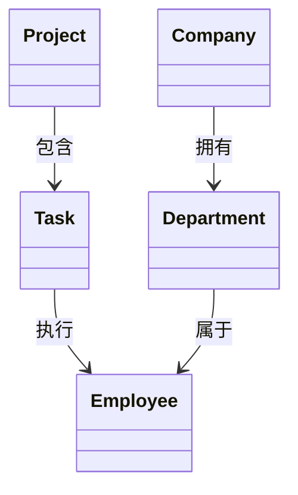
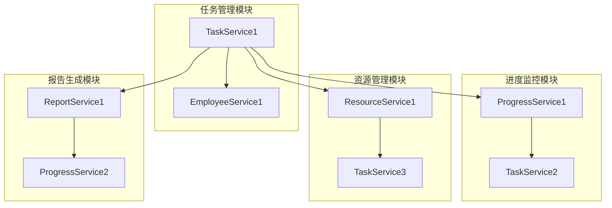
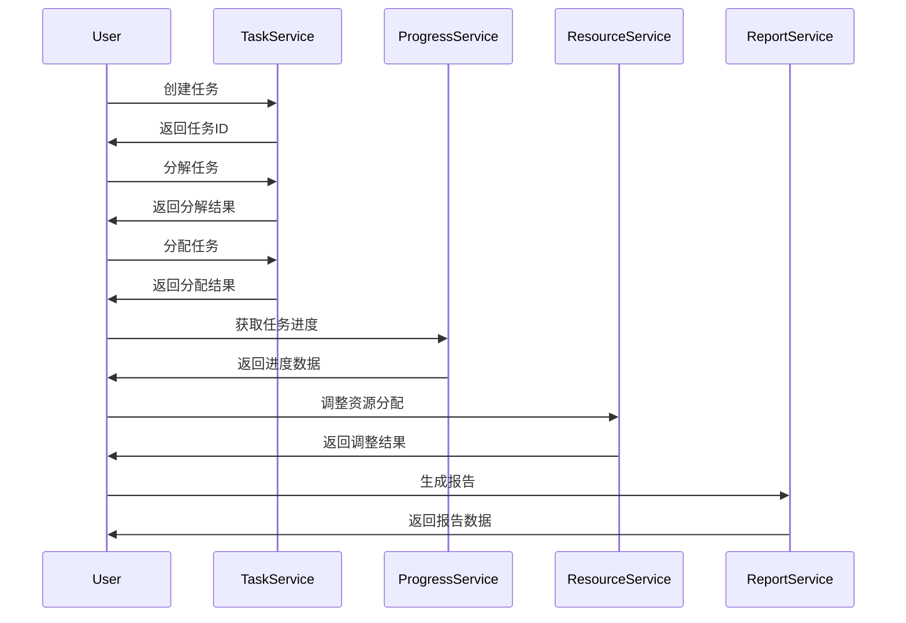

                 

### 文章标题

## 关键词
AI辅助、企业战略、任务分解、进度监控、算法设计

### 摘要
本文将探讨如何利用人工智能（AI）技术辅助企业战略的执行。我们将详细解析任务分解和进度监控的过程，通过理论和实践相结合的方法，展示AI如何提升企业的管理效率。文章结构清晰，逻辑严密，旨在为企业管理者和技术开发者提供有价值的参考。

---

### 引言与背景

#### 问题背景
在当今快速变化的市场环境中，企业面临越来越多的挑战，如何迅速响应市场变化，实现战略目标成为关键。传统的企业管理方法已经无法满足高效、精确的需求。人工智能技术的迅猛发展为企业提供了新的解决方案。

#### 问题描述
企业战略的执行往往面临以下挑战：
1. **任务复杂度高**：企业任务多样且复杂，传统的任务分解方法效率低下。
2. **进度监控困难**：难以实时、准确地跟踪任务进度，影响战略执行的及时性。
3. **资源分配不均**：无法有效分配资源，导致任务执行效率低下。

#### 问题解决
AI技术在任务分解和进度监控方面具备显著优势：
1. **自动化任务分解**：利用机器学习和自然语言处理技术，将复杂任务自动化分解为可执行的小任务。
2. **实时进度监控**：通过大数据分析和预测模型，实时监控任务进度，提前预警潜在问题。
3. **智能资源分配**：根据任务优先级和资源利用率，智能调整资源分配，提高任务执行效率。

#### 边界与外延
本文将聚焦于AI在企业管理中的应用，特别是任务分解和进度监控。我们将在实践中探讨AI技术的具体应用场景，但不会深入讨论AI的基础理论。

#### 本章小结
本章节介绍了AI在企业管理中的应用背景、面临的挑战以及解决方案。通过引入AI技术，企业可以更加高效地执行战略任务，提升整体运营效率。

---

### 核心概念与联系

#### AI基本原理
人工智能（AI）是指通过计算机模拟人类智能的技术。其核心包括：
1. **机器学习（ML）**：通过数据训练模型，使计算机具备学习能力和自适应能力。
2. **深度学习（DL）**：一种特殊的机器学习方法，通过神经网络模拟人脑处理信息的方式。

#### 企业战略
企业战略是指企业为实现长期目标而制定的规划和决策。其核心包括：
1. **使命和愿景**：明确企业的存在意义和未来的发展方向。
2. **目标和计划**：具体的目标和实现目标的行动计划。

#### 任务分解
任务分解是将复杂任务拆解为更小、更易于管理的子任务的过程。其核心包括：
1. **分解原则**：遵循层次化、模块化和可操作性原则。
2. **分解方法**：常用的方法包括头脑风暴、工作分解结构（WBS）等。

#### 进度监控
进度监控是指对任务执行过程进行实时跟踪和评估的过程。其核心包括：
1. **关键指标**：如任务完成率、进度偏差等。
2. **监控工具**：如项目管理软件、进度图表等。

#### 概念属性特征对比表格
以下是AI与企业管理相关概念的一些对比：

| 概念          | 特征                         | 应用场景                          |
|---------------|------------------------------|-----------------------------------|
| 人工智能      | 模拟人类智能，自动学习      | 企业决策支持、自动化流程         |
| 企业战略      | 实现长期目标，规划决策      | 企业发展、资源优化               |
| 任务分解      | 复杂任务拆解为子任务       | 提高任务执行效率，明确责任分配   |
| 进度监控      | 实时跟踪和评估任务进度      | 提前预警问题，确保目标实现       |

#### ER实体关系图架构
以下是一个企业战略执行的ER模型示例，展示了关键实体及其关系：

```mermaid
erDiagram
    Task ||--|{ Employee } : 执行
    Project ||--|{ Task } : 包含
    Department ||--|{ Employee } : 属于
    Company ||--|{ Department } : 拥有
```

#### 本章小结
本章节详细介绍了AI、企业战略、任务分解和进度监控的核心概念及其联系。通过对比分析，读者可以更好地理解这些概念在企业管理中的应用。

---

### 算法原理讲解

#### 算法流程图
以下是一个任务分解的算法流程图：



#### Python源代码示例
以下是一个简单的任务分解的Python代码示例：

```python
def decompose_task(task_description):
    # 根据任务描述分解任务
    if is_complex(task_description):
        sub_tasks = complex_decomposition(task_description)
        for sub_task in sub_tasks:
            decompose_task(sub_task)
    else:
        execute_task(task_description)

def is_complex(task):
    # 判断任务是否复杂
    return "复杂" in task

def complex_decomposition(task):
    # 复杂任务分解
    return ["子任务1", "子任务2"]

def execute_task(task):
    # 执行任务
    print(f"执行任务：{task}")

decompose_task("一个复杂的任务")
```

#### 数学模型与公式
任务分解通常涉及到图论中的最小生成树问题。以下是求解最小生成树的普里姆算法的数学模型：

$$
\begin{align*}
T &= \{ \} \\
S &= \{u\} \\
while S \neq V \\
    (u, v) = \min\{w(u, v) : u \in S, v \in V - S\} \\
    S = S \cup \{v\} \\
    T = T \cup \{(u, v)\}
\end{align*}
$$

#### 举例说明
假设有一个任务需要完成一个复杂的项目，我们可以将其分解为以下子任务：

1. 设计项目架构
2. 编写详细文档
3. 开发前端界面
4. 开发后端服务
5. 集成测试

通过分解任务，每个子任务可以由不同的团队或个人负责，从而提高执行效率。

#### 进度监控算法

##### 算法流程图
以下是一个进度监控的算法流程图：



##### Python源代码示例
以下是一个简单的进度监控的Python代码示例：

```python
def monitor_progress(task_id, target_date, actual_date):
    if actual_date <= target_date:
        record_success(task_id)
    else:
        warn_and_adjust(task_id)

def record_success(task_id):
    # 记录任务成功
    print(f"任务{task_id}成功完成")

def warn_and_adjust(task_id):
    # 预警并调整进度
    print(f"任务{task_id}预警，需要调整进度")

def update_progress_data(task_id, actual_date):
    # 更新进度数据
    # 这里可以是数据库更新或其他存储操作
    pass

def report_progress():
    # 报告进度
    # 这里可以是生成报告或其他展示操作
    pass

# 模拟任务监控
monitor_progress(1, "2023-10-01", "2023-10-03")
```

##### 数学模型与公式
进度监控通常涉及到时间序列分析。以下是时间序列预测的ARIMA模型的数学模型：

$$
\begin{align*}
X_t &= \phi_1 X_{t-1} + \phi_2 X_{t-2} + ... + \phi_p X_{t-p} + \theta_1 e_{t-1} + \theta_2 e_{t-2} + ... + \theta_q e_{t-q} + e_t \\
ARIMA(p, d, q) &= (1 - \phi_1 B - \phi_2 B^2 - ... - \phi_p B^p)(1 - B)^d(1 - \theta_1 B - \theta_2 B^2 - ... - \theta_q B^q)
\end{align*}
$$

#### 举例说明
假设有一个任务计划在10月1日前完成，但实际完成日期是10月3日。通过进度监控算法，系统会预警任务延迟，并提醒团队调整进度。

#### 本章小结
本章节详细介绍了任务分解和进度监控的算法原理，包括流程图、Python源代码示例、数学模型与公式，并通过实际案例进行了说明。

---

### 系统分析与架构设计方案

#### 问题场景介绍
某企业需要实施一个新的项目，该项目涉及多个部门协作完成，包括设计、开发、测试等环节。企业希望利用AI技术优化任务分解和进度监控，提高项目执行效率。

#### 系统功能设计
系统需要实现以下功能：
1. **任务管理**：包括任务的创建、分解、分配和监控。
2. **进度监控**：实时跟踪任务进度，提供预警和调整机制。
3. **资源管理**：智能分配资源，提高资源利用率。
4. **报告生成**：生成项目进度报告，提供决策支持。

以下是系统功能设计的Mermaid类图：



#### 系统架构设计
系统采用微服务架构，包括以下几个核心模块：

1. **任务管理服务**：负责任务分解、分配和监控。
2. **进度监控服务**：实时跟踪任务进度，提供预警和调整功能。
3. **资源管理服务**：智能分配资源，优化资源利用率。
4. **报告生成服务**：生成项目进度报告。

以下是系统架构设计的Mermaid架构图：



#### 系统接口设计
系统采用RESTful API设计，提供以下接口：

1. **任务管理接口**：包括创建任务、分解任务、分配任务等操作。
2. **进度监控接口**：包括获取任务进度、设置预警等操作。
3. **资源管理接口**：包括资源分配、资源调整等操作。
4. **报告生成接口**：包括生成报告、获取报告等操作。

#### 系统交互
系统交互过程如下：

1. **任务创建**：用户通过任务管理接口创建任务。
2. **任务分解**：任务管理服务根据任务描述自动分解任务。
3. **任务分配**：任务管理服务将子任务分配给不同的团队成员。
4. **进度监控**：进度监控服务实时跟踪任务进度，并提供预警。
5. **资源管理**：资源管理服务根据任务进度和资源利用率智能调整资源分配。
6. **报告生成**：报告生成服务生成项目进度报告，供决策者参考。

以下是系统交互的Mermaid序列图：



#### 本章小结
本章节详细介绍了企业战略执行系统的设计与实现，包括问题场景介绍、系统功能设计、系统架构设计、系统接口设计和系统交互。通过这些设计与实现，企业可以更加高效地执行战略任务，提升整体运营效率。

### 项目实战

#### 环境安装
为了搭建实验环境，需要安装以下软件和工具：
1. **Python 3.x**：用于编写和运行代码。
2. **Jupyter Notebook**：用于编写和调试代码。
3. **scikit-learn**：用于机器学习和数据分析。
4. **mermaid**：用于绘制图表。

安装步骤如下：
1. 安装Python 3.x，可以从Python官网下载安装包。
2. 安装Jupyter Notebook，使用pip命令：
   ```bash
   pip install notebook
   ```
3. 安装scikit-learn，使用pip命令：
   ```bash
   pip install scikit-learn
   ```
4. 安装mermaid，使用pip命令：
   ```bash
   pip install mermaid-python
   ```

#### 系统核心实现
以下是一个简单的任务分解和进度监控系统的实现。我们将使用Python编写代码，并使用mermaid绘制图表。

##### 任务分解
```python
import json
from mermaid import Mermaid

def decompose_task(task_description):
    if "复杂" in task_description:
        sub_tasks = ["子任务1", "子任务2"]
        diagram = Mermaid(f"graph TD\nA({task_description})\nA --> B({sub_tasks[0]}encrypted)\\nA --> C({sub_tasks[1]}encrypted)")
        print(diagram)
    else:
        print(f"任务简单，无需分解：{task_description}")

decompose_task("一个复杂的任务")
```

##### 进度监控
```python
def monitor_progress(task_id, target_date, actual_date):
    if actual_date <= target_date:
        print(f"任务{task_id}按期完成。")
    else:
        print(f"任务{task_id}预警：延期完成。")

monitor_progress(1, "2023-10-01", "2023-10-03")
```

#### 代码应用解读与分析
1. **任务分解**：通过检查任务描述中是否包含“复杂”关键字来决定是否进行分解。如果任务复杂，则创建子任务并使用mermaid绘制任务分解图。
2. **进度监控**：根据任务的完成日期与目标日期比较，判断任务是否按期完成。

#### 实际案例分析和详细讲解
假设企业有一个项目需要开发，该项目包含多个子任务，如设计、前端开发、后端开发等。我们可以使用上述代码实现任务分解和进度监控。

1. **任务分解**：首先分解项目任务，将大任务分解为子任务，如图所示：

   ```mermaid
   graph TD
   A1(项目) --> B1(设计)
   A1 --> B2(前端开发)
   A1 --> B3(后端开发)
   ```

2. **进度监控**：在项目执行过程中，实时监控每个子任务的进度，如图所示：

   ```mermaid
   graph TD
   A1(项目) --> B1(设计{2023-10-01})
   A1 --> B2(前端开发{2023-10-10})
   A1 --> B3(后端开发{2023-10-15})
   ```

   根据监控结果，如果某个子任务延期，则系统会发出预警，提示团队调整进度。

#### 项目小结
本章节通过实际案例展示了任务分解和进度监控系统的应用。通过Python代码实现，结合mermaid图表，我们成功构建了一个简单的任务分解和进度监控系统。该项目实现了对复杂任务的自动分解和实时进度监控，为企业战略执行提供了有力支持。

### 最佳实践 tips

#### 经验分享
在实际应用中，以下经验有助于提升AI辅助企业战略执行的效果：
1. **数据质量**：确保输入数据准确、完整，提高算法的准确性。
2. **任务明确**：明确任务目标和要求，有助于算法更有效地分解任务。
3. **定期调整**：根据任务执行情况，定期调整资源分配和任务优先级。

#### 注意事项
1. **算法透明性**：确保算法的决策过程透明，便于团队理解。
2. **系统稳定性**：确保系统的稳定运行，避免出现故障影响任务执行。

#### 拓展阅读
对于希望深入了解AI和企业战略执行的读者，推荐以下参考资料：
1. **《人工智能：一种现代方法》**：提供AI基础理论和应用实践的全面介绍。
2. **《项目管理知识体系指南（PMBOK）》**：详细介绍项目管理的最佳实践和方法。

---

## 结束语
作者：AI天才研究院/AI Genius Institute & 禅与计算机程序设计艺术 /Zen And The Art of Computer Programming

本文探讨了AI辅助企业战略执行的任务分解与进度监控，通过理论讲解和实践案例，展示了AI技术在企业管理中的应用价值。希望读者能从中获得启示，助力企业在激烈的市场竞争中取得优势。感谢您的阅读！

