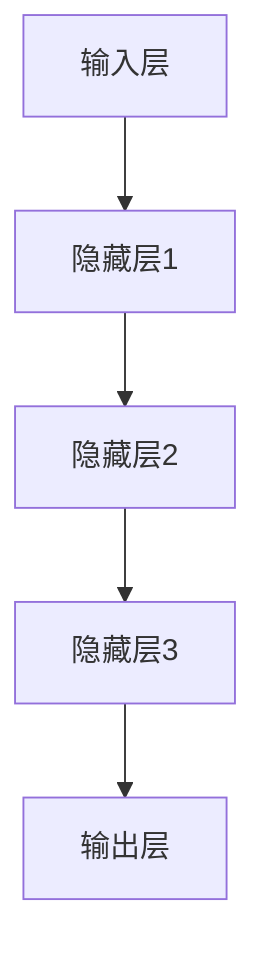

                 

### AI辅助企业战略规划：大数据分析与预测模型

> 关键词：人工智能、企业战略规划、大数据分析、预测模型

> 摘要：本文深入探讨了人工智能（AI）在辅助企业战略规划中的应用，特别是大数据分析与预测模型的重要性。通过背景介绍、技术原理讲解、实战案例分享和最佳实践，揭示了AI辅助企业战略规划的关键路径和实施要点，为企业数字化转型提供了理论指导和实用参考。

### 目录大纲

----------------------------------------------------------------

# AI辅助企业战略规划：大数据分析与预测模型

## 第一部分：背景介绍与核心概念

### 第1章：问题背景与核心概念

#### 1.1 问题背景

##### 1.1.1 企业战略规划的重要性

##### 1.1.2 AI在战略规划中的应用

##### 1.1.3 大数据与分析预测模型

#### 1.2 核心概念

##### 1.2.1 企业战略规划的定义

##### 1.2.2 AI辅助战略规划的原理

##### 1.2.3 大数据分析与预测模型

##### 1.2.4 AI辅助企业战略规划的边界与外延

## 第二部分：AI辅助企业战略规划的技术原理

### 第2章：AI基础理论

#### 2.1 人工智能的基本概念

##### 2.1.1 人工智能的定义

##### 2.1.2 人工智能的发展历程

##### 2.1.3 人工智能的核心技术

#### 2.2 深度学习与神经网络

##### 2.2.1 深度学习的原理

##### 2.2.2 神经网络的结构

##### 2.2.3 深度学习算法（Mermaid流程图）

#### 2.3 大数据分析与处理

##### 2.3.1 大数据的概念

##### 2.3.2 大数据的处理技术

##### 2.3.3 大数据分析的基本方法

### 第3章：预测模型与算法

#### 3.1 预测模型的基本概念

##### 3.1.1 预测模型的作用

##### 3.1.2 预测模型的分类

##### 3.1.3 预测模型的评价指标

#### 3.2 时间序列预测

##### 3.2.1 时间序列预测的基本原理

##### 3.2.2 时间序列分析的方法

##### 3.2.3 时间序列预测的常用算法（Mermaid流程图）

#### 3.3 回归分析

##### 3.3.1 回归分析的基本原理

##### 3.3.2 回归分析的应用场景

##### 3.3.3 回归分析的方法与技巧

## 第三部分：AI辅助企业战略规划的应用

### 第4章：企业战略规划中的数据分析方法

#### 4.1 数据分析在企业战略规划中的应用

##### 4.1.1 数据分析的重要性

##### 4.1.2 数据分析的基本流程

##### 4.1.3 数据分析在企业战略规划中的应用案例

#### 4.2 数据挖掘与市场分析

##### 4.2.1 数据挖掘的基本概念

##### 4.2.2 数据挖掘的方法

##### 4.2.3 数据挖掘在企业战略规划中的应用

#### 4.3 客户行为分析

##### 4.3.1 客户行为分析的定义

##### 4.3.2 客户行为分析的方法

##### 4.3.3 客户行为分析在企业战略规划中的应用

### 第5章：AI辅助企业战略规划的实战案例

#### 5.1 案例一：某企业的AI战略规划

##### 5.1.1 案例背景

##### 5.1.2 案例分析

##### 5.1.3 案例总结

#### 5.2 案例二：某电商平台的AI营销策略

##### 5.2.1 案例背景

##### 5.2.2 案例分析

##### 5.2.3 案例总结

## 第四部分：AI辅助企业战略规划的最佳实践

### 第6章：AI辅助企业战略规划的最佳实践

#### 6.1 AI辅助企业战略规划的实施步骤

##### 6.1.1 制定战略目标

##### 6.1.2 数据收集与处理

##### 6.1.3 预测模型选择与训练

##### 6.1.4 结果分析与策略调整

#### 6.2 AI辅助企业战略规划的注意事项

##### 6.2.1 数据质量问题

##### 6.2.2 预测模型选择的技巧

##### 6.2.3 策略调整的技巧

#### 6.3 拓展阅读

##### 6.3.1 相关文献推荐

##### 6.3.2 学术会议与研讨会推荐

----------------------------------------------------------------

### 第一部分：背景介绍与核心概念

#### 1.1 问题背景与核心概念

##### 1.1.1 企业战略规划的重要性

企业战略规划是企业根据外部环境和内部资源，为实现长期发展目标而制定的一系列战略决策和行动方案。它不仅关系到企业的未来发展方向，还直接影响到企业的生存与竞争力。传统的企业战略规划往往依赖于经验分析、市场调研和数据统计，但这些方法在应对复杂多变的市场环境时存在局限性。

##### 1.1.2 AI在战略规划中的应用

人工智能（AI）的快速发展为企业战略规划提供了新的工具和方法。通过机器学习和数据分析，AI能够从大量历史数据中提取有价值的信息，帮助企业预测未来趋势、发现潜在商机和优化资源配置。例如，AI可以分析市场数据，为企业制定个性化的营销策略；通过客户行为分析，AI可以帮助企业识别高价值客户，提高客户满意度和忠诚度。

##### 1.1.3 大数据与分析预测模型

大数据（Big Data）指的是无法用传统数据处理工具进行有效处理的数据集合，具有数据量大、类型多、速度快和真实性高等特点。在AI辅助企业战略规划中，大数据发挥着至关重要的作用。通过大数据分析，企业可以获取更全面、准确的市场信息，为战略决策提供有力支持。

预测模型（Predictive Model）是基于历史数据和统计方法建立的数据模型，用于预测未来趋势或事件发生的可能性。在AI辅助企业战略规划中，预测模型可以帮助企业预测市场变化、客户需求和行为，为企业制定更具前瞻性和灵活性的战略提供科学依据。

##### 1.1.4 AI辅助企业战略规划的边界与外延

AI辅助企业战略规划的边界包括数据质量、模型选择、算法优化和战略决策等方面。要确保AI辅助企业战略规划的成效，需要关注以下几个关键问题：

1. 数据质量：高质量的数据是AI分析的基础，企业需要建立完善的数据收集和处理机制，确保数据真实、准确、完整。
2. 模型选择：不同的预测模型适用于不同的场景，企业需要根据业务需求和数据特征选择合适的模型。
3. 算法优化：通过算法优化可以提高预测模型的准确性，降低误差率。
4. 战略决策：AI分析结果需要与业务战略相结合，形成具体可行的战略决策。

AI辅助企业战略规划的外延包括市场预测、客户分析、供应链优化、运营管理等多个领域。通过AI技术的深入应用，企业可以在多个维度上实现战略规划和运营优化，提升整体竞争力。

#### 1.2 核心概念

##### 1.2.1 企业战略规划的定义

企业战略规划是指企业在特定时期内，根据外部环境和内部资源，为实现长期发展目标而制定的一系列战略决策和行动方案。它包括市场定位、竞争策略、产品规划、资源配置、组织结构等方面。

##### 1.2.2 AI辅助战略规划的原理

AI辅助战略规划的原理基于机器学习和数据分析技术，通过从大量历史数据中提取有价值的信息，帮助企业预测未来趋势、发现潜在商机和优化资源配置。AI技术可以处理和分析海量数据，提供更精准、更全面的决策支持。

##### 1.2.3 大数据分析与预测模型

大数据分析（Big Data Analysis）是指利用各种数据分析方法，对海量数据进行挖掘和处理，提取有价值的信息和知识。大数据分析的核心是数据，通过数据清洗、数据集成、数据挖掘等技术，可以从大量数据中发现潜在模式和关联。

预测模型（Predictive Model）是基于历史数据和统计方法建立的数据模型，用于预测未来趋势或事件发生的可能性。常见的预测模型包括时间序列预测、回归分析、聚类分析、决策树等。

##### 1.2.4 AI辅助企业战略规划的边界与外延

AI辅助企业战略规划的边界主要包括数据质量、模型选择、算法优化和战略决策等方面。这些因素直接影响到AI辅助战略规划的效果。

AI辅助企业战略规划的外延包括市场预测、客户分析、供应链优化、运营管理等多个领域。在这些领域，AI技术可以帮助企业实现更精准的决策、更高效的运营和更优的资源配置。

### 第二部分：AI辅助企业战略规划的技术原理

#### 2.1 AI基础理论

##### 2.1.1 人工智能的基本概念

人工智能（Artificial Intelligence，简称AI）是模拟、延伸和扩展人的智能的理论、方法、技术及应用。人工智能的核心目标是让机器能够自主地完成复杂的任务，如学习、推理、规划、感知和自然语言处理等。

##### 2.1.2 人工智能的发展历程

人工智能的发展历程可以分为三个阶段：

1. **理论阶段（1956年-1969年）**：人工智能的概念被提出，主要研究方向是符号主义人工智能，即通过逻辑推理和符号表示来实现智能。

2. **应用阶段（1970年-1989年）**：人工智能技术开始在工业、医疗、军事等领域得到应用，如专家系统、自然语言处理和机器人技术等。

3. **技术阶段（1990年至今）**：随着计算机性能的提升和数据量的爆发式增长，深度学习、强化学习等先进技术得到了广泛应用，人工智能进入了一个新的发展阶段。

##### 2.1.3 人工智能的核心技术

人工智能的核心技术包括：

1. **机器学习（Machine Learning）**：机器学习是人工智能的一个重要分支，通过从数据中学习规律和模式，实现预测和决策。

2. **深度学习（Deep Learning）**：深度学习是机器学习的一个分支，通过构建多层神经网络，实现数据的自动特征提取和模式识别。

3. **自然语言处理（Natural Language Processing，简称NLP）**：自然语言处理是人工智能的一个重要应用领域，旨在让计算机理解和生成人类语言。

4. **计算机视觉（Computer Vision）**：计算机视觉是人工智能的另一个重要应用领域，旨在让计算机理解和解释视觉信息。

#### 2.2 深度学习与神经网络

##### 2.2.1 深度学习的原理

深度学习是一种基于多层神经网络的学习方法，通过构建深度神经网络，实现数据的自动特征提取和模式识别。深度学习的原理主要包括以下几个步骤：

1. **数据预处理**：对输入数据进行预处理，如归一化、标准化等，以便神经网络更好地学习。

2. **前向传播**：输入数据通过神经网络的前向传播过程，经过多层神经元的计算和变换，最终得到输出结果。

3. **反向传播**：根据输出结果与真实值的差异，通过反向传播算法，调整神经网络的参数，使输出结果更接近真实值。

4. **优化更新**：通过优化算法（如梯度下降、Adam等），不断调整神经网络的参数，直至达到满意的性能。

##### 2.2.2 神经网络的结构

神经网络（Neural Network）是深度学习的基础，由大量的神经元组成。神经网络的典型结构包括输入层、隐藏层和输出层。

1. **输入层**：接收外部输入数据，如文本、图像、声音等。

2. **隐藏层**：对输入数据进行特征提取和变换，隐藏层可以有多层。

3. **输出层**：生成最终的输出结果，如分类标签、预测值等。

##### 2.2.3 深度学习算法（Mermaid流程图）

#### 2.3 大数据分析与处理

##### 2.3.1 大数据的概念

大数据（Big Data）指的是无法用传统数据处理工具进行有效处理的数据集合，具有数据量大、类型多、速度快和真实性高等特点。大数据通常包含以下四个V：

1. **Volume（数据量）**：大数据的数据量通常非常大，超出传统数据库的处理能力。

2. **Variety（数据类型）**：大数据的数据类型非常多样化，包括结构化数据、半结构化数据和非结构化数据。

3. **Velocity（处理速度）**：大数据的处理速度要求非常高，需要实时或近实时处理大量数据。

4. **Veracity（真实性）**：大数据的真实性是一个重要问题，数据可能存在噪声、偏差和不完整性。

##### 2.3.2 大数据的处理技术

大数据的处理技术主要包括以下几种：

1. **数据存储**：大数据需要高效的数据存储技术，如分布式文件系统（HDFS）、NoSQL数据库等。

2. **数据处理**：大数据的处理技术包括数据清洗、数据集成、数据挖掘、数据可视化等。

3. **数据挖掘**：数据挖掘是一种从大量数据中发现有价值信息的方法，常用于市场分析、客户行为分析和风险评估等。

4. **数据可视化**：数据可视化是将复杂的数据以图形化方式展示，帮助企业更好地理解和利用数据。

##### 2.3.3 大数据分析的基本方法

大数据分析的基本方法包括：

1. **统计分析**：通过对数据进行分析和建模，提取有价值的信息和知识。

2. **机器学习**：利用机器学习算法，从数据中自动发现模式和规律。

3. **深度学习**：通过构建深度神经网络，实现数据的自动特征提取和模式识别。

4. **数据挖掘**：从大量数据中发现潜在模式和关联，为企业提供决策支持。

### 第三部分：AI辅助企业战略规划的应用

#### 3.1 企业战略规划中的数据分析方法

##### 3.1.1 数据分析的重要性

数据分析在企业战略规划中起着至关重要的作用。通过数据分析，企业可以：

1. **了解市场趋势**：通过分析市场数据，了解市场需求和竞争状况，为企业制定市场策略提供支持。

2. **优化资源配置**：通过分析企业内部数据，如销售数据、生产数据等，优化资源配置，提高运营效率。

3. **预测未来趋势**：通过预测模型，预测未来市场变化和客户需求，为企业制定长期发展战略提供依据。

4. **提高决策质量**：通过数据分析和预测模型，提供科学的决策支持，提高企业决策的质量和准确性。

##### 3.1.2 数据分析的基本流程

数据分析的基本流程包括以下几个步骤：

1. **数据收集**：收集与企业战略规划相关的数据，包括内部数据和外部数据。

2. **数据清洗**：清洗和预处理数据，去除噪声、缺失值和异常值，确保数据质量。

3. **数据探索**：通过统计分析、数据可视化等方法，探索数据中的潜在模式和规律。

4. **模型建立**：根据分析目标和数据特征，选择合适的预测模型，建立预测模型。

5. **模型训练**：使用历史数据训练预测模型，调整模型参数，提高预测准确性。

6. **结果验证**：使用验证集或测试集，验证预测模型的准确性，评估模型性能。

7. **决策支持**：根据预测模型的结果，提供决策支持，帮助企业制定战略规划和运营策略。

##### 3.1.3 数据分析在企业战略规划中的应用案例

以下是一个数据分析在企业战略规划中的应用案例：

**案例背景**：某电子商务企业希望通过数据分析，优化其产品销售策略，提高销售额。

**数据分析流程**：

1. **数据收集**：收集企业的销售数据、客户数据、市场数据等。

2. **数据清洗**：清洗数据，去除缺失值、异常值等，确保数据质量。

3. **数据探索**：通过统计分析，发现产品销量与客户年龄、地域、消费习惯等因素的相关性。

4. **模型建立**：选择回归模型，建立产品销量预测模型。

5. **模型训练**：使用历史数据训练预测模型，调整模型参数。

6. **结果验证**：使用验证集验证预测模型的准确性，评估模型性能。

7. **决策支持**：根据预测模型的结果，制定产品销售策略，如调整产品组合、促销活动等。

**案例总结**：通过数据分析，该电子商务企业成功优化了其产品销售策略，提高了销售额。

#### 3.2 数据挖掘与市场分析

##### 3.2.1 数据挖掘的基本概念

数据挖掘（Data Mining）是一种从大量数据中自动发现有价值信息的方法，通常包括以下几个步骤：

1. **数据收集**：收集与企业相关的数据，如销售数据、客户数据、市场数据等。

2. **数据预处理**：清洗和预处理数据，去除噪声、缺失值和异常值。

3. **数据探索**：通过统计分析、数据可视化等方法，探索数据中的潜在模式和规律。

4. **特征选择**：从大量特征中筛选出与目标变量相关的特征。

5. **模型建立**：根据分析目标和数据特征，选择合适的模型，建立预测模型。

6. **模型训练**：使用历史数据训练预测模型，调整模型参数。

7. **结果验证**：使用验证集或测试集，验证预测模型的准确性。

8. **结果解释**：解释预测模型的结果，提供决策支持。

##### 3.2.2 数据挖掘的方法

数据挖掘的方法包括：

1. **分类方法**：分类方法将数据分为不同的类别，常见的分类方法包括决策树、随机森林、支持向量机等。

2. **聚类方法**：聚类方法将数据分为不同的簇，常见的聚类方法包括K-means、层次聚类、DBSCAN等。

3. **关联规则挖掘**：关联规则挖掘用于发现数据之间的关联关系，常见的算法包括Apriori算法、FP-growth算法等。

4. **异常检测**：异常检测用于发现数据中的异常值或异常模式，常见的算法包括孤立森林、Local Outlier Factor等。

##### 3.2.3 数据挖掘在企业战略规划中的应用

数据挖掘在企业战略规划中的应用非常广泛，以下是一些典型的应用场景：

1. **市场预测**：通过数据挖掘，分析市场趋势和消费者行为，帮助企业预测市场需求，制定市场策略。

2. **客户细分**：通过数据挖掘，将客户分为不同的细分市场，针对不同的客户群体制定个性化的营销策略。

3. **产品推荐**：通过数据挖掘，分析客户购买行为和偏好，推荐合适的商品或服务，提高客户满意度和忠诚度。

4. **风险控制**：通过数据挖掘，分析客户数据和行为，识别潜在的风险客户，降低风险。

5. **供应链优化**：通过数据挖掘，分析供应链数据，优化库存管理、物流配送等环节，降低成本、提高效率。

#### 3.3 客户行为分析

##### 3.3.1 客户行为分析的定义

客户行为分析（Customer Behavior Analysis）是指通过收集、分析和解读客户行为数据，了解客户的需求、偏好和购买行为，从而为企业提供决策支持。客户行为分析通常包括以下几个步骤：

1. **数据收集**：收集与企业相关的客户行为数据，如浏览行为、购买记录、评价反馈等。

2. **数据预处理**：清洗和预处理数据，去除噪声、缺失值和异常值。

3. **数据探索**：通过统计分析、数据可视化等方法，探索数据中的潜在模式和规律。

4. **特征工程**：从大量特征中筛选出与客户行为相关的特征，进行特征工程。

5. **模型建立**：根据分析目标和数据特征，选择合适的模型，建立预测模型。

6. **模型训练**：使用历史数据训练预测模型，调整模型参数。

7. **结果验证**：使用验证集或测试集，验证预测模型的准确性。

8. **结果解释**：解释预测模型的结果，提供决策支持。

##### 3.3.2 客户行为分析的方法

客户行为分析的方法包括：

1. **描述性分析**：描述性分析用于了解客户的基本特征和购买行为，如客户群体分布、购买频率等。

2. **关联规则挖掘**：关联规则挖掘用于发现客户行为之间的关联关系，如购买A商品的概率更高，则可能购买B商品。

3. **聚类分析**：聚类分析用于将客户分为不同的类别，如高价值客户、低价值客户等。

4. **时间序列分析**：时间序列分析用于分析客户行为的变化趋势和周期性，如节假日促销效果分析。

5. **机器学习**：通过机器学习算法，建立预测模型，预测客户未来的行为和需求。

##### 3.3.3 客户行为分析在企业战略规划中的应用

客户行为分析在企业战略规划中的应用非常广泛，以下是一些典型的应用场景：

1. **客户细分**：通过客户行为分析，将客户分为不同的细分市场，制定个性化的营销策略。

2. **产品推荐**：通过客户行为分析，分析客户购买行为和偏好，推荐合适的商品或服务。

3. **客户关系管理**：通过客户行为分析，了解客户的需求和满意度，优化客户关系管理策略。

4. **市场预测**：通过客户行为分析，预测市场变化和客户需求，制定市场策略。

5. **风险控制**：通过客户行为分析，识别潜在的风险客户，降低风险。

### 第四部分：AI辅助企业战略规划的最佳实践

#### 4.1 案例一：某企业的AI战略规划

##### 4.1.1 案例背景

某大型制造企业希望借助AI技术优化其战略规划，提高市场竞争力。企业面临以下问题：

1. 市场竞争激烈，产品同质化严重，难以实现差异化竞争优势。

2. 生产成本高，生产效率低下，急需优化生产流程。

3. 客户需求多样化，难以满足客户个性化需求。

##### 4.1.2 案例分析

为了解决上述问题，该企业采取以下措施：

1. **数据收集**：收集市场数据、销售数据、生产数据等，建立企业数据仓库。

2. **数据预处理**：清洗和预处理数据，确保数据质量。

3. **数据分析**：通过数据挖掘和机器学习，分析市场趋势、客户需求和产品性能。

4. **预测模型建立**：根据分析结果，建立市场预测模型、客户需求预测模型和产品性能预测模型。

5. **模型训练**：使用历史数据训练预测模型，调整模型参数。

6. **结果验证**：使用验证集或测试集，验证预测模型的准确性。

7. **决策支持**：根据预测模型的结果，制定市场策略、生产计划和产品策略。

##### 4.1.3 案例总结

通过AI战略规划，该企业实现了以下成果：

1. 提高了市场预测准确性，优化了市场策略。

2. 优化了生产流程，提高了生产效率，降低了生产成本。

3. 通过客户需求预测，实现了产品个性化，提高了客户满意度。

#### 4.2 案例二：某电商平台的AI营销策略

##### 4.2.1 案例背景

某知名电商平台希望通过AI技术优化其营销策略，提高销售额和用户满意度。平台面临以下问题：

1. 营销活动效果不佳，难以提高用户参与度和转化率。

2. 用户数据分散，难以实现精准营销。

3. 营销资源有限，无法有效分配。

##### 4.2.2 案例分析

为了解决上述问题，该电商平台采取以下措施：

1. **数据收集**：收集用户浏览数据、购买数据、评价数据等，建立用户数据仓库。

2. **数据预处理**：清洗和预处理数据，确保数据质量。

3. **用户行为分析**：通过数据挖掘和机器学习，分析用户行为，识别用户兴趣和偏好。

4. **个性化推荐**：根据用户行为分析结果，建立个性化推荐模型，为用户推荐合适的商品。

5. **营销策略优化**：根据个性化推荐结果，优化营销活动策略，提高用户参与度和转化率。

6. **营销资源分配**：根据用户行为分析和营销策略优化结果，合理分配营销资源。

##### 4.2.3 案例总结

通过AI营销策略，该电商平台实现了以下成果：

1. 提高了用户参与度和转化率，提高了销售额。

2. 实现了精准营销，提高了用户满意度和忠诚度。

3. 优化了营销资源分配，降低了营销成本。

### 第五部分：AI辅助企业战略规划的最佳实践

#### 5.1 AI辅助企业战略规划的实施步骤

##### 5.1.1 制定战略目标

制定战略目标是企业实施AI辅助战略规划的第一步。企业需要明确自身的战略目标，如提高市场竞争力、优化生产流程、提高客户满意度等。战略目标的制定应结合企业的长期发展规划和市场环境。

##### 5.1.2 数据收集与处理

数据收集与处理是AI辅助企业战略规划的关键环节。企业需要收集与战略目标相关的数据，包括市场数据、销售数据、生产数据等。同时，对收集到的数据进行清洗、预处理和整合，确保数据质量。

##### 5.1.3 预测模型选择与训练

根据战略目标和数据特征，选择合适的预测模型，如时间序列预测模型、回归分析模型等。使用历史数据进行模型训练，调整模型参数，提高预测准确性。

##### 5.1.4 结果分析与策略调整

根据预测模型的结果，分析市场趋势、客户需求和产品性能，为企业制定具体的战略决策提供支持。同时，根据实际情况，调整战略规划和运营策略，确保战略目标的实现。

#### 5.2 AI辅助企业战略规划的注意事项

##### 5.2.1 数据质量问题

数据质量是AI辅助企业战略规划的基础。企业需要建立完善的数据收集和处理机制，确保数据的真实性、准确性和完整性。同时，对数据进行定期检查和维护，确保数据质量。

##### 5.2.2 预测模型选择的技巧

不同的预测模型适用于不同的场景，企业需要根据业务需求和数据特征选择合适的模型。在选择模型时，应考虑模型的准确性、复杂度和可解释性。

##### 5.2.3 策略调整的技巧

根据预测模型的结果，企业需要制定具体的战略决策。在策略调整时，应结合实际情况，充分考虑市场变化和客户需求，确保策略的有效性和可行性。

#### 5.3 拓展阅读

##### 5.3.1 相关文献推荐

1. Russell, S., & Norvig, P. (2016). *Artificial Intelligence: A Modern Approach*.
2. Hastie, T., Tibshirani, R., & Friedman, J. (2009). *The Elements of Statistical Learning*.
3. Murphy, K. P. (2012). *Machine Learning: A Probabilistic Perspective*.

##### 5.3.2 学术会议与研讨会推荐

1. AAAI Conference on Artificial Intelligence (AAAI)
2. International Conference on Machine Learning (ICML)
3. Neural Information Processing Systems Conference (NeurIPS)
4. IEEE International Conference on Data Science and Advanced Analytics (DSAA)

### 结束语

AI辅助企业战略规划是企业数字化转型的重要方向。通过大数据分析和预测模型，企业可以更准确地把握市场趋势、优化资源配置、提高决策质量，从而实现可持续发展。本文从背景介绍、技术原理、应用实战和最佳实践等方面，详细探讨了AI辅助企业战略规划的关键路径和实施要点，为企业提供了理论指导和实用参考。在未来的发展中，企业应继续关注AI技术的发展，积极探索和应用AI技术，提升企业竞争力，实现高质量发展。

### 作者信息

作者：AI天才研究院/AI Genius Institute & 禅与计算机程序设计艺术 /Zen And The Art of Computer Programming

AI天才研究院致力于推动人工智能技术的发展和应用，通过深入研究、技术创新和实战实践，助力企业数字化转型和智能化升级。同时，我们秉承禅与计算机程序设计艺术的理念，追求技术的卓越与卓越的技术，为企业提供高质量的技术服务和支持。禅与计算机程序设计艺术，旨在通过深入思考和不断探索，实现技术与人文的完美融合，为人工智能技术的发展注入新的活力和动力。

