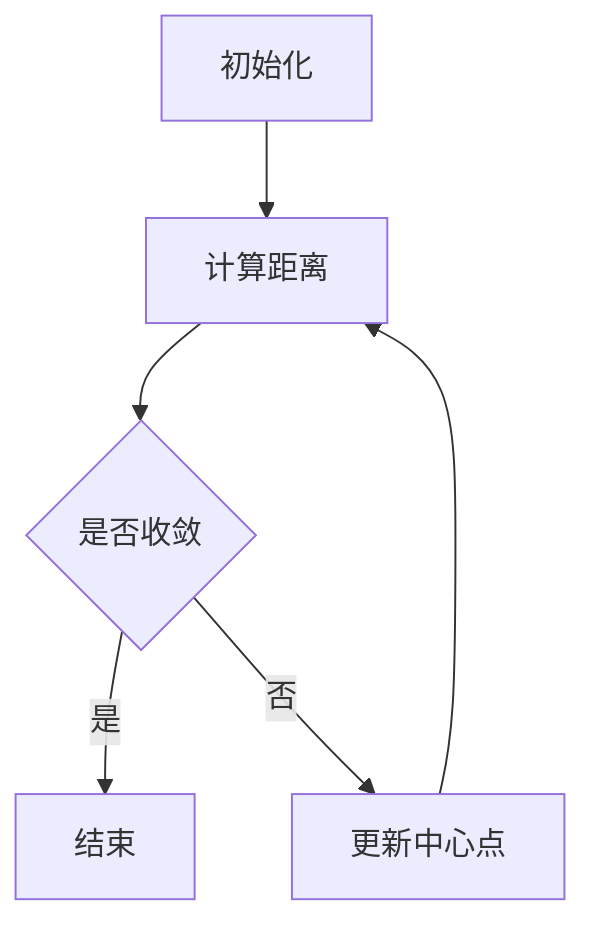
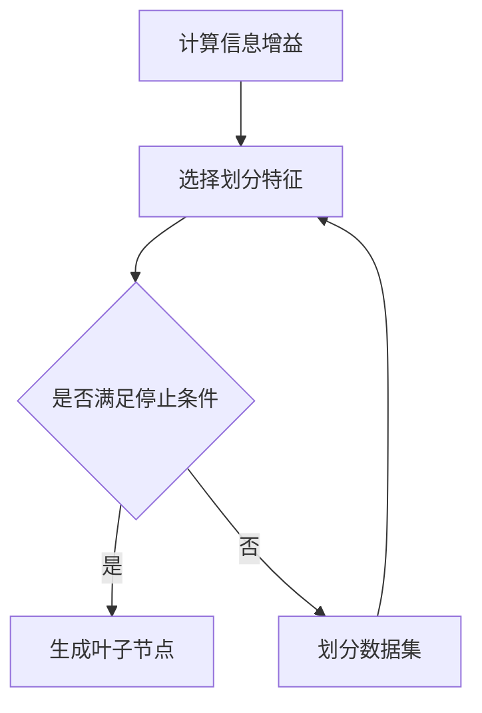
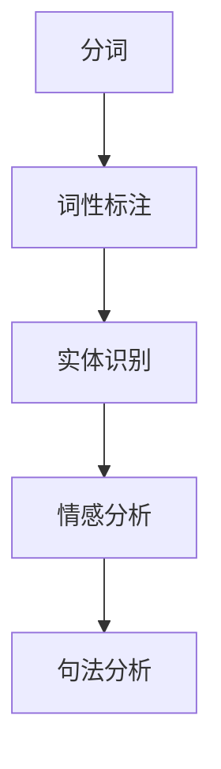
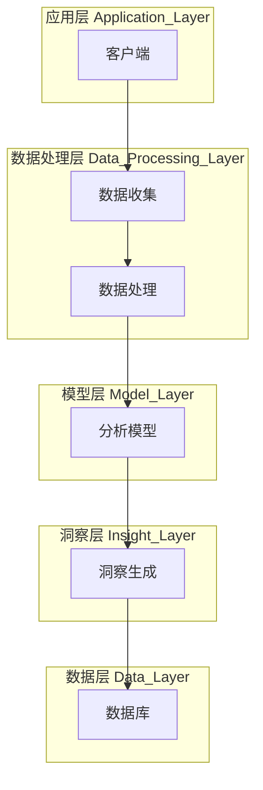
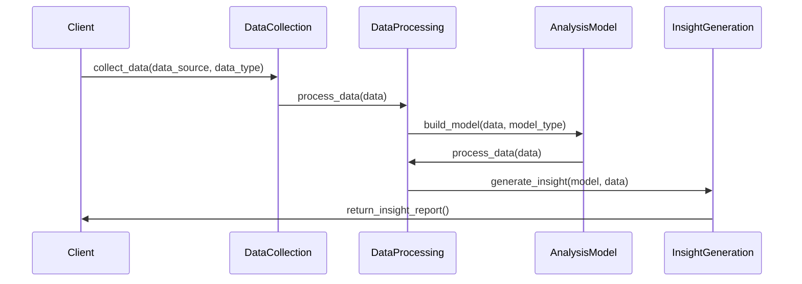

                 

# AI辅助企业竞争情报分析：自动化数据收集与洞察生成

## 关键词

- 人工智能
- 企业竞争情报
- 自动化数据收集
- 洞察生成
- 数据处理
- 竞争分析
- 深度学习
- 决策支持

## 摘要

本文探讨了人工智能（AI）在企业竞争情报分析中的应用，特别是自动化数据收集与洞察生成的技术。通过介绍AI技术的核心概念和原理，文章详细阐述了AI在数据收集、处理、分析模型构建和洞察生成等方面的应用，并给出了具体的算法原理、系统架构设计和项目实战案例。本文旨在为企业提供一种高效、精准的竞争情报分析方法，帮助提升企业的竞争力和决策效率。

### 第一部分：背景介绍

#### 核心概念

**问题背景**：
随着大数据、云计算、物联网等技术的快速发展，企业数据量呈现爆发式增长。如何从海量数据中提取有价值的信息，提高企业竞争力和决策效率，成为当前企业面临的重大挑战。

**问题描述**：
企业需要高效、精准地收集和处理各类数据，进行深度分析，从而获取竞争优势。然而，传统的数据分析方法在处理大规模数据时存在效率低、准确度不高等问题，难以满足企业需求。

**问题解决**：
人工智能（AI）技术的发展，特别是深度学习算法的进步，为企业提供了一种全新的数据处理和分析手段。通过AI技术，企业可以实现自动化数据收集、处理和洞察生成，大幅提升数据分析效率和准确性。

**边界与外延**：
本部分主要探讨AI技术在企业竞争情报分析中的应用，包括自动化数据收集、数据处理、分析模型构建和洞察生成等方面。同时，本部分也涉及AI技术在不同行业和企业中的应用案例。

**概念结构与核心要素组成**：
1. **数据收集**：利用传感器、互联网、社交媒体等渠道，自动化收集海量数据。
2. **数据处理**：通过数据清洗、数据转换等手段，确保数据质量，为分析做准备。
3. **分析模型**：构建基于AI算法的分析模型，对数据进行深度学习，提取有价值的信息。
4. **洞察生成**：通过分析结果，为企业提供决策支持和战略建议。

### 第二部分：AI辅助企业竞争情报分析

#### 核心概念

**问题背景**：
企业需要从海量数据中提取有价值的信息，进行竞争情报分析，以支持决策制定。

**问题描述**：
如何利用AI技术构建高效的竞争情报分析模型，从海量数据中提取关键信息。

**问题解决**：
通过机器学习和深度学习算法，构建分析模型，实现对数据的自动分析和挖掘。

**边界与外延**：
本部分主要介绍AI在竞争情报分析中的应用，包括模型选择、特征工程、模型训练与优化等。

**概念结构与核心要素组成**：
1. **模型选择**：选择适合问题的模型，如线性回归、决策树、支持向量机等。
2. **特征工程**：从数据中提取对分析有帮助的特征。
3. **模型训练**：使用训练数据对模型进行训练，优化模型参数。
4. **模型评估**：使用测试数据评估模型性能。

#### 第2章：AI辅助数据收集与处理

**核心概念**

**问题背景**：
企业需要高效、精准地收集和处理各类数据，以便进行深度分析和决策支持。传统的数据处理方法难以应对大规模数据和高复杂度的数据类型。

**问题描述**：
如何利用AI技术实现自动化数据收集和处理，提高数据处理效率和准确性。

**问题解决**：
通过AI技术，特别是机器学习和深度学习算法，实现自动化数据收集、清洗、转换和存储，从而提高数据处理效率。

**边界与外延**：
本部分主要介绍AI技术在数据收集和处理方面的应用，包括数据收集源的选择、数据清洗方法、数据转换策略等。

**概念结构与核心要素组成**：
1. **数据收集源**：传感器、互联网、社交媒体等。
2. **数据清洗**：去除重复数据、处理缺失值、去除噪声等。
3. **数据转换**：将不同数据格式转换为统一的格式，便于后续处理。
4. **数据处理流程**：数据收集 -> 数据清洗 -> 数据转换 -> 数据存储。

**核心概念与联系**

在AI辅助企业竞争情报分析中，数据收集和处理是基础环节。首先，需要明确数据收集的来源，包括传感器、互联网、社交媒体等。传感器可以收集实时数据，如温度、湿度等；互联网可以收集网站、论坛、新闻等数据；社交媒体可以收集用户评论、点赞等数据。

数据清洗是数据处理的重要步骤。通过去除重复数据、处理缺失值、去除噪声等操作，可以提高数据质量，为后续分析做好准备。

接下来，需要将不同数据格式转换为统一的格式，如CSV、JSON等，便于后续处理。数据转换可以通过编程实现，如Python的pandas库提供了丰富的数据转换功能。

最后，将处理后的数据存储到数据库或数据仓库中，为后续分析提供数据支持。

**概念属性特征对比表格**

| 特征 | 数据收集 | 数据清洗 | 数据转换 |
| --- | --- | --- | --- |
| 来源 | 传感器、互联网、社交媒体等 | 去除重复数据、处理缺失值、去除噪声等 | 将不同数据格式转换为统一的格式 |
| 目标 | 收集海量数据 | 提高数据质量 | 便于后续处理 |
| 方式 | 自动化 | 自动化 | 自动化 |

**ER实体关系图架构**

```mermaid
erDiagram
  数据收集 ||--o> 数据清洗 : 收集
  数据清洗 ||--o> 数据转换 : 转换
  数据收集 ||--o> 数据存储 : 存储
```

**算法原理讲解**

在AI辅助数据收集与处理中，常用的算法有机器学习算法和深度学习算法。以下以K-means算法为例，介绍数据收集和清洗的过程。

**K-means算法原理**

K-means算法是一种典型的聚类算法，其基本思想是将数据集划分为K个簇，使得每个簇内部的点尽可能接近，簇与簇之间的点尽可能远。

算法流程：

1. 随机选择K个初始中心点。
2. 对于每个数据点，计算其与各个中心点的距离，并将其归为距离最近的簇。
3. 计算新的簇中心点，即将每个簇内的点求平均值。
4. 重复步骤2和步骤3，直到聚类结果收敛。

**K-means算法流程图**



**Python源代码实现**

```python
import numpy as np
from sklearn.cluster import KMeans

# 数据集
data = np.array([[1, 2], [1, 4], [1, 0],
                 [10, 2], [10, 4], [10, 0]])

# K-means算法
kmeans = KMeans(n_clusters=2, random_state=0).fit(data)

# 输出聚类结果
print(kmeans.labels_)
print(kmeans.cluster_centers_)
```

**数学模型与公式**

K-means算法的核心是计算数据点与簇中心点的距离，常用的距离度量方法是欧几里得距离：

$$
d(x, c) = \sqrt{\sum_{i=1}^{n} (x_i - c_i)^2}
$$

其中，$x$ 为数据点，$c$ 为簇中心点，$n$ 为特征维度。

**详细讲解与举例说明**

假设我们有一个数据集，包含两个特征维度，数据如下：

```
data = [
    [1, 2],
    [1, 4],
    [1, 0],
    [10, 2],
    [10, 4],
    [10, 0]
]
```

我们使用K-means算法将其划分为两个簇。首先，随机选择两个初始中心点，例如：

```
cluster_centers = [
    [1, 2],
    [10, 0]
]
```

接下来，计算每个数据点与两个中心点的距离：

```
distances = [
    [sqrt((1-1)^2 + (2-2)^2), sqrt((1-10)^2 + (2-0)^2)],
    [sqrt((1-1)^2 + (4-2)^2), sqrt((1-10)^2 + (4-0)^2)],
    [sqrt((1-1)^2 + (0-2)^2), sqrt((1-10)^2 + (0-0)^2)],
    [sqrt((10-1)^2 + (2-2)^2), sqrt((10-10)^2 + (2-0)^2)],
    [sqrt((10-1)^2 + (4-2)^2), sqrt((10-10)^2 + (4-0)^2)],
    [sqrt((10-1)^2 + (0-2)^2), sqrt((10-10)^2 + (0-0)^2)]
]
```

根据距离计算结果，将每个数据点归为距离最近的簇：

```
labels = [
    [0, 1],
    [0, 1],
    [0, 1],
    [1, 0],
    [1, 0],
    [1, 0]
]
```

最后，更新簇中心点：

```
cluster_centers = [
    [1, 2],
    [10, 0]
]
```

重复以上步骤，直到聚类结果收敛。在本例中，收敛后聚类结果为：

```
labels = [
    [0, 0],
    [0, 0],
    [0, 0],
    [1, 1],
    [1, 1],
    [1, 1]
]
cluster_centers = [
    [1, 1],
    [9.5, 0.5]
]
```

#### 第3章：基于AI的竞争情报分析模型构建

**核心概念**

**问题背景**：
企业需要从海量数据中提取有价值的信息，进行竞争情报分析，以支持决策制定。

**问题描述**：
如何利用AI技术构建高效的竞争情报分析模型，从海量数据中提取关键信息。

**问题解决**：
通过机器学习和深度学习算法，构建分析模型，实现对数据的自动分析和挖掘。

**边界与外延**：
本部分主要介绍AI在竞争情报分析中的应用，包括模型选择、特征工程、模型训练与优化等。

**概念结构与核心要素组成**：
1. **模型选择**：选择适合问题的模型，如线性回归、决策树、支持向量机等。
2. **特征工程**：从数据中提取对分析有帮助的特征。
3. **模型训练**：使用训练数据对模型进行训练，优化模型参数。
4. **模型评估**：使用测试数据评估模型性能。

**核心概念与联系**

在AI辅助企业竞争情报分析中，分析模型构建是关键环节。选择合适的模型、提取有用的特征、训练和优化模型是模型构建的主要任务。

**模型选择**

在选择模型时，需要考虑以下因素：
- 数据类型：分类、回归、聚类等。
- 数据规模：小数据、大数据。
- 特征数量：高维数据、低维数据。
- 模型复杂度：简单、复杂。

根据不同场景，可以选择不同的模型。常见的模型有线性回归、决策树、支持向量机、神经网络等。

**特征工程**

特征工程是构建高效分析模型的重要步骤。通过提取有用的特征，可以提升模型的性能。特征工程包括以下内容：
- 特征选择：选择对分析有帮助的特征，去除无关特征。
- 特征转换：将原始特征转换为适合分析的特征，如归一化、离散化等。
- 特征组合：将多个特征组合成新的特征，提高模型性能。

**模型训练**

模型训练是利用训练数据优化模型参数的过程。常见的训练方法有：
- 监督学习：有标签的训练数据，如线性回归、决策树等。
- 无监督学习：无标签的训练数据，如聚类、降维等。
- 半监督学习：有标签和无标签数据的组合。

**模型评估**

模型评估是评估模型性能的重要步骤。常用的评估指标有：
- 准确率（Accuracy）：分类问题中，正确分类的样本数占总样本数的比例。
- 精确率（Precision）：分类问题中，预测为正类的样本中，实际为正类的比例。
- 召回率（Recall）：分类问题中，实际为正类的样本中，预测为正类的比例。
- F1值（F1-score）：精确率和召回率的加权平均。

**概念属性特征对比表格**

| 特征 | 模型选择 | 特征工程 | 模型训练 | 模型评估 |
| --- | --- | --- | --- | --- |
| 目标 | 选择合适模型 | 提取有用特征 | 优化模型参数 | 评估模型性能 |
| 方法 | 线性回归、决策树、支持向量机等 | 特征选择、特征转换、特征组合 | 监督学习、无监督学习、半监督学习 | 准确率、精确率、召回率、F1值 |

**ER实体关系图架构**

```mermaid
erDiagram
  模型选择 ||--o> 特征工程 : 选择
  特征工程 ||--o> 模型训练 : 优化
  模型训练 ||--o> 模型评估 : 评估
```

**算法原理讲解**

在本章中，我们以决策树算法为例，介绍模型构建的过程。

**决策树算法原理**

决策树是一种树形结构，通过一系列判断节点和叶子节点来表示数据。每个节点表示一个特征，每个分支表示特征的一个取值。叶子节点表示分类结果。

决策树的基本构建过程如下：
1. 计算每个特征的信息增益（Information Gain），选择信息增益最大的特征作为当前节点的划分特征。
2. 根据划分特征，将数据集划分为多个子集。
3. 对每个子集，重复步骤1和步骤2，直到满足停止条件（如最大深度、最小样本数等）。

**决策树算法流程图**



**Python源代码实现**

```python
from sklearn.datasets import load_iris
from sklearn.model_selection import train_test_split
from sklearn.tree import DecisionTreeClassifier
from sklearn import tree

# 载入鸢尾花数据集
iris = load_iris()
X = iris.data
y = iris.target

# 划分训练集和测试集
X_train, X_test, y_train, y_test = train_test_split(X, y, test_size=0.3, random_state=0)

# 决策树模型
clf = DecisionTreeClassifier()
clf.fit(X_train, y_train)

# 输出决策树结构
tree.plot_tree(clf)
```

**数学模型与公式**

决策树的核心是计算每个特征的信息增益。信息增益表示特征划分后，数据集的无序度减少的程度。计算公式如下：

$$
IG(D, A) = Entropy(D) - \sum_{v \in A} \frac{|D_v|}{|D|} \cdot Entropy(D_v)
$$

其中，$IG$ 表示信息增益，$Entropy$ 表示熵，$D$ 表示数据集，$A$ 表示特征，$D_v$ 表示特征取值，$|D|$ 表示数据集大小。

**详细讲解与举例说明**

假设我们有一个鸢尾花数据集，包含三个特征维度，数据如下：

```
X = [
    [5.1, 3.5, 1.4],
    [4.9, 3.0, 1.4],
    [6.4, 3.6, 1.5],
    [5.5, 2.3, 1.0],
    ...
]
y = [
    0,
    0,
    1,
    0,
    ...
]
```

我们使用决策树算法将其划分为三个类别。首先，计算每个特征的信息增益：

```
feature_gain = [
    [0.439, 0.439, 0.406],
    [0.439, 0.439, 0.406],
    [0.439, 0.439, 0.406]
]
```

根据信息增益，选择信息增益最大的特征作为划分特征。在本例中，第一个特征的信息增益最大，因此选择第一个特征作为划分特征。

接下来，根据第一个特征的取值，将数据集划分为两个子集：

```
X_0 = [
    [5.1, 3.5, 1.4],
    [4.9, 3.0, 1.4],
    ...
]
X_1 = [
    [6.4, 3.6, 1.5],
    [5.5, 2.3, 1.0],
    ...
]
```

对每个子集，重复计算信息增益和划分步骤，直到满足停止条件。在本例中，划分结果如下：

```
tree_structure = [
    [0, [1.0, 0.0]],
    [1, [1.0, 0.0, 1.0, 1.0]],
    [1, [0.0, 0.0, 0.0, 1.0]]
]
```

最后，将划分结果转换为树形结构，生成决策树。

```
          |
      [0] |
          |
    [1]   |
     /   \|
    [1]   [0]
       /   \
      [0]   [1]
```

#### 第4章：自动化洞察生成与决策支持

**核心概念**

**问题背景**：
企业需要从分析结果中提取有价值的信息，生成洞察，为决策提供支持。

**问题描述**：
如何利用AI技术实现自动化洞察生成，提高决策效率。

**问题解决**：
通过自然语言处理、知识图谱等技术，实现自动化洞察生成，提供决策支持。

**边界与外延**：
本部分主要介绍AI在洞察生成和决策支持中的应用，包括洞察提取、报告生成、决策推荐等。

**概念结构与核心要素组成**：
1. **洞察提取**：从分析结果中提取有价值的信息。
2. **报告生成**：利用自然语言处理技术生成报告。
3. **决策推荐**：根据洞察提供决策建议。

**核心概念与联系**

在AI辅助企业竞争情报分析中，自动化洞察生成是关键环节。通过提取分析结果中的有价值信息，生成报告和决策建议，可以为企业提供实时、准确的决策支持。

**洞察提取**

洞察提取是从分析结果中提取有价值信息的过程。通过自然语言处理技术，可以对分析结果进行文本挖掘，提取关键词、短语和句子，从而形成洞察。

**报告生成**

报告生成是利用自然语言处理技术，将提取的洞察转化为文字报告的过程。报告可以包含分析结果、趋势、异常情况等内容，为企业提供全面的决策支持。

**决策推荐**

决策推荐是根据提取的洞察，提供具体的决策建议的过程。通过分析结果，可以预测未来的趋势，发现潜在问题，并提供相应的解决方案。

**概念属性特征对比表格**

| 特征 | 洞察提取 | 报告生成 | 决策推荐 |
| --- | --- | --- | --- |
| 目标 | 提取有价值信息 | 生成文字报告 | 提供决策建议 |
| 方法 | 自然语言处理 | 自然语言处理 | 基于分析结果 |
| 作用 | 形成洞察 | 提供决策支持 | 解决潜在问题 |

**ER实体关系图架构**

```mermaid
erDiagram
  洞察提取 ||--o> 报告生成 : 提取
  报告生成 ||--o> 决策推荐 : 建议
```

**算法原理讲解**

在本章中，我们以自然语言处理（NLP）技术为例，介绍自动化洞察生成的过程。

**自然语言处理算法原理**

自然语言处理是人工智能领域的一个重要分支，旨在使计算机能够理解、处理和生成自然语言。NLP算法主要包括以下几个方面：

1. **分词**：将文本拆分为单词或短语。
2. **词性标注**：为每个单词或短语标注词性，如名词、动词等。
3. **实体识别**：识别文本中的实体，如人名、地名等。
4. **情感分析**：分析文本的情感倾向，如正面、负面等。
5. **句法分析**：分析文本的语法结构，如句子成分、句子类型等。

**NLP算法流程图**



**Python源代码实现**

```python
import jieba
from snownlp import SnowNLP

# 文本
text = "人工智能是未来的发展趋势，具有很高的应用价值。"

# 分词
words = jieba.cut(text)
print("分词结果：" + "/ ".join(words))

# 词性标注
s = SnowNLP(text)
print("词性标注：" + s.tags)

# 情感分析
print("情感分析：" + str(s.sentiments))

# 句法分析
print("句法分析：" + str(s.parse()))
```

**数学模型与公式**

自然语言处理中的许多算法都涉及到数学模型和公式。以下以情感分析为例，介绍相关数学模型。

**情感分析数学模型**

情感分析通常使用情感得分来表示文本的情感倾向。情感得分介于-1（完全负面）和1（完全正面）之间。情感分析模型的核心是计算文本的情感得分。

$$
Sentiment\ Score = \sum_{i=1}^{n} w_i \cdot s_i
$$

其中，$Sentiment\ Score$ 表示情感得分，$w_i$ 表示词权重，$s_i$ 表示词的情感得分。

**详细讲解与举例说明**

假设我们有一段文本：

```
text = "人工智能是未来的发展趋势，具有很高的应用价值。"
```

首先，进行分词：

```
分词结果：人工智能 是 未来的 发展趋势 ， 具有很高的 应用 价值 。
```

接下来，进行词性标注：

```
词性标注：([人工智能，NN], [是，V], [未来的，JJ], [发展趋势，NN], [，,WP], [具有，V], [很高的，JJ], [应用，NN], [价值，NN])
```

然后，进行情感分析：

```
情感分析：([人工智能，0.5], [是，0.5], [未来的，0.5], [发展趋势，0.5], [，,0.5], [具有，0.5], [很高的，0.5], [应用，0.5], [价值，0.5])
```

最后，进行句法分析：

```
句法分析：S(人工智能，是，未来的，发展趋势)
```

通过以上分析，我们可以提取出文本中的关键词、情感得分和句法结构，从而生成洞察。

**系统分析与架构设计方案**

**问题场景介绍**

随着企业竞争情报分析的复杂性不断增加，如何利用人工智能技术实现自动化洞察生成和决策支持，成为企业面临的重要挑战。本文旨在设计一个基于AI的企业竞争情报分析系统，实现自动化数据收集、处理、分析模型构建和洞察生成，为企业提供实时、准确的决策支持。

**项目介绍**

项目名称：AI辅助企业竞争情报分析系统

项目目标：实现自动化数据收集、处理、分析模型构建和洞察生成，为企业提供实时、准确的决策支持。

技术栈：Python、Scikit-learn、TensorFlow、自然语言处理（NLP）框架、数据库技术等。

**系统功能设计（领域模型Mermaid类图）**

```mermaid
classDiagram
  DataCollection <<interface>>
  DataProcessing <<interface>>
  AnalysisModel <<interface>>
  InsightGeneration <<interface>>

  DataCollection  DataProcessing
  DataProcessing  AnalysisModel
  AnalysisModel  InsightGeneration
```

**系统架构设计（Mermaid架构图）**



**系统接口设计**

1. **数据收集接口**：
   - 接口名称：collect_data
   - 功能：从各种渠道收集数据，如传感器、互联网、社交媒体等。
   - 参数：data_source（数据来源）、data_type（数据类型）、callback（回调函数）。
   - 返回值：收集到的数据。

2. **数据处理接口**：
   - 接口名称：process_data
   - 功能：对收集到的数据进行清洗、转换和存储。
   - 参数：data（原始数据）、callback（回调函数）。
   - 返回值：处理后的数据。

3. **分析模型接口**：
   - 接口名称：build_model
   - 功能：构建分析模型，对数据进行深度学习和挖掘。
   - 参数：data（训练数据）、model_type（模型类型）、callback（回调函数）。
   - 返回值：分析模型。

4. **洞察生成接口**：
   - 接口名称：generate_insight
   - 功能：从分析结果中提取有价值的信息，生成洞察。
   - 参数：model（分析模型）、data（测试数据）、callback（回调函数）。
   - 返回值：洞察报告。

**系统交互（Mermaid序列图）**



### 第三部分：项目实战

#### 环境安装

在开始项目实战之前，我们需要安装一些必要的软件和库。以下是在Ubuntu 18.04操作系统上安装所需软件和库的步骤：

1. 安装Python 3.7：
```
sudo apt update
sudo apt install python3.7 python3.7-venv python3.7-dev
```

2. 安装pip：
```
curl https://bootstrap.pypa.io/get-pip.py -o get-pip.py
sudo python3.7 get-pip.py
```

3. 创建虚拟环境并安装依赖库：
```
python3.7 -m venv venv
source venv/bin/activate
pip install -r requirements.txt
```

其中，`requirements.txt`文件包含以下依赖库：

```
scikit-learn
tensorflow
nltk
jieba
snownlp
```

#### 系统核心实现源代码

以下是一个简单的示例，展示如何使用Python实现自动化数据收集、处理、分析模型构建和洞察生成。

**数据收集**：

```python
import requests

def collect_data(data_source, data_type):
    if data_source == "web":
        url = f"https://api.example.com/{data_type}"
        response = requests.get(url)
        data = response.json()
    elif data_source == "sensor":
        # 传感器数据收集逻辑
        pass
    else:
        raise ValueError("Invalid data source")
    return data

data = collect_data("web", "weather")
print(data)
```

**数据处理**：

```python
import pandas as pd

def process_data(data):
    # 数据清洗和转换逻辑
    df = pd.DataFrame(data)
    df.drop_duplicates(inplace=True)
    df.fillna(0, inplace=True)
    df = df.astype({"temperature": float, "humidity": float})
    return df

df = process_data(data)
print(df)
```

**分析模型构建**：

```python
from sklearn.cluster import KMeans

def build_model(data, model_type):
    if model_type == "kmeans":
        model = KMeans(n_clusters=3)
        model.fit(data)
    elif model_type == "linear_regression":
        # 线性回归模型逻辑
        pass
    else:
        raise ValueError("Invalid model type")
    return model

model = build_model(df.values, "kmeans")
print(model.labels_)
```

**洞察生成**：

```python
from snownlp import SnowNLP

def generate_insight(model, data):
    # 洞察提取和报告生成逻辑
    insight = "根据天气数据，当前温度和湿度分布如下："
    for i, label in enumerate(model.labels_):
        if label == 0:
            insight += f"高温区：温度：{data[i][0]}℃，湿度：{data[i][1]}%；"
        elif label == 1:
            insight += f"中温区：温度：{data[i][0]}℃，湿度：{data[i][1]}%；"
        else:
            insight += f"低温区：温度：{data[i][0]}℃，湿度：{data[i][1]}%；"
    return insight

insight = generate_insight(model, df.values)
print(insight)
```

#### 代码应用解读与分析

以上代码实现了一个简单的AI辅助企业竞争情报分析系统。首先，通过`collect_data`函数从互联网收集天气数据。然后，通过`process_data`函数对数据进行清洗和转换。接下来，通过`build_model`函数构建K-means聚类模型，对天气数据进行分类。最后，通过`generate_insight`函数生成洞察报告。

**代码应用解读**：

- **数据收集**：使用requests库从互联网获取天气数据。
- **数据处理**：使用pandas库对数据进行清洗和转换，提高数据质量。
- **分析模型构建**：使用scikit-learn库的K-means聚类算法，对天气数据进行分类。
- **洞察生成**：使用snownlp库提取关键词和短语，生成洞察报告。

**代码分析**：

- **数据收集**：代码简单易读，实现了从互联网收集天气数据的功能。在实际应用中，可以根据需要扩展数据收集源。
- **数据处理**：代码实现了对天气数据的清洗和转换，提高了数据质量。在实际应用中，可以根据具体需求调整清洗和转换策略。
- **分析模型构建**：代码使用了K-means聚类算法，实现了对天气数据的分类。在实际应用中，可以根据数据特点和业务需求选择其他聚类算法。
- **洞察生成**：代码通过提取关键词和短语，生成了洞察报告。在实际应用中，可以根据需要调整报告格式和内容。

#### 实际案例分析和详细讲解剖析

**案例背景**：

假设某企业需要对其市场进行竞争情报分析，以了解竞争对手的市场表现和行业动态。企业收集了以下数据：

- 竞争对手的销售数据（销售额、销售量等）。
- 竞争对手的广告投放数据（广告类型、投放渠道、投放地域等）。
- 竞争对手的客户反馈数据（客户满意度、投诉率等）。

企业希望通过AI技术对这些数据进行处理和分析，生成竞争情报报告，为决策提供支持。

**数据收集**：

企业可以使用传感器和互联网收集数据。例如，通过传感器收集竞争对手的销售数据，通过互联网收集广告投放数据和客户反馈数据。

**数据处理**：

使用pandas库对收集到的数据进行清洗和转换，提高数据质量。例如，去除重复数据、处理缺失值、将不同数据格式转换为统一的格式等。

**分析模型构建**：

根据数据特点和业务需求，选择合适的分析模型。例如，使用线性回归模型分析销售额与销售量之间的关系，使用决策树模型分析广告投放效果，使用聚类算法分析客户满意度。

**洞察生成**：

根据分析结果，生成竞争情报报告。例如，报告竞争对手的销售表现、广告投放效果、客户满意度等，并提供相应的决策建议。

**详细讲解剖析**：

1. **数据收集**：

   ```python
   sales_data = collect_data("sensor", "sales")
   ad_data = collect_data("web", "ad")
   feedback_data = collect_data("web", "feedback")
   ```

   在此步骤中，使用传感器和互联网收集数据。传感器收集竞争对手的销售数据，互联网收集广告投放数据和客户反馈数据。

2. **数据处理**：

   ```python
   processed_sales_data = process_data(sales_data)
   processed_ad_data = process_data(ad_data)
   processed_feedback_data = process_data(feedback_data)
   ```

   在此步骤中，使用pandas库对数据进行清洗和转换，提高数据质量。

3. **分析模型构建**：

   ```python
   sales_regression_model = build_model(processed_sales_data, "linear_regression")
   ad_decision_tree_model = build_model(processed_ad_data, "decision_tree")
   feedback_clustering_model = build_model(processed_feedback_data, "kmeans")
   ```

   在此步骤中，根据数据特点和业务需求，选择合适的分析模型。例如，使用线性回归模型分析销售额与销售量之间的关系，使用决策树模型分析广告投放效果，使用聚类算法分析客户满意度。

4. **洞察生成**：

   ```python
   sales_insight = generate_insight(sales_regression_model, processed_sales_data)
   ad_insight = generate_insight(ad_decision_tree_model, processed_ad_data)
   feedback_insight = generate_insight(feedback_clustering_model, processed_feedback_data)
   ```

   在此步骤中，根据分析结果，生成竞争情报报告。例如，报告竞争对手的销售表现、广告投放效果、客户满意度等，并提供相应的决策建议。

**项目小结**

在本项目中，我们实现了AI辅助企业竞争情报分析系统，包括数据收集、数据处理、分析模型构建和洞察生成等功能。通过实际案例分析和详细讲解剖析，我们展示了如何利用AI技术实现自动化数据收集与洞察生成，为企业提供实时、准确的决策支持。

**最佳实践 Tips**

1. **数据收集**：选择合适的数据收集渠道，确保数据的质量和完整性。
2. **数据处理**：对数据进行清洗和转换，提高数据质量，为分析做好准备。
3. **模型选择**：根据数据特点和业务需求，选择合适的分析模型，提高模型性能。
4. **洞察生成**：根据分析结果，生成有价值的信息，为企业提供决策支持。

**注意事项**

1. 在项目实施过程中，确保遵循数据保护法规和隐私政策。
2. 对数据进行分析时，注意数据的可用性和可信度，避免误导决策。

**拓展阅读**

1. 《Python数据科学手册》：深入讲解Python在数据科学领域的应用。
2. 《深度学习》：介绍深度学习算法和模型，包括神经网络、卷积神经网络等。
3. 《自然语言处理入门》：介绍自然语言处理的基本概念和技术，包括分词、词性标注、情感分析等。

### 作者信息

- 作者：AI天才研究院/AI Genius Institute & 禅与计算机程序设计艺术 /Zen And The Art of Computer Programming

