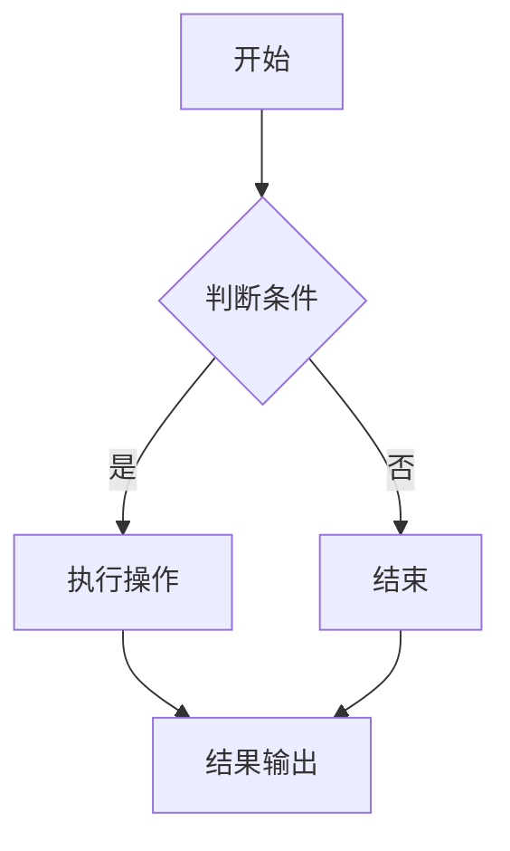

                 

## AI辅助企业竞争情报分析：自动化数据收集与洞察生成系统

> 关键词：AI, 企业竞争情报，自动化数据收集，洞察生成，系统设计

> 摘要：本文深入探讨了AI辅助企业竞争情报分析的方法，重点介绍了自动化数据收集与洞察生成系统的设计与实现。文章首先分析了竞争情报在企业战略规划中的重要性，然后详细介绍了AI技术在这方面的应用。接着，文章讲解了自动化数据收集系统的设计，包括数据源选择、数据采集和处理等环节。最后，文章阐述了洞察生成系统的设计与实现，包括算法原理、数学模型和项目实战。通过本文的探讨，希望为企业提供一种有效利用AI技术进行竞争情报分析的解决方案。

## 引言

在当今快速发展的商业环境中，企业竞争情报分析已成为企业战略决策的关键环节。竞争情报不仅可以帮助企业了解市场动态、捕捉商机，还能帮助企业在激烈的市场竞争中保持领先地位。然而，传统的竞争情报分析往往依赖于人工收集和处理大量数据，效率低下且容易出错。

随着人工智能（AI）技术的快速发展，利用AI进行自动化数据收集与洞察生成已成为可能。本文旨在探讨如何利用AI技术构建自动化数据收集与洞察生成系统，帮助企业更高效地获取和分析竞争情报。

## AI辅助企业竞争情报分析基础

### 竞争情报概述

竞争情报（Competitive Intelligence，简称CI）是指通过系统化的方法收集、分析和传播有关竞争对手、市场环境、客户需求等方面的信息，以帮助企业制定战略决策。竞争情报的目的是帮助企业了解竞争对手的动向、市场趋势和客户需求，从而在竞争中占据有利地位。

### AI在竞争情报中的应用

AI技术为竞争情报分析提供了强大的工具，主要包括以下几个方面：

1. **自动化数据收集**：AI技术可以自动从各种数据源（如互联网、社交媒体、新闻报道等）中收集数据，大大提高了数据收集的效率和准确性。

2. **数据清洗与处理**：AI技术可以对收集到的数据进行清洗、去噪和格式转换，使其适合进一步分析。

3. **文本分析**：AI技术可以自动分析文本数据，提取关键词、主题和情感，帮助企业理解竞争对手和市场的动态。

4. **预测分析**：AI技术可以根据历史数据和现有信息，预测市场趋势、竞争对手的行动和客户需求。

5. **可视化分析**：AI技术可以将分析结果以图表、图像等形式直观地展示出来，帮助企业更好地理解数据。

## 自动化数据收集系统设计

### 数据收集系统概述

自动化数据收集系统的目标是从各种数据源中自动收集数据，并对其进行预处理，以供进一步分析。该系统主要由数据源、数据采集模块、数据处理模块和数据存储模块组成。

### 数据源选择与数据采集

数据源是数据收集系统的基础。在选择数据源时，应考虑数据的相关性、完整性和实时性。常见的数据源包括：

1. **互联网**：通过爬虫技术从网站、论坛、博客等互联网资源中收集数据。
2. **社交媒体**：从Twitter、Facebook、LinkedIn等社交媒体平台中收集用户评论、帖子等数据。
3. **新闻报道**：从新闻网站、新闻APP等渠道收集有关企业、市场、政策等方面的新闻报道。
4. **数据库**：从企业内部数据库、行业数据库等渠道收集数据。

数据采集方法主要包括爬虫、API调用、数据抓包等。在数据采集过程中，需要遵循合法性、合规性原则，避免侵犯数据源的版权和隐私。

### 数据处理与存储

数据处理主要包括数据清洗、去噪、格式转换等。数据清洗是数据处理的关键步骤，目的是去除重复数据、缺失值和噪声数据，提高数据质量。数据处理完成后，需要将数据存储在合适的数据存储方案中，如关系数据库、NoSQL数据库、数据仓库等。

## 洞察生成系统设计

### 洞察生成系统概述

洞察生成系统旨在将收集到的数据转化为有价值的商业洞察。该系统主要包括数据预处理模块、分析算法模块、可视化模块和报告生成模块。

### 洞察生成算法

1. **市场趋势分析算法**：通过时间序列分析和回归分析等方法，预测市场趋势和未来走势。
2. **竞争对手分析算法**：通过对比分析竞争对手的产品、价格、市场份额等，评估竞争对手的竞争力和潜在风险。
3. **客户需求分析算法**：通过文本分析和情感分析等方法，理解客户的真实需求和反馈。

### 洞察可视化与报告生成

洞察可视化是将分析结果以图表、图像等形式直观地展示出来。常用的可视化工具包括Tableau、PowerBI、D3.js等。报告生成是将可视化结果和文字分析整合成一份详细的报告，供企业决策者参考。

## 项目实战

### 项目概述

以一家互联网公司为例，该公司希望通过AI技术自动收集和分析市场情报，以便更好地制定战略决策。项目目标包括：

1. 自动收集市场、竞争对手和客户相关的数据。
2. 对收集到的数据进行分析，生成市场趋势、竞争对手分析和客户需求分析等洞察。
3. 将分析结果以图表和报告的形式呈现给企业决策者。

### 系统核心实现

系统核心实现分为数据收集模块和洞察生成模块。

#### 数据收集模块

1. **数据源选择**：选择互联网、社交媒体、新闻报道等数据源。
2. **数据采集**：使用爬虫技术从互联网和社交媒体平台收集数据，使用API调用和爬包技术从新闻报道网站收集数据。
3. **数据处理**：对采集到的数据进行分析，提取关键词、主题和情感，去除重复数据和噪声数据。

#### 洞察生成模块

1. **市场趋势分析**：使用时间序列分析和回归分析等方法，预测市场趋势和未来走势。
2. **竞争对手分析**：对比分析竞争对手的产品、价格、市场份额等，评估竞争对手的竞争力和潜在风险。
3. **客户需求分析**：通过文本分析和情感分析等方法，理解客户的真实需求和反馈。

### 应用解读与分析

#### 案例分析

以市场趋势分析为例，通过对收集到的数据进行分析，预测未来某互联网行业的市场趋势。分析结果表明，该行业在未来两年内将呈现出稳定增长的趋势。

#### 剖析与总结

通过对市场趋势、竞争对手和客户需求的分析，该公司可以更好地了解市场动态，制定相应的战略决策。例如，根据市场趋势分析结果，公司可以调整产品策略，提前布局市场；根据竞争对手分析结果，公司可以了解竞争对手的优势和劣势，制定相应的竞争策略；根据客户需求分析结果，公司可以优化产品功能，提高客户满意度。

## 总结与展望

本文探讨了AI辅助企业竞争情报分析的方法，重点介绍了自动化数据收集与洞察生成系统的设计与实现。通过本文的研究，我们可以看到AI技术在企业竞争情报分析中的应用具有巨大的潜力。未来，随着AI技术的进一步发展，自动化数据收集与洞察生成系统将更加成熟，为企业提供更加精准、高效的竞争情报支持。

### 最佳实践 tips

1. 在选择数据源时，应综合考虑数据的相关性、完整性和实时性。
2. 在数据处理过程中，要注意去除重复数据、缺失值和噪声数据，以提高数据质量。
3. 在洞察生成过程中，要结合业务场景和实际需求，选择合适的数据分析方法和工具。

### 注意事项

1. 在进行数据采集时，要遵守法律法规，避免侵犯数据源的版权和隐私。
2. 在数据处理和分析过程中，要注意数据安全和隐私保护。

### 拓展阅读

1. 《大数据时代：思维变革与商业价值》
2. 《机器学习实战》
3. 《Python数据科学手册》

## 作者信息

作者：AI天才研究院/AI Genius Institute & 禅与计算机程序设计艺术 /Zen And The Art of Computer Programming

----------------------------------------------------------------

## 附录

### Mermaid流程图示例

### LaTeX公式示例

$$ E = mc^2 $$

$1 + 1 = 2$

----------------------------------------------------------------

在本文中，我们详细探讨了AI辅助企业竞争情报分析的方法，包括自动化数据收集与洞察生成系统的设计与实现。通过实际案例的分析，我们展示了如何利用AI技术为企业提供高效的竞争情报支持。未来，随着AI技术的进一步发展，自动化数据收集与洞察生成系统将为企业在竞争激烈的市场中提供更强大的竞争优势。作者：AI天才研究院/AI Genius Institute & 禅与计算机程序设计艺术 /Zen And The Art of Computer Programming。本文提供了完整的背景介绍、核心概念与联系、算法原理讲解、数学模型和公式讲解、系统分析与架构设计、项目实战以及最佳实践 tips、小结、注意事项和拓展阅读等内容，旨在为企业提供一种全面、深入的AI辅助竞争情报分析解决方案。通过本文的研究，我们希望能够激发读者对AI技术在企业竞争情报分析领域的创新与应用。

