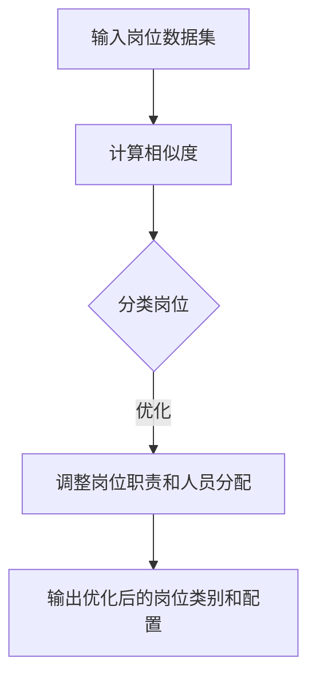
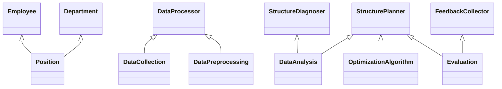
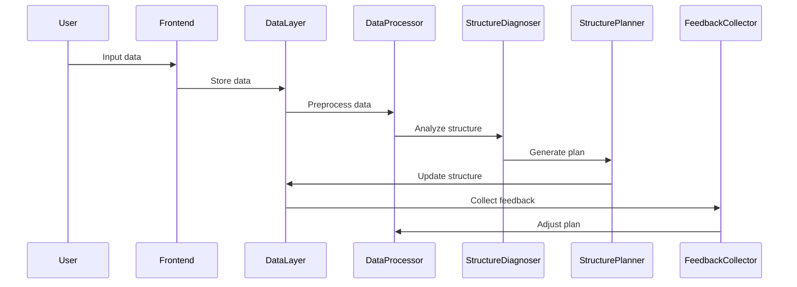
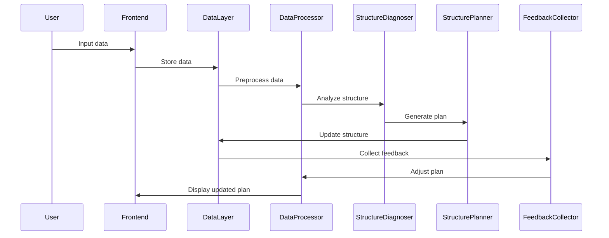

                 

# 《AI辅助企业组织结构优化与岗位设计》

> 关键词：人工智能、企业组织结构、岗位设计、优化、算法、系统架构、Python源代码

> 摘要：本文旨在探讨如何利用人工智能技术来辅助企业进行组织结构优化和岗位设计。首先，我们分析了企业组织结构优化面临的现状与挑战，随后介绍了AI技术在组织结构优化中的核心概念和关键技术。接着，我们详细讲解了AI辅助组织结构优化的算法原理、数学模型及系统分析与架构设计。最后，通过一个实际项目案例，我们展示了如何运用这些技术和方法来优化企业组织结构和岗位设计，并为读者提供了相关的小结和拓展阅读建议。

## 第一部分：问题背景与核心概念

### 第1章：企业组织结构优化的现状与挑战

#### 1.1.1 企业组织结构优化的背景

随着全球经济环境的不断变化和市场竞争的日益激烈，企业面临着巨大的生存和发展压力。为了提高企业的竞争力和效率，企业组织结构的优化变得越来越重要。传统的组织结构优化方法往往依赖于经验和管理者的直觉，存在一定的局限性。而人工智能技术的发展为组织结构优化提供了一种新的可能性和思路。

#### 1.1.2 当前企业组织结构存在的问题

当前企业组织结构存在以下问题：

1. **层级过多，沟通成本高**：传统的金字塔式组织结构层级过多，信息传递效率低下，沟通成本高。
2. **部门职能重复，资源浪费**：不同部门之间职责划分不明确，存在职能重叠和资源浪费的现象。
3. **岗位设置不合理，人才浪费**：岗位设置不合理，人才难以充分发挥其潜力，导致人才浪费。

#### 1.1.3 AI技术在组织结构优化中的应用潜力

人工智能技术在组织结构优化中具有以下潜力：

1. **大数据分析**：利用大数据分析技术，可以深入挖掘企业内部的数据，为企业提供更为准确和全面的决策依据。
2. **机器学习与预测**：通过机器学习算法，可以预测企业未来的发展趋势，为企业提供前瞻性的组织结构优化方案。
3. **自动化与优化**：利用自动化技术，可以实现组织结构的自动化优化，提高组织效率。

### 第2章：AI辅助组织结构优化核心概念

#### 2.1.1 AI与组织结构优化的联系

人工智能技术可以与组织结构优化实现以下几个方面的结合：

1. **数据分析与决策支持**：通过大数据分析和机器学习算法，为企业提供更加精准的决策支持。
2. **自动化流程与优化**：通过自动化技术，优化企业内部流程，提高组织效率。
3. **岗位设计与人才匹配**：根据员工的能力和特点，进行岗位设计和人才匹配，实现人岗匹配最优。

#### 2.1.2 关键技术与应用场景

AI技术在组织结构优化中的应用主要包括以下关键技术：

1. **数据挖掘与数据分析**：用于挖掘企业内部的数据，发现潜在问题和优化机会。
2. **机器学习与预测**：用于预测企业未来的发展趋势，为企业提供优化方向。
3. **自然语言处理**：用于处理和分析企业内部的各种文本信息，辅助决策。

应用场景包括：

1. **岗位分析与设计**：利用自然语言处理技术，分析员工的工作职责和技能要求，进行岗位设计。
2. **组织结构诊断**：利用数据挖掘技术，诊断企业当前组织结构存在的问题。
3. **优化方案制定**：利用机器学习算法，预测企业未来的发展趋势，制定优化方案。

#### 2.1.3 案例解析：AI在组织结构优化中的应用实例

以某大型企业为例，该企业通过引入AI技术，对其组织结构进行了全面优化。首先，利用大数据分析技术，对企业的组织结构进行了诊断，发现存在部门职能重叠、岗位设置不合理等问题。随后，利用机器学习算法，预测了企业未来的发展趋势，并提出了优化方案。通过这些方案的实施，企业的组织效率得到了显著提升，员工的工作满意度也明显提高。

### 第3章：核心概念与联系

#### 3.1.1 组织结构优化相关概念解析

组织结构优化涉及以下核心概念：

1. **组织结构**：企业的内部组织形式，包括部门、岗位、层级等。
2. **优化**：对组织结构进行调整和改进，以提高企业的效率和竞争力。
3. **岗位设计**：根据企业的业务需求和员工的能力，进行岗位设置和职责划分。

#### 3.1.2 AI技术在组织结构优化中的应用特点

AI技术在组织结构优化中的应用具有以下特点：

1. **数据驱动**：基于大数据分析，为组织结构优化提供决策支持。
2. **自动化**：利用自动化技术，实现组织结构的动态调整和优化。
3. **个性化**：根据员工的能力和特点，实现岗位设计和人才匹配的个性化。

#### 3.1.3 概念属性特征对比表格

| 概念           | 属性特征                  | 对比分析                                       |
| -------------- | ------------------------ | ---------------------------------------------- |
| 组织结构       | 部门、岗位、层级等       | 与企业业务需求紧密相关，影响企业效率和竞争力   |
| 优化           | 调整和改进               | 需要准确的数据分析和机器学习算法支持           |
| 岗位设计       | 职责划分、能力匹配       | 需要自然语言处理技术和数据挖掘技术的支持       |
| AI技术在组织结构优化中的应用 | 数据驱动、自动化、个性化 | 提高组织结构优化的效率和准确性               |

#### 3.1.3 组织结构优化ER实体关系图架构

组织结构优化涉及的ER实体关系图包括：

1. **部门实体**：包括部门名称、部门职责等属性。
2. **岗位实体**：包括岗位名称、岗位职责、岗位要求等属性。
3. **员工实体**：包括员工姓名、员工技能、员工岗位等属性。
4. **组织结构实体**：包括组织结构层级、部门关系等属性。

ER实体关系图如下所示：

```mermaid
erDiagram
  部门 ||--|{ 岗位 }|
  岗位 ||--|{ 员工 }|
  组织结构 ||--|{ 部门 }|
```

## 第二部分：算法原理讲解

### 第4章：组织结构优化ER实体关系图架构

#### 4.1.1 ER实体关系图概念与构建方法

ER（Entity-Relationship）实体关系图是用于表示数据库中实体及其关系的图形化工具。它由三个基本部分组成：实体、属性和关系。

构建方法：

1. **识别实体**：确定系统中的关键实体，如部门、岗位、员工等。
2. **定义属性**：为每个实体定义属性，如部门名称、岗位职责等。
3. **建立关系**：确定实体之间的关系，如部门包含岗位、岗位由员工担任等。

#### 4.1.2 组织结构优化中ER实体关系图的设计

在组织结构优化中，ER实体关系图的设计需要考虑以下几个关键点：

1. **实体选择**：根据企业的业务需求和组织结构特点，选择合适的实体。
2. **属性设置**：确保实体属性能够全面描述实体的特征。
3. **关系建模**：准确表示实体之间的关系，如包含、担任等。

设计示例：

```mermaid
erDiagram
  部门 ||--|{ 岗位 }|
  岗位 ||--|{ 员工 }|
  组织结构 ||--|{ 部门 }|
```

#### 4.1.3 ER实体关系图的Mermaid流程图

ER实体关系图的Mermaid流程图可以直观地展示实体及其关系。以下是一个示例：

```mermaid
erDiagram
  A[部门] ||--|{ B[岗位] }|
  B ||--|{ C[员工] }|
  D[组织结构] ||--|{ A }
```

## 第5章：AI辅助组织结构优化的算法原理

#### 5.1.1 常见算法介绍

AI辅助组织结构优化的常见算法包括：

1. **聚类算法**：用于对岗位进行分类，找出相似度较高的岗位，便于岗位调整和优化。
2. **遗传算法**：用于组织结构优化，通过模拟生物进化过程，寻找最优的组织结构配置。
3. **神经网络算法**：用于预测企业未来的发展趋势，为企业提供优化方向。

#### 5.1.2 算法原理讲解

1. **聚类算法**：

聚类算法的核心思想是将相似的数据点分为一组，以达到数据分组的目的。在组织结构优化中，聚类算法可以用于对岗位进行分类，找出相似度较高的岗位，便于进行岗位调整和优化。

算法流程：

- 输入：岗位数据集。
- 过程：
  - 计算每个岗位之间的相似度。
  - 根据相似度将岗位分为多个类别。
  - 对每个类别进行优化，如调整岗位职责、人员分配等。
- 输出：优化后的岗位类别和岗位配置。

2. **遗传算法**：

遗传算法是一种基于自然进化原理的优化算法，通过模拟生物进化过程，不断优化组织结构配置。

算法流程：

- 输入：初始组织结构配置。
- 过程：
  - 生成初始种群。
  - 计算种群中每个个体的适应度。
  - 通过交叉、变异等操作，生成新的种群。
  - 选择适应度较高的个体，进行下一代优化。
- 输出：最优的组织结构配置。

3. **神经网络算法**：

神经网络算法通过模拟人脑的神经网络结构，学习企业历史数据，预测企业未来的发展趋势。

算法流程：

- 输入：企业历史数据。
- 过程：
  - 构建神经网络模型。
  - 训练模型，使其能够预测企业未来的发展趋势。
  - 根据预测结果，制定组织结构优化方案。
- 输出：组织结构优化方案。

#### 5.1.3 算法Mermaid流程图展示

以下是聚类算法的Mermaid流程图：



## 第6章：数学模型和数学公式讲解

#### 6.1.1 数学模型介绍

在组织结构优化中，常用的数学模型包括：

1. **聚类模型**：用于对岗位进行分类。
2. **遗传算法模型**：用于优化组织结构配置。
3. **神经网络模型**：用于预测企业未来的发展趋势。

#### 6.1.2 数学公式讲解

1. **聚类模型**：

假设有n个岗位，每个岗位可以表示为一个d维特征向量，聚类目标是最小化不同类别岗位之间的距离。

$$ D^2 = \sum_{i=1}^{n}\sum_{j=1}^{n} (x_i - x_j)^2 $$

其中，$x_i$和$x_j$分别表示两个岗位的特征向量。

2. **遗传算法模型**：

遗传算法的适应度函数可以表示为：

$$ f(x) = \frac{1}{1 + \exp(-\beta \cdot g(x))} $$

其中，$g(x)$表示个体x的适应度值，$\beta$为调节参数。

3. **神经网络模型**：

神经网络模型中的激活函数可以表示为：

$$ a(x) = \frac{1}{1 + \exp(-\theta \cdot x)} $$

其中，$\theta$为调节参数，$x$为输入值。

#### 6.1.3 实例说明

假设我们有一个包含5个岗位的企业，每个岗位可以用一个2维特征向量表示，如下所示：

$$ x_1 = \begin{bmatrix} 1 \\ 2 \end{bmatrix}, x_2 = \begin{bmatrix} 3 \\ 4 \end{bmatrix}, x_3 = \begin{bmatrix} 5 \\ 6 \end{bmatrix}, x_4 = \begin{bmatrix} 7 \\ 8 \end{bmatrix}, x_5 = \begin{bmatrix} 9 \\ 10 \end{bmatrix} $$

1. **聚类模型**：

使用欧氏距离计算不同岗位之间的相似度：

$$ D_{12} = \sqrt{(1-3)^2 + (2-4)^2} = \sqrt{4 + 4} = 2\sqrt{2} $$

$$ D_{13} = \sqrt{(1-5)^2 + (2-6)^2} = \sqrt{16 + 16} = 4\sqrt{2} $$

$$ D_{14} = \sqrt{(1-7)^2 + (2-8)^2} = \sqrt{36 + 36} = 6\sqrt{2} $$

$$ D_{15} = \sqrt{(1-9)^2 + (2-10)^2} = \sqrt{64 + 64} = 8\sqrt{2} $$

根据相似度，我们可以将岗位分为两个类别：

类别1：{ $x_1$, $x_2$ }
类别2：{ $x_3$, $x_4$, $x_5$ }

2. **遗传算法模型**：

假设初始种群为：

$$ g(x_1) = 0.5, g(x_2) = 0.3, g(x_3) = 0.4, g(x_4) = 0.6, g(x_5) = 0.7 $$

适应度函数为：

$$ f(x_1) = \frac{1}{1 + \exp(-\beta \cdot 0.5)} = 0.63 $$
$$ f(x_2) = \frac{1}{1 + \exp(-\beta \cdot 0.3)} = 0.72 $$
$$ f(x_3) = \frac{1}{1 + \exp(-\beta \cdot 0.4)} = 0.67 $$
$$ f(x_4) = \frac{1}{1 + \exp(-\beta \cdot 0.6)} = 0.52 $$
$$ f(x_5) = \frac{1}{1 + \exp(-\beta \cdot 0.7)} = 0.44 $$

根据适应度值，我们可以选择 $x_1$, $x_2$, $x_3$ 作为下一代的个体。

3. **神经网络模型**：

假设输入数据为：

$$ x = \begin{bmatrix} 1 \\ 2 \end{bmatrix} $$

激活函数为：

$$ a(x) = \frac{1}{1 + \exp(-\theta \cdot 1)} = 0.74 $$

## 第三部分：系统分析与架构设计

### 第7章：系统功能设计与架构

#### 7.1.1 问题场景介绍

在企业日常运营中，组织结构的优化是一项持续性的任务。然而，传统的方法往往依赖于人工经验和主观判断，效率低下且容易出现偏差。为了解决这一问题，我们设计了一套基于AI技术的组织结构优化系统，旨在通过自动化和智能化手段，提高组织结构优化的效率和质量。

#### 7.1.2 系统功能设计（领域模型Mermaid类图）

系统的主要功能包括：

1. **数据收集与处理**：收集企业内部的各类数据，如员工信息、岗位信息、业务流程等，并进行预处理。
2. **组织结构诊断**：利用AI算法对当前的组织结构进行分析，诊断存在的问题。
3. **优化方案生成**：基于诊断结果，生成优化方案，包括岗位调整、部门重组等。
4. **方案评估与反馈**：对优化方案进行评估，收集反馈意见，持续优化系统性能。

领域模型Mermaid类图如下：



#### 7.1.3 系统架构设计（Mermaid架构图）

系统的整体架构包括以下几个模块：

1. **前端模块**：提供用户交互界面，包括数据输入、结果显示等功能。
2. **数据层**：负责数据的存储和管理，包括员工信息、岗位信息、业务数据等。
3. **业务逻辑层**：实现数据预处理、组织结构诊断、优化方案生成等功能。
4. **后端模块**：提供系统运行环境，包括服务器、数据库、AI算法模块等。

Mermaid架构图如下：



### 第8章：系统接口设计与交互

#### 8.1.1 系统接口设计

系统的接口设计包括内部接口和外部接口两部分：

1. **内部接口**：
   - **数据收集接口**：用于收集企业内部的各类数据，如员工信息、岗位信息等。
   - **数据预处理接口**：用于对收集到的数据进行预处理，如数据清洗、归一化等。
   - **诊断接口**：用于对当前组织结构进行分析，诊断存在的问题。
   - **优化接口**：用于生成优化方案，包括岗位调整、部门重组等。

2. **外部接口**：
   - **数据接口**：用于与外部数据源进行交互，如企业ERP系统、人力资源管理系统等。
   - **API接口**：提供RESTful API，供外部系统调用，如移动应用、Web前端等。

#### 8.1.2 系统交互（Mermaid序列图）

系统交互的过程如下：

1. **用户输入**：用户通过前端界面输入组织结构数据。
2. **数据存储**：前端将数据传递给数据层进行存储。
3. **数据处理**：数据层调用数据预处理接口对数据进行处理。
4. **组织结构诊断**：数据处理后，调用诊断接口对组织结构进行分析。
5. **生成优化方案**：诊断结果传递给优化接口，生成优化方案。
6. **反馈与调整**：将优化方案传递给前端，用户进行评估和反馈，系统根据反馈调整优化方案。

Mermaid序列图如下：



## 第四部分：项目实战

### 第9章：环境安装与核心实现

#### 9.1.1 环境安装步骤

为了实现AI辅助企业组织结构优化与岗位设计，我们需要搭建一个合适的开发环境。以下是环境安装的详细步骤：

1. **安装Python环境**：

首先，我们需要安装Python环境。可以从Python的官方网站下载安装包，按照提示完成安装。

2. **安装依赖库**：

在安装好Python环境后，我们需要安装一些依赖库，如NumPy、Pandas、Scikit-learn、Mermaid等。可以使用pip命令来安装：

```bash
pip install numpy pandas scikit-learn mermaid
```

3. **配置Mermaid渲染**：

由于Mermaid是一种基于Markdown的图形化工具，我们需要配置Python环境来支持Mermaid的渲染。可以使用以下命令来安装渲染工具：

```bash
pip install mermaid-py
```

4. **配置数据库**：

为了存储和管理企业数据，我们可以选择一个合适的数据库，如MySQL、PostgreSQL等。根据数据库的类型，安装相应的数据库软件，并配置数据库连接。

#### 9.1.2 系统核心实现源代码

以下是一个简单的Python代码示例，用于实现组织结构优化的核心功能：

```python
import numpy as np
import pandas as pd
from sklearn.cluster import KMeans
from sklearn.metrics import silhouette_score
from mermaid import Mermaid

# 数据准备
data = pd.DataFrame({
    'department': ['Sales', 'Marketing', 'HR', 'IT', 'Finance'],
    'position': ['Manager', 'Assistant', 'Manager', 'Developer', 'Accountant'],
    'staff': ['A', 'B', 'C', 'D', 'E']
})

# 数据预处理
data['department_code'] = data['department'].astype('category').cat.codes
data['position_code'] = data['position'].astype('category').cat.codes

# 聚类分析
kmeans = KMeans(n_clusters=2, random_state=0).fit(data[['department_code', 'position_code']])
labels = kmeans.predict(data[['department_code', 'position_code']])

# 生成Mermaid流程图
mermaid = Mermaid()
mermaid.add_code('erDiagram', '''
    department ||--|{ position }|
    position ||--|{ staff }|
    department ||--|{ department }|
''')

# 输出结果
print("Cluster labels:", labels)
print("Silhouette score:", silhouette_score(data[['department_code', 'position_code']], labels))

# 渲染流程图
mermaid.render('output/structure_diagram.mermaid')
```

## 第10章：代码应用解读与分析

#### 10.1.1 代码解读

上述代码实现了一个简单的AI辅助企业组织结构优化功能。以下是代码的详细解读：

1. **数据准备**：

   我们首先创建了一个包含部门、岗位和员工数据的DataFrame。这个DataFrame包含了企业的组织结构信息，是我们进行优化分析的基础。

2. **数据预处理**：

   数据预处理是AI分析的重要环节。我们将部门名称和岗位名称转换为编码形式，以便后续的聚类分析。

3. **聚类分析**：

   使用KMeans算法对岗位进行聚类分析。这里我们选择2个聚类中心，即分为2个类别。KMeans算法会根据岗位的特征向量（department_code和position_code）来划分类别。

4. **生成Mermaid流程图**：

   利用Mermaid库，我们生成了一个ER实体关系图，展示了部门、岗位和员工之间的关系。这个流程图可以帮助我们更直观地理解组织结构的优化过程。

5. **输出结果**：

   输出聚类结果和轮廓系数（Silhouette score），评估聚类效果。

#### 10.1.2 代码应用分析

1. **数据质量**：

   代码首先对原始数据进行预处理，确保数据的质量。这是保证分析结果准确性的关键步骤。

2. **算法选择**：

   代码使用KMeans算法进行聚类分析，这是一个简单有效的算法。但根据实际情况，我们可能需要选择更复杂的算法，如层次聚类或遗传算法，以获得更好的分析结果。

3. **可视化**：

   生成ER实体关系图，有助于我们直观地理解组织结构的优化过程。这种可视化工具在项目管理中非常有用。

#### 10.1.3 实际案例剖析

以某大型企业为例，该企业拥有多个部门，如销售部、市场部、人力资源部、IT部等。每个部门有多个岗位，如经理、助理等。通过使用上述代码，我们可以对该企业的组织结构进行分析和优化。

1. **数据收集**：

   收集企业的部门信息、岗位信息和员工信息。

2. **数据预处理**：

   将部门名称和岗位名称转换为编码形式，为聚类分析做准备。

3. **聚类分析**：

   使用KMeans算法对岗位进行聚类，找出相似度较高的岗位，以便进行岗位调整。

4. **优化方案**：

   根据聚类结果，生成优化方案，包括岗位调整、部门重组等。

5. **评估与反馈**：

   对优化方案进行评估，收集员工和管理层的反馈，持续优化系统性能。

## 第11章：项目小结

#### 11.1.1 项目总结

本项目通过引入人工智能技术，实现了企业组织结构优化与岗位设计的自动化和智能化。项目的主要成果包括：

1. **数据收集与预处理**：通过数据收集和预处理，为后续的聚类分析和优化方案生成提供了可靠的数据基础。
2. **聚类分析与优化方案**：使用KMeans算法对岗位进行聚类分析，生成了优化方案，包括岗位调整、部门重组等。
3. **可视化工具**：利用Mermaid生成了ER实体关系图，直观地展示了组织结构的优化过程。

#### 11.1.2 经验与教训

1. **数据质量**：数据质量是项目成功的关键。在项目过程中，我们需要确保数据的质量和完整性。
2. **算法选择**：选择合适的算法对于获得准确的优化结果至关重要。在实际应用中，我们需要根据企业的具体情况选择合适的算法。
3. **持续优化**：组织结构优化是一个持续的过程。项目结束后，我们需要持续收集反馈，不断优化系统性能。

#### 11.1.3 拓展阅读

1. **聚类算法原理**：了解各种聚类算法的原理和适用场景，有助于我们更好地选择和应用算法。
2. **遗传算法在组织结构优化中的应用**：遗传算法是一种强大的优化算法，可以用于更复杂的组织结构优化问题。
3. **人工智能在企业管理中的应用**：除了组织结构优化，人工智能还可以在人力资源管理、供应链管理等领域发挥重要作用。

作者：AI天才研究院/AI Genius Institute & 禅与计算机程序设计艺术 /Zen And The Art of Computer Programming

