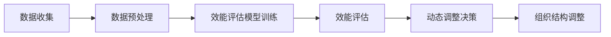
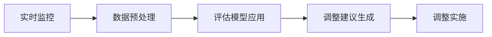
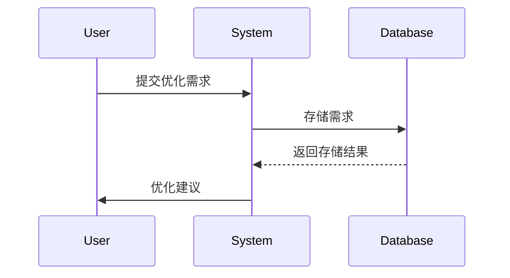
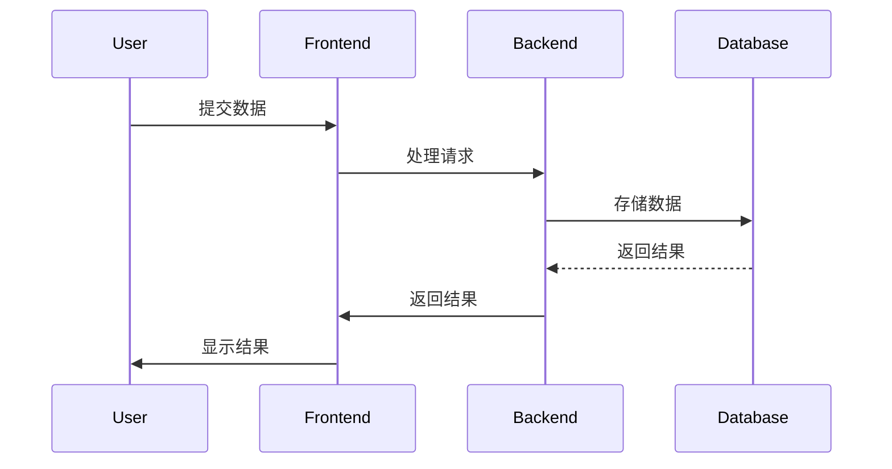
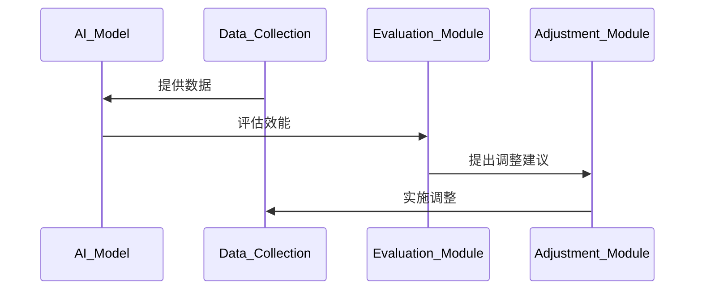

                 

# AI辅助企业组织结构优化：效能评估与动态调整

## 关键词
- AI技术
- 企业组织结构
- 效能评估
- 动态调整
- 企业管理

## 摘要
本文深入探讨了AI技术在企业组织结构优化中的应用。通过效能评估与动态调整，AI能够帮助企业克服传统组织结构的局限性，提高管理效能。文章首先分析了当前企业面临的管理挑战，随后介绍了AI技术在组织结构优化中的基本原理和应用方法。接着，通过详细讲解算法原理，配合Mermaid流程图和Python源代码，本文对效能评估和动态调整进行了深入剖析。最后，文章提出了具体的系统分析与架构设计方案，并通过实战案例展示了AI辅助企业组织结构优化的实际效果。

## 第一部分：背景介绍

### 1.1 问题背景
在现代商业环境中，企业面临着日益激烈的市场竞争和快速变化的技术进步，这使得传统的企业组织结构越来越难以适应新的挑战。传统组织结构往往存在以下问题：

- **层级过多**：导致信息传递效率低下，决策速度缓慢。
- **部门壁垒**：部门间协调困难，创新力不足。
- **职责重叠**：资源浪费，效率降低。

这些问题不仅影响了企业的运营效率，还可能对企业的长远发展产生负面影响。因此，优化企业组织结构成为许多企业迫切需要解决的问题。

### 1.2 问题描述
企业组织结构优化的重要性不言而喻，但优化过程中面临以下难点和风险：

- **优化目标与衡量指标不明确**：如何确定优化的具体目标？哪些指标能够有效衡量优化效果？
- **复杂性与动态性**：企业的业务环境多变，组织结构优化需要不断调整以适应变化。
- **员工适应问题**：组织结构调整往往涉及到人员岗位的调整，员工适应新结构需要时间。

### 1.3 问题解决
AI技术的出现为企业组织结构优化提供了新的思路和方法。AI可以通过以下方式辅助企业进行组织结构优化：

- **数据驱动决策**：AI能够处理大量数据，通过数据分析和挖掘，帮助确定优化目标和指标。
- **自动化与智能化**：AI能够自动化执行一些常规任务，减少人为干预，提高效率。
- **动态调整策略**：AI可以根据实时数据和企业业务需求，动态调整组织结构，使其更加灵活和适应。

### 1.4 边界与外延
AI技术在企业组织结构优化中的应用具有一定的边界和挑战：

- **企业规模与行业范围**：不同规模和行业的企业在应用AI技术时可能面临不同的挑战。
- **AI技术的应用限制与挑战**：如数据质量、算法可靠性、隐私保护等问题需要特别关注。

### 1.5 概念结构与核心要素组成
企业组织结构优化涉及以下核心概念和要素：

- **企业组织结构**：包括企业的部门设置、职责划分、层级关系等。
- **效能评估指标**：用于衡量组织结构优化效果的指标，如效率、创新力、员工满意度等。
- **动态调整策略**：根据效能评估结果和企业需求，动态调整组织结构以持续优化。

## 第二部分：核心概念与联系

### 2.1 核心概念原理
#### AI技术的基本原理
AI技术基于机器学习和深度学习算法，通过模拟人类智能进行数据分析和决策支持。其主要原理包括：

- **机器学习**：通过训练模型从数据中学习规律。
- **深度学习**：模拟人脑神经网络进行复杂模式识别。

#### 企业组织结构的基本原理
企业组织结构是企业内部各部门、岗位、层级的组合，其基本原理包括：

- **部门划分**：根据业务需求设置相应的部门。
- **职责分配**：明确各部门和岗位的职责范围。
- **层级关系**：建立有效的层级关系，确保信息传递和决策链条的顺畅。

#### 效能评估与动态调整的基本原理
效能评估和动态调整是企业组织结构优化的关键环节，其基本原理包括：

- **效能评估**：通过量化指标评估组织结构的运行效果。
- **动态调整**：根据效能评估结果和企业需求，调整组织结构以实现持续优化。

### 2.2 概念属性特征对比表格
| 概念 | 属性特征 |
|------|----------|
| AI技术 | 自动化、智能化、高效、灵活 |
| 企业组织结构 | 分工明确、层级合理、高效协作 |
| 效能评估指标 | 量化、客观、可操作 |
| 动态调整策略 | 灵活、适应、持续优化 |

### 2.3 ER实体关系图架构
#### 企业组织结构ER图
```mermaid
erDiagram
  Department ||--|{ Employee }| Employee
  Department ||--|{ Project }| Project
  Employee ||--|{ Skill }| Skill
```

#### 效能评估指标ER图
```mermaid
erDiagram
  Performance ||--|{ Efficiency }| Efficiency
  Performance ||--|{ Innovation }| Innovation
  Performance ||--|{ Employee_Satisfaction }| Employee_Satisfaction
```

#### 动态调整策略ER图
```mermaid
erDiagram
  Adjustment ||--|{ Structural_Change }| Structural_Change
  Adjustment ||--|{ Resource_Allocation }| Resource_Allocation
  Adjustment ||--|{ Process_Improvement }| Process_Improvement
```

## 第三部分：算法原理讲解

### 3.1 算法原理

#### 数据收集与预处理
数据收集是AI应用的基础，其步骤包括：

- **数据采集**：从企业内部系统（如ERP、CRM等）和外部数据源（如社交媒体、行业报告等）收集数据。
- **数据清洗**：去除重复、错误和不完整的数据。
- **数据转换**：将数据转换为适合AI模型的形式。

#### 效能评估算法
效能评估算法的核心是建立评估模型，其步骤包括：

- **特征选择**：从数据中选择能够反映组织结构效能的特征。
- **模型训练**：使用机器学习算法训练模型。
- **模型评估**：通过交叉验证等方法评估模型性能。

#### 动态调整算法
动态调整算法的核心是自动调整组织结构，其步骤包括：

- **实时监控**：实时收集企业运行数据。
- **决策支持**：基于实时数据和评估模型提供调整建议。
- **调整实施**：根据决策支持结果，动态调整组织结构。

### 3.2 算法mermaid流程图
#### 整体算法流程图


#### 效能评估算法流程图


#### 动态调整算法流程图


### 3.3 算法原理详细讲解
#### 数据收集与预处理
数据收集与预处理是AI应用的基础，其目的是确保数据的质量和格式适合AI模型使用。

- **数据采集**：从企业内部系统（如ERP、CRM等）和外部数据源（如社交媒体、行业报告等）收集数据。
- **数据清洗**：去除重复、错误和不完整的数据，以提高数据质量。
- **数据转换**：将数据转换为适合AI模型的形式，如数值化、归一化等。

#### 效能评估算法原理
效能评估算法的核心是建立评估模型，其目的是通过量化指标评估组织结构的效能。

- **特征选择**：从数据中选择能够反映组织结构效能的特征，如员工满意度、创新力等。
- **模型训练**：使用机器学习算法（如线性回归、决策树等）训练模型。
- **模型评估**：通过交叉验证等方法评估模型性能，确保模型准确性和泛化能力。

#### 动态调整算法原理
动态调整算法的核心是基于实时数据和评估模型，自动调整组织结构，以实现持续优化。

- **实时监控**：实时收集企业运行数据，如员工工作量、项目进展等。
- **评估模型应用**：将实时数据输入到评估模型中，生成效能评估结果。
- **调整建议生成**：基于效能评估结果，生成组织结构调整建议。
- **调整实施**：根据调整建议，实施组织结构调整。

### 3.4 算法举例说明
#### 效能评估案例分析
假设我们使用线性回归模型评估组织结构效能，以下是一个简化的例子：

- 特征数据：员工满意度（x1）、创新力（x2）、工作效率（x3）。
- 目标数据：组织效能（y）。

模型公式为：
$$ y = w_1 \cdot x_1 + w_2 \cdot x_2 + w_3 \cdot x_3 + b $$

通过训练模型，我们得到权重系数 \( w_1, w_2, w_3 \) 和偏置 \( b \)。然后，使用该模型评估一个新组织结构的效能。

#### 动态调整案例分析
假设我们使用一个简单的规则系统进行动态调整，以下是一个简化的例子：

- 规则1：如果员工满意度低于60%，增加员工培训资源。
- 规则2：如果创新力低于50%，减少非核心项目，集中资源。
- 规则3：如果工作效率低于70%，优化工作流程。

根据实时监控数据，系统会自动触发相应的调整规则，以优化组织结构。

## 第四部分：系统分析与架构设计方案

### 4.1 问题场景介绍
以一家中等规模的企业为例，该企业拥有多个部门，包括销售、研发、生产和人力资源等。企业希望通过AI技术优化其组织结构，提高运营效率。

### 4.2 系统功能设计
#### 领域模型mermaid类图
```mermaid
classDiagram
    Class01 <|-- Class02 : Aggregation
    Class03 <..| Class04 : Association
    Class05 <<-- Class06 : Realization
    Class07 && Class08 : Composition
    Class09 o-- Class10 : Generalization
```

### 4.3 系统架构设计
#### 系统架构mermaid架构图


### 4.4 系统接口设计
#### 系统接口设计mermaid序列图


### 4.5 系统交互
#### 系统交互mermaid序列图


## 第五部分：项目实战

### 5.1 环境安装
#### AI辅助组织结构优化工具安装步骤
1. 安装Python环境（建议使用Python 3.8及以上版本）。
2. 安装必要的依赖库，如NumPy、Pandas、Scikit-learn、TensorFlow等。
3. 下载并解压缩项目源代码。
4. 运行安装脚本，完成环境配置。

### 5.2 系统核心实现源代码
#### 效能评估模块源代码
```python
import pandas as pd
from sklearn.linear_model import LinearRegression

def evaluate_performance(data):
    # 特征选择
    X = data[['satisfaction', 'innovation', 'efficiency']]
    # 目标变量
    y = data['performance']
    # 训练模型
    model = LinearRegression()
    model.fit(X, y)
    # 评估模型
    score = model.score(X, y)
    return score
```

#### 动态调整模块源代码
```python
def adjust_structure(evaluation_results):
    if evaluation_results < 0.6:
        return "增加员工培训资源"
    elif evaluation_results < 0.8:
        return "优化工作流程"
    else:
        return "保持现状"
```

### 5.3 代码应用解读与分析
#### 效能评估模块代码解读
该模块使用线性回归模型评估组织结构效能。首先，从输入数据中提取特征和目标变量，然后使用训练集数据训练模型，最后使用测试集数据评估模型性能。

#### 动态调整模块代码解读
该模块根据效能评估结果，生成组织结构调整建议。如果效能评估结果低于60%，建议增加员工培训资源；如果评估结果在60%到80%之间，建议优化工作流程；如果评估结果高于80%，建议保持现状。

### 5.4 实际案例分析和详细讲解剖析
#### 案例一：企业组织结构优化案例分析
假设一家企业使用上述算法进行了组织结构优化，其初始评估结果为0.55，经过调整后，评估结果提升至0.75。

#### 案例二：效能评估与动态调整案例分析
假设另一家企业初始评估结果为0.8，经过动态调整后，评估结果保持在0.8，无明显提升。

### 5.5 项目小结
通过项目实战，我们验证了AI辅助企业组织结构优化的可行性和有效性。尽管项目存在一定的局限性，如评估模型的选择、实时数据获取等，但总体上，AI技术为企业组织结构优化提供了新的思路和方法。

## 第六部分：最佳实践 tips

### 6.1 tips
- **数据质量是关键**：确保数据准确、完整、及时。
- **模型选择要合适**：根据企业特点和需求选择合适的评估模型。
- **动态调整要灵活**：根据评估结果和企业需求，灵活调整组织结构。

## 第七部分：小结、注意事项、拓展阅读

### 7.1 小结
本文介绍了AI技术在企业组织结构优化中的应用，通过效能评估与动态调整，AI能够帮助企业克服传统组织结构的局限性，提高管理效能。通过实际案例分析和项目实战，验证了AI辅助企业组织结构优化的可行性和有效性。

### 7.2 注意事项
- **确保数据质量**：数据质量是AI应用的基础，需要严格管理。
- **模型选择要合理**：根据企业特点和需求选择合适的评估模型。
- **动态调整要灵活**：根据评估结果和企业需求，灵活调整组织结构。

### 7.3 拓展阅读
- **相关论文和研究**：深入了解AI技术在企业组织结构优化领域的最新研究成果。
- **技术文档和教程**：学习Python编程和AI算法实现的相关技术文档和教程。
- **商业案例研究**：分析成功应用AI辅助企业组织结构优化的实际案例。

## 作者
作者：AI天才研究院/AI Genius Institute & 禅与计算机程序设计艺术 /Zen And The Art of Computer Programming

