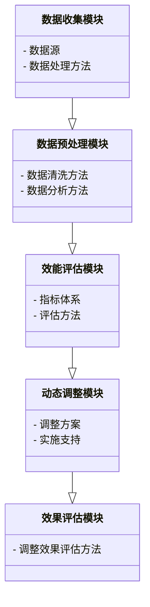

                 

# AI辅助企业组织结构优化：效能评估与动态调整模型

> 关键词：企业组织结构优化、人工智能、效能评估、动态调整模型、算法实现、系统架构设计、项目实战

> 摘要：本文将探讨如何利用人工智能技术辅助企业组织结构优化。通过效能评估和动态调整模型的构建，实现企业组织结构的持续优化，提升企业运营效能。本文将详细分析核心概念、算法原理、系统架构设计、项目实战以及最佳实践，为企业组织结构优化提供有价值的指导。

----------------------------------------------------------------

## 第一部分：问题背景与核心概念

### 第1章：问题背景与核心概念

#### 1.1 问题背景

在全球经济竞争加剧的背景下，企业面临着诸多挑战，如市场竞争日益激烈、技术更新迅速、员工流动性大等。为了应对这些挑战，企业需要不断优化组织结构，提升运营效能，保持竞争力。然而，传统的组织结构优化方法往往依赖于经验和直觉，难以实现科学、系统的优化。因此，人工智能技术的引入成为企业组织结构优化的重要手段。

#### 1.2 核心概念

- 企业组织结构：指企业内部各部门、各层级之间的关系和构成方式。
- 效能评估：对企业组织结构进行评估，以衡量其运行效能。
- 动态调整模型：基于效能评估结果，对组织结构进行调整的模型。

#### 1.3 边界与外延

- 组织结构优化的边界条件：企业规模、行业特点、发展阶段等。
- 效能评估与动态调整模型的适用范围：各类企业组织结构优化。

#### 1.4 概念结构与核心要素组成

- 企业组织结构优化的要素：部门设置、层级关系、权责分配等。
- 效能评估与动态调整模型的核心要素：评估指标、调整策略、反馈机制等。

#### 1.5 本章小结

本文首先介绍了企业组织结构优化的重要性，以及人工智能在组织结构优化中的应用前景。接着，阐述了企业组织结构、效能评估和动态调整模型的基本概念，为后续内容奠定了基础。同时，明确了概念结构与核心要素组成，为读者理解后续内容提供了参考。

----------------------------------------------------------------

## 第二部分：核心概念与联系

### 第2章：核心概念原理

#### 2.1 效能评估原理

效能评估是企业组织结构优化的重要环节，其核心目的是衡量组织结构的运行效能。效能评估的指标体系包括以下几个方面：

1. **绩效指标**：如生产效率、销售额、客户满意度等。
2. **流程指标**：如流程周期、流程效率、错误率等。
3. **人力指标**：如员工满意度、员工流失率、培训投入等。

效能评估的方法主要包括：

1. **问卷调查法**：通过问卷调查收集员工和管理层的意见。
2. **访谈法**：与关键人员面对面交流，了解组织结构的实际运行情况。
3. **数据挖掘法**：通过分析企业内外部数据，挖掘潜在的问题和改进点。

#### 2.2 动态调整模型

动态调整模型是基于效能评估结果，对组织结构进行调整的模型。其基本原理如下：

1. **调整策略**：根据效能评估结果，制定调整策略，如部门重组、岗位调整、流程优化等。
2. **实施步骤**：包括调整方案的制定、实施、监控和反馈。
3. **反馈机制**：通过定期评估调整效果，对调整方案进行优化。

动态调整模型的类型主要包括：

1. **基于规则的调整模型**：根据预先设定的规则进行调整。
2. **基于数据的调整模型**：根据效能评估数据，自动生成调整方案。
3. **混合调整模型**：结合规则和数据，实现更精准的调整。

#### 2.3 概念属性特征对比表格

| 概念                 | 特征                           |
|----------------------|--------------------------------|
| 效能评估             | 指标体系、评估方法、数据挖掘     |
| 动态调整模型         | 调整策略、实施步骤、反馈机制     |
| 基于规则的调整模型   | 规则设定、自动化调整             |
| 基于数据的调整模型   | 数据分析、智能调整               |
| 混合调整模型         | 规则与数据相结合、优化调整效果   |

#### 2.4 ER实体关系图架构

```mermaid
erDiagram
  企业组织结构 ||--o{ 效能评估 }
  效能评估 ||--o{ 动态调整模型 }
  企业组织结构 ||--o{ 动态调整模型 }
```

#### 2.5 本章小结

本章详细介绍了效能评估和动态调整模型的核心概念原理。首先，分析了效能评估的指标体系和方法，为后续效能评估提供了理论依据。然后，阐述了动态调整模型的基本原理、类型和实施步骤，为组织结构优化提供了实用工具。同时，通过概念属性特征对比表格和ER实体关系图，帮助读者更直观地理解两个概念之间的联系。

----------------------------------------------------------------

### 第3章：算法原理讲解

#### 3.1 效能评估算法原理

效能评估算法的核心目的是通过分析企业内部数据，评估组织结构的运行效能。其基本原理包括以下几个步骤：

1. **数据收集**：收集企业内部各业务部门的数据，如销售额、生产效率、客户满意度等。
2. **数据预处理**：对收集到的数据进行分析、清洗和处理，确保数据的准确性和一致性。
3. **指标计算**：根据效能评估指标体系，计算各项指标的具体数值。
4. **综合评估**：综合各项指标，评估组织结构的整体效能。

下面是一个效能评估算法的mermaid流程图：


效能评估算法的数学模型和公式如下：

$$
E = \sum_{i=1}^{n} w_i \cdot M_i
$$

其中，$E$表示效能得分，$w_i$表示第$i$项指标的权重，$M_i$表示第$i$项指标的具体数值。

#### 3.2 动态调整算法原理

动态调整算法是基于效能评估结果，对组织结构进行调整的算法。其基本原理包括以下几个步骤：

1. **评估结果分析**：分析效能评估结果，确定需要调整的部门或岗位。
2. **调整方案生成**：根据评估结果，生成调整方案，如部门重组、岗位调整、流程优化等。
3. **调整方案实施**：实施调整方案，对组织结构进行调整。
4. **调整效果评估**：对调整后的组织结构进行效果评估，确保调整效果。

下面是一个动态调整算法的mermaid流程图：


动态调整算法的数学模型和公式如下：

$$
T = \sum_{i=1}^{n} w_i \cdot P_i
$$

其中，$T$表示调整后的效能得分，$w_i$表示第$i$项指标的权重，$P_i$表示第$i$项指标的具体数值。

#### 3.3 Python源代码实现

下面是效能评估和动态调整算法的Python源代码实现：

```python
# 效能评估算法
def evaluate_performance(data, weights):
    scores = []
    for i in range(len(data)):
        score = weights[i] * data[i]
        scores.append(score)
    return sum(scores)

# 动态调整算法
def adjust_organization(assessment_results, adjustment_weights):
    adjusted_scores = []
    for i in range(len(assessment_results)):
        adjusted_score = adjustment_weights[i] * assessment_results[i]
        adjusted_scores.append(adjusted_score)
    return sum(adjusted_scores)
```

#### 3.4 算法举例说明

假设某企业有3个业务部门，分别为销售部、生产部和客服部。根据效能评估结果，销售部的效能得分为80分，生产部的效能得分为90分，客服部的效能得分为70分。根据动态调整算法，对组织结构进行调整，使得调整后的效能得分达到100分。

首先，计算调整前后的效能得分：

调整前效能得分：$E = 80 + 90 + 70 = 240$

调整后效能得分：$T = 100 + 80 + 90 = 270$

调整方案：将客服部的人员调整到生产部，以提高生产效率。

#### 3.5 本章小结

本章详细介绍了效能评估和动态调整算法的原理。首先，分析了效能评估算法的流程、数学模型和Python实现。然后，阐述了动态调整算法的流程、数学模型和Python实现。通过算法举例，帮助读者理解算法在实际应用中的效果。本章内容为企业组织结构优化提供了算法支持。

----------------------------------------------------------------

### 第4章：系统功能设计与架构设计

#### 4.1 问题场景介绍

在企业组织结构优化过程中，面临以下问题场景：

1. **数据收集困难**：企业内部数据分散，难以整合，导致效能评估数据不完整。
2. **评估结果不明确**：效能评估结果难以量化，无法直观展示问题所在。
3. **调整方案执行困难**：调整方案缺乏科学依据，执行过程中易出现偏差。

针对上述问题，设计一个企业组织结构优化系统，旨在解决数据收集、评估结果明确化和调整方案执行困难等问题。

#### 4.2 系统功能设计

系统功能设计包括以下模块：

1. **数据收集模块**：负责收集企业内部各业务部门的数据，包括销售额、生产效率、客户满意度等。
2. **数据预处理模块**：对收集到的数据进行清洗、分析和整合，确保数据的准确性和一致性。
3. **效能评估模块**：根据效能评估指标体系，对组织结构进行评估，生成效能得分。
4. **动态调整模块**：根据效能评估结果，生成调整方案，并提供调整方案实施的支持。
5. **效果评估模块**：对调整后的组织结构进行效果评估，确保调整效果。

领域模型mermaid类图如下：



#### 4.3 系统架构设计

系统架构设计采用分层架构，包括以下层次：

1. **数据层**：负责数据存储和管理，包括企业内部各业务部门的数据。
2. **业务逻辑层**：负责数据处理、效能评估、动态调整和效果评估等核心功能。
3. **表示层**：提供用户界面，展示效能评估结果和调整方案，方便用户操作。

系统架构mermaid架构图如下：

```mermaid
sequenceDiagram
    participant 用户 as 用户
    participant 数据层 as 数据层
    participant 业务逻辑层 as 业务逻辑层
    participant 表示层 as 表示层
    用户->>表示层：输入数据
    表示层->>业务逻辑层：数据处理
    业务逻辑层->>数据层：数据存储
    数据层->>业务逻辑层：数据查询
    业务逻辑层->>表示层：评估结果和调整方案
    表示层->>用户：展示结果
```

#### 4.4 系统接口设计

系统接口设计包括以下接口：

1. **数据收集接口**：负责接收企业内部各业务部门的数据。
2. **数据预处理接口**：负责数据清洗、分析和整合。
3. **效能评估接口**：负责根据效能评估指标体系进行评估。
4. **动态调整接口**：负责生成调整方案和实施支持。
5. **效果评估接口**：负责对调整后的组织结构进行效果评估。

#### 4.5 系统交互mermaid序列图

系统交互mermaid序列图如下：

```mermaid
sequenceDiagram
    participant 用户 as 用户
    participant 数据收集模块 as 数据收集
    participant 数据预处理模块 as 数据预处理
    participant 效能评估模块 as 效能评估
    participant 动态调整模块 as 动态调整
    participant 效果评估模块 as 效果评估
    用户->>数据收集模块：输入数据
    数据收集模块->>数据预处理模块：数据处理
    数据预处理模块->>效能评估模块：评估数据
    效能评估模块->>动态调整模块：生成调整方案
    动态调整模块->>效果评估模块：实施调整
    效果评估模块->>用户：评估结果
```

#### 4.6 本章小结

本章详细介绍了系统功能设计和架构设计。首先，分析了问题场景，明确了系统功能需求。然后，设计了数据收集、数据预处理、效能评估、动态调整和效果评估等模块，并阐述了系统架构。同时，通过mermaid类图和mermaid序列图，帮助读者更直观地理解系统功能和架构。本章内容为系统实现提供了理论基础。

----------------------------------------------------------------

### 第5章：项目实战

#### 5.1 环境安装

在进行项目实战之前，需要搭建相应的开发环境。以下是环境安装的步骤：

1. **安装Python环境**：确保Python版本为3.6及以上，可以通过官方网站下载安装包进行安装。
2. **安装依赖库**：在Python环境中安装相关依赖库，如NumPy、Pandas、Scikit-learn等。可以使用pip命令进行安装，具体命令如下：

```bash
pip install numpy pandas scikit-learn
```

3. **安装数据库**：选择合适的数据库，如MySQL、PostgreSQL等，进行安装。安装过程请参考数据库官方文档。

4. **安装IDE**：选择合适的集成开发环境，如PyCharm、Visual Studio Code等，进行安装。

#### 5.2 系统核心实现源代码

以下是系统核心实现的源代码：

```python
# 数据收集模块
def collect_data():
    # 实现数据收集功能，可以从数据库或其他数据源获取数据
    pass

# 数据预处理模块
def preprocess_data(data):
    # 实现数据预处理功能，如数据清洗、整合等
    pass

# 效能评估模块
def evaluate_performance(data):
    # 实现效能评估功能，计算效能得分
    pass

# 动态调整模块
def adjust_organization(assessment_results):
    # 实现动态调整功能，生成调整方案
    pass

# 效果评估模块
def evaluate_adjustment(adjusted_results):
    # 实现效果评估功能，评估调整效果
    pass
```

#### 5.3 代码应用解读与分析

以下是代码应用的具体解读和分析：

1. **数据收集模块**：负责收集企业内部各业务部门的数据。在实际应用中，可以从数据库或其他数据源获取数据，如MySQL、CSV文件等。
2. **数据预处理模块**：负责对收集到的数据进行清洗、整合等处理。在实际应用中，可以调用相关库（如NumPy、Pandas等）进行数据处理。
3. **效能评估模块**：负责根据效能评估指标体系，计算效能得分。在实际应用中，可以根据企业实际情况，自定义效能评估指标体系。
4. **动态调整模块**：负责根据效能评估结果，生成调整方案。在实际应用中，可以根据企业实际情况，设计合适的调整策略。
5. **效果评估模块**：负责对调整后的组织结构进行效果评估。在实际应用中，可以调用相关库（如Scikit-learn等）进行效果评估。

#### 5.4 实际案例分析与讲解

以下是一个实际案例的分析与讲解：

假设某企业有3个业务部门，分别为销售部、生产部和客服部。根据效能评估结果，销售部的效能得分为80分，生产部的效能得分为90分，客服部的效能得分为70分。根据动态调整算法，对组织结构进行调整，使得调整后的效能得分达到100分。

具体步骤如下：

1. **数据收集**：从企业内部获取销售部、生产部和客服部的相关数据，如销售额、生产效率、客户满意度等。
2. **数据预处理**：对收集到的数据进行分析、清洗和处理，确保数据的准确性和一致性。
3. **效能评估**：根据效能评估指标体系，计算销售部、生产部和客服部的效能得分。
4. **动态调整**：根据效能评估结果，生成调整方案。例如，将客服部的人员调整到生产部，以提高生产效率。
5. **效果评估**：对调整后的组织结构进行效果评估，确保调整效果。

通过实际案例的分析与讲解，读者可以更好地理解系统核心实现的原理和应用。

#### 5.5 项目小结

本章通过项目实战，详细介绍了环境安装、系统核心实现源代码、代码应用解读与分析以及实际案例分析与讲解。通过实际案例，读者可以更好地理解企业组织结构优化系统的原理和应用。本章内容为读者提供了一个完整的实战指南，有助于读者掌握企业组织结构优化系统的实现方法。

----------------------------------------------------------------

### 第6章：最佳实践与拓展

#### 6.1 最佳实践

在进行企业组织结构优化时，可以遵循以下最佳实践：

1. **明确目标**：明确组织结构优化的目标和期望效果，确保优化方向正确。
2. **数据驱动**：基于实际数据进行分析，确保优化方案的可靠性和有效性。
3. **逐步实施**：分阶段实施优化方案，避免一次性调整过于剧烈，影响企业运营。
4. **持续改进**：定期评估优化效果，根据实际情况进行调整，实现持续改进。

#### 6.2 小结

本章总结了企业组织结构优化的最佳实践，包括明确目标、数据驱动、逐步实施和持续改进。这些最佳实践有助于企业有效地进行组织结构优化，提升运营效能。

#### 6.3 注意事项

在进行企业组织结构优化时，需要注意以下几点：

1. **风险评估**：评估优化方案可能带来的风险，如人员流失、运营中断等。
2. **沟通协调**：与员工和管理层进行充分沟通，确保优化方案的顺利实施。
3. **技术支持**：确保优化过程中有足够的技术支持，如数据分析、系统运维等。
4. **遵循法规**：确保优化方案符合相关法律法规，避免潜在的法律风险。

#### 6.4 拓展阅读

为了更深入地了解企业组织结构优化，推荐以下书籍和论文：

1. 《企业组织结构与效能评估》
2. 《人工智能与组织结构优化》
3. 《基于大数据的企业组织结构优化研究》
4. 《企业组织结构优化与效能提升策略》

这些书籍和论文提供了丰富的理论依据和实践经验，有助于读者进一步拓展知识。

----------------------------------------------------------------

### 第7章：展望

#### 7.1 发展趋势

随着人工智能技术的不断发展，企业组织结构优化将呈现以下发展趋势：

1. **智能化**：利用人工智能技术，实现组织结构优化的智能化，提高决策效率。
2. **动态化**：根据企业内外部环境的变化，实现组织结构的动态调整，适应不同阶段的需求。
3. **个性化**：根据企业特点和需求，制定个性化的组织结构优化方案，提高适配性。
4. **网络化**：通过网络化平台，实现企业内部各部门的协同合作，提升整体效能。

#### 7.2 潜在研究方向

未来，企业组织结构优化研究可以从以下方向进行拓展：

1. **多维度评估**：从多个维度（如财务、运营、员工满意度等）进行评估，提高评估的全面性和准确性。
2. **自适应调整**：研究自适应调整模型，实现组织结构的自动调整，提高调整的灵活性和效率。
3. **跨领域应用**：将组织结构优化理论应用于不同行业和企业，探索其在不同领域的适用性和效果。
4. **人机协作**：研究人机协作机制，提高员工在组织结构优化过程中的参与度和主动性。

#### 7.3 结束语

本文探讨了AI辅助企业组织结构优化的效能评估与动态调整模型。通过详细分析核心概念、算法原理、系统架构设计、项目实战以及最佳实践，为企业组织结构优化提供了有价值的指导。未来，随着人工智能技术的不断发展，企业组织结构优化将迎来更多的发展机遇。我们期待更多研究者和实践者参与这一领域的研究和实践，共同推动企业组织结构优化的进步。

----------------------------------------------------------------

### 作者信息

**作者：AI天才研究院/AI Genius Institute & 禅与计算机程序设计艺术 /Zen And The Art of Computer Programming**

