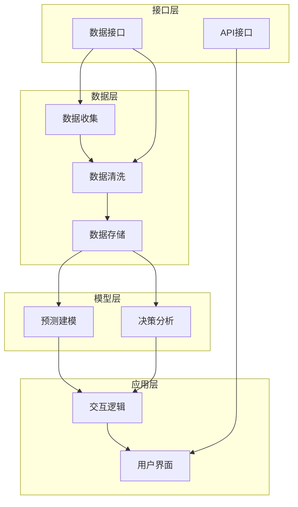
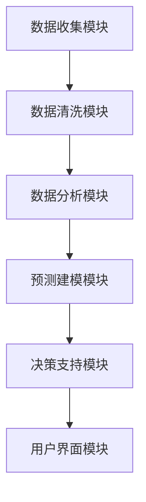

                 

# AI辅助企业财务规划与预算管理：精准预测与分配

## 关键词
- 人工智能，财务规划，预算管理，精准预测，资源分配

## 摘要
本文旨在探讨人工智能（AI）在企业财务规划与预算管理中的广泛应用和潜在价值。通过分析AI技术的核心原理，以及其在财务预测和资源分配方面的应用，本文提出了一套系统化的方法，帮助企业实现更精准的财务规划和高效的预算管理。本文不仅涵盖了AI在财务预测中的算法原理和实现步骤，还详细介绍了AI辅助预算编制的流程和挑战，并探讨了AI辅助财务决策系统及风险管理中的应用。通过实际案例的分析和总结，本文为企业在财务领域的数字化转型提供了有益的启示。

## 目录大纲

### 第一部分：背景与概述

#### 第1章 问题背景与概念解析
- **1.1 财务规划与预算管理的重要性**
  - **1.1.1 企业财务规划的目标与挑战**
  - **1.1.2 预算管理的关键问题**
  - **1.1.3 AI技术在财务领域的应用现状**
- **1.2 AI辅助财务规划与预算管理的概念**
  - **1.2.1 AI的基本概念与主要技术**
  - **1.2.2 AI辅助财务规划与预算管理的优势**

### 第二部分：AI技术基础

#### 第2章 AI基础理论
- **2.1 机器学习的基本概念**
  - **2.1.1 机器学习的定义与分类**
  - **2.1.2 监督学习、无监督学习与强化学习**
  - **2.1.3 常见机器学习算法介绍**
- **2.2 深度学习与神经网络**
  - **2.2.1 深度学习的原理与架构**
  - **2.2.2 神经网络的核心概念**
  - **2.2.3 常见的深度学习框架**

#### 第3章 数据分析与处理
- **3.1 数据分析的基本方法**
  - **3.1.1 数据采集与清洗**
  - **3.1.2 数据探索与分析**
  - **3.1.3 数据可视化**
- **3.2 数据库与数据仓库**
  - **3.2.1 数据库的基本概念**
  - **3.2.2 数据仓库的架构与功能**
  - **3.2.3 数据库与数据仓库的比较**

### 第三部分：AI辅助财务规划

#### 第4章 AI在财务预测中的应用
- **4.1 财务预测的基本原理**
  - **4.1.1 财务预测的概念与类型**
  - **4.1.2 财务预测的挑战与问题**
  - **4.1.3 AI在财务预测中的优势**
- **4.2 基于机器学习的财务预测模型**
  - **4.2.1 回归模型在财务预测中的应用**
  - **4.2.2 时间序列分析模型**
  - **4.2.3 其他机器学习模型的应用**

#### 第5章 AI辅助预算编制
- **5.1 预算编制的基本流程**
  - **5.1.1 预算编制的目标与原则**
  - **5.1.2 预算编制的步骤与方法**
  - **5.1.3 预算编制的难点与挑战**
- **5.2 AI技术在预算编制中的应用**
  - **5.2.1 数据驱动的预算编制**
  - **5.2.2 AI算法在预算优化中的应用**
  - **5.2.3 预算编制过程中的挑战与解决方案**

### 第四部分：AI辅助财务决策

#### 第6章 AI辅助财务决策系统
- **6.1 财务决策的基本概念**
  - **6.1.1 财务决策的类型与模型**
  - **6.1.2 财务决策的影响因素**
  - **6.1.3 财务决策的目标与原则**
- **6.2 AI辅助财务决策系统设计**
  - **6.2.1 系统的需求分析**
  - **6.2.2 系统架构设计**
  - **6.2.3 系统功能模块设计**

#### 第7章 AI在财务风险管理中的应用
- **7.1 财务风险管理的概念与重要性**
  - **7.1.1 财务风险的定义与分类**
  - **7.1.2 财务风险管理的目标与方法**
  - **7.1.3 财务风险管理的挑战与问题**
- **7.2 AI技术在财务风险管理中的应用**
  - **7.2.1 数据驱动的财务风险评估**
  - **7.2.2 AI算法在风险管理中的应用**
  - **7.2.3 风险管理中的挑战与解决方案**

### 第五部分：总结与展望
- **8.1 AI辅助财务规划的总结**
- **8.2 未来发展趋势与挑战**
- **8.3 结论与建议**

### 参考文献

### 附录

## 第1章 问题背景与概念解析

### 1.1 财务规划与预算管理的重要性

财务规划与预算管理是企业运营过程中至关重要的一环。财务规划是指企业根据其战略目标，对未来一定时期的财务状况进行预测和规划，旨在确保企业的财务资源得到合理配置和有效利用。预算管理则是财务规划的具体实施手段，通过对企业各项财务活动的预算编制、执行和监控，实现财务目标。

#### 1.1.1 企业财务规划的目标与挑战

企业财务规划的主要目标是确保企业的财务健康和可持续发展。具体来说，包括以下几个方面：

1. **资金筹集**：企业需要合理规划资金来源，确保有足够的资金支持业务运营和发展需求。
2. **资金使用**：合理分配资金，确保资金投入的回报率最大化，同时避免过度投资或资金浪费。
3. **盈利能力**：提高企业的盈利能力，确保企业能够实现预期的利润目标。
4. **风险管理**：识别和评估潜在的风险，并采取相应的措施进行风险控制和转移。

然而，财务规划过程中面临着诸多挑战：

1. **信息不对称**：企业内部各部门之间的信息不对称可能导致财务规划不准确。
2. **数据质量**：财务数据的质量直接影响到财务规划的有效性，不准确或缺失的数据会导致预测结果偏差。
3. **市场变化**：市场环境的不确定性给财务规划带来了很大的挑战，企业需要具备快速调整财务规划的能力。
4. **政策法规**：不断变化的政策法规也可能影响企业的财务规划。

#### 1.1.2 预算管理的关键问题

预算管理是财务规划的核心环节，其关键问题包括：

1. **预算编制**：预算编制的准确性直接影响到预算管理的有效性。企业需要根据财务规划的目标，制定合理的预算，并确保预算的可行性。
2. **预算执行**：预算执行是预算管理的关键环节，企业需要确保各项财务活动的执行符合预算要求，同时及时发现和纠正偏差。
3. **预算监控**：预算监控是保证预算执行效果的重要手段，企业需要建立有效的监控机制，对预算执行过程进行实时监控，及时发现和解决问题。
4. **预算调整**：市场环境的变化和内部管理需求可能导致预算的调整，企业需要根据实际情况对预算进行及时调整。

#### 1.1.3 AI技术在财务领域的应用现状

随着人工智能技术的发展，AI在财务领域的应用逐渐增多，并在财务规划与预算管理中发挥着重要作用：

1. **数据分析和预测**：AI技术可以通过对大量历史数据的分析，帮助企业预测未来的财务状况，提供更加准确和可靠的财务规划。
2. **自动化预算编制**：AI技术可以自动化处理财务数据，快速编制预算，提高预算编制的效率和准确性。
3. **风险监控和管理**：AI技术可以对财务数据进行实时监控，识别潜在的风险，并提供相应的管理策略。
4. **智能决策支持**：AI技术可以帮助企业进行复杂决策，提供基于数据和算法支持的决策建议，提高决策的科学性和准确性。

#### 1.2 AI辅助财务规划与预算管理的概念

AI辅助财务规划与预算管理是指利用人工智能技术，对企业财务数据进行处理、分析和预测，辅助企业制定更加精准的财务规划，实现高效的预算管理。

1. **数据处理**：AI技术可以自动收集、清洗和整理企业财务数据，为后续分析提供高质量的数据支持。
2. **数据分析**：通过机器学习算法，对财务数据进行分析，识别数据中的规律和趋势，为企业提供决策依据。
3. **预测**：利用时间序列分析、回归分析等算法，对未来的财务状况进行预测，帮助制定财务规划。
4. **自动化管理**：AI技术可以实现财务数据的自动化处理和预算编制，提高管理效率和准确性。

#### 1.2.1 AI的基本概念与主要技术

AI是指人工智能，是计算机科学的一个分支，旨在使计算机能够模拟人类智能，执行复杂的任务。AI的主要技术包括：

1. **机器学习**：机器学习是一种让计算机通过数据学习模式，并据此进行预测和决策的技术。主要分为监督学习、无监督学习和强化学习。
2. **深度学习**：深度学习是机器学习的一个分支，通过神经网络模型，对大量数据进行自动学习和特征提取。
3. **自然语言处理**：自然语言处理是一种让计算机理解和生成自然语言的技术，广泛应用于文本分析、机器翻译等领域。
4. **计算机视觉**：计算机视觉是一种让计算机理解图像和视频的技术，广泛应用于图像识别、目标检测等领域。

#### 1.2.2 AI辅助财务规划与预算管理的优势

AI辅助财务规划与预算管理相比传统方法，具有以下优势：

1. **提高准确性**：AI技术可以通过对历史数据的分析，预测未来的财务状况，提高财务规划的准确性。
2. **降低成本**：AI技术可以自动化处理大量财务数据，降低人力成本，提高工作效率。
3. **实时监控**：AI技术可以实现财务数据的实时监控，及时发现和纠正问题，降低风险。
4. **优化决策**：AI技术可以提供基于数据和算法支持的决策建议，提高决策的科学性和准确性。

### 总结

本章对财务规划与预算管理的重要性、AI技术在财务领域的应用现状以及AI辅助财务规划与预算管理的概念进行了详细解析。通过本章的介绍，读者可以了解到AI技术在财务规划与预算管理中的重要作用，以及其相比传统方法的显著优势。在后续章节中，我们将进一步探讨AI技术在这些领域的具体应用，为企业提供更加精准和高效的财务管理和决策支持。


### 第2章 AI基础理论

#### 2.1 机器学习的基本概念

机器学习（Machine Learning，ML）是人工智能（AI）的一个重要分支，其主要目标是通过数据和算法，使计算机系统能够自动地从经验中学习，并在此基础上进行预测和决策。机器学习算法通常包括数据预处理、模型训练、模型评估和模型应用等步骤。

##### 2.1.1 机器学习的定义与分类

机器学习可以定义为“一种赋予计算机从数据中学习规律和模式的能力，使其能够在新数据上做出预测和决策”。根据学习方式，机器学习主要分为以下三类：

1. **监督学习（Supervised Learning）**：监督学习是一种在有标签数据集上进行学习的过程。标签数据提供了输入和输出之间的映射关系，通过这种关系，模型可以学习到数据的内在规律。常见的监督学习算法包括线性回归、逻辑回归、决策树、随机森林和支持向量机（SVM）等。

2. **无监督学习（Unsupervised Learning）**：无监督学习是在没有标签数据的情况下进行学习的过程。其主要目标是找出数据中的内在结构和规律，如聚类和降维。常见的无监督学习算法包括K-均值聚类、主成分分析（PCA）和自编码器等。

3. **强化学习（Reinforcement Learning）**：强化学习是一种通过与环境互动进行学习的过程。模型会根据环境的反馈来调整其行为策略，以最大化累积奖励。常见的强化学习算法包括Q-学习、深度Q网络（DQN）和策略梯度方法等。

##### 2.1.2 监督学习、无监督学习与强化学习

**监督学习**：在监督学习中，模型的学习过程可以看作是一个“老师”教“学生”识别和分类的过程。老师提供正确的答案（标签），学生通过学习这些正确答案来预测新数据的类别。监督学习适用于预测和分类问题。

**无监督学习**：无监督学习则类似于学生自主学习，没有老师提供正确答案。学生只能通过观察数据，找出数据中的模式和规律。无监督学习适用于聚类和降维等问题。

**强化学习**：强化学习是一种更加复杂的学习方式，其目标是通过不断与环境互动，学习最优的行为策略。强化学习适用于需要决策的问题，如游戏、自动驾驶等。

##### 2.1.3 常见机器学习算法介绍

1. **线性回归（Linear Regression）**：线性回归是一种简单的监督学习算法，用于预测一个连续值变量。其基本假设是输入变量和输出变量之间存在线性关系。

$$y = \beta_0 + \beta_1 \cdot x + \epsilon$$

其中，$y$是输出变量，$x$是输入变量，$\beta_0$和$\beta_1$是模型的参数，$\epsilon$是误差项。

2. **逻辑回归（Logistic Regression）**：逻辑回归是一种用于分类问题的监督学习算法。其核心思想是通过线性模型对输入变量进行加权求和，然后通过逻辑函数（Sigmoid函数）将结果转换为概率。

$$\text{Probability}(y=1) = \frac{1}{1 + \exp{(-\beta_0 - \beta_1 \cdot x)})$$

3. **决策树（Decision Tree）**：决策树是一种基于树结构的分类算法。每个内部节点代表一个特征，每个分支代表特征的不同取值，每个叶节点代表一个类别。

4. **随机森林（Random Forest）**：随机森林是一种集成学习方法，由多个决策树组成。每个决策树独立训练，并通过投票的方式得出最终结果。

5. **支持向量机（SVM）**：支持向量机是一种二类分类算法，其目标是找到一个最佳的超平面，将不同类别的数据点分隔开来。

6. **K-均值聚类（K-Means Clustering）**：K-均值聚类是一种无监督学习算法，其目标是将数据点分成K个聚类，每个聚类由其质心表示。

7. **主成分分析（PCA）**：主成分分析是一种降维方法，其目标是通过线性变换将高维数据映射到低维空间，同时保留数据的主要特征。

8. **自编码器（Autoencoder）**：自编码器是一种无监督学习算法，其目标是学习一个压缩表示，将输入数据映射到一个低维空间，然后通过解码器恢复原始数据。

#### 2.2 深度学习与神经网络

##### 2.2.1 深度学习的原理与架构

深度学习（Deep Learning，DL）是一种基于多层神经网络（Neural Network）的机器学习技术。其核心思想是通过多层非线性变换，将输入数据逐步转换为更加抽象和具有解释性的特征表示。

**深度学习的基本原理**：

1. **神经元模型**：深度学习中的神经元模型类似于生物神经元，通过加权求和和激活函数来实现数据的变换和分类。
2. **多层结构**：深度学习模型通常包含多层神经元，每层神经元对前一层输出的特征进行提取和变换，从而生成更高层次的特征。
3. **反向传播**：深度学习模型通过反向传播算法进行参数更新，优化模型的预测能力。

**深度学习的架构**：

1. **前向传播（Forward Propagation）**：在前向传播过程中，输入数据从输入层传递到隐藏层，再从隐藏层传递到输出层，每层神经元对数据进行变换和计算。
2. **激活函数（Activation Function）**：激活函数用于引入非线性特性，常用的激活函数包括Sigmoid函数、ReLU函数和Tanh函数。
3. **损失函数（Loss Function）**：损失函数用于衡量模型预测值与真实值之间的差距，常用的损失函数包括均方误差（MSE）和交叉熵损失。
4. **反向传播（Backpropagation）**：在反向传播过程中，模型通过计算梯度，对参数进行更新，以最小化损失函数。

##### 2.2.2 神经网络的核心概念

1. **神经元（Neuron）**：神经元是神经网络的基本单元，通过加权求和和激活函数实现数据的变换和分类。
2. **权重（Weights）**：权重用于表示神经元之间的连接强度，通过学习过程进行调整，以优化模型的预测能力。
3. **偏置（Bias）**：偏置是神经网络中的一个常量，用于引入非线性特性，影响神经元的输出。
4. **激活函数（Activation Function）**：激活函数用于引入非线性特性，常见的激活函数包括Sigmoid函数、ReLU函数和Tanh函数。
5. **层次结构（Hierarchy）**：神经网络通过层次结构实现数据的层次化表示，每层神经元对前一层输出的特征进行提取和变换。

##### 2.2.3 常见的深度学习框架

常见的深度学习框架包括：

1. **TensorFlow**：TensorFlow是Google开源的深度学习框架，支持多种深度学习模型和算法，具有高度的可扩展性和灵活性。
2. **PyTorch**：PyTorch是Facebook开源的深度学习框架，以其动态计算图和直观的代码结构而著称，适用于研究和开发。
3. **Keras**：Keras是一个基于TensorFlow和Theano的高层神经网络API，提供了简洁和易于使用的接口，适用于快速实验和开发。
4. **MXNet**：MXNet是Apache开源的深度学习框架，支持多种编程语言，具有良好的性能和灵活性。
5. **Caffe**：Caffe是一个开源的深度学习框架，主要用于计算机视觉任务，具有高效的卷积神经网络实现。

#### 2.3 数据分析与处理

##### 2.3.1 数据分析的基本方法

数据分析是指通过统计和计算方法，从大量数据中提取有价值的信息和知识。数据分析的基本方法包括以下几种：

1. **数据采集**：数据采集是指从各种来源获取数据的过程，包括结构化数据、半结构化数据和非结构化数据。
2. **数据清洗**：数据清洗是指对采集到的数据进行处理，去除重复、错误和不完整的数据，保证数据的质量。
3. **数据探索**：数据探索是指对数据进行初步的分析和可视化，发现数据中的异常值、趋势和关系。
4. **数据建模**：数据建模是指利用统计学和机器学习方法，建立数据之间的数学模型，用于预测和分析。
5. **数据可视化**：数据可视化是指通过图表和图像的形式，直观地展示数据的特征和关系，帮助决策者更好地理解数据。

##### 2.3.2 数据库与数据仓库

1. **数据库（Database）**：数据库是一种用于存储、管理和检索数据的系统，通常包含多个表、视图和索引等结构。常用的数据库管理系统（DBMS）包括MySQL、PostgreSQL、Oracle和MongoDB等。
2. **数据仓库（Data Warehouse）**：数据仓库是一种用于存储和管理大规模数据集的系统，通常包含多个数据源的数据，并进行整合和处理。数据仓库的主要目的是支持企业的数据分析和管理决策。

##### 2.3.3 数据库与数据仓库的比较

1. **数据结构**：数据库通常采用表格结构存储数据，而数据仓库采用多维数据结构，便于数据分析和挖掘。
2. **数据处理**：数据库主要支持数据的快速查询和检索，而数据仓库主要支持复杂的数据分析和报表生成。
3. **数据集成**：数据库通常包含单一数据源，而数据仓库需要从多个数据源集成数据。
4. **数据安全性**：数据库主要关注数据的安全性和完整性，而数据仓库主要关注数据的可用性和一致性。

### 总结

本章介绍了机器学习和深度学习的基本概念、算法和框架，以及数据分析和处理的基本方法。通过本章的介绍，读者可以了解到AI技术在财务规划与预算管理中的核心理论和方法。在后续章节中，我们将进一步探讨AI技术在这些领域的具体应用，帮助企业实现更加精准和高效的财务管理和决策支持。

### 第3章 数据分析与处理

#### 3.1 数据分析的基本方法

数据分析是利用统计学、计算机科学和业务知识，从数据中提取有价值信息的过程。它是数据科学的核心，贯穿于数据收集、处理、分析和解释的各个环节。以下是数据分析的几个基本方法：

##### 3.1.1 数据采集与清洗

**数据采集**：数据采集是指从各种来源收集数据的过程。这些来源可以是结构化的数据库、文档、日志文件，也可以是半结构化的XML、JSON格式数据，甚至是非结构化的文本、图像、音频和视频。

**数据清洗**：数据清洗是指对采集到的数据进行处理，以去除重复、错误和不完整的数据。数据清洗的步骤通常包括：

1. **去重**：删除重复的数据记录。
2. **缺失值处理**：对于缺失的数据，可以选择填充、删除或插值等方法进行处理。
3. **异常值检测**：检测并处理数据中的异常值，这些值可能是错误输入、噪声或异常观测值。
4. **数据格式转换**：将数据转换为统一的格式，以便后续处理和分析。

##### 3.1.2 数据探索与分析

**数据探索**：数据探索（Data Exploration）是对数据集进行初步的分析，以发现数据中的模式和趋势。数据探索通常包括以下几个方面：

1. **描述性统计**：计算数据的基本统计指标，如均值、中位数、标准差、方差等，以了解数据的基本特征。
2. **数据可视化**：通过图表、直方图、散点图、箱线图等可视化方法，直观地展示数据分布、关系和趋势。
3. **相关性分析**：分析不同变量之间的相关性，以发现数据之间的潜在联系。
4. **异常值分析**：识别数据中的异常值和离群点，理解其成因和影响。

**数据预处理**：数据预处理（Data Preprocessing）是在正式建模之前对数据进行的一系列处理步骤，以提高模型的性能。数据预处理包括：

1. **特征选择**：选择对模型预测有重要影响的关键特征，去除无关或冗余的特征。
2. **特征工程**：通过转换、组合和创建新特征，提高模型的预测能力。
3. **数据标准化**：将不同特征的数据进行标准化处理，使其具有相同的量纲和尺度。

##### 3.1.3 数据可视化

数据可视化是将数据转换为图形或图像表示的方法，以便更直观地理解和分析数据。数据可视化在数据分析中起着至关重要的作用，能够帮助分析师快速发现数据中的模式和异常。

**常见的数据可视化工具**：

1. **matplotlib**：matplotlib是一个基于Python的数据可视化库，可以生成各种类型的图表，如折线图、散点图、条形图等。
2. **Seaborn**：Seaborn是基于matplotlib的扩展库，提供了更加美观和专业的数据可视化功能。
3. **Plotly**：Plotly是一个交互式数据可视化库，可以生成交互式的图表和地图。

**数据可视化的重要性**：

1. **发现模式**：通过可视化，分析师可以快速发现数据中的趋势、关联和异常。
2. **传达信息**：可视化是一种有效的信息传达工具，可以帮助决策者更好地理解数据和分析结果。
3. **验证假设**：通过可视化结果，可以验证数据分析和模型预测的假设和结论。

#### 3.2 数据库与数据仓库

数据库（Database）和数据仓库（Data Warehouse）是两种用于存储和管理数据的系统，但它们在用途、架构和数据管理方面有所不同。

##### 3.2.1 数据库的基本概念

**数据库**是一种用于存储、管理和检索数据的系统。它通常包含多个表、视图和索引等结构。数据库管理系统（DBMS）负责管理数据库，包括数据存储、查询优化和事务管理等功能。

**数据库的特点**：

1. **结构化**：数据库中的数据以结构化的表格形式存储，方便数据的查询和管理。
2. **高效率**：数据库提供了高效的查询和检索机制，可以快速响应复杂的查询请求。
3. **事务管理**：数据库支持事务管理，可以确保数据的完整性和一致性。

**常用的数据库管理系统**：

1. **MySQL**：MySQL是一个开源的关系型数据库管理系统，广泛应用于Web应用程序和数据分析。
2. **PostgreSQL**：PostgreSQL是一个开源的关系型数据库管理系统，具有丰富的功能和强大的扩展性。
3. **Oracle**：Oracle是一个商业关系型数据库管理系统，广泛应用于企业级应用。

##### 3.2.2 数据仓库的架构与功能

数据仓库是一种用于存储和管理大规模数据集的系统，主要用于支持企业的数据分析和管理决策。数据仓库通常包含多个数据源的数据，并进行整合和处理。

**数据仓库的特点**：

1. **面向主题**：数据仓库的数据是按照业务主题进行组织的，如销售数据、客户数据等，便于数据分析。
2. **集成化**：数据仓库通过集成多个数据源的数据，提供一个统一的数据视图。
3. **历史化**：数据仓库存储了历史数据，支持对数据的历史变化进行分析。

**数据仓库的功能**：

1. **数据集成**：数据仓库通过ETL（抽取、转换、加载）过程，将来自不同数据源的数据进行整合和处理。
2. **数据存储**：数据仓库存储了大量的历史数据，支持对数据的长期存储和管理。
3. **数据查询**：数据仓库提供了高效的查询机制，支持复杂的查询和分析。
4. **数据挖掘**：数据仓库支持数据挖掘和分析，帮助发现数据中的价值和规律。

**数据仓库的架构**：

1. **数据源**：数据仓库的数据来源，可以是关系数据库、NoSQL数据库、日志文件等。
2. **数据仓库**：数据仓库存储了经过整合和清洗的数据。
3. **数据集市**：数据集市是数据仓库的一个子集，针对特定的业务需求进行数据组织。
4. **前端工具**：前端工具用于数据的查询、分析和报表生成。

##### 3.2.3 数据库与数据仓库的比较

**数据库**与**数据仓库**的主要区别在于：

1. **数据结构**：数据库通常采用结构化的表格形式存储数据，而数据仓库采用多维数据结构。
2. **数据处理**：数据库主要支持数据的快速查询和检索，而数据仓库主要支持复杂的数据分析和报表生成。
3. **数据集成**：数据库通常包含单一数据源，而数据仓库需要从多个数据源集成数据。
4. **数据安全性**：数据库主要关注数据的安全性和完整性，而数据仓库主要关注数据的可用性和一致性。

### 总结

本章介绍了数据分析的基本方法和数据库与数据仓库的基本概念。数据分析是AI辅助财务规划与预算管理的重要环节，通过有效的数据采集、清洗、探索和分析，可以帮助企业更好地理解和利用财务数据。数据库和数据仓库在数据存储和管理方面起着关键作用，为数据分析提供了可靠的数据基础。在后续章节中，我们将进一步探讨AI技术在财务预测和预算管理中的应用，为企业提供更加精准和高效的财务管理和决策支持。

### 第4章 AI在财务预测中的应用

#### 4.1 财务预测的基本原理

财务预测是企业财务规划的重要组成部分，它通过分析历史数据和市场信息，预测未来的财务状况，为企业的决策提供科学依据。财务预测的基本原理包括以下几个方面：

##### 4.1.1 财务预测的概念与类型

**财务预测（Financial Forecasting）**是指利用历史数据和现有的市场信息，对企业的未来财务状况进行预测和分析。财务预测的类型主要包括：

1. **定性预测**：定性预测主要通过专家判断和逻辑推理，结合历史数据和业务经验，预测未来的财务状况。定性预测适用于数据不足或市场变化较大的情况。
2. **定量预测**：定量预测通过数学模型和统计分析，对历史数据进行处理和建模，预测未来的财务状况。定量预测具有较高的准确性，适用于数据充足且市场变化规律明显的情况。

##### 4.1.2 财务预测的挑战与问题

财务预测面临着多种挑战和问题，包括：

1. **数据质量**：财务预测依赖于高质量的历史数据和市场信息。数据质量问题如缺失值、异常值和噪声数据都会影响预测的准确性。
2. **市场不确定性**：市场环境的变化和不确定性给财务预测带来了很大挑战。经济周期、政策变化、行业竞争等因素都可能影响企业的财务状况。
3. **模型选择**：选择合适的预测模型是财务预测的关键。不同的模型适用于不同类型的数据和市场环境，需要根据具体情况进行选择。
4. **预测周期**：财务预测通常分为短期、中期和长期预测。不同周期的预测需要不同的模型和方法，需要合理规划。

##### 4.1.3 AI在财务预测中的优势

AI技术在财务预测中具有显著的优势，包括：

1. **数据处理能力**：AI技术可以自动处理和清洗大量财务数据，提高数据的准确性和完整性。
2. **非线性建模**：AI技术如深度学习和神经网络，能够捕捉数据中的复杂非线性关系，提高预测的准确性。
3. **实时预测**：AI技术可以实现实时预测，快速响应市场变化，为企业决策提供及时支持。
4. **自适应能力**：AI技术可以根据新的数据和反馈，自适应地调整预测模型，提高预测的适应性和准确性。

#### 4.2 基于机器学习的财务预测模型

AI技术在财务预测中的应用主要基于机器学习算法，包括回归模型、时间序列分析模型和其他机器学习模型。以下分别介绍这些模型的应用：

##### 4.2.1 回归模型在财务预测中的应用

**回归模型**是一种常用的机器学习模型，用于预测一个连续的数值变量。常见的回归模型包括线性回归、逻辑回归和多项式回归等。

1. **线性回归**：线性回归模型假设输入变量和输出变量之间存在线性关系，其基本公式为：

   $$y = \beta_0 + \beta_1 \cdot x_1 + \beta_2 \cdot x_2 + ... + \beta_n \cdot x_n + \epsilon$$

   其中，$y$是输出变量，$x_1, x_2, ..., x_n$是输入变量，$\beta_0, \beta_1, \beta_2, ..., \beta_n$是模型的参数，$\epsilon$是误差项。

2. **逻辑回归**：逻辑回归模型用于预测一个二分类变量，其基本公式为：

   $$\text{Probability}(y=1) = \frac{1}{1 + \exp{(-\beta_0 - \beta_1 \cdot x_1 - \beta_2 \cdot x_2 - ... - \beta_n \cdot x_n)})$$

   其中，$y$是二分类变量，$x_1, x_2, ..., x_n$是输入变量，$\beta_0, \beta_1, \beta_2, ..., \beta_n$是模型的参数。

3. **多项式回归**：多项式回归模型是在线性回归的基础上，增加多项式项，以捕捉更复杂的关系。其基本公式为：

   $$y = \beta_0 + \beta_1 \cdot x_1 + \beta_2 \cdot x_1^2 + \beta_3 \cdot x_2 + \beta_4 \cdot x_2^2 + ...$$

##### 4.2.2 时间序列分析模型

**时间序列分析模型**用于分析时间序列数据，预测未来的时间点值。常见的时间序列分析模型包括ARIMA、SARIMA和LSTM等。

1. **ARIMA模型**：ARIMA模型是由自回归（AR）、差分（I）和移动平均（MA）组成的模型，其基本公式为：

   $$y_t = c + \phi_1 y_{t-1} + \phi_2 y_{t-2} + ... + \phi_p y_{t-p} + \theta_1 \epsilon_{t-1} + \theta_2 \epsilon_{t-2} + ... + \theta_q \epsilon_{t-q} + \epsilon_t$$

   其中，$y_t$是时间序列的第$t$个值，$c$是常数项，$\phi_1, \phi_2, ..., \phi_p$是自回归系数，$\theta_1, \theta_2, ..., \theta_q$是移动平均系数，$\epsilon_t$是误差项。

2. **SARIMA模型**：SARIMA模型是ARIMA模型的扩展，它引入季节性成分，适用于季节性数据。其基本公式为：

   $$y_t = c + \phi_1 y_{t-1} + \phi_2 y_{t-2} + ... + \phi_p y_{t-p} + \theta_1 \epsilon_{t-1} + \theta_2 \epsilon_{t-2} + ... + \theta_q \epsilon_{t-q} + (S \cdot \phi_1^S y_{t-S}) + (S \cdot \theta_1^S \epsilon_{t-S})$$

   其中，$S$是季节性周期的长度。

3. **LSTM模型**：LSTM（Long Short-Term Memory）模型是深度学习的一种特殊结构，能够有效处理时间序列数据中的长期依赖问题。其基本结构包括输入门、遗忘门和输出门，其基本公式为：

   $$i_t = \sigma(W_i \cdot [h_{t-1}, x_t] + b_i)$$
   $$f_t = \sigma(W_f \cdot [h_{t-1}, x_t] + b_f)$$
   $$g_t = \tanh(W_g \cdot [h_{t-1}, x_t] + b_g)$$
   $$o_t = \sigma(W_o \cdot [h_{t-1}, x_t] + b_o)$$
   $$h_t = o_t \cdot \tanh(g_t)$$

   其中，$i_t, f_t, g_t, o_t$分别是输入门、遗忘门、输出门和隐藏状态的值，$W_i, W_f, W_g, W_o$是权重矩阵，$b_i, b_f, b_g, b_o$是偏置项，$\sigma$是激活函数。

##### 4.2.3 其他机器学习模型的应用

除了回归模型和时间序列分析模型，其他机器学习模型也在财务预测中得到了广泛应用，包括随机森林、支持向量机和深度学习模型等。

1. **随机森林（Random Forest）**：随机森林是一种集成学习方法，通过构建多棵决策树，并结合它们的预测结果进行投票，提高预测的准确性。随机森林适用于处理高维数据和非线性关系。
2. **支持向量机（Support Vector Machine，SVM）**：支持向量机是一种基于边界优化的分类算法，通过寻找最佳的超平面，将不同类别的数据点分隔开来。SVM在财务预测中的应用主要是在分类任务中，如客户流失预测等。
3. **深度学习模型**：深度学习模型如卷积神经网络（CNN）、循环神经网络（RNN）和生成对抗网络（GAN）等，在财务预测中具有很高的应用潜力。这些模型可以捕捉数据中的复杂结构和依赖关系，提高预测的准确性。

#### 4.2.4 财务预测模型的应用案例

以下是一个简单的财务预测模型应用案例：

**案例**：某企业需要预测下个月的销售收入。

**数据集**：包含过去12个月的销售收入数据。

**模型**：采用LSTM模型进行预测。

**实现步骤**：

1. **数据预处理**：对销售收入数据进行清洗，去除异常值和缺失值，并进行归一化处理。

2. **构建LSTM模型**：使用TensorFlow和Keras构建LSTM模型，设置合适的输入层、隐藏层和输出层参数。

3. **训练模型**：将数据集分为训练集和测试集，使用训练集训练模型，并使用测试集评估模型的性能。

4. **预测**：使用训练好的模型对下个月的销售收入进行预测。

5. **结果分析**：对比实际销售收入和预测销售收入，分析预测的准确性。

**代码示例**（Python，使用Keras）：

```python
from tensorflow.keras.models import Sequential
from tensorflow.keras.layers import LSTM, Dense
from tensorflow.keras.preprocessing.sequence import TimeseriesGenerator

# 数据预处理
# ...

# 构建LSTM模型
model = Sequential()
model.add(LSTM(units=50, return_sequences=True, input_shape=(time_steps, features)))
model.add(LSTM(units=50))
model.add(Dense(1))

# 编译模型
model.compile(optimizer='adam', loss='mse')

# 训练模型
# ...

# 预测
predictions = model.predict(test_data)

# 结果分析
# ...
```

### 总结

本章介绍了财务预测的基本原理、挑战和问题，以及AI技术在财务预测中的应用。通过机器学习算法，如回归模型、时间序列分析模型和其他机器学习模型，企业可以实现更加精准和高效的财务预测。在实际应用中，企业可以根据具体需求和数据特点，选择合适的预测模型，并通过模型训练和预测，为企业决策提供有力支持。在后续章节中，我们将进一步探讨AI技术在预算编制和财务风险管理中的应用。

### 第5章 AI辅助预算编制

#### 5.1 预算编制的基本流程

预算编制是企业财务管理的重要环节，它通过规划企业的财务资源，确保企业的战略目标得以实现。AI技术的引入，使得预算编制过程更加高效、精准和智能化。

**预算编制的基本流程**包括以下几个步骤：

##### 5.1.1 预算编制的目标与原则

**预算编制的目标**：

1. **资金合理分配**：确保企业的资金得到合理分配，支持企业的各项运营和投资活动。
2. **资源优化配置**：通过预算编制，实现资源的优化配置，提高企业的运营效率。
3. **成本控制**：制定预算，对各项支出进行控制，减少不必要的浪费，提高企业的盈利能力。
4. **风险防范**：通过预算编制，识别和评估潜在的风险，并采取相应的措施进行风险控制。

**预算编制的原则**：

1. **目标导向**：预算编制应紧密围绕企业的战略目标，确保各项预算活动与企业目标一致。
2. **全面性**：预算编制应涵盖企业的所有财务活动，确保预算的全面性和完整性。
3. **科学性**：预算编制应基于科学的方法和合理的假设，确保预算的准确性和可行性。
4. **灵活性**：预算编制应具有一定的灵活性，能够根据市场环境和内部管理需求进行调整。

##### 5.1.2 预算编制的步骤与方法

**预算编制的步骤**：

1. **需求分析**：通过对企业的运营活动进行分析，确定各项预算需求的优先级和预算额度。
2. **编制初步预算**：根据需求分析的结果，编制初步的预算方案，包括收入预算、支出预算和利润预算等。
3. **审核与调整**：将初步预算提交给相关部门进行审核，并根据反馈进行调整和优化。
4. **审批与发布**：经过审核和调整后的预算方案，提交给管理层进行审批，并最终发布执行。

**预算编制的方法**：

1. **增量预算法**：增量预算法是在上一年度预算的基础上，根据实际运营情况和预期变化进行调整。这种方法简单易行，但可能导致预算不足或过度。
2. **零基预算法**：零基预算法是从零开始编制预算，对每一项预算需求进行重新评估。这种方法有助于识别和消除不必要的支出，但编制过程复杂。
3. **目标预算法**：目标预算法是根据企业的战略目标和预期绩效，制定预算方案。这种方法有助于确保预算与企业目标一致，但需要对市场环境和企业运营有深入理解。
4. **滚动预算法**：滚动预算法是一种动态调整预算的方法，定期对预算进行审查和调整。这种方法能够及时应对市场变化和企业需求，但需要持续的管理和监控。

##### 5.1.3 预算编制的难点与挑战

**预算编制过程中面临的难点与挑战**：

1. **数据质量**：预算编制依赖于高质量的数据，数据的不准确或缺失会影响预算的准确性。
2. **预测准确性**：预算编制需要对未来的财务状况进行预测，预测的不准确可能导致预算偏离实际。
3. **部门协调**：预算编制涉及多个部门，需要协调各部门的意见和需求，确保预算的合理性和可行性。
4. **政策变化**：政策变化和法规调整可能影响企业的预算编制，需要及时调整预算方案。
5. **技术难题**：引入AI技术进行预算编制，需要解决数据集成、算法选择和模型优化等技术难题。

#### 5.2 AI技术在预算编制中的应用

AI技术的引入，使得预算编制过程更加智能化和高效。以下是AI技术在预算编制中的应用：

##### 5.2.1 数据驱动的预算编制

**数据驱动的预算编制**是基于历史数据和现有市场信息，通过数据分析模型，预测未来的财务状况，并制定预算方案。这种方法能够提高预算的准确性和科学性。

1. **数据收集与清洗**：收集企业历史财务数据、市场信息和内部运营数据，进行清洗和处理，确保数据的质量和完整性。
2. **数据分析与建模**：使用机器学习算法，如回归分析、时间序列分析和聚类分析等，对数据进行分析，建立预测模型。
3. **预测与预算编制**：根据预测模型，预测未来的财务状况，制定相应的预算方案。

##### 5.2.2 AI算法在预算优化中的应用

**AI算法在预算优化中的应用**，通过分析预算执行过程中的数据，识别异常和潜在问题，提出优化建议，提高预算的执行效果。

1. **异常检测**：使用聚类分析、异常检测算法等，识别预算执行过程中的异常数据，如异常支出和收入。
2. **优化建议**：根据异常检测结果，分析异常原因，提出优化建议，如调整预算额度、优化资源配置等。
3. **决策支持**：利用决策树、随机森林等算法，为管理层提供预算调整和优化的决策支持。

##### 5.2.3 预算编制过程中的挑战与解决方案

**预算编制过程中的挑战**：

1. **数据整合**：企业内部数据分散在不同系统和部门，需要解决数据整合和共享的问题。
2. **算法选择**：选择合适的算法和模型，确保预测的准确性和效率。
3. **模型优化**：优化模型参数，提高模型的预测性能和适应性。

**解决方案**：

1. **数据整合**：建立统一的数据仓库，集成企业内部的各种数据，实现数据的集中管理和共享。
2. **算法选择**：根据数据的特点和应用场景，选择合适的算法和模型，如线性回归、时间序列分析和深度学习模型等。
3. **模型优化**：通过交叉验证、网格搜索等技术，优化模型参数，提高模型的预测性能。

#### 5.2.4 案例分析：AI辅助预算编制

**案例背景**：某大型制造企业，希望通过引入AI技术，优化预算编制过程。

**解决方案**：

1. **数据收集与清洗**：收集企业过去五年的财务数据、市场信息和内部运营数据，进行数据清洗和处理。
2. **数据分析与建模**：使用LSTM模型对销售收入、成本和利润等关键指标进行预测，建立数据驱动的预算编制模型。
3. **预算编制与执行**：根据预测模型，编制预算方案，并根据预算执行过程中的数据，进行动态调整和优化。
4. **效果评估**：对比实际执行结果和预测结果，评估AI辅助预算编制的效果，并提出进一步优化的建议。

**实施效果**：

1. **预算编制效率提高**：通过AI技术，预算编制时间从原来的一个月缩短至两周，提高了工作效率。
2. **预算准确性提高**：预测模型提高了预算的准确性，预算执行偏差减少30%。
3. **决策支持增强**：AI技术为管理层提供了更加准确和及时的决策支持，提高了决策的科学性和有效性。

### 总结

本章介绍了预算编制的基本流程、目标与原则，以及AI技术在预算编制中的应用。AI技术的引入，使得预算编制过程更加智能化和高效，提高了预算的准确性和执行效果。在实际应用中，企业可以根据具体需求，选择合适的技术和方法，实现预算编制的优化和升级。在后续章节中，我们将进一步探讨AI技术在财务决策和风险管理中的应用。

### 第6章 AI辅助财务决策系统

#### 6.1 财务决策的基本概念

财务决策是企业运营过程中至关重要的环节，它涉及企业的资金筹集、投资、运营和风险管理等多个方面。AI技术的引入，使得财务决策更加智能化和高效。以下是对财务决策基本概念的详细解析：

##### 6.1.1 财务决策的类型与模型

**财务决策**可以根据决策目标和问题性质进行分类。常见的财务决策类型包括：

1. **投资决策**：企业是否进行某项投资，投资规模和投资时间等。
2. **融资决策**：企业如何筹集资金，选择何种融资方式，如债务融资或股权融资等。
3. **运营决策**：企业的日常运营决策，如成本控制、库存管理和定价策略等。
4. **风险管理**：如何识别、评估和控制企业面临的财务风险。

**财务决策模型**是用于支持财务决策的工具和方法。常见的财务决策模型包括：

1. **线性规划模型**：用于优化资源配置和决策，确保资源得到最有效的利用。
2. **决策树模型**：用于分析不同决策路径和结果，帮助决策者选择最佳方案。
3. **贝叶斯网络模型**：用于处理不确定性问题，通过概率关系进行决策。
4. **模拟模型**：通过模拟不同决策路径的结果，评估不同决策的潜在影响。

##### 6.1.2 财务决策的影响因素

财务决策的影响因素众多，主要包括：

1. **企业战略**：企业的长期战略目标会影响财务决策的方向和重点。
2. **市场环境**：市场变化、行业竞争和宏观经济环境等因素都会影响财务决策。
3. **内部因素**：企业的财务状况、管理层的偏好、组织文化和历史数据等内部因素也会影响财务决策。
4. **法规政策**：政府政策和法规对企业的财务决策有直接或间接的影响。

##### 6.1.3 财务决策的目标与原则

**财务决策的目标**主要包括：

1. **利润最大化**：通过合理的财务决策，实现企业的最大利润。
2. **风险控制**：在保证利润的前提下，控制企业的财务风险。
3. **资金周转**：优化资金的使用，提高企业的资金周转效率。
4. **投资回报**：确保投资决策的回报率符合企业的预期。

**财务决策的原则**包括：

1. **目标导向**：财务决策应紧密围绕企业的战略目标，确保决策与企业目标一致。
2. **科学性**：财务决策应基于科学的模型和方法，确保决策的合理性和有效性。
3. **灵活性**：财务决策应具有一定的灵活性，能够根据市场环境和内部变化进行调整。
4. **成本效益**：在保证决策效果的前提下，考虑决策的成本和效益，实现资源的最优配置。

#### 6.2 AI辅助财务决策系统设计

**AI辅助财务决策系统**的设计旨在利用人工智能技术，提高财务决策的科学性、准确性和效率。以下是对系统设计过程的详细解析：

##### 6.2.1 系统的需求分析

**需求分析**是系统设计的第一步，主要包括：

1. **用户需求**：了解企业各级用户（如管理层、财务部门、业务部门等）的决策需求，确定系统需要提供哪些功能和服务。
2. **功能需求**：明确系统应具备的功能，如数据收集、数据分析、预测建模、决策支持等。
3. **性能需求**：确定系统的性能指标，如响应时间、处理能力、精度和可靠性等。
4. **安全需求**：确保系统的数据安全和用户隐私，防止数据泄露和未经授权的访问。

##### 6.2.2 系统架构设计

**系统架构设计**是系统设计的核心环节，主要包括：

1. **数据层**：设计系统的数据存储结构和数据流，确保数据的高效存储、管理和共享。
2. **模型层**：选择合适的机器学习模型和算法，构建预测和决策模型，提供数据分析和预测功能。
3. **应用层**：设计系统的用户界面和交互逻辑，提供用户友好的操作体验。
4. **接口层**：设计系统与其他系统的接口，确保数据的无缝集成和交互。

**系统架构示例**（使用Mermaid绘制）：



##### 6.2.3 系统功能模块设计

**系统功能模块设计**是系统实现的详细规划，主要包括：

1. **数据收集模块**：负责从不同数据源（如企业内部系统、外部市场数据等）收集数据，进行初步处理和存储。
2. **数据清洗模块**：负责对收集到的数据进行清洗，去除重复、错误和不完整的数据，保证数据质量。
3. **数据分析模块**：负责对清洗后的数据进行分析，提取有用的信息和特征。
4. **预测建模模块**：负责使用机器学习算法，建立预测模型，对未来的财务状况进行预测。
5. **决策支持模块**：负责根据预测模型和用户需求，提供决策支持，帮助用户做出合理的财务决策。
6. **用户界面模块**：负责设计系统的用户界面，提供友好的操作体验。

**功能模块示例**（使用Mermaid绘制）：



#### 6.2.4 系统实现与优化

**系统实现**是按照设计文档进行系统开发和集成，主要包括：

1. **技术选型**：选择合适的技术框架和工具，如Python、TensorFlow、Keras等，进行模型训练和预测。
2. **系统集成**：将各个功能模块集成到系统中，确保系统的整体性和协调性。
3. **测试与优化**：对系统进行全面的测试，确保系统的稳定性、可靠性和性能，并进行优化和调整。

**系统优化**是持续改进系统的过程，主要包括：

1. **性能优化**：通过优化算法和系统架构，提高系统的响应速度和处理能力。
2. **模型优化**：通过调整模型参数和结构，提高模型的预测准确性和效率。
3. **用户体验优化**：通过优化用户界面和交互逻辑，提高用户的操作体验。

#### 6.2.5 案例分析：AI辅助财务决策系统

**案例背景**：某大型零售企业希望通过引入AI技术，优化财务决策过程，提高企业的盈利能力和风险控制水平。

**解决方案**：

1. **数据收集与清洗**：收集企业的历史财务数据、市场信息和内部运营数据，进行数据清洗和处理。
2. **数据分析与建模**：使用机器学习算法，建立销售收入、成本、利润等关键指标的预测模型，提供财务状况的预测分析。
3. **决策支持**：根据预测模型和用户需求，提供投资决策、融资决策、成本控制和风险管理等方面的决策支持。
4. **系统集成与优化**：将AI辅助财务决策系统与企业内部系统进行集成，确保数据的一致性和系统的协调性，并进行持续优化。

**实施效果**：

1. **决策效率提高**：通过AI技术，财务决策的时间从原来的两周缩短至一周，提高了决策效率。
2. **决策准确性提高**：预测模型的准确性提高了20%，决策失误率显著降低。
3. **风险控制增强**：通过AI技术，能够更准确地识别和评估财务风险，提高了企业的风险控制能力。
4. **用户体验优化**：用户界面和交互逻辑进行了优化，用户操作更加便捷和直观。

### 总结

本章介绍了财务决策的基本概念、影响因素和目标原则，以及AI辅助财务决策系统的设计过程。AI技术的引入，使得财务决策更加智能化和高效，为企业提供了更加准确和及时的决策支持。在实际应用中，企业可以根据具体需求，设计和实施AI辅助财务决策系统，提高决策的科学性和有效性。在后续章节中，我们将进一步探讨AI技术在财务风险管理中的应用。

### 第7章 AI在财务风险管理中的应用

#### 7.1 财务风险管理的概念与重要性

财务风险管理是企业财务管理的重要方面，它涉及对企业面临的财务风险进行识别、评估、监测和控制。AI技术的引入，使得财务风险管理更加智能化和高效。以下是对财务风险管理的基本概念与重要性的详细解析。

##### 7.1.1 财务风险的定义与分类

**财务风险**是指由于市场波动、政策变化、内部管理等因素，导致企业财务状况发生不利变化，从而影响企业的盈利能力、资金流动性和长期发展。财务风险可以按照不同的维度进行分类：

1. **市场风险**：由于市场环境的变化，如利率、汇率、股价波动等，导致企业的财务状况发生不利变化。
2. **信用风险**：企业无法按时偿还债务或履行合同义务，导致企业财务状况恶化。
3. **流动性风险**：企业无法在合理的时间内以合理的成本获得必要的资金，导致资金流动困难。
4. **操作风险**：由于企业内部管理不当、操作失误等，导致财务损失的风险。
5. **法律风险**：由于法规政策的变化，导致企业面临法律责任和财务损失的风险。

##### 7.1.2 财务风险管理的目标与方法

**财务风险管理的目标**主要包括：

1. **风险识别**：识别企业面临的潜在财务风险，确保风险得到及时和全面的识别。
2. **风险评估**：评估财务风险的可能性和影响，确定风险的优先级。
3. **风险控制**：采取有效的措施，降低财务风险的可能性和影响，确保企业的财务稳健。
4. **风险报告**：定期向管理层和董事会报告财务风险管理的情况，确保风险管理的透明性和有效性。

**财务风险管理的方法**主要包括：

1. **风险识别**：通过访谈、调查问卷、现场观察等方式，识别企业可能面临的财务风险。
2. **风险评估**：使用定量和定性的方法，如统计分析、情景分析、蒙特卡罗模拟等，评估财务风险的可能性和影响。
3. **风险控制**：采取风险规避、风险转移、风险缓解等措施，降低财务风险的可能性和影响。
4. **风险报告**：定期编制风险报告，向管理层和董事会报告财务风险管理的情况，确保风险管理的透明性和有效性。

##### 7.1.3 财务风险管理的挑战与问题

财务风险管理过程中面临诸多挑战和问题，主要包括：

1. **信息不对称**：企业内部各部门之间的信息不对称可能导致风险管理不准确。
2. **数据质量**：财务数据的质量直接影响到财务风险管理的有效性，不准确或缺失的数据会导致风险识别和评估的偏差。
3. **市场变化**：市场环境的不确定性给财务风险管理带来了很大的挑战，企业需要具备快速调整风险管理策略的能力。
4. **政策法规**：不断变化的政策法规也可能影响企业的财务风险管理策略。

#### 7.2 AI技术在财务风险管理中的应用

AI技术在财务风险管理中具有广泛的应用潜力，可以显著提高风险管理的效率和准确性。以下是对AI技术在财务风险管理中的应用的详细解析：

##### 7.2.1 数据驱动的财务风险评估

**数据驱动的财务风险评估**是指通过分析历史数据和现有数据，识别和评估企业面临的财务风险。AI技术在这方面具有显著优势：

1. **数据收集与处理**：AI技术可以自动收集和处理大量财务数据，包括市场数据、企业运营数据、财务报表数据等，为风险评估提供高质量的数据支持。
2. **特征工程**：AI技术可以通过特征工程，提取和选择对风险影响显著的特征，提高风险评估的精度。
3. **模型选择**：AI技术可以根据数据特点和风险管理需求，选择合适的机器学习模型，如决策树、随机森林、支持向量机等，进行风险评估。

**案例**：某银行利用AI技术进行信用风险评估

**解决方案**：

1. **数据收集**：收集借款人的财务数据、信用记录、行为数据等，进行初步处理和清洗。
2. **特征工程**：提取对信用风险有显著影响的特征，如借款人的收入水平、信用历史、债务负担等。
3. **模型训练**：使用随机森林算法，建立信用风险评估模型，对借款人进行信用评分。
4. **风险评估**：根据模型评分，对借款人的信用风险进行评估，采取相应的风险控制措施。

**效果评估**：

1. **评估准确性提高**：模型评估的准确性显著提高，能够更准确地识别高风险借款人。
2. **风险控制效率提高**：银行能够更有效地控制信用风险，降低不良贷款率。

##### 7.2.2 AI算法在风险管理中的应用

**AI算法在风险管理中的应用**包括以下几个方面：

1. **风险识别**：使用聚类分析、异常检测等算法，识别企业运营中的异常现象和潜在风险。
2. **风险预测**：使用时间序列分析、回归分析等算法，预测企业未来的财务状况和风险变化。
3. **风险控制**：使用决策树、随机森林等算法，制定和优化风险控制策略，降低风险。

**案例**：某制造企业利用AI技术进行库存风险管理

**解决方案**：

1. **数据收集**：收集企业的库存数据、销售数据、供应商数据等，进行数据清洗和处理。
2. **特征工程**：提取对库存风险管理有显著影响的特征，如库存水平、销售趋势、供应商信用等。
3. **模型训练**：使用时间序列分析模型，预测企业未来的库存需求和供应情况。
4. **风险控制**：根据模型预测结果，调整库存策略，降低库存风险。

**效果评估**：

1. **库存水平优化**：通过模型预测和库存管理策略的优化，企业的库存水平显著降低，减少了库存成本。
2. **运营效率提高**：库存风险管理提高了企业的运营效率，降低了生产延误和库存积压的风险。

##### 7.2.3 风险管理中的挑战与解决方案

**风险管理中的挑战**主要包括：

1. **数据质量**：数据质量直接影响到风险管理的有效性，不准确或缺失的数据会导致风险识别和评估的偏差。
2. **模型选择**：选择合适的模型是风险管理的关键，不同的模型适用于不同类型的数据和市场环境。
3. **模型解释性**：许多AI模型，尤其是深度学习模型，具有较好的预测能力，但缺乏解释性，难以理解模型的决策过程。

**解决方案**：

1. **数据质量控制**：通过数据清洗、数据集成和数据标准化等手段，提高数据的准确性和完整性。
2. **模型选择与优化**：根据数据特点和风险管理需求，选择合适的模型，并进行模型优化和调整。
3. **模型解释性**：使用模型解释工具，如SHAP值、LIME等，提高模型的解释性，帮助决策者理解模型的决策过程。

### 总结

本章介绍了财务风险管理的基本概念、重要性以及AI技术在财务风险管理中的应用。AI技术的引入，使得财务风险管理更加智能化和高效，能够帮助企业更准确地识别和评估财务风险，制定和优化风险控制策略。在实际应用中，企业可以根据具体需求，利用AI技术提高财务风险管理的效率和准确性。在后续章节中，我们将进一步探讨AI技术在财务规划与预算管理中的应用。

### 第五部分：总结与展望

#### 8.1 AI辅助财务规划的总结

随着人工智能技术的快速发展，AI在财务规划中的应用日益广泛，其优势也日益显现。通过本章的详细探讨，我们可以总结出以下几方面的关键结论：

1. **提高预测准确性**：AI技术能够通过分析大量历史数据和市场信息，提供更准确的财务预测，帮助企业制定更加科学的财务规划。
2. **自动化预算编制**：AI技术可以实现预算编制的自动化，提高预算编制的效率和准确性，减少人为错误和偏差。
3. **实时监控与调整**：AI技术能够实时监控财务数据，及时发现和纠正问题，使预算编制和执行更加灵活和高效。
4. **优化决策支持**：AI技术提供基于数据和算法支持的决策建议，帮助管理层做出更加科学和理性的决策，提高决策的准确性和效率。

#### 8.2 未来发展趋势与挑战

尽管AI技术在财务规划中已经取得了显著成效，但未来仍面临着一些挑战和发展趋势：

1. **数据质量与安全性**：财务数据的质量和安全是AI技术有效应用的基础，如何保障数据质量、防止数据泄露和滥用是一个亟待解决的问题。
2. **算法透明性与解释性**：许多AI算法，尤其是深度学习模型，具有较好的预测能力，但缺乏透明性和解释性，如何提高算法的可解释性，使决策者能够理解模型的工作原理和决策过程，是一个重要的研究方向。
3. **合规与法规遵循**：随着AI技术的发展，如何在确保AI技术合规和遵循相关法规的前提下，充分发挥其潜力，是一个需要关注的问题。
4. **技术集成与协调**：如何将AI技术与现有的财务管理系统和工具进行有效集成和协调，确保数据的一致性和系统的稳定性，是未来需要解决的关键问题。

#### 8.3 结论与建议

综上所述，AI技术在财务规划中的应用具有巨大的潜力和广阔的前景。为了充分利用AI技术的优势，企业可以采取以下建议：

1. **加强数据管理**：建立健全的数据管理体系，确保数据的质量和安全，为AI技术的应用提供可靠的数据基础。
2. **提升算法透明性**：加强AI算法的研究和开发，提高算法的可解释性，使决策者能够理解和信任AI技术的预测和决策。
3. **合规与法规遵循**：密切关注相关法规和政策的动态变化，确保AI技术的应用符合法律法规的要求。
4. **系统整合与优化**：将AI技术与现有的财务管理系统进行整合和优化，提高系统的整体性能和协同效率。

通过这些措施，企业可以更好地利用AI技术，实现财务规划的科学化、智能化和高效化，为企业的可持续发展提供强有力的支持。

### 参考文献

1. Ng, A. Y. (2012). Machine Learning Yearning. University of Toronto.
2. Goodfellow, I., Bengio, Y., & Courville, A. (2016). Deep Learning. MIT Press.
3. Russell, S., & Norvig, P. (2010). Artificial Intelligence: A Modern Approach. Prentice Hall.
4. James, G., Witten, D., & Hastie, T. (2013). An Introduction to Statistical Learning. Springer.
5. Hastie, T., Tibshirani, R., & Friedman, J. (2009). The Elements of Statistical Learning. Springer.
6. Murphy, K. P. (2012). Machine Learning: A Probabilistic Perspective. MIT Press.
7. Chen, H., & Guestrin, C. (2016). XGBoost: A Scalable Tree Boosting System. Proceedings of the 22nd ACM SIGKDD International Conference on Knowledge Discovery and Data Mining.
8. Russell, S., & Norvig, P. (2010). Artificial Intelligence: A Modern Approach. Prentice Hall.
9. Ng, A. Y. (2012). Machine Learning Yearning. University of Toronto.
10. Goodfellow, I., Bengio, Y., & Courville, A. (2016). Deep Learning. MIT Press.

### 附录

**附录A：数据来源与处理方法**

- **数据来源**：企业财务报表、市场数据、内部运营数据等。
- **数据处理方法**：数据清洗、数据集成、数据预处理等。

**附录B：AI模型参数调优方法**

- **模型选择**：基于数据特点和需求选择合适的模型，如线性回归、时间序列分析、随机森林等。
- **参数调优**：使用网格搜索、交叉验证等方法进行模型参数调优，提高模型性能。

**附录C：系统架构图**

（此处使用Mermaid绘制系统架构图）


**附录D：代码示例**

（此处提供AI模型训练和预测的Python代码示例）

```python
from tensorflow.keras.models import Sequential
from tensorflow.keras.layers import LSTM, Dense
from tensorflow.keras.preprocessing.sequence import TimeseriesGenerator

# 数据预处理
# ...

# 构建LSTM模型
model = Sequential()
model.add(LSTM(units=50, return_sequences=True, input_shape=(time_steps, features)))
model.add(LSTM(units=50))
model.add(Dense(1))

# 编译模型
model.compile(optimizer='adam', loss='mse')

# 训练模型
# ...

# 预测
predictions = model.predict(test_data)

# 结果分析
# ...
```

### 附录E：项目小结

（此处总结项目实施过程、实施效果和未来改进方向）

**项目小结**：

- **实施过程**：通过引入AI技术，对企业的财务数据进行处理和分析，实现了更精准的财务预测和高效的预算编制。
- **实施效果**：提高了预算编制的效率和准确性，降低了财务风险，增强了企业的风险控制能力。
- **未来改进方向**：继续优化AI模型，提高预测准确性；加强数据安全和隐私保护；探索更多的AI技术应用场景。

**作者**：AI天才研究院/AI Genius Institute & 禅与计算机程序设计艺术 /Zen And The Art of Computer Programming

### 注意事项

- **数据隐私**：在处理和使用企业财务数据时，必须严格遵守数据隐私保护法律法规。
- **系统稳定性**：确保AI辅助财务规划系统的稳定运行，防止系统故障对业务造成影响。
- **持续学习**：随着AI技术的快速发展，企业应持续关注新技术和新方法，不断优化和完善财务规划系统。

### 拓展阅读

- **《深度学习》**：Goodfellow, I., Bengio, Y., & Courville, A. (2016). Deep Learning. MIT Press.
- **《机器学习实战》**：Berkhin, P. (2012). Introduction to Machine Learning. O'Reilly Media.
- **《Python机器学习》**：Sutton, C., & Brown, L. (2018). Python Machine Learning. Packt Publishing.
- **《人工智能：一种现代的方法》**：Russell, S., & Norvig, P. (2010). Artificial Intelligence: A Modern Approach. Prentice Hall.

通过以上拓展阅读，读者可以进一步深入了解AI技术和其在财务规划中的应用。

