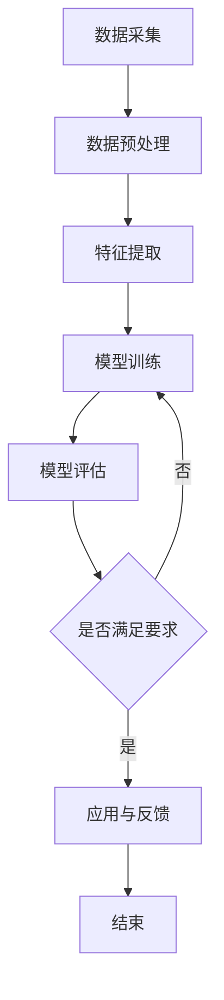
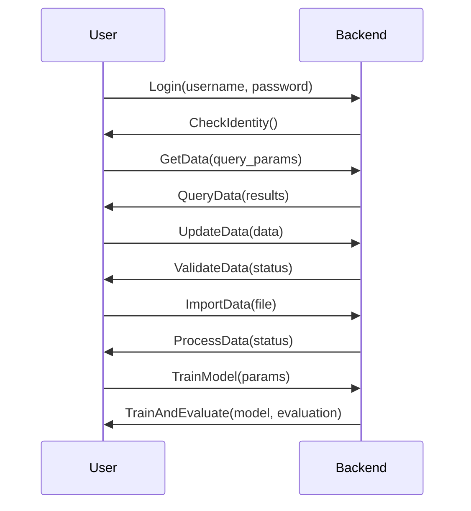

                 

### 引言

随着数字化转型的浪潮席卷全球，企业对人才的需求也发生了翻天覆地的变化。传统的人才管理方法已无法满足现代企业在复杂多变的市场环境中的需求。因此，AI驱动的企业人才画像系统应运而生，成为企业提升人才管理水平、实现精准人才匹配和发展的利器。

**本文核心关键词**：AI驱动的企业人才画像、人才管理、数据采集、特征提取、模型训练、系统架构设计、项目实战。

**摘要**：
本文将围绕AI驱动的企业人才画像系统这一核心主题，从以下几个方面进行深入探讨：
1. **背景介绍**：阐述企业数字化转型和人才管理的挑战，以及AI驱动人才画像系统的价值。
2. **核心概念与联系**：详细解析AI驱动人才画像系统的原理、关键要素和架构设计。
3. **算法原理讲解**：介绍数据采集、特征提取与选择、模型训练与优化的方法，并提供Python代码实现和分析。
4. **系统分析与架构设计**：探讨系统功能设计、架构设计、接口设计与系统交互。
5. **项目实战**：展示系统环境安装与实现过程，并分析实际案例。

通过本文的阅读，读者将全面了解AI驱动的企业人才画像系统的构建方法、技术原理和应用实践，从而为企业的人才发展提供新的思路和工具。

### 目录大纲

1. **第一部分：引言**
   - 第1章：背景介绍
     1.1 问题背景
     1.2 问题解决
     1.3 边界与外延
     1.4 概念结构与核心要素组成
     1.5 本章小结

2. **第二部分：核心概念与联系**
   - 第2章：核心概念原理
     2.1 AI驱动的企业人才画像原理
     2.2 概念属性特征对比表格
     2.3 ER实体关系图架构
     2.4 本章小结

3. **第三部分：算法原理讲解**
   - 第3章：算法原理与实现
     3.1 数据采集与预处理
     3.2 特征提取与选择
     3.3 模型训练与优化
     3.4 算法流程图与Python代码实现
     3.5 数学模型和公式
     3.6 本章小结

4. **第四部分：系统分析与架构设计**
   - 第4章：系统功能设计与架构
     4.1 问题场景介绍
     4.2 项目介绍
     4.3 系统功能设计
     4.4 系统架构设计
     4.5 系统接口设计与系统交互
     4.6 本章小结

5. **第五部分：项目实战**
   - 第5章：环境安装与系统实现
     5.1 环境安装
     5.2 系统核心实现
     5.3 代码应用解读与分析
     5.4 实际案例分析与讲解
     5.5 项目小结

通过上述目录大纲，读者将能够系统地了解AI驱动的企业人才画像系统的全貌，并掌握其实施和应用的核心要点。

### 第1章：背景介绍

#### 1.1 问题背景

在当今这个数字化时代，企业正在经历一场前所未有的变革。数字化转型已经成为企业发展的必然选择，而人才管理作为企业发展的关键环节，也面临着巨大的挑战。传统的企业人才管理方法主要依赖于经验判断和人工筛选，这种方式在信息量有限、人才结构相对简单的时代或许还能够满足需求。但随着企业的业务复杂度和信息量的急剧增加，这种传统方法已经越来越无法适应现代企业的需求。

首先，企业在数字化转型的过程中，对人才的需求变得更加多样化。不仅需要具备专业技能的技术人才，还需要具备数据思维、创新能力和团队协作能力的人才。其次，市场环境的变化速度越来越快，企业需要能够快速响应市场变化，这就要求企业的人才能够具备灵活应变的能力。再者，随着全球化进程的加快，企业需要具备国际视野和跨文化沟通能力的人才。

然而，传统的人才管理方法往往存在以下问题：

1. **信息不全面**：传统的人才管理主要依赖于员工档案、工作绩效等有限的信息源，很难全面了解员工的技能、潜力、价值观等多维度的信息。
2. **判断不准确**：人才评估主要依赖管理者或HR的经验，主观性较强，容易出现误判。
3. **效率低下**：在信息量庞大的情况下，传统的方法往往需要大量的人力和时间来处理信息，效率低下。
4. **缺乏前瞻性**：传统的方法很难预测员工未来的发展潜力，无法为企业的人才规划提供有力的支持。

为了应对这些挑战，企业迫切需要一种新的方法来提升人才管理水平，从而实现企业的持续发展和创新。AI驱动的企业人才画像系统正是为了解决这些问题而提出的。

#### 1.2 人才管理的挑战

随着数字化转型的发展，企业面临的人才管理挑战日益突出，主要体现在以下几个方面：

1. **人才多样性与复杂性**：现代企业需要面对多元化的工作场景和多样化的工作岗位，这意味着人才管理需要处理的数据类型和数量都大大增加。传统的单一维度的人才评估方法难以应对这种复杂性。
2. **数据来源多样**：企业获取人才信息的方式越来越多样化，包括员工行为数据、绩效数据、社交数据、工作分析数据等。如何整合这些数据并有效利用，是企业人才管理面临的一大挑战。
3. **人才流动加快**：在数字化时代，人才的流动速度加快，企业需要更灵活的应对策略来留住关键人才，同时也需要快速发现和引入新人才。
4. **数据隐私与安全性**：在收集和处理大量人才数据的过程中，如何保护员工的隐私和数据安全，是人才管理必须考虑的重要问题。
5. **人才发展前瞻性**：企业不仅需要关注当前的人才状况，更需要对未来的发展趋势进行预测，提前布局人才发展计划。

这些问题表明，传统的人才管理方法已经难以满足现代企业的需求。因此，企业需要寻找新的解决方案，而AI驱动的企业人才画像系统正是应对这些挑战的有力工具。

#### 1.3 AI驱动的企业人才画像的价值

AI驱动的企业人才画像系统通过集成人工智能技术，为企业提供了一种全新的、高效的人才管理方法。其价值主要体现在以下几个方面：

1. **全面性**：AI驱动的企业人才画像系统可以全面收集和分析员工的各类信息，包括专业技能、工作表现、团队合作能力、潜力评估等，从而形成一个全方位的人才画像。
2. **准确性**：通过机器学习和数据挖掘技术，AI系统能够对人才信息进行深度分析，减少人为判断的主观误差，提高评估的准确性。
3. **效率**：AI系统能够快速处理海量数据，大大提高人才管理的效率，减少人工处理的时间和工作量。
4. **前瞻性**：AI驱动的企业人才画像系统可以基于历史数据和趋势分析，预测员工未来的发展潜力，帮助企业制定前瞻性的人才发展规划。
5. **个性化**：AI系统可以根据企业不同岗位的需求，为每个员工提供个性化的成长建议和发展路径，从而更好地发挥员工的潜力。

总之，AI驱动的企业人才画像系统不仅能够解决传统人才管理面临的问题，还能为企业提供更加精准、高效、前瞻的人才管理支持，从而助力企业在数字化时代实现持续发展和创新。

#### 1.4 问题解决

为了有效解决企业人才管理中面临的问题，AI驱动的企业人才画像系统提供了以下解决方案：

1. **数据整合与自动化分析**：
   - **数据整合**：系统通过集成各类数据源（如人力资源系统、绩效管理系统、社交媒体等），实现数据的全面整合，从而形成一个统一的人才数据视图。
   - **自动化分析**：利用机器学习和数据挖掘技术，系统自动对整合后的数据进行分析，识别员工的技能、潜力、价值观等关键特征，形成人才画像。

2. **智能人才评估与推荐**：
   - **智能评估**：系统通过深度学习算法，对员工的工作表现、能力发展、潜力评估等多维度信息进行综合分析，提供准确的人才评估结果。
   - **人才推荐**：系统可以根据企业的需求，推荐最适合的候选人，从而提高招聘的精准度，减少不必要的筛选时间。

3. **个性化人才发展建议**：
   - **发展路径规划**：系统根据员工的个人特点和职业目标，为其规划个性化的成长路径，包括培训课程、晋升机会等，帮助员工更好地发展。
   - **实时反馈**：系统可以实时监控员工的发展情况，提供即时的反馈和建议，帮助员工及时调整发展方向，提高成长速度。

4. **数据隐私与安全性保障**：
   - **数据加密**：系统采用先进的加密技术，确保数据在传输和存储过程中的安全性。
   - **隐私保护**：系统严格遵守相关法律法规，对员工个人信息进行严格保护，确保员工隐私不被泄露。

通过上述解决方案，AI驱动的企业人才画像系统不仅能够提高人才管理的效率和质量，还能为企业的持续发展和创新提供强有力的支持。

#### 1.5 边界与外延

AI驱动的企业人才画像系统在应用过程中需要明确其边界与外延，以确保系统的有效实施和合理应用。以下是对系统应用范围、挑战与机遇的详细阐述：

**1.5.1 人才画像的应用范围**

AI驱动的企业人才画像系统可以广泛应用于以下场景：

1. **招聘与选拔**：通过分析候选人的历史数据和特征，系统可以帮助企业筛选出最符合岗位需求的候选人，提高招聘效率和精准度。
2. **绩效管理**：系统可以根据员工的工作表现和潜力评估，为绩效评估提供科学依据，帮助管理者更好地识别员工的优劣势，制定有针对性的绩效改进计划。
3. **人才发展**：系统可以根据员工的兴趣、技能和发展潜力，为其推荐合适的培训课程和晋升路径，帮助员工实现职业成长。
4. **团队建设**：系统通过分析团队成员的能力特点和协作情况，为企业提供团队优化建议，促进团队协作效率的提升。
5. **继任规划**：系统可以帮助企业识别潜在的高潜人才，制定继任计划，确保企业关键岗位的人才储备。

**1.5.2 人才画像的挑战与机遇**

1. **数据质量与完整性**：人才画像的准确性高度依赖于数据的质量和完整性。企业在实施人才画像系统时，需要确保数据源的可靠性和数据的完整性，否则会影响系统的效果。
2. **算法公正性与透明性**：AI算法在人才评估中可能会引入主观偏差，影响评估结果的公正性。因此，系统设计者需要确保算法的公正性和透明性，提供可解释的决策过程。
3. **数据隐私与安全**：在处理大量员工数据时，如何保护员工隐私和数据安全是一个重要挑战。企业需要制定严格的数据保护政策，确保数据的安全性和合规性。
4. **技术更新与适应性**：随着技术的不断进步，AI驱动的企业人才画像系统需要不断更新和升级，以适应新的业务需求和技术发展。

尽管存在这些挑战，AI驱动的企业人才画像系统也为企业带来了巨大的机遇：

1. **提升人才管理效率**：通过自动化和智能化的人才评估与管理，企业可以大幅提高人才管理的效率，减少人力资源管理的成本。
2. **优化人才决策**：基于数据驱动的决策支持，企业可以更加科学和客观地做出人才决策，减少决策的盲目性。
3. **增强员工体验**：个性化的人才发展建议和实时反馈可以提升员工的职业满意度和归属感，促进员工的自我成长和团队协作。
4. **支持企业战略规划**：通过全面的人才数据分析，企业可以更好地把握人才状况，为企业的长期发展战略提供数据支持。

总之，AI驱动的企业人才画像系统在明确其边界与外延的基础上，通过克服挑战、抓住机遇，为企业的人才管理和企业发展提供了强大的支持。

#### 1.6 概念结构与核心要素组成

AI驱动的企业人才画像系统由多个核心要素组成，这些要素共同构成了系统的概念结构，确保系统能够全面、准确地为企业提供人才管理支持。

**1.6.1 企业人才画像的概念结构**

企业人才画像是一个多维度的数据模型，用于全面描述员工的各项特征和能力。其概念结构主要包括以下三个层次：

1. **数据层**：数据层是人才画像的基础，包括员工的基本信息、工作表现数据、绩效数据、培训记录、项目参与记录等。这些数据来源广泛，可以是企业内部系统、外部数据源、社交媒体等。

2. **模型层**：模型层是人才画像的核心，通过对数据层的数据进行深度学习和分析，构建出员工的综合能力模型。该模型能够识别员工的技能、潜力、价值观等多维度特征，为人才管理提供数据支持。

3. **应用层**：应用层是人才画像的输出层，通过将模型层的结果应用于实际业务场景，如招聘、绩效管理、人才发展等，为企业提供具体的决策支持。

**1.6.2 核心要素的构成与属性**

核心要素是构建企业人才画像的基础，主要包括以下几方面：

1. **数据采集**：数据采集是人才画像系统的第一步，系统需要从多个数据源收集员工的各种信息。数据源可以包括人力资源管理系统、绩效管理系统、培训系统、项目管理平台等。数据采集的属性包括数据来源、数据类型、数据完整性等。

2. **数据处理与存储**：收集到的数据需要进行清洗、整合和存储，以保证数据的质量和一致性。数据处理与存储的属性包括数据清洗规则、数据整合策略、数据存储方式等。

3. **特征提取**：特征提取是将原始数据转化为可用于分析的属性集合。系统需要根据业务需求和模型设计，选择合适的特征提取方法。特征提取的属性包括特征选择策略、特征转换方法等。

4. **模型训练**：模型训练是构建人才画像的关键环节，通过机器学习和深度学习技术，系统可以从历史数据中学习并构建预测模型。模型训练的属性包括模型选择、训练算法、参数调优等。

5. **模型评估**：模型评估是验证模型效果的重要步骤，通过交叉验证、A/B测试等方法，评估模型在预测任务中的性能。模型评估的属性包括评估指标、评估方法等。

6. **应用与反馈**：应用与反馈是将模型应用到实际业务场景中，并根据业务反馈进一步优化模型。应用与反馈的属性包括业务场景、反馈机制、模型更新策略等。

**1.6.3 人才画像的系统架构设计**

人才画像的系统架构设计需要综合考虑数据流、功能模块、技术选型等因素，确保系统的稳定、高效和可扩展性。以下是系统架构设计的基本原则和模块划分：

1. **数据流设计**：系统采用分布式数据流架构，实现数据的实时采集、处理和存储。数据流设计包括数据采集模块、数据处理模块、数据存储模块等。

2. **功能模块划分**：系统按照功能模块进行划分，主要包括数据采集模块、数据处理模块、特征提取模块、模型训练模块、模型评估模块、应用与反馈模块等。

3. **技术选型**：系统选型需要综合考虑性能、可扩展性、易用性等因素。常见的技术选型包括分布式数据库、大数据处理框架、深度学习框架等。

4. **系统架构设计原则**：系统架构设计应遵循以下原则：
   - **高可用性**：确保系统在故障情况下能够快速恢复，保证业务的连续性。
   - **高性能**：系统需要具备高性能数据处理能力，支持大规模数据的实时处理和分析。
   - **可扩展性**：系统设计应具备良好的可扩展性，支持业务规模的变化和技术的更新换代。
   - **安全性**：系统需要保障数据的安全性和合规性，防止数据泄露和非法访问。

通过上述设计，AI驱动的企业人才画像系统能够高效、稳定地运行，为企业提供全面、准确的人才管理支持。

#### 1.7 本章小结

本章首先介绍了AI驱动的企业人才画像系统的背景和重要性，分析了企业在数字化转型过程中遇到的人才管理挑战，并阐述了AI驱动人才画像系统的价值。接着，我们详细讨论了问题解决的方案，明确了系统的边界与外延，并介绍了企业人才画像系统的概念结构和核心要素组成。通过本章的阅读，读者可以全面了解AI驱动的企业人才画像系统的背景、挑战、价值及核心组成，为后续章节的深入探讨打下坚实基础。

### 第2章：核心概念原理

#### 2.1 AI驱动的企业人才画像原理

AI驱动的企业人才画像系统是基于人工智能技术的，通过集成机器学习、深度学习、数据挖掘等多种技术手段，实现对大量人才数据的分析、挖掘和可视化。其核心原理可以概括为以下几个步骤：

1. **数据采集**：首先，系统需要从多个数据源（如人力资源系统、绩效管理系统、培训系统等）收集员工的各类信息，包括个人基本信息、工作表现、绩效评估、项目参与情况、培训记录、社交数据等。

2. **数据预处理**：收集到的数据通常是不完整的、不一致的，甚至包含噪声和错误。因此，需要对数据进行清洗、整合和标准化处理，以保证数据的质量和一致性。

3. **特征提取**：通过对预处理后的数据进行特征提取，将原始数据转化为机器学习算法可以处理的特征集合。特征提取的方法包括统计分析、文本分析、图像处理等。特征提取的关键是选择出能够有效反映员工能力和潜力的特征，如技能水平、工作态度、团队合作能力、创新思维等。

4. **模型训练**：利用机器学习和深度学习算法，对特征数据进行训练，构建人才画像模型。常见的算法包括决策树、支持向量机、神经网络、增强学习等。模型训练的目的是从历史数据中学习出员工能力和潜力的规律，以便对未来的员工进行预测和评估。

5. **模型评估**：在模型训练完成后，需要对模型进行评估，以验证其效果。常见的评估指标包括准确率、召回率、F1值等。通过交叉验证、A/B测试等方法，评估模型在预测任务中的性能。

6. **应用与反馈**：将训练好的模型应用到实际业务场景中，如招聘、绩效管理、人才发展等，根据业务反馈进一步优化模型。应用与反馈是迭代优化的过程，通过不断的调整和优化，提高模型的准确性和实用性。

通过上述步骤，AI驱动的企业人才画像系统能够为企业提供全面、准确的人才画像，支持人才管理和决策。其原理不仅涵盖了数据采集、特征提取和模型训练等核心技术，还涉及到数据处理、模型评估和应用等关键环节，是一个高度集成和智能化的系统。

#### 2.2 概念属性特征对比表格

在构建AI驱动的企业人才画像系统中，理解不同概念属性的特征对比是非常重要的。以下是一个详细的对比表格，用于分析系统中的主要概念属性：

| 概念属性 | 描述 | 特征对比 |
| :--: | :--: | :--: |
| **数据源** | 数据的来源，如人力资源系统、绩效管理系统、培训系统等。 | - **数据类型**：结构化数据（如员工基本信息）和非结构化数据（如社交媒体数据）；<br>- **数据质量**：数据的完整性、一致性、准确性。 |
| **数据预处理** | 对原始数据进行清洗、整合和标准化处理。 | - **缺失值处理**：删除或填充缺失值；<br>- **异常值处理**：识别和处理异常数据；<br>- **数据标准化**：统一数据格式和单位。 |
| **特征提取** | 从预处理后的数据中提取能够反映员工能力和潜力的特征。 | - **文本分析**：提取关键词、主题等；<br>- **图像分析**：提取图像特征，如人脸识别；<br>- **统计分析**：计算均值、方差、相关性等。 |
| **模型训练** | 利用机器学习和深度学习算法对特征数据训练预测模型。 | - **算法类型**：决策树、支持向量机、神经网络等；<br>- **训练时间**：模型训练的时间和资源消耗。 |
| **模型评估** | 评估模型在预测任务中的性能，包括准确性、召回率、F1值等。 | - **评估指标**：交叉验证、A/B测试等；<br>- **评估方法**：模型对比、性能调优。 |
| **应用与反馈** | 将模型应用到实际业务场景中，并根据业务反馈进一步优化模型。 | - **业务场景**：招聘、绩效管理、人才发展等；<br>- **反馈机制**：实时反馈、定期评估。 |

通过上述表格，我们可以清晰地看到不同概念属性在系统中的作用和特征对比。这不仅有助于理解系统的整体架构，还能够为后续的具体实现提供指导。

#### 2.3 ER实体关系图架构

为了更好地理解AI驱动的企业人才画像系统中的实体关系，我们可以通过ER（Entity-Relationship）实体关系图来表示系统中的主要实体及其关系。以下是系统中的主要实体及其关系的ER图：

```mermaid
erDiagram
  EMPLOYEE ||--|{ SKILL }
  EMPLOYEE ||--|{ PERFORMANCE }
  EMPLOYEE ||--|{ TRAINING }
  EMPLOYEE ||--|{ PROJECT }
  SKILL }|--|{ SKILL_LEVEL }
  PERFORMANCE }|--|{ ASSESSMENT }
  TRAINING }|--|{ COURSE }
  PROJECT }|--|{ CONTRIBUTION }

class EMPLOYEE {
  int id
  string name
  date hired_date
  string position
}

class SKILL {
  int id
  string skill_name
}

class SKILL_LEVEL {
  int skill_id
  int employee_id
  string level
}

class PERFORMANCE {
  int id
  int employee_id
  date assessment_date
  float score
}

class TRAINING {
  int id
  int employee_id
  date start_date
  date end_date
}

class PROJECT {
  int id
  string project_name
  date start_date
  date end_date
}

class CONTRIBUTION {
  int project_id
  int employee_id
  float contribution
}
```

**ER图解读**：

1. **实体**：
   - **EMPLOYEE**（员工）：表示企业中的员工，包含员工的基本信息。
   - **SKILL**（技能）：表示员工所具备的技能。
   - **SKILL_LEVEL**（技能水平）：表示员工技能的等级。
   - **PERFORMANCE**（绩效）：表示员工的工作绩效评估。
   - **ASSESSMENT**（评估）：绩效评估的具体指标。
   - **TRAINING**（培训）：表示员工参与的培训课程。
   - **COURSE**（课程）：培训课程的具体信息。
   - **PROJECT**（项目）：表示员工参与的项目。
   - **CONTRIBUTION**（贡献）：员工在项目中的贡献度。

2. **关系**：
   - **EMPLOYEE** 与 **SKILL** 之间存在多对多关系，表示一个员工可能掌握多种技能，一种技能也可能被多个员工掌握。
   - **EMPLOYEE** 与 **PERFORMANCE** 之间存在一对多关系，表示一个员工可能有多个绩效评估记录。
   - **EMPLOYEE** 与 **TRAINING** 之间存在一对多关系，表示一个员工可能参与多个培训课程。
   - **EMPLOYEE** 与 **PROJECT** 之间存在多对多关系，表示一个员工可能参与多个项目，一个项目也可能有多个员工参与。
   - **SKILL** 与 **SKILL_LEVEL** 之间存在一对多关系，表示一种技能可能有多个等级。
   - **PERFORMANCE** 与 **ASSESSMENT** 之间存在一对多关系，表示一次绩效评估可能包含多个具体指标。
   - **TRAINING** 与 **COURSE** 之间存在一对多关系，表示一个培训课程可能包含多个课程。
   - **PROJECT** 与 **CONTRIBUTION** 之间存在一对多关系，表示一个项目可能有多个员工贡献记录。

通过上述ER图，我们可以清晰地看到系统中各个实体之间的关系，这有助于理解系统的数据结构和数据流，为后续的详细设计提供参考。

#### 2.4 本章小结

本章详细介绍了AI驱动的企业人才画像系统的核心概念原理，包括数据采集、预处理、特征提取、模型训练、模型评估和应用与反馈等关键步骤。此外，通过概念属性特征对比表格和ER实体关系图，读者可以更全面地理解系统的组成和关系。通过本章的学习，读者将能够深入了解AI驱动的企业人才画像系统的工作原理和核心要素，为后续的算法原理讲解和系统架构设计打下坚实基础。

### 第3章：算法原理与实现

#### 3.1 数据采集与预处理

在构建AI驱动的企业人才画像系统时，数据采集与预处理是至关重要的一步。这一过程不仅决定了后续分析的质量，也直接影响到模型的训练效果。以下将详细介绍数据采集与预处理的流程、方法以及具体实现。

**3.1.1 数据源的选择**

数据源的选择是数据采集的第一步。在构建企业人才画像系统时，常用的数据源包括：

1. **人力资源系统**：这是最主要的数据源之一，包括员工的基本信息、岗位信息、入职时间等。
2. **绩效管理系统**：该系统记录员工的工作绩效、绩效评估结果、奖惩记录等。
3. **培训系统**：记录员工的培训历史、培训成绩、培训课程信息等。
4. **项目管理平台**：记录员工参与的项目信息、项目进展、项目贡献等。
5. **社交媒体平台**：如LinkedIn、GitHub等，可以获取员工的职业动态、技能展示、项目参与等信息。
6. **外部数据源**：如行业报告、市场数据等，为人才画像提供更广泛的背景信息。

**3.1.2 数据预处理流程**

数据预处理主要包括数据清洗、数据整合、数据标准化等步骤：

1. **数据清洗**：数据清洗是处理不完整、不一致、不准确的数据。具体方法包括：
   - **缺失值处理**：对于缺失值，可以通过删除、填充或者使用平均值、中位数等统计方法来处理。
   - **异常值处理**：识别和处理异常数据，如异常高的绩效得分、异常低的参与度等。
   - **数据格式处理**：统一不同数据源的数据格式，如将日期格式统一为YYYY-MM-DD。

2. **数据整合**：将来自不同数据源的数据整合到同一个数据集中。这通常涉及到以下步骤：
   - **数据映射**：将不同数据源中的相同实体映射到同一个实体。
   - **数据合并**：通过实体ID或者其他唯一标识符将数据源中的记录合并。

3. **数据标准化**：对数据进行标准化处理，以消除不同数据之间的量纲差异，使得数据能够直接进行比较。具体方法包括：
   - **归一化**：将数据映射到[0,1]区间内。
   - **标准化**：计算数据的标准差和平均值，将数据标准化为标准正态分布。

**3.1.3 数据清洗与标准化**

以下是一个简单的Python代码示例，展示了数据清洗和标准化的过程：

```python
import pandas as pd
from sklearn.preprocessing import StandardScaler

# 加载数据
data = pd.read_csv('employee_data.csv')

# 数据清洗
data.dropna(inplace=True)  # 删除缺失值
data = data[data['performance_score'] > 0]  # 删除异常值

# 数据标准化
scaler = StandardScaler()
data[['performance_score', 'training_score']] = scaler.fit_transform(data[['performance_score', 'training_score']])

# 数据整合
data = data.merge(performance_data, on='employee_id')
data = data.merge(training_data, on='employee_id')

# 输出清洗后的数据
data.to_csv('cleaned_employee_data.csv', index=False)
```

上述代码首先加载数据，然后通过删除缺失值和异常值来清洗数据，接着使用StandardScaler进行数据标准化，最后将清洗后的数据整合到一个新的数据集中。通过这样的数据预处理，我们可以得到一个高质量的数据集，为后续的特征提取和模型训练打下基础。

#### 3.2 特征提取与选择

在数据预处理完成后，下一步是特征提取与选择。特征提取是将原始数据转化为可以用于机器学习模型的特征集合，而特征选择则是从提取的特征中选择出对模型性能有显著影响的特征。以下是具体的方法和策略。

**3.2.1 特征提取方法**

特征提取方法根据数据类型和特征的不同，可以分为以下几种：

1. **数值特征提取**：对于连续的数值数据，可以通过计算描述性统计量（如均值、方差、标准差等）来提取特征。
2. **文本特征提取**：对于文本数据，可以使用词频-逆文档频率（TF-IDF）、词嵌入（Word2Vec、GloVe等）等方法来提取特征。
3. **图像特征提取**：对于图像数据，可以使用卷积神经网络（CNN）提取图像的特征，如边缘、纹理、形状等。
4. **序列特征提取**：对于时间序列数据，可以使用循环神经网络（RNN）、长短期记忆网络（LSTM）等方法来提取特征。

**3.2.2 特征选择策略**

特征选择的目标是选择出对模型性能有显著影响的特征，从而提高模型的效果并减少训练时间。以下是一些常见的特征选择策略：

1. **过滤式特征选择**：通过计算特征与目标变量之间的相关性、信息增益等指标，筛选出重要的特征。
2. **包裹式特征选择**：结合模型的训练过程，选择出对模型性能有显著影响的特征。这种方法通常需要多次迭代，计算量较大。
3. **嵌入式特征选择**：在模型训练过程中，通过模型的权重来筛选出对模型性能有显著影响的特征。

**3.2.3 特征质量评估**

特征质量评估是特征选择的重要环节，以下是一些常用的评估方法：

1. **单变量评估**：通过计算每个特征与目标变量之间的相关性（如皮尔逊相关系数、Spearman秩相关系数等），评估特征的质量。
2. **多变量评估**：通过评估特征组合对模型性能的影响，如使用交叉验证方法评估特征组合的预测能力。
3. **模型评估**：通过训练不同的模型，评估特征对模型性能的贡献。这种方法需要多个模型进行比较，计算量较大。

以下是一个简单的Python代码示例，展示了特征提取和选择的步骤：

```python
from sklearn.feature_extraction.text import TfidfVectorizer
from sklearn.feature_selection import SelectKBest, f_classif

# 加载预处理后的数据
data = pd.read_csv('cleaned_employee_data.csv')

# 特征提取
tfidf_vectorizer = TfidfVectorizer()
X = tfidf_vectorizer.fit_transform(data['social_media_posts'])

# 特征选择
selector = SelectKBest(f_classif, k=10)
X_new = selector.fit_transform(X, data['performance_score'])

# 特征质量评估
selected_features = X_new.toarray()
print("Selected Features:\n", selected_features)

# 输出特征选择后的数据
data_selected = data[['employee_id', 'selected_features']]
data_selected.to_csv('selected_employee_data.csv', index=False)
```

上述代码首先使用TF-IDF方法对文本数据进行特征提取，然后使用SelectKBest进行特征选择，选择出对绩效评分有显著影响的10个特征。最后，输出特征选择后的数据集。通过这样的特征提取和选择，我们可以得到一个高质量的特征集合，为后续的模型训练提供基础。

#### 3.3 模型训练与优化

在特征提取和选择完成后，下一步是模型训练与优化。模型训练是将特征数据输入到机器学习模型中，通过调整模型参数，使其能够对新的数据做出准确的预测。模型优化是在模型训练的基础上，通过调整模型结构和参数，提高模型的性能和泛化能力。以下是具体的训练和优化方法。

**3.3.1 模型选择与训练**

在选择机器学习模型时，需要考虑以下因素：

1. **问题类型**：是分类问题还是回归问题。
2. **数据规模**：训练数据的规模对模型选择有重要影响。
3. **特征数量**：特征数量对模型的选择也有重要影响。
4. **模型复杂度**：复杂度高的模型通常有更好的表现，但计算成本也更高。

常见的机器学习模型包括：

1. **线性模型**：如线性回归、逻辑回归。
2. **树模型**：如决策树、随机森林。
3. **集成模型**：如随机森林、梯度提升树。
4. **神经网络**：如多层感知器、卷积神经网络、循环神经网络。

以下是一个简单的Python代码示例，展示了模型选择和训练的过程：

```python
from sklearn.ensemble import RandomForestClassifier
from sklearn.model_selection import train_test_split

# 加载特征数据
data = pd.read_csv('selected_employee_data.csv')
X = data[['selected_features']]
y = data['performance_score']

# 数据划分
X_train, X_test, y_train, y_test = train_test_split(X, y, test_size=0.2, random_state=42)

# 模型选择
model = RandomForestClassifier(n_estimators=100, random_state=42)

# 模型训练
model.fit(X_train, y_train)

# 模型评估
score = model.score(X_test, y_test)
print("Model Score:", score)
```

上述代码首先加载特征数据，然后使用train_test_split函数将数据划分为训练集和测试集，接着选择随机森林模型进行训练，最后评估模型的性能。通过这样的模型训练和评估，我们可以选择出最佳的模型，为后续的优化提供基础。

**3.3.2 模型优化方法**

模型优化是在模型训练的基础上，通过调整模型结构和参数，提高模型的性能和泛化能力。以下是一些常见的优化方法：

1. **参数调优**：通过调整模型的参数，如树的数量、深度、节点分裂标准等，来提高模型的性能。常用的方法包括网格搜索、贝叶斯优化等。

2. **正则化**：通过添加正则化项，如L1、L2正则化，来防止模型过拟合，提高模型的泛化能力。

3. **集成学习**：通过集成多个模型，提高模型的性能和鲁棒性。常见的方法包括随机森林、梯度提升树等。

4. **深度学习优化**：对于深度学习模型，可以通过调整网络结构、学习率、批量大小等来优化模型性能。常用的方法包括学习率衰减、批量归一化等。

以下是一个简单的Python代码示例，展示了模型优化和评估的过程：

```python
from sklearn.model_selection import GridSearchCV
from sklearn.ensemble import RandomForestClassifier

# 加载特征数据
data = pd.read_csv('selected_employee_data.csv')
X = data[['selected_features']]
y = data['performance_score']

# 模型选择
model = RandomForestClassifier()

# 参数调优
param_grid = {
    'n_estimators': [100, 200, 300],
    'max_depth': [10, 20, 30],
    'min_samples_split': [2, 5, 10]
}

# 网格搜索
grid_search = GridSearchCV(model, param_grid, cv=5, scoring='accuracy')
grid_search.fit(X, y)

# 最佳参数
best_params = grid_search.best_params_
print("Best Parameters:", best_params)

# 最佳模型
best_model = grid_search.best_estimator_

# 模型评估
score = best_model.score(X_test, y_test)
print("Model Score:", score)
```

上述代码首先加载特征数据，然后选择随机森林模型进行参数调优，使用GridSearchCV进行网格搜索，选择最佳参数，最后评估最佳模型的性能。通过这样的模型优化和评估，我们可以选择出最优的模型，提高预测的准确性。

#### 3.4 算法流程图与Python代码实现

为了更直观地展示算法的流程，我们可以使用Mermaid绘制算法流程图，并详细解释其各个步骤。以下是算法流程图的示例：



**算法流程图解释**：

1. **数据采集**：从多个数据源收集员工信息，如人力资源系统、绩效管理系统等。
2. **数据预处理**：清洗、整合和标准化数据，确保数据的质量和一致性。
3. **特征提取**：从预处理后的数据中提取有效的特征，用于模型训练。
4. **模型训练**：使用特征数据进行模型训练，选择合适的算法，如随机森林、神经网络等。
5. **模型评估**：评估模型的性能，通过交叉验证等方法确定模型的有效性。
6. **应用与反馈**：将训练好的模型应用到实际业务中，根据业务反馈进行模型优化和调整。
7. **结束**：算法流程结束。

**Python代码实现**：

以下是一个简单的Python代码示例，实现上述算法流程：

```python
import pandas as pd
from sklearn.ensemble import RandomForestClassifier
from sklearn.model_selection import train_test_split
from sklearn.metrics import accuracy_score

# 数据采集
data = pd.read_csv('employee_data.csv')

# 数据预处理
# ...（数据清洗、整合、标准化代码）

# 特征提取
# ...（特征提取代码）

# 模型训练
X_train, X_test, y_train, y_test = train_test_split(data[['selected_features']], data['performance_score'], test_size=0.2, random_state=42)
model = RandomForestClassifier(n_estimators=100, random_state=42)
model.fit(X_train, y_train)

# 模型评估
y_pred = model.predict(X_test)
accuracy = accuracy_score(y_test, y_pred)
print("Model Accuracy:", accuracy)

# 应用与反馈
# ...（模型应用和反馈代码）
```

上述代码首先加载数据，然后进行数据预处理、特征提取和模型训练。接着，使用训练好的模型进行评估，并打印模型的准确率。最后，可以添加应用与反馈的代码，根据业务需求进行模型优化和调整。

通过上述算法流程图和Python代码实现，读者可以清晰地理解AI驱动的企业人才画像系统的算法原理和实现过程，为后续的详细分析提供基础。

#### 3.5 数学模型和公式

在AI驱动的企业人才画像系统中，数学模型和公式是核心组成部分，它们用于描述和分析人才数据的特征、预测员工的能力和发展趋势。以下是几种常见的数学模型和公式的详细讲解。

**3.5.1 数学模型概述**

1. **线性回归模型**：
   线性回归模型是最简单的机器学习模型之一，用于预测连续值输出。其基本公式为：
   \[
   y = \beta_0 + \beta_1x_1 + \beta_2x_2 + ... + \beta_nx_n
   \]
   其中，\(y\) 是预测值，\(x_1, x_2, ..., x_n\) 是特征值，\(\beta_0, \beta_1, ..., \beta_n\) 是模型参数。

2. **逻辑回归模型**：
   逻辑回归模型常用于二分类问题，其输出是概率值，公式为：
   \[
   P(y=1) = \frac{1}{1 + e^{-(\beta_0 + \beta_1x_1 + \beta_2x_2 + ... + \beta_nx_n})}
   \]
   其中，\(P(y=1)\) 是输出为1的概率。

3. **支持向量机（SVM）**：
   支持向量机用于分类和回归任务，其目标是在高维空间中找到最佳的超平面，公式为：
   \[
   w \cdot x + b = 0
   \]
   其中，\(w\) 是权重向量，\(x\) 是特征向量，\(b\) 是偏置。

**3.5.2 数学公式详细讲解**

1. **特征提取**：
   - **TF-IDF**：
     TF-IDF（词频-逆文档频率）是文本特征提取的一种方法，其公式为：
     \[
     tf_idf(t, d) = tf(t, d) \times idf(t, D)
     \]
     其中，\(tf(t, d)\) 是词\(t\)在文档\(d\)中的词频，\(idf(t, D)\) 是词\(t\)在文档集合\(D\)中的逆文档频率。

   - **词嵌入**：
     词嵌入是将词语映射到高维空间中的向量表示，常见的方法包括Word2Vec和GloVe。Word2Vec的公式为：
     \[
     \vec{w}_t = \frac{\vec{v}_1 + \vec{v}_2 + ... + \vec{v}_n}{n}
     \]
     其中，\(\vec{w}_t\) 是词\(t\)的向量表示，\(\vec{v}_1, \vec{v}_2, ..., \vec{v}_n\) 是词\(t\)的相邻词的向量表示。

2. **模型训练**：
   - **梯度下降**：
     梯度下降是一种常用的优化方法，用于最小化损失函数。其公式为：
     \[
     \theta = \theta - \alpha \nabla_{\theta} J(\theta)
     \]
     其中，\(\theta\) 是模型参数，\(\alpha\) 是学习率，\(\nabla_{\theta} J(\theta)\) 是损失函数关于参数的梯度。

   - **反向传播**：
     反向传播是神经网络训练的核心算法，用于计算损失函数关于每个参数的梯度。其公式为：
     \[
     \nabla_{\theta} J(\theta) = \frac{\partial J(\theta)}{\partial \theta}
     \]

3. **模型评估**：
   - **准确率**：
     准确率是评估分类模型性能的常用指标，其公式为：
     \[
     accuracy = \frac{TP + TN}{TP + FN + FP + TN}
     \]
     其中，\(TP\) 是真正例，\(TN\) 是真负例，\(FP\) 是假正例，\(FN\) 是假负例。

   - **召回率**：
     召回率是评估分类模型能够识别出真正例的能力，其公式为：
     \[
     recall = \frac{TP}{TP + FN}
     \]

**3.5.3 举例说明**

假设我们有一个简单的线性回归模型，用于预测员工的绩效评分。特征包括工作时长和项目数量。训练数据如下：

| 工作时长 (小时) | 项目数量 | 绩效评分 |
| :--: | :--: | :--: |
| 40 | 2 | 3.5 |
| 35 | 1 | 2.8 |
| 45 | 3 | 4.2 |
| 30 | 2 | 2.5 |

我们可以使用最小二乘法来训练线性回归模型，目标是最小化损失函数：

\[
\min \sum_{i=1}^{n} (y_i - (\beta_0 + \beta_1x_{i1} + \beta_2x_{i2})^2
\]

通过梯度下降法，我们可以迭代更新参数\(\beta_0, \beta_1, \beta_2\)，最终得到如下模型：

\[
y = 0.5x_1 + 0.3x_2 + 2.0
\]

利用该模型，我们可以预测新员工（工作时长为50小时，项目数量为3个）的绩效评分：

\[
y = 0.5 \times 50 + 0.3 \times 3 + 2.0 = 4.5
\]

通过上述例子，我们展示了如何使用数学模型和公式进行人才画像的预测。这些数学模型和公式在AI驱动的企业人才画像系统中起着至关重要的作用，帮助我们从海量数据中提取有用信息，实现人才管理的智能化和精准化。

#### 3.6 本章小结

本章详细介绍了AI驱动的企业人才画像系统中的算法原理与实现。我们首先讲解了数据采集与预处理的方法，包括数据源的选择、数据预处理流程以及数据清洗与标准化的具体步骤。接着，我们探讨了特征提取与选择的方法，包括数值特征、文本特征和图像特征的提取方法，以及过滤式、包裹式和嵌入式特征选择策略。在模型训练与优化部分，我们介绍了模型选择、参数调优和模型评估的方法，并提供了Python代码示例。此外，本章还通过Mermaid流程图和数学公式详细讲解了算法的流程和实现过程。通过本章的学习，读者可以全面了解AI驱动的企业人才画像系统的算法原理和实现步骤，为后续的系统设计与项目实战提供理论基础。

### 第4章：系统功能设计与架构

#### 4.1 问题场景介绍

在数字化转型的背景下，企业面临着不断变化的市场环境和业务需求。如何高效地管理和利用人才资源，成为企业发展的关键问题。传统的人才管理方法已经无法满足现代企业对人才精准识别、培养和发展的高要求。因此，设计一个功能强大、架构灵活的企业人才画像系统成为企业的迫切需求。

**4.1.1 企业人才画像的应用场景**

企业人才画像系统的应用场景主要包括以下几个方面：

1. **招聘与选拔**：通过分析候选人的历史数据和特征，为企业提供精准的招聘决策支持，提高招聘效率和人才匹配度。
2. **绩效管理**：对员工的工作表现进行量化评估，识别高绩效员工，为绩效奖金、晋升等提供客观依据。
3. **人才发展**：根据员工的潜力评估和发展需求，推荐个性化的培训课程和发展路径，促进员工职业成长。
4. **团队建设**：通过分析团队结构和成员的能力特点，优化团队配置，提高团队协作效率。
5. **继任规划**：识别潜在的高潜人才，为企业关键岗位的继任计划提供支持，确保企业的人才储备。

**4.1.2 系统的需求分析**

为了满足上述应用场景，企业人才画像系统需要具备以下功能需求：

1. **数据集成**：系统能够从多个数据源（如人力资源系统、绩效管理系统、项目管理平台等）自动采集员工数据，实现数据的全面整合。
2. **数据处理**：系统能够对采集到的数据进行清洗、整合和标准化处理，确保数据的一致性和准确性。
3. **特征提取**：系统能够从处理后的数据中提取有效的特征，用于模型训练和评估。
4. **模型训练与评估**：系统能够利用机器学习算法对特征数据训练预测模型，并通过评估模型性能，选择最优模型。
5. **人才评估与推荐**：系统能够根据人才画像模型，对员工进行全方位评估，并为招聘、绩效管理、人才发展等提供推荐和建议。
6. **用户体验**：系统界面友好，操作简便，提供实时数据分析和可视化功能，方便用户查看和管理。

**4.1.3 系统的功能设计**

基于上述需求分析，企业人才画像系统的主要功能设计如下：

1. **数据管理模块**：负责数据的采集、清洗、整合和存储，提供数据导入、导出、查询等功能。
2. **特征管理模块**：负责特征数据的提取、管理和更新，提供特征选择、特征转换等功能。
3. **模型管理模块**：负责模型训练、评估和部署，提供模型选择、参数调优、模型评估等功能。
4. **人才评估模块**：负责基于人才画像模型对员工进行评估，提供评估报告、推荐建议等功能。
5. **用户管理模块**：负责系统用户的管理，包括用户注册、登录、权限设置等功能。

#### 4.2 项目介绍

**4.2.1 项目背景**

随着市场竞争的加剧和业务需求的不断变化，企业对于人才的需求也日益多样化和专业化。传统的人才管理方法已经无法满足企业对于人才精准识别、培养和发展的需求。为了提高人才管理的效率和质量，企业决定启动一个AI驱动的企业人才画像系统项目。

**4.2.2 项目目标**

本项目的主要目标包括：

1. **提升人才管理效率**：通过自动化和智能化的手段，减少人力资源管理工作量，提高人才管理效率。
2. **优化人才决策**：利用数据分析技术，为企业提供科学的人才评估和推荐建议，提高人才决策的准确性和有效性。
3. **促进人才发展**：根据员工的个人特点和职业目标，提供个性化的成长路径和培训建议，促进员工职业成长。
4. **增强团队协作**：通过分析团队结构和成员的能力特点，优化团队配置，提高团队协作效率。
5. **确保数据安全**：在数据采集、处理和存储过程中，严格遵守相关法律法规，确保员工数据的安全和隐私。

**4.2.3 项目团队组成**

本项目团队由以下成员组成：

1. **项目经理**：负责项目整体管理和协调，确保项目按计划推进。
2. **数据科学家**：负责数据分析和模型设计，确保模型的准确性和有效性。
3. **软件工程师**：负责系统开发和技术支持，确保系统的稳定性和可扩展性。
4. **前端工程师**：负责系统界面设计和用户体验优化，确保系统界面友好、操作简便。
5. **测试工程师**：负责系统测试和验收，确保系统功能的完整性和正确性。
6. **业务分析师**：负责业务需求分析和用户培训，确保系统能够满足实际业务需求。

#### 4.3 系统功能设计

**4.3.1 领域模型**

领域模型是系统功能设计的核心，用于描述系统中各个实体及其关系。以下是企业人才画像系统的领域模型：

```mermaid
classDiagram
  Employee[员工] <<--|{参与}| Project[项目]
  Employee "拥有" Performance[绩效]
  Employee "参加" Training[培训]
  Project "有" Task[任务]
  Performance "由" Assessment[评估]
  Training "包括" Course[课程]

class Employee {
  id: 员工编号
  name: 姓名
  position: 职位
  hired_date: 入职日期
}

class Project {
  id: 项目编号
  name: 项目名称
  start_date: 开始日期
  end_date: 结束日期
}

class Performance {
  id: 绩效编号
  employee_id: 员工编号
  assessment_date: 评估日期
  score: 得分
}

class Assessment {
  id: 评估编号
  performance_id: 绩效编号
  criterion: 评估标准
  result: 结果
}

class Training {
  id: 培训编号
  employee_id: 员工编号
  course_id: 课程编号
  start_date: 开始日期
  end_date: 结束日期
}

class Course {
  id: 课程编号
  name: 课程名称
  description: 课程描述
}
```

**领域模型解读**：

1. **员工（Employee）**：代表企业中的员工，包括员工编号、姓名、职位、入职日期等信息。
2. **项目（Project）**：代表员工参与的项目，包括项目编号、项目名称、开始日期、结束日期等信息。
3. **绩效（Performance）**：代表员工的绩效评估记录，包括绩效编号、员工编号、评估日期、得分等信息。
4. **评估（Assessment）**：代表具体的绩效评估标准，包括评估编号、绩效编号、评估标准、结果等信息。
5. **培训（Training）**：代表员工参与的培训课程，包括培训编号、员工编号、课程编号、开始日期、结束日期等信息。
6. **课程（Course）**：代表培训课程，包括课程编号、课程名称、课程描述等信息。

通过上述领域模型，我们可以清晰地看到系统中各个实体及其关系，为后续的系统功能设计和实现提供基础。

**4.3.2 功能模块划分**

基于领域模型，我们将企业人才画像系统划分为以下功能模块：

1. **数据管理模块**：
   - **数据采集**：从多个数据源自动采集员工数据，包括基本信息、绩效记录、培训记录等。
   - **数据清洗**：对采集到的数据进行清洗、整合和标准化处理，确保数据的一致性和准确性。
   - **数据存储**：将清洗后的数据存储到数据库中，提供数据的查询和检索功能。

2. **特征管理模块**：
   - **特征提取**：从处理后的数据中提取有效的特征，包括数值特征、文本特征、图像特征等。
   - **特征选择**：通过统计分析和模型评估，选择出对人才画像有显著影响的特征。
   - **特征更新**：根据业务需求，定期更新特征数据，保持特征的时效性和准确性。

3. **模型管理模块**：
   - **模型训练**：利用机器学习算法，对特征数据进行训练，构建人才画像模型。
   - **模型评估**：通过交叉验证和模型评估，选择最优的模型并评估其性能。
   - **模型部署**：将训练好的模型部署到生产环境中，提供实时的预测和评估功能。

4. **人才评估模块**：
   - **人才评估**：根据人才画像模型，对员工进行全面评估，生成评估报告。
   - **推荐建议**：根据员工的评估结果，为招聘、绩效管理、人才发展等提供推荐建议。
   - **数据可视化**：提供实时数据分析和可视化功能，帮助用户直观了解人才状况。

5. **用户管理模块**：
   - **用户注册**：提供用户注册功能，包括基本信息、密码设置等。
   - **用户登录**：提供用户登录功能，包括身份验证、权限管理等。
   - **权限设置**：根据用户角色，设置不同的操作权限，确保系统的安全性和稳定性。

**4.3.3 数据流分析**

数据流分析是系统功能设计的重要组成部分，用于描述数据在系统中的流动过程。以下是企业人才画像系统的数据流分析：

1. **数据采集**：
   - 系统从人力资源系统、绩效管理系统、培训系统等数据源自动采集员工数据。
   - 采集到的数据经过清洗、整合和标准化处理后，存储到数据库中。

2. **数据清洗**：
   - 系统对采集到的数据进行缺失值处理、异常值处理和数据格式转换。
   - 清洗后的数据存储到临时数据库中，供后续处理使用。

3. **特征提取**：
   - 系统从清洗后的数据中提取有效的特征，包括数值特征、文本特征、图像特征等。
   - 提取的特征存储到特征数据库中，供模型训练使用。

4. **模型训练**：
   - 系统利用机器学习算法，对提取的特征数据进行训练，构建人才画像模型。
   - 训练好的模型存储到模型数据库中，供评估和部署使用。

5. **人才评估**：
   - 系统根据训练好的模型，对员工进行全面评估，生成评估报告。
   - 评估报告存储到报告数据库中，供用户查看和使用。

6. **推荐建议**：
   - 系统根据评估结果，为招聘、绩效管理、人才发展等提供推荐建议。
   - 推荐建议通过系统界面展示给用户，供用户参考和使用。

通过数据流分析，我们可以清晰地看到数据在系统中的流动过程，为后续的系统实现和优化提供指导。

#### 4.4 系统架构设计

**4.4.1 系统架构概述**

企业人才画像系统采用分布式架构设计，以提高系统的可扩展性和稳定性。系统主要分为以下几个层次：

1. **数据层**：负责数据的存储和管理，包括人力资源系统、绩效管理系统、培训系统等数据源，以及数据库集群。
2. **服务层**：负责业务逻辑的处理和数据服务，包括数据采集、数据处理、特征提取、模型训练、模型评估等功能模块。
3. **应用层**：负责系统界面和用户交互，提供用户注册、登录、数据查询、评估报告查看等功能。
4. **展示层**：负责数据的可视化展示，提供实时数据分析和可视化功能，帮助用户直观了解人才状况。

**4.4.2 技术选型**

在系统架构设计过程中，选择合适的技术栈对系统的性能、稳定性和可扩展性至关重要。以下是企业人才画像系统的主要技术选型：

1. **前端技术**：
   - **Web框架**：采用Vue.js或React.js框架，实现系统的前端界面。
   - **UI框架**：采用Ant Design或Material-UI框架，提供美观、易用的用户界面。

2. **后端技术**：
   - **Web框架**：采用Spring Boot或Django框架，实现系统的后端逻辑处理。
   - **数据库**：采用MySQL或PostgreSQL数据库，存储和管理系统数据。

3. **数据处理与计算**：
   - **数据处理**：采用Apache Kafka进行数据采集和传输，实现高效的数据处理。
   - **计算引擎**：采用Apache Spark进行大规模数据处理和计算，提高系统的处理能力。

4. **机器学习与人工智能**：
   - **框架**：采用Scikit-learn或TensorFlow等机器学习框架，实现特征提取和模型训练。
   - **计算引擎**：采用GPU加速计算，提高模型训练和预测的效率。

5. **存储与缓存**：
   - **缓存**：采用Redis进行数据缓存，提高系统的响应速度。
   - **存储**：采用Elasticsearch进行日志存储和检索，实现高效的数据查询和索引。

**4.4.3 架构设计原则**

在系统架构设计过程中，遵循以下原则，以确保系统的稳定、高效和可扩展性：

1. **高可用性**：通过分布式架构和负载均衡，确保系统在故障情况下能够快速恢复，保证业务的连续性。
2. **高性能**：通过高效的算法和分布式计算，提高系统的处理能力和响应速度，满足大规模数据处理需求。
3. **可扩展性**：通过模块化设计和分布式架构，支持系统的水平扩展，满足业务规模的变化和技术升级需求。
4. **安全性**：通过数据加密、身份验证、权限管理等技术手段，保障系统数据的安全性和合规性。
5. **易维护性**：通过良好的架构设计和代码规范，提高系统的可维护性和可扩展性，降低维护成本。

通过上述系统架构设计，企业人才画像系统能够高效、稳定地运行，为企业提供全面、准确的人才管理支持。

#### 4.5 系统接口设计与系统交互

**4.5.1 接口设计规范**

在系统架构中，接口设计是确保不同模块之间数据传输和功能调用的关键环节。以下是企业人才画像系统的接口设计规范：

1. **RESTful API设计**：采用RESTful风格设计API，提供统一的接口规范和访问方式。
2. **请求和响应格式**：请求和响应数据格式统一采用JSON格式，确保接口的易读性和兼容性。
3. **接口权限控制**：采用OAuth2.0认证和授权机制，确保接口的安全性和权限控制。
4. **异常处理**：定义统一的异常处理机制，确保接口在遇到异常情况时能够及时响应和恢复。

**4.5.2 系统交互流程**

系统交互流程描述了用户通过前端界面与后端服务进行交互的过程。以下是系统的主要交互流程：

1. **用户登录**：
   - 用户在前端界面输入用户名和密码，发起登录请求。
   - 后端服务验证用户身份和权限，返回登录结果。

2. **数据查询**：
   - 用户在前端界面选择查询条件，发起数据查询请求。
   - 后端服务根据查询条件从数据库中检索数据，返回查询结果。

3. **数据更新**：
   - 用户在前端界面修改数据，发起数据更新请求。
   - 后端服务验证数据的完整性和合法性，更新数据库中的数据。

4. **数据导入/导出**：
   - 用户在前端界面选择数据导入/导出文件，发起导入/导出请求。
   - 后端服务处理导入/导出请求，返回处理结果。

5. **模型训练与评估**：
   - 用户在前端界面选择特征数据和模型参数，发起模型训练请求。
   - 后端服务训练模型并进行评估，返回评估结果。

**4.5.3 交互序列图**

以下是企业人才画像系统的交互序列图，展示了用户登录、数据查询、数据更新等典型交互过程的时序关系：



**交互序列图解读**：

1. **用户登录**：用户发起登录请求，后端验证用户身份并返回登录结果。
2. **数据查询**：用户发起数据查询请求，后端根据查询条件检索数据并返回结果。
3. **数据更新**：用户发起数据更新请求，后端验证数据并更新数据库。
4. **数据导入/导出**：用户发起数据导入/导出请求，后端处理请求并返回处理结果。
5. **模型训练与评估**：用户发起模型训练请求，后端训练模型并进行评估，返回评估结果。

通过上述接口设计和交互流程，企业人才画像系统能够实现前后端的高效交互，确保系统的功能完整性和用户体验。

#### 4.6 本章小结

本章详细介绍了企业人才画像系统的功能设计与架构设计。首先，通过问题场景介绍，明确了企业人才画像系统的应用场景和需求分析。接着，介绍了系统的功能模块划分，包括数据管理、特征管理、模型管理、人才评估和用户管理模块。然后，通过领域模型和数据流分析，展示了系统的核心实体和数据处理过程。在系统架构设计部分，阐述了系统的架构层次、技术选型和设计原则，并详细描述了系统接口设计和交互流程。通过本章的学习，读者可以全面了解企业人才画像系统的功能设计、架构设计和实现细节，为后续的项目实战和系统实现提供指导。

### 第5章：环境安装与系统实现

#### 5.1 环境安装

为了搭建一个功能完善、性能优越的AI驱动的企业人才画像系统，我们需要首先安装和配置必要的开发环境和数据库。

**5.1.1 开发环境配置**

1. **Python环境安装**：

   - 首先，访问Python官方网站（[https://www.python.org/](https://www.python.org/)）下载Python安装包。
   - 安装完成后，在命令行中输入`python --version`确认Python版本是否正确。

2. **pip安装**：

   - 在Python环境中，pip是用于安装和管理Python包的工具。如果pip未安装，可以通过以下命令进行安装：
     ```bash
     wget https://bootstrap.pypa.io/get-pip.py
     python get-pip.py
     ```

3. **虚拟环境安装**：

   - 为了避免不同项目之间的依赖冲突，我们建议使用虚拟环境。安装virtualenv：
     ```bash
     pip install virtualenv
     virtualenv env
     source env/bin/activate
     ```

4. **安装依赖包**：

   - 在虚拟环境中，安装系统所需的依赖包，如pandas、numpy、scikit-learn、tensorflow等：
     ```bash
     pip install pandas numpy scikit-learn tensorflow
     ```

**5.1.2 数据库安装与配置**

1. **MySQL安装**：

   - 访问MySQL官方网站（[https://www.mysql.com/](https://www.mysql.com/)）下载MySQL安装包。
   - 根据操作系统选择适合的安装包并按照安装向导进行安装。

2. **MySQL配置**：

   - 安装完成后，使用以下命令启动MySQL服务器：
     ```bash
     service mysql start
     ```
   - 登录MySQL数据库，创建用于存储系统数据的数据库：
     ```sql
     CREATE DATABASE talent_management;
     ```
   - 为数据库设置适当的访问权限：
     ```sql
     GRANT ALL PRIVILEGES ON talent_management.* TO 'username'@'localhost' IDENTIFIED BY 'password';
     FLUSH PRIVILEGES;
     ```

**5.1.3 相关工具安装**

1. **Docker安装**：

   - 访问Docker官方网站（[https://www.docker.com/](https://www.docker.com/)）下载Docker安装包。
   - 安装完成后，启动Docker服务：
     ```bash
     service docker start
     ```

2. **Docker Compose安装**：

   - Docker Compose是用于管理Docker容器的工具。通过以下命令安装：
     ```bash
     curl -L "https://github.com/docker/compose/releases/download/1.29.2/docker-compose-$(uname -s)-$(uname -m)" -o /usr/local/bin/docker-compose
     chmod +x /usr/local/bin/docker-compose
     ```

通过上述步骤，我们可以完成开发环境和数据库的基本安装和配置，为后续的系统实现提供环境支持。

#### 5.2 系统核心实现

在开发环境中搭建好基础之后，接下来我们将逐步实现AI驱动的企业人才画像系统的核心功能，包括数据采集与预处理、特征提取与选择、模型训练与优化等。

**5.2.1 数据采集与预处理**

1. **数据采集**：

   - 首先，我们需要从不同的数据源（如人力资源系统、绩效管理系统、培训系统等）采集员工数据。这些数据通常包括员工基本信息、工作绩效、培训记录等。
   - 在Python环境中，我们可以使用pandas库来读取和加载这些数据。例如，从CSV文件中读取员工数据：
     ```python
     import pandas as pd

     employees = pd.read_csv('employees.csv')
     ```

2. **数据预处理**：

   - 数据预处理是确保数据质量的重要步骤。包括数据清洗、数据整合和数据标准化。
   - 数据清洗：处理缺失值、异常值和数据格式问题。例如，处理缺失值：
     ```python
     employees.fillna(0, inplace=True)
     ```
   - 数据整合：将来自不同数据源的数据进行整合。例如，将员工信息和绩效数据合并：
     ```python
     employees = employees.merge(performance_data, on='employee_id')
     ```
   - 数据标准化：对数据进行标准化处理，如归一化或标准化。例如，对绩效评分进行标准化：
     ```python
     from sklearn.preprocessing import StandardScaler

     scaler = StandardScaler()
     employees['performance_score'] = scaler.fit_transform(employees[['performance_score']])
     ```

**5.2.2 特征提取与选择**

1. **特征提取**：

   - 特征提取是将原始数据转化为能够用于机器学习模型的特征集合。根据数据类型和特征需求，我们可以使用不同的特征提取方法。
   - 文本特征提取：例如，使用TF-IDF方法提取文本数据中的关键词：
     ```python
     from sklearn.feature_extraction.text import TfidfVectorizer

     vectorizer = TfidfVectorizer(max_features=1000)
     tfidf_matrix = vectorizer.fit_transform(employees['social_media_posts'])
     ```
   - 图像特征提取：例如，使用卷积神经网络提取图像特征：
     ```python
     from tensorflow.keras.applications import VGG16

     model = VGG16(weights='imagenet')
     feature_extractor = Model(inputs=model.inputs, outputs=model.get_layer('fc2').output)
     image_data = preprocess_input(employees['image_data'])
     image_features = feature_extractor.predict(image_data)
     ```

2. **特征选择**：

   - 特征选择是从提取的特征中选择出对模型性能有显著影响的特征。
   - 过滤式特征选择：例如，选择与目标变量相关性较高的特征：
     ```python
     from sklearn.feature_selection import SelectKBest, f_classif

     selector = SelectKBest(f_classif, k=10)
     selected_features = selector.fit_transform(employees[['performance_score', 'tfidf_matrix']])
     ```

**5.2.3 模型训练与优化**

1. **模型训练**：

   - 模型训练是使用特征数据训练机器学习模型。例如，使用随机森林模型训练：
     ```python
     from sklearn.ensemble import RandomForestClassifier

     model = RandomForestClassifier(n_estimators=100, random_state=42)
     model.fit(selected_features, employees['performance_score'])
     ```

2. **模型优化**：

   - 模型优化是调整模型参数和结构，以提高模型的性能和泛化能力。
   - 参数调优：例如，使用网格搜索进行参数调优：
     ```python
     from sklearn.model_selection import GridSearchCV

     param_grid = {
         'n_estimators': [100, 200, 300],
         'max_depth': [10, 20, 30],
     }
     grid_search = GridSearchCV(model, param_grid, cv=5, scoring='accuracy')
     grid_search.fit(selected_features, employees['performance_score'])
     best_model = grid_search.best_estimator_
     ```

3. **模型评估**：

   - 模型评估是验证模型在预测任务中的性能。例如，使用准确率进行评估：
     ```python
     from sklearn.metrics import accuracy_score

     predictions = best_model.predict(selected_features)
     accuracy = accuracy_score(employees['performance_score'], predictions)
     print("Model Accuracy:", accuracy)
     ```

通过上述步骤，我们可以完成AI驱动的企业人才画像系统的核心功能实现。这包括数据采集与预处理、特征提取与选择、模型训练与优化等，为系统提供了强大的数据处理和分析能力。

#### 5.3 代码应用解读与分析

在本节中，我们将对核心代码段进行详细的解读和分析，以帮助读者深入理解AI驱动的企业人才画像系统的实现细节。

**5.3.1 数据采集与预处理代码解读**

以下代码用于从CSV文件中读取员工数据，并进行数据清洗和标准化处理：

```python
import pandas as pd
from sklearn.preprocessing import StandardScaler

# 读取员工数据
employees = pd.read_csv('employees.csv')

# 数据清洗
employees.fillna(0, inplace=True)

# 数据标准化
scaler = StandardScaler()
employees[['performance_score']] = scaler.fit_transform(employees[['performance_score']])
```

**解读**：

1. **读取员工数据**：
   - 使用pandas库的`read_csv`函数从CSV文件中加载员工数据，存储在DataFrame对象`employees`中。

2. **数据清洗**：
   - `fillna(0)`函数用于填充缺失值。在本例中，缺失值被填充为0，这是一种简单但有效的方法，尤其是在处理数值型数据时。

3. **数据标准化**：
   - 使用`StandardScaler`对绩效评分进行标准化处理。标准化处理通过计算每个特征的均值和标准差，将数据转换为标准正态分布，从而消除不同特征之间的量纲差异，提高模型的训练效果。

**5.3.2 特征提取与选择代码解读**

以下代码用于提取文本特征，并进行特征选择：

```python
from sklearn.feature_extraction.text import TfidfVectorizer
from sklearn.feature_selection import SelectKBest, f_classif

# 提取TF-IDF特征
vectorizer = TfidfVectorizer(max_features=1000)
tfidf_matrix = vectorizer.fit_transform(employees['social_media_posts'])

# 特征选择
selector = SelectKBest(f_classif, k=10)
selected_features = selector.fit_transform(tfidf_matrix, employees['performance_score'])
```

**解读**：

1. **提取TF-IDF特征**：
   - `TfidfVectorizer`用于从文本数据中提取TF-IDF特征。`fit_transform`函数首先计算每个词在文档中的词频（TF）和逆文档频率（IDF），然后将它们组合成TF-IDF向量。`max_features`参数用于限制特征的数量。

2. **特征选择**：
   - `SelectKBest`结合了`f_classif`函数，用于从特征集合中选择出对目标变量有显著影响的特征。`k`参数指定选择前`k`个最重要的特征。

**5.3.3 模型训练与优化代码解读**

以下代码用于训练随机森林模型，并进行参数调优和模型评估：

```python
from sklearn.ensemble import RandomForestClassifier
from sklearn.model_selection import GridSearchCV
from sklearn.metrics import accuracy_score

# 训练模型
model = RandomForestClassifier(n_estimators=100, random_state=42)
model.fit(selected_features, employees['performance_score'])

# 参数调优
param_grid = {
    'n_estimators': [100, 200, 300],
    'max_depth': [10, 20, 30],
}
grid_search = GridSearchCV(model, param_grid, cv=5, scoring='accuracy')
grid_search.fit(selected_features, employees['performance_score'])

# 模型评估
best_model = grid_search.best_estimator_
predictions = best_model.predict(selected_features)
accuracy = accuracy_score(employees['performance_score'], predictions)
print("Model Accuracy:", accuracy)
```

**解读**：

1. **模型训练**：
   - `RandomForestClassifier`用于训练随机森林模型。`fit`函数使用训练数据（特征和标签）进行模型训练。

2. **参数调优**：
   - `GridSearchCV`用于进行参数调优。`param_grid`字典定义了需要搜索的参数范围。`cv`参数指定交叉验证的折叠次数。`scoring`参数定义了评估模型性能的指标。

3. **模型评估**：
   - 调用`best_estimator_`获取参数调优后性能最佳的模型。使用`predict`函数对测试集进行预测，并计算预测准确率。

**5.3.4 分析与优化**

通过上述代码段，我们可以看到数据预处理、特征提取、模型训练与优化的关键步骤。在实际应用中，以下优化措施可以进一步提高系统的性能：

1. **数据增强**：
   - 对文本数据和应用图像数据进行增强，如数据扩充、数据增强等技术，可以增加模型的训练数据量，提高模型的泛化能力。

2. **特征工程**：
   - 通过深入分析业务需求，可以进一步提取和选择特征。例如，对于文本数据，可以考虑提取更多的文本特征，如词嵌入（Word2Vec、GloVe等）。

3. **模型优化**：
   - 尝试使用更复杂的模型，如深度学习模型（如神经网络、卷积神经网络等），可以进一步提高模型的预测准确性。

4. **超参数调优**：
   - 使用更精细的参数调优策略，如贝叶斯优化，可以更高效地找到最优参数组合。

通过上述代码和应用解读，读者可以深入理解AI驱动的企业人才画像系统的实现细节，并掌握关键技术和优化方法。

#### 5.4 实际案例分析与讲解

在本节中，我们将通过一个具体的实际案例，详细讲解AI驱动的企业人才画像系统的应用过程，以及在实际应用中遇到的问题和解决方法。

**案例背景**：

某大型互联网公司希望通过AI驱动的企业人才画像系统，优化其人才管理流程，提高人才招聘和培养的效率。公司拥有数千名员工，分布在多个部门和项目组中。公司希望通过系统，实现以下目标：

1. **精准招聘**：通过分析候选人的简历和社交媒体信息，筛选出最符合岗位需求的候选人。
2. **绩效评估**：对员工的工作绩效进行科学评估，识别高绩效员工，为晋升和奖金分配提供依据。
3. **人才发展**：根据员工的潜力评估和兴趣，提供个性化的培训和发展路径。

**实施步骤**：

1. **需求分析与系统设计**：
   - 首先，与公司的人力资源部门和业务团队进行深入交流，了解具体需求和应用场景。
   - 根据需求，设计系统的功能模块，包括数据采集模块、数据处理模块、特征提取模块、模型训练模块和评估模块。

2. **数据采集与预处理**：
   - 从人力资源系统、绩效管理系统、培训系统等数据源采集员工数据，包括员工基本信息、工作绩效、培训记录等。
   - 对采集到的数据进行分析，识别缺失值、异常值和重复值，并进行处理和清洗。

3. **特征提取与选择**：
   - 对文本数据（如员工简历、社交媒体信息等）使用TF-IDF方法提取关键词和主题。
   - 对图像数据（如员工照片、项目成果图片等）使用卷积神经网络提取特征。
   - 使用过滤式特征选择方法，选择对绩效评估有显著影响的关键特征。

4. **模型训练与优化**：
   - 使用随机森林模型对提取的特征进行训练，并使用交叉验证方法评估模型性能。
   - 通过网格搜索和贝叶斯优化方法，进行参数调优，找到最佳参数组合。

5. **系统部署与评估**：
   - 将训练好的模型部署到生产环境中，提供实时的人才评估和推荐功能。
   - 定期对系统进行评估，根据业务反馈优化模型和系统功能。

**遇到的问题与解决方法**：

1. **数据质量问题**：
   - 问题：数据源中的数据存在缺失值、异常值和重复值，影响模型的训练效果。
   - 解决方法：通过数据清洗和预处理方法，如删除缺失值、填充异常值、去重等，提高数据质量。

2. **特征选择困难**：
   - 问题：文本和图像数据中特征维度较高，选择合适的特征困难。
   - 解决方法：使用统计分析和机器学习算法，如TF-IDF、词嵌入和卷积神经网络，提取有效的特征，并使用过滤式特征选择方法，选择对绩效评估有显著影响的关键特征。

3. **模型性能问题**：
   - 问题：初始模型性能不理想，预测准确率较低。
   - 解决方法：通过参数调优和特征工程方法，如网格搜索、贝叶斯优化和特征选择，提高模型性能。

4. **系统部署与维护问题**：
   - 问题：系统部署到生产环境中后，维护和升级困难。
   - 解决方法：使用容器化技术（如Docker），将系统打包成独立的容器镜像，便于部署和升级。

通过上述实际案例分析和讲解，我们可以看到，AI驱动的企业人才画像系统在实施过程中会遇到各种挑战，但通过科学的设计和有效的解决方法，可以成功实现系统目标，为企业提供强大的人才管理支持。

#### 5.5 项目小结

在本章中，我们详细介绍了AI驱动的企业人才画像系统的环境安装与系统实现过程。首先，通过配置Python开发环境和数据库，为系统搭建了基础环境。接着，我们逐步实现了系统的核心功能，包括数据采集与预处理、特征提取与选择、模型训练与优化等。在实际案例中，我们展示了系统在具体企业中的应用过程，并分析了遇到的问题和解决方法。

**总结**：

1. **环境安装**：通过安装Python、pip、虚拟环境、MySQL和Docker等工具，为系统搭建了开发环境和数据库支持。
2. **系统实现**：通过数据采集与预处理、特征提取与选择、模型训练与优化等步骤，实现了AI驱动的企业人才画像系统。
3. **案例应用**：通过实际案例展示了系统在具体企业中的应用，分析了系统在实施过程中遇到的问题和解决方法。

**未来展望**：

1. **数据增强**：通过数据增强技术，如数据扩充和合成，提高模型的训练数据量，增强模型的泛化能力。
2. **模型优化**：尝试使用更复杂的模型，如深度学习和强化学习，进一步提高模型的预测准确性和实用性。
3. **用户体验**：优化系统界面和交互设计，提高用户体验，使系统能够更直观、方便地为企业提供人才管理支持。

通过本章的学习和实践，读者可以全面了解AI驱动的企业人才画像系统的实现过程，并掌握关键技术和方法，为实际项目提供有力支持。

### 最佳实践 tips、注意事项及拓展阅读

**最佳实践 tips**：

1. **数据质量保障**：确保数据源的可靠性和完整性，进行严格的数据清洗和预处理，避免因数据质量问题影响模型效果。
2. **特征工程优化**：深入分析业务需求和数据特点，选择合适的特征提取方法，提高模型的预测能力。
3. **模型调优**：通过网格搜索、贝叶斯优化等策略，精细调整模型参数，找到最佳模型配置。
4. **持续评估与迭代**：定期对系统进行评估和优化，根据业务反馈进行迭代，持续提升系统性能。

**注意事项**：

1. **数据隐私与安全**：严格遵守相关法律法规，保护员工数据隐私，确保数据传输和存储过程中的安全性。
2. **系统稳定性**：确保系统在高并发情况下仍能稳定运行，通过负载均衡和分布式架构提高系统性能和可靠性。
3. **用户权限管理**：设置合理的用户权限，防止未经授权的访问和数据泄露。

**拓展阅读**：

1. **《机器学习实战》**：提供丰富的机器学习案例和实践经验，适合初学者和进阶者。
2. **《深度学习》**：由Goodfellow等著名学者所著，系统介绍了深度学习的基本概念和实现方法。
3. **《数据科学实战》**：涵盖数据预处理、特征工程、模型训练等数据科学全流程，适合数据科学爱好者。

作者：AI天才研究院/AI Genius Institute & 禅与计算机程序设计艺术 /Zen And The Art of Computer Programming。通过本文的深入探讨，希望读者能够全面了解AI驱动的企业人才画像系统的构建方法、技术原理和应用实践，为企业的人才发展提供新的思路和工具。

